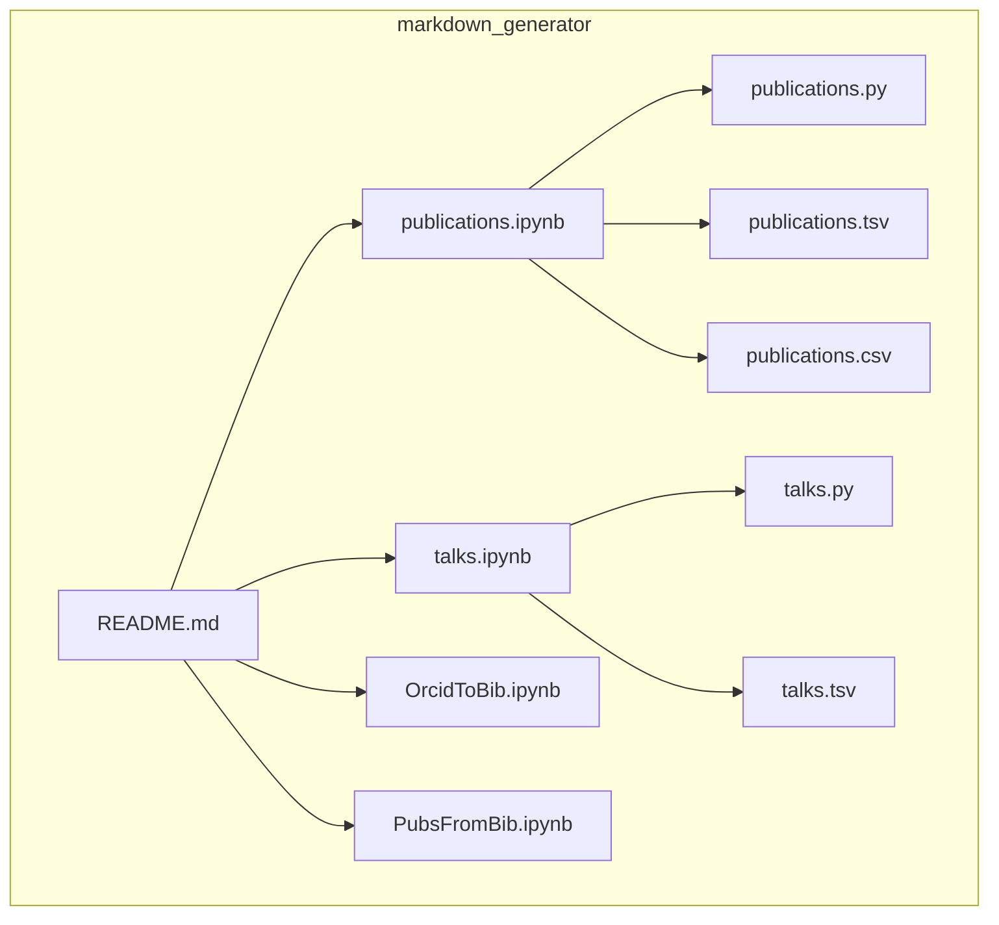
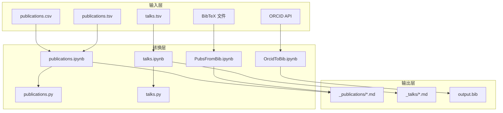
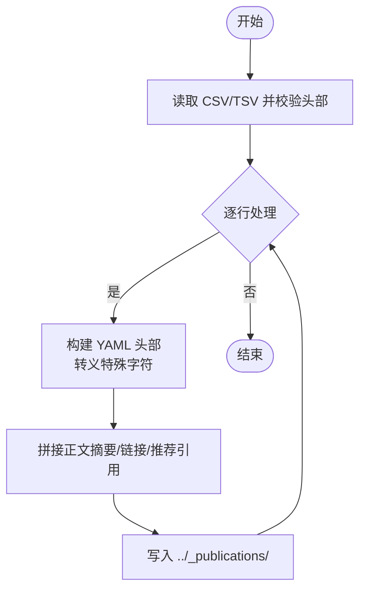
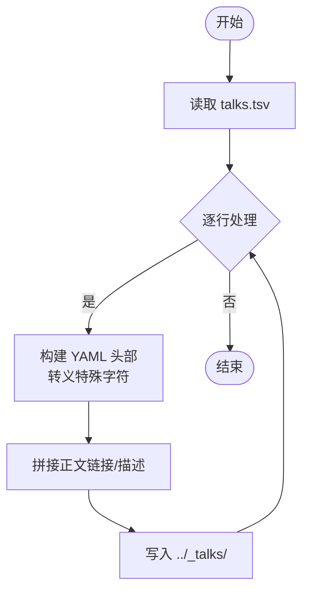
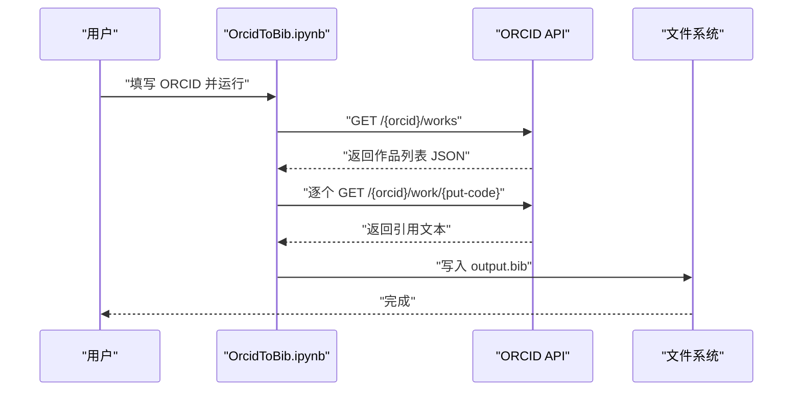
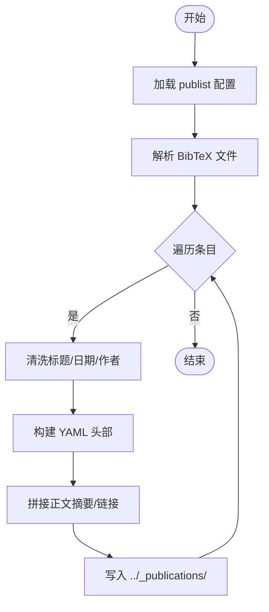
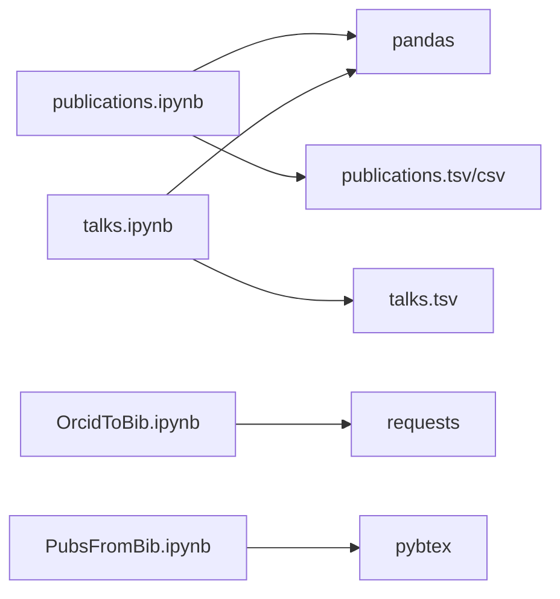

# Markdown 生成工具

<cite>
**本文引用的文件**
- [README.md](file://markdown_generator/README.md)
- [publications.ipynb](file://markdown_generator/publications.ipynb)
- [talks.ipynb](file://markdown_generator/talks.ipynb)
- [OrcidToBib.ipynb](file://markdown_generator/OrcidToBib.ipynb)
- [PubsFromBib.ipynb](file://markdown_generator/PubsFromBib.ipynb)
- [publications.py](file://markdown_generator/publications.py)
- [talks.py](file://markdown_generator/talks.py)
- [publications.csv](file://markdown_generator/publications.csv)
- [publications.tsv](file://markdown_generator/publications.tsv)
- [talks.tsv](file://markdown_generator/talks.tsv)
</cite>

## 目录
1. [简介](#简介)
2. [项目结构](#项目结构)
3. [核心组件](#核心组件)
4. [架构总览](#架构总览)
5. [详细组件分析](#详细组件分析)
6. [依赖关系分析](#依赖关系分析)
7. [性能考虑](#性能考虑)
8. [故障排查指南](#故障排查指南)
9. [结论](#结论)
10. [附录](#附录)

## 简介
本文件面向需要批量生成学术类页面 Markdown 的用户与开发者，系统性讲解 Markdown 生成工具在该仓库中的实现与使用方式。重点覆盖以下四个 Jupyter Notebook 工具及其对应的 Python 脚本：
- publications.ipynb 与 publications.py：将 TSV/CSV 格式的论文元数据转换为学术页面所需的 Markdown 文件。
- talks.ipynb 与 talks.py：将 TSV 格式的工作演讲元数据转换为学术页面所需的 Markdown 文件。
- OrcidToBib.ipynb：从 ORCID 获取作者作品的引用文本并导出为 BibTeX 文本文件。
- PubsFromBib.ipynb：从 BibTeX 文件解析条目，生成论文 Markdown。

同时，文档提供数据格式规范、处理流程、使用示例、常见问题与调试技巧，以及扩展与自定义开发建议，帮助从入门到进阶全面掌握。

## 项目结构
该工具位于 markdown_generator 目录下，包含 Jupyter Notebook、Python 脚本、示例数据文件与说明文档。整体采用“Notebook + 轻量脚本 + 示例数据”的组织方式，便于交互式探索与命令行部署。

图表来源
- [README.md:1-12](file://markdown_generator/README.md#L1-L12)
- [publications.ipynb:1-403](file://markdown_generator/publications.ipynb#L1-L403)
- [talks.ipynb:1-381](file://markdown_generator/talks.ipynb#L1-L381)
- [OrcidToBib.ipynb:1-119](file://markdown_generator/OrcidToBib.ipynb#L1-L119)
- [PubsFromBib.ipynb:1-223](file://markdown_generator/PubsFromBib.ipynb#L1-L223)
- [publications.py:1-120](file://markdown_generator/publications.py#L1-L120)
- [talks.py:1-112](file://markdown_generator/talks.py#L1-L112)
- [publications.csv:1-5](file://markdown_generator/publications.csv#L1-L5)
- [publications.tsv:1-4](file://markdown_generator/publications.tsv#L1-L4)
- [talks.tsv:1-5](file://markdown_generator/talks.tsv#L1-L5)

章节来源
- [README.md:1-12](file://markdown_generator/README.md#L1-L12)

## 核心组件
- publications.ipynb/publications.py：负责将论文元数据（TSV/CSV）转换为学术页面的 Markdown 文件，支持 YAML 头部字段与正文描述，自动转义特殊字符，输出至 ../_publications/。
- talks.ipynb/talks.py：负责将工作演讲元数据（TSV）转换为学术页面的 Markdown 文件，支持类型、地点、链接等字段，输出至 ../_talks/。
- OrcidToBib.ipynb：通过 ORCID API 拉取作者作品列表，再逐条获取引用文本，写入 output.bib。
- PubsFromBib.ipynb：解析 BibTeX 条目，构造论文 Markdown，支持按来源类型（会议论文、期刊）配置 venue 键与前置文本。

章节来源
- [publications.ipynb:1-403](file://markdown_generator/publications.ipynb#L1-L403)
- [talks.ipynb:1-381](file://markdown_generator/talks.ipynb#L1-L381)
- [OrcidToBib.ipynb:1-119](file://markdown_generator/OrcidToBib.ipynb#L1-L119)
- [PubsFromBib.ipynb:1-223](file://markdown_generator/PubsFromBib.ipynb#L1-L223)
- [publications.py:1-120](file://markdown_generator/publications.py#L1-L120)
- [talks.py:1-112](file://markdown_generator/talks.py#L1-L112)

## 架构总览
四个工具围绕“数据输入 → 解析/转换 → Markdown 输出”的主干流程展开，既支持交互式 Notebook 探索，也支持命令行脚本执行，便于在本地或 CI 环境中自动化。

图表来源
- [publications.ipynb:1-403](file://markdown_generator/publications.ipynb#L1-L403)
- [talks.ipynb:1-381](file://markdown_generator/talks.ipynb#L1-L381)
- [OrcidToBib.ipynb:1-119](file://markdown_generator/OrcidToBib.ipynb#L1-L119)
- [PubsFromBib.ipynb:1-223](file://markdown_generator/PubsFromBib.ipynb#L1-L223)
- [publications.py:1-120](file://markdown_generator/publications.py#L1-L120)
- [talks.py:1-112](file://markdown_generator/talks.py#L1-L112)

## 详细组件分析

### publications.ipynb 与 publications.py
- 数据输入格式
  - 支持 CSV 与 TSV；列名需包含 pub_date、title、venue、excerpt、citation、url_slug、paper_url、slides_url；可选列 category。
  - pub_date 必须为 YYYY-MM-DD；url_slug 用于生成文件名与永久链接。
- 处理逻辑
  - 读取文件并校验头部；对 YAML 字段进行 HTML 转义；拼接 Markdown 内容（含 YAML 头部与正文）；写入 ../_publications/。
  - 支持新增的 category 字段（若存在），否则默认 manuscripts。
- 输出结果
  - 生成以日期-slug 命名的 .md 文件，路径 ../_publications/。
- 使用示例
  - 准备 publications.tsv 或 publications.csv。
  - 在 Jupyter 中打开 publications.ipynb 并运行；或在命令行执行 python3 publications.py publications.csv。
- 验证方法
  - 检查 ../_publications/ 是否生成对应文件；打开任意 .md 文件确认 YAML 头部与正文内容。

图表来源
- [publications.ipynb:87-300](file://markdown_generator/publications.ipynb#L87-L300)
- [publications.py:76-120](file://markdown_generator/publications.py#L76-L120)

章节来源
- [publications.ipynb:21-300](file://markdown_generator/publications.ipynb#L21-L300)
- [publications.py:6-120](file://markdown_generator/publications.py#L6-L120)
- [publications.csv:1-5](file://markdown_generator/publications.csv#L1-L5)
- [publications.tsv:1-4](file://markdown_generator/publications.tsv#L1-L4)

### talks.ipynb 与 talks.py
- 数据输入格式
  - TSV 列：title、type、url_slug、venue、date、location、talk_url、description。
  - 必填项：title、url_slug、date；其余可空；type 默认为 Talk。
- 处理逻辑
  - 读取 TSV；对 YAML 字段进行 HTML 转义；根据字段存在性决定是否写入；输出 ../_talks/。
- 输出结果
  - 生成以日期-slug 命名的 .md 文件，路径 ../_talks/。
- 使用示例
  - 准备 talks.tsv。
  - 在 Jupyter 中打开 talks.ipynb 并运行；或在命令行执行 python3 talks.py（注意：脚本中仍包含读取固定文件名的逻辑，需按实际文件名调整）。
- 验证方法
  - 检查 ../_talks/ 是否生成对应文件；打开任意 .md 文件确认 YAML 头部与正文内容。

图表来源
- [talks.ipynb:82-294](file://markdown_generator/talks.ipynb#L82-L294)
- [talks.py:36-112](file://markdown_generator/talks.py#L36-L112)

章节来源
- [talks.ipynb:35-294](file://markdown_generator/talks.ipynb#L35-L294)
- [talks.py:16-112](file://markdown_generator/talks.py#L16-L112)
- [talks.tsv:1-5](file://markdown_generator/talks.tsv#L1-L5)

### OrcidToBib.ipynb
- 功能概述
  - 通过 ORCID API 获取作者作品列表，收集每篇作品的 put-code，再逐条请求引用文本，最终写入 output.bib。
- 使用步骤
  - 在 Notebook 中填写 ORCID 号，运行单元格获取引用文本并保存为 output.bib。
- 注意事项
  - 需要网络访问与有效 ORCID 访问权限；输出为纯文本引用，非标准 BibTeX，如需标准格式请结合其他工具处理。

图表来源
- [OrcidToBib.ipynb:32-94](file://markdown_generator/OrcidToBib.ipynb#L32-L94)

章节来源
- [OrcidToBib.ipynb:1-119](file://markdown_generator/OrcidToBib.ipynb#L1-L119)

### PubsFromBib.ipynb
- 功能概述
  - 从 BibTeX 文件解析条目，按配置选择 venue 键（如 journal 或 booktitle），生成论文 Markdown 并输出至 ../_publications/。
- 数据配置
  - publist：定义不同来源（如 proceeding、journal）对应的 BibTeX 文件、venue 键、前置文本与集合信息。
- 处理逻辑
  - 解析 BibTeX；提取年月日（含月份缩写/数字兼容）；清洗标题生成 url_slug；构造 YAML 与正文；写入 Markdown。
- 输出结果
  - 生成以日期-slug 命名的 .md 文件，路径 ../_publications/。

图表来源
- [PubsFromBib.ipynb:44-192](file://markdown_generator/PubsFromBib.ipynb#L44-L192)

章节来源
- [PubsFromBib.ipynb:1-223](file://markdown_generator/PubsFromBib.ipynb#L1-L223)

## 依赖关系分析
- 组件内聚与耦合
  - publications.ipynb 与 talks.ipynb 分别独立处理各自数据源，耦合度低；OrcidToBib.ipynb 与 PubsFromBib.ipynb 分别面向外部服务与本地文件，职责清晰。
- 外部依赖
  - pandas（TSV/CSV 处理）、requests（ORCID API）、pybtex（BibTeX 解析）。
- 文件依赖
  - publications.ipynb/talks.ipynb 依赖示例数据文件（publications.tsv、talks.tsv）；Python 脚本依赖命令行参数与固定文件名约定。

图表来源
- [publications.ipynb:73-200](file://markdown_generator/publications.ipynb#L73-L200)
- [talks.ipynb:27-198](file://markdown_generator/talks.ipynb#L27-L198)
- [OrcidToBib.ipynb:20-41](file://markdown_generator/OrcidToBib.ipynb#L20-L41)
- [PubsFromBib.ipynb:28-35](file://markdown_generator/PubsFromBib.ipynb#L28-L35)

章节来源
- [publications.ipynb:73-200](file://markdown_generator/publications.ipynb#L73-L200)
- [talks.ipynb:27-198](file://markdown_generator/talks.ipynb#L27-L198)
- [OrcidToBib.ipynb:20-41](file://markdown_generator/OrcidToBib.ipynb#L20-L41)
- [PubsFromBib.ipynb:28-35](file://markdown_generator/PubsFromBib.ipynb#L28-L35)

## 性能考虑
- I/O 与循环
  - 四个工具均采用逐行/逐条遍历写入，时间复杂度近似 O(N)；N 为记录数。建议在大数据集时避免重复读取与不必要的字符串拼接。
- 字符转义
  - HTML 转义仅针对 YAML/正文中的特殊字符，开销较小；保持在循环内部进行可减少中间变量。
- 网络请求
  - OrcidToBib.ipynb 对 ORCID API 的请求为线性次数，建议控制并发与重试策略，避免触发限流。
- 编码与路径
  - PubsFromBib.ipynb 明确指定 UTF-8 写入，避免编码问题；统一使用相对路径 ../_publications/ 与 ../_talks/，便于部署。

## 故障排查指南
- 文件未找到或路径错误
  - 确认当前工作目录位于 markdown_generator；检查 ../_publications/ 与 ../_talks/ 是否存在且可写。
- 数据格式错误
  - publications.tsv/csv 与 talks.tsv 必须包含正确表头；pub_date 必须为 YYYY-MM-DD；缺失必填字段会导致处理失败或输出不完整。
- YAML 渲染异常
  - 特殊字符（引号、&）需被转义；若出现渲染错误，请检查 html_escape 表达式是否覆盖所有必要字符。
- ORCID 请求失败
  - 确认网络连通与 ORCID 访问权限；检查 put-code 收集是否成功；逐条请求引用文本时注意响应状态。
- BibTeX 解析异常
  - 某些条目可能缺少 year/month/day 或作者字段；PubsFromBib.ipynb 已捕获 KeyError 并跳过，但需关注缺失字段提示。
- 命令行脚本执行
  - publications.py/talks.py 需要传入文件名参数；确保文件扩展名为 .csv 或 .tsv。

章节来源
- [publications.ipynb:21-300](file://markdown_generator/publications.ipynb#L21-L300)
- [talks.ipynb:35-294](file://markdown_generator/talks.ipynb#L35-L294)
- [OrcidToBib.ipynb:32-94](file://markdown_generator/OrcidToBib.ipynb#L32-L94)
- [PubsFromBib.ipynb:189-192](file://markdown_generator/PubsFromBib.ipynb#L189-L192)
- [publications.py:105-120](file://markdown_generator/publications.py#L105-L120)
- [talks.py:106-112](file://markdown_generator/talks.py#L106-L112)

## 结论
本工具提供了从本地数据（TSV/CSV/BibTeX）到 Markdown 的完整转换链路，既适合交互式探索，也可在命令行或 CI 环境中自动化执行。通过统一的数据格式与严格的字段校验，能够稳定生成符合学术页面模板的 Markdown 文件。对于更复杂的引用管理与多数据库集成，可在现有基础上扩展配置与解析逻辑。

## 附录

### 数据格式与转换规则
- TSV/CSV（论文）
  - 必填列：pub_date、title、venue、citation、url_slug；可选列：excerpt、paper_url、slides_url、category。
  - pub_date：YYYY-MM-DD；url_slug 作为文件名与永久链接的一部分。
- TSV（演讲）
  - 必填列：title、url_slug、date；可选列：type、venue、location、talk_url、description。
  - url_slug + date 组合需唯一。
- BibTeX（论文）
  - 支持 journal 与 booktitle 等 venue 键；自动解析年月日（兼容月份缩写与数字）；清洗标题生成 url_slug；按配置生成 YAML 与正文。

章节来源
- [publications.ipynb:21-300](file://markdown_generator/publications.ipynb#L21-L300)
- [talks.ipynb:35-294](file://markdown_generator/talks.ipynb#L35-L294)
- [PubsFromBib.ipynb:44-192](file://markdown_generator/PubsFromBib.ipynb#L44-L192)

### 使用示例（步骤与验证）
- 论文（TSV/CSV）
  - 步骤：准备 publications.tsv 或 publications.csv；在 Jupyter 运行 publications.ipynb，或命令行执行 publications.py；检查 ../_publications/。
  - 验证：打开任意 .md 文件，确认 YAML 头部与正文内容。
- 演讲（TSV）
  - 步骤：准备 talks.tsv；在 Jupyter 运行 talks.ipynb，或命令行执行 talks.py；检查 ../_talks/。
  - 验证：打开任意 .md 文件，确认 YAML 头部与正文内容。
- ORCID 引用
  - 步骤：在 OrcidToBib.ipynb 填写 ORCID；运行获取引用并保存 output.bib。
  - 验证：查看 output.bib 内容是否包含引用文本。
- BibTeX 论文
  - 步骤：准备 proceedings.bib 与 pubs.bib；在 PubsFromBib.ipynb 配置 publist；运行生成 ../_publications/ 下的 Markdown。

章节来源
- [publications.ipynb:87-300](file://markdown_generator/publications.ipynb#L87-L300)
- [talks.ipynb:82-294](file://markdown_generator/talks.ipynb#L82-L294)
- [OrcidToBib.ipynb:32-94](file://markdown_generator/OrcidToBib.ipynb#L32-L94)
- [PubsFromBib.ipynb:44-192](file://markdown_generator/PubsFromBib.ipynb#L44-L192)

### 自定义开发指南
- 扩展数据源
  - 新增数据源时，建议在 Python 脚本中增加参数化文件名与分隔符检测，提升通用性。
- 增强字段映射
  - 将 YAML 字段与数据列的映射抽象为配置表，便于维护与扩展。
- 错误处理与日志
  - 在循环中记录缺失字段与异常条目，便于后续修复与审计。
- 并发与批处理
  - 对网络请求（如 ORCID）与大文件解析，可引入并发与断点续跑机制。
- 模板化输出
  - 将 Markdown 模板抽离为外部文件，便于统一风格与版本管理。