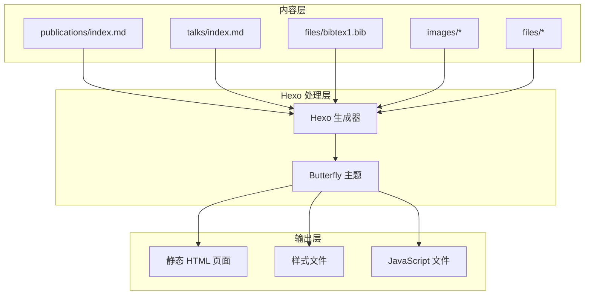
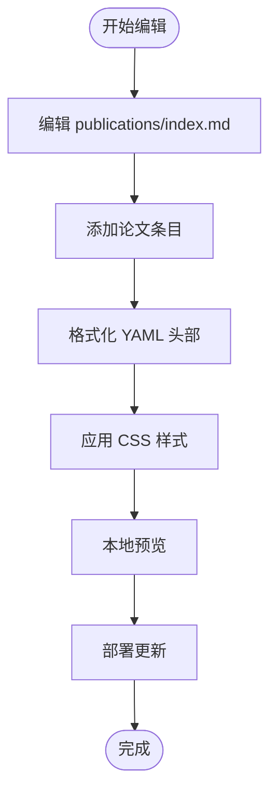
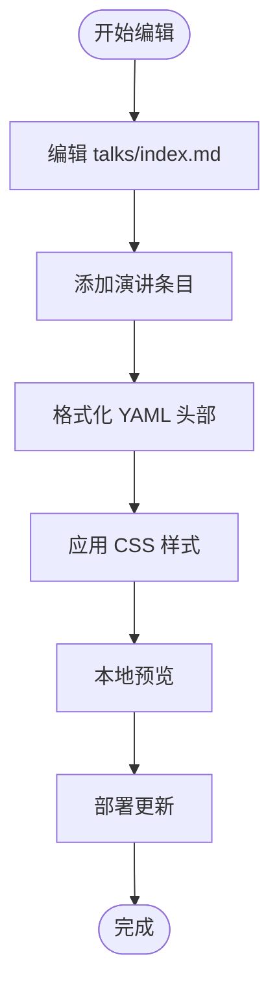
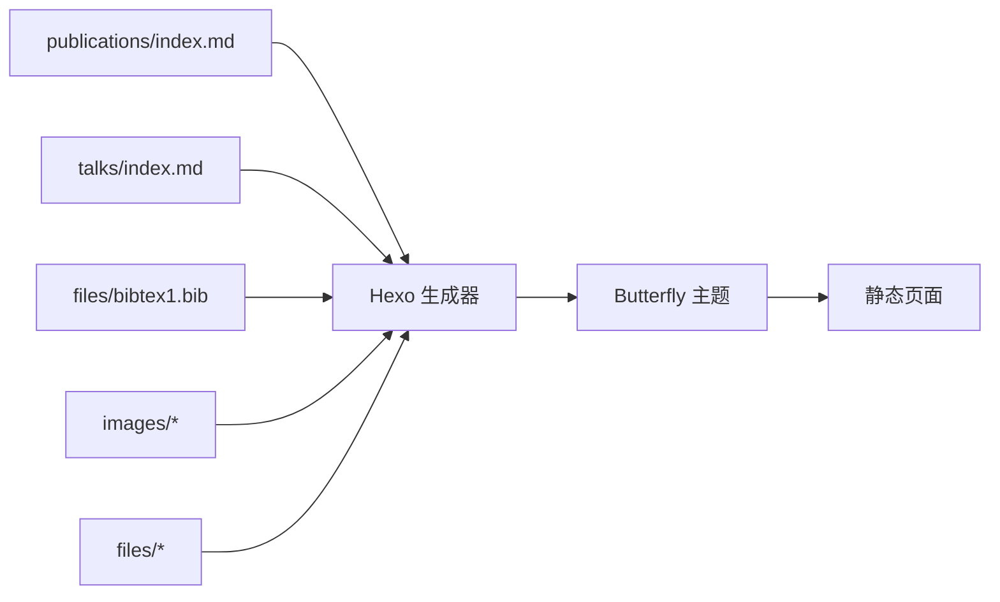

# Markdown 生成工具

<cite>
**本文引用的文件**
- [README.md](file://README.md)
- [开发文档.md](file://开发文档.md)
- [publications/index.md](file://hexo-site/source/publications/index.md)
- [talks/index.md](file://hexo-site/source/talks/index.md)
- [bibtex1.bib](file://hexo-site/source/files/bibtex1.bib)
</cite>

## 更新摘要
**所做更改**
- 移除了所有 Jupyter Notebook 和 Python 脚本相关内容
- 更新了项目结构说明，反映当前基于 Hexo 的静态网站架构
- 删除了复杂的 Markdown 生成工具和自动化转换功能
- 保留了手动编辑 Markdown 的传统方法说明

## 目录
1. [简介](#简介)
2. [项目结构](#项目结构)
3. [核心组件](#核心组件)
4. [架构总览](#架构总览)
5. [详细组件分析](#详细组件分析)
6. [依赖关系分析](#依赖关系分析)
7. [性能考虑](#性能考虑)
8. [故障排查指南](#故障排查指南)
9. [结论](#结论)
10. [附录](#附录)

## 简介
本文件面向需要管理和维护学术类个人网站的用户与开发者，系统性讲解基于 Hexo + Butterfly 主题的静态网站构建与维护方法。**重要更新**：复杂的 Markdown 生成工具和 Jupyter 笔记本已完全移除，项目现采用传统的手动编辑方式维护学术页面。

重点覆盖以下核心功能：
- 论文页面（publications/index.md）：展示学术论文列表，支持按年份和类型分类
- 演讲页面（talks/index.md）：展示学术报告和演讲内容
- BibTeX 文件管理：支持学术引用数据的导入和管理
- 手动编辑流程：通过直接编辑 Markdown 文件维护内容

同时，文档提供完整的使用示例、数据格式规范、常见问题解决方案和调试技巧，帮助用户从基础使用到高级定制全面掌握。

## 项目结构
项目采用 Hexo 静态网站生成器架构，所有内容都通过手动编辑 Markdown 文件来维护。整体采用"静态文件 + 主题模板"的组织方式，便于版本控制和部署。

```mermaid
graph TB
subgraph "hexo-site"
HS["hexo-site/"]
CFG["_config.yml<br/>站点配置"]
CFGB["_config.butterfly.yml<br/>主题配置"]
SRC["source/<br/>内容目录"]
POSTS["_posts/<br/>博客文章"]
ABOUT["about/<br/>关于页面"]
CV["cv/<br/>简历页面"]
PUB["publications/<br/>论文页面"]
TALKS["talks/<br/>演讲页面"]
TEACH["teaching/<br/>教学页面"]
PORT["portfolio/<br/>作品集页面"]
FILES["files/<br/>文件资源"]
IMAGES["images/<br/>图片资源"]
END
HS --> CFG
HS --> CFGB
HS --> SRC
SRC --> POSTS
SRC --> ABOUT
SRC --> CV
SRC --> PUB
SRC --> TALKS
SRC --> TEACH
SRC --> PORT
SRC --> FILES
SRC --> IMAGES
```

**图表来源**
- [开发文档.md:7-32](file://开发文档.md#L7-L32)
- [README.md:14](file://README.md#L14)

**章节来源**
- [开发文档.md:7-32](file://开发文档.md#L7-L32)
- [README.md:14](file://README.md#L14)

## 核心组件
- **论文页面**：通过手动编辑 publications/index.md 维护学术论文列表，支持期刊论文和会议论文的分类展示
- **演讲页面**：通过手动编辑 talks/index.md 维护学术报告和演讲内容
- **BibTeX 文件**：通过直接编辑 bibtex1.bib 文件管理学术引用数据
- **静态内容**：所有页面内容均为静态 Markdown 文件，无需复杂的转换工具

**章节来源**
- [publications/index.md:1-58](file://hexo-site/source/publications/index.md#L1-L58)
- [talks/index.md:1-57](file://hexo-site/source/talks/index.md#L1-L57)
- [bibtex1.bib:1-11](file://hexo-site/source/files/bibtex1.bib#L1-L11)

## 架构总览
项目采用传统的静态网站生成架构，所有内容通过手动编辑 Markdown 文件维护，无需复杂的自动化转换工具。用户可以直接编辑内容文件，然后通过 Hexo 生成静态页面。



**图表来源**
- [开发文档.md:188-271](file://开发文档.md#L188-L271)
- [README.md:14](file://README.md#L14)

## 详细组件分析

### 论文页面（publications/index.md）
- **功能概述**：展示学术论文列表，支持按年份和类型（期刊论文、会议论文）分类
- **数据格式**：纯 Markdown 格式，包含 YAML 头部和内容区域
- **布局特点**：使用 HTML div 容器和自定义 CSS 样式美化展示效果
- **内容结构**：包含论文标题、期刊信息、PDF 链接和推荐引用格式

**使用示例**
- 直接编辑 publications/index.md 文件
- 添加新的论文条目到相应年份和类型的列表中
- 使用 Markdown 语法编写论文描述和链接

**验证方法**
- 本地运行 `hexo server` 查看实时预览
- 检查生成的静态页面是否正确显示论文列表



**图表来源**
- [publications/index.md:1-58](file://hexo-site/source/publications/index.md#L1-L58)

**章节来源**
- [publications/index.md:1-58](file://hexo-site/source/publications/index.md#L1-L58)
- [开发文档.md:246-271](file://开发文档.md#L246-L271)

### 演讲页面（talks/index.md）
- **功能概述**：展示学术报告和演讲内容，支持不同类型（会议演讲、教程等）的分类
- **数据格式**：纯 Markdown 格式，包含 YAML 头部和内容区域
- **布局特点**：使用 HTML div 容器和自定义 CSS 样式展示演讲信息
- **内容结构**：包含演讲标题、会议信息、时间和地点等详细信息

**使用示例**
- 直接编辑 talks/index.md 文件
- 添加新的演讲条目到相应类型的列表中
- 使用 Markdown 语法编写演讲描述和相关信息

**验证方法**
- 本地运行 `hexo server` 查看实时预览
- 检查生成的静态页面是否正确显示演讲列表



**图表来源**
- [talks/index.md:1-57](file://hexo-site/source/talks/index.md#L1-L57)

**章节来源**
- [talks/index.md:1-57](file://hexo-site/source/talks/index.md#L1-L57)
- [开发文档.md:273-290](file://开发文档.md#L273-L290)

### BibTeX 文件管理（bibtex1.bib）
- **功能概述**：管理学术引用数据，支持标准 BibTeX 格式
- **数据格式**：标准 BibTeX 格式，包含各种文献类型的条目
- **使用场景**：作为学术引用数据的存储和备份
- **集成方式**：可与其他工具配合使用，但当前项目主要通过手动编辑维护

**使用示例**
- 直接编辑 bibtex1.bib 文件
- 添加新的文献条目
- 使用标准 BibTeX 语法格式化条目

**验证方法**
- 检查文件编码是否为 UTF-8
- 确保 BibTeX 语法格式正确

**章节来源**
- [bibtex1.bib:1-11](file://hexo-site/source/files/bibtex1.bib#L1-L11)

## 依赖关系分析
- **组件内聚**：所有内容都通过静态文件维护，组件间耦合度极低
- **外部依赖**：主要依赖 Hexo 静态网站生成器和 Butterfly 主题
- **文件依赖**：内容文件之间无复杂依赖关系，便于独立维护



**图表来源**
- [开发文档.md:188-271](file://开发文档.md#L188-L271)

## 性能考虑
- **加载速度**：静态页面无需服务器端处理，加载速度快
- **维护成本**：手动编辑方式简单直观，学习成本低
- **部署效率**：GitHub Pages 部署简单，无需复杂的构建环境
- **版本控制**：所有内容均可通过 Git 进行版本管理

## 故障排查指南
- **页面未更新**
  - 确认已运行 `hexo clean && hexo server` 命令
  - 检查文件编码是否为 UTF-8
  - 验证 YAML 头部格式是否正确
  
- **样式显示异常**
  - 检查 CSS 文件是否正确加载
  - 验证 HTML 结构是否符合主题要求
  - 确认图片路径是否正确

- **部署失败**
  - 检查 GitHub Pages 配置
  - 验证部署密钥设置
  - 确认网络连接正常

- **内容格式错误**
  - 检查 Markdown 语法
  - 验证 YAML 格式（冒号后需有空格）
  - 确认缩进格式正确

**章节来源**
- [开发文档.md:514-536](file://开发文档.md#L514-L536)

## 结论
项目已完全移除复杂的 Markdown 生成工具和自动化转换功能，采用传统的手动编辑方式维护学术页面。这种方式具有以下优势：
- 简单直观，易于理解和维护
- 无需复杂的依赖关系和配置
- 便于版本控制和协作
- 部署简单，成本低廉

对于需要批量处理学术内容的用户，建议采用手动编辑的方式，虽然需要更多的人工工作，但获得了更好的可控性和稳定性。

## 附录

### 数据格式与转换规则
- **Markdown 格式**：使用标准 Markdown 语法，支持 YAML 头部
- **YAML 格式**：配置文件使用英文冒号，冒号后必须有空格
- **日期格式**：使用 `YYYY-MM-DD HH:mm:ss` 格式
- **文件编码**：所有 `.md` 文件使用 UTF-8 编码

**章节来源**
- [开发文档.md:503-511](file://开发文档.md#L503-L511)

### 使用示例（步骤与验证）
- **论文页面编辑**
  - 步骤：编辑 `hexo-site/source/publications/index.md` 文件
  - 验证：本地运行 `hexo server` 查看效果，确认页面正确显示

- **演讲页面编辑**
  - 步骤：编辑 `hexo-site/source/talks/index.md` 文件
  - 验证：本地预览确认演讲列表显示正确

- **BibTeX 文件管理**
  - 步骤：编辑 `hexo-site/source/files/bibtex1.bib` 文件
  - 验证：检查文件格式是否符合标准 BibTeX 规范

**章节来源**
- [publications/index.md:1-58](file://hexo-site/source/publications/index.md#L1-L58)
- [talks/index.md:1-57](file://hexo-site/source/talks/index.md#L1-L57)
- [bibtex1.bib:1-11](file://hexo-site/source/files/bibtex1.bib#L1-L11)

### 自定义开发指南
- **主题定制**
  - 修改 `_config.butterfly.yml` 文件定制外观
  - 自定义 CSS 样式文件
  - 添加新的页面类型

- **内容扩展**
  - 在 `source/` 目录下创建新的页面
  - 添加新的导航菜单项
  - 配置社交媒体链接

- **部署优化**
  - 配置 GitHub Actions 自动部署
  - 设置自定义域名
  - 优化 SEO 设置

**章节来源**
- [开发文档.md:448-501](file://开发文档.md#L448-L501)