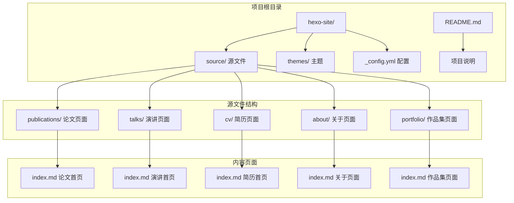
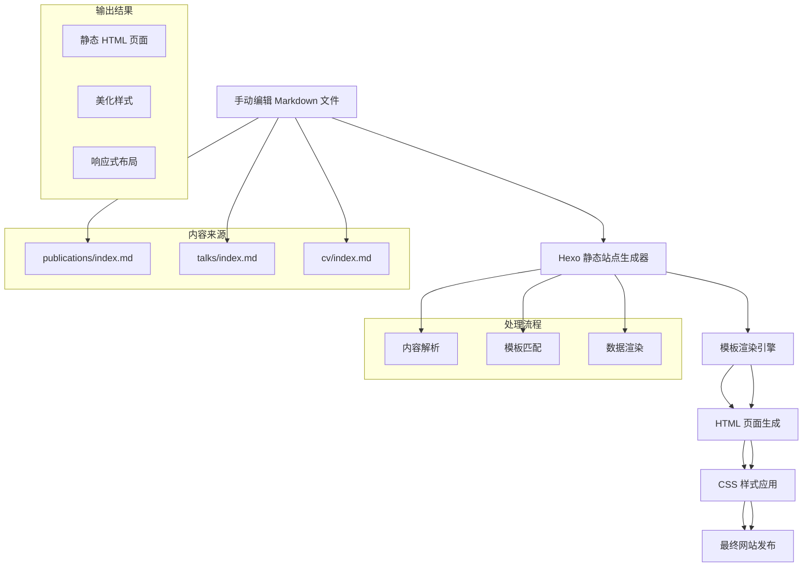
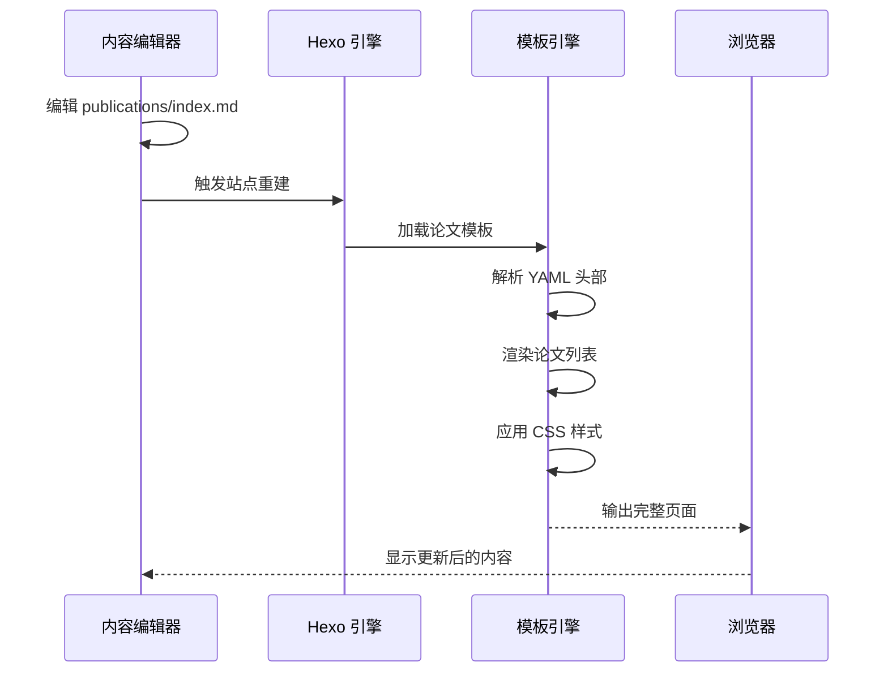
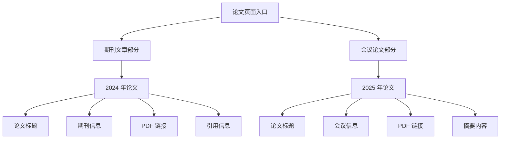
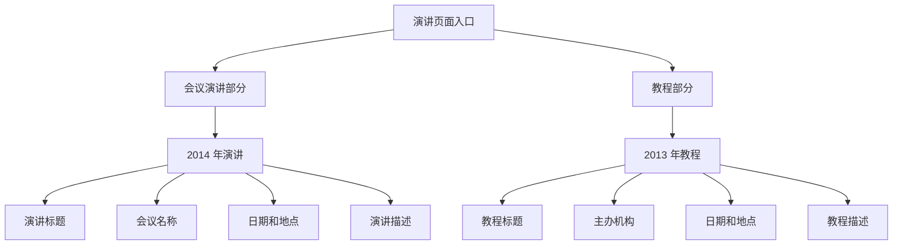
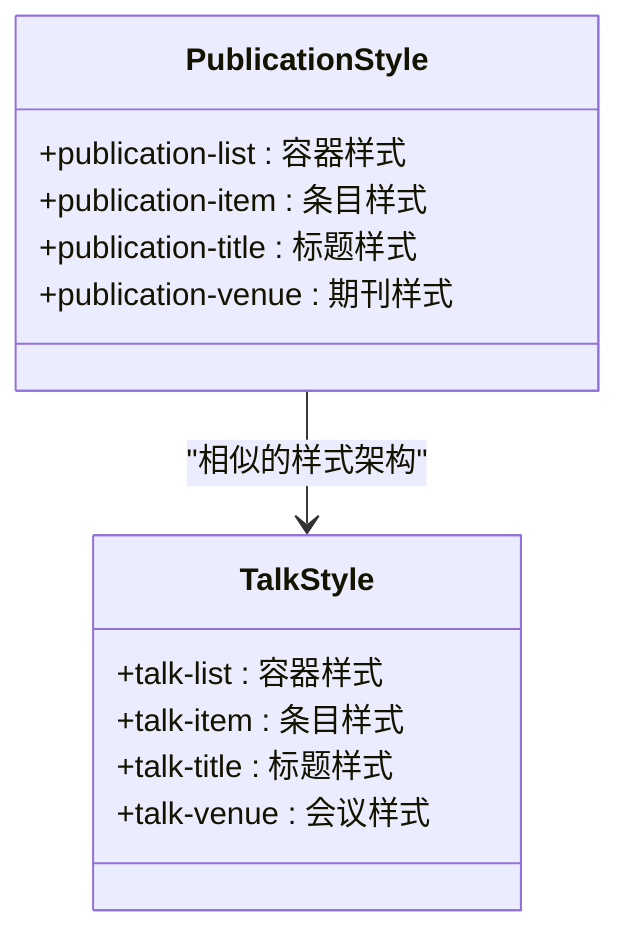
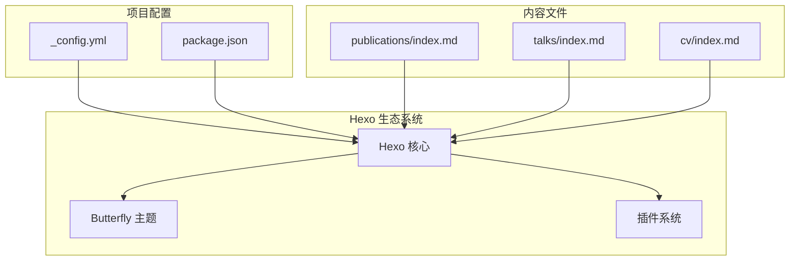
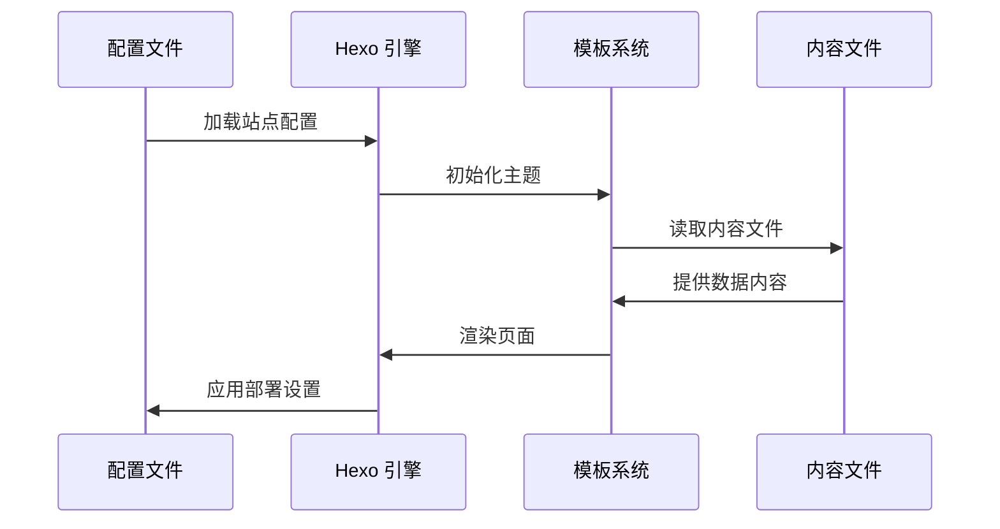
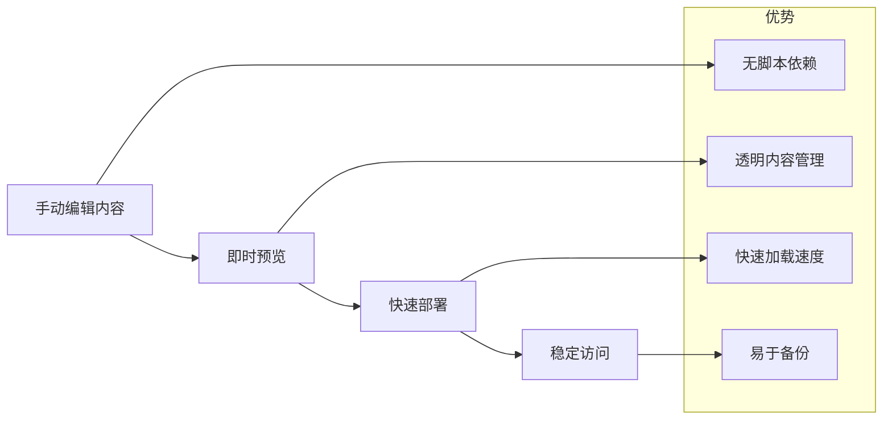

# Python 数据处理脚本

<cite>
**本文档引用的文件**
- [README.md](file://README.md)
- [publications/index.md](file://hexo-site/source/publications/index.md)
- [talks/index.md](file://hexo-site/source/talks/index.md)
- [_config.yml](file://hexo-site/_config.yml)
</cite>

## 更新摘要
**所做更改**
- 移除了所有 Python 数据处理脚本相关内容
- 更新了项目结构说明以反映脚本已完全移除
- 调整了使用说明以反映手动编辑 Markdown 文件的方式
- 更新了架构概览以反映新的手动维护流程

## 目录
1. [简介](#简介)
2. [项目结构](#项目结构)
3. [核心组件](#核心组件)
4. [架构概览](#架构概览)
5. [详细组件分析](#详细组件分析)
6. [依赖关系分析](#依赖关系分析)
7. [性能考虑](#性能考虑)
8. [故障排除指南](#故障排除指南)
9. [结论](#结论)
10. [附录](#附录)

## 简介

**重要更新**：本项目已完全移除 Python 数据处理脚本和相关工具。现在采用纯手工编辑的 Markdown 文件方式来管理学术论文和演讲内容。

项目采用传统的静态网站生成方式，通过直接编辑 Markdown 文件来维护学术成果信息。这种方式更加透明、可控，便于直接查看和修改内容，无需额外的脚本依赖。

## 项目结构

项目采用清晰的 Hexo 静态站点结构，主要包含以下关键目录：



**图表来源**
- [publications/index.md:1-58](file://hexo-site/source/publications/index.md#L1-L58)
- [talks/index.md:1-57](file://hexo-site/source/talks/index.md#L1-L57)
- [_config.yml:1-142](file://hexo-site/_config.yml#L1-L142)

**章节来源**
- [README.md:14](file://README.md#L14)
- [publications/index.md:1-58](file://hexo-site/source/publications/index.md#L1-L58)
- [talks/index.md:1-57](file://hexo-site/source/talks/index.md#L1-L57)

## 核心组件

### 论文页面组件

论文页面采用手动编辑的 Markdown 格式，包含完整的学术论文信息展示：

#### 主要功能特性

1. **手动编辑**：直接编辑 Markdown 文件进行内容更新
2. **分类组织**：按期刊文章和会议论文进行分类
3. **样式定制**：内置 CSS 样式美化显示效果
4. **响应式设计**：适配不同设备的显示需求

#### 页面结构特点

| 区域 | 内容 | 功能 |
|------|------|------|
| 标题区域 | 学术论文 | 页面标题和基本描述 |
| 期刊文章 | Journal Articles | 期刊发表论文列表 |
| 会议论文 | Conference Papers | 会议发表论文列表 |
| 样式区域 | CSS 样式 | 页面美化和布局控制 |

**章节来源**
- [publications/index.md:1-58](file://hexo-site/source/publications/index.md#L1-L58)

### 演讲页面组件

演讲页面同样采用手动编辑方式，支持多种类型的学术活动：

#### 主要功能特性

1. **类型分类**：支持会议演讲、教程、研讨会等不同类型
2. **时间组织**：按年份对演讲活动进行排序
3. **地点信息**：显示演讲的举办城市和国家
4. **描述内容**：提供详细的演讲内容介绍

#### 数据结构特点

| 字段名 | 必填 | 描述 | 示例 |
|--------|------|------|------|
| 标题 | ✓ | 演讲主题 | "Conference Proceeding Talk 3" |
| 会议 | ✓ | 举办机构 | "Testing Institute of America 2014 Annual Conference" |
| 日期 | ✓ | 演讲日期 | "2014-03-01" |
| 地点 | ✓ | 举办城市 | "Los Angeles, CA, USA" |
| 描述 | ✗ | 演讲内容概述 | "This is a description..." |

**章节来源**
- [talks/index.md:1-57](file://hexo-site/source/talks/index.md#L1-L57)

## 架构概览

系统采用纯静态网站架构，从内容编辑到最终展示的完整流程如下：



**图表来源**
- [publications/index.md:1-58](file://hexo-site/source/publications/index.md#L1-L58)
- [talks/index.md:1-57](file://hexo-site/source/talks/index.md#L1-L57)
- [_config.yml:119-142](file://hexo-site/_config.yml#L119-L142)

## 详细组件分析

### 论文页面详细分析

#### 页面渲染流程



**图表来源**
- [publications/index.md:1-58](file://hexo-site/source/publications/index.md#L1-L58)
- [_config.yml:119-142](file://hexo-site/_config.yml#L119-L142)

#### 内容组织结构



**图表来源**
- [publications/index.md:14-39](file://hexo-site/source/publications/index.md#L14-L39)

### 演讲页面详细分析

#### 数据展示流程



**图表来源**
- [talks/index.md:14-38](file://hexo-site/source/talks/index.md#L14-L38)

#### 样式应用机制



**图表来源**
- [publications/index.md:41-57](file://hexo-site/source/publications/index.md#L41-L57)
- [talks/index.md:40-56](file://hexo-site/source/talks/index.md#L40-L56)

**章节来源**
- [talks/index.md:1-57](file://hexo-site/source/talks/index.md#L1-L57)

## 依赖关系分析

### 外部依赖

系统依赖关系相对简单，主要依赖于 Hexo 静态站点生成器：



**图表来源**
- [_config.yml:119-142](file://hexo-site/_config.yml#L119-L142)
- [publications/index.md:1-58](file://hexo-site/source/publications/index.md#L1-L58)
- [talks/index.md:1-57](file://hexo-site/source/talks/index.md#L1-L57)

### 内部组件交互



**图表来源**
- [_config.yml:119-142](file://hexo-site/_config.yml#L119-L142)

**章节来源**
- [_config.yml:1-142](file://hexo-site/_config.yml#L1-L142)

## 性能考虑

### 处理效率优化

1. **静态生成**：采用预生成静态页面，无需运行时处理
2. **轻量级架构**：减少不必要的依赖和复杂性
3. **缓存友好**：浏览器可以有效缓存静态资源

### 维护效率提升



**图表来源**
- [publications/index.md:1-58](file://hexo-site/source/publications/index.md#L1-L58)
- [talks/index.md:1-57](file://hexo-site/source/talks/index.md#L1-L57)

### 内存使用模式

| 操作类型 | 内存使用 | 优化建议 |
|----------|----------|----------|
| 内容编辑 | 本地文本编辑器 | 使用轻量级编辑器 |
| 站点生成 | 一次性内存分配 | 使用默认配置 |
| 预览服务 | 开发服务器内存 | 合理配置内存限制 |
| 部署发布 | 无运行时内存 | 静态文件部署 |

## 故障排除指南

### 常见问题及解决方案

#### 内容显示异常

**问题症状**：
- 页面内容不显示或显示不完整
- 样式错乱或布局异常

**解决步骤**：
1. 检查 Markdown 语法是否正确
2. 验证 YAML 头部格式
3. 确认文件编码为 UTF-8
4. 检查 CSS 样式是否正确加载

#### 站点生成错误

**问题症状**：
- Hexo 生成过程中出现错误
- 预览服务器启动失败

**解决步骤**：
1. 检查 Node.js 版本兼容性
2. 验证依赖包安装完整性
3. 清理缓存文件重新安装
4. 检查配置文件语法

#### 部署问题

**问题症状**：
- GitHub Pages 部署失败
- 自定义域名解析异常

**解决步骤**：
1. 检查 GitHub Actions 工作流状态
2. 验证部署分支设置
3. 确认域名 DNS 配置
4. 检查 SSL 证书状态

### 调试技巧

#### 启用详细日志

```bash
# 启用 Hexo 详细日志
hexo clean && hexo g -v

# 启用开发模式预览
hexo s -p 4000
```

#### 内容验证工具

```yaml
# 检查 YAML 头部格式
---
title: "页面标题"
date: 2025-01-01
type: "publications"
layout: "page"
comments: false
---
```

#### 错误处理最佳实践

```bash
# 清理缓存重新生成
hexo clean
npm cache clean --force
rm -rf node_modules
npm install
hexo g
```

**章节来源**
- [README.md:18-72](file://README.md#L18-L72)

## 结论

本项目现已完全移除 Python 数据处理脚本，采用更加简洁、透明的手工编辑方式。这种新的架构具有以下优势：

1. **简化依赖**：移除了复杂的脚本依赖，只保留必要的 Hexo 依赖
2. **提高透明度**：内容直接以 Markdown 格式存储，便于理解和修改
3. **增强稳定性**：静态生成方式减少了运行时错误的可能性
4. **改善性能**：预生成静态页面提供更快的加载速度
5. **降低维护成本**：减少了需要维护的代码量

通过直接编辑 Markdown 文件的方式，用户可以更直观地管理学术成果信息，同时保持了与 Hexo 生态系统的良好集成。

## 附录

### 使用示例

#### 基本使用方法

```bash
# 安装依赖
npm install

# 本地预览
hexo s

# 生成静态文件
hexo g

# 部署到 GitHub Pages
hexo d
```

#### 内容编辑示例

```markdown
# 学术论文

## 📚 Journal Articles

### 2024

**论文标题**  
*期刊名称*, 年份  
📄 [PDF](/files/paper.pdf)  
作者. (年份). "论文标题." *期刊名称*. 卷(期).

## 📝 Conference Papers

### 2025

**论文标题**  
*会议名称*, 年份  
📄 [PDF](/files/paper.pdf)  
作者. (年份). "论文标题." *会议名称*. 卷(期).
```

### 自定义开发指南

#### 扩展页面类型

要添加新的页面类型，需要：

1. 创建新的 Markdown 文件
2. 添加适当的 YAML 头部
3. 在导航中添加链接
4. 更新样式文件

#### 主题定制

```yaml
# 在 _config.yml 中配置主题
theme: butterfly
butterfly:
  live2d:
    enable: false
```

#### 性能优化建议

1. **图片优化**：压缩图片大小，使用现代格式
2. **CSS 优化**：合并和压缩样式文件
3. **JavaScript 优化**：延迟加载非关键脚本
4. **缓存策略**：配置合适的 HTTP 缓存头

**章节来源**
- [README.md:18-72](file://README.md#L18-L72)
- [publications/index.md:1-58](file://hexo-site/source/publications/index.md#L1-L58)
- [talks/index.md:1-57](file://hexo-site/source/talks/index.md#L1-L57)