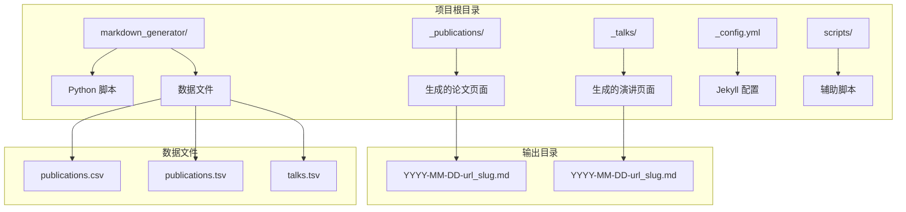
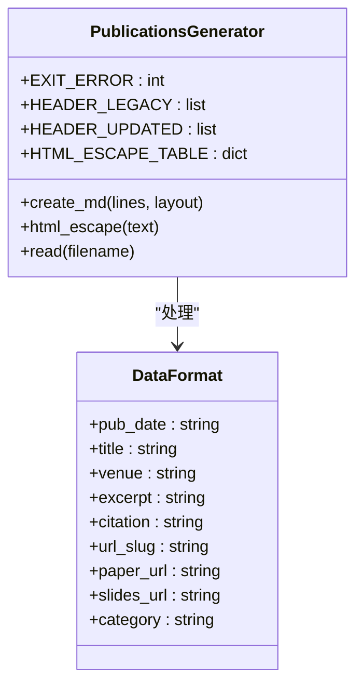
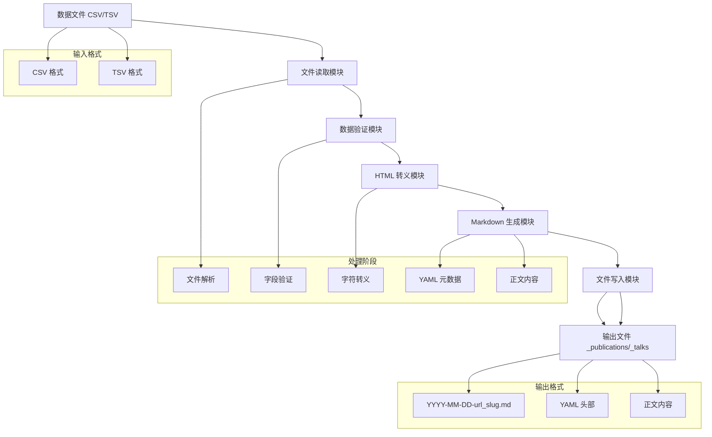
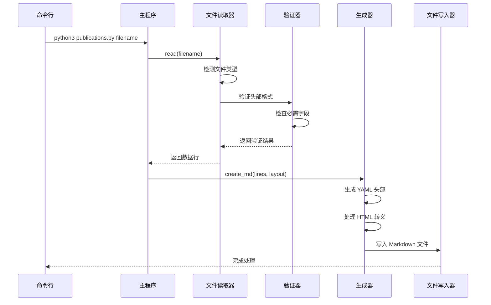
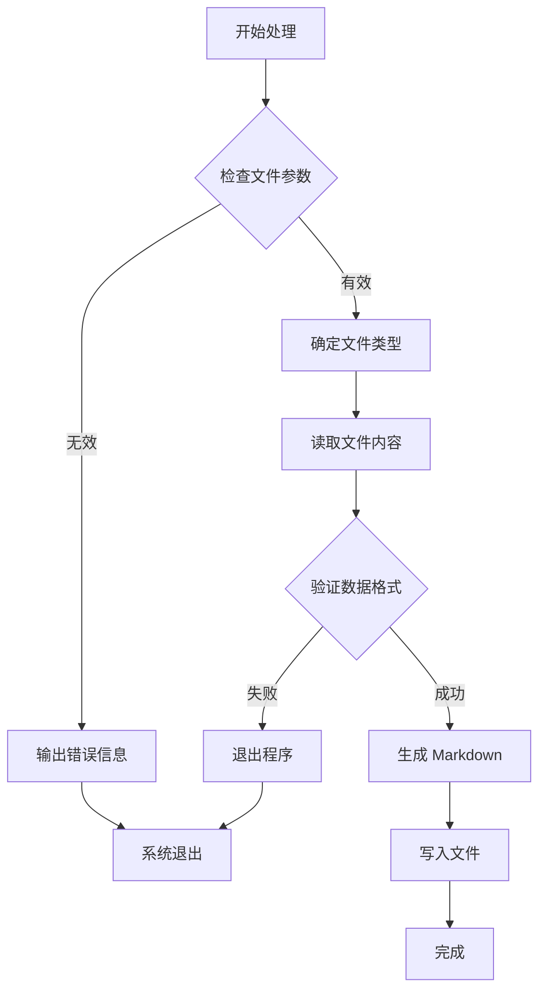
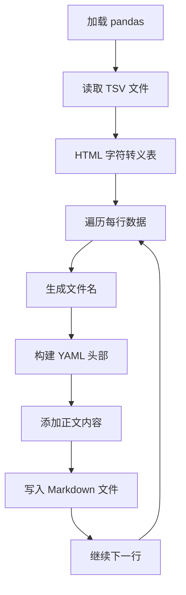
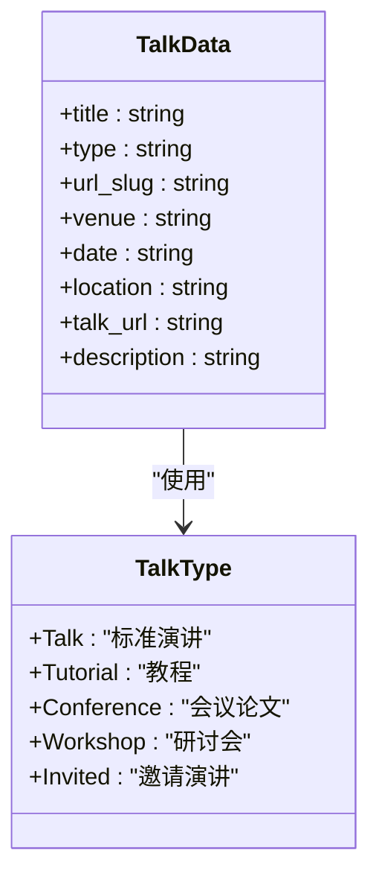
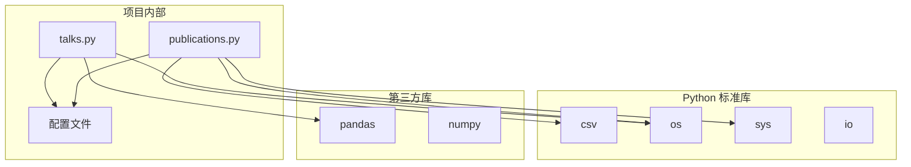
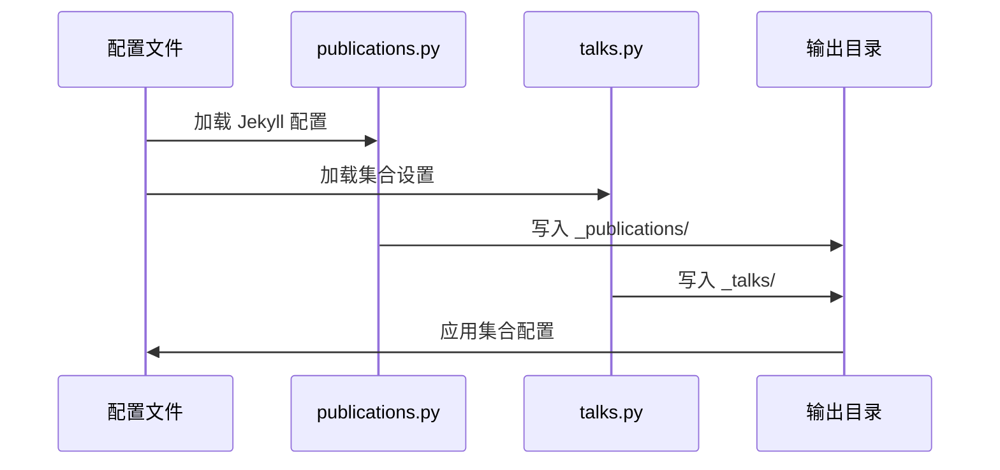
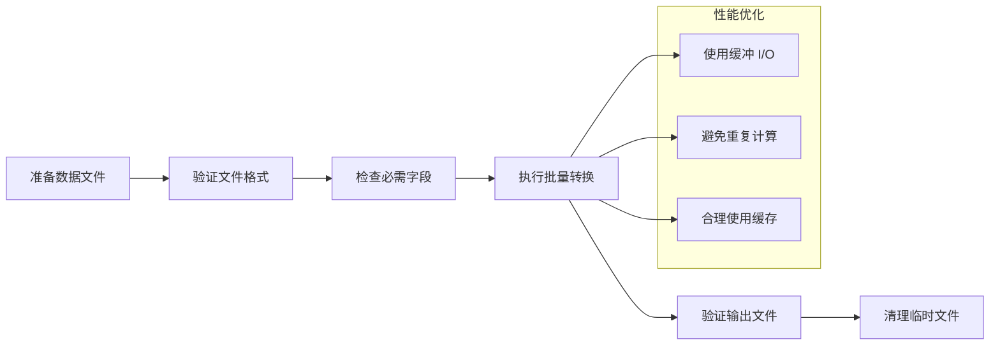

# Python 数据处理脚本

<cite>
**本文档引用的文件**
- [publications.py](file://markdown_generator/publications.py)
- [talks.py](file://markdown_generator/talks.py)
- [publications.csv](file://markdown_generator/publications.csv)
- [publications.tsv](file://markdown_generator/publications.tsv)
- [talks.tsv](file://markdown_generator/talks.tsv)
- [_config.yml](file://_config.yml)
- [README.md](file://markdown_generator/README.md)
- [publications.ipynb](file://markdown_generator/publications.ipynb)
- [talks.ipynb](file://markdown_generator/talks.ipynb)
- [update_cv_json.sh](file://scripts/update_cv_json.sh)
- [2009-10-01-paper-title-number-1.md](file://_publications/2009-10-01-paper-title-number-1.md)
- [2012-03-01-talk-1.md](file://_talks/2012-03-01-talk-1.md)
</cite>

## 目录
1. [简介](#简介)
2. [项目结构](#项目结构)
3. [核心组件](#核心组件)
4. [架构概览](#架构概览)
5. [详细组件分析](#详细组件分析)
6. [依赖关系分析](#依赖关系分析)
7. [性能考虑](#性能考虑)
8. [故障排除指南](#故障排除指南)
9. [结论](#结论)
10. [附录](#附录)

## 简介

本项目提供了两个核心的 Python 数据处理脚本：`publications.py` 和 `talks.py`，用于将结构化数据转换为 Jekyll 博客平台可识别的 Markdown 格式。这些脚本支持从 CSV/TSV 文件读取学术论文和演讲信息，并生成符合 academicpages 模板规范的 Markdown 文件。

项目采用模块化设计，支持多种数据源格式（CSV、TSV），并提供完整的数据验证和错误处理机制。生成的 Markdown 文件遵循 Jekyll 静态站点生成器的标准格式，包括 YAML 元数据头和正文内容。

## 项目结构

项目采用清晰的目录组织结构，主要包含以下关键目录：



**图表来源**
- [publications.py:1-120](file://markdown_generator/publications.py#L1-L120)
- [talks.py:1-112](file://markdown_generator/talks.py#L1-L112)
- [_config.yml:223-236](file://_config.yml#L223-L236)

**章节来源**
- [README.md:1-12](file://markdown_generator/README.md#L1-L12)
- [publications.py:14-32](file://markdown_generator/publications.py#L14-L32)
- [talks.py:12-25](file://markdown_generator/talks.py#L12-L25)

## 核心组件

### publications.py 组件

`publications.py` 是一个专门用于处理学术论文数据的命令行脚本，支持两种数据格式：

- **CSV 格式**：包含完整的字段集合，包括 `category` 字段
- **TSV 格式**：兼容旧版本格式，不包含 `category` 字段

#### 主要功能特性

1. **多格式支持**：自动检测文件类型（CSV/TSV）
2. **数据验证**：严格的字段验证和格式检查
3. **HTML 转义**：安全处理特殊字符
4. **批量处理**：一次处理整个数据集

#### 关键常量和配置



**图表来源**
- [publications.py:18-32](file://markdown_generator/publications.py#L18-L32)
- [publications.py:37-103](file://markdown_generator/publications.py#L37-L103)

**章节来源**
- [publications.py:1-120](file://markdown_generator/publications.py#L1-L120)

### talks.py 组件

`talks.py` 是一个基于 pandas 的交互式脚本，专门处理学术演讲和会议数据：

#### 主要功能特性

1. **pandas 集成**：利用 pandas 进行高效的数据处理
2. **灵活的数据源**：支持多种数据导入格式
3. **类型分类**：支持不同类型的演讲（Talk、Tutorial、Conference）
4. **位置信息**：包含详细的地理位置信息

#### 数据结构特点

| 字段名 | 必填 | 描述 | 默认值 |
|--------|------|------|--------|
| title | ✓ | 演讲标题 | - |
| type | ✗ | 演讲类型 | "Talk" |
| url_slug | ✓ | URL 识别符 | - |
| venue | ✗ | 举办地点 | - |
| date | ✓ | 日期 (YYYY-MM-DD) | - |
| location | ✗ | 城市和国家 | - |
| talk_url | ✗ | 外部链接 | - |
| description | ✗ | 演讲描述 | - |

**章节来源**
- [talks.py:16-25](file://markdown_generator/talks.py#L16-L25)
- [talks.py:67-107](file://markdown_generator/talks.py#L67-L107)

## 架构概览

系统采用分层架构设计，从数据输入到输出生成的完整流程如下：



**图表来源**
- [publications.py:76-103](file://markdown_generator/publications.py#L76-L103)
- [publications.py:37-71](file://markdown_generator/publications.py#L37-L71)
- [talks.py:67-107](file://markdown_generator/talks.py#L67-L107)

## 详细组件分析

### publications.py 详细分析

#### 函数架构图



**图表来源**
- [publications.py:105-120](file://markdown_generator/publications.py#L105-L120)
- [publications.py:76-103](file://markdown_generator/publications.py#L76-L103)
- [publications.py:37-71](file://markdown_generator/publications.py#L37-L71)

#### 数据处理流程



**图表来源**
- [publications.py:105-120](file://markdown_generator/publications.py#L105-L120)
- [publications.py:76-103](file://markdown_generator/publications.py#L76-L103)

#### API 参考

##### 主要函数

| 函数名 | 参数 | 返回值 | 描述 |
|--------|------|--------|------|
| `create_md` | `lines: list`, `layout: list` | `None` | 生成 Markdown 文件 |
| `html_escape` | `text: str` | `str` | HTML 字符转义 |
| `read` | `filename: str` | `tuple[list, list]` | 读取和验证文件 |

##### 参数说明

**create_md 函数**
- `lines`: 包含所有数据行的列表
- `layout`: 字段布局标识符（新版本或旧版本）

**read 函数**
- `filename`: 输入文件路径
- 返回值：元组形式的 `(lines, layout)`

**章节来源**
- [publications.py:37-103](file://markdown_generator/publications.py#L37-L103)

### talks.py 详细分析

#### 数据处理流程



**图表来源**
- [talks.py:67-107](file://markdown_generator/talks.py#L67-L107)
- [talks.py:46-57](file://markdown_generator/talks.py#L46-L57)

#### 类型处理机制



**图表来源**
- [talks.py:76-79](file://markdown_generator/talks.py#L76-L79)
- [talks.py:67-107](file://markdown_generator/talks.py#L67-L107)

**章节来源**
- [talks.py:16-25](file://markdown_generator/talks.py#L16-L25)
- [talks.py:67-107](file://markdown_generator/talks.py#L67-L107)

## 依赖关系分析

### 外部依赖

系统依赖关系相对简单，主要依赖于标准库和第三方库：



**图表来源**
- [publications.py:14-16](file://markdown_generator/publications.py#L14-L16)
- [talks.py:12-13](file://markdown_generator/talks.py#L12-L13)

### 内部组件交互



**图表来源**
- [_config.yml:223-236](file://_config.yml#L223-L236)
- [publications.py:68](file://markdown_generator/publications.py#L68)
- [talks.py:106](file://markdown_generator/talks.py#L106)

**章节来源**
- [_config.yml:223-293](file://_config.yml#L223-L293)
- [publications.py:14-16](file://markdown_generator/publications.py#L14-L16)
- [talks.py:12-13](file://markdown_generator/talks.py#L12-L13)

## 性能考虑

### 处理效率优化

1. **内存管理**：脚本采用逐行处理策略，避免一次性加载大文件到内存
2. **I/O 优化**：批量写入文件，减少磁盘操作次数
3. **字符串处理**：使用高效的字符串连接和格式化方法

### 批量处理建议



**图表来源**
- [publications.py:87-100](file://markdown_generator/publications.py#L87-L100)
- [talks.py:67-107](file://markdown_generator/talks.py#L67-L107)

### 内存使用模式

| 操作类型 | 内存使用 | 优化建议 |
|----------|----------|----------|
| 文件读取 | 一次性加载 | 使用迭代器逐行处理 |
| 数据存储 | 列表存储 | 考虑使用生成器表达式 |
| 字符串拼接 | 临时对象 | 使用 join 方法 |
| 文件写入 | 缓冲区 | 批量写入减少系统调用 |

## 故障排除指南

### 常见错误及解决方案

#### 文件格式错误

**问题症状**：
- 程序退出并显示格式错误信息
- 文件头不匹配预期格式

**解决步骤**：
1. 检查文件扩展名是否正确（.csv 或 .tsv）
2. 验证文件头是否包含必需字段
3. 确认日期格式为 YYYY-MM-DD

#### 数据验证失败

**问题症状**：
- 程序在读取阶段终止
- 显示缺少必需字段的错误信息

**解决步骤**：
1. 检查每行数据是否包含必需字段
2. 验证字段顺序是否正确
3. 确认特殊字符已被正确转义

#### 输出文件问题

**问题症状**：
- Markdown 文件生成但内容不完整
- 文件权限问题导致无法写入

**解决步骤**：
1. 检查目标目录是否存在且可写
2. 验证文件名是否包含非法字符
3. 确认磁盘空间充足

### 调试技巧

#### 启用详细日志

```python
# 在关键位置添加调试信息
print(f"Processing row: {row}")
print(f"Generated filename: {md_filename}")
```

#### 数据验证工具

```python
# 检查数据完整性
def validate_row(row, headers):
    for header in headers:
        if header not in row:
            raise ValueError(f"Missing required field: {header}")
```

#### 错误处理最佳实践

```python
try:
    # 数据处理代码
    pass
except FileNotFoundError:
    print("File not found")
except ValueError as e:
    print(f"Data validation error: {e}")
except Exception as e:
    print(f"Unexpected error: {e}")
```

**章节来源**
- [publications.py:87-100](file://markdown_generator/publications.py#L87-L100)
- [publications.py:107-115](file://markdown_generator/publications.py#L107-L115)

## 结论

本项目提供了一套完整、可靠的 Python 数据处理解决方案，能够高效地将结构化数据转换为 Jekyll 博客平台所需的 Markdown 格式。脚本设计具有以下优势：

1. **模块化设计**：清晰的职责分离，便于维护和扩展
2. **强大的数据验证**：确保数据质量和完整性
3. **灵活的格式支持**：同时支持 CSV 和 TSV 格式
4. **完善的错误处理**：提供详细的错误信息和恢复机制
5. **易于集成**：与 Jekyll 生态系统无缝集成

通过本文档提供的详细说明和示例，用户可以轻松地使用这些脚本进行数据处理，同时也为开发者定制扩展提供了充分的技术指导。

## 附录

### 使用示例

#### 基本使用方法

```bash
# 处理 CSV 格式的论文数据
python3 publications.py publications.csv

# 处理 TSV 格式的演讲数据
python3 talks.py talks.tsv
```

#### 批量处理示例

```bash
# 处理多个数据文件
for file in *.csv; do
    python3 publications.py "$file"
done
```

### 自定义开发指南

#### 扩展字段支持

要添加新的字段支持，需要：

1. 更新数据格式验证逻辑
2. 修改 Markdown 生成代码
3. 更新配置文件中的集合设置

#### 集成其他数据源

```python
# 支持 JSON 数据源
import json

def read_json_file(filename):
    with open(filename, 'r') as f:
        data = json.load(f)
    return data
```

#### 性能优化建议

1. **使用生成器**：对于大数据集，使用生成器表达式减少内存占用
2. **并行处理**：利用多核处理器并行处理多个文件
3. **缓存机制**：对重复计算的结果进行缓存

**章节来源**
- [README.md:5-11](file://markdown_generator/README.md#L5-L11)
- [publications.ipynb:1-50](file://markdown_generator/publications.ipynb#L1-L50)
- [talks.ipynb:1-50](file://markdown_generator/talks.ipynb#L1-L50)