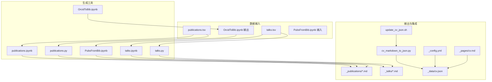
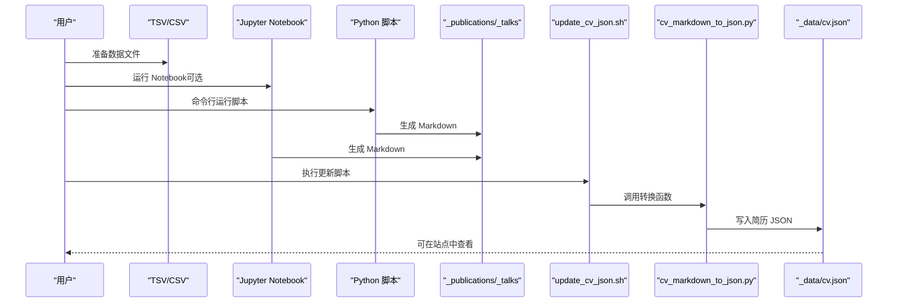
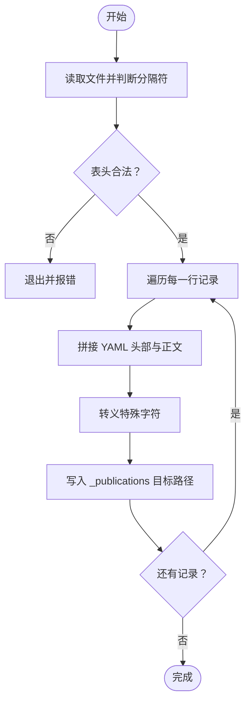
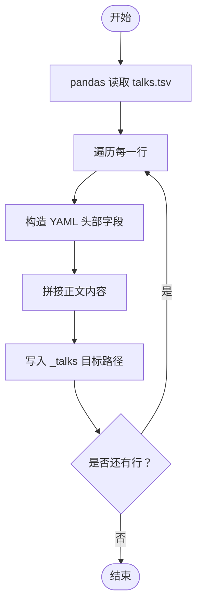
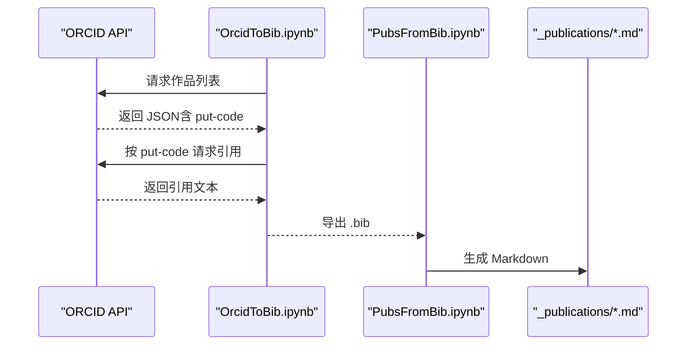
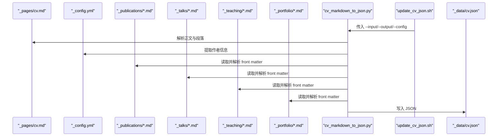
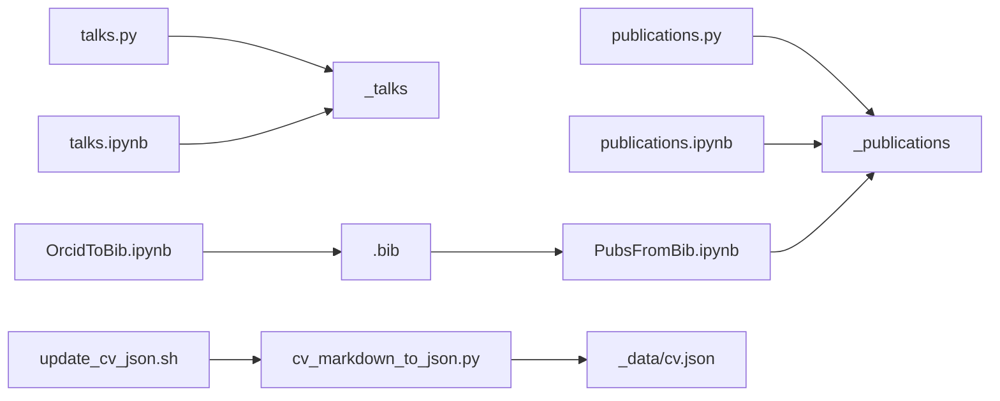

# 数据处理和自动化

<cite>
**本文引用的文件**
- [markdown_generator/README.md](file://markdown_generator/README.md)
- [markdown_generator/publications.py](file://markdown_generator/publications.py)
- [markdown_generator/talks.py](file://markdown_generator/talks.py)
- [markdown_generator/publications.tsv](file://markdown_generator/publications.tsv)
- [markdown_generator/talks.tsv](file://markdown_generator/talks.tsv)
- [markdown_generator/publications.ipynb](file://markdown_generator/publications.ipynb)
- [markdown_generator/talks.ipynb](file://markdown_generator/talks.ipynb)
- [markdown_generator/OrcidToBib.ipynb](file://markdown_generator/OrcidToBib.ipynb)
- [markdown_generator/PubsFromBib.ipynb](file://markdown_generator/PubsFromBib.ipynb)
- [scripts/cv_markdown_to_json.py](file://scripts/cv_markdown_to_json.py)
- [scripts/update_cv_json.sh](file://scripts/update_cv_json.sh)
- [_config.yml](file://_config.yml)
- [_pages/cv.md](file://_pages/cv.md)
- [_data/cv.json](file://_data/cv.json)
</cite>

## 目录
1. [简介](#简介)
2. [项目结构](#项目结构)
3. [核心组件](#核心组件)
4. [架构总览](#架构总览)
5. [组件详解](#组件详解)
6. [依赖关系分析](#依赖关系分析)
7. [性能与最佳实践](#性能与最佳实践)
8. [故障排查指南](#故障排查指南)
9. [结论](#结论)
10. [附录：使用示例与迁移策略](#附录使用示例与迁移策略)

## 简介
本文件面向数据处理与自动化场景，聚焦于 markdown_generator 目录下的数据生成工具（Jupyter Notebook 与 Python 脚本）以及简历数据处理链路（Markdown 到 JSON）。文档覆盖从 TSV/CSV 到 Markdown 的自动化转换流程、简历 JSON 的生成与校验、工作流配置与执行、数据格式标准化、批量处理与错误处理策略，并提供自定义脚本开发指南与数据导入导出的完整流程及迁移建议。

## 项目结构
该仓库采用“功能模块化 + 工作流脚本”的组织方式：
- markdown_generator：存放数据生成工具，包含 Jupyter Notebook 与 Python 脚本，用于将结构化数据（TSV/CSV/BibTeX）转换为 Jekyll 支持的 Markdown 页面。
- scripts：存放自动化脚本，负责简历 Markdown 到 JSON 的转换与更新。
- 配置与模板：_config.yml 定义站点集合、布局与默认值；_pages/cv.md 提供简历页面模板；_data/cv.json 作为简历数据源。
- 示例数据：publications.tsv、talks.tsv 提供样例输入，便于快速上手。

图表来源
- [markdown_generator/publications.ipynb:1-200](file://markdown_generator/publications.ipynb#L1-L200)
- [markdown_generator/talks.ipynb:1-200](file://markdown_generator/talks.ipynb#L1-L200)
- [markdown_generator/publications.py:1-120](file://markdown_generator/publications.py#L1-L120)
- [markdown_generator/talks.py:1-112](file://markdown_generator/talks.py#L1-L112)
- [markdown_generator/OrcidToBib.ipynb:1-119](file://markdown_generator/OrcidToBib.ipynb#L1-L119)
- [markdown_generator/PubsFromBib.ipynb:1-200](file://markdown_generator/PubsFromBib.ipynb#L1-L200)
- [scripts/update_cv_json.sh:1-48](file://scripts/update_cv_json.sh#L1-L48)
- [scripts/cv_markdown_to_json.py:1-430](file://scripts/cv_markdown_to_json.py#L1-L430)
- [_config.yml:223-293](file://_config.yml#L223-L293)
- [_pages/cv.md:1-65](file://_pages/cv.md#L1-L65)
- [_data/cv.json:1-153](file://_data/cv.json#L1-L153)

章节来源
- [markdown_generator/README.md:1-12](file://markdown_generator/README.md#L1-L12)
- [markdown_generator/publications.py:1-120](file://markdown_generator/publications.py#L1-L120)
- [markdown_generator/talks.py:1-112](file://markdown_generator/talks.py#L1-L112)
- [markdown_generator/publications.ipynb:1-200](file://markdown_generator/publications.ipynb#L1-L200)
- [markdown_generator/talks.ipynb:1-200](file://markdown_generator/talks.ipynb#L1-L200)
- [markdown_generator/OrcidToBib.ipynb:1-119](file://markdown_generator/OrcidToBib.ipynb#L1-L119)
- [markdown_generator/PubsFromBib.ipynb:1-200](file://markdown_generator/PubsFromBib.ipynb#L1-L200)
- [scripts/cv_markdown_to_json.py:1-430](file://scripts/cv_markdown_to_json.py#L1-L430)
- [scripts/update_cv_json.sh:1-48](file://scripts/update_cv_json.sh#L1-L48)
- [_config.yml:223-293](file://_config.yml#L223-L293)
- [_pages/cv.md:1-65](file://_pages/cv.md#L1-L65)
- [_data/cv.json:1-153](file://_data/cv.json#L1-L153)

## 核心组件
- 数据生成器（TSV/CSV → Markdown）
  - publications.py：读取 CSV/TSV，校验头部，按条目生成 Markdown 并写入 _publications。
  - talks.py：读取 talks.tsv，逐行生成 talks 的 Markdown 并写入 _talks。
  - 对应 Jupyter Notebook 版本提供交互式探索与可视化。
- 数据生成器（BibTeX → Markdown）
  - OrcidToBib.ipynb：从 ORCID API 拉取作品列表与引用，输出 .bib。
  - PubsFromBib.ipynb：解析 .bib，生成 publications 的 Markdown。
- 简历数据处理（Markdown → JSON）
  - cv_markdown_to_json.py：解析 _pages/cv.md 与 _config.yml，聚合 _publications、_talks、_teaching、_portfolio，输出 _data/cv.json。
  - update_cv_json.sh：一键调用 Python 脚本并可选启动本地预览。

章节来源
- [markdown_generator/publications.py:1-120](file://markdown_generator/publications.py#L1-L120)
- [markdown_generator/talks.py:1-112](file://markdown_generator/talks.py#L1-L112)
- [markdown_generator/publications.ipynb:1-200](file://markdown_generator/publications.ipynb#L1-L200)
- [markdown_generator/talks.ipynb:1-200](file://markdown_generator/talks.ipynb#L1-L200)
- [markdown_generator/OrcidToBib.ipynb:1-119](file://markdown_generator/OrcidToBib.ipynb#L1-L119)
- [markdown_generator/PubsFromBib.ipynb:1-200](file://markdown_generator/PubsFromBib.ipynb#L1-L200)
- [scripts/cv_markdown_to_json.py:1-430](file://scripts/cv_markdown_to_json.py#L1-L430)
- [scripts/update_cv_json.sh:1-48](file://scripts/update_cv_json.sh#L1-L48)

## 架构总览
下图展示从数据输入到最终产出的端到端流程，包括 Markdown 生成与简历 JSON 同步：

图表来源
- [markdown_generator/publications.py:105-120](file://markdown_generator/publications.py#L105-L120)
- [markdown_generator/talks.py:67-107](file://markdown_generator/talks.py#L67-L107)
- [markdown_generator/publications.ipynb:198-200](file://markdown_generator/publications.ipynb#L198-L200)
- [markdown_generator/talks.ipynb:196-198](file://markdown_generator/talks.ipynb#L196-L198)
- [scripts/update_cv_json.sh:27-45](file://scripts/update_cv_json.sh#L27-L45)
- [scripts/cv_markdown_to_json.py:367-426](file://scripts/cv_markdown_to_json.py#L367-L426)

## 组件详解

### 组件 A：TSV 到 Markdown 的自动化（publications）
- 功能要点
  - 自动识别 CSV/TSV 分隔符，读取并校验表头（支持旧版与新版字段集）。
  - 将每条记录渲染为符合 Jekyll collections 的 Markdown，包含 YAML 头部与正文。
  - 输出文件路径固定到 ../_publications/，文件名基于 pub_date 与 url_slug。
- 错误处理
  - 文件为空或表头不匹配时直接退出并提示。
  - 对引号、单引号与 & 等特殊字符进行 HTML 转义，避免 YAML 解析失败。
- 批量处理
  - 逐行处理，适合大批量数据；建议分批或并行外部调度以提升吞吐。

图表来源
- [markdown_generator/publications.py:76-120](file://markdown_generator/publications.py#L76-L120)

章节来源
- [markdown_generator/publications.py:1-120](file://markdown_generator/publications.py#L1-L120)
- [markdown_generator/publications.tsv:1-4](file://markdown_generator/publications.tsv#L1-L4)
- [markdown_generator/publications.ipynb:1-200](file://markdown_generator/publications.ipynb#L1-L200)

### 组件 B：TSV 到 Markdown 的自动化（talks）
- 功能要点
  - 使用 pandas 读取 talks.tsv，逐行生成 talks 的 Markdown。
  - 自动设置 collection、permalink、日期、地点等字段。
  - 输出文件路径固定到 ../_talks/。
- 错误处理
  - 缺少必填字段（title、url_slug、date）时跳过或按默认值处理。
- 批量处理
  - 适合批量生成 talks 页面；注意 url_slug+date 的唯一性约束。

图表来源
- [markdown_generator/talks.py:36-107](file://markdown_generator/talks.py#L36-L107)

章节来源
- [markdown_generator/talks.py:1-112](file://markdown_generator/talks.py#L1-L112)
- [markdown_generator/talks.tsv:1-5](file://markdown_generator/talks.tsv#L1-L5)
- [markdown_generator/talks.ipynb:1-200](file://markdown_generator/talks.ipynb#L1-L200)

### 组件 C：BibTeX 到 Markdown 的自动化
- OrcidToBib.ipynb
  - 通过 ORCID API 获取作品列表与引用，输出 .bib 文件，便于后续统一处理。
- PubsFromBib.ipynb
  - 解析 .bib，提取标题、作者、期刊/会议、日期等信息，生成标准 Markdown。
  - 自动清洗标题、slug 化、日期格式化与 YAML 头部拼装。
  - 输出至 ../_publications/。

图表来源
- [markdown_generator/OrcidToBib.ipynb:32-94](file://markdown_generator/OrcidToBib.ipynb#L32-L94)
- [markdown_generator/PubsFromBib.ipynb:88-192](file://markdown_generator/PubsFromBib.ipynb#L88-L192)

章节来源
- [markdown_generator/OrcidToBib.ipynb:1-119](file://markdown_generator/OrcidToBib.ipynb#L1-L119)
- [markdown_generator/PubsFromBib.ipynb:1-200](file://markdown_generator/PubsFromBib.ipynb#L1-L200)

### 组件 D：简历数据处理（Markdown → JSON）
- cv_markdown_to_json.py
  - 解析 _pages/cv.md，剥离 YAML Front Matter，按标题切分段落。
  - 从 _config.yml 提取作者信息（姓名、邮箱、社交账号等）。
  - 解析 _publications、_talks、_teaching、_portfolio 下的 Markdown，抽取 front matter。
  - 输出结构化 JSON 至 _data/cv.json，日期类型使用自定义编码器。
- update_cv_json.sh
  - 自动定位脚本与文件路径，执行转换并可选启动本地 Jekyll 服务。

图表来源
- [scripts/cv_markdown_to_json.py:23-413](file://scripts/cv_markdown_to_json.py#L23-L413)
- [scripts/update_cv_json.sh:27-45](file://scripts/update_cv_json.sh#L27-L45)
- [_pages/cv.md:1-65](file://_pages/cv.md#L1-L65)
- [_config.yml:24-84](file://_config.yml#L24-L84)
- [_data/cv.json:1-153](file://_data/cv.json#L1-L153)

章节来源
- [scripts/cv_markdown_to_json.py:1-430](file://scripts/cv_markdown_to_json.py#L1-L430)
- [scripts/update_cv_json.sh:1-48](file://scripts/update_cv_json.sh#L1-L48)
- [_pages/cv.md:1-65](file://_pages/cv.md#L1-L65)
- [_config.yml:24-84](file://_config.yml#L24-L84)
- [_data/cv.json:1-153](file://_data/cv.json#L1-L153)

## 依赖关系分析
- 组件内聚与耦合
  - publications.py 与 talks.py 与 Jupyter Notebook 版本高度一致，职责清晰，耦合度低。
  - cv_markdown_to_json.py 依赖 Jekyll 默认集合（publications、talks、teaching、portfolio）与 _config.yml。
- 外部依赖
  - pandas（Notebook）、requests（ORCID）、pybtex（BibTeX）、yaml/json（内置）。
- 潜在循环依赖
  - 当前未发现循环依赖；输出目录由脚本硬编码，建议未来以配置驱动。

图表来源
- [markdown_generator/publications.py:68-71](file://markdown_generator/publications.py#L68-L71)
- [markdown_generator/talks.py:106-107](file://markdown_generator/talks.py#L106-L107)
- [markdown_generator/publications.ipynb:198-200](file://markdown_generator/publications.ipynb#L198-L200)
- [markdown_generator/talks.ipynb:196-198](file://markdown_generator/talks.ipynb#L196-L198)
- [markdown_generator/OrcidToBib.ipynb:90-94](file://markdown_generator/OrcidToBib.ipynb#L90-L94)
- [markdown_generator/PubsFromBib.ipynb:185-186](file://markdown_generator/PubsFromBib.ipynb#L185-L186)
- [scripts/update_cv_json.sh:27-45](file://scripts/update_cv_json.sh#L27-L45)
- [scripts/cv_markdown_to_json.py:390-399](file://scripts/cv_markdown_to_json.py#L390-L399)

章节来源
- [markdown_generator/publications.py:1-120](file://markdown_generator/publications.py#L1-L120)
- [markdown_generator/talks.py:1-112](file://markdown_generator/talks.py#L1-L112)
- [markdown_generator/publications.ipynb:1-200](file://markdown_generator/publications.ipynb#L1-L200)
- [markdown_generator/talks.ipynb:1-200](file://markdown_generator/talks.ipynb#L1-L200)
- [markdown_generator/OrcidToBib.ipynb:1-119](file://markdown_generator/OrcidToBib.ipynb#L1-L119)
- [markdown_generator/PubsFromBib.ipynb:1-200](file://markdown_generator/PubsFromBib.ipynb#L1-L200)
- [scripts/update_cv_json.sh:1-48](file://scripts/update_cv_json.sh#L1-L48)
- [scripts/cv_markdown_to_json.py:1-430](file://scripts/cv_markdown_to_json.py#L1-L430)

## 性能与最佳实践
- 数据格式标准化
  - 统一日期格式（YYYY-MM-DD），url_slug 仅包含字母数字与连字符，避免空格与特殊字符。
  - 表头大小写与顺序保持一致，减少解析歧义。
- 批量处理
  - 使用命令行脚本（如 publications.py、talks.py）替代 Notebook 以提升吞吐；对大文件建议分块处理或外部并行调度。
- 错误处理
  - 在脚本中显式检查文件存在性、表头合法性与必填字段；对异常字段输出警告日志而非中断。
- 编码与转义
  - 对 YAML 中的引号、单引号与 & 进行 HTML 转义，避免解析失败。
- 输出路径与集合
  - 固定输出目录（../_publications、../_talks），确保 Jekyll 集合配置正确（collections、permalinks）。
- 自动化与缓存
  - 使用 update_cv_json.sh 统一入口，必要时引入增量更新策略（比较时间戳或哈希）。

[本节为通用指导，无需列出具体文件来源]

## 故障排查指南
- “表头不匹配”
  - 现象：脚本报错并退出。
  - 排查：确认 CSV/TSV 表头与脚本期望一致；检查分隔符是否为逗号或制表符。
  - 参考
    - [markdown_generator/publications.py:92-100](file://markdown_generator/publications.py#L92-L100)
    - [markdown_generator/talks.py:16-25](file://markdown_generator/talks.py#L16-L25)
- “缺少必填字段”
  - 现象：某些记录未生成或字段为空。
  - 排查：确保 title、url_slug、date 等字段非空；检查数据清洗逻辑。
  - 参考
    - [markdown_generator/publications.py:44-58](file://markdown_generator/publications.py#L44-L58)
    - [markdown_generator/talks.py:73-92](file://markdown_generator/talks.py#L73-L92)
- “Markdown 无法解析”
  - 现象：YAML 头部报错。
  - 排查：检查特殊字符是否正确转义；确认引号闭合。
  - 参考
    - [markdown_generator/publications.py:72-74](file://markdown_generator/publications.py#L72-L74)
    - [markdown_generator/talks.py:52-56](file://markdown_generator/talks.py#L52-L56)
- “简历 JSON 未更新”
  - 现象：cv.json 未变化。
  - 排查：确认 update_cv_json.sh 是否成功执行；检查 cv_markdown_to_json.py 的输出路径与权限。
  - 参考
    - [scripts/update_cv_json.sh:27-45](file://scripts/update_cv_json.sh#L27-L45)
    - [scripts/cv_markdown_to_json.py:408-412](file://scripts/cv_markdown_to_json.py#L408-L412)

章节来源
- [markdown_generator/publications.py:72-100](file://markdown_generator/publications.py#L72-L100)
- [markdown_generator/talks.py:16-107](file://markdown_generator/talks.py#L16-L107)
- [scripts/update_cv_json.sh:14-45](file://scripts/update_cv_json.sh#L14-L45)
- [scripts/cv_markdown_to_json.py:408-412](file://scripts/cv_markdown_to_json.py#L408-L412)

## 结论
本系统通过一组高内聚、低耦合的脚本与 Notebook，实现了从结构化数据到 Jekyll Markdown 的自动化转换，并配套简历 JSON 的生成与同步。遵循本文档的数据格式规范、错误处理策略与性能建议，即可在保证质量的前提下高效完成批量数据处理与持续集成。

[本节为总结性内容，无需列出具体文件来源]

## 附录：使用示例与迁移策略

### 使用示例
- 生成论文页面
  - 准备 publications.tsv 或 CSV，运行命令行脚本或打开 Jupyter Notebook，确认输出位于 ../_publications/。
  - 参考
    - [markdown_generator/publications.py:105-120](file://markdown_generator/publications.py#L105-L120)
    - [markdown_generator/publications.ipynb:198-200](file://markdown_generator/publications.ipynb#L198-L200)
- 生成演讲页面
  - 准备 talks.tsv，运行 talks.py 或执行 talks.ipynb，输出位于 ../_talks/。
  - 参考
    - [markdown_generator/talks.py:67-107](file://markdown_generator/talks.py#L67-L107)
    - [markdown_generator/talks.ipynb:196-198](file://markdown_generator/talks.ipynb#L196-L198)
- 从 ORCID/BibTeX 生成论文页面
  - 先运行 OrcidToBib.ipynb 获取 .bib，再运行 PubsFromBib.ipynb 生成 Markdown。
  - 参考
    - [markdown_generator/OrcidToBib.ipynb:32-94](file://markdown_generator/OrcidToBib.ipynb#L32-L94)
    - [markdown_generator/PubsFromBib.ipynb:88-192](file://markdown_generator/PubsFromBib.ipynb#L88-L192)
- 更新简历 JSON
  - 执行 update_cv_json.sh，自动解析 _pages/cv.md 与 _config.yml，并聚合各集合内容。
  - 参考
    - [scripts/update_cv_json.sh:27-45](file://scripts/update_cv_json.sh#L27-L45)
    - [scripts/cv_markdown_to_json.py:367-426](file://scripts/cv_markdown_to_json.py#L367-L426)

### 数据导入导出与迁移策略
- 导入策略
  - 优先使用 CSV/TSV（结构清晰、易维护）；若已有 BibTeX，可用 PubsFromBib.ipynb 快速迁移。
  - ORCID 数据可通过 OrcidToBib.ipynb 抓取后合并。
- 导出策略
  - 通过 cv_markdown_to_json.py 将简历内容统一导出为 _data/cv.json，便于前端或其他系统消费。
- 迁移建议
  - 逐步替换旧版字段与命名；保持 url_slug 唯一性；在 CI 中加入格式校验与最小样例测试。

章节来源
- [markdown_generator/publications.py:1-120](file://markdown_generator/publications.py#L1-L120)
- [markdown_generator/talks.py:1-112](file://markdown_generator/talks.py#L1-L112)
- [markdown_generator/OrcidToBib.ipynb:1-119](file://markdown_generator/OrcidToBib.ipynb#L1-L119)
- [markdown_generator/PubsFromBib.ipynb:1-200](file://markdown_generator/PubsFromBib.ipynb#L1-L200)
- [scripts/update_cv_json.sh:1-48](file://scripts/update_cv_json.sh#L1-L48)
- [scripts/cv_markdown_to_json.py:1-430](file://scripts/cv_markdown_to_json.py#L1-L430)
- [_config.yml:223-293](file://_config.yml#L223-L293)
- [_pages/cv.md:1-65](file://_pages/cv.md#L1-L65)
- [_data/cv.json:1-153](file://_data/cv.json#L1-L153)