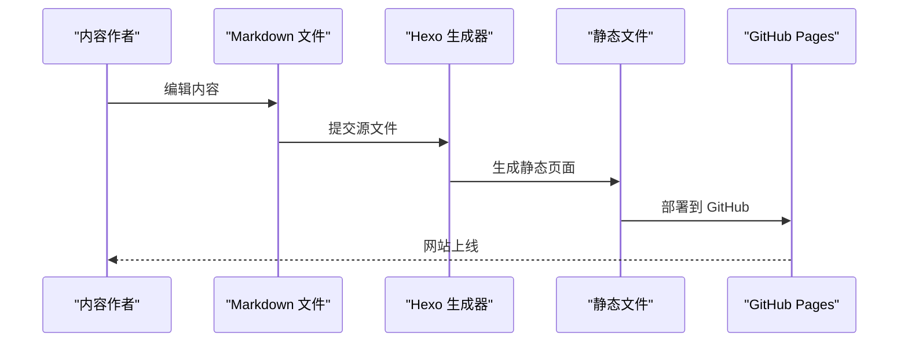
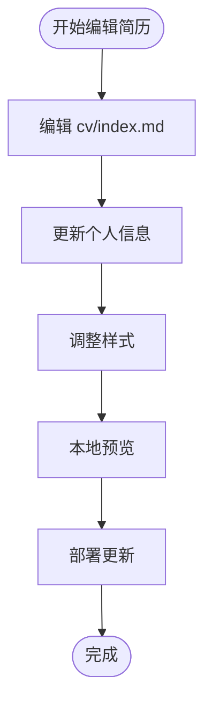

# 数据处理和自动化

<cite>
**本文引用的文件**
- [README.md](file://README.md)
- [hexo-site/_config.yml](file://hexo-site/_config.yml)
- [hexo-site/source/cv/index.md](file://hexo-site/source/cv/index.md)
- [hexo-site/source/publications/index.md](file://hexo-site/source/publications/index.md)
- [hexo-site/source/talks/index.md](file://hexo-site/source/talks/index.md)
- [hexo-site/source/portfolio/index.md](file://hexo-site/source/portfolio/index.md)
- [hexo-site/source/teaching/index.md](file://hexo-site/source/teaching/index.md)
</cite>

## 目录
1. [简介](#简介)
2. [项目结构](#项目结构)
3. [核心组件](#核心组件)
4. [架构总览](#架构总览)
5. [组件详解](#组件详解)
6. [性能与最佳实践](#性能与最佳实践)
7. [故障排查指南](#故障排查指南)
8. [结论](#结论)
9. [附录：使用示例与迁移策略](#附录使用示例与迁移策略)

## 简介
本文件面向数据处理与自动化场景，聚焦于当前的静态网站生成系统。由于项目已移除复杂的 Python 脚本和 Jupyter Notebook，现采用纯静态的 Hexo 网站结构，通过手动编辑 Markdown 文件来管理学术内容。文档涵盖从手动数据维护到静态网站生成的完整流程、内容格式规范、样式定制与部署策略，并提供最佳实践指导。

## 项目结构
该仓库采用静态网站生成器的组织方式：
- hexo-site：Hexo 静态网站项目，包含完整的网站结构和内容
- source：网站源文件目录，包含页面、文章、数据等
- _config.yml：Hexo 站点配置文件，定义主题、部署、SEO 等设置
- 各种内容页面：cv、publications、talks、portfolio、teaching 等

```mermaid
graph TB
subgraph "静态网站结构"
HEXO["hexo-site/"]
CFG["_config.yml"]
SRC["source/"]
END
subgraph "内容页面"
CV["cv/index.md"]
PUB["publications/index.md"]
TALK["talks/index.md"]
PORT["portfolio/index.md"]
TEACH["teaching/index.md"]
END
subgraph "样式与主题"
CSS["样式文件"]
THEME["Butterfly 主题"]
END
HEXO --> CFG
HEXO --> SRC
SRC --> CV
SRC --> PUB
SRC --> TALK
SRC --> PORT
SRC --> TEACH
SRC --> CSS
THEME --> HEXO
```

**图表来源**
- [hexo-site/_config.yml:1-142](file://hexo-site/_config.yml#L1-L142)
- [hexo-site/source/cv/index.md:1-104](file://hexo-site/source/cv/index.md#L1-L104)
- [hexo-site/source/publications/index.md:1-58](file://hexo-site/source/publications/index.md#L1-L58)
- [hexo-site/source/talks/index.md:1-57](file://hexo-site/source/talks/index.md#L1-L57)
- [hexo-site/source/portfolio/index.md:1-51](file://hexo-site/source/portfolio/index.md#L1-L51)
- [hexo-site/source/teaching/index.md:1-53](file://hexo-site/source/teaching/index.md#L1-L53)

**章节来源**
- [README.md:1-97](file://README.md#L1-L97)
- [hexo-site/_config.yml:1-142](file://hexo-site/_config.yml#L1-L142)
- [hexo-site/source/cv/index.md:1-104](file://hexo-site/source/cv/index.md#L1-L104)
- [hexo-site/source/publications/index.md:1-58](file://hexo-site/source/publications/index.md#L1-L58)
- [hexo-site/source/talks/index.md:1-57](file://hexo-site/source/talks/index.md#L1-L57)
- [hexo-site/source/portfolio/index.md:1-51](file://hexo-site/source/portfolio/index.md#L1-L51)
- [hexo-site/source/teaching/index.md:1-53](file://hexo-site/source/teaching/index.md#L1-L53)

## 核心组件
- **内容管理系统**：通过手动编辑 Markdown 文件管理学术内容，包括简历、论文、演讲、作品集和教学经历
- **静态网站生成器**：Hexo 框架负责将 Markdown 内容转换为静态 HTML 页面
- **主题系统**：Butterfly 主题提供现代化的界面设计和响应式布局
- **配置管理**：集中管理站点设置、SEO 参数、部署配置等
- **样式定制**：通过 CSS 和主题配置实现个性化的视觉效果

**章节来源**
- [hexo-site/_config.yml:119-142](file://hexo-site/_config.yml#L119-L142)
- [hexo-site/source/cv/index.md:1-104](file://hexo-site/source/cv/index.md#L1-L104)
- [hexo-site/source/publications/index.md:1-58](file://hexo-site/source/publications/index.md#L1-L58)
- [hexo-site/source/talks/index.md:1-57](file://hexo-site/source/talks/index.md#L1-L57)
- [hexo-site/source/portfolio/index.md:1-51](file://hexo-site/source/portfolio/index.md#L1-L51)
- [hexo-site/source/teaching/index.md:1-53](file://hexo-site/source/teaching/index.md#L1-L53)

## 架构总览
下图展示当前静态网站的生成和发布流程：



**图表来源**
- [README.md:14-16](file://README.md#L14-L16)
- [hexo-site/_config.yml:126-142](file://hexo-site/_config.yml#L126-L142)

## 组件详解

### 组件 A：简历页面管理（cv/index.md）
- **功能要点**
  - 手动维护个人信息、教育背景、工作经历、技能列表
  - 支持中英文双语内容
  - 内置 CSS 样式，提供专业的简历展示效果
  - 支持富文本格式和样式定制
- **内容结构**
  - YAML 头部配置页面元数据
  - 标题层级组织内容结构
  - HTML 样式标签美化显示效果
- **编辑指南**
  - 修改相应区域的内容即可更新简历
  - 注意保持标题层级的一致性
  - 图片资源放置在 `/images/` 目录下



**图表来源**
- [hexo-site/source/cv/index.md:10-104](file://hexo-site/source/cv/index.md#L10-L104)

**章节来源**
- [hexo-site/source/cv/index.md:1-104](file://hexo-site/source/cv/index.md#L1-L104)

### 组件 B：论文页面管理（publications/index.md）
- **功能要点**
  - 手动维护学术论文列表
  - 支持按年份和类型分类
  - 支持 PDF 文件链接
  - 内置 CSS 样式，提供专业的论文展示效果
- **内容结构**
  - YAML 头部配置页面元数据
  - 分类标题组织不同类型的论文
  - 列表项包含论文标题、期刊信息、作者信息
  - 支持 PDF 文件下载链接
- **编辑指南**
  - 在相应分类下添加新的论文条目
  - 注意日期格式和期刊信息的准确性
  - PDF 文件需放置在 `/files/` 目录下

**章节来源**
- [hexo-site/source/publications/index.md:1-58](file://hexo-site/source/publications/index.md#L1-L58)

### 组件 C：演讲页面管理（talks/index.md）
- **功能要点**
  - 手动维护学术演讲和报告列表
  - 支持按年份和类型分类
  - 支持会议信息和地点标注
  - 内置 CSS 样式，提供专业的演讲展示效果
- **内容结构**
  - YAML 头部配置页面元数据
  - 分类标题组织不同类型的演讲
  - 列表项包含演讲标题、会议信息、日期和地点
  - 支持详细的演讲描述内容
- **编辑指南**
  - 在相应分类下添加新的演讲条目
  - 注意日期格式和会议信息的准确性
  - 地点信息使用 📍 符号进行标注

**章节来源**
- [hexo-site/source/talks/index.md:1-57](file://hexo-site/source/talks/index.md#L1-L57)

### 组件 D：作品集页面管理（portfolio/index.md）
- **功能要点**
  - 手动维护个人作品集
  - 支持网格布局展示
  - 支持图片和文本内容
  - 内置 CSS 样式，提供美观的作品展示效果
- **内容结构**
  - YAML 头部配置页面元数据
  - 网格布局容器组织作品项目
  - 项目条目包含标题、描述和图片
  - 支持响应式布局适配不同屏幕尺寸
- **编辑指南**
  - 在网格容器中添加新的作品项目
  - 图片资源放置在 `/images/` 目录下
  - 注意图片的尺寸和格式要求

**章节来源**
- [hexo-site/source/portfolio/index.md:1-51](file://hexo-site/source/portfolio/index.md#L1-L51)

### 组件 E：教学经历页面管理（teaching/index.md）
- **功能要点**
  - 手动维护教学经历列表
  - 支持按学期和课程分类
  - 支持课程信息和地点标注
  - 内置 CSS 样式，提供专业的教学展示效果
- **内容结构**
  - YAML 头部配置页面元数据
  - 分类标题组织不同类型的课程
  - 列表项包含课程名称、机构信息、日期和地点
  - 支持详细的课程描述内容
- **编辑指南**
  - 在相应分类下添加新的教学经历
  - 注意日期格式和机构信息的准确性
  - 地点信息使用 📍 符号进行标注

**章节来源**
- [hexo-site/source/teaching/index.md:1-53](file://hexo-site/source/teaching/index.md#L1-L53)

## 性能与最佳实践
- **内容管理最佳实践**
  - 使用清晰的标题层级组织内容结构
  - 保持日期格式的一致性（YYYY-MM-DD）
  - 图片资源使用适当的尺寸和格式
  - PDF 文件命名使用有意义的文件名
- **样式定制建议**
  - 利用内置的 CSS 类名保持样式一致性
  - 自定义样式时注意响应式设计
  - 图片和布局使用相对单位确保适配性
- **部署和维护**
  - 使用 GitHub Actions 实现自动化部署
  - 定期备份重要的内容文件
  - 测试本地预览确保内容正确显示
- **SEO 优化**
  - 合理设置页面标题和描述
  - 使用语义化的 HTML 结构
  - 添加适当的关键词和元数据

## 故障排查指南
- **页面无法正常显示**
  - 检查 YAML 头部格式是否正确
  - 确认文件编码为 UTF-8
  - 验证链接路径是否正确
- **样式显示异常**
  - 检查 CSS 文件是否加载成功
  - 确认图片路径和资源文件是否存在
  - 验证浏览器兼容性问题
- **部署失败**
  - 检查 GitHub Pages 配置
  - 确认部署凭据和权限设置
  - 验证构建日志中的错误信息
- **内容格式问题**
  - 检查 Markdown 语法是否正确
  - 确认特殊字符的转义处理
  - 验证表格和列表的格式规范

**章节来源**
- [hexo-site/_config.yml:126-142](file://hexo-site/_config.yml#L126-L142)
- [README.md:18-76](file://README.md#L18-L76)

## 结论
当前的静态网站系统通过手动编辑 Markdown 文件的方式实现了内容管理，移除了复杂的自动化脚本，简化了维护流程。系统采用 Hexo 静态生成器和 Butterfly 主题，提供了良好的用户体验和开发效率。通过遵循本文档的内容管理规范和最佳实践，可以高效地维护和更新学术网站内容。

## 附录：使用示例与迁移策略

### 使用示例
- **编辑简历内容**
  - 直接修改 `hexo-site/source/cv/index.md` 文件
  - 更新个人信息、教育背景、工作经历等
  - 保存后通过本地预览检查效果
- **添加新论文**
  - 在 `hexo-site/source/publications/index.md` 中添加新的论文条目
  - 确保包含正确的作者信息和期刊信息
  - 如有 PDF 文件，将其放置在 `hexo-site/source/files/` 目录下
- **更新演讲列表**
  - 在 `hexo-site/source/talks/index.md` 中添加新的演讲信息
  - 注意日期格式和会议地点的标注
- **维护作品集**
  - 在 `hexo-site/source/portfolio/index.md` 中添加新的作品项目
  - 图片资源放置在 `hexo-site/source/images/` 目录下

### 数据导入导出与迁移策略
- **内容迁移**
  - 直接复制现有的 Markdown 文件结构
  - 保持相同的目录结构和文件命名
  - 更新 YAML 头部配置信息
- **主题升级**
  - 备份现有内容文件
  - 更新 Butterfly 主题版本
  - 测试样式兼容性和功能完整性
- **部署配置**
  - 更新 GitHub Pages 部署配置
  - 配置 GitHub Actions 自动化部署
  - 设置域名和 SSL 证书（如需要）

**章节来源**
- [README.md:14-16](file://README.md#L14-L16)
- [hexo-site/_config.yml:126-142](file://hexo-site/_config.yml#L126-L142)
- [hexo-site/source/cv/index.md:1-104](file://hexo-site/source/cv/index.md#L1-L104)
- [hexo-site/source/publications/index.md:1-58](file://hexo-site/source/publications/index.md#L1-L58)
- [hexo-site/source/talks/index.md:1-57](file://hexo-site/source/talks/index.md#L1-L57)
- [hexo-site/source/portfolio/index.md:1-51](file://hexo-site/source/portfolio/index.md#L1-L51)
- [hexo-site/source/teaching/index.md:1-53](file://hexo-site/source/teaching/index.md#L1-L53)