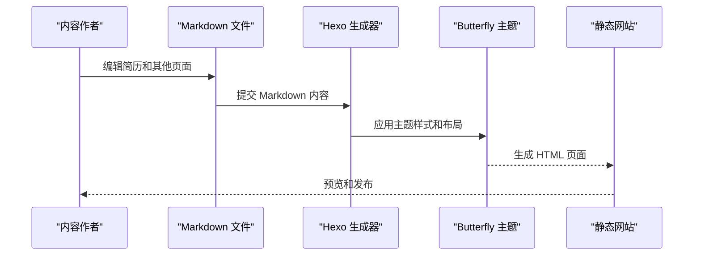
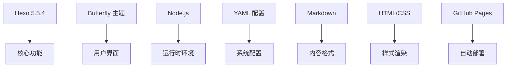

# 简历数据管理

<cite>
**本文引用的文件**
- [README.md](file://README.md)
- [开发文档.md](file://开发文档.md)
- [hexo-site/source/cv/index.md](file://hexo-site/source/cv/index.md)
- [hexo-site/_config.yml](file://hexo-site/_config.yml)
- [hexo-site/_config.butterfly.yml](file://hexo-site/_config.butterfly.yml)
- [hexo-site/package.json](file://hexo-site/package.json)
- [hexo-site/source/publications/index.md](file://hexo-site/source/publications/index.md)
- [hexo-site/source/talks/index.md](file://hexo-site/source/talks/index.md)
- [hexo-site/source/teaching/index.md](file://hexo-site/source/teaching/index.md)
- [hexo-site/source/portfolio/index.md](file://hexo-site/source/portfolio/index.md)
- [hexo-site/source/about/index.md](file://hexo-site/source/about/index.md)
- [hexo-site/source/index.md](file://hexo-site/source/index.md)
</cite>

## 更新摘要
**所做更改**
- 更新了项目结构说明，反映从 Academic Pages Jekyll 模板到 Hexo + Butterfly 主题的完全重构
- 移除了所有关于 cv_markdown_to_json.py 和 update_cv_json.sh 的内容
- 移除了 cv.json 数据文件的相关说明
- 更新了简历管理方式，从自动化数据处理转向手动 Markdown 编辑
- 更新了页面渲染机制，从 JSON 数据驱动转向纯 Markdown 渲染
- 更新了数据迁移和更新流程，简化为直接编辑 Markdown 文件

## 目录
1. [简介](#简介)
2. [项目结构](#项目结构)
3. [核心组件](#核心组件)
4. [架构总览](#架构总览)
5. [详细组件分析](#详细组件分析)
6. [依赖分析](#依赖分析)
7. [性能考虑](#性能考虑)
8. [故障排查指南](#故障排查指南)
9. [结论](#结论)
10. [附录](#附录)

## 简介
本技术文档面向基于 Hexo + Butterfly 主题的简历管理系统，围绕以下目标展开：
- 详细介绍基于 Hexo 的静态网站生成流程和简历页面管理方式
- 解释从 Academic Pages Jekyll 模板到 Hexo + Butterfly 主题的完全重构
- 说明手动编辑 Markdown 文件的简历管理方法和最佳实践
- 提供完整的页面更新流程、数据验证规则与格式检查机制
- 给出备份与恢复策略、自动化部署工作原理与配置方法
- 解释与 Hexo 配置的集成方式和页面渲染机制

## 项目结构
基于 Hexo + Butterfly 主题的简历管理系统采用全新的项目结构：
- 核心目录：hexo-site/（Hexo 主项目）
- 内容目录：source/（主要修改区域）
- 配置文件：_config.yml（站点配置）、_config.butterfly.yml（主题配置）
- 页面文件：source/cv/index.md（简历页面）、source/publications/index.md（论文页面）、source/talks/index.md（报告页面）、source/teaching/index.md（教学页面）、source/portfolio/index.md（作品集页面）、source/about/index.md（关于页面）

```mermaid
graph TB
subgraph "Hexo 项目结构"
HEXO["hexo-site/"]
CONFIG["_config.yml<br/>站点配置"]
THEME["_config.butterfly.yml<br/>主题配置"]
PKG["package.json<br/>依赖管理"]
END
subgraph "内容目录"
CV["source/cv/<br/>简历页面"]
PUB["source/publications/<br/>论文页面"]
TALKS["source/talks/<br/>报告页面"]
TEACH["source/teaching/<br/>教学页面"]
PORT["source/portfolio/<br/>作品集页面"]
ABOUT["source/about/<br/>关于页面"]
INDEX["source/index.md<br/>首页"]
END
subgraph "生成流程"
HEXO --> CONFIG
HEXO --> THEME
HEXO --> PKG
CV --> HEXO
PUB --> HEXO
TALKS --> HEXO
TEACH --> HEXO
PORT --> HEXO
ABOUT --> HEXO
INDEX --> HEXO
HEXO --> "public/<br/>生成的静态文件"
END
```

**图表来源**
- [开发文档.md:7-32](file://开发文档.md#L7-L32)
- [hexo-site/_config.yml:1-142](file://hexo-site/_config.yml#L1-L142)
- [hexo-site/_config.butterfly.yml:1-459](file://hexo-site/_config.butterfly.yml#L1-L459)

**章节来源**
- [开发文档.md:7-32](file://开发文档.md#L7-L32)
- [hexo-site/_config.yml:1-142](file://hexo-site/_config.yml#L1-L142)
- [hexo-site/_config.butterfly.yml:1-459](file://hexo-site/_config.butterfly.yml#L1-L459)

## 核心组件
- **Hexo 静态网站生成器**：负责将 Markdown 内容转换为静态 HTML 页面
- **Butterfly 主题**：提供简历页面的样式和布局支持
- **简历页面**：source/cv/index.md，包含教育背景、工作经历、技能、论文和报告等信息
- **集合页面**：论文、报告、教学、作品集等独立页面
- **配置系统**：_config.yml 提供站点基本信息，_config.butterfly.yml 提供主题定制选项
- **导航系统**：通过配置文件管理页面间的导航链接

**章节来源**
- [开发文档.md:217-244](file://开发文档.md#L217-L244)
- [hexo-site/_config.yml:1-142](file://hexo-site/_config.yml#L1-L142)
- [hexo-site/_config.butterfly.yml:26-34](file://hexo-site/_config.butterfly.yml#L26-L34)

## 架构总览
下图展示了基于 Hexo 的简历页面生成和渲染流程：



**图表来源**
- [开发文档.md:390-410](file://开发文档.md#L390-L410)
- [hexo-site/_config.yml:119](file://hexo-site/_config.yml#L119)
- [hexo-site/_config.butterfly.yml:122-124](file://hexo-site/_config.butterfly.yml#L122-L124)

## 详细组件分析

### 组件一：简历页面管理（source/cv/index.md）
- **功能概述**
  - 提供个人简历的完整信息展示
  - 包含教育背景、工作经历、技能列表、论文和报告等模块
  - 使用 Markdown 语法和 HTML 样式结合的方式
- **页面结构**
  - Front Matter：包含页面元数据（标题、布局、评论设置等）
  - 内容区域：按模块组织的简历信息
  - 自定义样式：通过内联 CSS 实现专业的简历展示效果
- **编辑方式**
  - 直接编辑 Markdown 文件即可更新内容
  - 支持 Markdown 语法和 HTML 标签混合使用
  - 样式通过内联 CSS 控制，无需额外的样式文件

**章节来源**
- [hexo-site/source/cv/index.md:1-104](file://hexo-site/source/cv/index.md#L1-L104)

### 组件二：Hexo 配置系统
- **站点配置（_config.yml）**
  - 网站基本信息：标题、副标题、描述、关键词、作者等
  - SEO 设置：URL 配置、链接格式、时区设置
  - 功能配置：分页设置、代码高亮、部署配置
- **主题配置（_config.butterfly.yml）**
  - 导航栏配置：Logo、菜单项、图标设置
  - 社交媒体链接：GitHub、邮箱等联系方式
  - 侧边栏配置：作者信息、公告、最新文章等卡片
  - 主题功能：黑夜模式、繁简转换、代码块样式等

**章节来源**
- [hexo-site/_config.yml:1-142](file://hexo-site/_config.yml#L1-L142)
- [hexo-site/_config.butterfly.yml:1-459](file://hexo-site/_config.butterfly.yml#L1-L459)

### 组件三：页面渲染机制
- **生成流程**
  - Hexo 读取 source/ 目录下的 Markdown 文件
  - 应用 Butterfly 主题的布局和样式
  - 生成静态 HTML 文件到 public/ 目录
- **渲染特点**
  - 纯静态页面，无需服务器端处理
  - 支持多种页面类型：博客文章、独立页面、集合页面
  - 自动处理导航、分页、搜索等功能
- **部署方式**
  - 支持 GitHub Pages 自动部署
  - 可配置其他部署方式如 FTP、CDN 等

**章节来源**
- [开发文档.md:390-444](file://开发文档.md#L390-L444)
- [hexo-site/_config.yml:126-142](file://hexo-site/_config.yml#L126-L142)

### 组件四：集合页面管理
- **论文页面（source/publications/index.md）**
  - 按年份组织学术论文列表
  - 支持期刊论文和会议论文分类
  - 提供 PDF 链接和详细信息展示
- **报告页面（source/talks/index.md）**
  - 展示学术报告和演讲信息
  - 包含会议名称、地点、日期等详细信息
- **教学页面（source/teaching/index.md）**
  - 记录教学经历和课程信息
  - 按学期和课程组织内容
- **作品集页面（source/portfolio/index.md）**
  - 展示项目作品和技术栈
  - 包含项目截图、描述和源码链接

**章节来源**
- [开发文档.md:246-335](file://开发文档.md#L246-L335)
- [hexo-site/source/publications/index.md](file://hexo-site/source/publications/index.md)
- [hexo-site/source/talks/index.md](file://hexo-site/source/talks/index.md)
- [hexo-site/source/teaching/index.md](file://hexo-site/source/teaching/index.md)
- [hexo-site/source/portfolio/index.md](file://hexo-site/source/portfolio/index.md)

## 依赖分析
- **核心依赖**
  - Hexo 5.5.4：静态网站生成器
  - Butterfly 主题：前端主题框架
  - Node.js：运行环境和包管理
- **配置依赖**
  - YAML 配置文件：站点和主题配置
  - Markdown 语法：内容编写格式
  - HTML/CSS：页面样式和布局
- **外部依赖**
  - GitHub Pages：托管和自动部署
  - MathJax：数学公式渲染
  - Mermaid：图表绘制支持



**图表来源**
- [开发文档.md:539-547](file://开发文档.md#L539-L547)
- [hexo-site/package.json](file://hexo-site/package.json)
- [hexo-site/_config.yml:119](file://hexo-site/_config.yml#L119)

**章节来源**
- [开发文档.md:539-547](file://开发文档.md#L539-L547)
- [hexo-site/package.json](file://hexo-site/package.json)

## 性能考虑
- **生成性能**
  - Hexo 生成速度快，适合中小型网站
  - Butterfly 主题优化良好，加载性能优秀
  - 静态文件无需服务器端处理，访问速度快
- **内容管理**
  - Markdown 编写简单，学习成本低
  - 无需数据库，部署简单
  - 支持版本控制，便于协作
- **优化建议**
  - 合理使用图片，压缩图片大小
  - 利用 Hexo 的缓存机制
  - 配置合适的分页设置

## 故障排查指南
- **常见问题**
  - 本地预览失败：检查 Node.js 和 Hexo 安装
  - 页面不显示：确认 Markdown 语法正确
  - 部署失败：检查 GitHub Pages 配置
- **调试方法**
  - 使用 `hexo clean && hexo server` 清理缓存
  - 检查 YAML 格式和缩进
  - 验证文件路径和链接
- **配置检查**
  - 确认 _config.yml 和 _config.butterfly.yml 格式正确
  - 检查 Front Matter 格式
  - 验证导航菜单配置

**章节来源**
- [开发文档.md:514-536](file://开发文档.md#L514-L536)
- [hexo-site/_config.yml:1-142](file://hexo-site/_config.yml#L1-L142)

## 结论
本系统通过 Hexo + Butterfly 主题实现了简洁高效的简历管理系统。相比之前的复杂数据处理系统，新的方案具有以下优势：
- **简化管理**：直接编辑 Markdown 文件，无需复杂的转换流程
- **快速部署**：静态生成，部署简单，访问速度快
- **主题丰富**：Butterfly 主题提供优秀的简历展示效果
- **维护成本低**：无需维护 Python 脚本和 JSON 数据文件
- **协作友好**：支持版本控制，便于团队协作

建议在团队协作中统一 Markdown 编写规范，利用 Hexo 的自动部署功能，确保简历内容的及时更新和发布。

## 附录

### 数据迁移与更新流程
- **内容更新**：直接编辑对应 Markdown 文件（如 source/cv/index.md）
- **页面管理**：在 source/ 目录下创建或修改页面文件
- **样式定制**：通过 _config.butterfly.yml 配置主题外观
- **本地预览**：使用 `hexo server` 命令预览效果
- **部署发布**：使用 `hexo generate && hexo deploy` 或 GitHub Actions 自动部署

**章节来源**
- [开发文档.md:390-444](file://开发文档.md#L390-L444)
- [开发文档.md:217-244](file://开发文档.md#L217-L244)

### 数据验证规则与格式检查
- **Markdown 规范**
  - 使用标准 YAML Front Matter 格式
  - 正确的缩进和空行分隔
  - 支持的 Markdown 语法和 HTML 标签
- **配置文件检查**
  - YAML 格式必须正确（冒号后有空格）
  - 缩进使用空格，不使用 Tab
  - 字符编码使用 UTF-8
- **链接验证**
  - 确保内部链接路径正确
  - 外部链接可访问性检查

**章节来源**
- [开发文档.md:503-511](file://开发文档.md#L503-L511)
- [开发文档.md:527-529](file://开发文档.md#L527-L529)

### 与 Hexo 配置的集成方式
- **站点配置集成**
  - _config.yml 提供全局站点设置
  - 支持 SEO、分页、代码高亮等功能配置
  - 部署配置支持多种部署方式
- **主题配置集成**
  - _config.butterfly.yml 提供丰富的主题定制选项
  - 导航菜单、侧边栏、社交媒体等均可配置
  - 支持黑夜模式、繁简转换等高级功能
- **页面渲染集成**
  - 通过 Front Matter 控制页面行为
  - 支持不同的布局和模板
  - 自动处理页面间的关系和导航

**章节来源**
- [hexo-site/_config.yml:1-142](file://hexo-site/_config.yml#L1-L142)
- [hexo-site/_config.butterfly.yml:1-459](file://hexo-site/_config.butterfly.yml#L1-L459)

### 备份与恢复策略
- **版本控制**
  - 使用 Git 管理所有内容文件
  - 定期提交更改，保留历史版本
  - 利用分支管理不同版本的简历
- **配置备份**
  - 备份 _config.yml 和 _config.butterfly.yml
  - 记录重要的主题配置更改
- **内容恢复**
  - 通过 Git 历史记录恢复到之前版本
  - 重新生成静态文件确保一致性
  - 验证恢复后的页面显示效果

**章节来源**
- [开发文档.md:505-510](file://开发文档.md#L505-L510)

### 自动化更新工作原理与配置
- **工作原理**
  - GitHub Actions 监控代码变更
  - 自动触发 Hexo 生成和部署流程
  - 无需手动干预，实现持续集成
- **配置方法**
  - 在仓库设置中启用 GitHub Pages
  - 配置部署分支和路径
  - 设置必要的环境变量和密钥
- **最佳实践**
  - 使用保护分支防止意外修改
  - 添加构建状态检查
  - 设置部署通知机制

**章节来源**
- [开发文档.md:414-444](file://开发文档.md#L414-L444)
- [hexo-site/_config.yml:126-142](file://hexo-site/_config.yml#L126-L142)

### 使用示例与最佳实践
- **简历编辑示例**
  - 在 source/cv/index.md 中添加新的教育背景
  - 更新工作经历和技能列表
  - 添加论文和报告条目
- **页面定制示例**
  - 修改 _config.butterfly.yml 中的主题设置
  - 添加新的导航菜单项
  - 自定义侧边栏内容
- **最佳实践建议**
  - 保持 Markdown 文件结构清晰
  - 使用一致的标题层级和列表格式
  - 定期备份重要配置文件
  - 测试本地预览后再部署

**章节来源**
- [开发文档.md:217-244](file://开发文档.md#L217-L244)
- [开发文档.md:531-536](file://开发文档.md#L531-L536)
- [开发文档.md:505-511](file://开发文档.md#L505-L511)