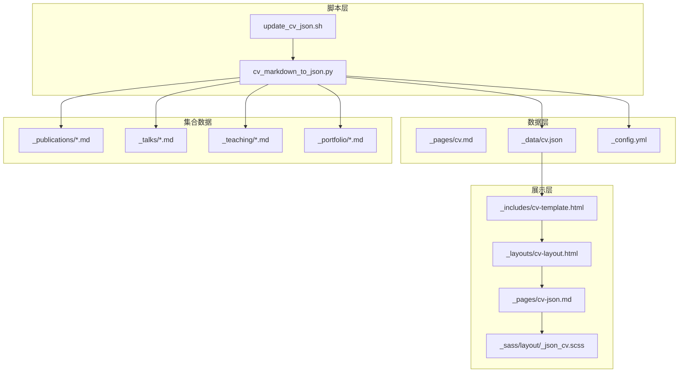
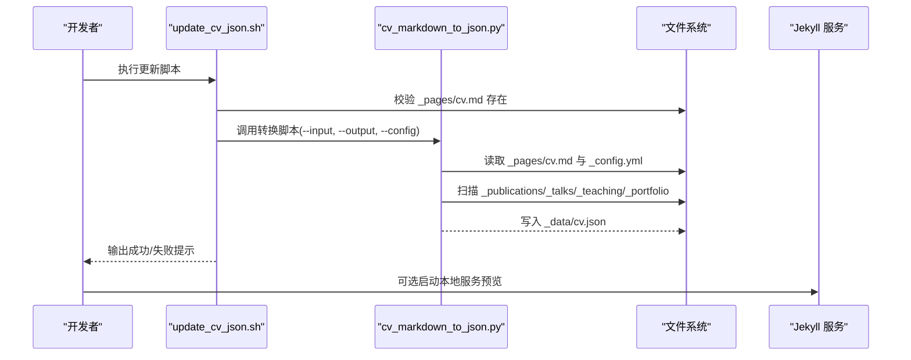
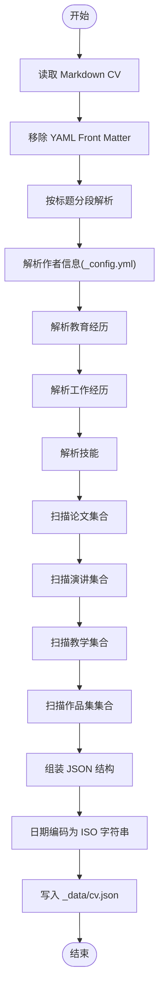
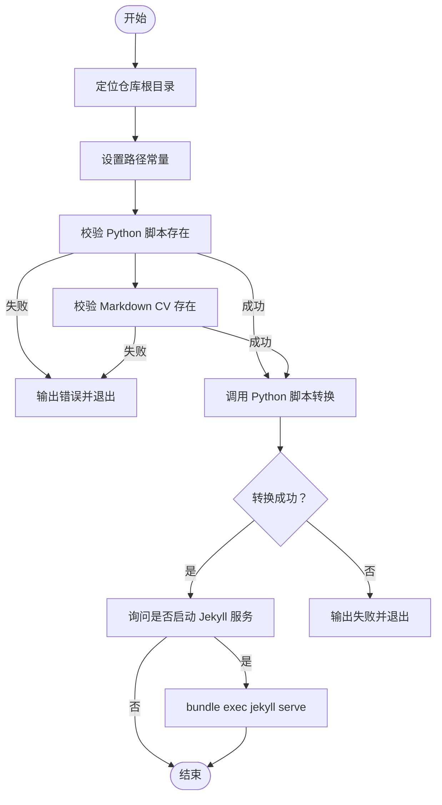
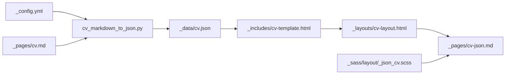
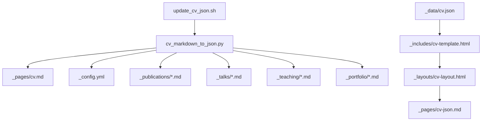

# 简历数据管理

<cite>
**本文引用的文件**
- [scripts/cv_markdown_to_json.py](file://scripts/cv_markdown_to_json.py)
- [scripts/update_cv_json.sh](file://scripts/update_cv_json.sh)
- [_data/cv.json](file://_data/cv.json)
- [_pages/cv.md](file://_pages/cv.md)
- [_pages/cv-json.md](file://_pages/cv-json.md)
- [_includes/cv-template.html](file://_includes/cv-template.html)
- [_layouts/cv-layout.html](file://_layouts/cv-layout.html)
- [_sass/layout/_json_cv.scss](file://_sass/layout/_json_cv.scss)
- [_config.yml](file://_config.yml)
- [_publications/2009-10-01-paper-title-number-1.md](file://_publications/2009-10-01-paper-title-number-1.md)
- [_talks/2012-03-01-talk-1.md](file://_talks/2012-03-01-talk-1.md)
- [_teaching/2014-spring-teaching-1.md](file://_teaching/2014-spring-teaching-1.md)
- [_portfolio/portfolio-1.md](file://_portfolio/portfolio-1.md)
- [_includes/archive-single-cv.html](file://_includes/archive-single-cv.html)
- [_includes/archive-single-talk-cv.html](file://_includes/archive-single-talk-cv.html)
</cite>

## 目录
1. [简介](#简介)
2. [项目结构](#项目结构)
3. [核心组件](#核心组件)
4. [架构总览](#架构总览)
5. [详细组件分析](#详细组件分析)
6. [依赖分析](#依赖分析)
7. [性能考虑](#性能考虑)
8. [故障排查指南](#故障排查指南)
9. [结论](#结论)
10. [附录](#附录)

## 简介
本技术文档面向简历数据管理系统，围绕以下目标展开：  
- 深入解析 cv_markdown_to_json.py 脚本如何将 Markdown 格式的简历转换为 JSON 结构化数据。  
- 详述 update_cv_json.sh 脚本的作用、执行流程与错误处理。  
- 解释 cv.json 数据文件的结构与字段定义，以及与 Jekyll 配置的集成方式。  
- 提供完整的数据迁移与更新流程、数据验证规则与格式检查机制。  
- 给出备份与恢复策略、自动化更新工作原理与配置方法、最佳实践与使用示例。

## 项目结构
简历数据管理涉及的关键目录与文件如下：
- 脚本层：scripts/cv_markdown_to_json.py（转换）、scripts/update_cv_json.sh（更新）
- 数据层：_data/cv.json（最终输出）、_pages/cv.md（输入源）、_pages/cv-json.md（展示页）
- 布局与模板：_layouts/cv-layout.html、_includes/cv-template.html、_sass/layout/_json_cv.scss
- 集合数据：_publications、_talks、_teaching、_portfolio（作为 cv.json 的补充来源）
- 配置：_config.yml（作者信息、社交账号等）

图表来源
- [scripts/cv_markdown_to_json.py:367-430](file://scripts/cv_markdown_to_json.py#L367-L430)
- [scripts/update_cv_json.sh:1-48](file://scripts/update_cv_json.sh#L1-L48)
- [_data/cv.json:1-153](file://_data/cv.json#L1-L153)
- [_pages/cv.md:1-65](file://_pages/cv.md#L1-L65)
- [_pages/cv-json.md:1-18](file://_pages/cv-json.md#L1-L18)
- [_includes/cv-template.html:1-311](file://_includes/cv-template.html#L1-L311)
- [_layouts/cv-layout.html:1-40](file://_layouts/cv-layout.html#L1-L40)
- [_sass/layout/_json_cv.scss:1-240](file://_sass/layout/_json_cv.scss#L1-L240)
- [_config.yml:24-84](file://_config.yml#L24-L84)
- [_publications/2009-10-01-paper-title-number-1.md:1-15](file://_publications/2009-10-01-paper-title-number-1.md#L1-L15)
- [_talks/2012-03-01-talk-1.md:1-12](file://_talks/2012-03-01-talk-1.md#L1-L12)
- [_teaching/2014-spring-teaching-1.md:1-20](file://_teaching/2014-spring-teaching-1.md#L1-L20)
- [_portfolio/portfolio-1.md:1-8](file://_portfolio/portfolio-1.md#L1-L8)

章节来源
- [scripts/cv_markdown_to_json.py:1-430](file://scripts/cv_markdown_to_json.py#L1-L430)
- [scripts/update_cv_json.sh:1-48](file://scripts/update_cv_json.sh#L1-L48)
- [_data/cv.json:1-153](file://_data/cv.json#L1-L153)
- [_pages/cv.md:1-65](file://_pages/cv.md#L1-L65)
- [_pages/cv-json.md:1-18](file://_pages/cv-json.md#L1-L18)
- [_includes/cv-template.html:1-311](file://_includes/cv-template.html#L1-L311)
- [_layouts/cv-layout.html:1-40](file://_layouts/cv-layout.html#L1-L40)
- [_sass/layout/_json_cv.scss:1-240](file://_sass/layout/_json_cv.scss#L1-L240)
- [_config.yml:24-84](file://_config.yml#L24-L84)
- [_publications/2009-10-01-paper-title-number-1.md:1-15](file://_publications/2009-10-01-paper-title-number-1.md#L1-L15)
- [_talks/2012-03-01-talk-1.md:1-12](file://_talks/2012-03-01-talk-1.md#L1-L12)
- [_teaching/2014-spring-teaching-1.md:1-20](file://_teaching/2014-spring-teaching-1.md#L1-L20)
- [_portfolio/portfolio-1.md:1-8](file://_portfolio/portfolio-1.md#L1-L8)

## 核心组件
- cv_markdown_to_json.py：负责解析 Markdown 简历、提取各板块内容、读取 Jekyll 配置中的作者信息、扫描集合数据（论文、演讲、教学、作品集），并生成标准 JSON 文件。
- update_cv_json.sh：封装转换流程，校验输入文件存在性，调用 Python 脚本生成 cv.json，并可选地启动本地 Jekyll 服务预览。
- cv.json：最终输出的简历数据文件，包含 basics、work、education、skills、languages、interests、references、publications、presentations、teaching、portfolio 等字段。
- 展示模板：cv-template.html 通过 Liquid 从 site.data.cv 读取 cv.json 并渲染页面；cv-layout.html 提供布局；_json_cv.scss 提供样式。
- 输入源：_pages/cv.md 为 Markdown 简历源；_config.yml 提供作者信息与社交链接；集合数据来自 _publications、_talks、_teaching、_portfolio。

章节来源
- [scripts/cv_markdown_to_json.py:367-430](file://scripts/cv_markdown_to_json.py#L367-L430)
- [scripts/update_cv_json.sh:1-48](file://scripts/update_cv_json.sh#L1-L48)
- [_data/cv.json:1-153](file://_data/cv.json#L1-L153)
- [_includes/cv-template.html:1-311](file://_includes/cv-template.html#L1-L311)
- [_layouts/cv-layout.html:1-40](file://_layouts/cv-layout.html#L1-L40)
- [_sass/layout/_json_cv.scss:1-240](file://_sass/layout/_json_cv.scss#L1-L240)
- [_pages/cv.md:1-65](file://_pages/cv.md#L1-L65)
- [_config.yml:24-84](file://_config.yml#L24-L84)

## 架构总览
下图展示了从 Markdown 到 JSON 再到页面渲染的端到端流程：

图表来源
- [scripts/update_cv_json.sh:14-45](file://scripts/update_cv_json.sh#L14-L45)
- [scripts/cv_markdown_to_json.py:414-430](file://scripts/cv_markdown_to_json.py#L414-L430)
- [_pages/cv.md:1-65](file://_pages/cv.md#L1-L65)
- [_config.yml:24-84](file://_config.yml#L24-L84)
- [_data/cv.json:1-153](file://_data/cv.json#L1-L153)

## 详细组件分析

### 组件一：cv_markdown_to_json.py（Markdown → JSON 转换器）
- 功能概述
  - 移除 YAML Front Matter 后按标题分段解析 Markdown。
  - 从 Jekyll 配置中提取作者信息（姓名、邮箱、网站、位置、摘要、社交资料）。
  - 解析 Education、Work experience、Skills 等板块。
  - 扫描集合目录（_publications、_talks、_teaching、_portfolio）提取条目。
  - 使用自定义日期编码器输出 ISO 日期字符串，写入 JSON 文件。
- 关键流程
  - 输入：Markdown 简历路径、Jekyll 配置路径、仓库根目录、输出 JSON 路径。
  - 处理：分节解析、正则匹配、集合扫描、字典组装。
  - 输出：_data/cv.json。
- 错误处理
  - 对日期对象进行序列化；对缺失字段填充默认值；未找到集合时返回空数组。
- 性能特征
  - IO 密集型，主要耗时在文件读取与正则匹配；集合扫描使用 glob，复杂度与集合数量线性相关。

图表来源
- [scripts/cv_markdown_to_json.py:23-53](file://scripts/cv_markdown_to_json.py#L23-L53)
- [scripts/cv_markdown_to_json.py:65-159](file://scripts/cv_markdown_to_json.py#L65-L159)
- [scripts/cv_markdown_to_json.py:161-188](file://scripts/cv_markdown_to_json.py#L161-L188)
- [scripts/cv_markdown_to_json.py:190-230](file://scripts/cv_markdown_to_json.py#L190-L230)
- [scripts/cv_markdown_to_json.py:232-249](file://scripts/cv_markdown_to_json.py#L232-L249)
- [scripts/cv_markdown_to_json.py:251-278](file://scripts/cv_markdown_to_json.py#L251-L278)
- [scripts/cv_markdown_to_json.py:280-307](file://scripts/cv_markdown_to_json.py#L280-L307)
- [scripts/cv_markdown_to_json.py:309-336](file://scripts/cv_markdown_to_json.py#L309-L336)
- [scripts/cv_markdown_to_json.py:338-365](file://scripts/cv_markdown_to_json.py#L338-L365)
- [scripts/cv_markdown_to_json.py:367-413](file://scripts/cv_markdown_to_json.py#L367-L413)

章节来源
- [scripts/cv_markdown_to_json.py:1-430](file://scripts/cv_markdown_to_json.py#L1-L430)

### 组件二：update_cv_json.sh（更新脚本）
- 功能概述
  - 定位仓库根目录，校验 Python 脚本与 Markdown CV 存在性。
  - 调用 cv_markdown_to_json.py 进行转换。
  - 成功后提示是否启动 Jekyll 本地服务。
- 执行流程
  - 设置 BASE_DIR、路径常量。
  - 校验脚本与输入文件。
  - 调用 Python 脚本传参：--input、--output、--config。
  - 根据返回码输出结果或错误。
- 错误处理
  - 缺失文件直接退出并输出错误信息。
  - 转换失败时返回非零状态码。

图表来源
- [scripts/update_cv_json.sh:6-45](file://scripts/update_cv_json.sh#L6-L45)

章节来源
- [scripts/update_cv_json.sh:1-48](file://scripts/update_cv_json.sh#L1-L48)

### 组件三：cv.json 数据模型与字段定义
- 结构概览
  - basics：作者基本信息、联系信息、位置、社交资料、摘要。
  - work：工作经历列表。
  - education：教育经历列表。
  - skills：技能分类与关键词。
  - languages、interests、references：预留字段，默认为空。
  - publications、presentations、teaching、portfolio：集合数据。
- 字段要点
  - 日期统一为 ISO 字符串；数值型 GPA 允许 null。
  - 社交资料 network 支持 Google Scholar、ORCID、GitHub、LinkedIn、Twitter 等。
  - 集合项包含名称、发布/活动日期、地点、描述、链接等。
- 示例参考
  - 教育：包含学校、专业、毕业年份、GPA。
  - 工作：包含公司、职位、起止时间、亮点列表。
  - 技能：分类名与关键词列表。
  - 集合：论文、演讲、教学、作品集均遵循各自 Front Matter 字段。

章节来源
- [_data/cv.json:1-153](file://_data/cv.json#L1-L153)

### 组件四：Jekyll 集成与页面渲染
- 配置集成
  - _config.yml 中 author 段落提供姓名、邮箱、位置、雇主、生物及各类社交链接（如 googlescholar、orcid、github、linkedin、twitter）。
  - 作者信息用于填充 basics 与 profiles。
- 页面与模板
  - _pages/cv-json.md 使用 cv-template.html 渲染 cv.json。
  - _includes/cv-template.html 通过 Liquid 读取 site.data.cv 并遍历各板块。
  - _layouts/cv-layout.html 提供页面骨架与资源加载。
  - _sass/layout/_json_cv.scss 提供响应式样式与打印样式。
- 集合渲染
  - 论文与教学使用 archive-single-cv.html；演讲使用 archive-single-talk-cv.html。

图表来源
- [_config.yml:24-84](file://_config.yml#L24-L84)
- [_pages/cv.md:1-65](file://_pages/cv.md#L1-L65)
- [scripts/cv_markdown_to_json.py:367-413](file://scripts/cv_markdown_to_json.py#L367-L413)
- [_data/cv.json:1-153](file://_data/cv.json#L1-L153)
- [_includes/cv-template.html:1-311](file://_includes/cv-template.html#L1-L311)
- [_layouts/cv-layout.html:1-40](file://_layouts/cv-layout.html#L1-L40)
- [_sass/layout/_json_cv.scss:1-240](file://_sass/layout/_json_cv.scss#L1-L240)
- [_pages/cv-json.md:1-18](file://_pages/cv-json.md#L1-L18)

章节来源
- [_config.yml:24-84](file://_config.yml#L24-L84)
- [_includes/cv-template.html:1-311](file://_includes/cv-template.html#L1-L311)
- [_layouts/cv-layout.html:1-40](file://_layouts/cv-layout.html#L1-L40)
- [_sass/layout/_json_cv.scss:1-240](file://_sass/layout/_json_cv.scss#L1-L240)
- [_pages/cv-json.md:1-18](file://_pages/cv-json.md#L1-L18)

### 组件五：集合数据解析（论文/演讲/教学/作品集）
- 论文（_publications/*.md）
  - 读取 Front Matter 中 title、venue、date、paperurl、excerpt 等字段，映射到 publications 列表。
- 演讲（_talks/*.md）
  - 读取 title、venue、date、location、excerpt 等字段，映射到 presentations 列表。
- 教学（_teaching/*.md）
  - 读取 title、venue、date、type、excerpt 等字段，映射到 teaching 列表。
- 作品集（_portfolio/*.md）
  - 读取 title、excerpt、collection 等字段，映射到 portfolio 列表。

章节来源
- [scripts/cv_markdown_to_json.py:251-278](file://scripts/cv_markdown_to_json.py#L251-L278)
- [scripts/cv_markdown_to_json.py:280-307](file://scripts/cv_markdown_to_json.py#L280-L307)
- [scripts/cv_markdown_to_json.py:309-336](file://scripts/cv_markdown_to_json.py#L309-L336)
- [scripts/cv_markdown_to_json.py:338-365](file://scripts/cv_markdown_to_json.py#L338-L365)
- [_publications/2009-10-01-paper-title-number-1.md:1-15](file://_publications/2009-10-01-paper-title-number-1.md#L1-L15)
- [_talks/2012-03-01-talk-1.md:1-12](file://_talks/2012-03-01-talk-1.md#L1-L12)
- [_teaching/2014-spring-teaching-1.md:1-20](file://_teaching/2014-spring-teaching-1.md#L1-L20)
- [_portfolio/portfolio-1.md:1-8](file://_portfolio/portfolio-1.md#L1-L8)

## 依赖分析
- 组件耦合
  - update_cv_json.sh 依赖 cv_markdown_to_json.py 与 _pages/cv.md。
  - cv_markdown_to_json.py 依赖 _config.yml、集合目录与 Python 标准库。
  - 展示层依赖 _data/cv.json 与 Liquid 模板。
- 外部依赖
  - Jekyll（bundle exec jekyll serve）用于本地预览。
  - Python 3（python3）运行转换脚本。
- 潜在循环依赖
  - 无直接循环；数据单向流动：Markdown → JSON → 页面。

图表来源
- [scripts/update_cv_json.sh:14-45](file://scripts/update_cv_json.sh#L14-L45)
- [scripts/cv_markdown_to_json.py:367-413](file://scripts/cv_markdown_to_json.py#L367-L413)
- [_pages/cv.md:1-65](file://_pages/cv.md#L1-L65)
- [_config.yml:24-84](file://_config.yml#L24-L84)
- [_data/cv.json:1-153](file://_data/cv.json#L1-L153)
- [_includes/cv-template.html:1-311](file://_includes/cv-template.html#L1-L311)
- [_layouts/cv-layout.html:1-40](file://_layouts/cv-layout.html#L1-L40)
- [_pages/cv-json.md:1-18](file://_pages/cv-json.md#L1-L18)

章节来源
- [scripts/update_cv_json.sh:1-48](file://scripts/update_cv_json.sh#L1-L48)
- [scripts/cv_markdown_to_json.py:1-430](file://scripts/cv_markdown_to_json.py#L1-L430)

## 性能考虑
- 正则匹配与文件扫描
  - 分段解析与正则匹配在大文本上开销可控；集合扫描复杂度与条目数线性相关。
- JSON 序列化
  - 自定义日期编码器避免类型错误，输出稳定且可读。
- I/O 优化建议
  - 将集合文件命名规范（如日期前缀）以保证排序一致性。
  - 在 CI 中缓存依赖（如 Python 环境）以减少冷启动时间。

## 故障排查指南
- 常见问题与解决
  - Python 脚本不存在：检查 scripts/cv_markdown_to_json.py 路径与权限。
  - Markdown CV 不存在：确认 _pages/cv.md 是否存在且可读。
  - 转换失败：查看控制台输出的错误信息；检查 _config.yml 语法与字段完整性。
  - 本地服务无法启动：确认 bundle install 已执行，Jekyll 版本兼容。
- 日志与诊断
  - update_cv_json.sh 输出“转换成功/失败”提示；Python 脚本打印成功消息。
  - 若 JSON 为空或字段缺失，检查 Markdown 分节标题与集合 Front Matter。

章节来源
- [scripts/update_cv_json.sh:14-45](file://scripts/update_cv_json.sh#L14-L45)
- [scripts/cv_markdown_to_json.py:409-413](file://scripts/cv_markdown_to_json.py#L409-L413)

## 结论
本系统通过脚本化的方式实现了从 Markdown 到 JSON 的标准化转换，并与 Jekyll 生态无缝集成。其优点在于：
- 数据来源集中、结构清晰、易于维护；
- 模块化设计便于扩展新集合与字段；
- 展示层与数据层解耦，利于样式与布局迭代。
建议在团队协作中统一 Markdown 书写规范与集合 Front Matter 字段，配合 CI 自动化更新，保障数据一致性与可追溯性。

## 附录

### 数据迁移与更新流程
- 新增/修改 Markdown 板块：在 _pages/cv.md 中编辑对应分节。
- 新增集合条目：在 _publications/_talks/_teaching/_portfolio 下新增 Markdown 文件，按示例填写 Front Matter。
- 更新 JSON：执行 update_cv_json.sh，或手动调用 cv_markdown_to_json.py。
- 预览与发布：本地运行 Jekyll 或推送至托管平台。

章节来源
- [scripts/update_cv_json.sh:27-45](file://scripts/update_cv_json.sh#L27-L45)
- [scripts/cv_markdown_to_json.py:367-413](file://scripts/cv_markdown_to_json.py#L367-L413)
- [_pages/cv.md:1-65](file://_pages/cv.md#L1-L65)
- [_publications/2009-10-01-paper-title-number-1.md:1-15](file://_publications/2009-10-01-paper-title-number-1.md#L1-L15)
- [_talks/2012-03-01-talk-1.md:1-12](file://_talks/2012-03-01-talk-1.md#L1-L12)
- [_teaching/2014-spring-teaching-1.md:1-20](file://_teaching/2014-spring-teaching-1.md#L1-L20)
- [_portfolio/portfolio-1.md:1-8](file://_portfolio/portfolio-1.md#L1-L8)

### 数据验证规则与格式检查
- 必填字段
  - basics.name、basics.email（可选）、basics.website（可选）。
  - education.endDate、work.startDate/endDate、publications.releaseDate、presentations.date、teaching.date。
- 格式约束
  - 日期统一为 ISO 字符串；GPA 允许 null；集合条目字段按集合类型映射。
- 规范建议
  - 使用一致的标题层级与列表格式；Front Matter 使用 YAML 语法；保持字段键名大小写一致。

章节来源
- [_data/cv.json:1-153](file://_data/cv.json#L1-L153)
- [scripts/cv_markdown_to_json.py:161-188](file://scripts/cv_markdown_to_json.py#L161-L188)
- [scripts/cv_markdown_to_json.py:190-230](file://scripts/cv_markdown_to_json.py#L190-L230)
- [scripts/cv_markdown_to_json.py:232-249](file://scripts/cv_markdown_to_json.py#L232-L249)
- [scripts/cv_markdown_to_json.py:251-278](file://scripts/cv_markdown_to_json.py#L251-L278)
- [scripts/cv_markdown_to_json.py:280-307](file://scripts/cv_markdown_to_json.py#L280-L307)
- [scripts/cv_markdown_to_json.py:309-336](file://scripts/cv_markdown_to_json.py#L309-L336)
- [scripts/cv_markdown_to_json.py:338-365](file://scripts/cv_markdown_to_json.py#L338-L365)

### 与 Jekyll 配置的集成方式
- 作者信息来源
  - _config.yml 的 author 段落提供姓名、邮箱、位置、雇主、生物与社交链接。
- 模板渲染
  - Liquid 从 site.data.cv 读取 JSON 并渲染页面；支持条件显示与循环遍历。
- 集合渲染
  - 使用 archive-single-cv.html 与 archive-single-talk-cv.html 渲染集合条目。

章节来源
- [_config.yml:24-84](file://_config.yml#L24-L84)
- [_includes/cv-template.html:1-311](file://_includes/cv-template.html#L1-L311)
- [_includes/archive-single-cv.html:1-43](file://_includes/archive-single-cv.html#L1-L43)
- [_includes/archive-single-talk-cv.html:1-42](file://_includes/archive-single-talk-cv.html#L1-L42)

### 备份与恢复策略
- 备份
  - 定期提交 _pages/cv.md、_config.yml、集合目录与 _data/cv.json。
  - 在 CI 中保存 _data/cv.json 的构建产物，便于回滚。
- 恢复
  - 回退到最近一次成功的提交；若 JSON 异常，重新执行 update_cv_json.sh。
  - 如需还原集合数据，按日期顺序恢复相应 Markdown 文件。

章节来源
- [scripts/update_cv_json.sh:27-45](file://scripts/update_cv_json.sh#L27-L45)
- [_data/cv.json:1-153](file://_data/cv.json#L1-L153)

### 自动化更新工作原理与配置
- 工作原理
  - 通过 update_cv_json.sh 封装转换流程，可在本地或 CI 中定时/事件触发。
- 配置建议
  - 在 CI 中安装依赖（bundle install）后执行脚本；将 _data/cv.json 提交到仓库或作为工件保留。
  - 使用 GitHub Actions 或其他 CI 平台监听 _pages/cv.md 或集合文件变更，自动触发更新。

章节来源
- [scripts/update_cv_json.sh:35-45](file://scripts/update_cv_json.sh#L35-L45)

### 使用示例与最佳实践
- 示例
  - 在 _pages/cv.md 中添加新的教育/工作/技能分节。
  - 在 _publications 下新增论文条目，填写 title、venue、date、paperurl、excerpt。
  - 在 _talks/_teaching/_portfolio 下新增条目，按示例格式编写 Front Matter。
- 最佳实践
  - 统一 Markdown 书写风格与标题层级。
  - 为每个集合条目提供清晰的标题与日期。
  - 定期校验 cv.json 的字段完整性与日期格式。
  - 在团队内共享 Markdown 模板与集合 Front Matter 规范。

章节来源
- [_pages/cv.md:1-65](file://_pages/cv.md#L1-L65)
- [_publications/2009-10-01-paper-title-number-1.md:1-15](file://_publications/2009-10-01-paper-title-number-1.md#L1-L15)
- [_talks/2012-03-01-talk-1.md:1-12](file://_talks/2012-03-01-talk-1.md#L1-L12)
- [_teaching/2014-spring-teaching-1.md:1-20](file://_teaching/2014-spring-teaching-1.md#L1-L20)
- [_portfolio/portfolio-1.md:1-8](file://_portfolio/portfolio-1.md#L1-L8)