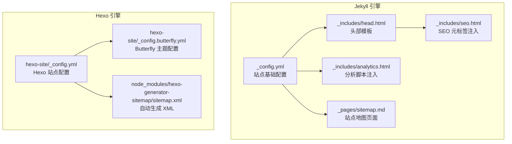
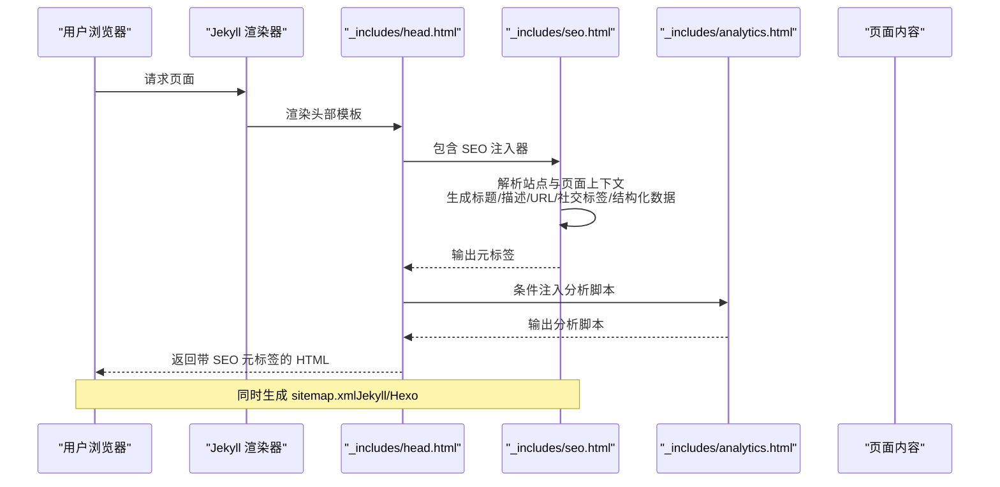
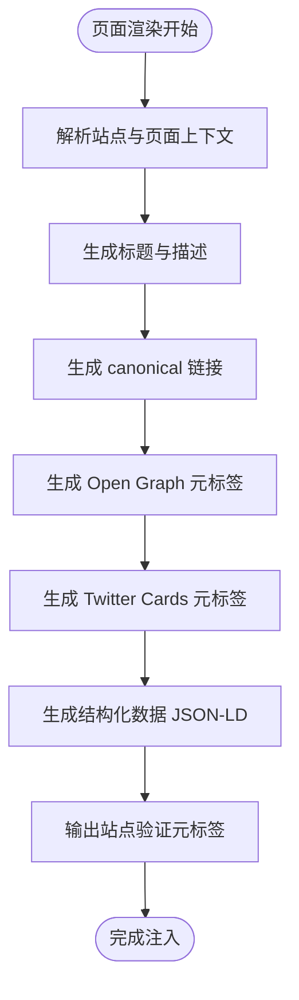
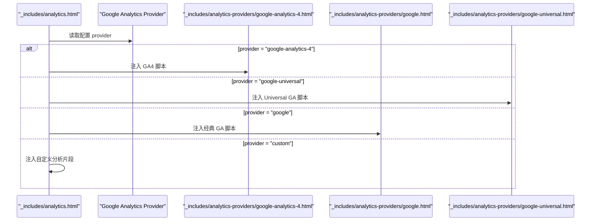
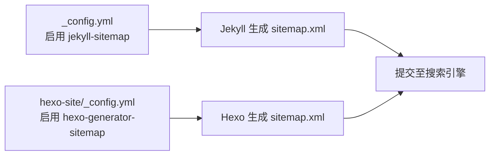
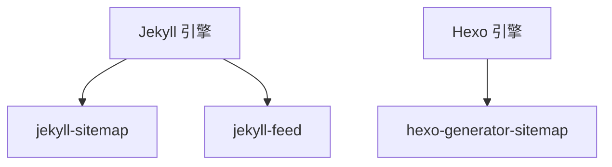

# SEO 优化配置

<cite>
**本文引用的文件**
- [_config.yml](file://_config.yml)
- [_includes/head.html](file://_includes/head.html)
- [_includes/seo.html](file://_includes/seo.html)
- [_includes/analytics.html](file://_includes/analytics.html)
- [_includes/analytics-providers/google.html](file://_includes/analytics-providers/google.html)
- [_includes/analytics-providers/google-universal.html](file://_includes/analytics-providers/google-universal.html)
- [_includes/analytics-providers/google-analytics-4.html](file://_includes/analytics-providers/google-analytics-4.html)
- [_pages/sitemap.md](file://_pages/sitemap.md)
- [hexo-site/_config.yml](file://hexo-site/_config.yml)
- [hexo-site/_config.butterfly.yml](file://hexo-site/_config.butterfly.yml)
- [hexo-site/node_modules/hexo-generator-sitemap/sitemap.xml](file://hexo-site/node_modules/hexo-generator-sitemap/sitemap.xml)
</cite>

## 目录
1. [简介](#简介)
2. [项目结构](#项目结构)
3. [核心组件](#核心组件)
4. [架构总览](#架构总览)
5. [详细组件分析](#详细组件分析)
6. [依赖分析](#依赖分析)
7. [性能考量](#性能考量)
8. [故障排查指南](#故障排查指南)
9. [结论](#结论)
10. [附录](#附录)

## 简介
本文件面向使用 Jekyll 与 Hexo 双栈构建的个人学术主页，系统梳理了站点的 SEO 优化配置与最佳实践，涵盖元数据、Open Graph、Twitter Cards、结构化数据（Schema.org）、关键词与 URL 结构、robots.txt 与 sitemap.xml、性能监控与分析、移动端与 AMP 支持，以及 SEO 测试与提升策略。内容以仓库现有配置为依据，结合实现细节给出可操作的配置指引。

## 项目结构
该站点采用双引擎架构：
- Jekyll 静态站点：负责页面模板、SEO 元标签注入、RSS/Atom 订阅、分页与 sitemap 生成插件等。
- Hexo 子站点：位于 hexo-site 目录，使用主题与插件生成独立的 sitemap.xml，服务于搜索引擎发现。

图表来源
- [_config.yml:1-362](file://_config.yml#L1-L362)
- [_includes/head.html:1-17](file://_includes/head.html#L1-L17)
- [_includes/seo.html:1-147](file://_includes/seo.html#L1-L147)
- [_includes/analytics.html:1-14](file://_includes/analytics.html#L1-L14)
- [_pages/sitemap.md:1-38](file://_pages/sitemap.md#L1-L38)
- [hexo-site/_config.yml:1-110](file://hexo-site/_config.yml#L1-L110)
- [hexo-site/_config.butterfly.yml:1-343](file://hexo-site/_config.butterfly.yml#L1-L343)
- [hexo-site/node_modules/hexo-generator-sitemap/sitemap.xml:1-41](file://hexo-site/node_modules/hexo-generator-sitemap/sitemap.xml#L1-L41)

章节来源
- [_config.yml:1-362](file://_config.yml#L1-L362)
- [_includes/head.html:1-17](file://_includes/head.html#L1-L17)
- [_includes/seo.html:1-147](file://_includes/seo.html#L1-L147)
- [_includes/analytics.html:1-14](file://_includes/analytics.html#L1-L14)
- [_pages/sitemap.md:1-38](file://_pages/sitemap.md#L1-L38)
- [hexo-site/_config.yml:1-110](file://hexo-site/_config.yml#L1-L110)
- [hexo-site/_config.butterfly.yml:1-343](file://hexo-site/_config.butterfly.yml#L1-L343)
- [hexo-site/node_modules/hexo-generator-sitemap/sitemap.xml:1-41](file://hexo-site/node_modules/hexo-generator-sitemap/sitemap.xml#L1-L41)

## 核心组件
- SEO 元标签注入：通过模板集中生成标题、描述、canonical、Open Graph、Twitter Cards、结构化数据与站点验证元标签。
- 分析脚本注入：根据配置选择 Google Analytics 的不同版本（经典 Universal GA、GA4）或自定义分析。
- 站点地图：Jekyll 通过 jekyll-sitemap 插件生成 XML；Hexo 通过 hexo-generator-sitemap 生成 XML。
- RSS/Atom：Jekyll 默认启用 jekyll-feed，提供 Atom 订阅入口。

章节来源
- [_includes/seo.html:1-147](file://_includes/seo.html#L1-L147)
- [_includes/analytics.html:1-14](file://_includes/analytics.html#L1-L14)
- [_config.yml:309-324](file://_config.yml#L309-L324)
- [_includes/head.html:1-17](file://_includes/head.html#L1-L17)

## 架构总览
下图展示 SEO 相关的关键流程：页面渲染时，head 模板引入 SEO 注入器，后者根据页面上下文与全局配置生成各类元标签；分析脚本按配置注入；sitemap 页面与 XML 由各自引擎生成。

图表来源
- [_includes/head.html:1-17](file://_includes/head.html#L1-L17)
- [_includes/seo.html:1-147](file://_includes/seo.html#L1-L147)
- [_includes/analytics.html:1-14](file://_includes/analytics.html#L1-L14)
- [_config.yml:309-324](file://_config.yml#L309-L324)

## 详细组件分析

### SEO 元标签与结构化数据
- 标题与描述：优先使用页面级字段，回退到站点描述；经净化处理后输出。
- Canonical 链接：基于站点 URL 与 baseurl 生成规范链接，首页自动去除 index.html。
- Open Graph：设置语言、站点名、标题、类型（文章/非文章）、描述、URL、图片等。
- Twitter Cards：根据页面头图或站点默认 OG 图生成卡片类型与图片；输出站点作者与作者账号。
- 结构化数据（Schema.org）：输出站点主体（Person/Organization）与社交资料链接；输出组织 Logo（若配置）。
- 站点验证：支持 Google、Bing、Alexa、Yandex 的站点验证元标签。

图表来源
- [_includes/seo.html:1-147](file://_includes/seo.html#L1-L147)

章节来源
- [_includes/seo.html:1-147](file://_includes/seo.html#L1-L147)

### 分析与监控集成
- Provider 选择：支持关闭、Google 经典、Universal GA、GA4、自定义。
- GA4：异步加载 gtag 并初始化跟踪 ID。
- Universal GA：异步加载 analytics.js 并创建跟踪。
- 经典 GA：插入旧版 ga.js 脚本。
- 自定义：预留注入位，便于接入其他分析平台。

图表来源
- [_includes/analytics.html:1-14](file://_includes/analytics.html#L1-L14)
- [_includes/analytics-providers/google-analytics-4.html:1-9](file://_includes/analytics-providers/google-analytics-4.html#L1-L9)
- [_includes/analytics-providers/google.html:1-11](file://_includes/analytics-providers/google.html#L1-L11)
- [_includes/analytics-providers/google-universal.html:1-9](file://_includes/analytics-providers/google-universal.html#L1-L9)

章节来源
- [_includes/analytics.html:1-14](file://_includes/analytics.html#L1-L14)
- [_includes/analytics-providers/google-analytics-4.html:1-9](file://_includes/analytics-providers/google-analytics-4.html#L1-L9)
- [_includes/analytics-providers/google.html:1-11](file://_includes/analytics-providers/google.html#L1-L11)
- [_includes/analytics-providers/google-universal.html:1-9](file://_includes/analytics-providers/google-universal.html#L1-L9)

### 站点地图生成与提交
- Jekyll：启用 jekyll-sitemap 插件，自动生成 sitemap.xml 并收录分页链接。
- Hexo：启用 hexo-generator-sitemap，生成包含文章、标签、分类与站点首页的 sitemap.xml。
- 提交：在各搜索引擎后台提交 sitemap.xml 地址；定期刷新以确保索引最新。

图表来源
- [_config.yml:309-324](file://_config.yml#L309-L324)
- [hexo-site/_config.yml:96-99](file://hexo-site/_config.yml#L96-L99)
- [hexo-site/node_modules/hexo-generator-sitemap/sitemap.xml:1-41](file://hexo-site/node_modules/hexo-generator-sitemap/sitemap.xml#L1-L41)

章节来源
- [_config.yml:309-324](file://_config.yml#L309-L324)
- [_pages/sitemap.md:1-38](file://_pages/sitemap.md#L1-L38)
- [hexo-site/_config.yml:96-99](file://hexo-site/_config.yml#L96-L99)
- [hexo-site/node_modules/hexo-generator-sitemap/sitemap.xml:1-41](file://hexo-site/node_modules/hexo-generator-sitemap/sitemap.xml#L1-L41)

### URL 结构与内容可读性
- URL 结构：Jekyll 使用分类/标题的永久链接；Hexo 使用年/月/日/标题的永久链接。两者均支持可选尾随斜杠与 .html。
- 内容可读性：Jekyll 默认开启阅读时长、分页导航、分享按钮等；Hexo 提供目录（TOC）、分页、代码高亮等增强体验。

章节来源
- [_config.yml:302-304](file://_config.yml#L302-L304)
- [hexo-site/_config.yml:14-21](file://hexo-site/_config.yml#L14-L21)
- [hexo-site/_config.butterfly.yml:254-261](file://hexo-site/_config.butterfly.yml#L254-L261)

### 关键词优化与内容策略
- 页面级关键词：可在页面 YAML Front Matter 中设置 keywords 字段（Hexo）或通过描述与标题自然表达（Jekyll）。
- 内容质量：保持标题明确、摘要完整、正文结构清晰；利用阅读时长与字数统计辅助优化可读性。

章节来源
- [hexo-site/_config.yml:8-9](file://hexo-site/_config.yml#L8-L9)
- [hexo-site/_config.butterfly.yml:299-306](file://hexo-site/_config.butterfly.yml#L299-L306)

### robots.txt 与爬虫管理
- robots.txt：建议在站点根目录放置 robots.txt，声明 sitemap.xml 位置与爬取规则；针对 Jekyll 与 Hexo 产物分别配置。
- 爬虫管理：通过站点验证元标签与搜索引擎后台管理索引权限；避免重复内容与非必要页面被索引。

[本节为通用实践说明，不直接分析具体文件]

### 移动端 SEO 与 AMP 支持
- 移动端 SEO：确保 viewport 设置正确；响应式设计与图片优化；社交媒体卡片适配移动端尺寸。
- AMP 支持：如需 AMP 页面，建议在 Jekyll 中新增 AMP 布局与必需的结构化数据；或在 Hexo 中引入相应主题与插件。

[本节为通用实践说明，不直接分析具体文件]

### SEO 测试与排名提升策略
- 测试工具：使用 Google Search Console、Facebook Sharing Debugger、Twitter Card Validator、LinkedIn Post Inspector 等校验标签有效性。
- 排名提升：持续产出高质量内容；优化页面速度与可访问性；建立权威外链与社交互动；定期检查 sitemap 与死链。

[本节为通用实践说明，不直接分析具体文件]

## 依赖分析
- Jekyll 插件：jekyll-sitemap、jekyll-feed、jekyll-redirect-from 等。
- Hexo 插件：hexo-generator-sitemap。
- 主题与配置：Butterfly 主题在 Hexo 中提供导航、社交、分析、验证等配置项。

图表来源
- [_config.yml:309-324](file://_config.yml#L309-L324)
- [hexo-site/_config.yml:96-99](file://hexo-site/_config.yml#L96-L99)

章节来源
- [_config.yml:309-324](file://_config.yml#L309-L324)
- [hexo-site/_config.yml:96-99](file://hexo-site/_config.yml#L96-L99)

## 性能考量
- HTML 压缩：启用 jekyll-compress-html，忽略 development 环境，减少传输体积。
- 分析脚本：仅在生产环境注入分析脚本，避免开发阶段污染数据。
- 资源优化：合理设置 og_image 与 header 图片尺寸；避免过大图片影响加载速度。

章节来源
- [_config.yml:356-362](file://_config.yml#L356-L362)
- [_includes/analytics.html:1-14](file://_includes/analytics.html#L1-L14)

## 故障排查指南
- 标题/描述为空：检查页面 YAML 是否缺少 title/description/excerpt；确认 SEO 注入器的回退逻辑是否生效。
- canonical 链接错误：核对 _config.yml 中 url/baseurl 设置；确认 head 模板是否包含 SEO 注入器。
- 社交卡片不显示：确认页面 header.image 或站点 og_image 是否配置；检查图片路径与 base_path 拼接。
- 结构化数据缺失：确认 social.type 与 social.links 是否配置；检查 JSON-LD 输出位置。
- 分析脚本未加载：核对 analytics.provider 与 tracking_id；确认页面未显式禁用 analytics。
- sitemap 未生成：确认插件已启用且构建成功；核对 sitemap.md 页面与 Hexo 生成的 XML 文件。

章节来源
- [_includes/seo.html:1-147](file://_includes/seo.html#L1-L147)
- [_includes/analytics.html:1-14](file://_includes/analytics.html#L1-L14)
- [_config.yml:309-324](file://_config.yml#L309-L324)
- [hexo-site/_config.yml:96-99](file://hexo-site/_config.yml#L96-L99)

## 结论
本项目在 Jekyll 与 Hexo 双栈下实现了完善的 SEO 基础设施：统一的元标签注入、结构化数据输出、分析脚本接入、sitemap 自动生成与提交。建议在此基础上完善 robots.txt、移动端适配与 AMP 支持，并持续通过测试工具与数据分析优化内容与索引表现。

## 附录
- 配置清单要点
  - 站点基础：url、baseurl、title、description、locale
  - SEO：google_site_verification、bing_site_verification、social、og_image、og_description
  - 分析：analytics.provider、analytics.google.tracking_id
  - 插件：jekyll-sitemap、jekyll-feed、hexo-generator-sitemap
  - Hexo 主题：butterfly 的导航、社交、分析、验证等配置

章节来源
- [_config.yml:10-16](file://_config.yml#L10-L16)
- [_config.yml:132-157](file://_config.yml#L132-L157)
- [_config.yml:309-324](file://_config.yml#L309-L324)
- [hexo-site/_config.yml:1-11](file://hexo-site/_config.yml#L1-L11)
- [hexo-site/_config.yml:96-99](file://hexo-site/_config.yml#L96-L99)
- [hexo-site/_config.butterfly.yml:1-343](file://hexo-site/_config.butterfly.yml#L1-L343)