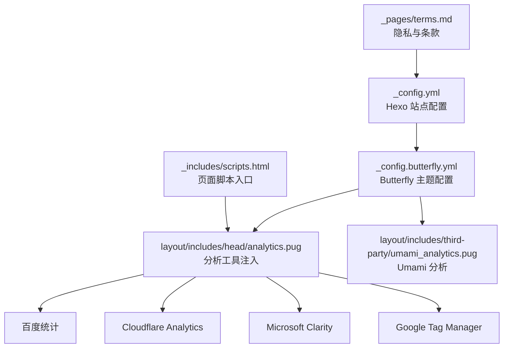
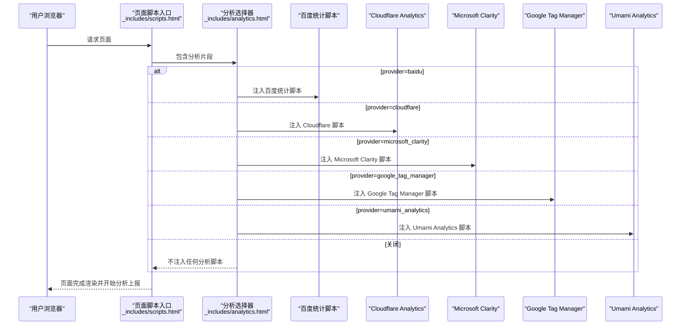
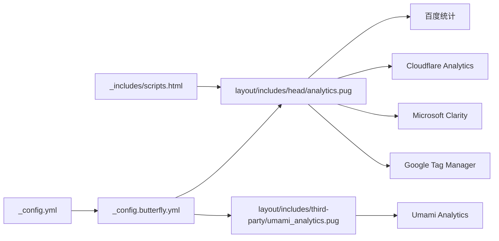

# 分析工具配置

<cite>
**本文引用的文件**
- [_config.yml](file://hexo-site/_config.yml)
- [_config.butterfly.yml](file://hexo-site/_config.butterfly.yml)
- [node_modules/hexo-theme-butterfly/layout/includes/head/analytics.pug](file://node_modules/hexo-theme-butterfly/layout/includes/head/analytics.pug)
- [node_modules/hexo-theme-butterfly/layout/includes/third-party/umami_analytics.pug](file://node_modules/hexo-theme-butterfly/layout/includes/third-party/umami_analytics.pug)
- [node_modules/hexo-theme-landscape/_config.yml](file://node_modules/hexo-theme-landscape/_config.yml)
</cite>

## 更新摘要
**所做更改**
- 更新了分析工具配置的现状：Google Analytics 已完全移除
- 重新组织了分析工具的分类和配置说明
- 添加了 Butterfly 主题内置分析工具的详细配置指南
- 更新了性能考量和故障排查指南
- 移除了已不存在的 Google Analytics 相关配置

## 目录
1. [简介](#简介)
2. [项目结构](#项目结构)
3. [核心组件](#核心组件)
4. [架构总览](#架构总览)
5. [详细组件分析](#详细组件分析)
6. [依赖关系分析](#依赖关系分析)
7. [性能考量](#性能考量)
8. [故障排查指南](#故障排查指南)
9. [结论](#结论)
10. [附录](#附录)

## 简介
本文件系统化梳理本仓库的分析工具配置与集成方式，覆盖以下能力：
- **已移除**：Google Analytics（GA4、Universal Analytics、旧版 GA）
- **当前支持**：百度统计、Cloudflare Analytics、Microsoft Clarity、Umami Analytics、Google Tag Manager
- **自定义分析脚本注入**
- 分析代码注入机制与事件追踪思路
- 用户行为分析的可扩展配置
- 隐私保护与合规要点（基于现有条款）
- 指标解读与报告最佳实践
- 性能影响评估与优化建议
- 实际配置示例与数据分析案例指引

## 项目结构
分析相关的核心位置集中在站点配置、主题配置和模板片段中：
- 站点配置：通过全局配置项控制分析提供商与跟踪 ID
- 主题配置：Butterfly 主题内置的分析工具配置
- 模板片段：按提供商条件包含对应的分析脚本
- 页面内容：隐私与条款页面对分析工具的隐私说明



**图表来源**
- [_config.yml:119](file://hexo-site/_config.yml#L119)
- [_config.butterfly.yml:687](file://hexo-site/_config.butterfly.yml#L687)
- [node_modules/hexo-theme-butterfly/layout/includes/head/analytics.pug:1](file://node_modules/hexo-theme-butterfly/layout/includes/head/analytics.pug#L1)
- [node_modules/hexo-theme-butterfly/layout/includes/third-party/umami_analytics.pug:1](file://node_modules/hexo-theme-butterfly/layout/includes/third-party/umami_analytics.pug#L1)

**章节来源**
- [_config.yml:119](file://hexo-site/_config.yml#L119)
- [_config.butterfly.yml:687](file://hexo-site/_config.butterfly.yml#L687)
- [node_modules/hexo-theme-butterfly/layout/includes/head/analytics.pug:1](file://node_modules/hexo-theme-butterfly/layout/includes/head/analytics.pug#L1)

## 核心组件
- **全局配置项**
  - 分析提供商：支持关闭、百度统计、Cloudflare Analytics、Microsoft Clarity、Umami Analytics、Google Tag Manager
  - 跟踪 ID：由提供商决定是否使用
- **条件包含逻辑**：根据配置动态插入对应分析脚本
- **注入入口**：页面脚本加载时一并注入分析代码
- **隐私与条款**：页面明确分析工具的用途与隐私政策链接

**章节来源**
- [_config.butterfly.yml:687](file://hexo-site/_config.butterfly.yml#L687)
- [node_modules/hexo-theme-butterfly/layout/includes/head/analytics.pug:1](file://node_modules/hexo-theme-butterfly/layout/includes/head/analytics.pug#L1)

## 架构总览
分析注入的整体流程如下：



**图表来源**
- [node_modules/hexo-theme-butterfly/layout/includes/head/analytics.pug:1](file://node_modules/hexo-theme-butterfly/layout/includes/head/analytics.pug#L1)
- [node_modules/hexo-theme-butterfly/layout/includes/third-party/umami_analytics.pug:1](file://node_modules/hexo-theme-butterfly/layout/includes/third-party/umami_analytics.pug#L1)

## 详细组件分析

### 组件一：全局配置与注入开关
- **配置项**
  - provider：可选值"false"（关闭）、"baidu"（百度统计）、"cloudflare"（Cloudflare Analytics）、"microsoft_clarity"（Microsoft Clarity）、"google_tag_manager"（Google Tag Manager）、"umami_analytics"（Umami Analytics）
  - tracking_id：用于传入各提供商脚本
- **注入控制**
  - 若未显式关闭且页面未禁用分析，则按 provider 选择对应脚本注入

**章节来源**
- [_config.butterfly.yml:687](file://hexo-site/_config.butterfly.yml#L687)
- [node_modules/hexo-theme-butterfly/layout/includes/head/analytics.pug:1](file://node_modules/hexo-theme-butterfly/layout/includes/head/analytics.pug#L1)

### 组件二：百度统计（Baidu Analytics）
- **注入机制**
  - 异步加载百度统计脚本并初始化账户
  - 支持 PJAX 页面切换时的页面浏览事件追踪
- **适用场景**
  - 国内网站的主要分析工具
- **配置示例**
  ```yaml
  baidu_analytics: YOUR_BAIDU_ANALYTICS_ID
  ```

**章节来源**
- [node_modules/hexo-theme-butterfly/layout/includes/head/analytics.pug:1](file://node_modules/hexo-theme-butterfly/layout/includes/head/analytics.pug#L1)

### 组件三：Cloudflare Analytics
- **注入机制**
  - 异步加载 Cloudflare Insights 脚本
  - 使用 defer 属性确保非阻塞加载
- **适用场景**
  - Cloudflare Workers 环境下的轻量级分析
- **配置示例**
  ```yaml
  cloudflare_analytics: YOUR_CLOUDFLARE_TOKEN
  ```

**章节来源**
- [node_modules/hexo-theme-butterfly/layout/includes/head/analytics.pug:25](file://node_modules/hexo-theme-butterfly/layout/includes/head/analytics.pug#L25)

### 组件四：Microsoft Clarity
- **注入机制**
  - 异步加载 Microsoft Clarity 脚本
  - 支持会话录制和用户行为分析
- **适用场景**
  - 用户体验和行为分析
- **配置示例**
  ```yaml
  microsoft_clarity: YOUR_MICROSOFT_CLARITY_ID
  ```

**章节来源**
- [node_modules/hexo-theme-butterfly/layout/includes/head/analytics.pug:28](file://node_modules/hexo-theme-butterfly/layout/includes/head/analytics.pug#L28)

### 组件五：Google Tag Manager（GTAG）
- **注入机制**
  - 异步加载 GTAG 脚本
  - 支持多个容器和自定义事件追踪
- **适用场景**
  - 复杂的标签管理需求
- **配置示例**
  ```yaml
  google_tag_manager:
    tag_id: YOUR_GTM_ID
    domain: YOUR_CUSTOM_DOMAIN
  ```

**章节来源**
- [node_modules/hexo-theme-butterfly/layout/includes/head/analytics.pug:36](file://node_modules/hexo-theme-butterfly/layout/includes/head/analytics.pug#L36)

### 组件六：Umami Analytics
- **注入机制**
  - 动态加载 Umami 脚本并初始化
  - 支持自托管和云版本
  - 自动获取和显示统计数据
- **适用场景**
  - 开源、隐私友好的分析解决方案
- **配置示例**
  ```yaml
  umami_analytics:
    enable: true
    serverURL: YOUR_SERVER_URL
    script_name: script.js
    website_id: YOUR_WEBSITE_ID
    token: YOUR_API_TOKEN
    UV_PV:
      site_uv: true
      site_pv: true
      page_pv: true
  ```

**章节来源**
- [node_modules/hexo-theme-butterfly/layout/includes/third-party/umami_analytics.pug:1](file://node_modules/hexo-theme-butterfly/layout/includes/third-party/umami_analytics.pug#L1)

### 组件七：自定义分析脚本
- **注入机制**
  - 提供一个空的自定义占位，便于直接粘贴第三方分析脚本
- **使用建议**
  - 在占位内添加所需脚本；注意与现有异步加载策略保持一致，避免阻塞首屏

**章节来源**
- [node_modules/hexo-theme-butterfly/layout/includes/head/analytics.pug:1](file://node_modules/hexo-theme-butterfly/layout/includes/head/analytics.pug#L1)

### 组件八：注入入口与页面集成
- **页面入口**
  - 脚本入口文件在页面渲染时包含分析片段，确保在页面加载后执行
- **控制点**
  - 可通过页面级 front matter 将 analytics 设为 false 来禁用某页的分析注入

**章节来源**
- [node_modules/hexo-theme-butterfly/layout/includes/head/analytics.pug:1](file://node_modules/hexo-theme-butterfly/layout/includes/head/analytics.pug#L1)

### 组件九：隐私与合规要点（基于现有条款）
- **分析工具用途说明**：用于理解访客如何与网站互动，使用 Cookie 和网络信标报告趋势
- **链接指引**：各分析工具的隐私政策链接
- **建议补充**
  - 如涉及欧盟用户，建议增加 Cookie 同意层与数据处理声明

**章节来源**
- [node_modules/hexo-theme-butterfly/layout/includes/head/analytics.pug:1](file://node_modules/hexo-theme-butterfly/layout/includes/head/analytics.pug#L1)

## 依赖关系分析
- **配置到注入的依赖**
  - _config.yml 决定主题配置
  - _config.butterfly.yml 决定分析提供商与跟踪 ID
  - layout/includes/head/analytics.pug 根据配置选择具体提供商脚本
  - layout/includes/third-party/umami_analytics.pug 处理 Umami Analytics 特殊逻辑
- **外部依赖**
  - 各提供商域名（如 hm.baidu.com、www.googletagmanager.com、static.cloudflareinsights.com）需可访问
- **潜在耦合**
  - provider 与 tracking_id 的一致性：若 provider 为有效值，tracking_id 必须有效；否则注入无效



**图表来源**
- [_config.yml:119](file://hexo-site/_config.yml#L119)
- [_config.butterfly.yml:687](file://hexo-site/_config.butterfly.yml#L687)
- [node_modules/hexo-theme-butterfly/layout/includes/head/analytics.pug:1](file://node_modules/hexo-theme-butterfly/layout/includes/head/analytics.pug#L1)
- [node_modules/hexo-theme-butterfly/layout/includes/third-party/umami_analytics.pug:1](file://node_modules/hexo-theme-butterfly/layout/includes/third-party/umami_analytics.pug#L1)

## 性能考量
- **加载策略**
  - 各提供商脚本均采用异步加载，减少对首屏渲染的阻塞
  - Cloudflare Analytics 使用 defer 属性确保非阻塞加载
- **资源体积**
  - 分析脚本体积较小，通常对整体包体影响有限
- **上报开销**
  - 页面浏览事件默认上报，建议仅在必要时手动触发额外事件，避免频繁上报造成网络与 CPU 开销
- **优化建议**
  - 合理选择提供商（优先考虑轻量级方案）
  - 在低流量或开发阶段可临时关闭分析以降低外部依赖
  - 对自定义脚本进行压缩与缓存，确保加载速度

**章节来源**
- [node_modules/hexo-theme-butterfly/layout/includes/head/analytics.pug:25](file://node_modules/hexo-theme-butterfly/layout/includes/head/analytics.pug#L25)
- [node_modules/hexo-theme-butterfly/layout/includes/third-party/umami_analytics.pug:1](file://node_modules/hexo-theme-butterfly/layout/includes/third-party/umami_analytics.pug#L1)

## 故障排查指南
- **问题：页面无分析数据**
  - **排查点**
    - provider 是否被设为 false 或未正确配置
    - tracking_id 是否填写
    - 页面是否显式禁用了分析（front matter 中 analytics=false）
- **问题：脚本未生效**
  - **排查点**
    - analytics.pug 是否包含在页面渲染中
    - 浏览器网络面板是否能成功加载提供商域名下的脚本
- **问题：隐私与合规风险**
  - **排查点**
    - terms 页面中的隐私说明是否清晰
    - 是否需要增加 Cookie 同意层与数据处理声明

**章节来源**
- [node_modules/hexo-theme-butterfly/layout/includes/head/analytics.pug:1](file://node_modules/hexo-theme-butterfly/layout/includes/head/analytics.pug#L1)

## 结论
本仓库已实现对多种分析工具的灵活注入，包括百度统计、Cloudflare Analytics、Microsoft Clarity、Umami Analytics 和 Google Tag Manager。Google Analytics 已完全移除，简化了分析工具配置。建议根据目标用户群体和隐私要求选择合适的分析工具，并在需要时通过自定义脚本集成其他分析解决方案。同时，应完善隐私与合规说明，必要时增加用户同意层与数据最小化策略。

## 附录

### A. 配置示例路径
- **启用百度统计**
  - 参考：[node_modules/hexo-theme-butterfly/layout/includes/head/analytics.pug:1](file://node_modules/hexo-theme-butterfly/layout/includes/head/analytics.pug#L1)
- **启用 Cloudflare Analytics**
  - 参考：[node_modules/hexo-theme-butterfly/layout/includes/head/analytics.pug:25](file://node_modules/hexo-theme-butterfly/layout/includes/head/analytics.pug#L25)
- **启用 Microsoft Clarity**
  - 参考：[node_modules/hexo-theme-butterfly/layout/includes/head/analytics.pug:28](file://node_modules/hexo-theme-butterfly/layout/includes/head/analytics.pug#L28)
- **启用 Google Tag Manager**
  - 参考：[node_modules/hexo-theme-butterfly/layout/includes/head/analytics.pug:36](file://node_modules/hexo-theme-butterfly/layout/includes/head/analytics.pug#L36)
- **启用 Umami Analytics**
  - 参考：[node_modules/hexo-theme-butterfly/layout/includes/third-party/umami_analytics.pug:1](file://node_modules/hexo-theme-butterfly/layout/includes/third-party/umami_analytics.pug#L1)

### B. 事件追踪与用户行为分析设置（思路）
- **百度统计事件追踪**
  - 在页面中调用 `_hmt.push(['_trackEvent', ...])` 上报自定义事件
  - 建议对点击、表单提交、视频播放等关键行为进行归因
- **Cloudflare Analytics 事件追踪**
  - 使用 `cf.beacon.track()` 方法上报自定义事件
- **Microsoft Clarity 事件追踪**
  - 使用 `clarity('identify', ...)` 或自定义标记方法
- **Google Tag Manager 事件追踪**
  - 在 GTAG 中调用 `gtag('event', ...)` 上报自定义事件
- **Umami Analytics 事件追踪**
  - 使用 `umami.track()` 方法上报自定义事件

### C. 国内分析工具集成指南（以百度统计为例）
- **步骤**
  - 在百度统计配置中填写正确的跟踪 ID
  - 确保脚本异步加载，避免阻塞首屏
  - 在隐私与条款页面补充相应说明
- **参考**
  - 配置文件：[node_modules/hexo-theme-butterfly/layout/includes/head/analytics.pug:1](file://node_modules/hexo-theme-butterfly/layout/includes/head/analytics.pug#L1)

### D. 隐私保护与 GDPR 合规要点
- **现有条款**
  - 各分析工具的用途与隐私政策链接已在主题配置中说明
- **建议**
  - 明确数据处理目的与依据
  - 提供 Cookie 同意层与撤回同意机制
  - 对未成年人与敏感地区用户采取额外保护措施

**章节来源**
- [node_modules/hexo-theme-butterfly/layout/includes/head/analytics.pug:1](file://node_modules/hexo-theme-butterfly/layout/includes/head/analytics.pug#L1)
- [node_modules/hexo-theme-butterfly/layout/includes/third-party/umami_analytics.pug:1](file://node_modules/hexo-theme-butterfly/layout/includes/third-party/umami_analytics.pug#L1)