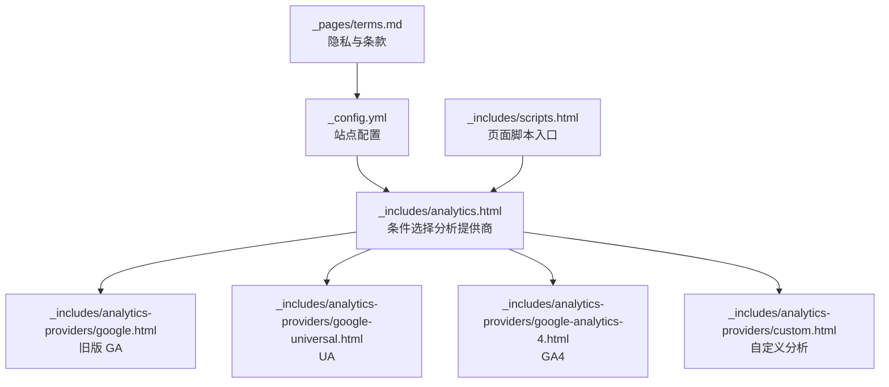
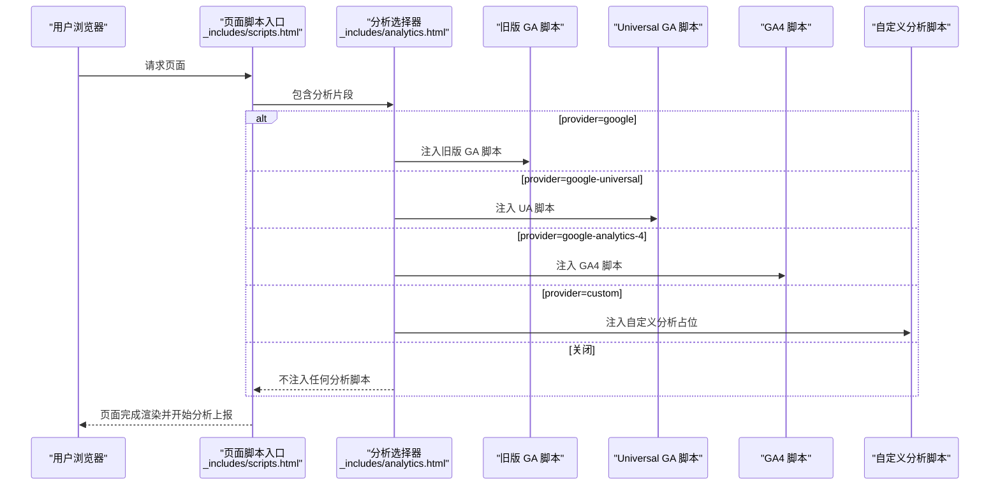
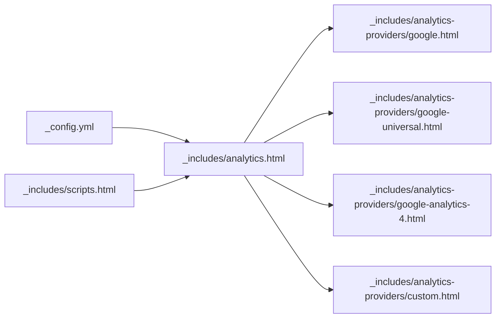

# 分析工具配置

<cite>
**本文引用的文件**
- [_config.yml](file://_config.yml)
- [_includes/analytics.html](file://_includes/analytics.html)
- [_includes/analytics-providers/google.html](file://_includes/analytics-providers/google.html)
- [_includes/analytics-providers/google-universal.html](file://_includes/analytics-providers/google-universal.html)
- [_includes/analytics-providers/google-analytics-4.html](file://_includes/analytics-providers/google-analytics-4.html)
- [_includes/analytics-providers/custom.html](file://_includes/analytics-providers/custom.html)
- [_includes/scripts.html](file://_includes/scripts.html)
- [_pages/terms.md](file://_pages/terms.md)
- [_posts/2025-02-12-optimize.md](file://_posts/2025-02-12-optimize.md)
</cite>

## 目录
1. [简介](#简介)
2. [项目结构](#项目结构)
3. [核心组件](#核心组件)
4. [架构总览](#架构总览)
5. [详细组件分析](#详细组件分析)
6. [依赖关系分析](#依赖关系分析)
7. [性能考量](#性能考量)
8. [故障排查指南](#故障排查指南)
9. [结论](#结论)
10. [附录](#附录)

## 简介
本文件系统化梳理本仓库的分析工具配置与集成方式，覆盖以下能力：
- Google Analytics（GA4、Universal Analytics、旧版 GA）
- 自定义分析脚本注入
- 分析代码注入机制与事件追踪思路
- 用户行为分析的可扩展配置
- 隐私保护与合规要点（基于现有条款）
- 指标解读与报告最佳实践
- 性能影响评估与优化建议
- 实际配置示例与数据分析案例指引

## 项目结构
分析相关的核心位置集中在站点配置、模板片段与页面内容中：
- 站点配置：通过全局配置项控制分析提供商与跟踪 ID
- 模板片段：按提供商条件包含对应的分析脚本
- 页面内容：隐私与条款页面对 Google Analytics 的隐私说明

图表来源
- [_config.yml:156-161](file://_config.yml#L156-L161)
- [_includes/analytics.html:1-14](file://_includes/analytics.html#L1-14)
- [_includes/analytics-providers/google.html:1-11](file://_includes/analytics-providers/google.html#L1-L11)
- [_includes/analytics-providers/google-universal.html:1-9](file://_includes/analytics-providers/google-universal.html#L1-L9)
- [_includes/analytics-providers/google-analytics-4.html:1-9](file://_includes/analytics-providers/google-analytics-4.html#L1-L9)
- [_includes/analytics-providers/custom.html:1-3](file://_includes/analytics-providers/custom.html#L1-L3)
- [_includes/scripts.html:1-4](file://_includes/scripts.html#L1-L4)
- [_pages/terms.md:37-40](file://_pages/terms.md#L37-L40)

章节来源
- [_config.yml:156-161](file://_config.yml#L156-L161)
- [_includes/analytics.html:1-14](file://_includes/analytics.html#L1-L14)
- [_includes/scripts.html:1-4](file://_includes/scripts.html#L1-L4)

## 核心组件
- 全局配置项
  - 分析提供商：支持关闭、Google（旧版 GA）、Universal（UA）、GA4、自定义
  - 跟踪 ID：由提供商决定是否使用
- 条件包含逻辑：根据配置动态插入对应分析脚本
- 注入入口：页面脚本加载时一并注入分析代码
- 隐私与条款：页面明确 GA 的用途与隐私政策链接

章节来源
- [_config.yml:156-161](file://_config.yml#L156-L161)
- [_includes/analytics.html:1-14](file://_includes/analytics.html#L1-L14)
- [_includes/scripts.html:1-4](file://_includes/scripts.html#L1-L4)
- [_pages/terms.md:37-40](file://_pages/terms.md#L37-L40)

## 架构总览
分析注入的整体流程如下：

图表来源
- [_includes/scripts.html:1-4](file://_includes/scripts.html#L1-L4)
- [_includes/analytics.html:1-14](file://_includes/analytics.html#L1-L14)
- [_includes/analytics-providers/google.html:1-11](file://_includes/analytics-providers/google.html#L1-L11)
- [_includes/analytics-providers/google-universal.html:1-9](file://_includes/analytics-providers/google-universal.html#L1-L9)
- [_includes/analytics-providers/google-analytics-4.html:1-9](file://_includes/analytics-providers/google-analytics-4.html#L1-L9)
- [_includes/analytics-providers/custom.html:1-3](file://_includes/analytics-providers/custom.html#L1-L3)

## 详细组件分析

### 组件一：全局配置与注入开关
- 配置项
  - provider：可选值“false”（关闭）、"google"（旧版 GA）、"google-universal"（UA）、"google-analytics-4"（GA4）、"custom"
  - google.tracking_id：用于传入各提供商脚本
- 注入控制
  - 若未显式关闭且页面未禁用分析，则按 provider 选择对应脚本注入

章节来源
- [_config.yml:156-161](file://_config.yml#L156-L161)
- [_includes/analytics.html:1-14](file://_includes/analytics.html#L1-L14)

### 组件二：旧版 Google Analytics（Classic GA）
- 注入机制
  - 异步加载 GA 脚本并初始化账户与页面浏览事件
- 适用场景
  - 保留历史数据的兼容需求
- 注意事项
  - GA4 已成为默认推荐，旧版 GA 已停止接受新属性

章节来源
- [_includes/analytics-providers/google.html:1-11](file://_includes/analytics-providers/google.html#L1-L11)

### 组件三：Universal Analytics（UA）
- 注入机制
  - 异步加载 analytics.js 并创建跟踪器发送页面浏览事件
- 适用场景
  - 过渡期或部分 UA 特性仍需使用的场景
- 注意事项
  - GA4 为长期发展方向，UA 已停止接收新属性

章节来源
- [_includes/analytics-providers/google-universal.html:1-9](file://_includes/analytics-providers/google-universal.html#L1-L9)

### 组件四：Google Analytics 4（GA4）
- 注入机制
  - 异步加载 gtag 脚本，初始化 dataLayer，调用 config 完成基础配置
- 适用场景
  - 新建或迁移至 GA4 的首选方案
- 扩展建议
  - 可在页面中补充 gtag('config', ...) 或自定义事件上报逻辑（见“自定义分析脚本”）

章节来源
- [_includes/analytics-providers/google-analytics-4.html:1-9](file://_includes/analytics-providers/google-analytics-4.html#L1-L9)

### 组件五：自定义分析脚本
- 注入机制
  - 提供一个空的自定义占位，便于直接粘贴第三方分析脚本（如百度统计、CNZZ 等）
- 使用建议
  - 在占位内添加所需脚本；注意与 GA4/UA 的异步加载策略保持一致，避免阻塞首屏

章节来源
- [_includes/analytics-providers/custom.html:1-3](file://_includes/analytics-providers/custom.html#L1-L3)

### 组件六：注入入口与页面集成
- 页面入口
  - 脚本入口文件在页面渲染时包含分析片段，确保在页面加载后执行
- 控制点
  - 可通过页面级 front matter 将 analytics 设为 false 来禁用某页的分析注入

章节来源
- [_includes/scripts.html:1-4](file://_includes/scripts.html#L1-L4)
- [_includes/analytics.html:1-14](file://_includes/analytics.html#L1-L14)

### 组件七：隐私与合规要点（基于现有条款）
- GA 用途说明：用于理解访客如何与网站互动，使用 Cookie 和网络信标报告趋势，不识别个体访客
- 链接指引：隐私政策链接指向 Google 官方页面
- 建议补充
  - 如涉及欧盟用户，建议增加 Cookie 同意层与数据处理声明

章节来源
- [_pages/terms.md:37-40](file://_pages/terms.md#L37-L40)

## 依赖关系分析
- 配置到注入的依赖
  - _config.yml 决定 provider 与 tracking_id
  - _includes/analytics.html 根据 provider 选择具体提供商脚本
  - _includes/scripts.html 在页面渲染时包含分析片段
- 外部依赖
  - 各提供商域名（如 www.googletagmanager.com、www.google-analytics.com）需可访问
- 潜在耦合
  - provider 与 tracking_id 的一致性：若 provider 为 GA4/UA/旧版 GA，tracking_id 必须有效；否则注入无效

图表来源
- [_config.yml:156-161](file://_config.yml#L156-L161)
- [_includes/analytics.html:1-14](file://_includes/analytics.html#L1-L14)
- [_includes/analytics-providers/google.html:1-11](file://_includes/analytics-providers/google.html#L1-L11)
- [_includes/analytics-providers/google-universal.html:1-9](file://_includes/analytics-providers/google-universal.html#L1-L9)
- [_includes/analytics-providers/google-analytics-4.html:1-9](file://_includes/analytics-providers/google-analytics-4.html#L1-L9)
- [_includes/analytics-providers/custom.html:1-3](file://_includes/analytics-providers/custom.html#L1-L3)
- [_includes/scripts.html:1-4](file://_includes/scripts.html#L1-L4)

## 性能考量
- 加载策略
  - 各提供商脚本均采用异步加载，减少对首屏渲染的阻塞
- 资源体积
  - 分析脚本体积较小，通常对整体包体影响有限
- 上报开销
  - 页面浏览事件默认上报，建议仅在必要时手动触发额外事件，避免频繁上报造成网络与 CPU 开销
- 优化建议
  - 合理选择提供商（优先 GA4）
  - 在低流量或开发阶段可临时关闭 provider 以降低外部依赖
  - 对自定义脚本进行压缩与缓存，确保加载速度

章节来源
- [_includes/analytics-providers/google.html:1-11](file://_includes/analytics-providers/google.html#L1-L11)
- [_includes/analytics-providers/google-universal.html:1-9](file://_includes/analytics-providers/google-universal.html#L1-L9)
- [_includes/analytics-providers/google-analytics-4.html:1-9](file://_includes/analytics-providers/google-analytics-4.html#L1-L9)
- [_posts/2025-02-12-optimize.md:16-31](file://_posts/2025-02-12-optimize.md#L16-L31)

## 故障排查指南
- 问题：页面无分析数据
  - 排查点
    - provider 是否被设为 false 或未正确配置
    - tracking_id 是否填写
    - 页面是否显式禁用了分析（front matter 中 analytics=false）
- 问题：脚本未生效
  - 排查点
    - scripts.html 是否包含 analytics.html
    - 浏览器网络面板是否能成功加载提供商域名下的脚本
- 问题：隐私与合规风险
  - 排查点
    - terms 页面中的隐私说明是否清晰
    - 是否需要增加 Cookie 同意层与数据处理声明

章节来源
- [_includes/analytics.html:1-14](file://_includes/analytics.html#L1-L14)
- [_includes/scripts.html:1-4](file://_includes/scripts.html#L1-L4)
- [_pages/terms.md:37-40](file://_pages/terms.md#L37-L40)

## 结论
本仓库已实现对 Google Analytics（旧版 GA、Universal、GA4）与自定义分析脚本的灵活注入，结合页面级开关与配置项，可在不同场景下快速切换与关闭分析。建议优先采用 GA4，并在需要时通过自定义脚本集成国内分析工具（如百度统计、CNZZ）。同时，应完善隐私与合规说明，必要时增加用户同意层与数据最小化策略。

## 附录

### A. 配置示例路径
- 启用 GA4 并设置跟踪 ID
  - 参考：[_config.yml:156-161](file://_config.yml#L156-L161)
- 启用 Universal Analytics 并设置跟踪 ID
  - 参考：[_config.yml:156-161](file://_config.yml#L156-L161)
- 启用旧版 GA 并设置跟踪 ID
  - 参考：[_config.yml:156-161](file://_config.yml#L156-L161)
- 自定义分析脚本占位
  - 参考：[_includes/analytics-providers/custom.html:1-3](file://_includes/analytics-providers/custom.html#L1-L3)

### B. 事件追踪与用户行为分析设置（思路）
- GA4 事件追踪
  - 在页面中调用 gtag('event', ...) 上报自定义事件
  - 建议对点击、表单提交、视频播放等关键行为进行归因
- UA 事件追踪
  - 使用 ga('send', 'event', ...) 上报事件
- 数据解读与报告
  - 关注转化漏斗、跳出率、平均停留时长、热门内容等指标
  - 结合受众画像与渠道来源进行归因分析

### C. 国内分析工具集成指南（以百度统计、CNZZ 为例）
- 步骤
  - 在自定义脚本占位中粘贴对应脚本
  - 确保脚本异步加载，避免阻塞首屏
  - 在隐私与条款页面补充相应说明
- 参考
  - 占位文件：[_includes/analytics-providers/custom.html:1-3](file://_includes/analytics-providers/custom.html#L1-L3)

### D. 隐私保护与 GDPR 合规要点
- 现有条款
  - GA 用途与隐私政策链接已在条款页面说明
- 建议
  - 明确数据处理目的与依据
  - 提供 Cookie 同意层与撤回同意机制
  - 对未成年人与敏感地区用户采取额外保护措施

章节来源
- [_pages/terms.md:37-40](file://_pages/terms.md#L37-L40)