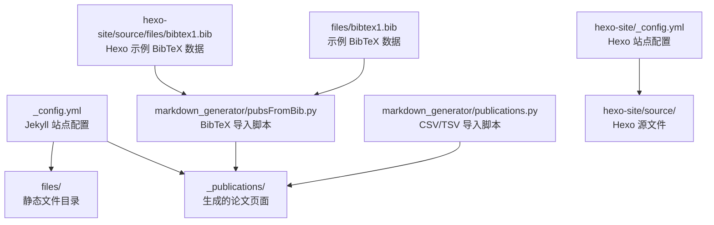
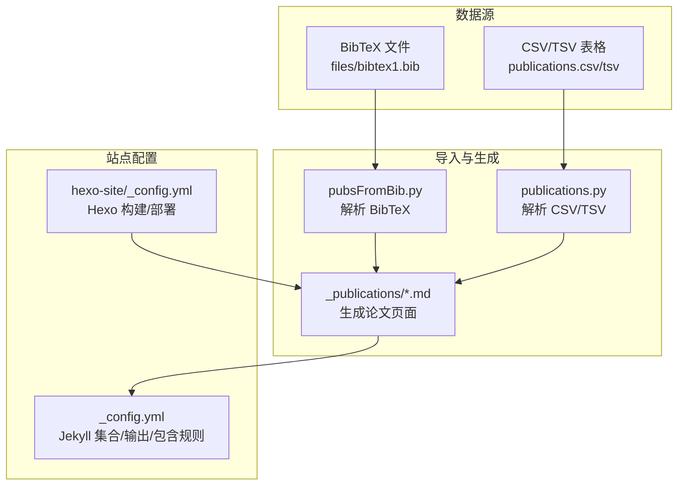
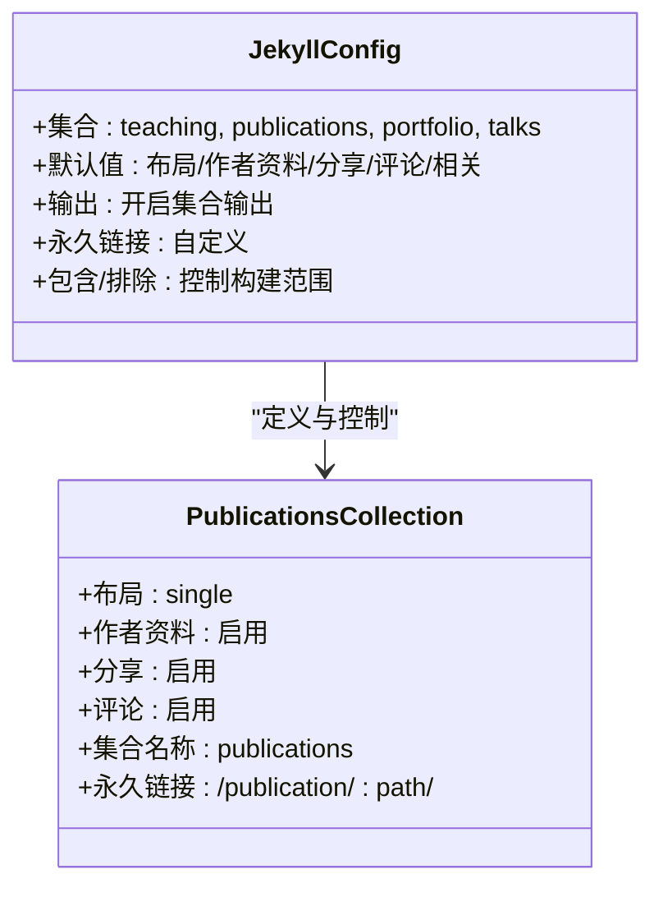
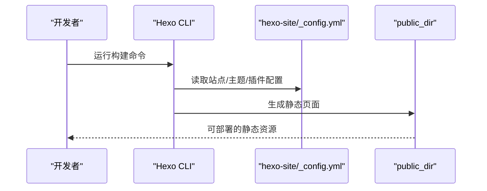
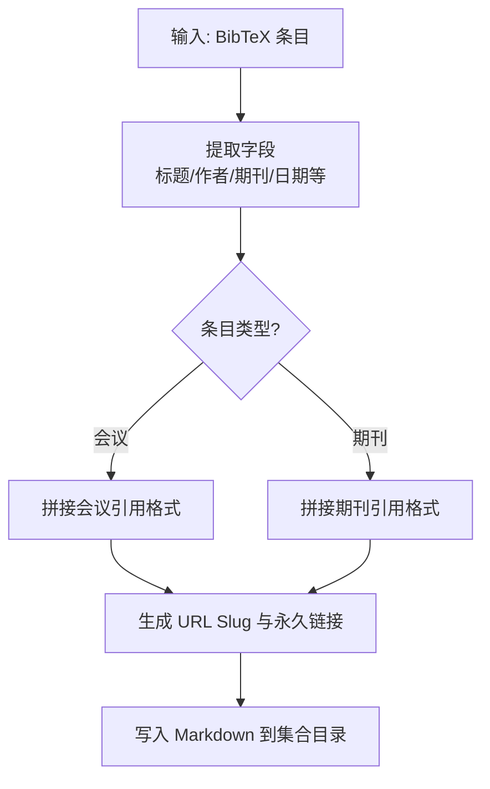
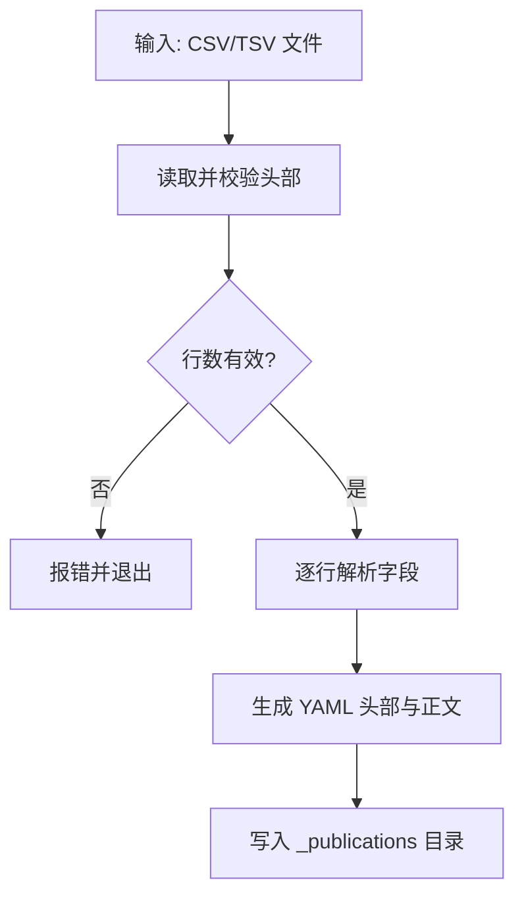
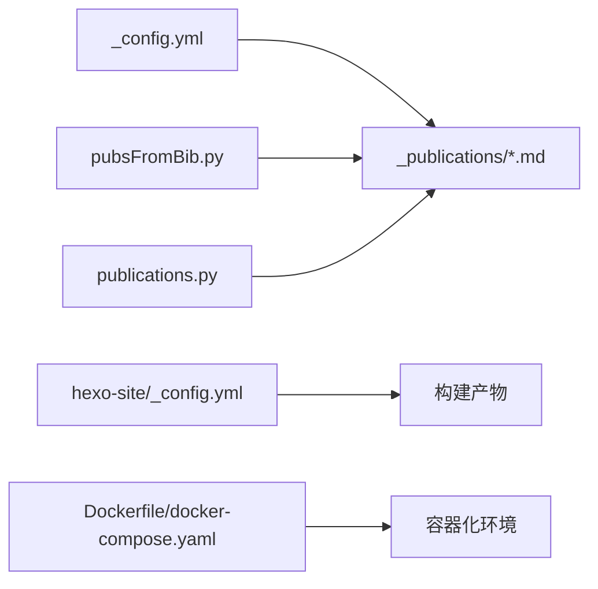

# 文件上传和管理

<cite>
**本文引用的文件**
- [_config.yml](file://_config.yml)
- [files/bibtex1.bib](file://files/bibtex1.bib)
- [hexo-site/_config.yml](file://hexo-site/_config.yml)
- [hexo-site/source/files/bibtex1.bib](file://hexo-site/source/files/bibtex1.bib)
- [markdown_generator/publications.py](file://markdown_generator/publications.py)
- [markdown_generator/pubsFromBib.py](file://markdown_generator/pubsFromBib.py)
- [Dockerfile](file://Dockerfile)
- [docker-compose.yaml](file://docker-compose.yaml)
- [README.md](file://README.md)
</cite>

## 目录
1. [简介](#简介)
2. [项目结构](#项目结构)
3. [核心组件](#核心组件)
4. [架构总览](#架构总览)
5. [组件详解](#组件详解)
6. [依赖关系分析](#依赖关系分析)
7. [性能与可扩展性](#性能与可扩展性)
8. [故障排查指南](#故障排查指南)
9. [结论](#结论)
10. [附录：最佳实践与示例](#附录最佳实践与示例)

## 简介
本文件围绕“文件上传与管理”主题，结合当前仓库中的静态站点生成与文献管理工具链，系统阐述以下能力与实践：
- 面向静态站点的文件发布与访问控制思路（基于 Jekyll 与 Hexo 的配置）
- BibTeX 文献数据的导入、解析与页面生成流程
- 文件访问权限与下载统计的配置建议（概念性指导）
- 安全性与备份策略（概念性指导）
- 文件大小限制、格式校验与病毒扫描的配置建议（概念性指导）
- 批量操作与版本控制的建议（概念性指导）
- 错误处理与用户体验优化建议（概念性指导）

说明：当前仓库未包含服务端文件上传接口或动态后端逻辑，因此本文以静态站点与本地脚本工具链为依据，提供可落地的配置与流程建议。

## 项目结构
本仓库包含两类内容与之相关的子项目：
- Jekyll 主站点：通过配置文件控制站点行为、集合输出与文件包含规则
- Hexo 子站点：独立的 Hexo 站点，包含部署与主题配置
- 文献管理脚本：Python 脚本用于从 CSV/TSV 或 BibTeX 导入数据生成 Markdown 页面

图表来源
- [_config.yml](file://_config.yml)
- [hexo-site/_config.yml](file://hexo-site/_config.yml)
- [markdown_generator/publications.py](file://markdown_generator/publications.py)
- [markdown_generator/pubsFromBib.py](file://markdown_generator/pubsFromBib.py)
- [files/bibtex1.bib](file://files/bibtex1.bib)
- [hexo-site/source/files/bibtex1.bib](file://hexo-site/source/files/bibtex1.bib)

章节来源
- [_config.yml](file://_config.yml)
- [hexo-site/_config.yml](file://hexo-site/_config.yml)

## 核心组件
- Jekyll 配置与集合
  - 通过集合（collections）定义论文、教学、作品集、演讲等页面类型，并控制输出与永久链接
  - 通过 include/exclude 控制哪些文件被站点读取与打包
- Hexo 配置与部署
  - Hexo 提供主题与部署配置，支持一键构建与部署
- 文献导入脚本
  - CSV/TSV 导入：从表格数据生成论文页面 Markdown
  - BibTeX 导入：解析 BibTeX 条目，生成论文页面 Markdown

章节来源
- [_config.yml](file://_config.yml)
- [hexo-site/_config.yml](file://hexo-site/_config.yml)
- [markdown_generator/publications.py](file://markdown_generator/publications.py)
- [markdown_generator/pubsFromBib.py](file://markdown_generator/pubsFromBib.py)

## 架构总览
下图展示从数据源到页面生成的整体流程，以及与站点配置的关系：

图表来源
- [markdown_generator/pubsFromBib.py](file://markdown_generator/pubsFromBib.py)
- [markdown_generator/publications.py](file://markdown_generator/publications.py)
- [_config.yml](file://_config.yml)
- [hexo-site/_config.yml](file://hexo-site/_config.yml)

## 组件详解

### Jekyll 集合与页面生成
- 论文集合（publications）：通过集合定义与默认值控制布局、分享、评论、相关文章等行为
- 输出与永久链接：集合输出开启，永久链接格式可自定义
- 包含与排除：通过 include/exclude 控制哪些文件进入站点构建

图表来源
- [_config.yml](file://_config.yml)

章节来源
- [_config.yml](file://_config.yml)

### Hexo 构建与部署
- 构建目录与输出：source_dir/public_dir 控制源文件与输出目录
- 主题与插件：主题配置与多种 Hexo 插件
- 部署：提供部署类型配置入口

图表来源
- [hexo-site/_config.yml](file://hexo-site/_config.yml)

章节来源
- [hexo-site/_config.yml](file://hexo-site/_config.yml)

### BibTeX 管理与引用格式处理
- BibTeX 解析：脚本解析条目字段（标题、作者、期刊、卷期、页码、年份、出版者等）
- 引用格式：根据条目类型（会议/期刊）拼接引用文本
- 永久链接：基于日期与标题生成 URL slug 与永久链接
- 输出：生成符合 Jekyll 规范的 Markdown 文件，写入集合目录

图表来源
- [markdown_generator/pubsFromBib.py](file://markdown_generator/pubsFromBib.py)

章节来源
- [markdown_generator/pubsFromBib.py](file://markdown_generator/pubsFromBib.py)
- [files/bibtex1.bib](file://files/bibtex1.bib)
- [hexo-site/source/files/bibtex1.bib](file://hexo-site/source/files/bibtex1.bib)

### CSV/TSV 导入与页面生成
- 输入格式：要求包含日期、标题、地点、摘要、引用、URL slug、论文链接、幻灯片链接等列
- 处理流程：读取文件、校验头部、逐行生成 Markdown，写入集合目录
- 输出：生成论文详情页 Markdown，包含 YAML 头部与正文内容

图表来源
- [markdown_generator/publications.py](file://markdown_generator/publications.py)

章节来源
- [markdown_generator/publications.py](file://markdown_generator/publications.py)

### 文件访问权限与下载统计（概念性指导）
- 访问控制
  - 静态站点通常无内置鉴权机制，建议通过外部网关或 CDN 策略实现访问控制
  - 对敏感文件采用私有存储 + 临时访问令牌方式
- 下载统计
  - 在下载链接处埋点或通过网关日志采集
  - 使用第三方统计服务（如分析平台）对下载事件进行归因

[本节为概念性指导，不直接分析具体文件]

### 安全性与备份策略（概念性指导）
- 安全性
  - 限制上传目录权限，仅允许必要 MIME 类型
  - 对上传文件进行二次校验与病毒扫描（建议在服务端集成）
- 备份
  - 定期备份静态资源与数据库（若存在）
  - 使用版本化对象存储与多区域冗余

[本节为概念性指导，不直接分析具体文件]

### 文件大小限制、格式验证与病毒扫描（概念性指导）
- 大小限制：在服务端配置请求体大小上限
- 格式验证：白名单校验扩展名与 MIME 类型
- 病毒扫描：集成云病毒扫描服务或本地 AV 工具

[本节为概念性指导，不直接分析具体文件]

### 批量操作与版本控制（概念性指导）
- 批量操作：通过脚本批量生成页面或更新元数据
- 版本控制：将生成的 Markdown 与数据源纳入 Git，便于回溯与协作

[本节为概念性指导，不直接分析具体文件]

## 依赖关系分析
- Jekyll 与 Hexo
  - 两者分别独立运行，Hexo 侧重主题与部署，Jekyll 侧重集合与内容组织
- 文献导入脚本
  - 依赖 Python 生态（如 pybtex），用于解析 BibTeX；依赖标准库进行文件读写
- 构建与运行
  - Dockerfile 与 docker-compose 提供容器化开发环境，确保依赖一致

图表来源
- [_config.yml](file://_config.yml)
- [hexo-site/_config.yml](file://hexo-site/_config.yml)
- [markdown_generator/pubsFromBib.py](file://markdown_generator/pubsFromBib.py)
- [markdown_generator/publications.py](file://markdown_generator/publications.py)
- [Dockerfile](file://Dockerfile)
- [docker-compose.yaml](file://docker-compose.yaml)

章节来源
- [_config.yml](file://_config.yml)
- [hexo-site/_config.yml](file://hexo-site/_config.yml)
- [Dockerfile](file://Dockerfile)
- [docker-compose.yaml](file://docker-compose.yaml)

## 性能与可扩展性
- 构建性能
  - 减少不必要的集合与页面数量，合理拆分数据源
  - 使用增量构建与缓存策略（如启用增量构建）
- 渲染性能
  - 控制页面复杂度，避免过长列表与重型组件
- 扩展性
  - 将数据源集中管理，统一通过脚本生成页面
  - 采用模块化脚本，便于维护与扩展

[本节提供一般性建议，不直接分析具体文件]

## 故障排查指南
- 构建失败
  - 检查 Ruby/Node 依赖安装与权限问题
  - 参考本地开发与权限配置说明
- Hexo 构建异常
  - 确认 Hexo 配置项正确，主题与插件版本兼容
- 文献导入错误
  - 校验 BibTeX/CSV/TSV 格式是否符合脚本预期
  - 关注缺失字段与编码问题

章节来源
- [README.md](file://README.md)
- [hexo-site/_config.yml](file://hexo-site/_config.yml)
- [markdown_generator/pubsFromBib.py](file://markdown_generator/pubsFromBib.py)
- [markdown_generator/publications.py](file://markdown_generator/publications.py)

## 结论
本仓库以静态站点与本地脚本为核心，提供了从 BibTeX/CSV/TSV 到论文页面的自动化生成路径。对于文件上传与管理的实际需求，建议在现有静态站点基础上引入服务端组件（如上传接口、鉴权与扫描），并通过容器化与 CI/CD 实现安全、可审计与可扩展的文件管理流程。

[本节为总结性内容，不直接分析具体文件]

## 附录：最佳实践与示例

- 文件上传与管理（概念性）
  - 上传接口：在服务端实现受控上传，限制大小与类型
  - 存储：对象存储 + CDN 加速，敏感文件走私有通道
  - 访问控制：基于角色的访问控制（RBAC）与临时令牌
  - 下载统计：埋点或网关日志采集，统一上报
  - 安全：二次校验、病毒扫描、备份与审计
- 批量与版本
  - 批量生成：脚本化生成页面，统一元数据
  - 版本控制：Git 管理数据与生成结果，便于回滚
- 用户体验
  - 上传进度反馈、错误提示与重试机制
  - 预览与校验：上传前预览与格式校验

[本节为概念性指导，不直接分析具体文件]