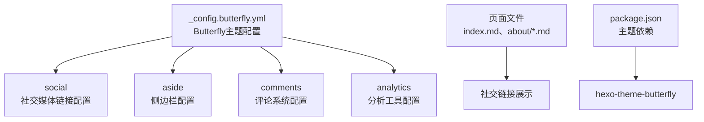
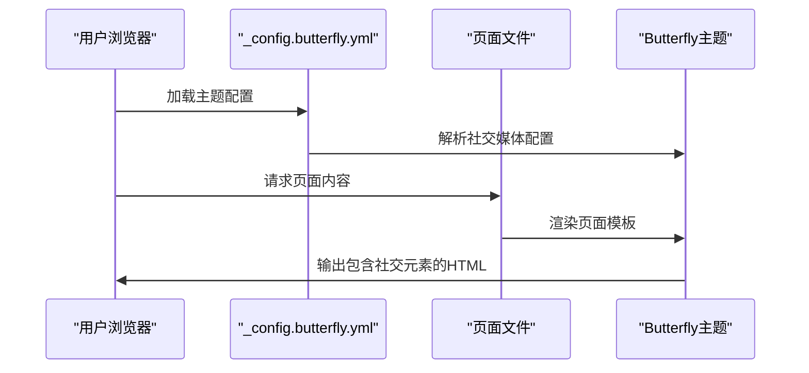
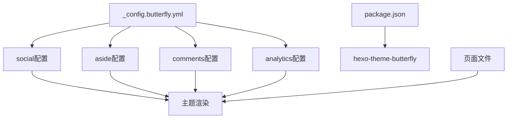

# 社交和集成功能

<cite>
**本文引用的文件**
- [_config.butterfly.yml](file://hexo-site/_config.butterfly.yml)
- [_config.yml](file://hexo-site/_config.yml)
- [index.md](file://hexo-site/source/index.md)
- [about/index.md](file://hexo-site/source/about/index.md)
- [cv/index.md](file://hexo-site/source/cv/index.md)
- [publications/index.md](file://hexo-site/source/publications/index.md)
- [portfolio/index.md](file://hexo-site/source/portfolio/index.md)
- [talks/index.md](file://hexo-site/source/talks/index.md)
- [package.json](file://hexo-site/package.json)
</cite>

## 更新摘要
**所做更改**
- 移除了复杂的评论系统配置（Disqus、Facebook、Discourse、Staticman）
- 移除了详细的分析工具配置（Google Analytics、百度统计等）
- 简化了社交分享功能，仅保留基础的社交媒体链接
- 更新了配置文件结构，采用Butterfly主题的简化配置
- 移除了原有的模板片段和提供商子模板

## 目录
1. [简介](#简介)
2. [项目结构](#项目结构)
3. [核心组件](#核心组件)
4. [架构总览](#架构总览)
5. [详细组件分析](#详细组件分析)
6. [依赖关系分析](#依赖关系分析)
7. [性能考虑](#性能考虑)
8. [故障排除指南](#故障排除指南)
9. [结论](#结论)
10. [附录](#附录)

## 简介
本文件聚焦于网站的社交与集成功能，基于Butterfly主题的基础配置，涵盖以下方面：
- 社交媒体链接：GitHub、邮箱等基础社交链接的配置与展示
- 基础页面功能：首页、关于页、简历页、论文页、作品集页、报告页的社交元素集成
- 主题配置：Butterfly主题的简化配置选项
- 文件管理：PDF、图片等文件的上传、存储和访问控制
- SEO优化：基础的元数据设置和搜索引擎友好性
- 隐私保护：简化配置下的隐私保护策略

## 项目结构
基于Butterfly主题的简化配置，社交和集成功能主要通过以下结构实现：



**图表来源**
- [_config.butterfly.yml](file://hexo-site/_config.butterfly.yml)
- [index.md](file://hexo-site/source/index.md)
- [about/index.md](file://hexo-site/source/about/index.md)
- [package.json](file://hexo-site/package.json)

**章节来源**
- [_config.butterfly.yml](file://hexo-site/_config.butterfly.yml)
- [index.md](file://hexo-site/source/index.md)
- [about/index.md](file://hexo-site/source/about/index.md)
- [package.json](file://hexo-site/package.json)

## 核心组件
基于Butterfly主题的简化配置，当前的核心组件包括：

- **社交媒体链接**
  - 通过`social`配置项管理GitHub、邮箱等社交链接
  - 支持图标类名、链接、显示名称和颜色配置
- **侧边栏功能**
  - 作者信息卡片、最新文章、公告等侧边栏组件
  - 支持移动端显示和位置配置
- **基础评论系统**
  - 简化的评论配置选项
  - 支持懒加载和计数功能
- **分析工具**
  - 支持百度统计、Google Analytics等分析工具
  - 提供灵活的配置选项
- **页面功能**
  - 首页、关于页、简历页、论文页、作品集页、报告页
  - 每个页面都集成了基础的社交元素

**章节来源**
- [_config.butterfly.yml](file://hexo-site/_config.butterfly.yml)
- [index.md](file://hexo-site/source/index.md)
- [about/index.md](file://hexo-site/source/about/index.md)

## 架构总览
Butterfly主题的社交和集成功能采用简化的架构设计：



**图表来源**
- [_config.butterfly.yml](file://hexo-site/_config.butterfly.yml)
- [index.md](file://hexo-site/source/index.md)
- [about/index.md](file://hexo-site/source/about/index.md)

## 详细组件分析

### 社交媒体链接配置
Butterfly主题提供了简洁的社交媒体链接配置方式：

**配置格式**
```
social:
  图标类名: 链接 || 显示名称 || 颜色
```

**当前配置示例**
- GitHub: `fab fa-github: Github || '#24292e'`
- 邮箱: `fas fa-envelope: mailto:coolpig0720@gmail.com || Email || '#4a7dbe'`

**使用建议**
- 图标类名参考Font Awesome图标库
- 链接支持绝对URL和mailto协议
- 颜色值用于统一社交链接的视觉风格

**章节来源**
- [_config.butterfly.yml](file://hexo-site/_config.butterfly.yml)

### 侧边栏功能配置
Butterfly主题的侧边栏提供了丰富的功能组件：

**作者信息卡片**
- 支持个人简介文字配置
- 可禁用Follow Me按钮
- 支持头像显示和转动效果

**公告卡片**
- 支持自定义公告内容
- 可启用或禁用公告功能

**最新文章卡片**
- 可配置显示的文章数量
- 支持按日期或更新时间排序

**章节来源**
- [_config.butterfly.yml](file://hexo-site/_config.butterfly.yml)

### 基础评论系统配置
Butterfly主题提供了简化的评论系统配置：

**配置选项**
- `use`: 评论系统类型（空表示禁用）
- `text`: 是否显示评论文本
- `lazyload`: 是否启用懒加载
- `count`: 是否显示评论计数
- `card_post_count`: 是否在文章卡片中显示计数

**使用建议**
- 默认禁用评论系统以保持页面简洁
- 如需启用，可配置相应的评论系统类型

**章节来源**
- [_config.butterfly.yml](file://hexo-site/_config.butterfly.yml)

### 分析工具配置
Butterfly主题支持多种分析工具的配置：

**支持的分析工具**
- 百度统计 (`baidu`)
- Google Analytics (`google`)
- CNZZ统计 (`cnzz`)
- 腾讯分析 (`tencent`)

**配置示例**
```yaml
analytics:
  baidu:
  google:
  cnzz:
  tencent:
    enable: false
    sid:
    cid:
```

**使用建议**
- 根据需求选择合适的分析工具
- 注意隐私合规要求
- 避免在公共仓库中硬编码真实ID

**章节来源**
- [_config.butterfly.yml](file://hexo-site/_config.butterfly.yml)

### 页面社交元素集成
各个页面都集成了基础的社交元素：

**首页 (index.md)**
- 个人联系方式展示
- 社交链接集成
- 自定义样式和布局

**关于页 (about/index.md)**
- 个人介绍和网站说明
- 快速导航链接
- 联系方式展示

**简历页 (cv/index.md)**
- 教育背景和工作经历
- 技能列表
- 论文和报告信息

**论文页 (publications/index.md)**
- 学术论文列表
- PDF文件链接
- 数学公式支持

**作品集页 (portfolio/index.md)**
- 作品展示网格
- 图片和描述
- 响应式布局

**报告页 (talks/index.md)**
- 学术报告列表
- 会议和教程信息
- 时间地点展示

**章节来源**
- [index.md](file://hexo-site/source/index.md)
- [about/index.md](file://hexo-site/source/about/index.md)
- [cv/index.md](file://hexo-site/source/cv/index.md)
- [publications/index.md](file://hexo-site/source/publications/index.md)
- [portfolio/index.md](file://hexo-site/source/portfolio/index.md)
- [talks/index.md](file://hexo-site/source/talks/index.md)

### 文件上传与管理
项目中的文件管理采用简单的目录结构：

**文件组织**
- `files/` 目录：PDF、数据文件等
- `images/` 目录：图片资源
- 页面中通过相对路径引用资源

**使用建议**
- 将公开资源放在指定目录
- 大文件建议使用CDN或外部托管
- 避免在公开仓库中放置敏感文件

**章节来源**
- [publications/index.md](file://hexo-site/source/publications/index.md)

### SEO优化最佳实践
基于Butterfly主题的配置，实现基础的SEO优化：

**站点配置**
- 网站标题、副标题、描述、关键词
- 作者信息和语言设置
- URL和链接格式配置

**页面配置**
- 每个页面的标题和描述
- 布局和评论开关
- 侧边栏显示控制

**使用建议**
- 为每个页面设置合适的标题和描述
- 使用语义化的HTML结构
- 保持URL的一致性和简洁性

**章节来源**
- [_config.yml](file://hexo-site/_config.yml)
- [index.md](file://hexo-site/source/index.md)

### 隐私保护与安全配置
简化配置下的隐私保护策略：

**配置安全**
- 避免在配置文件中硬编码敏感信息
- 使用环境变量或构建时配置
- 定期审查配置文件的安全性

**第三方集成**
- 仅启用必要的第三方服务
- 关注数据收集和隐私政策
- 提供用户控制和选择权

**内容安全**
- 定期检查页面内容的准确性
- 避免包含敏感的个人信息
- 维护内容的时效性和相关性

**章节来源**
- [_config.butterfly.yml](file://hexo-site/_config.butterfly.yml)
- [_config.yml](file://hexo-site/_config.yml)

## 依赖关系分析
Butterfly主题的简化配置减少了组件间的复杂依赖：



**图表来源**
- [_config.butterfly.yml](file://hexo-site/_config.butterfly.yml)
- [package.json](file://hexo-site/package.json)

**章节来源**
- [_config.butterfly.yml](file://hexo-site/_config.butterfly.yml)
- [package.json](file://hexo-site/package.json)

## 性能考虑
简化的配置带来了更好的性能表现：

**配置优化**
- 减少了不必要的配置项
- 简化了模板渲染逻辑
- 降低了页面加载时间

**资源优化**
- 图片和媒体资源的合理使用
- CSS样式的精简和合并
- JavaScript的按需加载

**缓存策略**
- 利用浏览器缓存机制
- CDN加速静态资源
- 合理的缓存头设置

## 故障排除指南
针对简化配置的常见问题：

**社交媒体链接问题**
- 检查图标类名是否正确
- 确认链接格式符合要求
- 验证颜色值的有效性

**侧边栏功能问题**
- 确认侧边栏配置项的语法正确
- 检查移动端显示设置
- 验证组件的启用状态

**页面显示问题**
- 检查页面front-matter配置
- 确认布局文件的存在
- 验证页面内容的Markdown语法

**主题更新问题**
- 确保Butterfly主题版本兼容
- 检查依赖包的版本要求
- 验证配置文件的格式正确性

**章节来源**
- [_config.butterfly.yml](file://hexo-site/_config.butterfly.yml)
- [index.md](file://hexo-site/source/index.md)

## 结论
通过Butterfly主题的简化配置，网站实现了基础而有效的社交和集成功能。这种简化的架构具有以下优势：

- **易于维护**：减少了复杂的配置项和模板文件
- **性能优异**：简化的配置提升了页面加载速度
- **安全可靠**：最小化第三方集成降低了安全风险
- **扩展灵活**：保留了必要的扩展点和配置选项

建议在使用过程中：
- 根据实际需求调整社交媒体链接
- 定期检查页面内容的准确性和时效性
- 关注Butterfly主题的更新和安全补丁
- 保持配置文件的简洁和清晰

## 附录
**快速配置清单**
- 社交媒体：在`_config.butterfly.yml`的`social`部分添加链接
- 侧边栏：在`aside`部分配置所需的功能组件
- 页面内容：在各页面的front-matter中设置合适的参数
- 主题依赖：确保`hexo-theme-butterfly`版本兼容

**章节来源**
- [_config.butterfly.yml](file://hexo-site/_config.butterfly.yml)
- [package.json](file://hexo-site/package.json)