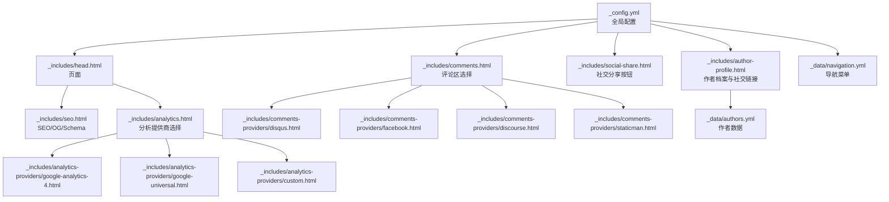
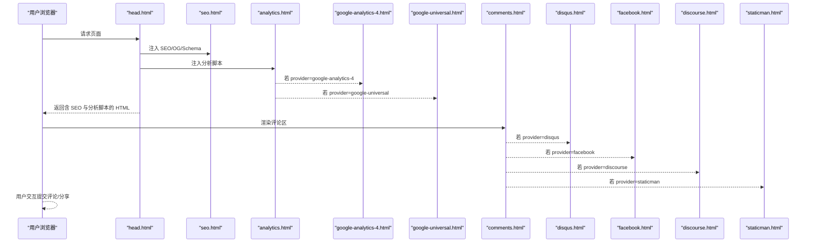
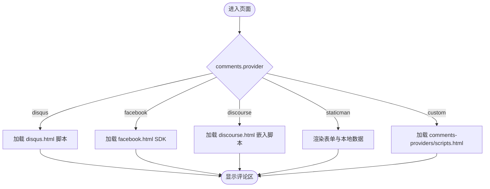
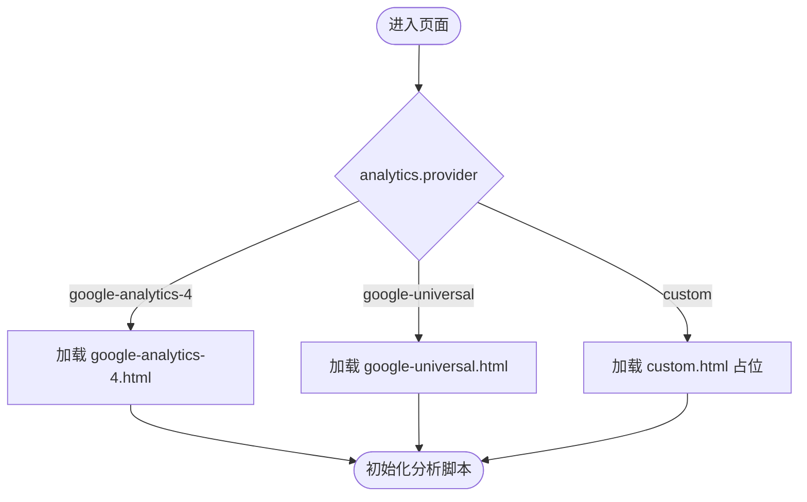
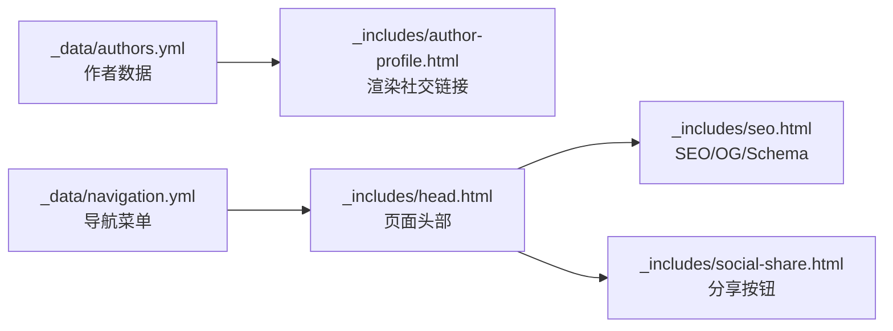
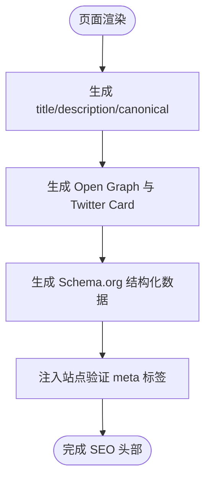
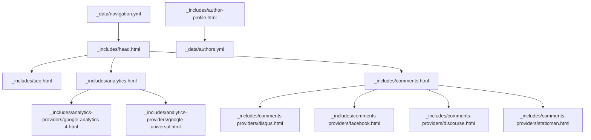

# 社交和集成功能

<cite>
**本文引用的文件**
- [_config.yml](file://_config.yml)
- [_includes/head.html](file://_includes/head.html)
- [_includes/seo.html](file://_includes/seo.html)
- [_includes/analytics.html](file://_includes/analytics.html)
- [_includes/analytics-providers/google-analytics-4.html](file://_includes/analytics-providers/google-analytics-4.html)
- [_includes/analytics-providers/google-universal.html](file://_includes/analytics-providers/google-universal.html)
- [_includes/analytics-providers/custom.html](file://_includes/analytics-providers/custom.html)
- [_includes/comments.html](file://_includes/comments.html)
- [_includes/comments-providers/disqus.html](file://_includes/comments-providers/disqus.html)
- [_includes/comments-providers/facebook.html](file://_includes/comments-providers/facebook.html)
- [_includes/comments-providers/discourse.html](file://_includes/comments-providers/discourse.html)
- [_includes/comments-providers/staticman.html](file://_includes/comments-providers/staticman.html)
- [_includes/social-share.html](file://_includes/social-share.html)
- [_includes/author-profile.html](file://_includes/author-profile.html)
- [_data/authors.yml](file://_data/authors.yml)
- [_data/navigation.yml](file://_data/navigation.yml)
</cite>

## 目录
1. [简介](#简介)
2. [项目结构](#项目结构)
3. [核心组件](#核心组件)
4. [架构总览](#架构总览)
5. [详细组件分析](#详细组件分析)
6. [依赖关系分析](#依赖关系分析)
7. [性能考虑](#性能考虑)
8. [故障排除指南](#故障排除指南)
9. [结论](#结论)
10. [附录](#附录)

## 简介
本文件聚焦于网站的社交与集成功能，涵盖以下方面：
- 评论系统：Disqus、Facebook、Discourse、静态评论（Staticman）等多提供商集成方式与配置要点
- 分析工具：Google Analytics（Universal、GA4）、自定义分析脚本的接入与数据追踪
- 社交分享与链接：X/Twitter、Facebook、LinkedIn、Mastodon、Bluesky 等平台的分享与作者档案中的社交链接
- 文件上传与访问：站点中文件目录与访问路径的组织方式与建议
- SEO 优化：元数据、Open Graph、结构化数据、站点验证等最佳实践
- 隐私与安全：第三方脚本加载策略、最小化敏感信息暴露、合规建议
- 实用示例与排障：基于现有模板的配置步骤与常见问题定位

## 项目结构
围绕社交与集成功能的关键文件分布如下：
- 全局配置：站点名称、URL、默认布局、评论与分析提供商、社交账号等
- 模板片段：头部 SEO、分析脚本、评论区、社交分享按钮、作者档案
- 数据文件：作者信息、导航菜单
- 分析与评论提供商子模板：按提供商注入脚本或嵌入代码

图表来源
- [_config.yml](file://_config.yml)
- [_includes/head.html](file://_includes/head.html)
- [_includes/seo.html](file://_includes/seo.html)
- [_includes/analytics.html](file://_includes/analytics.html)
- [_includes/analytics-providers/google-analytics-4.html](file://_includes/analytics-providers/google-analytics-4.html)
- [_includes/analytics-providers/google-universal.html](file://_includes/analytics-providers/google-universal.html)
- [_includes/analytics-providers/custom.html](file://_includes/analytics-providers/custom.html)
- [_includes/comments.html](file://_includes/comments.html)
- [_includes/comments-providers/disqus.html](file://_includes/comments-providers/disqus.html)
- [_includes/comments-providers/facebook.html](file://_includes/comments-providers/facebook.html)
- [_includes/comments-providers/discourse.html](file://_includes/comments-providers/discourse.html)
- [_includes/comments-providers/staticman.html](file://_includes/comments-providers/staticman.html)
- [_includes/social-share.html](file://_includes/social-share.html)
- [_includes/author-profile.html](file://_includes/author-profile.html)
- [_data/authors.yml](file://_data/authors.yml)
- [_data/navigation.yml](file://_data/navigation.yml)

章节来源
- [_config.yml](file://_config.yml)
- [_includes/head.html](file://_includes/head.html)
- [_includes/seo.html](file://_includes/seo.html)
- [_includes/analytics.html](file://_includes/analytics.html)
- [_includes/comments.html](file://_includes/comments.html)
- [_includes/social-share.html](file://_includes/social-share.html)
- [_includes/author-profile.html](file://_includes/author-profile.html)
- [_data/authors.yml](file://_data/authors.yml)
- [_data/navigation.yml](file://_data/navigation.yml)

## 核心组件
- 评论系统
  - 支持提供商：disqus、facebook、discourse、staticman、custom
  - 页面通过 comments.html 条件渲染对应提供商的嵌入或表单
- 分析工具
  - 支持提供商：google、google-universal、google-analytics-4、custom
  - 通过 analytics.html 动态选择并注入相应脚本
- 社交分享
  - 提供一键分享到 X、Facebook、LinkedIn、Mastodon、Bluesky 的链接
- 作者档案与社交链接
  - 在作者档案中展示并链接到 GitHub、Twitter/X、LinkedIn、Mastodon、Bluesky 等
- SEO 与结构化数据
  - 自动生成 canonical、Open Graph、Twitter Card、Schema.org 结构化数据
  - 支持站点验证 meta 标签

章节来源
- [_includes/comments.html](file://_includes/comments.html)
- [_includes/analytics.html](file://_includes/analytics.html)
- [_includes/social-share.html](file://_includes/social-share.html)
- [_includes/author-profile.html](file://_includes/author-profile.html)
- [_includes/seo.html](file://_includes/seo.html)
- [_config.yml](file://_config.yml)

## 架构总览
下图展示了页面加载时，社交与集成功能的调用链路与关键模板之间的关系。

图表来源
- [_includes/head.html](file://_includes/head.html)
- [_includes/seo.html](file://_includes/seo.html)
- [_includes/analytics.html](file://_includes/analytics.html)
- [_includes/analytics-providers/google-analytics-4.html](file://_includes/analytics-providers/google-analytics-4.html)
- [_includes/analytics-providers/google-universal.html](file://_includes/analytics-providers/google-universal.html)
- [_includes/comments.html](file://_includes/comments.html)
- [_includes/comments-providers/disqus.html](file://_includes/comments-providers/disqus.html)
- [_includes/comments-providers/facebook.html](file://_includes/comments-providers/facebook.html)
- [_includes/comments-providers/discourse.html](file://_includes/comments-providers/discourse.html)
- [_includes/comments-providers/staticman.html](file://_includes/comments-providers/staticman.html)

## 详细组件分析

### 评论系统配置与使用
- 配置入口
  - 在全局配置中设置 comments.provider 及各提供商参数（如 disqus.shortname、facebook.appid、discourse.server、staticman.*）
- 模板选择逻辑
  - comments.html 基于 provider 进行分支渲染，分别包含对应的提供商模板
- 各提供商要点
  - Disqus
    - 通过 disqus.html 注入嵌入与计数脚本；需在配置中填写 shortname
    - 适用于通用博客场景，支持评论计数与嵌入
  - Facebook
    - 通过 facebook.html 加载 SDK，并以 fb-comments 区域渲染评论墙
    - 可配置 appId、num_posts、colorscheme 等
  - Discourse
    - 通过 discourse.html 注入嵌入脚本，需配置 server 地址
    - 适合已有 Discourse 论坛的站点复用社区生态
  - Staticman（静态评论）
    - 通过 comments.html 渲染本地数据与表单，提交至 Staticman API
    - 表单字段受 staticman.allowedFields/requiredFields 控制，提交后生成 _data/comments 下的 YAML 条目
    - 优点：无需第三方服务，评论即为仓库内容；缺点：需要 GitHub Pages 工作流与仓库权限
- 使用建议
  - 优先选择 Disqus 或 Facebook 以获得成熟生态与更好的可发现性
  - 如需完全自控与隐私保护，可选用 Staticman 并配合仓库审核流程

图表来源
- [_includes/comments.html](file://_includes/comments.html)
- [_includes/comments-providers/disqus.html](file://_includes/comments-providers/disqus.html)
- [_includes/comments-providers/facebook.html](file://_includes/comments-providers/facebook.html)
- [_includes/comments-providers/discourse.html](file://_includes/comments-providers/discourse.html)
- [_includes/comments-providers/staticman.html](file://_includes/comments-providers/staticman.html)

章节来源
- [_config.yml](file://_config.yml)
- [_includes/comments.html](file://_includes/comments.html)
- [_includes/comments-providers/disqus.html](file://_includes/comments-providers/disqus.html)
- [_includes/comments-providers/facebook.html](file://_includes/comments-providers/facebook.html)
- [_includes/comments-providers/discourse.html](file://_includes/comments-providers/discourse.html)
- [_includes/comments-providers/staticman.html](file://_includes/comments-providers/staticman.html)

### 分析工具配置（Google Analytics、自定义）
- 配置入口
  - 在全局配置中设置 analytics.provider 与 google.tracking_id
- 模板选择逻辑
  - analytics.html 基于 provider 分支，分别包含 GA4、Universal Analytics 或自定义模板
- 各提供商要点
  - Google Analytics 4（GA4）
    - 通过 google-analytics-4.html 注入 gtag 脚本与配置
    - 适用于新项目或需要增强隐私特性的场景
  - Universal Analytics
    - 通过 google-universal.html 注入 analytics.js 并发送 pageview
    - 适用于迁移期或仍使用 UA 的项目
  - 自定义
    - 通过 custom.html 插入自定义分析脚本占位符
- 使用建议
  - 新建站点优先 GA4；如需兼容旧版报表，可保留 UA
  - 避免在公共仓库中硬编码真实 tracking_id，可通过环境变量或构建时替换

图表来源
- [_includes/analytics.html](file://_includes/analytics.html)
- [_includes/analytics-providers/google-analytics-4.html](file://_includes/analytics-providers/google-analytics-4.html)
- [_includes/analytics-providers/google-universal.html](file://_includes/analytics-providers/google-universal.html)
- [_includes/analytics-providers/custom.html](file://_includes/analytics-providers/custom.html)

章节来源
- [_config.yml](file://_config.yml)
- [_includes/analytics.html](file://_includes/analytics.html)
- [_includes/analytics-providers/google-analytics-4.html](file://_includes/analytics-providers/google-analytics-4.html)
- [_includes/analytics-providers/google-universal.html](file://_includes/analytics-providers/google-universal.html)
- [_includes/analytics-providers/custom.html](file://_includes/analytics-providers/custom.html)

### 社交分享与链接管理
- 社交分享
  - social-share.html 提供一键分享到 X、Facebook、LinkedIn、Mastodon、Bluesky 的链接
  - 分享链接使用当前页面 URL 作为参数，便于社交传播
- 作者档案与社交链接
  - author-profile.html 从 _data/authors.yml 读取作者信息，并渲染各类社交链接（GitHub、Twitter/X、LinkedIn、Mastodon、Bluesky 等）
  - 导航菜单由 _data/navigation.yml 控制顶部菜单顺序与层级
- 使用建议
  - 在 _data/authors.yml 中维护准确的社交账号信息，避免断链
  - 对于企业或组织型站点，可在 _config.yml 的 social 字段配置结构化数据

图表来源
- [_includes/author-profile.html](file://_includes/author-profile.html)
- [_data/authors.yml](file://_data/authors.yml)
- [_data/navigation.yml](file://_data/navigation.yml)
- [_includes/head.html](file://_includes/head.html)
- [_includes/seo.html](file://_includes/seo.html)
- [_includes/social-share.html](file://_includes/social-share.html)

章节来源
- [_includes/social-share.html](file://_includes/social-share.html)
- [_includes/author-profile.html](file://_includes/author-profile.html)
- [_data/authors.yml](file://_data/authors.yml)
- [_data/navigation.yml](file://_data/navigation.yml)

### 文件上传与管理（PDF、图片等）
- 现状说明
  - 仓库中存在 files/ 目录与 images/ 目录，用于存放附件与图片资源
  - 文章与页面可通过相对路径引用这些资源
- 建议实践
  - 将公开资源置于 images/ 与 files/ 下，避免敏感信息泄露
  - 对大文件（如 PDF）建议提供 CDN 或外部托管链接，减少仓库体积
  - 对需要访问控制的内容，采用私有仓库或外部私有存储，并通过签名直链或临时令牌访问
- 安全提示
  - 不要在公开仓库中放置真实密钥或敏感配置
  - 使用 .gitignore 排除本地配置与缓存目录

章节来源
- [files/](file://files/)
- [images/](file://images/)

### SEO 优化最佳实践
- 元数据与 Canonical
  - seo.html 自动生成标题、描述、canonical、上一页/下一页链接
- Open Graph 与 Twitter Card
  - 自动生成 og:* 与 twitter:* meta 标签，支持缩略图与摘要
- 结构化数据
  - 支持 Schema.org 的 Person/Organization 结构化数据，通过 _config.yml 的 social 字段注入
- 站点验证
  - 支持 Google、Bing、Alexa、Yandex 等站点验证 meta 标签
- 使用建议
  - 为每页设置合适的 title 与 description
  - 图片与封面图建议使用统一尺寸与格式，提升社交预览一致性
  - 使用 canonical 避免重复内容

图表来源
- [_includes/seo.html](file://_includes/seo.html)
- [_config.yml](file://_config.yml)

章节来源
- [_includes/seo.html](file://_includes/seo.html)
- [_config.yml](file://_config.yml)

### 隐私保护与安全配置
- 第三方脚本加载
  - 仅在启用对应 provider 时加载脚本，避免不必要的外部请求
  - 对于 Facebook SDK，注意其隐私政策与数据处理条款
- 最小化敏感信息
  - 避免在前端直接暴露 tracking_id、appid、secret 等
  - 使用构建时注入或服务端代理
- 访问控制
  - 对评论与上传内容进行审核与权限控制（如 Staticman 的 moderation）
- 合规建议
  - 在隐私政策中明确第三方服务的数据使用范围
  - 提供 Cookie 同意管理与数据删除通道

章节来源
- [_includes/analytics.html](file://_includes/analytics.html)
- [_includes/comments.html](file://_includes/comments.html)
- [_includes/comments-providers/facebook.html](file://_includes/comments-providers/facebook.html)
- [_includes/comments-providers/staticman.html](file://_includes/comments-providers/staticman.html)

## 依赖关系分析
- 模块耦合
  - head.html 依赖 seo.html 与 analytics.html，形成“头部”层
  - comments.html 依赖各提供商子模板，形成“评论区”层
  - author-profile.html 依赖 _data/authors.yml，形成“作者数据”层
- 外部依赖
  - Disqus、Facebook、Discourse、Staticman、Google Analytics 等均为外部服务
  - 需关注其可用性与隐私政策变化
- 潜在风险
  - 外部脚本可能影响首屏性能与隐私合规
  - 配置错误可能导致脚本未加载或数据不正确

图表来源
- [_includes/head.html](file://_includes/head.html)
- [_includes/seo.html](file://_includes/seo.html)
- [_includes/analytics.html](file://_includes/analytics.html)
- [_includes/analytics-providers/google-analytics-4.html](file://_includes/analytics-providers/google-analytics-4.html)
- [_includes/analytics-providers/google-universal.html](file://_includes/analytics-providers/google-universal.html)
- [_includes/comments.html](file://_includes/comments.html)
- [_includes/comments-providers/disqus.html](file://_includes/comments-providers/disqus.html)
- [_includes/comments-providers/facebook.html](file://_includes/comments-providers/facebook.html)
- [_includes/comments-providers/discourse.html](file://_includes/comments-providers/discourse.html)
- [_includes/comments-providers/staticman.html](file://_includes/comments-providers/staticman.html)
- [_includes/author-profile.html](file://_includes/author-profile.html)
- [_data/authors.yml](file://_data/authors.yml)
- [_data/navigation.yml](file://_data/navigation.yml)

章节来源
- [_includes/head.html](file://_includes/head.html)
- [_includes/analytics.html](file://_includes/analytics.html)
- [_includes/comments.html](file://_includes/comments.html)
- [_includes/author-profile.html](file://_includes/author-profile.html)
- [_data/authors.yml](file://_data/authors.yml)
- [_data/navigation.yml](file://_data/navigation.yml)

## 性能考虑
- 脚本异步加载
  - GA4 与 Disqus 均采用异步脚本加载，降低对主线程的影响
- 减少外部依赖
  - 对非必要功能（如 Facebook SDK）按需启用
- 资源优化
  - 图片与媒体资源建议压缩与懒加载
- 分析脚本合并
  - 在生产环境尽量减少重复脚本与冗余请求

章节来源
- [_includes/analytics-providers/google-analytics-4.html](file://_includes/analytics-providers/google-analytics-4.html)
- [_includes/comments-providers/disqus.html](file://_includes/comments-providers/disqus.html)
- [_includes/comments-providers/facebook.html](file://_includes/comments-providers/facebook.html)

## 故障排除指南
- 评论区不显示
  - 检查 comments.provider 是否正确设置
  - Disqus：确认 shortname 已填写且网络可访问
  - Facebook：确认 appId 正确，且页面 URL 与 SDK 配置一致
  - Discourse：确认 server 地址有效
  - Staticman：确认 repository 与 branch 设置正确，提交后检查 _data/comments 下是否生成条目
- 分析脚本未生效
  - 检查 analytics.provider 与 google.tracking_id
  - GA4：确认 tracking_id 正确且网络可访问 gtag 资源
  - Universal：确认 analytics.js 可加载
- 分享按钮无效
  - 检查 social-share.html 中的链接构造是否包含当前页面 URL
- SEO 标签缺失
  - 检查 head.html 是否包含 seo.html
  - 确认 _config.yml 中的 social、google_site_verification 等字段已配置

章节来源
- [_includes/comments.html](file://_includes/comments.html)
- [_includes/comments-providers/disqus.html](file://_includes/comments-providers/disqus.html)
- [_includes/comments-providers/facebook.html](file://_includes/comments-providers/facebook.html)
- [_includes/comments-providers/discourse.html](file://_includes/comments-providers/discourse.html)
- [_includes/comments-providers/staticman.html](file://_includes/comments-providers/staticman.html)
- [_includes/analytics.html](file://_includes/analytics.html)
- [_includes/analytics-providers/google-analytics-4.html](file://_includes/analytics-providers/google-analytics-4.html)
- [_includes/analytics-providers/google-universal.html](file://_includes/analytics-providers/google-universal.html)
- [_includes/social-share.html](file://_includes/social-share.html)
- [_includes/seo.html](file://_includes/seo.html)
- [_config.yml](file://_config.yml)

## 结论
本项目通过模块化的模板与清晰的配置入口，实现了评论、分析、社交分享与 SEO 的完整集成。建议在生产环境中：
- 明确各提供商的启用策略与审核流程
- 关注隐私合规与性能优化
- 定期校验第三方脚本可用性与数据准确性
- 保持配置与数据文件的更新与备份

## 附录
- 快速配置清单
  - 评论：在 _config.yml 设置 comments.provider 与对应参数；在页面中开启 comments
  - 分析：在 _config.yml 设置 analytics.provider 与 tracking_id；在页面中开启 analytics
  - 分享：在页面中开启 share；根据需要调整 social-share.html
  - 作者链接：在 _data/authors.yml 填写社交账号；在 _data/navigation.yml 调整导航
  - SEO：在 _config.yml 填写 social、google_site_verification 等；确保每页有合适标题与描述

章节来源
- [_config.yml](file://_config.yml)
- [_includes/comments.html](file://_includes/comments.html)
- [_includes/analytics.html](file://_includes/analytics.html)
- [_includes/social-share.html](file://_includes/social-share.html)
- [_includes/author-profile.html](file://_includes/author-profile.html)
- [_includes/seo.html](file://_includes/seo.html)
- [_data/authors.yml](file://_data/authors.yml)
- [_data/navigation.yml](file://_data/navigation.yml)