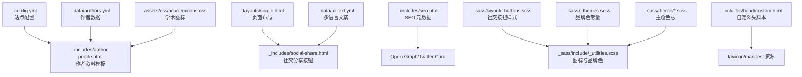
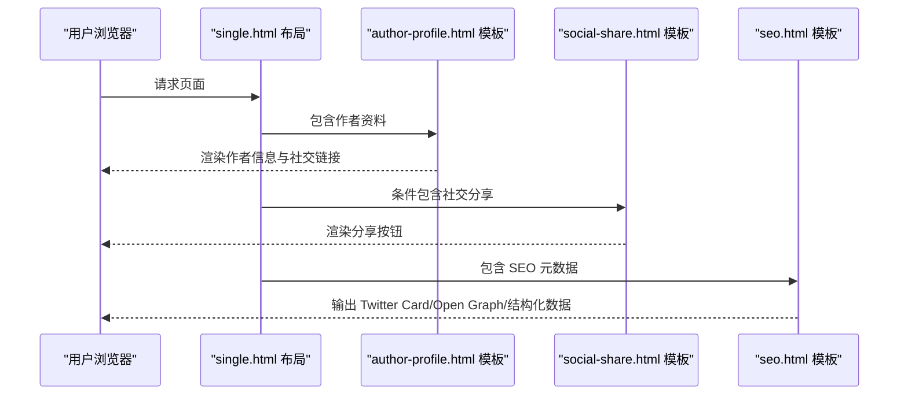
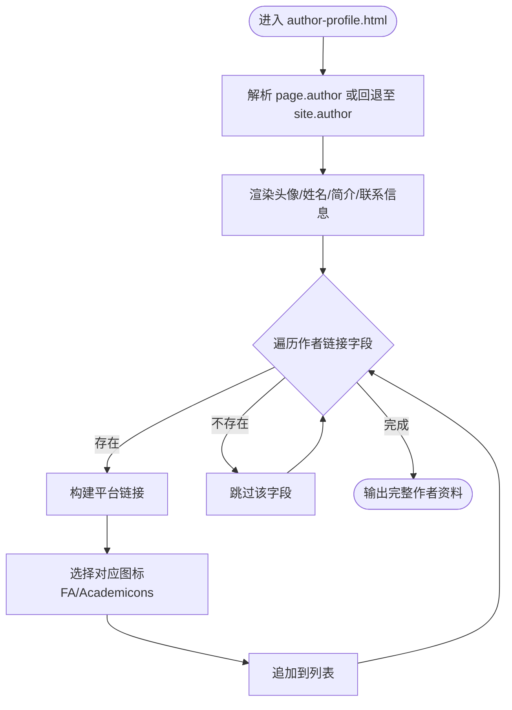
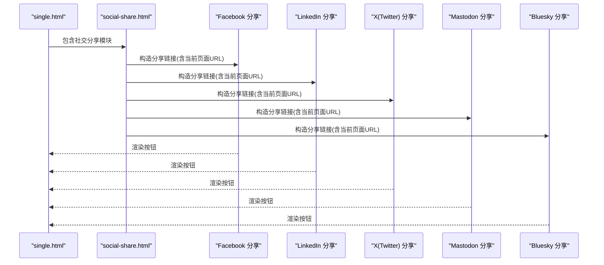
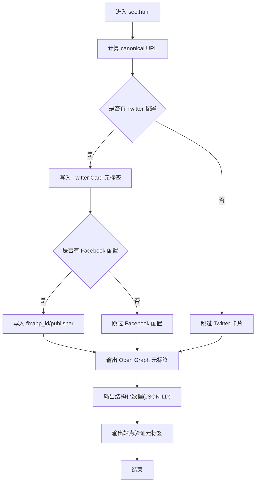
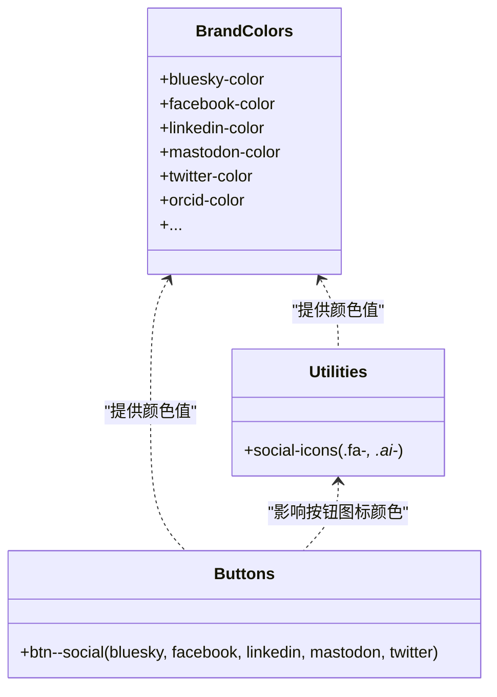
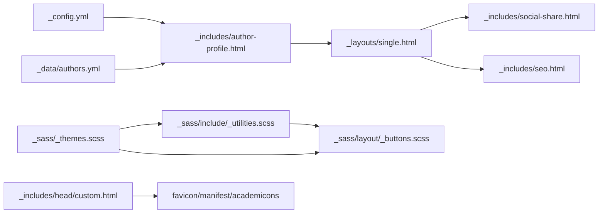

# 社交媒体链接管理

<cite>
**本文引用的文件**
- [_config.yml](file://_config.yml)
- [_data/authors.yml](file://_data/authors.yml)
- [_includes/author-profile.html](file://_includes/author-profile.html)
- [_includes/social-share.html](file://_includes/social-share.html)
- [_includes/seo.html](file://_includes/seo.html)
- [_layouts/single.html](file://_layouts/single.html)
- [_sass/layout/_buttons.scss](file://_sass/layout/_buttons.scss)
- [_sass/include/_utilities.scss](file://_sass/include/_utilities.scss)
- [_sass/_themes.scss](file://_sass/_themes.scss)
- [_sass/theme/_default_light.scss](file://_sass/theme/_default_light.scss)
- [_sass/theme/_air_light.scss](file://_sass/theme/_air_light.scss)
- [_sass/theme/_sunrise_light.scss](file://_sass/theme/_sunrise_light.scss)
- [_includes/head/custom.html](file://_includes/head/custom.html)
- [_data/ui-text.yml](file://_data/ui-text.yml)
- [assets/css/academicons.css](file://assets/css/academicons.css)
</cite>

## 目录
1. [引言](#引言)
2. [项目结构](#项目结构)
3. [核心组件](#核心组件)
4. [架构总览](#架构总览)
5. [详细组件分析](#详细组件分析)
6. [依赖关系分析](#依赖关系分析)
7. [性能考虑](#性能考虑)
8. [故障排查指南](#故障排查指南)
9. [结论](#结论)
10. [附录](#附录)

## 引言
本文件面向需要在 Jekyll 主题中管理与展示社交媒体链接的用户，系统化说明作者资料与个人简介中的社交链接配置、社交分享按钮集成、图标样式与品牌色统一管理、安全与隐私保护、SEO 最佳实践、测试与兼容性检查，以及实际配置示例与链接有效性验证流程。

## 项目结构
围绕社交媒体链接的关键文件分布如下：
- 配置层：站点配置与作者信息
  - 站点配置：[_config.yml](file://_config.yml)
  - 作者数据：[_data/authors.yml](file://_data/authors.yml)
- 视图层：作者资料展示与社交分享
  - 作者资料模板：[_includes/author-profile.html](file://_includes/author-profile.html)
  - 社交分享按钮：[_includes/social-share.html](file://_includes/social-share.html)
  - 页面布局集成：[_layouts/single.html](file://_layouts/single.html)
- SEO 元数据：[_includes/seo.html](file://_includes/seo.html)
- 样式与品牌色：SCSS 主题与工具类
  - 按钮样式：[_sass/layout/_buttons.scss](file://_sass/layout/_buttons.scss)
  - 图标样式与品牌色：[_sass/include/_utilities.scss](file://_sass/include/_utilities.scss)、[_sass/_themes.scss](file://_sass/_themes.scss)
  - 主题色板：[_sass/theme/_default_light.scss](file://_sass/theme/_default_light.scss)、[_sass/theme/_air_light.scss](file://_sass/theme/_air_light.scss)、[_sass/theme/_sunrise_light.scss](file://_sass/theme/_sunrise_light.scss)
  - 自定义头脚本与图标资源：[_includes/head/custom.html](file://_includes/head/custom.html)
- 多语言文案：[_data/ui-text.yml](file://_data/ui-text.yml)
- 学术图标支持：[assets/css/academicons.css](file://assets/css/academicons.css)

**图表来源**
- [_config.yml](file://_config.yml)
- [_data/authors.yml](file://_data/authors.yml)
- [_includes/author-profile.html](file://_includes/author-profile.html)
- [_layouts/single.html](file://_layouts/single.html)
- [_includes/social-share.html](file://_includes/social-share.html)
- [_includes/seo.html](file://_includes/seo.html)
- [_sass/layout/_buttons.scss](file://_sass/layout/_buttons.scss)
- [_sass/include/_utilities.scss](file://_sass/include/_utilities.scss)
- [_sass/_themes.scss](file://_sass/_themes.scss)
- [_sass/theme/_default_light.scss](file://_sass/theme/_default_light.scss)
- [_includes/head/custom.html](file://_includes/head/custom.html)
- [_data/ui-text.yml](file://_data/ui-text.yml)
- [assets/css/academicons.css](file://assets/css/academicons.css)

**章节来源**
- [_config.yml](file://_config.yml)
- [_data/authors.yml](file://_data/authors.yml)
- [_includes/author-profile.html](file://_includes/author-profile.html)
- [_layouts/single.html](file://_layouts/single.html)
- [_includes/social-share.html](file://_includes/social-share.html)
- [_includes/seo.html](file://_includes/seo.html)
- [_sass/layout/_buttons.scss](file://_sass/layout/_buttons.scss)
- [_sass/include/_utilities.scss](file://_sass/include/_utilities.scss)
- [_sass/_themes.scss](file://_sass/_themes.scss)
- [_sass/theme/_default_light.scss](file://_sass/theme/_default_light.scss)
- [_includes/head/custom.html](file://_includes/head/custom.html)
- [_data/ui-text.yml](file://_data/ui-text.yml)
- [assets/css/academicons.css](file://assets/css/academicons.css)

## 核心组件
- 作者资料与社交链接
  - 作者字段由站点配置与作者数据共同驱动，模板根据是否存在字段动态渲染链接。
  - 支持学术平台（Google Scholar、ORCID 等）、仓库与开发平台（GitHub、Stack Overflow 等）、社交平台（Twitter/X、LinkedIn、Facebook 等）等。
- 社交分享按钮
  - 在单页布局中按需包含，使用平台标准分享 URL 参数拼接当前页面链接。
- SEO 元数据
  - 生成 Twitter Card、Open Graph、结构化数据（JSON-LD）与站点验证元标签。
- 品牌色与图标样式
  - 通过 SCSS 变量集中管理各平台品牌色；按钮与图标颜色统一从品牌色表继承。

**章节来源**
- [_includes/author-profile.html](file://_includes/author-profile.html)
- [_includes/social-share.html](file://_includes/social-share.html)
- [_layouts/single.html](file://_layouts/single.html)
- [_includes/seo.html](file://_includes/seo.html)
- [_sass/layout/_buttons.scss](file://_sass/layout/_buttons.scss)
- [_sass/include/_utilities.scss](file://_sass/include/_utilities.scss)
- [_sass/_themes.scss](file://_sass/_themes.scss)

## 架构总览
以下序列图展示“页面访问 -> 渲染作者资料与社交分享 -> 输出 SEO 元数据”的端到端流程。

**图表来源**
- [_layouts/single.html](file://_layouts/single.html)
- [_includes/author-profile.html](file://_includes/author-profile.html)
- [_includes/social-share.html](file://_includes/social-share.html)
- [_includes/seo.html](file://_includes/seo.html)

## 详细组件分析

### 组件 A：作者资料与社交链接（author-profile）
- 配置入口
  - 站点配置中的 author 字段用于控制作者基本信息与各类链接开关。
  - 作者数据文件支持按页面作者覆盖，实现多作者场景。
- 动态渲染逻辑
  - 模板根据字段存在性决定是否渲染对应链接，避免空链接或冗余元素。
  - 支持多种平台前缀（如 GitHub 使用用户名拼接完整 URL）。
- 平台覆盖范围
  - 学术平台：Google Scholar、ORCID、ResearchGate、Scopus 等。
  - 开发平台：GitHub、Stack Overflow、Kaggle 等。
  - 社交平台：Twitter/X、LinkedIn、Facebook、Mastodon、Bluesky 等。
- 学术图标
  - 通过 Academicons 提供 ORCID 等学术平台专用图标。

**图表来源**
- [_includes/author-profile.html](file://_includes/author-profile.html)
- [assets/css/academicons.css](file://assets/css/academicons.css)

**章节来源**
- [_config.yml](file://_config.yml)
- [_data/authors.yml](file://_data/authors.yml)
- [_includes/author-profile.html](file://_includes/author-profile.html)
- [assets/css/academicons.css](file://assets/css/academicons.css)

### 组件 B：社交分享按钮（social-share）
- 集成位置
  - 在单页布局中通过条件判断包含，确保仅在需要时渲染。
- 分享目标
  - 支持 Facebook、LinkedIn、X（Twitter）、Mastodon、Bluesky 等平台。
- 参数拼接
  - 使用当前页面 URL 作为分享参数，保证分享内容指向正确页面。
- 文案本地化
  - 标题文案来自多语言数据文件，适配不同语言环境。

**图表来源**
- [_layouts/single.html](file://_layouts/single.html)
- [_includes/social-share.html](file://_includes/social-share.html)
- [_data/ui-text.yml](file://_data/ui-text.yml)

**章节来源**
- [_layouts/single.html](file://_layouts/single.html)
- [_includes/social-share.html](file://_includes/social-share.html)
- [_data/ui-text.yml](file://_data/ui-text.yml)

### 组件 C：SEO 元数据（seo）
- 结构化数据
  - 输出 JSON-LD，声明站点类型、名称与“sameAs”链接数组，便于搜索引擎识别社交档案。
- Open Graph
  - 设置站点名称、描述、图像与 URL，提升社交预览质量。
- Twitter Card
  - 设置站点账号、作者账号、卡片类型与图像，优化 Twitter/X 预览。
- 站点验证
  - 支持 Google、Bing、Alexa、Yandex 等平台的站点验证元标签。

**图表来源**
- [_includes/seo.html](file://_includes/seo.html)
- [_config.yml](file://_config.yml)

**章节来源**
- [_includes/seo.html](file://_includes/seo.html)
- [_config.yml](file://_config.yml)

### 组件 D：图标样式与品牌色（SCSS）
- 品牌色集中管理
  - 所有平台品牌色定义于主题色表与品牌色常量文件，便于统一调整。
- 图标颜色映射
  - 图标类名与品牌色变量一一对应，确保图标颜色一致。
- 按钮样式
  - 社交按钮通过品牌色变量生成 hover 效果，保持视觉一致性。

**图表来源**
- [_sass/_themes.scss](file://_sass/_themes.scss)
- [_sass/include/_utilities.scss](file://_sass/include/_utilities.scss)
- [_sass/layout/_buttons.scss](file://_sass/layout/_buttons.scss)

**章节来源**
- [_sass/_themes.scss](file://_sass/_themes.scss)
- [_sass/include/_utilities.scss](file://_sass/include/_utilities.scss)
- [_sass/layout/_buttons.scss](file://_sass/layout/_buttons.scss)

## 依赖关系分析
- 配置依赖
  - 站点配置决定作者资料与社交分享的可用性与默认行为。
  - 作者数据文件为作者资料模板提供运行时数据。
- 模板依赖
  - 单页布局依赖社交分享模板进行条件渲染。
  - SEO 模板依赖站点配置与页面上下文生成元数据。
- 样式依赖
  - 图标与按钮样式依赖品牌色常量与主题色板。
- 资源依赖
  - 自定义头脚本引入学术图标与站点图标资源。

**图表来源**
- [_config.yml](file://_config.yml)
- [_data/authors.yml](file://_data/authors.yml)
- [_includes/author-profile.html](file://_includes/author-profile.html)
- [_layouts/single.html](file://_layouts/single.html)
- [_includes/social-share.html](file://_includes/social-share.html)
- [_includes/seo.html](file://_includes/seo.html)
- [_sass/_themes.scss](file://_sass/_themes.scss)
- [_sass/include/_utilities.scss](file://_sass/include/_utilities.scss)
- [_sass/layout/_buttons.scss](file://_sass/layout/_buttons.scss)
- [_includes/head/custom.html](file://_includes/head/custom.html)

**章节来源**
- [_config.yml](file://_config.yml)
- [_data/authors.yml](file://_data/authors.yml)
- [_includes/author-profile.html](file://_includes/author-profile.html)
- [_layouts/single.html](file://_layouts/single.html)
- [_includes/social-share.html](file://_includes/social-share.html)
- [_includes/seo.html](file://_includes/seo.html)
- [_sass/_themes.scss](file://_sass/_themes.scss)
- [_sass/include/_utilities.scss](file://_sass/include/_utilities.scss)
- [_sass/layout/_buttons.scss](file://_sass/layout/_buttons.scss)
- [_includes/head/custom.html](file://_includes/head/custom.html)

## 性能考虑
- 按需渲染
  - 作者资料与社交分享均基于字段存在性进行条件渲染，减少不必要的 DOM 与请求。
- 资源加载
  - 学术图标与站点图标通过自定义头脚本引入，建议确保缓存策略与压缩启用以降低带宽。
- SEO 元数据
  - 合理设置 Open Graph 图像与 Twitter Card 类型，有助于减少重复请求与提升预览性能。

[本节为通用指导，不直接分析具体文件]

## 故障排查指南
- 作者链接未显示
  - 检查站点配置中 author 字段是否填写，或页面作者是否在作者数据中定义。
  - 确认模板中对应字段存在且非空。
- 分享按钮无效
  - 确认页面布局已包含社交分享模板。
  - 检查平台分享 URL 是否正确拼接当前页面 URL。
- 图标颜色异常
  - 检查品牌色常量与主题色板是否正确导入。
  - 确认按钮与图标类名与品牌色变量匹配。
- SEO 预览不正确
  - 检查站点配置中的 Twitter/OG 图像与描述设置。
  - 使用平台调试工具（如 Twitter Card 验证器、Facebook Sharing Debugger）进行验证。

**章节来源**
- [_includes/author-profile.html](file://_includes/author-profile.html)
- [_layouts/single.html](file://_layouts/single.html)
- [_includes/social-share.html](file://_includes/social-share.html)
- [_includes/seo.html](file://_includes/seo.html)
- [_sass/_themes.scss](file://_sass/_themes.scss)
- [_sass/include/_utilities.scss](file://_sass/include/_utilities.scss)

## 结论
通过配置层（站点配置与作者数据）、视图层（作者资料与社交分享模板）、SEO 层（结构化数据与元标签）与样式层（品牌色与图标）的协同，本项目实现了对 GitHub、Twitter/X、LinkedIn、Google Scholar、ORCID 等平台链接的灵活管理与统一展示。配合 SEO 与图标资源的合理配置，可在多平台上获得一致的品牌呈现与良好的社交预览体验。

[本节为总结性内容，不直接分析具体文件]

## 附录

### 实际配置示例与步骤
- 添加作者资料与链接
  - 在站点配置中设置 author 字段（如 GitHub、Twitter、LinkedIn、Google Scholar、ORCID 等）。
  - 如需多作者，可在作者数据文件中新增条目并按页面引用。
- 集成社交分享按钮
  - 在页面布局中保留社交分享模板包含逻辑，确保分享按钮按需显示。
- 自定义图标样式与品牌色
  - 在品牌色常量文件中调整各平台颜色值，确保与品牌一致。
  - 在主题色板中统一全局颜色变量，避免视觉割裂。
- 安全与隐私
  - 不在公开配置中暴露敏感信息；对外链接使用 HTTPS。
  - 对第三方平台分享链接采用 URL 编码，避免参数注入风险。
- SEO 优化
  - 设置站点验证元标签，完善 Open Graph 与 Twitter Card。
  - 为文章与页面设置合适的描述与图像，提升社交预览质量。
- 测试与兼容性
  - 使用平台自带的调试工具（Twitter Card、Facebook Sharing Debugger、LinkedIn Post Inspector）验证预览效果。
  - 在不同设备与浏览器中检查按钮与图标的显示一致性。
- 链接有效性验证
  - 对每个外部链接进行手动点击验证，确保可访问。
  - 对分享链接进行参数校验，确认 URL 拼接正确。

**章节来源**
- [_config.yml](file://_config.yml)
- [_data/authors.yml](file://_data/authors.yml)
- [_includes/author-profile.html](file://_includes/author-profile.html)
- [_layouts/single.html](file://_layouts/single.html)
- [_includes/social-share.html](file://_includes/social-share.html)
- [_includes/seo.html](file://_includes/seo.html)
- [_sass/_themes.scss](file://_sass/_themes.scss)
- [_sass/include/_utilities.scss](file://_sass/include/_utilities.scss)
- [_includes/head/custom.html](file://_includes/head/custom.html)
- [_data/ui-text.yml](file://_data/ui-text.yml)
- [assets/css/academicons.css](file://assets/css/academicons.css)