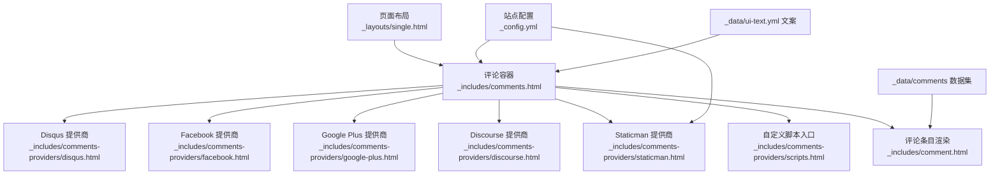
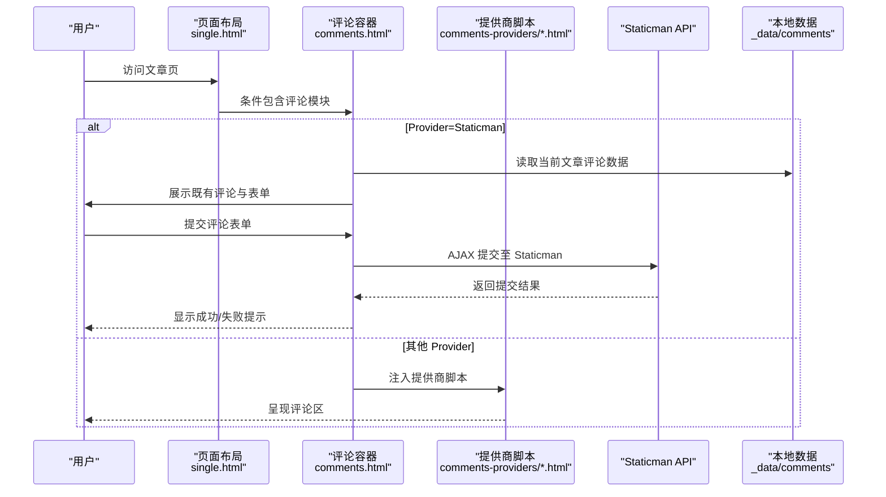
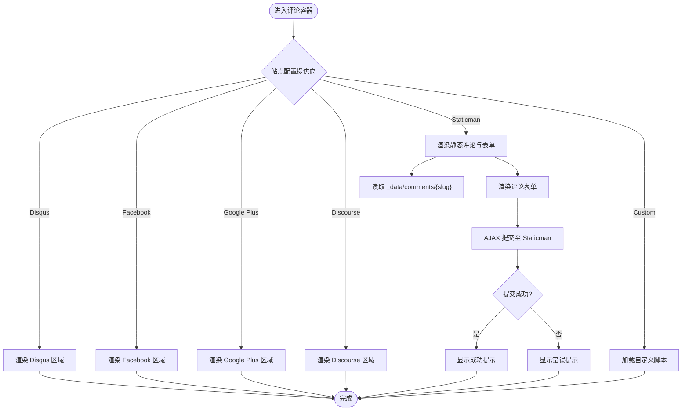
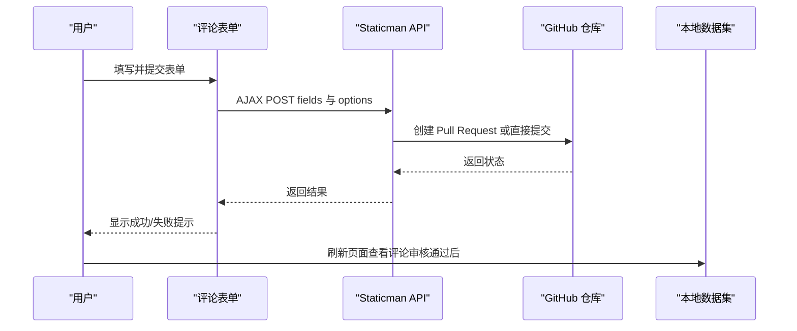
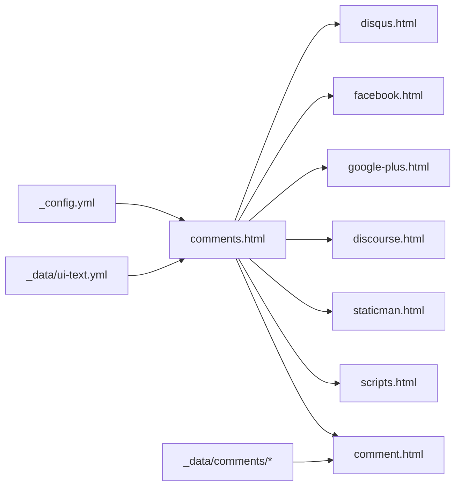

# 评论系统集成

<cite>
**本文引用的文件**
- [_config.yml](file://_config.yml)
- [_includes/comments.html](file://_includes/comments.html)
- [_includes/comment.html](file://_includes/comment.html)
- [_includes/comments-providers/disqus.html](file://_includes/comments-providers/disqus.html)
- [_includes/comments-providers/facebook.html](file://_includes/comments-providers/facebook.html)
- [_includes/comments-providers/google-plus.html](file://_includes/comments-providers/google-plus.html)
- [_includes/comments-providers/staticman.html](file://_includes/comments-providers/staticman.html)
- [_includes/comments-providers/scripts.html](file://_includes/comments-providers/scripts.html)
- [_includes/comments-providers/discourse.html](file://_includes/comments-providers/discourse.html)
- [_layouts/single.html](file://_layouts/single.html)
- [_data/ui-text.yml](file://_data/ui-text.yml)
- [_data/comments/layout-comments/comment-1470944006665.yml](file://_data/comments/layout-comments/comment-1470944006665.yml)
</cite>

## 目录
1. [简介](#简介)
2. [项目结构](#项目结构)
3. [核心组件](#核心组件)
4. [架构总览](#架构总览)
5. [详细组件分析](#详细组件分析)
6. [依赖关系分析](#依赖关系分析)
7. [性能考虑](#性能考虑)
8. [故障排除指南](#故障排除指南)
9. [结论](#结论)
10. [附录](#附录)

## 简介
本文件面向希望在静态站点（基于 Jekyll）中集成评论系统的读者，系统性梳理了多种评论提供商的配置与使用方式，重点覆盖以下能力：
- 多评论提供商选择与集成：Disqus、Facebook、Google Plus、Discourse、Staticman、自定义。
- Staticman 静态评论系统的完整配置指南：GitHub API 集成、数据存储机制、字段校验、Markdown 渲染与安全处理。
- 评论表单验证规则、Markdown 支持与安全防护措施。
- 评论数据管理与显示逻辑、性能优化建议、实际配置示例与故障排除。

## 项目结构
评论系统由“页面布局调用 → 评论容器模板 → 评论提供商片段”三层组成，结合站点配置与本地数据实现动态展示与提交。

图表来源
- [_layouts/single.html:91-93](file://_layouts/single.html#L91-L93)
- [_includes/comments.html:5-83](file://_includes/comments.html#L5-L83)
- [_includes/comments-providers/disqus.html:1-22](file://_includes/comments-providers/disqus.html#L1-L22)
- [_includes/comments-providers/facebook.html:1-8](file://_includes/comments-providers/facebook.html#L1-L8)
- [_includes/comments-providers/google-plus.html:1-2](file://_includes/comments-providers/google-plus.html#L1-L2)
- [_includes/comments-providers/discourse.html:1-14](file://_includes/comments-providers/discourse.html#L1-L14)
- [_includes/comments-providers/staticman.html:1-42](file://_includes/comments-providers/staticman.html#L1-L42)
- [_includes/comments-providers/scripts.html:1-18](file://_includes/comments-providers/scripts.html#L1-L18)
- [_includes/comment.html:1-22](file://_includes/comment.html#L1-L22)
- [_config.yml:101-126](file://_config.yml#L101-L126)
- [_data/ui-text.yml:270-307](file://_data/ui-text.yml#L270-L307)

章节来源
- [_layouts/single.html:91-93](file://_layouts/single.html#L91-L93)
- [_includes/comments.html:5-83](file://_includes/comments.html#L5-L83)
- [_config.yml:101-126](file://_config.yml#L101-L126)

## 核心组件
- 页面布局集成点：在单篇文章布局中按条件包含评论模块，确保仅当站点启用评论且页面允许时才渲染。
- 评论容器模板：根据站点配置选择具体提供商，渲染评论标题、既有评论列表与新评论表单。
- 评论条目模板：统一渲染作者头像、时间、链接与 Markdown 内容。
- 提供商脚本：按提供商注入对应 SDK 或嵌入脚本，或为静态评论提供前端交互逻辑。
- 静态评论数据：使用 YAML 文件存放评论，路径与分支由站点配置控制，支持审核与排序。

章节来源
- [_layouts/single.html:91-93](file://_layouts/single.html#L91-L93)
- [_includes/comments.html:5-83](file://_includes/comments.html#L5-L83)
- [_includes/comment.html:1-22](file://_includes/comment.html#L1-L22)
- [_includes/comments-providers/staticman.html:1-42](file://_includes/comments-providers/staticman.html#L1-L42)
- [_config.yml:111-126](file://_config.yml#L111-L126)

## 架构总览
评论系统采用“配置驱动 + 模板分发”的架构，通过站点配置决定渲染哪个提供商，再由提供商模板负责最终的前端行为。

图表来源
- [_layouts/single.html:91-93](file://_layouts/single.html#L91-L93)
- [_includes/comments.html:5-83](file://_includes/comments.html#L5-L83)
- [_includes/comments-providers/staticman.html:6-34](file://_includes/comments-providers/staticman.html#L6-L34)
- [_config.yml:111-126](file://_config.yml#L111-L126)

## 详细组件分析

### 组件：评论容器与提供商选择
- 功能要点
  - 根据站点配置选择提供商，渲染对应评论区与脚本。
  - 对 Staticman：展示既有评论列表（按时间排序），并提供新评论表单。
  - 表单字段与文案来自 UI 文本配置，支持多语言。
- 关键行为
  - 条件渲染：仅当站点配置了仓库与分支时，Staticman 表单才会出现。
  - 表单提交：通过 AJAX 调用 Staticman API，提交后显示成功/失败提示。
  - 既有评论：从本地数据集中按文章 slug 读取并排序展示。

图表来源
- [_includes/comments.html:5-83](file://_includes/comments.html#L5-L83)
- [_includes/comments-providers/staticman.html:6-34](file://_includes/comments-providers/staticman.html#L6-L34)
- [_config.yml:111-126](file://_config.yml#L111-L126)

章节来源
- [_includes/comments.html:5-83](file://_includes/comments.html#L5-L83)
- [_data/ui-text.yml:270-307](file://_data/ui-text.yml#L270-L307)

### 组件：评论条目渲染
- 功能要点
  - 使用 Gravatar 头像（邮箱经 md5 处理后生成头像 URL）。
  - 时间以 ISO8601 形式渲染，支持跳转锚点定位。
  - 内容通过 Markdown 渲染输出。
- 安全与可用性
  - 外链自动添加 nofollow。
  - URL 可选，无 URL 时不渲染链接。

章节来源
- [_includes/comment.html:1-22](file://_includes/comment.html#L1-L22)
- [_config.yml:120-126](file://_config.yml#L120-L126)

### 组件：Disqus 集成
- 配置参数
  - shortname：站点短名称，用于嵌入评论与计数脚本。
- 行为特征
  - 自动加载嵌入脚本与计数脚本。
  - 无 JS 时显示提示链接。

章节来源
- [_includes/comments-providers/disqus.html:1-22](file://_includes/comments-providers/disqus.html#L1-L22)
- [_config.yml:103-104](file://_config.yml#L103-L104)

### 组件：Facebook 集成
- 配置参数
  - appid：可选应用 ID；若未配置则使用默认 SDK。
- 行为特征
  - 加载 Facebook SDK 并渲染评论区。

章节来源
- [_includes/comments-providers/facebook.html:1-8](file://_includes/comments-providers/facebook.html#L1-L8)
- [_config.yml:107-110](file://_config.yml#L107-L110)

### 组件：Google Plus 集成
- 行为特征
  - 加载 Google Plus SDK 并提供评论区占位。

章节来源
- [_includes/comments-providers/google-plus.html:1-2](file://_includes/comments-providers/google-plus.html#L1-L2)

### 组件：Discourse 集成
- 配置参数
  - server：Discourse 论坛域名。
- 行为特征
  - 通过嵌入脚本加载评论区，并设置 canonical 地址。

章节来源
- [_includes/comments-providers/discourse.html:1-14](file://_includes/comments-providers/discourse.html#L1-L14)
- [_config.yml:105-106](file://_config.yml#L105-L106)

### 组件：Staticman 静态评论系统
- 配置参数（节选）
  - allowedFields：允许提交的字段集合。
  - branch：提交目标分支（如 gh-pages）。
  - commitMessage：提交信息。
  - filename：文件命名模板（含时间戳）。
  - format：输出格式（YAML）。
  - moderation：是否开启审核。
  - path：数据存储路径模板（含 slug 占位符）。
  - requiredFields：必填字段集合。
  - transforms：字段转换（如 email 的 md5）。
  - generatedFields：自动生成字段（如 date）。
- 表单字段
  - message（必填）、name（必填）、email（必填）、url（可选）。
  - 隐藏字段：options.slug、fields.hidden。
- 提交流程
  - 通过 AJAX 提交至 Staticman API，提交后显示成功/失败提示。
  - 成功后提示需审核通过后才显示。
- 数据存储
  - 评论以 YAML 文件形式存放在 _data/comments/{slug}/ 下，按时间排序。
  - 示例文件展示了 message、name、email（md5）、url、hidden、date 字段。

图表来源
- [_includes/comments.html:40-77](file://_includes/comments.html#L40-L77)
- [_includes/comments-providers/staticman.html:6-34](file://_includes/comments-providers/staticman.html#L6-L34)
- [_config.yml:111-126](file://_config.yml#L111-L126)
- [_data/comments/layout-comments/comment-1470944006665.yml:1-7](file://_data/comments/layout-comments/comment-1470944006665.yml#L1-L7)

章节来源
- [_includes/comments.html:40-77](file://_includes/comments.html#L40-L77)
- [_includes/comments-providers/staticman.html:1-42](file://_includes/comments-providers/staticman.html#L1-L42)
- [_config.yml:111-126](file://_config.yml#L111-L126)
- [_data/comments/layout-comments/comment-1470944006665.yml:1-7](file://_data/comments/layout-comments/comment-1470944006665.yml#L1-L7)

### 组件：自定义评论系统
- 功能要点
  - 通过 comments-providers/scripts.html 在不同提供商间切换。
  - 适用于接入第三方评论服务或自建后端。

章节来源
- [_includes/comments-providers/scripts.html:1-18](file://_includes/comments-providers/scripts.html#L1-L18)
- [_includes/comments.html:79-83](file://_includes/comments.html#L79-L83)

## 依赖关系分析
- 布局层依赖
  - single.html 仅在满足条件时包含评论模块，避免对不启用评论的页面产生额外开销。
- 模板层依赖
  - comments.html 依赖站点配置与 UI 文本，按提供商分支渲染。
  - comment.html 依赖本地数据中的评论记录与 Gravatar。
- 提供商脚本依赖
  - 各提供商脚本独立加载，互不影响。
- Staticman 依赖
  - 依赖站点配置中的 repository 与 branch，以及本地数据目录结构。

图表来源
- [_config.yml:101-126](file://_config.yml#L101-L126)
- [_includes/comments.html:5-83](file://_includes/comments.html#L5-L83)
- [_includes/comments-providers/staticman.html:1-42](file://_includes/comments-providers/staticman.html#L1-L42)
- [_includes/comment.html:1-22](file://_includes/comment.html#L1-L22)
- [_data/ui-text.yml:270-307](file://_data/ui-text.yml#L270-L307)

章节来源
- [_layouts/single.html:91-93](file://_layouts/single.html#L91-L93)
- [_includes/comments.html:5-83](file://_includes/comments.html#L5-L83)
- [_config.yml:101-126](file://_config.yml#L101-L126)

## 性能考虑
- 减少外部脚本阻塞
  - 将提供商脚本异步加载，避免阻塞页面渲染。
- 本地评论优先
  - Staticman 使用本地数据渲染既有评论，减少网络请求。
- 缓存策略
  - 对评论区内容进行浏览器缓存，降低重复访问成本。
- 字段最小化
  - 仅提交必要字段，缩短请求体大小。
- 分支与路径优化
  - 将评论数据存储在轻量目录结构中，便于排序与检索。

## 故障排除指南
- 提交表单无响应
  - 检查站点配置是否正确设置 repository 与 branch。
  - 确认表单隐藏字段 options.slug 与 fields.hidden 是否存在。
- 提交成功但评论未显示
  - 检查 moderation 是否开启，审核通过后才会生成 PR/合并。
  - 确认 path 与 filename 模板是否匹配本地数据目录结构。
- 头像不显示
  - 确认 email 字段是否参与 md5 转换，URL 是否正确。
- 多语言文案不生效
  - 检查 _data/ui-text.yml 中对应语言键值是否存在。
- Provider 未加载
  - 确认 comments.provider 配置与提供商脚本一致，且页面允许评论。

章节来源
- [_includes/comments.html:40-77](file://_includes/comments.html#L40-L77)
- [_includes/comments-providers/staticman.html:17-30](file://_includes/comments-providers/staticman.html#L17-L30)
- [_config.yml:111-126](file://_config.yml#L111-L126)
- [_data/ui-text.yml:270-307](file://_data/ui-text.yml#L270-L307)

## 结论
本评论系统通过配置驱动与模板分发实现了对多种提供商的统一接入，其中 Staticman 以静态数据与审核流程兼顾了隐私与可控性。建议在生产环境优先评估 Staticman 的审核与数据治理能力，同时结合各提供商的生态与性能表现选择合适的方案。

## 附录

### 配置参数速查（节选）
- 站点级
  - comments.provider：选择评论提供商（disqus、facebook、google-plus、discourse、staticman、custom）
  - repository：GitHub 仓库名（owner/repo）
- Staticman
  - branch：提交分支
  - allowedFields：允许字段
  - requiredFields：必填字段
  - format：输出格式
  - moderation：是否审核
  - path：数据路径模板
  - filename：文件名模板
  - transforms：字段转换（如 email 的 md5）
  - generatedFields：自动生成字段（如 date）

章节来源
- [_config.yml:101-126](file://_config.yml#L101-L126)