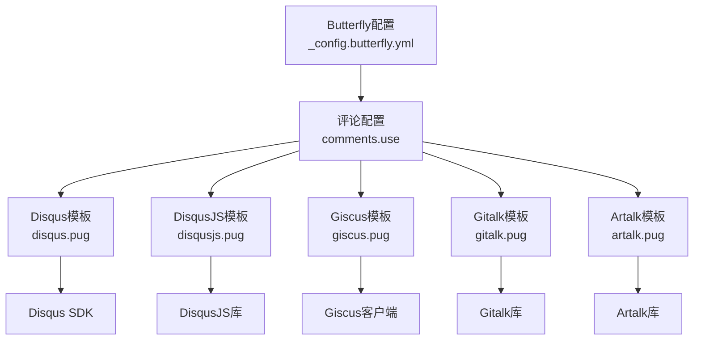
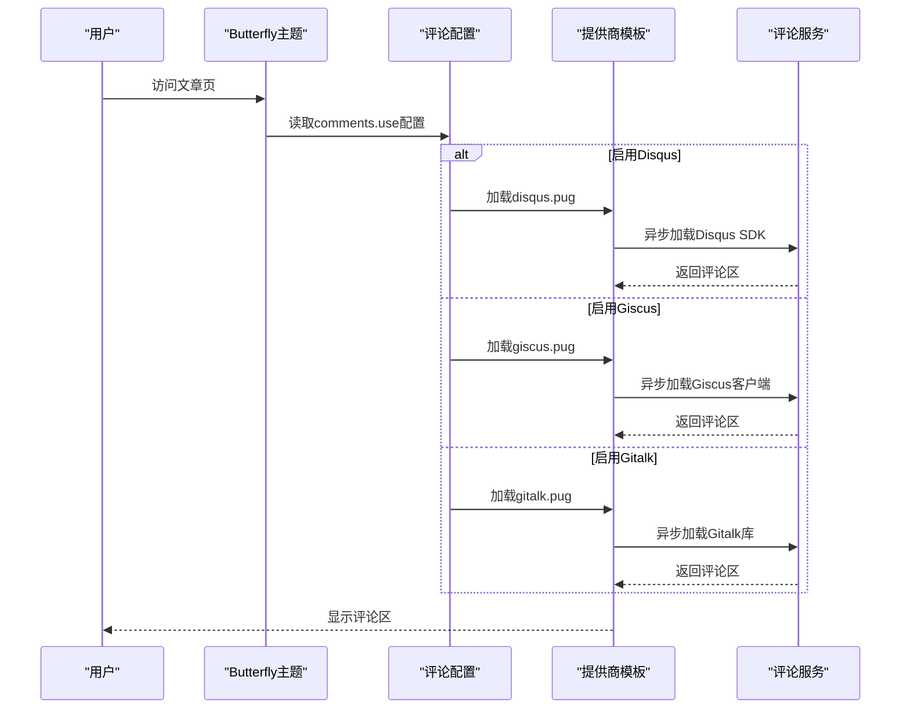
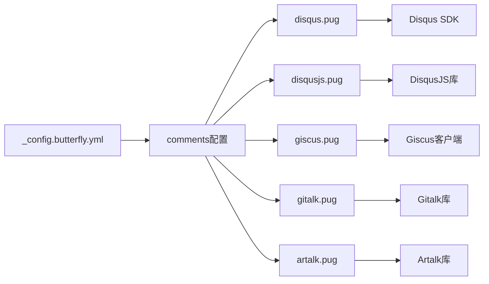

# 评论系统集成

<cite>
**本文引用的文件**
- [_config.yml](file://hexo-site/_config.yml)
- [_config.butterfly.yml](file://hexo-site/_config.butterfly.yml)
- [disqus.pug](file://hexo-site/node_modules/hexo-theme-butterfly/layout/includes/third-party/comments/disqus.pug)
- [disqusjs.pug](file://hexo-site/node_modules/hexo-theme-butterfly/layout/includes/third-party/comments/disqusjs.pug)
- [giscus.pug](file://hexo-site/node_modules/hexo-theme-butterfly/layout/includes/third-party/comments/giscus.pug)
- [gitalk.pug](file://hexo-site/node_modules/hexo-theme-butterfly/layout/includes/third-party/comments/gitalk.pug)
- [artalk.pug](file://hexo-site/node_modules/hexo-theme-butterfly/layout/includes/third-party/comments/artalk.pug)
</cite>

## 目录
1. [简介](#简介)
2. [项目结构](#项目结构)
3. [核心组件](#核心组件)
4. [架构总览](#架构总览)
5. [详细组件分析](#详细组件分析)
6. [依赖关系分析](#依赖关系分析)
7. [性能考虑](#性能考虑)
8. [故障排除指南](#故障排除指南)
9. [结论](#结论)
10. [附录](#附录)

## 简介
本文件面向希望在基于Hexo的Butterfly主题中集成评论系统的读者，系统性梳理了多种评论提供商的配置与使用方式，重点覆盖以下能力：
- 多评论提供商选择与集成：Disqus、DisqusJS、Giscus、Gitalk、Artalk等主流方案
- 各提供商的配置参数、适用场景与优缺点分析
- 评论系统的懒加载机制与性能优化策略
- 实际配置示例与故障排除指南

**更新** 评论系统已简化为Butterfly主题的基础功能集成，移除了原有的复杂静态评论系统配置，采用主题内置的多种评论提供商支持。

## 项目结构
评论系统由"主题配置 → 评论提供商模板 → 前端脚本加载"三层组成，通过Butterfly主题的comments配置驱动不同提供商的加载与初始化。

**图表来源**
- [_config.butterfly.yml:183-188](file://hexo-site/_config.butterfly.yml#L183-L188)
- [disqus.pug:1-81](file://hexo-site/node_modules/hexo-theme-butterfly/layout/includes/third-party/comments/disqus.pug#L1-L81)
- [disqusjs.pug:1-87](file://hexo-site/node_modules/hexo-theme-butterfly/layout/includes/third-party/comments/disqusjs.pug#L1-L87)
- [giscus.pug:1-83](file://hexo-site/node_modules/hexo-theme-butterfly/layout/includes/third-party/comments/giscus.pug#L1-L83)
- [gitalk.pug:1-65](file://hexo-site/node_modules/hexo-theme-butterfly/layout/includes/third-party/comments/gitalk.pug#L1-L65)
- [artalk.pug:1-73](file://hexo-site/node_modules/hexo-theme-butterfly/layout/includes/third-party/comments/artalk.pug#L1-L73)

**章节来源**
- [_config.butterfly.yml:183-188](file://hexo-site/_config.butterfly.yml#L183-L188)
- [disqus.pug:1-81](file://hexo-site/node_modules/hexo-theme-butterfly/layout/includes/third-party/comments/disqus.pug#L1-L81)
- [giscus.pug:1-83](file://hexo-site/node_modules/hexo-theme-butterfly/layout/includes/third-party/comments/giscus.pug#L1-L83)

## 核心组件
- **主题配置层**：通过comments.use数组指定启用的评论提供商，支持懒加载和计数功能
- **提供商模板层**：每个评论系统都有独立的Pug模板，负责脚本加载、初始化和主题适配
- **前端脚本层**：按需异步加载各提供商的JavaScript库，支持暗黑模式切换
- **配置参数层**：各提供商都有对应的配置项，如API密钥、仓库信息、主题设置等

**章节来源**
- [_config.butterfly.yml:183-188](file://hexo-site/_config.butterfly.yml#L183-L188)
- [disqus.pug:1-81](file://hexo-site/node_modules/hexo-theme-butterfly/layout/includes/third-party/comments/disqus.pug#L1-L81)
- [giscus.pug:1-83](file://hexo-site/node_modules/hexo-theme-butterfly/layout/includes/third-party/comments/giscus.pug#L1-L83)

## 架构总览
评论系统采用"配置驱动 + 模板分发 + 懒加载"的架构，通过主题配置决定加载哪个提供商，再由对应模板负责脚本加载和初始化。

**图表来源**
- [_config.butterfly.yml:183-188](file://hexo-site/_config.butterfly.yml#L183-L188)
- [disqus.pug:16-44](file://hexo-site/node_modules/hexo-theme-butterfly/layout/includes/third-party/comments/disqus.pug#L16-L44)
- [giscus.pug:21-51](file://hexo-site/node_modules/hexo-theme-butterfly/layout/includes/third-party/comments/giscus.pug#L21-L51)
- [gitalk.pug:15-37](file://hexo-site/node_modules/hexo-theme-butterfly/layout/includes/third-party/comments/gitalk.pug#L15-L37)

## 详细组件分析

### 组件：Butterfly评论配置
- **配置结构**：comments.use数组指定启用的评论提供商，支持多个提供商并存
- **功能选项**：text启用文本评论，lazyload启用懒加载，count启用评论计数
- **主题集成**：与Butterfly主题的暗黑模式、PJAX等特性深度集成

**章节来源**
- [_config.butterfly.yml:183-188](file://hexo-site/_config.butterfly.yml#L183-L188)

### 组件：Disqus集成
- **配置参数**：shortname（站点短名称）、apikey（API密钥）
- **功能特性**：
  - 支持评论计数API调用
  - 自动重置和重新加载机制
  - 暗黑模式主题适配
- **加载机制**：异步加载embed.js脚本，支持懒加载模式

**章节来源**
- [disqus.pug:1-81](file://hexo-site/node_modules/hexo-theme-butterfly/layout/includes/third-party/comments/disqus.pug#L1-L81)

### 组件：DisqusJS集成
- **配置参数**：shortname、apikey、自定义option配置
- **功能特性**：
  - 完全客户端实现，无需服务器端处理
  - 支持自定义样式和主题
  - 提供评论计数功能
- **加载机制**：异步加载DisqusJS库，支持懒加载和主题切换

**章节来源**
- [disqusjs.pug:1-87](file://hexo-site/node_modules/hexo-theme-butterfly/layout/includes/third-party/comments/disqusjs.pug#L1-L87)

### 组件：Giscus集成
- **配置参数**：repo（仓库名）、repo_id（仓库ID）、category_id（讨论分类ID）、主题配置
- **功能特性**：
  - 基于GitHub Discussions的现代评论系统
  - 支持暗黑/明亮主题切换
  - 支持自定义客户端脚本URL
- **加载机制**：动态创建script元素，支持主题变化时的消息传递

**章节来源**
- [giscus.pug:1-83](file://hexo-site/node_modules/hexo-theme-butterfly/layout/includes/third-party/comments/giscus.pug#L1-L83)

### 组件：Gitalk集成
- **配置参数**：client_id、client_secret、repo、owner、admin等GitHub OAuth配置
- **功能特性**：
  - 基于GitHub Issues的评论系统
  - 支持评论计数回调
  - MD5标识符生成机制
- **加载机制**：异步加载Gitalk库，支持懒加载和主题切换

**章节来源**
- [gitalk.pug:1-65](file://hexo-site/node_modules/hexo-theme-butterfly/layout/includes/third-party/comments/gitalk.pug#L1-L65)

### 组件：Artalk集成
- **配置参数**：server（服务端地址）、site（站点标识）、自定义option配置
- **功能特性**：
  - 支持暗黑模式主题切换
  - 图片灯箱支持
  - 动态销毁和重建机制
- **加载机制**：异步加载Artalk库，支持懒加载和主题变化监听

**章节来源**
- [artalk.pug:1-73](file://hexo-site/node_modules/hexo-theme-butterfly/layout/includes/third-party/comments/artalk.pug#L1-L73)

## 依赖关系分析
- **配置依赖**：所有提供商都依赖Butterfly主题的comments配置
- **主题集成**：各提供商模板都集成了Butterfly的主题切换和PJAX支持
- **懒加载机制**：统一的btf.loadComment函数负责按需加载评论脚本
- **暗黑模式支持**：各提供商都支持主题变化时的重新初始化

**图表来源**
- [_config.butterfly.yml:183-188](file://hexo-site/_config.butterfly.yml#L183-L188)
- [disqus.pug:36-41](file://hexo-site/node_modules/hexo-theme-butterfly/layout/includes/third-party/comments/disqus.pug#L36-L41)
- [giscus.pug:26-37](file://hexo-site/node_modules/hexo-theme-butterfly/layout/includes/third-party/comments/giscus.pug#L26-L37)
- [gitalk.pug:25-34](file://hexo-site/node_modules/hexo-theme-butterfly/layout/includes/third-party/comments/gitalk.pug#L25-L34)
- [artalk.pug:19-27](file://hexo-site/node_modules/hexo-theme-butterfly/layout/includes/third-party/comments/artalk.pug#L19-L27)

## 性能考虑
- **懒加载优化**：通过lazyload选项延迟加载评论脚本，提升首屏加载速度
- **按需加载**：只加载当前启用的评论提供商脚本，避免不必要的资源消耗
- **异步加载**：使用async/await模式异步加载第三方库，不阻塞页面渲染
- **主题切换**：支持暗黑模式切换时的评论区重新初始化
- **PJAX兼容**：与Butterfly主题的PJAX功能兼容，支持页面无刷新切换

## 故障排除指南
- **评论不显示**
  - 检查comments.use配置是否正确设置
  - 确认对应提供商的配置参数是否完整
  - 验证网络连接和CDN访问权限
- **懒加载问题**
  - 检查lazyload配置是否正确
  - 确认btf.loadComment函数是否正常工作
  - 验证页面滚动触发机制
- **主题切换异常**
  - 检查themeChange事件绑定
  - 确认暗黑模式CSS类名
  - 验证主题切换回调函数
- **GitHub相关提供商问题**
  - 验证OAuth配置的client_id和client_secret
  - 检查仓库权限和访问令牌
  - 确认GitHub API访问状态

**章节来源**
- [disqus.pug:9-14](file://hexo-site/node_modules/hexo-theme-butterfly/layout/includes/third-party/comments/disqus.pug#L9-L14)
- [giscus.pug:53-65](file://hexo-site/node_modules/hexo-theme-butterfly/layout/includes/third-party/comments/giscus.pug#L53-L65)
- [gitalk.pug:8-13](file://hexo-site/node_modules/hexo-theme-butterfly/layout/includes/third-party/comments/gitalk.pug#L8-L13)
- [artalk.pug:10-15](file://hexo-site/node_modules/hexo-theme-butterfly/layout/includes/third-party/comments/artalk.pug#L10-L15)

## 结论
Butterfly主题的评论系统通过简洁的配置接口和丰富的提供商支持，为用户提供了灵活的评论解决方案。相比之前的复杂静态评论系统，新的架构更加轻量化和现代化，支持主流的云端评论服务，同时保持了良好的性能和用户体验。

## 附录

### 配置参数速查
- **通用配置**
  - comments.use：启用的评论提供商数组
  - comments.text：启用文本评论功能
  - comments.lazyload：启用懒加载
  - comments.count：启用评论计数

- **Disqus配置**
  - disqus.shortname：站点短名称
  - disqus.apikey：API密钥

- **DisqusJS配置**
  - disqusjs.shortname：站点短名称
  - disqusjs.apikey：API密钥
  - disqusjs.option：自定义选项配置

- **Giscus配置**
  - giscus.repo：GitHub仓库名
  - giscus.repo_id：仓库ID
  - giscus.category_id：讨论分类ID
  - giscus.light_theme：明亮主题配置
  - giscus.dark_theme：暗黑主题配置
  - giscus.js：自定义客户端脚本URL

- **Gitalk配置**
  - gitalk.client_id：OAuth客户端ID
  - gitalk.client_secret：OAuth客户端密钥
  - gitalk.repo：GitHub仓库名
  - gitalk.owner：仓库所有者
  - gitalk.admin：管理员用户名数组

- **Artalk配置**
  - artalk.server：Artalk服务端地址
  - artalk.site：站点标识
  - artalk.option：自定义选项配置

**章节来源**
- [_config.butterfly.yml:183-188](file://hexo-site/_config.butterfly.yml#L183-L188)
- [disqus.pug:1-3](file://hexo-site/node_modules/hexo-theme-butterfly/layout/includes/third-party/comments/disqus.pug#L1-L3)
- [disqusjs.pug:1-3](file://hexo-site/node_modules/hexo-theme-butterfly/layout/includes/third-party/comments/disqusjs.pug#L1-L3)
- [giscus.pug:1-3](file://hexo-site/node_modules/hexo-theme-butterfly/layout/includes/third-party/comments/giscus.pug#L1-L3)
- [gitalk.pug:1](file://hexo-site/node_modules/hexo-theme-butterfly/layout/includes/third-party/comments/gitalk.pug#L1)
- [artalk.pug:1](file://hexo-site/node_modules/hexo-theme-butterfly/layout/includes/third-party/comments/artalk.pug#L1)