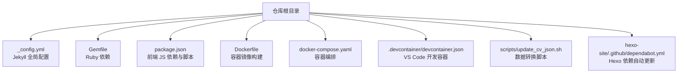
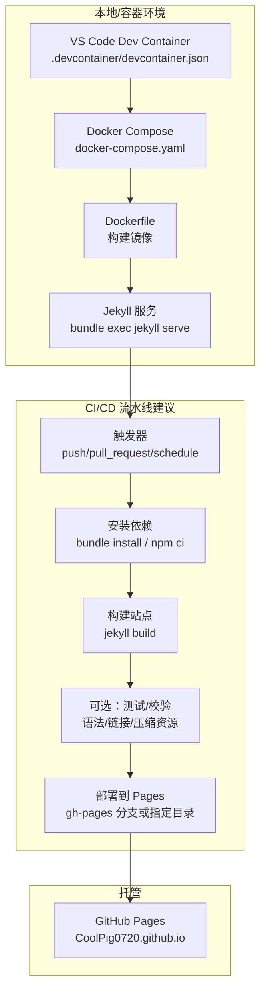
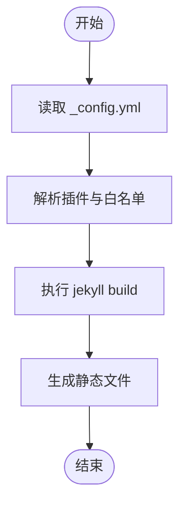
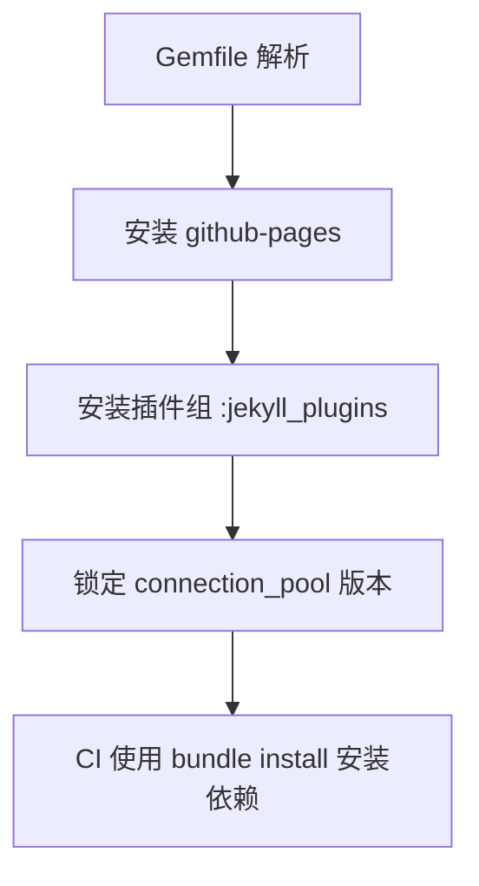
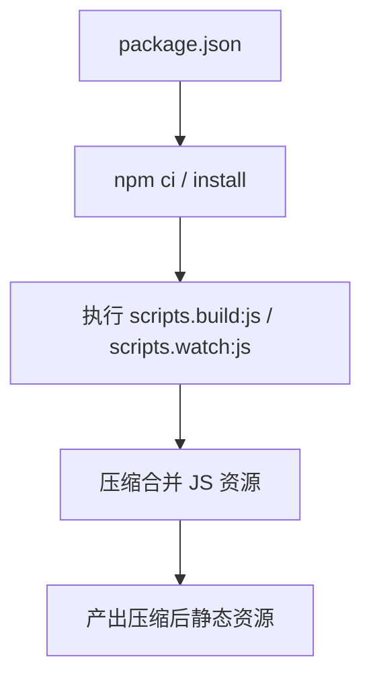
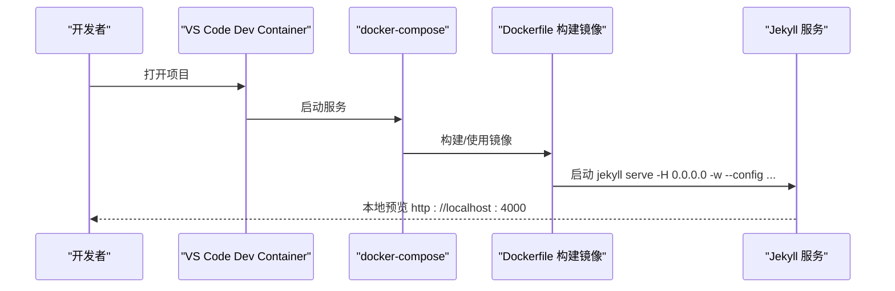
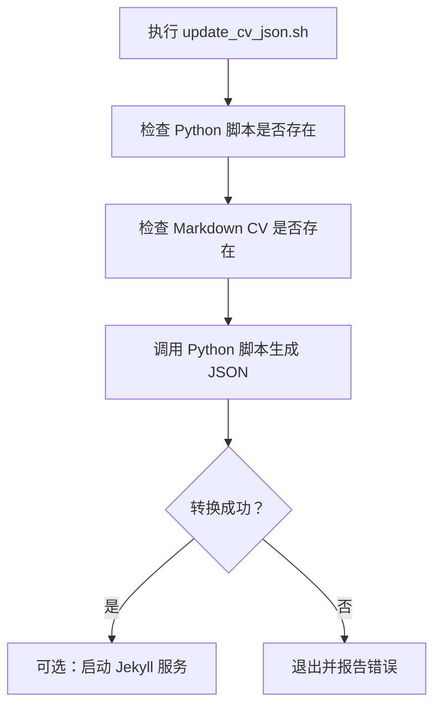
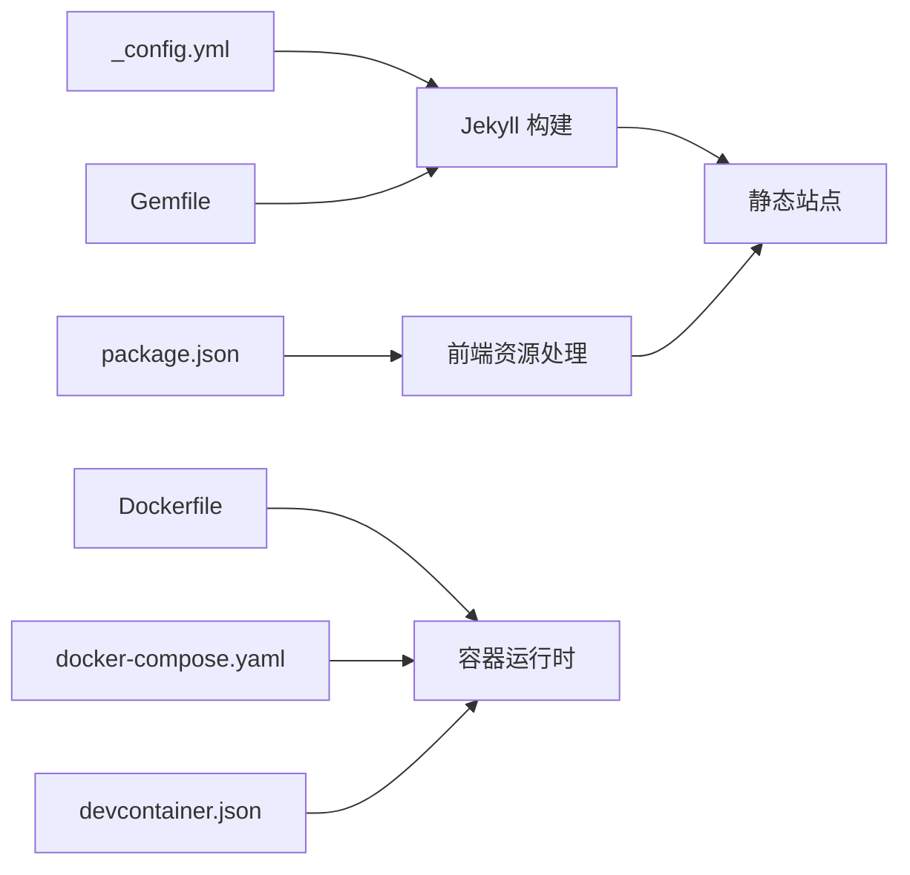

# CI/CD 工作流程

<cite>
**本文引用的文件**
- [package.json](file://package.json)
- [_config.yml](file://_config.yml)
- [Gemfile](file://Gemfile)
- [Dockerfile](file://Dockerfile)
- [docker-compose.yaml](file://docker-compose.yaml)
- [.devcontainer/devcontainer.json](file://.devcontainer/devcontainer.json)
- [_config_docker.yml](file://_config_docker.yml)
- [scripts/update_cv_json.sh](file://scripts/update_cv_json.sh)
- [hexo-site/.github/dependabot.yml](file://hexo-site/.github/dependabot.yml)
</cite>

## 目录
1. [简介](#简介)
2. [项目结构](#项目结构)
3. [核心组件](#核心组件)
4. [架构总览](#架构总览)
5. [详细组件分析](#详细组件分析)
6. [依赖关系分析](#依赖关系分析)
7. [性能考虑](#性能考虑)
8. [故障排除指南](#故障排除指南)
9. [结论](#结论)
10. [附录](#附录)

## 简介
本指南面向使用 GitHub Pages 托管的 Jekyll 网站（仓库：CoolPig0720/CoolPig0720.github.io），系统性讲解如何在本地与容器环境中进行构建与预览，并基于现有配置推导出可落地的 CI/CD 工作流程设计思路。当前仓库未包含 GitHub Actions 工作流文件，但提供了完整的本地开发与容器化运行环境，便于直接映射到 CI/CD 流水线。

## 项目结构
该项目采用 Jekyll 主题与静态内容组织方式，同时提供 Docker 化开发环境与 VS Code Dev Container 支持。关键目录与文件如下：
- 根目录：Jekyll 配置、主题与页面资源
- hexo-site：另一个 Hexo 站点（与主 Jekyll 站点并行）
- .devcontainer：VS Code 开发容器配置
- scripts：辅助脚本（如 CV JSON 更新）
- docker-compose 与 Dockerfile：本地容器化构建与服务

图表来源
- [_config.yml](file://_config.yml)
- [Gemfile](file://Gemfile)
- [package.json](file://package.json)
- [Dockerfile](file://Dockerfile)
- [docker-compose.yaml](file://docker-compose.yaml)
- [.devcontainer/devcontainer.json](file://.devcontainer/devcontainer.json)
- [scripts/update_cv_json.sh](file://scripts/update_cv_json.sh)
- [hexo-site/.github/dependabot.yml](file://hexo-site/.github/dependabot.yml)

章节来源
- [_config.yml](file://_config.yml)
- [Gemfile](file://Gemfile)
- [package.json](file://package.json)
- [Dockerfile](file://Dockerfile)
- [docker-compose.yaml](file://docker-compose.yaml)
- [.devcontainer/devcontainer.json](file://.devcontainer/devcontainer.json)
- [scripts/update_cv_json.sh](file://scripts/update_cv_json.sh)
- [hexo-site/.github/dependabot.yml](file://hexo-site/.github/dependabot.yml)

## 核心组件
- Jekyll 构建链路
  - Ruby 环境与插件通过 Gemfile 管理
  - Jekyll 配置由 _config.yml 提供
  - 前端资源与压缩脚本由 package.json 的 scripts 定义
- 容器化运行
  - Dockerfile 指定基础镜像、安装依赖、切换非 root 用户并启动 Jekyll
  - docker-compose 将宿主机目录挂载至容器，暴露端口并以环境变量控制 Jekyll 环境
- 开发容器支持
  - .devcontainer/devcontainer.json 通过 docker-compose 启动 VS Code 远程开发环境
- 数据与脚本
  - scripts/update_cv_json.sh 负责从 Markdown CV 生成 JSON 数据
  - _config_docker.yml 为容器环境提供最小化 url 配置
- 依赖维护
  - hexo-site/.github/dependabot.yml 用于 Hexo 项目的依赖自动更新

章节来源
- [Gemfile](file://Gemfile)
- [_config.yml](file://_config.yml)
- [package.json](file://package.json)
- [Dockerfile](file://Dockerfile)
- [docker-compose.yaml](file://docker-compose.yaml)
- [.devcontainer/devcontainer.json](file://.devcontainer/devcontainer.json)
- [scripts/update_cv_json.sh](file://scripts/update_cv_json.sh)
- [_config_docker.yml](file://_config_docker.yml)
- [hexo-site/.github/dependabot.yml](file://hexo-site/.github/dependabot.yml)

## 架构总览
下图展示了从“本地开发/容器化”到“GitHub Pages 部署”的典型流水线映射。该映射基于现有配置，帮助你将本地流程迁移到 CI/CD：

图表来源
- [.devcontainer/devcontainer.json](file://.devcontainer/devcontainer.json)
- [docker-compose.yaml](file://docker-compose.yaml)
- [Dockerfile](file://Dockerfile)
- [_config.yml](file://_config.yml)
- [Gemfile](file://Gemfile)
- [package.json](file://package.json)

## 详细组件分析

### 组件一：Jekyll 构建与配置
- 配置要点
  - 全局站点信息、作者信息、社交链接、SEO、分析提供商等
  - 插件白名单与输出样式（如压缩 HTML）
  - Markdown 处理器、高亮器、目录归档等
- 关键影响
  - 插件列表决定构建阶段的依赖安装范围
  - 输出路径与压缩策略影响最终产物体积与加载性能

图表来源
- [_config.yml](file://_config.yml)

章节来源
- [_config.yml](file://_config.yml)

### 组件二：Ruby 与插件依赖（Gemfile）
- 作用
  - 声明 Jekyll 核心与常用插件（feed、sitemap、redirect-from、emoji 等）
  - 指定 github-pages 兼容层与连接池版本
- 影响
  - CI 中需确保 Ruby 版本与 Bundler 版本稳定，避免构建漂移

图表来源
- [Gemfile](file://Gemfile)

章节来源
- [Gemfile](file://Gemfile)

### 组件三：前端资源与脚本（package.json）
- 作用
  - 定义 jQuery、fitvids、smooth-scroll、plotly 等前端库
  - 提供 JS 压缩与监听脚本（uglify、watch:js、build:js）
- 影响
  - 在 CI 中可选择是否执行 JS 压缩，以平衡构建时间与产物体积

图表来源
- [package.json](file://package.json)

章节来源
- [package.json](file://package.json)

### 组件四：容器化构建与服务（Dockerfile 与 docker-compose）
- Dockerfile
  - 基于 Ruby 3.2，安装 Node.js 与构建工具
  - 创建非 root 用户，切换用户，复制 Gemfile 并安装依赖
  - 以 jekyll serve 命令启动服务，支持多配置文件
- docker-compose
  - 将宿主机目录挂载到容器，暴露 4000 端口
  - 设置 JEKYLL_ENV=docker，命令行参数启用监听与多配置
- .devcontainer/devcontainer.json
  - 通过 docker-compose 启动 VS Code 远程开发环境，端口转发 4000

图表来源
- [Dockerfile](file://Dockerfile)
- [docker-compose.yaml](file://docker-compose.yaml)
- [.devcontainer/devcontainer.json](file://.devcontainer/devcontainer.json)
- [_config_docker.yml](file://_config_docker.yml)

章节来源
- [Dockerfile](file://Dockerfile)
- [docker-compose.yaml](file://docker-compose.yaml)
- [.devcontainer/devcontainer.json](file://.devcontainer/devcontainer.json)
- [_config_docker.yml](file://_config_docker.yml)

### 组件五：数据转换脚本（scripts/update_cv_json.sh）
- 功能
  - 将 _pages/cv.md 转换为 _data/cv.json
  - 可选：转换成功后提示是否启动本地 Jekyll 服务
- 影响
  - 可纳入 CI 的“构建前准备”步骤，确保数据一致性

图表来源
- [scripts/update_cv_json.sh](file://scripts/update_cv_json.sh)

章节来源
- [scripts/update_cv_json.sh](file://scripts/update_cv_json.sh)

### 组件六：依赖自动更新（hexo-site/.github/dependabot.yml）
- 作用
  - 对 Hexo 项目中的 npm 依赖进行每日自动更新与 PR 合并限制
- 影响
  - 有助于降低安全风险与依赖陈旧问题；对 Jekyll 项目可借鉴类似的 Dependabot 策略

章节来源
- [hexo-site/.github/dependabot.yml](file://hexo-site/.github/dependabot.yml)

## 依赖关系分析
- 构建链路耦合
  - Ruby 生态（Gemfile）与 Node 生态（package.json）相互独立，但在 CI 中可并行安装
  - Jekyll 配置（_config.yml）影响构建产物与插件行为
- 容器化解耦
  - Dockerfile 将 Ruby 与 Node 环境打包，docker-compose 提供统一入口
  - .devcontainer/devcontainer.json 使本地开发与 CI 环境一致

图表来源
- [_config.yml](file://_config.yml)
- [Gemfile](file://Gemfile)
- [package.json](file://package.json)
- [Dockerfile](file://Dockerfile)
- [docker-compose.yaml](file://docker-compose.yaml)
- [.devcontainer/devcontainer.json](file://.devcontainer/devcontainer.json)

章节来源
- [_config.yml](file://_config.yml)
- [Gemfile](file://Gemfile)
- [package.json](file://package.json)
- [Dockerfile](file://Dockerfile)
- [docker-compose.yaml](file://docker-compose.yaml)
- [.devcontainer/devcontainer.json](file://.devcontainer/devcontainer.json)

## 性能考虑
- 构建加速
  - 缓存 Ruby 与 Node 依赖（Bundler 与 npm）以减少重复安装
  - 使用增量构建与监听模式（本地已通过 -w 实现，CI 中可复用）
- 资源优化
  - 前端资源压缩（scripts.build:js）可在 CI 中按需开启
  - HTML 压缩（compress_html）仅在生产环境启用
- 容器层优化
  - 复用基础镜像层，避免每次安装完整依赖
  - 使用非 root 用户运行，提升安全性

## 故障排除指南
- 本地无法访问 4000 端口
  - 检查 docker-compose 端口映射与防火墙
  - 确认 Jekyll 命令行参数包含监听与多配置文件
- 权限问题（root 用户）
  - 容器内已切换为非 root 用户，若出现权限异常，请检查卷挂载目录权限
- 插件冲突或构建失败
  - 核对 Gemfile 与 github-pages 兼容性，锁定 Bundler 版本
- 前端资源缺失
  - 确保 npm 依赖安装完成，必要时在 CI 中执行 npm ci
- 数据转换失败
  - 检查 scripts/update_cv_json.sh 的输入路径与 Python 脚本可用性

章节来源
- [docker-compose.yaml](file://docker-compose.yaml)
- [Dockerfile](file://Dockerfile)
- [Gemfile](file://Gemfile)
- [package.json](file://package.json)
- [scripts/update_cv_json.sh](file://scripts/update_cv_json.sh)

## 结论
本项目已具备完善的本地与容器化开发能力，可直接映射到 CI/CD 流水线：以 Dockerfile 作为构建基座，结合 Gemfile 与 package.json 的依赖安装，配合 Jekyll 配置完成站点构建。建议在 CI 中引入依赖缓存、按需执行测试与资源压缩，并将构建产物部署到 GitHub Pages。同时，可参考 hexo-site 的 Dependabot 配置，为 Jekyll 项目建立依赖自动更新策略。

## 附录

### A. 触发条件与执行步骤（建议）
- 触发条件
  - push 到 main/master
  - pull_request 合并到 main/master
  - schedule（如夜间构建）
- 执行步骤
  - 安装 Ruby 与 Node 依赖
  - 运行 Jekyll 构建
  - 可选：执行测试（链接检查、语法校验）
  - 部署到 gh-pages 或指定目录

### B. 缓存策略（建议）
- Ruby 依赖缓存：Bundler 缓存目录
- Node 依赖缓存：npm / pnpm/yarn 缓存目录
- 构建缓存：Jekyll _site 目录（按需）

### C. 多环境部署（建议）
- 开发环境：本地 docker-compose 预览
- 测试环境：PR 构建产物预览（如启用 Pages 预览）
- 生产环境：main 分支构建并部署到 GitHub Pages

### D. 监控与日志
- 在 CI 日志中记录关键步骤耗时
- 对构建失败进行分段重试与告警
- 使用 GitHub Pages 的构建日志查看部署状态

### E. 安全与权限
- 使用非 root 用户运行容器与 CI 步骤
- 限制依赖更新 PR 数量，避免过多变更
- 对敏感信息使用 GitHub Secrets