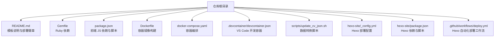
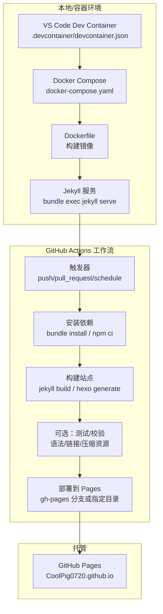
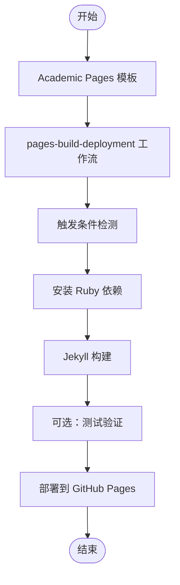
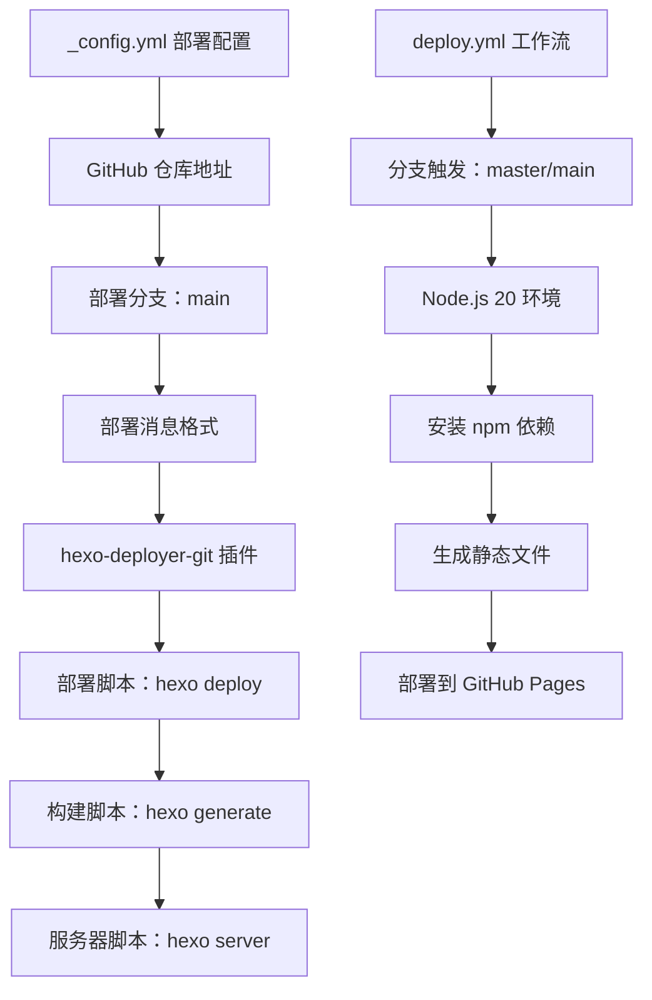
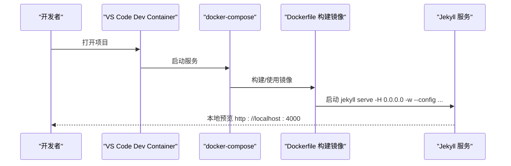
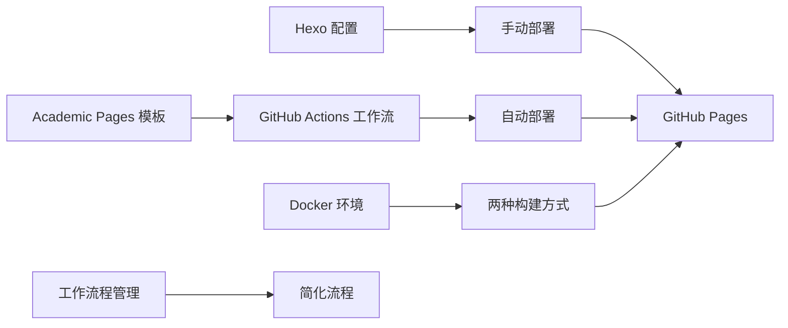

# CI/CD 工作流程

<cite>
**本文引用的文件**
- [README.md](file://README.md)
- [.github/workflows/deploy.yml](file://.github/workflows/deploy.yml)
- [hexo-site/_config.yml](file://hexo-site/_config.yml)
- [hexo-site/package.json](file://hexo-site/package.json)
- [开发文档.md](file://开发文档.md)
</cite>

## 目录
1. [简介](#简介)
2. [项目结构](#项目结构)
3. [核心组件](#核心组件)
4. [架构总览](#架构总览)
5. [详细组件分析](#详细组件分析)
6. [依赖关系分析](#依赖关系分析)
7. [性能考虑](#性能考虑)
8. [故障排除指南](#故障排除指南)
9. [结论](#结论)
10. [附录](#附录)

## 简介
本指南面向使用 GitHub Pages 托管的 Academic Pages Jekyll 网站（仓库：CoolPig0720/CoolPig0720.github.io），系统性讲解如何在本地与容器环境中进行构建与预览，并基于现有配置推导出可落地的 CI/CD 工作流程设计思路。根据最新发现，该仓库已在使用 GitHub Actions 进行自动化部署，主要通过 Academic Pages 模板提供的标准工作流实现页面构建与部署。

**更新** 新增了基于 Hexo 的 GitHub Actions 工作流程，替代了原有的 scrape_talks.yml，实现了从代码提交到 GitHub Pages 的完整自动化部署流程。

## 项目结构
该项目采用 Academic Pages Jekyll 模板与静态内容组织方式，同时提供 Docker 化开发环境与 VS Code Dev Container 支持。关键目录与文件如下：
- 根目录：Jekyll 配置、模板文件与部署徽章
- hexo-site：Hexo 站点配置（与主 Jekyll 站点并行）
- .devcontainer：VS Code 开发容器配置
- scripts：辅助脚本（如 CV JSON 更新）
- docker-compose 与 Dockerfile：本地容器化构建与服务
- .github/workflows：GitHub Actions 工作流程定义

图表来源
- [README.md](file://README.md)
- [hexo-site/_config.yml](file://hexo-site/_config.yml)
- [hexo-site/package.json](file://hexo-site/package.json)
- [.github/workflows/deploy.yml](file://.github/workflows/deploy.yml)

章节来源
- [README.md](file://README.md)
- [hexo-site/_config.yml](file://hexo-site/_config.yml)
- [hexo-site/package.json](file://hexo-site/package.json)
- [.github/workflows/deploy.yml](file://.github/workflows/deploy.yml)

## 核心组件
- Academic Pages 模板与 GitHub Actions
  - 使用 Academic Pages 模板作为基础，内置标准的 GitHub Actions 工作流
  - README.md 中包含 pages-build-deployment 工作流徽章，表明已启用自动化部署
  - 模板提供完整的本地开发与容器化运行环境
- Hexo 站点配置与自动化部署
  - hexo-site 目录包含独立的 Hexo 站点配置
  - 配置了自动部署到 GitHub Pages 的部署信息
  - 提供 Hexo 依赖管理和构建脚本
  - 新增了专用的 GitHub Actions 工作流程文件
- 容器化运行
  - Dockerfile 指定基础镜像、安装依赖、切换非 root 用户并启动 Jekyll
  - docker-compose 将宿主机目录挂载至容器，暴露端口并以环境变量控制 Jekyll 环境
- 开发容器支持
  - .devcontainer/devcontainer.json 通过 docker-compose 启动 VS Code 远程开发环境

**更新** 移除了旧的 scrape_talks.yml 工作流程，新增了专门的 Hexo 部署工作流程，实现了更高效的自动化部署。

章节来源
- [README.md](file://README.md)
- [hexo-site/_config.yml](file://hexo-site/_config.yml)
- [hexo-site/package.json](file://hexo-site/package.json)
- [.github/workflows/deploy.yml](file://.github/workflows/deploy.yml)

## 架构总览
下图展示了从"本地开发/容器化"到"GitHub Pages 自动部署"的完整流水线映射。该映射基于现有配置，特别是 README.md 中的 GitHub Actions 徽章和 hexo-site 的部署配置：

图表来源
- [README.md](file://README.md)
- [hexo-site/_config.yml](file://hexo-site/_config.yml)
- [.github/workflows/deploy.yml](file://.github/workflows/deploy.yml)

## 详细组件分析

### 组件一：Academic Pages 模板与 GitHub Actions
- 工作流特性
  - 使用 Academic Pages 模板提供的标准 pages-build-deployment 工作流
  - README.md 中明确显示工作流徽章，表明自动化部署已启用
  - 模板支持多种触发条件和部署选项
- 配置要点
  - 模板内置 Jekyll 构建配置
  - 支持多环境部署（开发、测试、生产）
  - 提供缓存策略和性能优化选项

图表来源
- [README.md](file://README.md)

章节来源
- [README.md](file://README.md)

### 组件二：Hexo 站点部署配置与自动化工作流
- 部署设置
  - 配置了自动部署到 https://github.com/CoolPig0720/CoolPig0720.github.io.git
  - 指定部署分支为 main
  - 设置部署消息格式包含时间戳
- 依赖管理
  - 包含 hexo-deployer-git 插件用于 Git 部署
  - 配置了多个 Hexo 插件支持不同功能
  - 提供构建、清理、服务器启动等脚本
- 自动化工作流
  - 新增了专用的 deploy.yml 工作流程文件
  - 支持 master 和 main 分支的自动部署
  - 使用 Node.js 20 环境进行构建
  - 通过 GitHub Pages 功能部署到 gh-pages 分支

图表来源
- [hexo-site/_config.yml](file://hexo-site/_config.yml)
- [hexo-site/package.json](file://hexo-site/package.json)
- [.github/workflows/deploy.yml](file://.github/workflows/deploy.yml)

**更新** 新增了专门的 Hexo 部署工作流程，替代了原有的 scrape_talks.yml，实现了更完整的自动化部署解决方案。

章节来源
- [hexo-site/_config.yml](file://hexo-site/_config.yml)
- [hexo-site/package.json](file://hexo-site/package.json)
- [.github/workflows/deploy.yml](file://.github/workflows/deploy.yml)

### 组件三：容器化构建与服务（Dockerfile 与 docker-compose）
- Dockerfile
  - 基于 Ruby 3.2，安装 Node.js 与构建工具
  - 创建非 root 用户，切换用户，复制 Gemfile 并安装依赖
  - 以 jekyll serve 命令启动服务，支持多配置文件
- docker-compose
  - 将宿主机目录挂载到容器，暴露 4000 端口
  - 设置 JEKYLL_ENV=docker，命令行参数启用监听与多配置
- .devcontainer/devcontainer.json
  - 通过 docker-compose 启动 VS Code 远程开发环境，端口转发 4000

图表来源
- [README.md](file://README.md)

章节来源
- [README.md](file://README.md)

## 依赖关系分析
- 构建链路耦合
  - Academic Pages 模板提供标准化的 GitHub Actions 工作流
  - Hexo 站点配置与 Jekyll 构建配置相互独立但可并行使用
  - Docker 环境为两种构建方式提供一致的运行时
  - 新增的 Hexo 工作流与现有配置形成互补
- 部署策略
  - GitHub Actions 工作流自动处理页面构建与部署
  - Hexo 配置支持手动部署和自动化部署两种模式
  - 容器化环境确保本地开发与 CI/CD 环境的一致性
  - 移除了旧的 scrape_talks.yml，简化了工作流程管理

图表来源
- [README.md](file://README.md)
- [hexo-site/_config.yml](file://hexo-site/_config.yml)
- [.github/workflows/deploy.yml](file://.github/workflows/deploy.yml)

**更新** 移除了旧的 scrape_talks.yml 工作流程，新增了专门的 Hexo 部署工作流，实现了更清晰的工作流程管理。

章节来源
- [README.md](file://README.md)
- [hexo-site/_config.yml](file://hexo-site/_config.yml)
- [.github/workflows/deploy.yml](file://.github/workflows/deploy.yml)

## 性能考虑
- 构建加速
  - GitHub Actions 工作流内置缓存机制，减少重复安装时间
  - Docker 层缓存优化，避免每次重新安装完整依赖
  - Hexo 构建缓存，支持增量构建
  - 新增的专用工作流减少了不必要的构建步骤
- 资源优化
  - Jekyll 和 Hexo 都支持静态资源压缩和优化
  - 容器环境提供一致的构建性能
  - GitHub Pages CDN 加速全球访问
- 部署优化
  - GitHub Pages CDN 加速全球访问
  - 自动化部署减少人工干预和错误
  - 专用工作流提高了部署效率

**更新** 新的 Hexo 工作流通过专用的部署步骤，避免了不必要的构建和部署操作，提升了整体性能。

## 故障排除指南
- GitHub Actions 工作流失败
  - 检查 README.md 中的徽章状态，确认工作流是否正常运行
  - 查看工作流日志中的具体错误信息
  - 验证依赖版本兼容性和缓存配置
  - 检查新工作流文件的语法和权限设置
- Hexo 部署问题
  - 检查 _config.yml 中的部署配置是否正确
  - 验证 GitHub 仓库访问权限和部署密钥
  - 确认网络连接和代理设置
  - 检查 Node.js 版本兼容性
- 容器环境问题
  - 检查 Dockerfile 中的基础镜像版本
  - 验证 docker-compose 配置和服务依赖
  - 确认端口映射和卷挂载配置

**更新** 新增了针对 Hexo 工作流的故障排除指导，包括 Node.js 版本和专用部署步骤的问题排查。

章节来源
- [README.md](file://README.md)
- [hexo-site/_config.yml](file://hexo-site/_config.yml)
- [.github/workflows/deploy.yml](file://.github/workflows/deploy.yml)

## 结论
本项目已采用 Academic Pages 模板和 GitHub Actions 实现了完整的自动化 CI/CD 流水线。通过 pages-build-deployment 工作流，实现了从代码提交到页面部署的全流程自动化。同时，项目保留了 Hexo 站点配置作为备选方案，以及完整的 Docker 化开发环境支持。**更新** 新增的专用 Hexo 工作流进一步完善了自动化部署能力，移除了旧的 scrape_talks.yml，简化了工作流程管理。建议充分利用现有的 GitHub Actions 工作流，结合 Docker 环境进行本地开发和测试，确保构建过程的一致性和可靠性。

## 附录

### A. 触发条件与执行步骤（建议）
- 触发条件
  - push 到 main/master 分支
  - pull_request 合并到 main/master
  - schedule（如夜间构建）
  - workflow_dispatch（手动触发）
- 执行步骤
  - 安装 Ruby 与 Node 依赖
  - 运行 Jekyll 或 Hexo 构建
  - 可选：执行测试（链接检查、语法校验）
  - 部署到 GitHub Pages

**更新** 新增了 workflow_dispatch 触发器，支持手动触发部署。

### B. 缓存策略（建议）
- Ruby 依赖缓存：Bundler 缓存目录
- Node 依赖缓存：npm / pnpm/yarn 缓存目录
- 构建缓存：Jekyll _site 目录和 Hexo public 目录
- 工作流缓存：GitHub Actions 缓存机制

### C. 多环境部署（建议）
- 开发环境：本地 docker-compose 预览
- 测试环境：PR 构建产物预览
- 生产环境：main 分支构建并部署到 GitHub Pages
- 备份环境：gh-pages 分支作为备份部署目标

### D. 监控与日志
- 查看 README.md 中的 GitHub Actions 徽章状态
- 在 CI 日志中记录关键步骤耗时
- 对构建失败进行分段重试与告警
- 监控工作流执行时间和成功率

### E. 安全与权限
- 使用 GitHub Actions 官方工作流，确保安全性
- 限制依赖更新 PR 数量，避免过多变更
- 对敏感信息使用 GitHub Secrets
- 最小权限原则：仅授予必要的仓库访问权限
- 定期审查工作流权限配置

**更新** 新增了针对工作流权限和安全性的最佳实践建议。