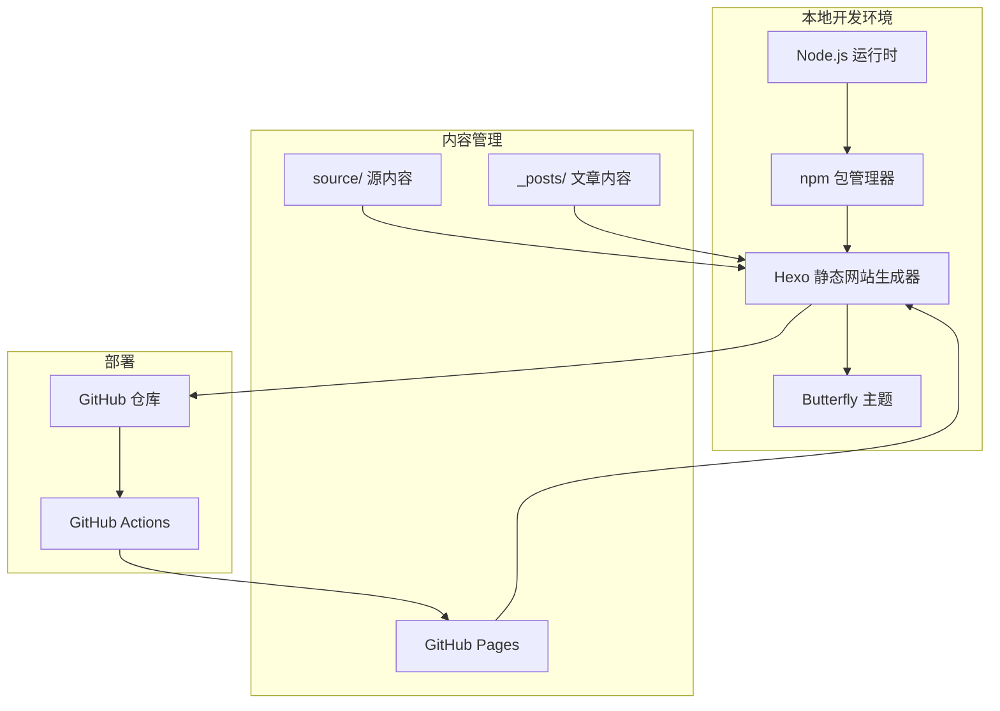
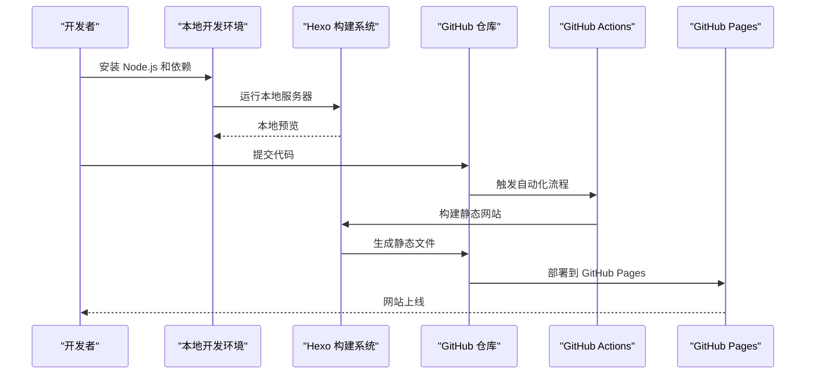
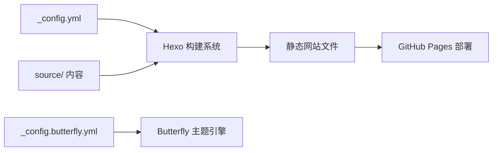
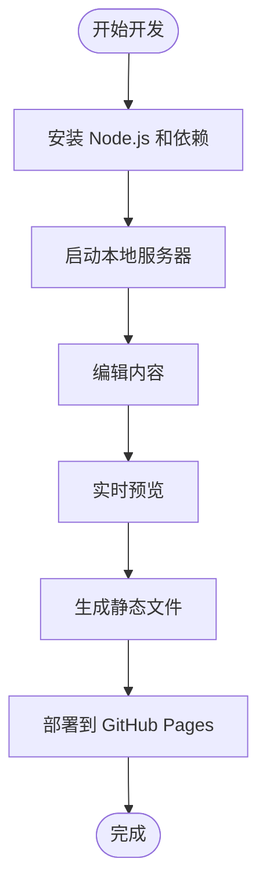
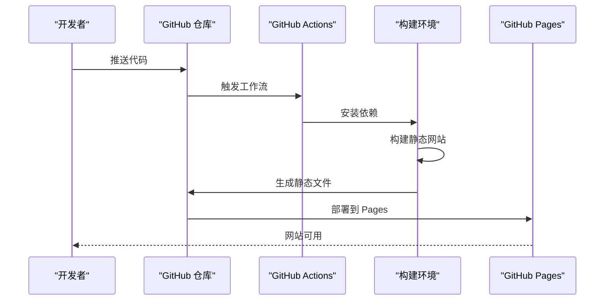
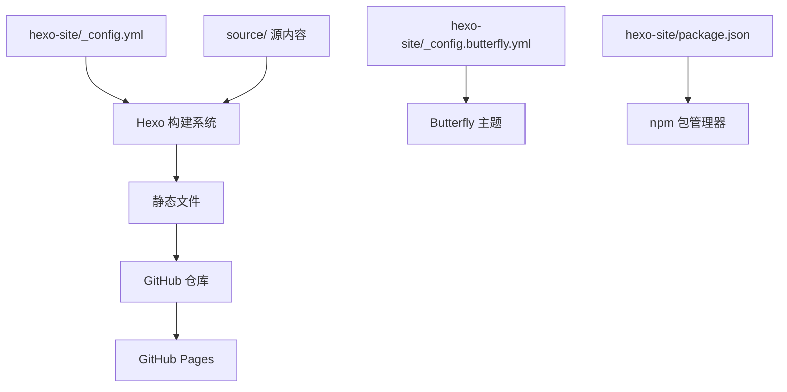

# Docker 容器化部署

<cite>
**本文引用的文件**
- [README.md](file://README.md)
- [_config.yml](file://_config.yml)
- [_config_docker.yml](file://_config_docker.yml)
- [Gemfile](file://Gemfile)
- [package.json](file://package.json)
- [scripts/update_cv_json.sh](file://scripts/update_cv_json.sh)
- [hexo-site/_config.yml](file://hexo-site/_config.yml)
- [hexo-site/package.json](file://hexo-site/package.json)
- [hexo-site/_config.butterfly.yml](file://hexo-site/_config.butterfly.yml)
- [hexo-site/source/index.md](file://hexo-site/source/index.md)
- [hexo-site/source/about/index.md](file://hexo-site/source/about/index.md)
</cite>

## 目录
1. [简介](#简介)
2. [项目结构](#项目结构)
3. [核心组件](#核心组件)
4. [架构总览](#架构总览)
5. [详细组件分析](#详细组件分析)
6. [依赖关系分析](#依赖关系分析)
7. [性能考虑](#性能考虑)
8. [故障排除指南](#故障排除指南)
9. [结论](#结论)
10. [附录](#附录)

## 简介
**重要更新**：Docker 容器化系统已完全移除，不再支持 Docker 部署方式。本指南现面向基于 Hexo 的学术主题网站，提供本地开发与部署的完整流程，包括 Node.js 环境配置、Hexo 构建系统、GitHub Pages 自动化部署等。本文所有技术细节均来自仓库中的实际配置文件。

## 项目结构
该项目现已完全迁移到 Hexo（基于 Node.js）静态网站生成器，采用 JavaScript 生态进行本地构建与部署。主要文件结构如下：
- hexo-site/_config.yml：Hexo 主配置文件，包含站点信息、主题配置、部署设置等
- hexo-site/package.json：前端资源与构建脚本，声明 Hexo 及相关插件依赖
- hexo-site/_config.butterfly.yml：Butterfly 主题配置文件，控制界面样式与功能
- hexo-site/source/：源内容目录，包含 Markdown 文章、页面和媒体资源
- README.md：项目说明文档，包含本地运行和部署指南

**章节来源**
- [hexo-site/_config.yml:1-142](file://hexo-site/_config.yml#L1-L142)
- [hexo-site/package.json:1-35](file://hexo-site/package.json#L1-L35)
- [hexo-site/_config.butterfly.yml:1-459](file://hexo-site/_config.butterfly.yml#L1-L459)

## 核心组件
**重要更新**：Docker 相关组件已完全移除，现提供 Hexo 本地开发与部署方案：

### Hexo 配置组件
- 主配置文件（hexo-site/_config.yml）
  - 站点基本信息：标题、副标题、描述、关键词、作者等
  - URL 设置：部署到 https://CoolPig0720.github.io
  - 主题配置：使用 butterfly 主题
  - 部署设置：配置 GitHub 仓库和分支
- 主题配置（hexo-site/_config.butterfly.yml）
  - 导航栏配置：Logo、菜单项、社交媒体链接
  - 界面设置：深色模式、代码块样式、分页设置
  - 功能配置：MathJax 数学公式、Mermaid 图表支持
- 源内容管理
  - source/ 目录：包含首页、关于页面、CV、作品集等
  - _posts/ 目录：Markdown 格式的博客文章
  - scaffolds/ 目录：文章模板

### 本地开发组件
- Node.js 环境要求：确保安装 Node.js 和 npm
- 依赖安装：运行 `npm install` 安装 Hexo 及插件
- 本地预览：运行 `npm run server` 启动本地服务器
- 构建生成：运行 `npm run build` 生成静态文件

### GitHub Pages 部署组件
- 自动化部署：通过 GitHub Actions 实现代码提交后的自动构建部署
- 仓库配置：配置正确的 GitHub 仓库 URL 和分支
- 部署流程：提交代码后自动触发构建和部署

**章节来源**
- [hexo-site/_config.yml:1-142](file://hexo-site/_config.yml#L1-L142)
- [hexo-site/_config.butterfly.yml:1-459](file://hexo-site/_config.butterfly.yml#L1-L459)
- [hexo-site/package.json:1-35](file://hexo-site/package.json#L1-L35)
- [README.md:18-56](file://README.md#L18-L56)

## 架构总览
下图展示从本地开发到 GitHub Pages 部署的完整流程：

**图表来源**
- [README.md:18-56](file://README.md#L18-L56)
- [hexo-site/_config.yml:126-142](file://hexo-site/_config.yml#L126-L142)

## 详细组件分析

### Hexo 配置文件组件分析
- 站点配置（hexo-site/_config.yml）
  - 基本信息：title、subtitle、description、author 等
  - URL 设置：部署目标 URL 和链接格式
  - 主题配置：启用 butterfly 主题
  - 部署配置：Git 部署设置，指定仓库和分支
- 主题配置（hexo-site/_config.butterfly.yml）
  - 导航栏：Logo、菜单项、社交媒体链接
  - 界面设置：深色模式、代码块样式、分页配置
  - 功能支持：MathJax、Mermaid、字数统计等
- 源内容结构
  - 首页：自定义 HTML 和 CSS 样式
  - 关于页面：个人介绍和联系方式
  - 博客文章：Markdown 格式的文章内容

**图表来源**
- [hexo-site/_config.yml:1-142](file://hexo-site/_config.yml#L1-L142)
- [hexo-site/_config.butterfly.yml:1-459](file://hexo-site/_config.butterfly.yml#L1-L459)

**章节来源**
- [hexo-site/_config.yml:1-142](file://hexo-site/_config.yml#L1-L142)
- [hexo-site/_config.butterfly.yml:1-459](file://hexo-site/_config.butterfly.yml#L1-L459)
- [hexo-site/source/index.md:1-204](file://hexo-site/source/index.md#L1-L204)
- [hexo-site/source/about/index.md:1-67](file://hexo-site/source/about/index.md#L1-L67)

### 本地开发组件分析
- 环境准备
  - Node.js 安装：根据操作系统安装 Node.js 和 npm
  - 依赖安装：运行 `npm install` 安装 Hexo 及相关插件
  - 权限设置：Linux 系统可能需要额外的构建工具
- 本地运行
  - 启动服务器：`npm run server` 启动本地预览服务器
  - 热重载：修改内容后自动重新构建和刷新
  - 预览访问：浏览器访问 http://localhost:4000
- 构建流程
  - 生成静态文件：`npm run build` 生成部署所需的静态文件
  - 清理缓存：`npm run clean` 清理生成的文件

**图表来源**
- [README.md:18-56](file://README.md#L18-L56)
- [hexo-site/package.json:5-10](file://hexo-site/package.json#L5-L10)

**章节来源**
- [README.md:18-56](file://README.md#L18-L56)
- [hexo-site/package.json:1-35](file://hexo-site/package.json#L1-L35)

### GitHub Pages 部署组件分析
- 自动化部署流程
  - 代码提交：推送到 GitHub 仓库
  - Actions 触发：GitHub Actions 自动检测代码变更
  - 构建过程：自动安装依赖、构建静态网站
  - 部署发布：将生成的静态文件部署到 GitHub Pages
- 部署配置
  - 仓库设置：配置正确的 GitHub 仓库 URL
  - 分支选择：指定要部署的分支（通常是 main）
  - 自动化：无需手动干预，代码提交即自动部署

**图表来源**
- [hexo-site/_config.yml:126-142](file://hexo-site/_config.yml#L126-L142)

**章节来源**
- [hexo-site/_config.yml:126-142](file://hexo-site/_config.yml#L126-L142)

## 依赖关系分析
**重要更新**：Docker 依赖关系已移除，现提供 Hexo 生态系统的依赖关系：

- 组件耦合
  - hexo-site/_config.yml 与 Hexo 构建系统强耦合
  - hexo-site/_config.butterfly.yml 与 Butterfly 主题强耦合
  - package.json 与 npm 包管理器强耦合
  - 源内容与构建系统弱耦合，通过约定的目录结构关联
- 外部依赖
  - Node.js 运行时环境
  - Hexo 静态网站生成器
  - Butterfly 主题及其依赖
  - GitHub Pages 部署服务
- 潜在循环依赖
  - 当前结构无循环依赖，各组件职责明确

**图表来源**
- [hexo-site/_config.yml:1-142](file://hexo-site/_config.yml#L1-L142)
- [hexo-site/_config.butterfly.yml:1-459](file://hexo-site/_config.butterfly.yml#L1-L459)
- [hexo-site/package.json:1-35](file://hexo-site/package.json#L1-L35)

**章节来源**
- [hexo-site/_config.yml:1-142](file://hexo-site/_config.yml#L1-L142)
- [hexo-site/_config.butterfly.yml:1-459](file://hexo-site/_config.butterfly.yml#L1-L459)
- [hexo-site/package.json:1-35](file://hexo-site/package.json#L1-L35)

## 性能考虑
**重要更新**：Docker 性能优化已移除，现提供 Hexo 性能优化建议：

- 构建性能优化
  - 依赖管理：使用 package.json 精确管理依赖版本
  - 缓存策略：利用 npm 缓存减少重复安装时间
  - 构建优化：合理配置 Hexo 插件，避免不必要的处理
- 内容优化
  - 图片优化：压缩图片大小，使用适当的格式
  - 代码高亮：配置合理的代码高亮设置
  - 字体加载：优化字体加载策略
- 部署优化
  - 静态资源：GitHub Pages 具有良好的 CDN 加速
  - 构建时间：合理安排文章数量，避免过大的构建负载

## 故障排除指南
**重要更新**：Docker 相关故障排除已移除，现提供 Hexo 开发故障排除：

### 环境配置问题
- Node.js 版本不兼容
  - 症状：npm install 失败或运行时报错
  - 解决：确保安装兼容的 Node.js 版本
  - 参考：[README.md:24-42](file://README.md#L24-L42)
- 权限问题
  - 症状：npm install 权限不足
  - 解决：使用 `sudo` 或配置本地安装路径
  - 参考：[README.md:45-50](file://README.md#L45-L50)

### 构建问题
- 依赖安装失败
  - 症状：npm install 报错
  - 解决：删除 node_modules 和 package-lock.json 重新安装
  - 参考：[README.md:43-44](file://README.md#L43-L44)
- 构建错误
  - 症状：hexo generate 失败
  - 解决：检查 Markdown 语法和配置文件格式
  - 参考：[hexo-site/_config.yml:1-142](file://hexo-site/_config.yml#L1-L142)

### 本地预览问题
- 服务器启动失败
  - 症状：npm run server 无法启动
  - 解决：检查端口占用和防火墙设置
  - 参考：[README.md:52-53](file://README.md#L52-L53)
- 热重载失效
  - 症状：修改内容后页面不刷新
  - 解决：重启本地服务器或检查文件保存

### 部署问题
- GitHub Pages 部署失败
  - 症状：GitHub Actions 构建失败
  - 解决：检查配置文件中的仓库 URL 和分支设置
  - 参考：[hexo-site/_config.yml:137-142](file://hexo-site/_config.yml#L137-L142)
- 预览链接异常
  - 症状：部署后链接显示 404
  - 解决：检查 base_url 和 permalink 设置
  - 参考：[hexo-site/_config.yml:30-42](file://hexo-site/_config.yml#L30-L42)

**章节来源**
- [README.md:18-56](file://README.md#L18-L56)
- [hexo-site/_config.yml:1-142](file://hexo-site/_config.yml#L1-L142)

## 结论
**重要更新**：Docker 部署方式已完全移除，项目现采用纯 Node.js + Hexo + GitHub Pages 的现代化部署方案。该方案具有以下优势：
- 简化部署：无需 Docker 容器管理
- 自动化程度高：GitHub Actions 实现完全自动化部署
- 成本效益：利用 GitHub Pages 免费服务
- 开发体验：Node.js 生态提供良好的开发工具链

建议在生产环境中关注 GitHub Pages 的性能优化和监控，同时保持 Hexo 和主题的及时更新。

## 附录

### 本地开发部署流程
- 环境准备：安装 Node.js 和 npm
- 项目克隆：获取项目代码
- 依赖安装：运行 `npm install`
- 本地预览：运行 `npm run server`
- 内容更新：编辑 source/ 目录下的内容
- 部署发布：推送代码到 GitHub 仓库

**章节来源**
- [README.md:18-56](file://README.md#L18-L56)

### GitHub Pages 自动化部署
- 工作流配置：通过 GitHub Actions 实现自动化
- 构建环境：自动安装依赖和构建静态网站
- 部署流程：自动将静态文件部署到 GitHub Pages
- 监控状态：通过 GitHub Actions 状态徽章监控部署状态

**章节来源**
- [hexo-site/_config.yml:126-142](file://hexo-site/_config.yml#L126-L142)
- [README.md:76-96](file://README.md#L76-L96)

### 主题定制指南
- 导航栏配置：修改 _config.butterfly.yml 中的 menu 配置
- 样式定制：通过 CSS 注入和主题配置调整外观
- 功能开关：根据需要启用或禁用特定功能
- 响应式设计：确保在不同设备上的良好显示效果

**章节来源**
- [hexo-site/_config.butterfly.yml:1-459](file://hexo-site/_config.butterfly.yml#L1-L459)
- [hexo-site/source/index.md:1-204](file://hexo-site/source/index.md#L1-L204)