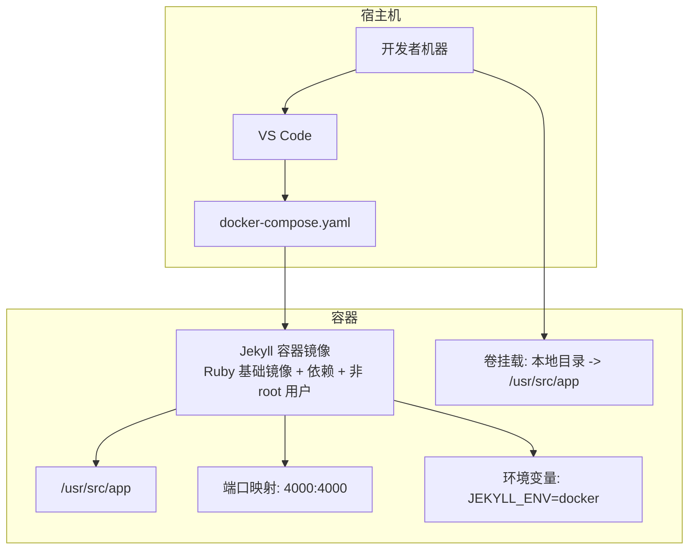
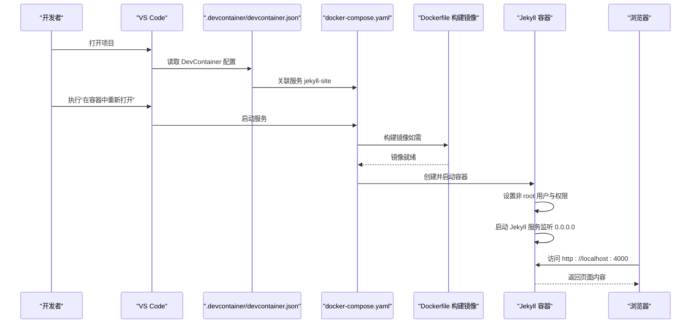
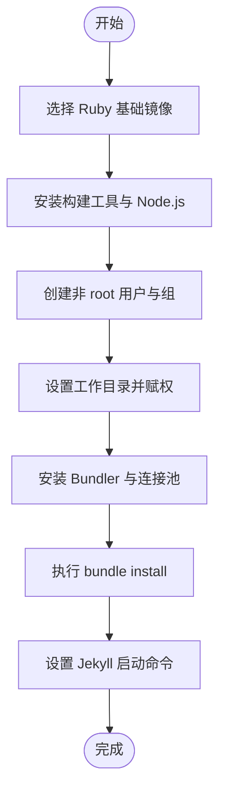
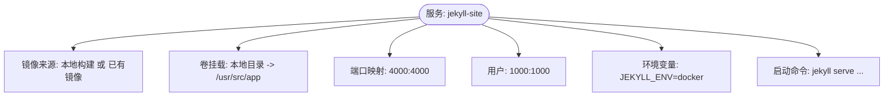
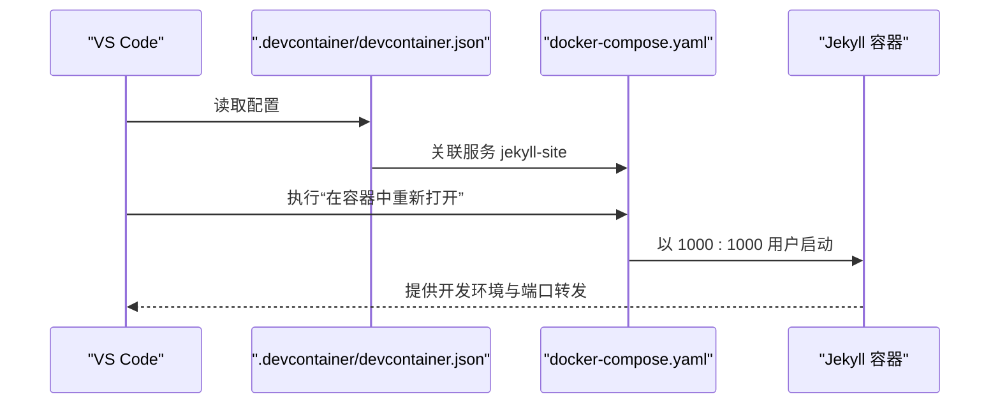
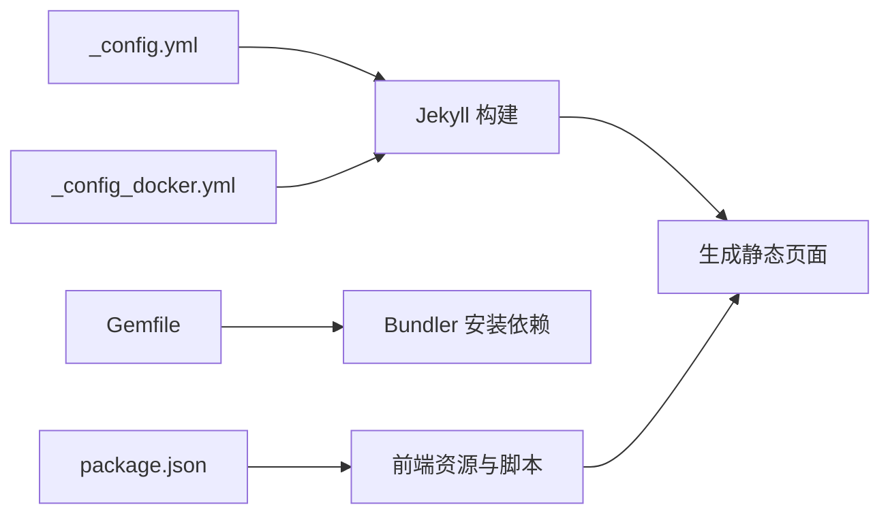
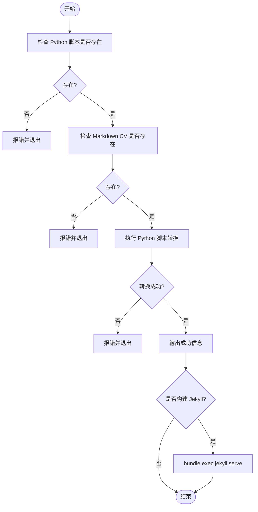
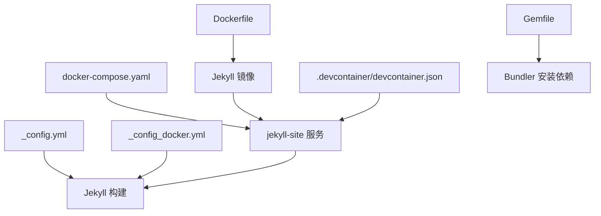

# Docker 容器化部署

<cite>
**本文引用的文件**
- [Dockerfile](file://Dockerfile)
- [docker-compose.yaml](file://docker-compose.yaml)
- [.devcontainer/devcontainer.json](file://.devcontainer/devcontainer.json)
- [_config.yml](file://_config.yml)
- [_config_docker.yml](file://_config_docker.yml)
- [Gemfile](file://Gemfile)
- [package.json](file://package.json)
- [README.md](file://README.md)
- [scripts/update_cv_json.sh](file://scripts/update_cv_json.sh)
</cite>

## 目录
1. [简介](#简介)
2. [项目结构](#项目结构)
3. [核心组件](#核心组件)
4. [架构总览](#架构总览)
5. [详细组件分析](#详细组件分析)
6. [依赖关系分析](#依赖关系分析)
7. [性能考虑](#性能考虑)
8. [故障排除指南](#故障排除指南)
9. [结论](#结论)
10. [附录](#附录)

## 简介
本指南面向希望将基于 Jekyll 的学术主题网站进行容器化部署的用户，系统讲解如何使用 Docker 和 docker-compose 构建与运行容器，如何通过 VS Code DevContainer 实现一致且可复现的开发环境，以及如何在容器中实现网络访问、数据持久化、日志与监控、安全加固与性能优化等工程实践。本文所有技术细节均来自仓库中的实际配置文件。

## 项目结构
该项目为一个 Jekyll 主题网站，采用 Ruby 生态（Ruby、Bundler、Jekyll）进行本地构建与预览。容器化相关的关键文件如下：
- Dockerfile：定义容器镜像构建步骤，含基础镜像、依赖安装、非 root 用户、工作目录与权限、Ruby Gem 与 Bundler 安装、Jekyll 启动命令。
- docker-compose.yaml：定义服务、镜像来源、卷挂载、端口映射、用户与环境变量、启动命令。
- .devcontainer/devcontainer.json：VS Code DevContainer 配置，关联 docker-compose 服务，设置远程用户、工作区路径、端口转发等。
- _config.yml 与 _config_docker.yml：站点配置，其中 _config_docker.yml 在容器环境下覆盖部分配置项。
- Gemfile：声明 Jekyll 插件与依赖版本。
- package.json：前端资源与构建脚本（与 Jekyll 构建流程解耦）。
- scripts/update_cv_json.sh：辅助脚本，用于将 Markdown CV 转换为 JSON 并可选触发本地 Jekyll 预览。

图表来源
- [Dockerfile:1-36](file://Dockerfile#L1-L36)
- [docker-compose.yaml:1-10](file://docker-compose.yaml#L1-L10)
- [.devcontainer/devcontainer.json:1-16](file://.devcontainer/devcontainer.json#L1-L16)

章节来源
- [Dockerfile:1-36](file://Dockerfile#L1-L36)
- [docker-compose.yaml:1-10](file://docker-compose.yaml#L1-L10)
- [.devcontainer/devcontainer.json:1-16](file://.devcontainer/devcontainer.json#L1-L16)
- [_config.yml:1-362](file://_config.yml#L1-L362)
- [_config_docker.yml:1-1](file://_config_docker.yml#L1-L1)
- [Gemfile:1-14](file://Gemfile#L1-L14)
- [package.json:1-42](file://package.json#L1-L42)
- [README.md:57-72](file://README.md#L57-L72)

## 核心组件
- 容器镜像构建（Dockerfile）
  - 基础镜像：使用 Ruby 官方镜像，满足 Jekyll 运行时需求。
  - 依赖安装：安装构建工具链与 Node.js，便于后续构建与预览。
  - 非 root 用户：创建并切换到非 root 用户，提升安全性。
  - 工作目录与权限：设置工作目录并赋予对应权限。
  - Ruby 依赖：安装指定版本的 Bundler 与连接池，执行 bundle install。
  - 启动命令：以 Jekyll 服务方式监听 0.0.0.0，启用热重载，并合并容器专用配置文件。
- 服务编排（docker-compose.yaml）
  - 服务名：jekyll-site。
  - 镜像来源：本地构建（build: .），或直接使用已存在的镜像（image: jekyll-site）。
  - 卷挂载：将宿主机当前目录挂载到容器工作目录，实现源码热更新。
  - 端口映射：将容器 4000 端口映射到宿主机 4000 端口。
  - 用户与环境：以 UID/GID 1000 的用户运行，设置环境变量 JEKYLL_ENV=docker。
  - 启动命令：与镜像默认命令一致，确保行为一致。
- VS Code DevContainer（.devcontainer/devcontainer.json）
  - 关联 docker-compose：指向 docker-compose.yaml 中的服务。
  - 远程用户与工作区：设置远程用户为 vscode，工作区路径为 /usr/src/app。
  - 端口转发：将容器 4000 端口转发到本地，便于在容器内打开浏览器预览。
  - 运行参数：以 1000:1000 用户身份启动，与镜像保持一致。
- 配置文件（_config.yml 与 _config_docker.yml）
  - 主配置：控制站点标题、作者信息、插件、集合、输出样式等。
  - 容器配置：在容器环境下覆盖 url 字段为空，避免相对路径问题。
- Ruby 依赖（Gemfile）
  - 指定 Jekyll 及常用插件版本，确保构建一致性。
- 前端依赖（package.json）
  - 包含 jQuery、FitVids、Smooth Scroll、Plotly 等前端库及压缩脚本。
- 辅助脚本（scripts/update_cv_json.sh）
  - 将 Markdown CV 转换为 JSON，支持可选触发本地 Jekyll 预览。

章节来源
- [Dockerfile:1-36](file://Dockerfile#L1-L36)
- [docker-compose.yaml:1-10](file://docker-compose.yaml#L1-L10)
- [.devcontainer/devcontainer.json:1-16](file://.devcontainer/devcontainer.json#L1-L16)
- [_config.yml:1-362](file://_config.yml#L1-L362)
- [_config_docker.yml:1-1](file://_config_docker.yml#L1-L1)
- [Gemfile:1-14](file://Gemfile#L1-L14)
- [package.json:1-42](file://package.json#L1-L42)
- [scripts/update_cv_json.sh:1-48](file://scripts/update_cv_json.sh#L1-L48)

## 架构总览
下图展示从本地开发到容器运行的整体流程，以及 VS Code DevContainer 如何与 docker-compose 协同工作。

图表来源
- [.devcontainer/devcontainer.json:1-16](file://.devcontainer/devcontainer.json#L1-L16)
- [docker-compose.yaml:1-10](file://docker-compose.yaml#L1-L10)
- [Dockerfile:1-36](file://Dockerfile#L1-L36)

## 详细组件分析

### Dockerfile 组件分析
- 基础镜像与依赖
  - 使用 Ruby 官方镜像作为基础，满足 Jekyll 运行时。
  - 安装构建工具链与 Node.js，保证静态资源与预览能力。
- 非 root 用户与权限
  - 创建组与用户，设置工作目录权限，降低容器攻击面。
- Ruby 依赖安装
  - 固定 Bundler 版本与连接池版本，执行 bundle install，确保依赖一致性。
- 启动命令
  - 以 Jekyll 服务方式监听 0.0.0.0，启用热重载，并加载主配置与容器配置文件。

图表来源
- [Dockerfile:1-36](file://Dockerfile#L1-L36)

章节来源
- [Dockerfile:1-36](file://Dockerfile#L1-L36)

### docker-compose.yaml 组件分析
- 服务定义
  - 服务名为 jekyll-site，镜像来源可为本地构建或已有镜像。
- 卷挂载
  - 将宿主机当前目录挂载到容器工作目录，实现源码热更新。
- 端口映射
  - 将容器 4000 端口映射到宿主机 4000 端口，便于本地预览。
- 用户与环境
  - 以 UID/GID 1000 的用户运行，设置 JEKYLL_ENV=docker，便于区分环境。
- 启动命令
  - 与镜像默认命令一致，确保行为一致。

图表来源
- [docker-compose.yaml:1-10](file://docker-compose.yaml#L1-L10)

章节来源
- [docker-compose.yaml:1-10](file://docker-compose.yaml#L1-L10)

### VS Code DevContainer 组件分析
- 关联 docker-compose
  - 通过 dockerComposeFile 与 service 字段关联到 jekyll-site 服务。
- 远程环境
  - 设置远程用户为 vscode，工作区路径为 /usr/src/app，便于在容器内编辑与调试。
- 端口转发
  - 将容器 4000 端口转发到本地，便于在容器内打开浏览器预览。
- 运行参数
  - 以 1000:1000 用户身份启动，与镜像保持一致。

图表来源
- [.devcontainer/devcontainer.json:1-16](file://.devcontainer/devcontainer.json#L1-L16)
- [docker-compose.yaml:1-10](file://docker-compose.yaml#L1-L10)

章节来源
- [.devcontainer/devcontainer.json:1-16](file://.devcontainer/devcontainer.json#L1-L16)
- [docker-compose.yaml:1-10](file://docker-compose.yaml#L1-L10)

### 配置文件与依赖组件分析
- 站点配置（_config.yml）
  - 控制站点标题、作者信息、社交链接、评论系统、分析提供商、集合类型、插件列表等。
- 容器配置（_config_docker.yml）
  - 在容器环境下将 url 设为空，避免相对路径导致的链接问题。
- Ruby 依赖（Gemfile）
  - 指定 Jekyll 与常用插件版本，确保构建一致性。
- 前端依赖（package.json）
  - 包含 jQuery、FitVids、Smooth Scroll、Plotly 等前端库及压缩脚本。

图表来源
- [_config.yml:1-362](file://_config.yml#L1-L362)
- [_config_docker.yml:1-1](file://_config_docker.yml#L1-L1)
- [Gemfile:1-14](file://Gemfile#L1-L14)
- [package.json:1-42](file://package.json#L1-L42)

章节来源
- [_config.yml:1-362](file://_config.yml#L1-L362)
- [_config_docker.yml:1-1](file://_config_docker.yml#L1-L1)
- [Gemfile:1-14](file://Gemfile#L1-L14)
- [package.json:1-42](file://package.json#L1-L42)

### 辅助脚本组件分析
- 脚本功能
  - 将 Markdown CV 转换为 JSON，支持可选触发本地 Jekyll 预览。
- 执行流程
  - 校验输入文件存在性，调用 Python 脚本转换，检查返回状态，成功后提示是否构建 Jekyll。

图表来源
- [scripts/update_cv_json.sh:1-48](file://scripts/update_cv_json.sh#L1-L48)

章节来源
- [scripts/update_cv_json.sh:1-48](file://scripts/update_cv_json.sh#L1-L48)

## 依赖关系分析
- 组件耦合
  - docker-compose.yaml 与 Dockerfile 强耦合：服务依赖镜像构建；镜像由 Dockerfile 定义。
  - VS Code DevContainer 与 docker-compose.yaml 弱耦合：通过字段关联服务，便于一键启动。
  - 配置文件与 Jekyll 构建强耦合：_config.yml 与 _config_docker.yml 决定站点行为。
  - Gemfile 与 Bundler 强耦合：固定版本确保依赖一致性。
- 外部依赖
  - Ruby 官方镜像、Node.js、构建工具链。
  - Jekyll 插件生态（feed、sitemap、redirect-from、emoji 等）。
- 潜在循环依赖
  - 当前结构无循环依赖，镜像构建与服务编排相互独立但协作。

图表来源
- [Dockerfile:1-36](file://Dockerfile#L1-L36)
- [docker-compose.yaml:1-10](file://docker-compose.yaml#L1-L10)
- [.devcontainer/devcontainer.json:1-16](file://.devcontainer/devcontainer.json#L1-L16)
- [_config.yml:1-362](file://_config.yml#L1-L362)
- [_config_docker.yml:1-1](file://_config_docker.yml#L1-L1)
- [Gemfile:1-14](file://Gemfile#L1-L14)

章节来源
- [Dockerfile:1-36](file://Dockerfile#L1-L36)
- [docker-compose.yaml:1-10](file://docker-compose.yaml#L1-L10)
- [.devcontainer/devcontainer.json:1-16](file://.devcontainer/devcontainer.json#L1-L16)
- [_config.yml:1-362](file://_config.yml#L1-L362)
- [_config_docker.yml:1-1](file://_config_docker.yml#L1-L1)
- [Gemfile:1-14](file://Gemfile#L1-L14)

## 性能考虑
- 镜像层优化
  - 合理分层：将变化频率低的步骤（如安装系统依赖）放在前面，变化频繁的步骤（如复制源码）放在后面，以提升缓存命中率。
  - 清理包管理器缓存：安装依赖后清理缓存，减小镜像体积。
- 启动与热重载
  - 使用 Jekyll 的热重载模式，减少手动重启次数，提升开发效率。
- 端口与网络
  - 仅暴露必要端口（4000），避免不必要的网络暴露。
- 数据持久化
  - 利用卷挂载将源码与生成物分离，避免在容器内写入持久化数据，降低复杂度。
- 前端资源
  - 前端资源与 Jekyll 构建解耦，可通过 package.json 的脚本进行压缩与优化，减少构建时间。

[本节为通用指导，不涉及具体文件分析]

## 故障排除指南
- 权限问题
  - 症状：容器内无法写入或权限不足。
  - 排查：确认容器以 UID/GID 1000 运行，卷挂载目标目录权限正确。
  - 参考
    - [Dockerfile:11-22](file://Dockerfile#L11-L22)
    - [docker-compose.yaml:7](file://docker-compose.yaml#L7)
- 端口占用
  - 症状：浏览器无法访问或端口冲突。
  - 排查：确认宿主机 4000 端口未被占用，docker-compose.yaml 中端口映射正确。
  - 参考
    - [docker-compose.yaml:6](file://docker-compose.yaml#L6)
- 环境变量
  - 症状：容器内环境与预期不符。
  - 排查：确认 JEKYLL_ENV=docker 已设置，容器配置文件生效。
  - 参考
    - [docker-compose.yaml:8](file://docker-compose.yaml#L8)
    - [_config_docker.yml:1](file://_config_docker.yml#L1)
- 依赖安装失败
  - 症状：bundle install 报错或插件版本冲突。
  - 排查：核对 Gemfile 中版本约束，必要时清理缓存后重试。
  - 参考
    - [Gemfile:1-14](file://Gemfile#L1-L14)
    - [Dockerfile:29-32](file://Dockerfile#L29-L32)
- DevContainer 启动异常
  - 症状：VS Code 无法在容器中重新打开或端口未转发。
  - 排查：确认 .devcontainer/devcontainer.json 中 dockerComposeFile 与 service 正确，端口转发已开启。
  - 参考
    - [.devcontainer/devcontainer.json:1-16](file://.devcontainer/devcontainer.json#L1-L16)
- 预览链接异常
  - 症状：容器内访问链接错误或相对路径问题。
  - 排查：确认 _config_docker.yml 中 url 为空，避免相对路径导致的问题。
  - 参考
    - [_config_docker.yml:1](file://_config_docker.yml#L1)

章节来源
- [Dockerfile:11-22](file://Dockerfile#L11-L22)
- [docker-compose.yaml:6-8](file://docker-compose.yaml#L6-L8)
- [_config_docker.yml:1](file://_config_docker.yml#L1)
- [Gemfile:1-14](file://Gemfile#L1-L14)
- [Dockerfile:29-32](file://Dockerfile#L29-L32)
- [.devcontainer/devcontainer.json:1-16](file://.devcontainer/devcontainer.json#L1-L16)

## 结论
通过 Docker 与 docker-compose，本项目实现了 Jekyll 网站的标准化构建与运行；借助 VS Code DevContainer，开发者可以在统一的环境中进行高效迭代。配合非 root 用户、卷挂载与最小暴露原则，既提升了安全性，也简化了开发与部署流程。建议在生产场景中进一步引入只读根文件系统、健康检查、资源限制与日志采集等措施，以增强稳定性与可观测性。

[本节为总结性内容，不涉及具体文件分析]

## 附录
- 容器化部署流程（从镜像构建到容器运行）
  - 构建镜像：使用 docker-compose 构建服务（若镜像不存在）。
  - 启动服务：运行 docker-compose up，自动挂载卷、映射端口、设置用户与环境变量。
  - 访问站点：在浏览器中打开 http://localhost:4000。
  - 参考
    - [README.md:57-68](file://README.md#L57-L68)
    - [docker-compose.yaml:1-10](file://docker-compose.yaml#L1-L10)
- VS Code DevContainer 使用
  - 在 VS Code 中执行“在容器中重新打开”，自动关联 docker-compose 服务，端口转发 4000。
  - 参考
    - [README.md:70-72](file://README.md#L70-L72)
    - [.devcontainer/devcontainer.json:1-16](file://.devcontainer/devcontainer.json#L1-L16)
- 容器网络与数据持久化
  - 网络：仅暴露 4000 端口，便于本地预览。
  - 数据：通过卷挂载将源码目录映射到容器，实现热更新与持久化。
  - 参考
    - [docker-compose.yaml:5-6](file://docker-compose.yaml#L5-L6)
- 日志与监控
  - 建议：将容器标准输出接入日志收集系统；在容器内启用健康检查；结合外部监控工具观察资源使用。
  - 参考
    - [docker-compose.yaml:1-10](file://docker-compose.yaml#L1-L10)
- 安全最佳实践
  - 使用非 root 用户运行容器；限制镜像权限；最小化暴露端口；定期更新基础镜像与依赖。
  - 参考
    - [Dockerfile:11-22](file://Dockerfile#L11-L22)
    - [docker-compose.yaml:7](file://docker-compose.yaml#L7)

章节来源
- [README.md:57-72](file://README.md#L57-L72)
- [docker-compose.yaml:1-10](file://docker-compose.yaml#L1-L10)
- [Dockerfile:11-22](file://Dockerfile#L11-L22)