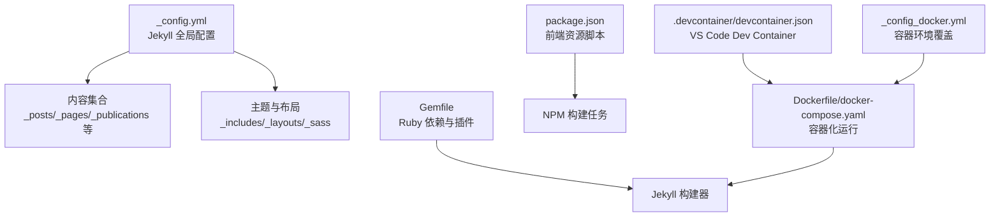
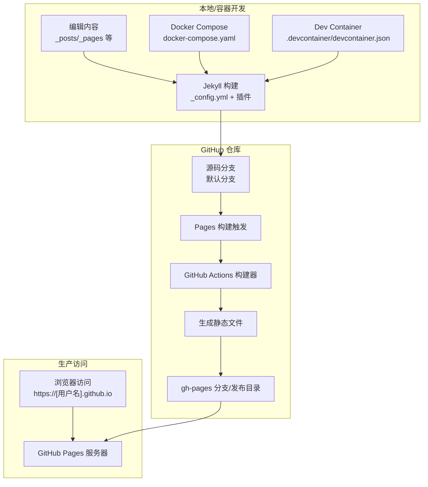
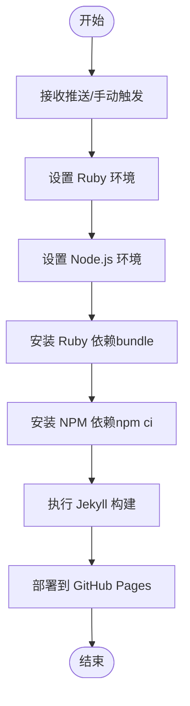
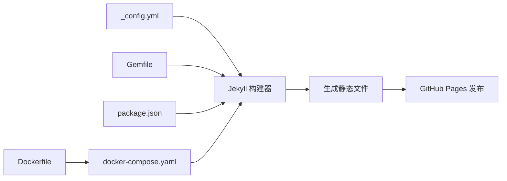

# GitHub Pages 部署

<cite>
**本文引用的文件**
- [_config.yml](file://_config.yml)
- [Gemfile](file://Gemfile)
- [README.md](file://README.md)
- [package.json](file://package.json)
- [Dockerfile](file://Dockerfile)
- [docker-compose.yaml](file://docker-compose.yaml)
- [.devcontainer/devcontainer.json](file://.devcontainer/devcontainer.json)
- [_config_docker.yml](file://_config_docker.yml)
</cite>

## 目录
1. [简介](#简介)
2. [项目结构](#项目结构)
3. [核心组件](#核心组件)
4. [架构总览](#架构总览)
5. [详细组件分析](#详细组件分析)
6. [依赖关系分析](#依赖关系分析)
7. [性能考虑](#性能考虑)
8. [故障排除指南](#故障排除指南)
9. [结论](#结论)
10. [附录](#附录)

## 简介
本指南面向希望使用 GitHub Pages 自动化部署个人或学术型网站的用户。内容覆盖 GitHub Pages 的工作原理与配置要点（仓库设置、分支管理、域名绑定）、Jekyll 核心配置（如 baseurl、url 及 GitHub Pages 特定设置）、本地开发与容器化运行方式、Gemfile 依赖与插件管理、以及如何通过 GitHub Actions 构建与部署的完整流程。同时提供常见问题排查与最佳实践建议。

## 项目结构
该仓库采用 Jekyll 主题模板组织内容，主要目录与文件职责如下：
- 根目录：站点配置、依赖定义、容器与本地开发配置
- 内容目录：_posts、_pages、_publications、_portfolio、_talks 等集合
- 资源目录：assets（样式、脚本、字体等）
- 数据目录：_data（导航、作者、评论等）
- 主题与布局：_includes、_layouts、_sass
- 开发与容器：Dockerfile、docker-compose.yaml、.devcontainer

图表来源
- [_config.yml](file://_config.yml)
- [Gemfile](file://Gemfile)
- [package.json](file://package.json)
- [Dockerfile](file://Dockerfile)
- [docker-compose.yaml](file://docker-compose.yaml)
- [.devcontainer/devcontainer.json](file://.devcontainer/devcontainer.json)
- [_config_docker.yml](file://_config_docker.yml)

章节来源
- [_config.yml](file://_config.yml)
- [Gemfile](file://Gemfile)
- [package.json](file://package.json)
- [Dockerfile](file://Dockerfile)
- [docker-compose.yaml](file://docker-compose.yaml)
- [.devcontainer/devcontainer.json](file://.devcontainer/devcontainer.json)
- [_config_docker.yml](file://_config_docker.yml)

## 核心组件
- Jekyll 全局配置：控制站点语言、标题、URL、基础路径、仓库信息、评论与统计提供商、Markdown 处理、Sass 编译、分页与归档、插件白名单等。
- 依赖与插件：通过 Gemfile 声明 Jekyll 与官方插件；github-pages gem 提供 GitHub Pages 兼容性。
- 本地与容器化开发：提供 Dockerfile、docker-compose.yaml 与 VS Code Dev Container 配置，确保一致的构建环境。
- 前端资源：package.json 定义 NPM 脚本用于压缩与监听 JS 资源。

章节来源
- [_config.yml](file://_config.yml)
- [Gemfile](file://Gemfile)
- [package.json](file://package.json)
- [Dockerfile](file://Dockerfile)
- [docker-compose.yaml](file://docker-compose.yaml)
- [.devcontainer/devcontainer.json](file://.devcontainer/devcontainer.json)
- [_config_docker.yml](file://_config_docker.yml)

## 架构总览
下图展示从内容提交到 GitHub Pages 生产环境的典型流程，以及本地/容器化预览与构建的关系。

图表来源
- [_config.yml](file://_config.yml)
- [Gemfile](file://Gemfile)
- [Dockerfile](file://Dockerfile)
- [docker-compose.yaml](file://docker-compose.yaml)
- [.devcontainer/devcontainer.json](file://.devcontainer/devcontainer.json)

## 详细组件分析

### Jekyll 配置与 GitHub Pages 设置
- 站点基础信息：站点标题、副标题分隔符、语言 locale、站点主题等。
- URL 与基础路径：url 为站点根地址，baseurl 为空表示直接部署在根路径；repository 指定仓库路径。
- 作者与社交链接：头像、姓名、生物、地点、雇主、邮箱及多个社交/学术平台链接。
- 评论与统计：支持多种评论系统与 Google Analytics（含 GA4）等。
- 内容与集合：include/exclude 控制读取范围；collections 定义 teaching/publications/portfolio/talks 等集合及其输出与永久链接。
- Markdown 与高亮：kramdown 输入模式、rouge 高亮、自动 ID、TOC 层级等。
- 插件与白名单：plugins 列表与 whitelist 保持与 GitHub Pages 兼容。
- 归档与压缩：Liquid 或插件方式的分类/标签归档；HTML 压缩插件配置。

章节来源
- [_config.yml](file://_config.yml)

### 依赖与插件管理（Gemfile）
- 使用 RubyGems 源，声明 :jekyll_plugins 组内的官方插件（如 jekyll-feed、jekyll-sitemap、jekyll-redirect-from、jemoji 等）。
- 引入 github-pages gem，确保与 GitHub Pages 运行时兼容。
- 附加依赖 connection_pool 与本地调试服务器 webrick。

章节来源
- [Gemfile](file://Gemfile)

### 前端资源与构建脚本（package.json）
- 定义 NPM 依赖（如 jQuery、fitvids、smooth-scroll、plotly.js）与开发依赖（如 uglify-js、onchange）。
- 提供压缩、监听与构建脚本，便于在本地生成压缩后的 JS 资源。

章节来源
- [package.json](file://package.json)

### 容器化与本地开发（Dockerfile、docker-compose.yaml、Dev Container）
- Dockerfile：基于 Ruby 3.2，安装 build-essential 与 nodejs，切换非 root 用户，复制 Gemfile 并安装 bundler 与依赖，以 jekyll serve 命令启动服务。
- docker-compose.yaml：映射当前目录到容器工作目录，暴露 4000 端口，使用 _config.yml 与 _config_docker.yml 合并配置。
- .devcontainer/devcontainer.json：在 VS Code 中通过 Docker Compose 启动开发容器，转发 4000 端口，设置工作区与远程用户。
- _config_docker.yml：容器环境下的 url 覆盖（空字符串），避免容器内绝对路径问题。

章节来源
- [Dockerfile](file://Dockerfile)
- [docker-compose.yaml](file://docker-compose.yaml)
- [.devcontainer/devcontainer.json](file://.devcontainer/devcontainer.json)
- [_config_docker.yml](file://_config_docker.yml)

### GitHub Actions 工作流（构建与部署）
- 仓库中未发现 .github/workflows 下的 YAML 文件，因此无法直接引用具体的工作流配置。
- 建议在仓库中添加 Pages 构建与部署工作流，以实现自动化构建与发布到 gh-pages 分支或发布目录。
- 工作流应包含以下关键步骤（概念性说明，不对应具体文件）：
  - 触发条件：push 到默认分支或手动触发
  - 设置 Ruby 与 Node.js 环境
  - 安装依赖（bundle、npm）
  - 运行 Jekyll 构建
  - 将生成的静态文件部署到 Pages 发布目标

[此图为概念性流程，不对应具体源文件，故无“图表来源”]

## 依赖关系分析
- 配置层：_config.yml 作为 Jekyll 的唯一真相来源，影响所有渲染与输出行为。
- 依赖层：Gemfile 声明 Jekyll 与官方插件，github-pages gem 提供 Pages 兼容性；package.json 管理前端资源脚本。
- 运行层：Dockerfile 与 docker-compose.yaml 提供可复现的构建与预览环境；Dev Container 适配 VS Code。
- 部署层：GitHub Pages 通过默认分支与 gh-pages 分支（或发布目录）进行发布；若无工作流，通常由 Pages 自身触发构建。

图表来源
- [_config.yml](file://_config.yml)
- [Gemfile](file://Gemfile)
- [package.json](file://package.json)
- [Dockerfile](file://Dockerfile)
- [docker-compose.yaml](file://docker-compose.yaml)

章节来源
- [_config.yml](file://_config.yml)
- [Gemfile](file://Gemfile)
- [package.json](file://package.json)
- [Dockerfile](file://Dockerfile)
- [docker-compose.yaml](file://docker-compose.yaml)

## 性能考虑
- 启用 HTML 压缩：配置中已启用 HTML 压缩插件，并忽略 development 环境，有助于减少传输体积。
- 压缩前端资源：通过 NPM 脚本对 JS 进行压缩，降低加载时间。
- 选择合适主题与插件：仅启用必要插件，避免过度渲染导致构建时间增长。
- 使用 CDN 与缓存：合理利用外部资源与浏览器缓存策略。
- 分支与发布路径：使用 gh-pages 分支或发布目录，避免不必要的重定向层级。

章节来源
- [_config.yml](file://_config.yml)
- [package.json](file://package.json)

## 故障排除指南
- 本地构建失败（权限问题）
  - 现象：安装 Gem 时出现权限错误
  - 解决：按说明将 Gem 安装到本地 vendor/bundle 路径，再执行 bundle install
  - 参考来源
    - [README.md](file://README.md)
- 本地预览端口占用或无法访问
  - 现象：端口被占用或无法打开 localhost:4000
  - 解决：确认端口占用情况，或使用容器化方式运行
  - 参考来源
    - [README.md](file://README.md)
    - [docker-compose.yaml](file://docker-compose.yaml)
- 容器内绝对路径问题
  - 现象：容器内访问路径异常
  - 解决：通过 _config_docker.yml 将 url 设为空字符串，避免容器内绝对路径
  - 参考来源
    - [_config_docker.yml](file://_config_docker.yml)
- 评论系统或统计未生效
  - 现象：评论区或统计代码未显示
  - 解决：检查 _config.yml 中评论与统计提供商配置是否正确
  - 参考来源
    - [_config.yml](file://_config.yml)
- 插件与 Pages 兼容性问题
  - 现象：本地可用但 Pages 上报错
  - 解决：核对 plugins 与 whitelist 列表，确保仅使用受支持的插件
  - 参考来源
    - [_config.yml](file://_config.yml)
    - [Gemfile](file://Gemfile)
- 未配置 GitHub Actions 导致未自动部署
  - 现象：修改后未自动发布
  - 解决：在 .github/workflows 添加 Pages 工作流，或确认 Pages 在仓库设置中已启用
  - 参考来源
    - [README.md](file://README.md)

## 结论
本项目提供了完善的本地与容器化开发环境，配合 Jekyll 配置与官方插件，能够稳定地生成静态站点。若需自动化部署，建议补充 GitHub Actions 工作流以实现从源码到 Pages 的全链路自动化。遵循本文的最佳实践与故障排除建议，可显著提升开发效率与发布可靠性。

## 附录

### GitHub Pages 工作原理与配置要点
- 仓库设置
  - 公共仓库名称格式：[用户名].github.io
  - Pages 来源：默认分支或 gh-pages 分支/发布目录
- 分支管理
  - 推荐使用默认分支编写内容，gh-pages 分支用于发布（若启用）
- 域名绑定
  - 自定义域名需在仓库设置中配置，并完成 DNS 记录
- 配置项参考
  - url：站点根地址
  - baseurl：子路径（如 /blog）
  - repository：仓库路径
  - plugins 与 whitelist：确保与 GitHub Pages 兼容

章节来源
- [_config.yml](file://_config.yml)
- [README.md](file://README.md)

### 部署流程步骤（从零到发布）
- 初始化仓库
  - 创建公共仓库，命名 [用户名].github.io
  - 将项目克隆到本地
- 本地验证
  - 安装 Ruby、Bundler、Node.js
  - 执行 bundle install 与 npm install
  - 使用 jekyll serve 预览
- 容器化运行（可选）
  - 使用 docker-compose up 在容器中运行
  - 或在 VS Code 中使用 Dev Container
- 提交与推送
  - 提交更改至默认分支
- 自动化部署（可选）
  - 在 .github/workflows 添加 Pages 工作流，实现自动构建与发布

章节来源
- [README.md](file://README.md)
- [Gemfile](file://Gemfile)
- [package.json](file://package.json)
- [Dockerfile](file://Dockerfile)
- [docker-compose.yaml](file://docker-compose.yaml)
- [.devcontainer/devcontainer.json](file://.devcontainer/devcontainer.json)

### 配置示例与最佳实践
- 配置示例（路径引用）
  - 站点基础与 URL：[_config.yml](file://_config.yml)
  - 插件与白名单：[_config.yml](file://_config.yml)
  - 依赖声明：[Gemfile](file://Gemfile)
  - 前端脚本：[package.json](file://package.json)
  - 容器化运行：[Dockerfile](file://Dockerfile)、[docker-compose.yaml](file://docker-compose.yaml)、[_config_docker.yml](file://_config_docker.yml)
- 最佳实践
  - 仅启用必要插件，保持与 github-pages 兼容
  - 使用 baseurl 时确保相对链接一致
  - 本地与容器环境使用相同配置文件合并策略
  - 通过工作流统一构建与发布，减少手工操作

章节来源
- [_config.yml](file://_config.yml)
- [Gemfile](file://Gemfile)
- [package.json](file://package.json)
- [Dockerfile](file://Dockerfile)
- [docker-compose.yaml](file://docker-compose.yaml)
- [_config_docker.yml](file://_config_docker.yml)