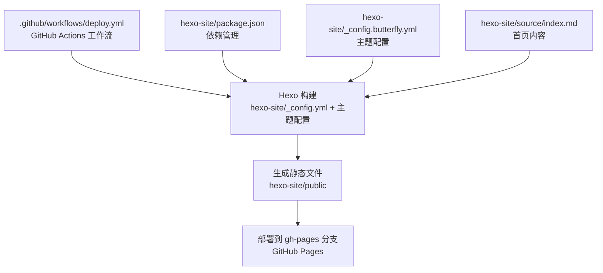
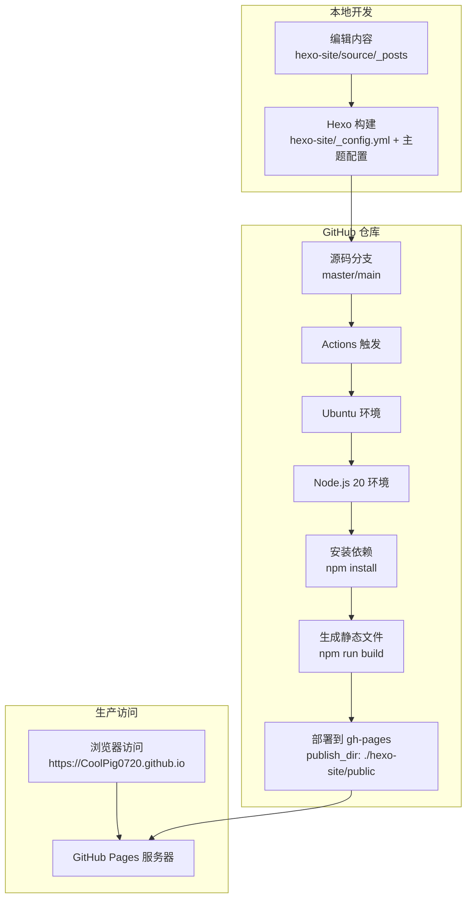
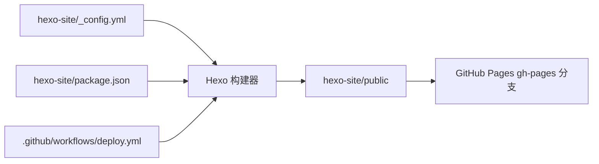

# GitHub Pages 部署

<cite>
**本文引用的文件**
- [.github/workflows/deploy.yml](file://.github/workflows/deploy.yml)
- [hexo-site/_config.yml](file://hexo-site/_config.yml)
- [hexo-site/package.json](file://hexo-site/package.json)
- [hexo-site/_config.butterfly.yml](file://hexo-site/_config.butterfly.yml)
- [hexo-site/source/index.md](file://hexo-site/source/index.md)
- [README.md](file://README.md)
</cite>

## 目录
1. [简介](#简介)
2. [项目结构](#项目结构)
3. [核心组件](#核心组件)
4. [架构总览](#架构总览)
5. [详细组件分析](#详细组件分析)
6. [依赖关系分析](#依赖关系分析)
7. [性能考虑](#性能考虑)
8. [故障排除指南](#故障排除指南)
9. [结论](#结论)
10. [附录](#附录)

## 简介
本指南面向希望使用 GitHub Pages 自动化部署个人或学术型网站的用户。内容覆盖 GitHub Pages 的工作原理与配置要点（仓库设置、分支管理、域名绑定）、Hexo 核心配置（如 URL、部署配置及 GitHub Pages 特定设置）、本地开发与容器化运行方式、GitHub Actions 构建与部署流程。同时提供常见问题排查与最佳实践建议。

## 项目结构
该仓库采用 Hexo 主题模板组织内容，主要目录与文件职责如下：
- 根目录：GitHub Actions 工作流配置
- hexo-site 目录：Hexo 站点配置、主题配置、内容源文件
- 内容目录：source/_posts、source/_data、source/about 等
- 资源目录：source/images、source/css 等
- 配置文件：_config.yml（Hexo 主配置）、_config.butterfly.yml（主题配置）

**图表来源**
- [.github/workflows/deploy.yml](file://.github/workflows/deploy.yml)
- [hexo-site/_config.yml](file://hexo-site/_config.yml)
- [hexo-site/package.json](file://hexo-site/package.json)
- [hexo-site/_config.butterfly.yml](file://hexo-site/_config.butterfly.yml)
- [hexo-site/source/index.md](file://hexo-site/source/index.md)

**章节来源**
- [.github/workflows/deploy.yml](file://.github/workflows/deploy.yml)
- [hexo-site/_config.yml](file://hexo-site/_config.yml)
- [hexo-site/package.json](file://hexo-site/package.json)
- [hexo-site/_config.butterfly.yml](file://hexo-site/_config.butterfly.yml)
- [hexo-site/source/index.md](file://hexo-site/source/index.md)

## 核心组件
- GitHub Actions 工作流：自动化触发 Hexo 构建与部署，支持 push 和手动触发
- Hexo 配置：控制站点标题、URL、部署设置、主题配置等
- 依赖管理：通过 package.json 声明 Hexo 核心依赖与主题插件
- 主题配置：Butterfly 主题的导航、样式、功能开关等配置
- 内容管理：Markdown 源文件组织，支持多语言和集合

**章节来源**
- [.github/workflows/deploy.yml](file://.github/workflows/deploy.yml)
- [hexo-site/_config.yml](file://hexo-site/_config.yml)
- [hexo-site/package.json](file://hexo-site/package.json)
- [hexo-site/_config.butterfly.yml](file://hexo-site/_config.butterfly.yml)

## 架构总览
下图展示从内容提交到 GitHub Pages 生产环境的自动化流程：

**图表来源**
- [.github/workflows/deploy.yml](file://.github/workflows/deploy.yml)
- [hexo-site/_config.yml](file://hexo-site/_config.yml)
- [hexo-site/package.json](file://hexo-site/package.json)

## 详细组件分析

### GitHub Actions 工作流配置
- 触发条件：支持 push 到 master/main 分支和手动触发 workflow_dispatch
- 运行环境：ubuntu-latest，具备 write 权限（contents、pages、id-token）
- 核心步骤：
  - Checkout 代码，fetch-depth: 0 确保完整历史
  - Setup Node.js 20 环境
  - 安装依赖：cd hexo-site && npm install
  - 生成静态文件：npm run build
  - 部署到 GitHub Pages：publish_dir 指向 hexo-site/public，publish_branch 为 gh-pages

**章节来源**
- [.github/workflows/deploy.yml](file://.github/workflows/deploy.yml)

### Hexo 配置与 GitHub Pages 设置
- 站点基础信息：title、subtitle、description、author、language
- URL 配置：url 设置为 https://CoolPig0720.github.io
- 部署配置：使用 git 类型部署，仓库地址为 https://github.com/CoolPig0720/CoolPig0720.github.io.git
- 分支设置：部署到 main 分支
- 消息格式：使用时间戳的动态消息

**章节来源**
- [hexo-site/_config.yml](file://hexo-site/_config.yml)

### 依赖与插件管理（package.json）
- Hexo 核心：hexo >= 7.0.0
- 主题：hexo-theme-butterfly >= 5.5.4
- 渲染器：hexo-renderer-marked、hexo-renderer-stylus、hexo-renderer-ejs
- 生成器：hexo-generator-archive、hexo-generator-category、hexo-generator-tag
- 功能插件：hexo-math、hexo-wordcount、hexo-feed、hexo-sitemap
- 部署工具：hexo-deployer-git

**章节来源**
- [hexo-site/package.json](file://hexo-site/package.json)

### 主题配置（Butterfly）
- 导航配置：Logo、菜单项（首页、博客、简历等）
- 社交媒体：GitHub、邮箱等链接
- 样式设置：背景色、头像、封面图
- 功能开关：暗黑模式、数学公式、Mermaid 图表
- 侧边栏：作者信息、最新文章、分类等卡片
- 分页设置：每页显示数量、分页样式

**章节来源**
- [hexo-site/_config.butterfly.yml](file://hexo-site/_config.butterfly.yml)

### 内容管理与首页配置
- 首页内容：自定义样式和布局，包含欢迎区域、介绍卡片、联系方式
- 快速导航：博客、论文、报告、教学、作品集、简历等链接
- 响应式设计：支持移动端适配
- 自定义样式：CSS 样式表定义网格布局、卡片效果、悬停动画

**章节来源**
- [hexo-site/source/index.md](file://hexo-site/source/index.md)

## 依赖关系分析
- 配置层：hexo-site/_config.yml 作为 Hexo 的唯一真相来源
- 依赖层：package.json 声明 Hexo 核心与主题依赖，确保构建兼容性
- 运行层：GitHub Actions 提供标准化构建环境
- 部署层：GitHub Pages 通过 gh-pages 分支发布静态文件

**图表来源**
- [hexo-site/_config.yml](file://hexo-site/_config.yml)
- [hexo-site/package.json](file://hexo-site/package.json)
- [.github/workflows/deploy.yml](file://.github/workflows/deploy.yml)

**章节来源**
- [hexo-site/_config.yml](file://hexo-site/_config.yml)
- [hexo-site/package.json](file://hexo-site/package.json)
- [.github/workflows/deploy.yml](file://.github/workflows/deploy.yml)

## 性能考虑
- 构建优化：使用 Node.js 20 LTS，确保更好的性能和兼容性
- 依赖精简：仅安装必要的 Hexo 插件和主题依赖
- 静态文件优化：Hexo 自动生成的静态文件直接部署，无需额外压缩
- 缓存策略：GitHub Actions 可配置 npm 缓存以加速依赖安装
- 分支管理：使用 gh-pages 分支专门存放构建产物，避免主分支污染

**章节来源**
- [.github/workflows/deploy.yml](file://.github/workflows/deploy.yml)
- [hexo-site/package.json](file://hexo-site/package.json)

## 故障排除指南
- Actions 构建失败（Node.js 版本问题）
  - 现象：npm install 或构建过程中出现版本兼容性错误
  - 解决：确保使用 Node.js 20.x 版本，检查 package.json 中的依赖版本
  - 参考来源
    - [.github/workflows/deploy.yml](file://.github/workflows/deploy.yml)
    - [hexo-site/package.json](file://hexo-site/package.json)
- 构建依赖安装失败
  - 现象：npm install 报错或依赖下载超时
  - 解决：检查网络连接，清理 node_modules 和 package-lock.json 后重新安装
  - 参考来源
    - [hexo-site/package.json](file://hexo-site/package.json)
- 部署权限不足
  - 现象：Actions 执行时报错，无法写入 gh-pages 分支
  - 解决：确认工作流权限设置，检查 GITHUB_TOKEN 权限
  - 参考来源
    - [.github/workflows/deploy.yml](file://.github/workflows/deploy.yml)
- URL 配置错误
  - 现象：部署后页面显示 404 或资源加载失败
  - 解决：检查 hexo-site/_config.yml 中的 url 配置，确保与 GitHub Pages 域名匹配
  - 参考来源
    - [hexo-site/_config.yml](file://hexo-site/_config.yml)
- 主题配置问题
  - 现象：页面样式异常或功能不生效
  - 解决：检查 hexo-site/_config.butterfly.yml 配置，确认主题版本兼容性
  - 参考来源
    - [hexo-site/_config.butterfly.yml](file://hexo-site/_config.butterfly.yml)
- 内容渲染问题
  - 现象：Markdown 内容显示异常
  - 解决：检查 hexo-site/source/ 目录下的 Markdown 文件格式和 Front Matter
  - 参考来源
    - [hexo-site/source/index.md](file://hexo-site/source/index.md)

## 结论
本项目提供了完整的 Hexo + GitHub Pages 自动化部署方案。通过 GitHub Actions 工作流实现了从代码提交到静态文件部署的全自动化流程。项目采用 Hexo + Butterfly 主题组合，提供了良好的用户体验和功能完整性。建议遵循本文的最佳实践，定期更新依赖版本，优化构建性能，确保部署流程的稳定性和可靠性。

## 附录

### GitHub Pages 工作原理与配置要点
- 仓库设置
  - 公共仓库名称格式：[用户名].github.io
  - Pages 来源：gh-pages 分支
- 分支管理
  - 源码在 master/main 分支，构建产物在 gh-pages 分支
- 域名绑定
  - 自定义域名需在仓库设置中配置，并完成 DNS 记录
- 配置项参考
  - url：站点根地址
  - deploy.type：部署类型（git）
  - deploy.repo：部署仓库地址
  - deploy.branch：部署分支

**章节来源**
- [hexo-site/_config.yml](file://hexo-site/_config.yml)
- [README.md](file://README.md)

### 部署流程步骤（从零到发布）
- 初始化仓库
  - 创建公共仓库，命名 [用户名].github.io
  - 将项目克隆到本地
- 本地验证
  - 安装 Node.js 20.x
  - 在 hexo-site 目录执行 npm install
  - 使用 npm run server 预览
- 提交与推送
  - 提交更改至 master/main 分支
- 自动化部署
  - Actions 工作流自动触发
  - 构建完成后部署到 gh-pages 分支

**章节来源**
- [README.md](file://README.md)
- [.github/workflows/deploy.yml](file://.github/workflows/deploy.yml)
- [hexo-site/package.json](file://hexo-site/package.json)

### 配置示例与最佳实践
- 配置示例（路径引用）
  - 工作流配置：[.github/workflows/deploy.yml](file://.github/workflows/deploy.yml)
  - Hexo 主配置：[hexo-site/_config.yml](file://hexo-site/_config.yml)
  - 主题配置：[hexo-site/_config.butterfly.yml](file://hexo-site/_config.butterfly.yml)
  - 依赖声明：[hexo-site/package.json](file://hexo-site/package.json)
  - 首页内容：[hexo-site/source/index.md](file://hexo-site/source/index.md)
- 最佳实践
  - 使用 Node.js 20 LTS 确保构建稳定性
  - 仅安装必要插件，保持依赖最小化
  - 定期更新主题和插件版本
  - 在 Actions 中配置适当的缓存策略
  - 使用 gh-pages 分支专门存放构建产物
  - 配置合适的错误处理和通知机制

**章节来源**
- [.github/workflows/deploy.yml](file://.github/workflows/deploy.yml)
- [hexo-site/_config.yml](file://hexo-site/_config.yml)
- [hexo-site/_config.butterfly.yml](file://hexo-site/_config.butterfly.yml)
- [hexo-site/package.json](file://hexo-site/package.json)
- [hexo-site/source/index.md](file://hexo-site/source/index.md)