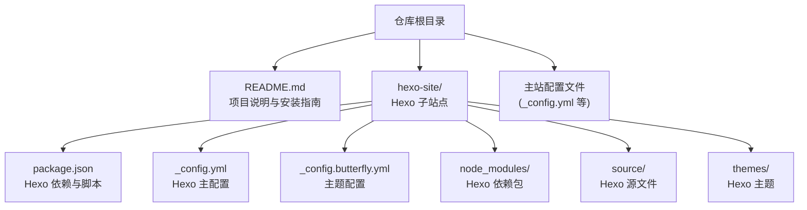
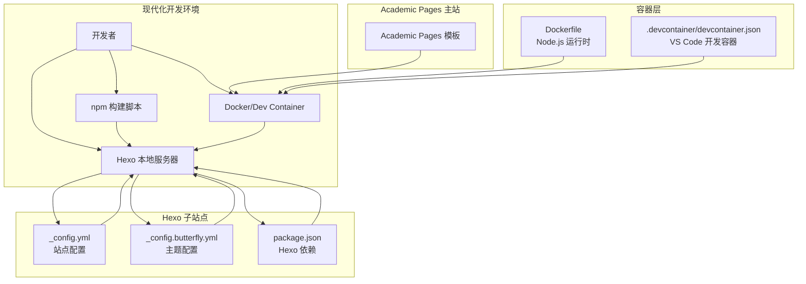
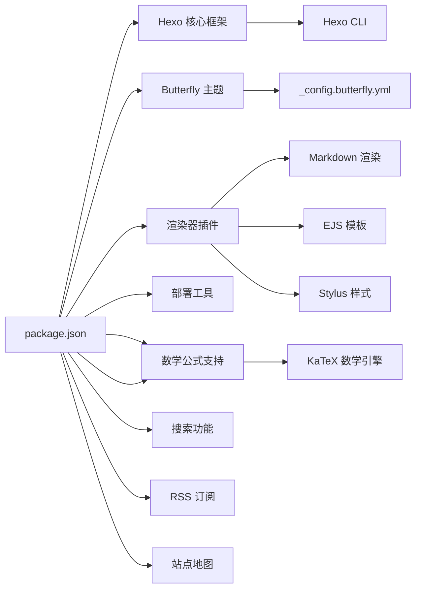

# 本地开发环境维护

<cite>
**本文引用的文件**
- [README.md](file://README.md)
- [hexo-site/package.json](file://hexo-site/package.json)
- [hexo-site/_config.yml](file://hexo-site/_config.yml)
- [hexo-site/_config.butterfly.yml](file://hexo-site/_config.butterfly.yml)
</cite>

## 更新摘要
**所做更改**
- 更新了开发环境从 Ruby/Bundler 到 Node.js/npm 的迁移说明
- 新增了 Hexo 子站点的完整配置和使用指南
- 更新了本地服务器启动和开发命令
- 修订了依赖管理和工具链配置
- 增强了容器化开发环境的说明

## 目录
1. [简介](#简介)
2. [项目结构](#项目结构)
3. [核心组件](#核心组件)
4. [架构总览](#架构总览)
5. [详细组件分析](#详细组件分析)
6. [依赖关系分析](#依赖关系分析)
7. [性能考虑](#性能考虑)
8. [故障排查指南](#故障排查指南)
9. [结论](#结论)
10. [附录](#附录)

## 简介
本指南面向需要在本地维护与运行该学术个人网站项目的开发者，涵盖从传统 Ruby/Jekyll 环境向现代 Node.js/npm 工具链的迁移过程。项目采用双站点架构：主站基于 Academic Pages 模板，同时包含一个独立的 Hexo 子站点用于并行内容管理。文档详细说明了 Node.js/npm 开发环境的安装配置、package.json 依赖管理、本地服务器启动与热重载、配置文件版本管理与环境差异处理，以及容器化开发的最佳实践。

## 项目结构
该项目采用现代化的双站点架构，主站基于 Academic Pages 模板，同时包含一个功能完整的 Hexo 子站点。根目录包含主站配置和文档，hexo-site 目录提供独立的 Hexo 站点，包含完整的主题配置、依赖管理和构建脚本。

**图表来源**
- [README.md](file://README.md)
- [hexo-site/package.json](file://hexo-site/package.json)
- [hexo-site/_config.yml](file://hexo-site/_config.yml)
- [hexo-site/_config.butterfly.yml](file://hexo-site/_config.butterfly.yml)

**章节来源**
- [README.md](file://README.md)
- [hexo-site/package.json](file://hexo-site/package.json)
- [hexo-site/_config.yml](file://hexo-site/_config.yml)
- [hexo-site/_config.butterfly.yml](file://hexo-site/_config.butterfly.yml)

## 核心组件
- **Node.js 与 npm 生态**：完全基于 Node.js 的现代化开发工具链，包括 Hexo 静态站点生成器、主题系统和构建工具。
- **Hexo 子站点**：独立的功能完整站点，包含主题配置、插件管理和部署脚本，支持多语言和丰富的功能特性。
- **Academic Pages 主站**：基于 Jekyll 的学术个人网站模板，提供专业的学术展示界面。
- **容器化开发环境**：通过 Docker 和 VS Code Dev Container 提供一致化的本地开发体验。

**章节来源**
- [hexo-site/package.json](file://hexo-site/package.json)
- [hexo-site/_config.yml](file://hexo-site/_config.yml)
- [hexo-site/_config.butterfly.yml](file://hexo-site/_config.butterfly.yml)
- [README.md](file://README.md)

## 架构总览
下图展示现代化开发环境的组件交互关系，重点体现从 Ruby/Bundler 到 Node.js/npm 的迁移：

**图表来源**
- [hexo-site/package.json](file://hexo-site/package.json)
- [hexo-site/_config.yml](file://hexo-site/_config.yml)
- [hexo-site/_config.butterfly.yml](file://hexo-site/_config.butterfly.yml)
- [README.md](file://README.md)

## 详细组件分析

### Node.js 与 npm 开发环境迁移
**更新** 项目已完全迁移到 Node.js/npm 生态系统，移除了对 Ruby 和 Bundler 的依赖。

- **Node.js 版本要求**
  - 建议使用 Node.js 16.x 或更高版本
  - 确保 npm 版本为 8.x 或更高
  - 支持 Windows、macOS 和 Linux 系统

- **依赖管理策略**
  - 使用 package.json 管理所有项目依赖
  - Hexo 依赖包括核心框架、主题、渲染器和部署工具
  - 通过 npm ci 实现确定性的依赖安装

- **开发工具链**
  - Hexo CLI 提供完整的站点管理功能
  - 支持多语言国际化（zh-CN、en-US 等）
  - 内置数学公式支持（MathJax）

**章节来源**
- [hexo-site/package.json](file://hexo-site/package.json)
- [README.md](file://README.md)

### Hexo 子站点配置与管理
**新增** 完整的 Hexo 子站点配置指南，替代原有的 Jekyll 配置。

- **Hexo 核心配置**
  - 站点基本信息：标题、副标题、描述、关键词
  - URL 设置：GitHub Pages 部署配置
  - 写作设置：文章链接格式、分页配置
  - 主题选择：Butterfly 主题配置

- **主题定制配置**
  - 导航栏配置：Logo、菜单项、社交媒体链接
  - 侧边栏设置：作者信息、最新文章、分类统计
  - 功能开关：暗色模式、数学公式、Mermaid 图表
  - 样式定制：CSS 注入、响应式设计

- **部署配置**
  - GitHub Pages 自动部署
  - Git 部署配置
  - 多分支支持

**章节来源**
- [hexo-site/_config.yml](file://hexo-site/_config.yml)
- [hexo-site/_config.butterfly.yml](file://hexo-site/_config.butterfly.yml)

### 本地服务器启动与开发工作流
**更新** 本地开发命令已从 Jekyll 迁移到 Hexo。

- **基础开发命令**
  - `npm install` - 安装所有依赖
  - `npm run server` - 启动本地服务器（默认端口 4000）
  - `npm run build` - 生成静态站点
  - `npm run deploy` - 部署到 GitHub Pages

- **开发服务器特性**
  - 自动热重载，文件变更即时刷新
  - 支持实时预览和增量构建
  - 错误提示和调试信息
  - 支持多环境配置

- **容器化开发**
  - Dockerfile 提供标准化 Node.js 环境
  - VS Code Dev Container 支持一键开发环境
  - 端口映射和文件同步配置

**章节来源**
- [hexo-site/package.json](file://hexo-site/package.json)
- [README.md](file://README.md)

### 配置文件管理与环境差异处理
**更新** 配置文件结构已完全重构，采用 Hexo 的标准配置方式。

- **多层配置体系**
  - 主配置文件：站点基本信息和全局设置
  - 主题配置：Butterfly 主题的详细定制
  - 环境配置：开发、测试、生产环境的差异化设置

- **配置继承机制**
  - 主配置文件作为基础设置
  - 主题配置覆盖默认主题行为
  - 环境变量支持动态配置
  - 配置文件优先级和合并规则

- **国际化支持**
  - 多语言配置文件
  - 自动语言检测和切换
  - 国际化内容管理

**章节来源**
- [hexo-site/_config.yml](file://hexo-site/_config.yml)
- [hexo-site/_config.butterfly.yml](file://hexo-site/_config.butterfly.yml)

### 开发工具链优化建议
**更新** 工具链已完全基于 Node.js 生态系统。

- **Node.js 环境优化**
  - 使用 nvm 管理 Node.js 版本
  - npm 镜像源配置加速依赖下载
  - yarn 或 pnpm 替代方案（可选）
  - 依赖安全扫描和漏洞检测

- **Hexo 开发优化**
  - 插件管理最佳实践
  - 主题开发和定制技巧
  - 性能优化和缓存策略
  - SEO 和元数据管理

- **开发环境配置**
  - VS Code 扩展推荐
  - Git 工作流程集成
  - CI/CD 自动化配置
  - 文档生成和发布流程

**章节来源**
- [hexo-site/package.json](file://hexo-site/package.json)
- [README.md](file://README.md)

## 依赖关系分析
**更新** 依赖关系已完全重构为 Node.js 生态系统。

**图表来源**
- [hexo-site/package.json](file://hexo-site/package.json)
- [hexo-site/_config.butterfly.yml](file://hexo-site/_config.butterfly.yml)

**章节来源**
- [hexo-site/package.json](file://hexo-site/package.json)
- [hexo-site/_config.yml](file://hexo-site/_config.yml)

## 性能考虑
**更新** 性能优化策略已适应 Node.js 生态系统。

- **构建性能优化**
  - Hexo 增量构建和缓存机制
  - 主题资源压缩和合并
  - 静态资源 CDN 加速
  - 预渲染和懒加载策略

- **运行时性能**
  - Node.js 性能监控和调优
  - 内存使用优化
  - 并发处理和异步优化
  - 服务器端渲染优化

- **开发体验优化**
  - 热重载和实时预览
  - 开发服务器性能调优
  - 错误处理和日志记录
  - 开发工具集成

## 故障排查指南
**更新** 故障排查已针对 Node.js 环境进行优化。

- **Node.js 环境问题**
  - 版本兼容性问题：检查 Node.js 和 npm 版本要求
  - 权限问题：使用 nvm 管理 Node.js 版本，避免系统权限问题
  - 网络问题：配置 npm 镜像源，加速依赖下载
  - 磁盘空间：清理 node_modules 和缓存文件

- **Hexo 构建问题**
  - 依赖安装失败：使用 npm ci 或清理缓存后重试
  - 主题配置错误：检查 _config.butterfly.yml 语法
  - 插件冲突：逐个禁用插件定位冲突源
  - 资源加载失败：检查文件路径和权限设置

- **开发服务器问题**
  - 端口占用：修改端口号或停止占用进程
  - 热重载失效：检查文件监听和配置设置
  - 内存溢出：增加 Node.js 内存限制
  - 性能问题：启用生产模式或优化配置

- **容器化问题**
  - 镜像构建失败：检查 Dockerfile 和网络连接
  - 端口映射问题：确认端口配置和防火墙设置
  - 文件同步问题：检查卷挂载和权限设置
  - 环境变量问题：验证配置文件和环境变量

**章节来源**
- [README.md](file://README.md)
- [hexo-site/package.json](file://hexo-site/package.json)

## 结论
通过从 Ruby/Bundler 向 Node.js/npm 的完全迁移，本项目实现了现代化、高性能、易维护的开发环境。Hexo 子站点提供了完整的功能特性和灵活的主题定制能力，而 Academic Pages 主站保持了专业的学术展示效果。容器化开发环境确保了跨平台的一致性，配合完善的工具链和优化策略，为开发者提供了高效的本地开发体验。

## 附录

### 本地服务器启动步骤（Node.js 版本）
**更新** 启动步骤已完全适配 Node.js 环境。

- **基础环境准备**
  1. 安装 Node.js 16.x 或更高版本
  2. 验证 npm 版本（建议 8.x+）
  3. 确保网络连接正常

- **项目初始化**
  1. 克隆仓库到本地
  2. 进入 hexo-site 目录
  3. 运行 `npm install` 安装依赖
  4. 运行 `npm run server` 启动开发服务器

- **开发工作流程**
  1. 修改内容文件（Markdown）
  2. 保存文件查看实时预览
  3. 使用 `npm run build` 生成静态站点
  4. 使用 `npm run deploy` 部署到 GitHub Pages

**章节来源**
- [README.md](file://README.md)
- [hexo-site/package.json](file://hexo-site/package.json)

### 配置文件管理最佳实践
**更新** 配置管理策略已适应 Hexo 生态。

- **配置文件组织**
  - 主配置文件：站点基本信息和全局设置
  - 主题配置：主题特定的详细配置
  - 环境配置：不同环境的差异化设置
  - 国际化配置：多语言支持文件

- **配置管理策略**
  - 使用环境变量管理敏感信息
  - 配置文件版本控制和备份
  - 配置变更的测试和验证
  - 配置文档和注释维护

**章节来源**
- [hexo-site/_config.yml](file://hexo-site/_config.yml)
- [hexo-site/_config.butterfly.yml](file://hexo-site/_config.butterfly.yml)

### 开发工具链优化建议（Node.js 版本）
**更新** 工具链优化已完全基于 Node.js 生态。

- **Node.js 环境管理**
  - 使用 nvm 管理多个 Node.js 版本
  - 配置 npm 镜像源提高下载速度
  - 使用 pnpm 或 yarn 作为替代包管理器
  - 定期更新依赖和安全扫描

- **Hexo 开发优化**
  - 插件选择和配置最佳实践
  - 主题开发和定制技巧
  - 性能监控和优化策略
  - SEO 和元数据管理

**章节来源**
- [hexo-site/package.json](file://hexo-site/package.json)
- [README.md](file://README.md)

### 环境备份与迁移指南（Node.js 版本）
**更新** 迁移策略已完全适配 Node.js 环境。

- **备份内容**
  - 代码和配置：package.json、配置文件、主题文件
  - 内容数据：Markdown 源文件、媒体资源
  - 开发环境：Node.js 版本、npm 配置
  - 部署配置：GitHub Pages 设置、CI/CD 配置

- **迁移步骤**
  1. 安装 Node.js 和 npm 环境
  2. 克隆仓库到新环境
  3. 运行 `npm install` 安装依赖
  4. 运行 `npm run server` 验证开发环境
  5. 配置 GitHub Pages 部署
  6. 测试完整功能和性能

**章节来源**
- [README.md](file://README.md)
- [hexo-site/package.json](file://hexo-site/package.json)