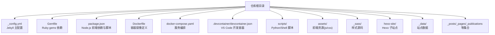
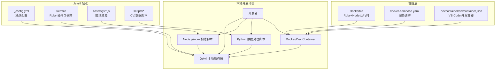
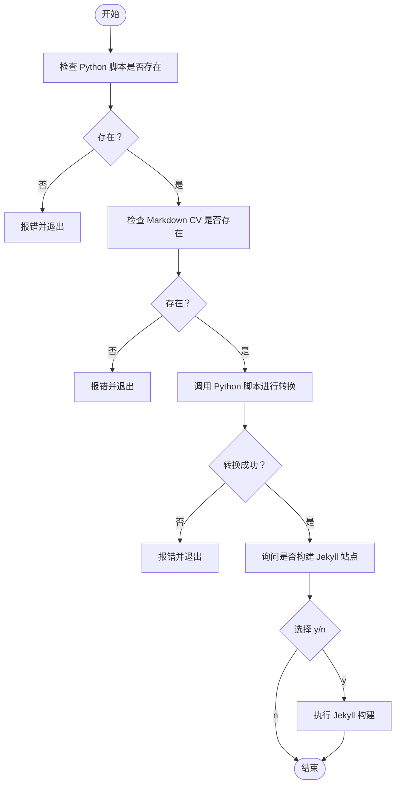
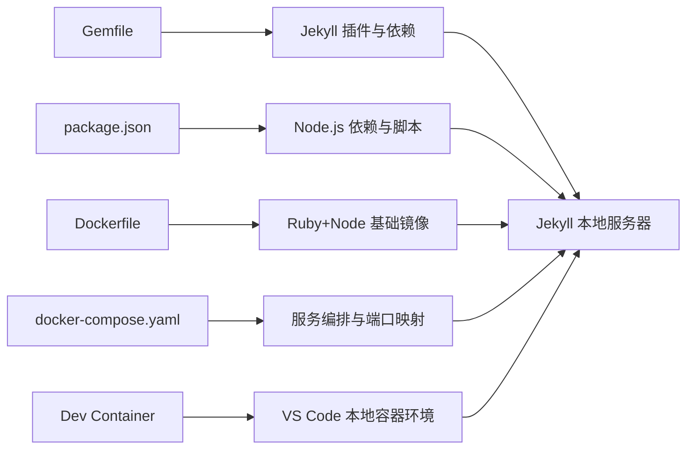

# 本地开发环境维护

<cite>
**本文引用的文件**
- [Gemfile](file://Gemfile)
- [_config.yml](file://_config.yml)
- [package.json](file://package.json)
- [Dockerfile](file://Dockerfile)
- [docker-compose.yaml](file://docker-compose.yaml)
- [.devcontainer/devcontainer.json](file://.devcontainer/devcontainer.json)
- [README.md](file://README.md)
- [scripts/update_cv_json.sh](file://scripts/update_cv_json.sh)
- [scripts/cv_markdown_to_json.py](file://scripts/cv_markdown_to_json.py)
- [_config_docker.yml](file://_config_docker.yml)
- [hexo-site/_config.yml](file://hexo-site/_config.yml)
- [hexo-site/package.json](file://hexo-site/package.json)
- [markdown_generator/README.md](file://markdown_generator/README.md)
</cite>

## 目录
1. [简介](#简介)
2. [项目结构](#项目结构)
3. [核心组件](#核心组件)
4. [架构总览](#架构总览)
5. [详细组件分析](#详细组件分析)
6. [依赖关系分析](#依赖关系分析)
7. [性能考虑](#性能考虑)
8. [故障排查指南](#故障排查指南)
9. [结论](#结论)
10. [附录](#附录)

## 简介
本指南面向需要在本地维护与运行该 Jekyll 博客项目的开发者，涵盖 Ruby/Jekyll 安装与配置、Gemfile 依赖管理、Node.js/npm 前端资源处理、本地服务器启动与热重载、配置文件版本管理与环境差异、Python 数据处理脚本使用、开发工具链优化建议，以及常见问题排查与环境备份迁移策略。

## 项目结构
该项目采用 Jekyll 静态站点生成器作为主站，同时包含一个独立的 Hexo 子站点目录，用于并行或对比性内容管理。根目录下包含主题与布局模板、数据文件、页面集合、Sass 样式、前端 JS 资源等；另有 Python 脚本与 Jupyter Notebook 工具用于从结构化数据生成 Markdown 内容；Docker 与 VS Code Dev Container 提供一致化的本地运行环境。

图表来源
- [_config.yml](file://_config.yml)
- [Gemfile](file://Gemfile)
- [package.json](file://package.json)
- [Dockerfile](file://Dockerfile)
- [docker-compose.yaml](file://docker-compose.yaml)
- [.devcontainer/devcontainer.json](file://.devcontainer/devcontainer.json)
- [scripts/update_cv_json.sh](file://scripts/update_cv_json.sh)
- [scripts/cv_markdown_to_json.py](file://scripts/cv_markdown_to_json.py)
- [hexo-site/_config.yml](file://hexo-site/_config.yml)

章节来源
- [README.md](file://README.md)
- [_config.yml](file://_config.yml)
- [Gemfile](file://Gemfile)
- [package.json](file://package.json)
- [Dockerfile](file://Dockerfile)
- [docker-compose.yaml](file://docker-compose.yaml)
- [.devcontainer/devcontainer.json](file://.devcontainer/devcontainer.json)
- [scripts/update_cv_json.sh](file://scripts/update_cv_json.sh)
- [scripts/cv_markdown_to_json.py](file://scripts/cv_markdown_to_json.py)
- [hexo-site/_config.yml](file://hexo-site/_config.yml)

## 核心组件
- Ruby 与 Jekyll：通过 Gemfile 声明核心插件与依赖，Jekyll 主配置集中管理站点元信息、集合、插件白名单、Sass 输出风格、压缩策略等。
- Node.js 与 npm：前端资源打包与监听，提供 JS 压缩与变更监听脚本，便于本地开发时自动构建。
- Docker 与 VS Code Dev Container：提供可复现的本地运行环境，统一 Ruby、Node.js 版本与系统依赖。
- Python 脚本：将 Markdown CV 转换为 JSON，读取 Jekyll 配置与集合数据，生成前端可用的 JSON 结构。
- Hexo 子站点：独立的 Hexo 站点配置与依赖，便于对比或并行维护。

章节来源
- [_config.yml](file://_config.yml)
- [Gemfile](file://Gemfile)
- [package.json](file://package.json)
- [Dockerfile](file://Dockerfile)
- [docker-compose.yaml](file://docker-compose.yaml)
- [scripts/cv_markdown_to_json.py](file://scripts/cv_markdown_to_json.py)
- [hexo-site/_config.yml](file://hexo-site/_config.yml)

## 架构总览
下图展示本地开发时各组件之间的交互关系与职责边界：

图表来源
- [_config.yml](file://_config.yml)
- [Gemfile](file://Gemfile)
- [package.json](file://package.json)
- [Dockerfile](file://Dockerfile)
- [docker-compose.yaml](file://docker-compose.yaml)
- [.devcontainer/devcontainer.json](file://.devcontainer/devcontainer.json)
- [scripts/update_cv_json.sh](file://scripts/update_cv_json.sh)
- [scripts/cv_markdown_to_json.py](file://scripts/cv_markdown_to_json.py)

## 详细组件分析

### Ruby 与 Jekyll 安装与配置
- Ruby 版本与 Bundler
  - 使用 Ruby 3.2 基础镜像，安装必要系统依赖（如 Node.js），以确保 Jekyll 与插件正常运行。
  - 在本地环境中，推荐通过系统包管理器安装 Ruby、Bundler 与 Node.js。
- Gemfile 依赖管理
  - 插件组包含 jekyll、jekyll-feed、jekyll-sitemap、jekyll-redirect-from、jemoji 与指定版本的 webrick。
  - 顶层声明 github-pages 与 connection_pool 指定版本，保证与 GitHub Pages 兼容。
- Jekyll 配置
  - 主配置集中管理站点元信息、作者信息、社交链接、SEO、评论与分析提供商、集合类型、默认值、Sass 编译选项、插件白名单与压缩策略等。
  - Docker 环境下通过额外配置文件覆盖部分 URL 设置，避免容器内路径问题。

章节来源
- [Dockerfile](file://Dockerfile)
- [Gemfile](file://Gemfile)
- [_config.yml](file://_config.yml)
- [_config_docker.yml](file://_config_docker.yml)

### Node.js 与 npm 前端资源处理
- 依赖与脚本
  - 前端依赖包括 jQuery、FitVids、Smooth Scroll、Plotly 等，用于增强页面交互与可视化。
  - 开发依赖包含 onChange 与 UglifyJS，提供 JS 变更监听与压缩合并能力。
  - npm scripts 提供 JS 压缩、监听与构建命令，便于本地增量构建。
- 构建流程
  - 监听 assets/js 下的变更，自动触发构建，输出压缩后的 main.min.js。
  - 建议在本地开发时先执行依赖安装，再运行监听脚本以获得热更新体验。

章节来源
- [package.json](file://package.json)

### 本地服务器启动与配置
- 直接运行 Jekyll
  - 使用 bundle exec jekyll serve 启动本地服务器，默认监听 localhost:4000，支持热重载与增量重建。
  - 修改配置文件与核心模板后需重启服务器以生效。
- Docker/Dev Container
  - 通过 docker-compose 构建镜像并挂载工作目录，映射 4000 端口，设置非 root 用户与环境变量。
  - VS Code Dev Container 可直接在容器中打开项目，自动转发端口并提供一致的开发体验。

章节来源
- [README.md](file://README.md)
- [Dockerfile](file://Dockerfile)
- [docker-compose.yaml](file://docker-compose.yaml)
- [.devcontainer/devcontainer.json](file://.devcontainer/devcontainer.json)

### 配置文件版本管理与环境差异
- 多配置文件策略
  - 主配置文件集中管理站点行为；Docker 环境通过额外配置文件覆盖特定项（如 URL），避免容器内路径问题。
  - 建议在不同环境（本地/容器/Docker Compose）分别维护最小差异配置，集中于主配置文件的默认值与插件白名单。
- 环境变量与用户权限
  - 容器内使用非 root 用户与固定 UID/GID，避免权限问题。
  - VS Code Dev Container 支持远程用户与端口转发，提升协作一致性。

章节来源
- [_config.yml](file://_config.yml)
- [_config_docker.yml](file://_config_docker.yml)
- [Dockerfile](file://Dockerfile)
- [docker-compose.yaml](file://docker-compose.yaml)
- [.devcontainer/devcontainer.json](file://.devcontainer/devcontainer.json)

### Python 脚本使用与数据处理流程
- 脚本职责
  - 将 Markdown CV 转换为 JSON，读取 Jekyll 配置与集合数据（如 publications、talks、teaching、portfolio），生成前端可用的 JSON 结构。
  - 提供 Shell 脚本封装，检查输入文件、调用 Python 脚本并可选地触发 Jekyll 构建。
- 数据来源与输出
  - 输入：Markdown CV 文件、Jekyll 配置文件。
  - 输出：_data/cv.json，供页面模板渲染使用。
- 运行方式
  - 通过 Shell 脚本执行，内部调用 Python 脚本完成转换；也可直接运行 Python 脚本并传入参数。

图表来源
- [scripts/update_cv_json.sh](file://scripts/update_cv_json.sh)
- [scripts/cv_markdown_to_json.py](file://scripts/cv_markdown_to_json.py)

章节来源
- [scripts/update_cv_json.sh](file://scripts/update_cv_json.sh)
- [scripts/cv_markdown_to_json.py](file://scripts/cv_markdown_to_json.py)

### 开发工具链配置与优化建议
- Ruby 生态
  - 推荐使用本地 Gem 本地安装路径，避免权限问题；若遇到权限错误，可通过 Bundler 配置本地路径后重试。
  - 安装系统构建工具（如 build-essential、gcc、make）以满足本地编译需求。
- Node.js 生态
  - 安装 Node.js 与 npm 后，先执行依赖安装，再启用 JS 监听脚本以获得热更新。
  - 若构建失败，优先检查依赖版本与 Node 版本范围要求。
- 容器化开发
  - 使用 Docker 与 Dev Container 统一环境，减少“在我机器上能跑”的差异。
  - 如遇权限问题，确认容器内用户 UID/GID 与宿主机一致。

章节来源
- [README.md](file://README.md)
- [Dockerfile](file://Dockerfile)
- [docker-compose.yaml](file://docker-compose.yaml)
- [.devcontainer/devcontainer.json](file://.devcontainer/devcontainer.json)

### Hexo 子站点（可选）
- 配置与依赖
  - Hexo 站点拥有独立的配置文件与依赖列表，包含主题、渲染器、生成器与部署相关插件。
  - 可通过 npm scripts 执行构建、清理、服务器与部署任务。
- 与 Jekyll 的关系
  - Hexo 子站点与 Jekyll 主站并行存在，适合对比或并行维护，注意不要混淆两者的构建与部署流程。

章节来源
- [hexo-site/_config.yml](file://hexo-site/_config.yml)
- [hexo-site/package.json](file://hexo-site/package.json)

## 依赖关系分析
- Ruby/Jekyll 插件生态
  - 插件组与顶层依赖共同构成 GitHub Pages 兼容的 Jekyll 环境，确保本地与线上行为一致。
- Node.js 前端生态
  - 前端依赖与开发依赖分离，构建脚本与监听脚本协同工作，实现本地快速迭代。
- 容器化依赖
  - Dockerfile 明确 Ruby 与 Node.js 的基础镜像与系统依赖，docker-compose 提供服务编排与端口映射，Dev Container 提升 VS Code 协作体验。

图表来源
- [Gemfile](file://Gemfile)
- [package.json](file://package.json)
- [Dockerfile](file://Dockerfile)
- [docker-compose.yaml](file://docker-compose.yaml)
- [.devcontainer/devcontainer.json](file://.devcontainer/devcontainer.json)

章节来源
- [Gemfile](file://Gemfile)
- [package.json](file://package.json)
- [Dockerfile](file://Dockerfile)
- [docker-compose.yaml](file://docker-compose.yaml)
- [.devcontainer/devcontainer.json](file://.devcontainer/devcontainer.json)

## 性能考虑
- 构建与增量更新
  - Jekyll 默认增量构建关闭，建议在大型站点中谨慎开启以平衡速度与稳定性。
  - 前端资源通过监听脚本按需压缩，避免不必要的全量构建。
- 资源压缩
  - 主配置中的 HTML 压缩插件仅在生产环境生效，开发环境保持可读性与调试便利。
- 容器性能
  - 使用非 root 用户与固定 UID/GID，减少权限检查开销；合理挂载工作目录，避免频繁写盘。

章节来源
- [_config.yml](file://_config.yml)
- [package.json](file://package.json)
- [Dockerfile](file://Dockerfile)

## 故障排查指南
- Ruby 权限错误
  - 症状：安装 Gems 时报权限错误或无法写入系统目录。
  - 解决：配置 Bundler 本地安装路径后重试，或使用容器化环境避免权限问题。
- Bundler 安装失败
  - 症状：安装依赖失败或版本冲突。
  - 解决：删除锁定文件后重试，或在容器中重新安装。
- Node.js 构建失败
  - 症状：监听脚本或压缩失败。
  - 解决：检查 Node 版本范围与依赖完整性，确保依赖已安装且路径正确。
- 容器端口占用
  - 症状：无法访问本地 4000 端口。
  - 解决：确认端口未被占用，或调整映射端口；检查 docker-compose 与 Dev Container 的端口转发配置。
- 配置文件未生效
  - 症状：修改配置后需重启服务器才生效。
  - 解决：遵循 Jekyll 的配置热重载限制，修改核心配置后手动重启。

章节来源
- [README.md](file://README.md)
- [Dockerfile](file://Dockerfile)
- [docker-compose.yaml](file://docker-compose.yaml)
- [.devcontainer/devcontainer.json](file://.devcontainer/devcontainer.json)

## 结论
通过统一的 Ruby/Jekyll、Node.js/npm 与 Docker/Dev Container 工具链，本项目实现了可复现、可协作、易维护的本地开发环境。配合 Python 数据处理脚本与 Hexo 子站点，开发者可以在多维度上高效组织内容与样式。建议在团队协作中坚持最小差异配置、容器化统一环境与自动化脚本，持续提升开发效率与一致性。

## 附录

### 本地服务器启动步骤（摘要）
- 直接运行
  - 安装 Ruby、Bundler、Node.js；执行依赖安装；启动本地服务器并启用热重载。
- Docker/Dev Container
  - 构建镜像并启动服务，或在 VS Code 中打开 Dev Container 并启动本地服务器。

章节来源
- [README.md](file://README.md)
- [Dockerfile](file://Dockerfile)
- [docker-compose.yaml](file://docker-compose.yaml)
- [.devcontainer/devcontainer.json](file://.devcontainer/devcontainer.json)

### 配置文件与环境差异（摘要）
- 主配置文件集中管理站点行为与插件白名单。
- Docker 环境通过额外配置文件覆盖特定项，避免容器内路径问题。
- 建议在不同环境维护最小差异配置，集中于主配置文件的默认值与插件白名单。

章节来源
- [_config.yml](file://_config.yml)
- [_config_docker.yml](file://_config_docker.yml)

### Python 数据处理脚本使用（摘要）
- Shell 脚本负责检查输入文件、调用 Python 脚本并可选触发 Jekyll 构建。
- Python 脚本解析 Markdown CV 与 Jekyll 配置，提取作者信息与集合数据，输出 JSON。

章节来源
- [scripts/update_cv_json.sh](file://scripts/update_cv_json.sh)
- [scripts/cv_markdown_to_json.py](file://scripts/cv_markdown_to_json.py)

### 开发工具链优化建议（摘要）
- Ruby：使用本地安装路径避免权限问题；安装系统构建工具。
- Node.js：安装依赖后启用监听脚本；关注 Node 版本范围。
- 容器：统一镜像与用户权限；确保端口转发与工作目录挂载正确。

章节来源
- [README.md](file://README.md)
- [Dockerfile](file://Dockerfile)
- [docker-compose.yaml](file://docker-compose.yaml)
- [.devcontainer/devcontainer.json](file://.devcontainer/devcontainer.json)

### 环境备份与迁移指南（建议）
- 备份内容
  - 代码与配置：主配置文件、Gemfile、package.json、Dockerfile/docker-compose.yaml、Dev Container 配置。
  - 数据与脚本：Python/Shell 脚本、数据文件（如 _data/cv.json）、集合内容（_posts/_publications 等）。
- 迁移步骤
  - 在新环境安装 Ruby、Bundler、Node.js。
  - 安装依赖并启动本地服务器；如需容器化，构建镜像并启动服务。
  - 运行数据处理脚本生成 JSON；验证前端资源构建与热重载。

章节来源
- [README.md](file://README.md)
- [Gemfile](file://Gemfile)
- [package.json](file://package.json)
- [Dockerfile](file://Dockerfile)
- [docker-compose.yaml](file://docker-compose.yaml)
- [.devcontainer/devcontainer.json](file://.devcontainer/devcontainer.json)
- [scripts/update_cv_json.sh](file://scripts/update_cv_json.sh)
- [scripts/cv_markdown_to_json.py](file://scripts/cv_markdown_to_json.py)