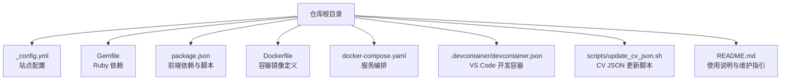
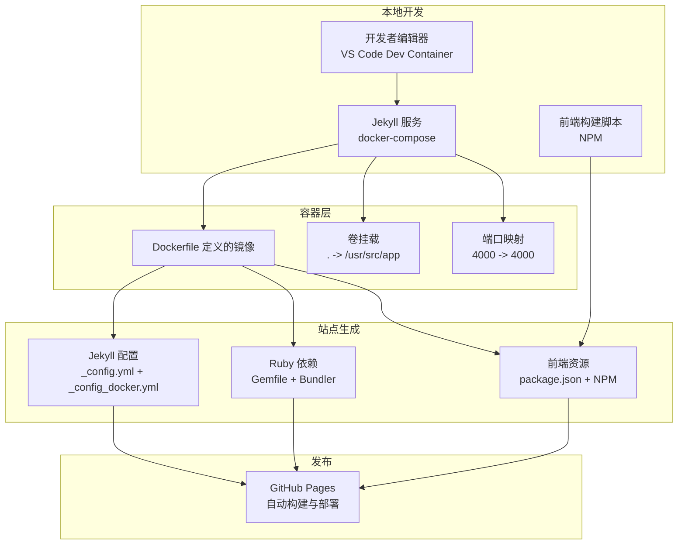
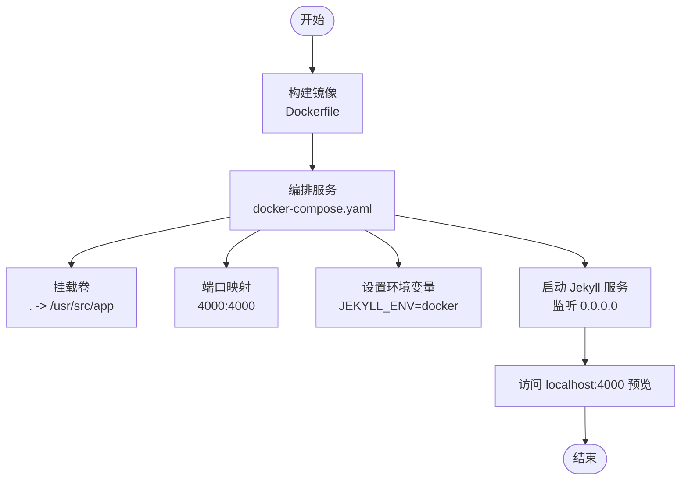
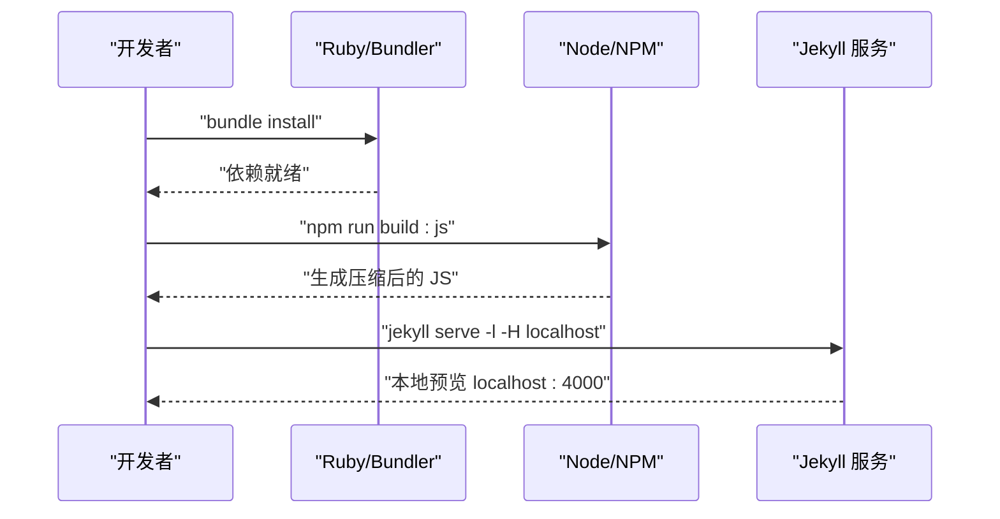
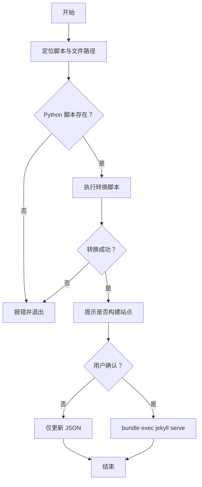
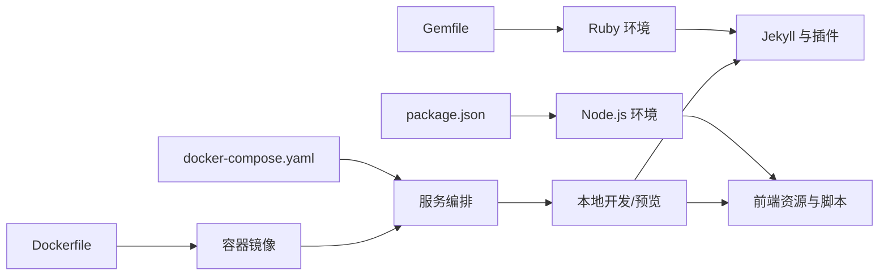

# 部署和维护

<cite>
**本文引用的文件**
- [Dockerfile](file://Dockerfile)
- [docker-compose.yaml](file://docker-compose.yaml)
- [_config.yml](file://_config.yml)
- [_config_docker.yml](file://_config_docker.yml)
- [Gemfile](file://Gemfile)
- [package.json](file://package.json)
- [.devcontainer/devcontainer.json](file://.devcontainer/devcontainer.json)
- [README.md](file://README.md)
- [scripts/update_cv_json.sh](file://scripts/update_cv_json.sh)
- [CONTRIBUTING.md](file://CONTRIBUTING.md)
</cite>

## 目录
1. [简介](#简介)
2. [项目结构](#项目结构)
3. [核心组件](#核心组件)
4. [架构总览](#架构总览)
5. [详细组件分析](#详细组件分析)
6. [依赖关系分析](#依赖关系分析)
7. [性能考虑](#性能考虑)
8. [故障排除指南](#故障排除指南)
9. [结论](#结论)
10. [附录](#附录)

## 简介
本指南面向需要在 GitHub Pages 上托管静态站点，并同时具备本地与容器化开发能力的维护者。文档覆盖以下主题：
- GitHub Pages 自动部署流程（仓库设置、构建配置与发布策略）
- Docker 容器化部署（镜像构建、环境变量、持久化卷与端口映射）
- 本地开发环境维护（Ruby、Bundler、Node.js、NPM 脚本）
- CI/CD 工作流（基于 GitHub Actions 的页面构建与部署）
- 性能监控与优化（构建时间、缓存策略、日志分析）
- 安全更新与漏洞修复
- 备份与灾难恢复
- 实际部署示例与维护检查清单

## 项目结构
该项目采用 Jekyll 静态站点生成器，结合 Ruby 生态与 NPM 构建工具链；通过 Docker 与 VS Code Dev Container 提供一致的本地开发体验。

图表来源
- [Dockerfile:1-36](file://Dockerfile#L1-L36)
- [docker-compose.yaml:1-10](file://docker-compose.yaml#L1-L10)
- [_config.yml:1-362](file://_config.yml#L1-L362)
- [Gemfile:1-14](file://Gemfile#L1-L14)
- [package.json:1-42](file://package.json#L1-L42)
- [.devcontainer/devcontainer.json:1-16](file://.devcontainer/devcontainer.json#L1-L16)
- [scripts/update_cv_json.sh:1-48](file://scripts/update_cv_json.sh#L1-L48)
- [README.md:1-97](file://README.md#L1-L97)

章节来源
- [README.md:1-97](file://README.md#L1-L97)
- [_config.yml:1-362](file://_config.yml#L1-L362)
- [Gemfile:1-14](file://Gemfile#L1-L14)
- [package.json:1-42](file://package.json#L1-L42)
- [Dockerfile:1-36](file://Dockerfile#L1-L36)
- [docker-compose.yaml:1-10](file://docker-compose.yaml#L1-L10)
- [.devcontainer/devcontainer.json:1-16](file://.devcontainer/devcontainer.json#L1-L16)
- [scripts/update_cv_json.sh:1-48](file://scripts/update_cv_json.sh#L1-L48)

## 核心组件
- 配置与主题
  - 站点基础配置位于根目录配置文件中，控制语言、URL、主题、集合、插件与压缩等。
  - 容器模式下通过额外配置片段覆盖部分参数以适配本地开发。
- Ruby 与 Bundler
  - 使用 Gemfile 声明 Jekyll 及其插件依赖，配合 Bundler 安装到隔离路径。
- NPM 与前端资源
  - package.json 定义前端依赖与构建脚本（压缩 JS），用于优化输出体积。
- 容器化运行
  - Dockerfile 指定基础镜像、安装系统依赖、非 root 用户、工作目录与启动命令。
  - docker-compose.yaml 将源码挂载为卷、暴露端口、设置用户 ID 与环境变量。
- VS Code 开发容器
  - 通过 Dev Container 直接复用 docker-compose 编排的服务，实现一键本地预览与热重载。
- 维护脚本
  - 提供 CV JSON 自动转换脚本，便于从 Markdown 生成数据文件并可选触发本地构建。

章节来源
- [_config.yml:1-362](file://_config.yml#L1-L362)
- [_config_docker.yml:1-1](file://_config_docker.yml#L1-L1)
- [Gemfile:1-14](file://Gemfile#L1-L14)
- [package.json:1-42](file://package.json#L1-L42)
- [Dockerfile:1-36](file://Dockerfile#L1-L36)
- [docker-compose.yaml:1-10](file://docker-compose.yaml#L1-L10)
- [.devcontainer/devcontainer.json:1-16](file://.devcontainer/devcontainer.json#L1-L16)
- [scripts/update_cv_json.sh:1-48](file://scripts/update_cv_json.sh#L1-L48)

## 架构总览
下图展示从本地开发到容器化预览的整体架构，以及与 GitHub Pages 发布的关系。

图表来源
- [docker-compose.yaml:1-10](file://docker-compose.yaml#L1-L10)
- [Dockerfile:1-36](file://Dockerfile#L1-L36)
- [_config.yml:1-362](file://_config.yml#L1-L362)
- [_config_docker.yml:1-1](file://_config_docker.yml#L1-L1)
- [Gemfile:1-14](file://Gemfile#L1-L14)
- [package.json:1-42](file://package.json#L1-L42)
- [README.md:57-73](file://README.md#L57-L73)

## 详细组件分析

### GitHub Pages 自动部署
- 仓库设置
  - 使用“使用此模板”创建公开仓库，命名规则为“用户名.github.io”，作为站点根域。
  - 在仓库设置的“GitHub Pages”区域启用自动构建与部署。
- 构建配置
  - 站点基础 URL 与仓库信息在配置文件中声明，确保链接与归档正确。
  - 插件白名单与压缩策略在配置中开启，保证生成结果符合 Pages 要求。
- 发布策略
  - 推送至默认分支后由 Pages 自动触发构建；可在仓库中查看构建状态与日志。
  - 若需自定义域名或路径前缀，应在 Pages 设置中配置。

章节来源
- [README.md:8-16](file://README.md#L8-L16)
- [_config.yml:10-20](file://_config.yml#L10-L20)
- [_config.yml:308-325](file://_config.yml#L308-L325)
- [_config.yml:356-362](file://_config.yml#L356-L362)

### Docker 容器化部署
- 镜像构建
  - 基于 Ruby 基础镜像，安装构建工具与 Node.js，创建非 root 用户并设置工作目录。
  - 安装 Bundler 并执行依赖安装，最终以 Jekyll 服务命令启动。
- 运行时配置
  - docker-compose 将当前目录挂载为只读卷，暴露 4000 端口，设置用户 ID 与环境变量。
  - 启动命令组合了多配置文件，确保本地开发场景下的 URL 与监听地址正确。
- 持久化与权限
  - 卷挂载使本地修改即时反映到容器内；建议在宿主侧保持正确的文件权限。
  - 使用非 root 用户降低容器运行风险。

图表来源
- [Dockerfile:1-36](file://Dockerfile#L1-L36)
- [docker-compose.yaml:1-10](file://docker-compose.yaml#L1-L10)

章节来源
- [Dockerfile:1-36](file://Dockerfile#L1-L36)
- [docker-compose.yaml:1-10](file://docker-compose.yaml#L1-L10)
- [_config_docker.yml:1-1](file://_config_docker.yml#L1-L1)

### 本地开发环境维护
- Ruby 与 Bundler
  - 安装 Ruby 开发包、Bundler 与 Node.js；若遇到权限问题，可通过本地路径配置避免系统级写入。
  - 使用 bundle install 安装依赖；如遇冲突可清理锁定文件后重试。
- Jekyll 服务
  - 使用本地命令启动服务，支持热重载；对核心配置与模板的更改需重启服务。
- NPM 构建
  - 使用提供的脚本进行前端资源压缩与监听，减少打包体积并提升加载速度。

图表来源
- [README.md:24-56](file://README.md#L24-L56)
- [package.json:36-40](file://package.json#L36-L40)
- [Gemfile:1-14](file://Gemfile#L1-L14)

章节来源
- [README.md:18-56](file://README.md#L18-L56)
- [package.json:1-42](file://package.json#L1-L42)
- [Gemfile:1-14](file://Gemfile#L1-L14)

### CI/CD 工作流（GitHub Actions）
- 页面构建与部署
  - 仓库中包含构建状态徽章，表明已存在页面构建工作流。
  - 建议在 .github/workflows 下维护稳定的 YAML 工作流，包含安装依赖、构建站点与部署到 Pages 的步骤。
- 最佳实践
  - 使用受信任的 Actions 与固定版本；在部署前运行语法检查与链接有效性验证。
  - 对敏感信息使用仓库机密，避免硬编码在工作流中。

章节来源
- [README.md:89-90](file://README.md#L89-L90)

### 维护脚本：CV JSON 更新
- 功能概述
  - 从 Markdown 文件生成 JSON 数据，便于前端渲染；可选触发本地构建以预览效果。
- 使用要点
  - 确保 Python 转换脚本存在且可执行；输入输出路径按脚本内约定设置。
  - 执行后如需立即验证，可选择触发本地构建。

图表来源
- [scripts/update_cv_json.sh:1-48](file://scripts/update_cv_json.sh#L1-L48)

章节来源
- [scripts/update_cv_json.sh:1-48](file://scripts/update_cv_json.sh#L1-L48)

## 依赖关系分析
- Ruby 生态
  - Gemfile 声明 Jekyll 与常用插件，Bundler 负责安装；github-pages 作为统一入口。
- 前端生态
  - package.json 管理 jQuery、fitvids、smooth-scroll、Plotly 等依赖，NPM 脚本负责压缩与监听。
- 容器与本地一致性
  - Dockerfile 与 docker-compose.yaml 保持与本地相同的 Ruby 与 Node.js 版本需求，确保跨平台一致性。

图表来源
- [Gemfile:1-14](file://Gemfile#L1-L14)
- [package.json:1-42](file://package.json#L1-L42)
- [Dockerfile:1-36](file://Dockerfile#L1-L36)
- [docker-compose.yaml:1-10](file://docker-compose.yaml#L1-L10)

章节来源
- [Gemfile:1-14](file://Gemfile#L1-L14)
- [package.json:1-42](file://package.json#L1-L42)
- [Dockerfile:1-36](file://Dockerfile#L1-L36)
- [docker-compose.yaml:1-10](file://docker-compose.yaml#L1-L10)

## 性能考虑
- 构建时间优化
  - 启用增量构建与缓存（如 Bundler 本地路径、NPM 缓存）；避免不必要的大文件进入构建。
  - 使用前端资源压缩脚本减少传输体积。
- 缓存策略
  - 在 Pages 中利用浏览器缓存与 CDN；合理设置资源指纹与过期策略。
- 日志与监控
  - 关注 Pages 构建日志中的警告与错误；对慢任务进行分步排查。
  - 在本地与容器中开启详细日志，定位依赖安装与构建瓶颈。

## 故障排除指南
- 权限与依赖
  - Ruby 权限错误：使用本地路径配置避免系统级写入；删除锁定文件后重试安装。
  - Node.js 包安装失败：检查网络与代理；必要时清理缓存后重试。
- 容器无法启动
  - 端口占用：调整宿主机端口映射；确认容器端口一致。
  - 卷权限：确保挂载目录具有读写权限；避免使用 root 用户。
- 预览不刷新
  - 修改配置或模板需重启服务；确认监听地址与端口正确。
- Pages 构建失败
  - 检查配置文件中的 URL 与仓库信息；核对插件白名单与压缩设置。
  - 查看构建日志定位具体错误并逐项修复。

章节来源
- [README.md:45-56](file://README.md#L45-L56)
- [docker-compose.yaml:6-9](file://docker-compose.yaml#L6-L9)
- [_config.yml:156-162](file://_config.yml#L156-L162)

## 结论
通过统一的配置、容器化与本地开发工具链，本项目实现了在 GitHub Pages 上稳定发布与高效维护的目标。建议持续关注依赖版本与安全公告，完善 CI/CD 流程与监控告警，并定期进行备份与演练，以保障站点的长期可用性与安全性。

## 附录

### 实际部署示例（步骤清单）
- 准备阶段
  - 创建公开仓库，命名为“用户名.github.io”。
  - 在仓库设置中启用 GitHub Pages。
- 本地预览
  - 安装 Ruby、Bundler、Node.js；执行依赖安装与前端构建。
  - 使用本地命令启动 Jekyll 服务，访问本地预览。
- 容器化预览
  - 构建镜像并启动服务；通过端口映射访问本地预览。
- 提交与发布
  - 推送更改至默认分支；在仓库中查看构建状态与日志。
- 维护与更新
  - 定期同步上游模板变更；使用维护脚本更新数据文件；执行安全扫描与漏洞修复。

章节来源
- [README.md:8-16](file://README.md#L8-L16)
- [README.md:57-73](file://README.md#L57-L73)
- [scripts/update_cv_json.sh:1-48](file://scripts/update_cv_json.sh#L1-L48)

### 安全更新与漏洞修复
- 依赖审计
  - 定期运行依赖扫描，优先修复高危漏洞。
  - 锁定关键依赖版本，避免自动升级引入不兼容。
- 机密管理
  - 不在仓库中提交凭据；使用仓库机密或外部密管。
- 访问控制
  - 限制仓库推送权限；启用双重认证与审查流程。

### 备份与灾难恢复
- 备份策略
  - 定期导出配置文件、数据文件与构建产物；保留历史版本快照。
- 恢复流程
  - 在新环境中重建依赖与容器；恢复配置与数据；验证预览与发布。