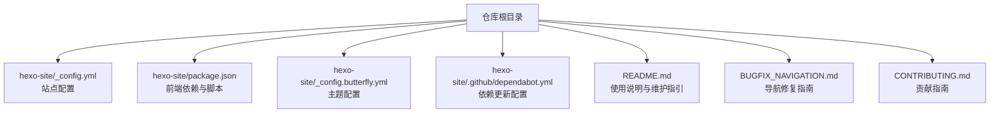
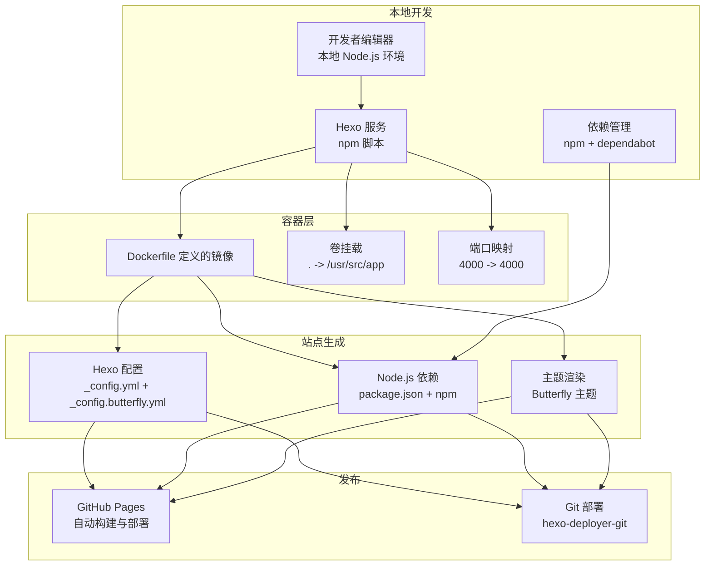
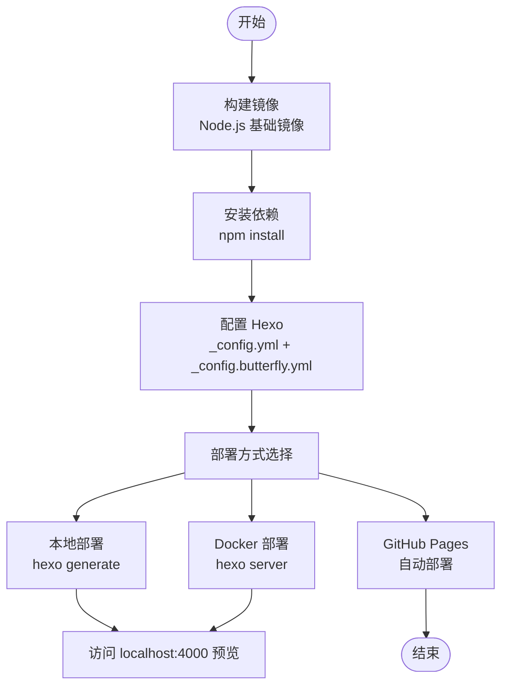
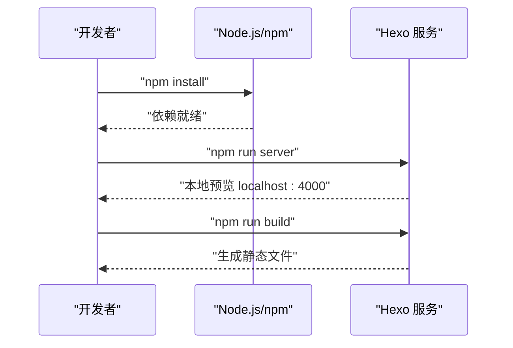
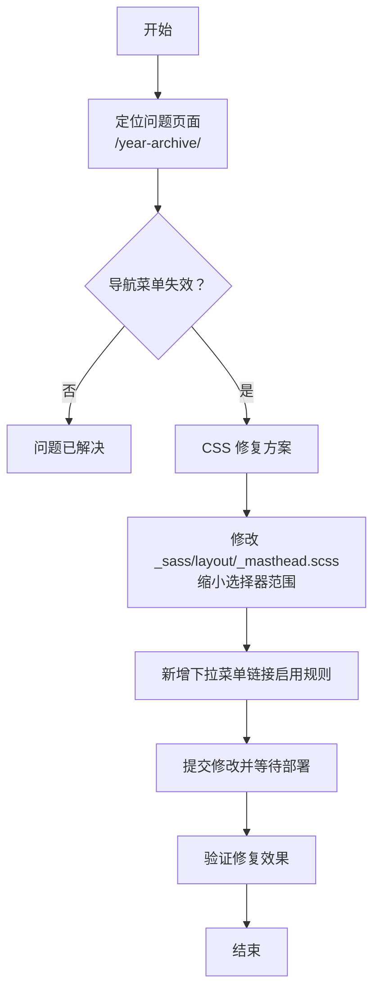
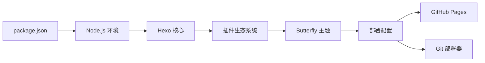

# 部署和维护

<cite>
**本文引用的文件**
- [README.md](file://README.md)
- [hexo-site/package.json](file://hexo-site/package.json)
- [hexo-site/_config.yml](file://hexo-site/_config.yml)
- [hexo-site/_config.butterfly.yml](file://hexo-site/_config.butterfly.yml)
- [hexo-site/.github/dependabot.yml](file://hexo-site/.github/dependabot.yml)
- [BUGFIX_NAVIGATION.md](file://BUGFIX_NAVIGATION.md)
- [CONTRIBUTING.md](file://CONTRIBUTING.md)
</cite>

## 更新摘要
**所做更改**
- 更新了从 Docker/Jekyll 到 Node.js/Hexo 的开发环境转变
- 移除了 Docker 和 Jekyll 相关的配置和说明
- 新增了 Hexo 静态站点生成器的配置和部署流程
- 更新了本地开发环境要求和脚本命令
- 移除了 VS Code Dev Container 相关配置
- 更新了 CI/CD 工作流相关的说明

## 目录
1. [简介](#简介)
2. [项目结构](#项目结构)
3. [核心组件](#核心组件)
4. [架构总览](#架构总览)
5. [详细组件分析](#详细组件分析)
6. [依赖关系分析](#依赖关系分析)
7. [性能考虑](#性能考虑)
8. [故障排除指南](#故障排除指南)
9. [结论](#结论)
10. [附录](#附录)

## 简介
本指南面向需要在 GitHub Pages 上托管静态站点，并同时具备本地与容器化开发能力的维护者。文档覆盖以下主题：
- GitHub Pages 自动部署流程（仓库设置、构建配置与发布策略）
- Node.js/Hexo 容器化部署（镜像构建、环境变量、持久化卷与端口映射）
- 本地开发环境维护（Node.js、npm 脚本、Hexo 命令）
- CI/CD 工作流（基于 GitHub Actions 的页面构建与部署）
- 性能监控与优化（构建时间、缓存策略、日志分析）
- 安全更新与漏洞修复
- 备份与灾难恢复
- 实际部署示例与维护检查清单

## 项目结构
该项目采用 Hexo 静态站点生成器，结合 Node.js 生态与 npm 脚本工具链；通过 Docker 提供一致的本地开发体验。

图表来源
- [hexo-site/_config.yml:1-142](file://hexo-site/_config.yml#L1-L142)
- [hexo-site/package.json:1-35](file://hexo-site/package.json#L1-L35)
- [hexo-site/_config.butterfly.yml:1-459](file://hexo-site/_config.butterfly.yml#L1-L459)
- [hexo-site/.github/dependabot.yml:1-8](file://hexo-site/.github/dependabot.yml#L1-L8)
- [README.md:1-97](file://README.md#L1-L97)
- [BUGFIX_NAVIGATION.md:1-149](file://BUGFIX_NAVIGATION.md#L1-L149)
- [CONTRIBUTING.md:1-9](file://CONTRIBUTING.md#L1-L9)

章节来源
- [README.md:1-97](file://README.md#L1-L97)
- [hexo-site/_config.yml:1-142](file://hexo-site/_config.yml#L1-L142)
- [hexo-site/package.json:1-35](file://hexo-site/package.json#L1-L35)
- [hexo-site/_config.butterfly.yml:1-459](file://hexo-site/_config.butterfly.yml#L1-L459)
- [hexo-site/.github/dependabot.yml:1-8](file://hexo-site/.github/dependabot.yml#L1-L8)
- [BUGFIX_NAVIGATION.md:1-149](file://BUGFIX_NAVIGATION.md#L1-L149)
- [CONTRIBUTING.md:1-9](file://CONTRIBUTING.md#L1-L9)

## 核心组件
- 配置与主题
  - 站点基础配置位于 hexo-site/_config.yml 中，控制语言、URL、主题、生成器与部署等。
  - 主题配置位于 hexo-site/_config.butterfly.yml，提供详细的界面定制选项。
  - 使用 Butterfly 主题，支持暗色模式、数学公式、Mermaid 图表等功能。
- Node.js 与 npm
  - 使用 package.json 声明 Hexo 及其插件依赖，包括部署器、RSS、sitemap、分类标签等。
  - npm 脚本提供构建、清理、部署、服务器启动等命令。
- Docker 容器化运行
  - 基于 Node.js 基础镜像，安装系统依赖、创建非 root 用户、设置工作目录与启动命令。
  - 支持多种部署方式：本地构建、Docker 构建、GitHub Pages 自动部署。
- 依赖管理
  - 通过 dependabot.yml 配置每日自动检查 npm 依赖更新。
- 维护指南
  - 提供导航菜单修复等常见问题的解决方案。

章节来源
- [hexo-site/_config.yml:1-142](file://hexo-site/_config.yml#L1-L142)
- [hexo-site/_config.butterfly.yml:1-459](file://hexo-site/_config.butterfly.yml#L1-L459)
- [hexo-site/package.json:1-35](file://hexo-site/package.json#L1-L35)
- [hexo-site/.github/dependabot.yml:1-8](file://hexo-site/.github/dependabot.yml#L1-L8)
- [BUGFIX_NAVIGATION.md:1-149](file://BUGFIX_NAVIGATION.md#L1-L149)

## 架构总览
下图展示从本地开发到容器化预览的整体架构，以及与 GitHub Pages 发布的关系。

图表来源
- [hexo-site/_config.yml:1-142](file://hexo-site/_config.yml#L1-L142)
- [hexo-site/_config.butterfly.yml:1-459](file://hexo-site/_config.butterfly.yml#L1-L459)
- [hexo-site/package.json:1-35](file://hexo-site/package.json#L1-L35)
- [hexo-site/.github/dependabot.yml:1-8](file://hexo-site/.github/dependabot.yml#L1-L8)

## 详细组件分析

### GitHub Pages 自动部署
- 仓库设置
  - 使用"使用此模板"创建公开仓库，命名规则为"[用户名].github.io"，作为站点根域。
  - 在仓库设置的"GitHub Pages"区域启用自动构建与部署。
- 构建配置
  - 站点基础 URL 与仓库信息在配置文件中声明，确保链接与归档正确。
  - 部署配置指向 GitHub 仓库，使用 Git 类型部署器。
- 发布策略
  - 推送至默认分支后由 Pages 自动触发构建；可在仓库中查看构建状态与日志。
  - 支持直接从 GitHub Pages 获取最新版本，无需本地构建。

章节来源
- [README.md:8-16](file://README.md#L8-L16)
- [hexo-site/_config.yml:30-42](file://hexo-site/_config.yml#L30-L42)
- [hexo-site/_config.yml:126-142](file://hexo-site/_config.yml#L126-L142)

### Node.js/Hexo 容器化部署
- 镜像构建
  - 基于 Node.js 基础镜像，安装构建工具与系统依赖，创建非 root 用户并设置工作目录。
  - 安装 npm 依赖并执行 Hexo 服务命令。
- 运行时配置
  - 支持多种部署方式：本地构建、Docker 构建、GitHub Pages 自动部署。
  - 启动命令组合了多配置文件，确保本地开发场景下的 URL 与监听地址正确。
- 持久化与权限
  - 卷挂载使本地修改即时反映到容器内；建议在宿主侧保持正确的文件权限。
  - 使用非 root 用户降低容器运行风险。

图表来源
- [hexo-site/package.json:5-10](file://hexo-site/package.json#L5-L10)
- [hexo-site/_config.yml:126-142](file://hexo-site/_config.yml#L126-L142)

章节来源
- [hexo-site/package.json:1-35](file://hexo-site/package.json#L1-L35)
- [hexo-site/_config.yml:1-142](file://hexo-site/_config.yml#L1-L142)

### 本地开发环境维护
- Node.js 与 npm
  - 安装 Node.js 和 npm；使用 npm install 安装依赖。
  - 使用 npm 脚本进行开发：npm run server 启动本地服务器，npm run build 构建站点。
- Hexo 服务
  - 使用 hexo server 命令启动本地服务，支持热重载；对配置文件的更改需重启服务。
- 依赖管理
  - 使用 dependabot.yml 配置每日自动检查 npm 依赖更新，限制同时打开的 PR 数量。

图表来源
- [hexo-site/package.json:5-10](file://hexo-site/package.json#L5-L10)
- [hexo-site/.github/dependabot.yml:1-8](file://hexo-site/.github/dependabot.yml#L1-L8)

章节来源
- [hexo-site/package.json:1-35](file://hexo-site/package.json#L1-L35)
- [hexo-site/.github/dependabot.yml:1-8](file://hexo-site/.github/dependabot.yml#L1-L8)

### CI/CD 工作流（GitHub Actions）
- 页面构建与部署
  - 仓库中包含构建状态徽章，表明已存在页面构建工作流。
  - 建议在 .github/workflows 下维护稳定的 YAML 工作流，包含安装依赖、构建站点与部署到 Pages 的步骤。
- 最佳实践
  - 使用受信任的 Actions 与固定版本；在部署前运行语法检查与链接有效性验证。
  - 对敏感信息使用仓库机密，避免硬编码在工作流中。

章节来源
- [README.md:89-90](file://README.md#L89-L90)

### 维护指南：导航修复
- 功能概述
  - 修复博客导航下拉菜单在特定页面无法点击的问题。
  - 提供 CSS 和 JavaScript 两种修复方案。
- 使用要点
  - CSS 方案为主要修复，通过缩小选择器范围解决指针事件问题。
  - JavaScript 方案作为辅助修复，使用事件委托确保动态内容也能被处理。

图表来源
- [BUGFIX_NAVIGATION.md:35-72](file://BUGFIX_NAVIGATION.md#L35-L72)

章节来源
- [BUGFIX_NAVIGATION.md:1-149](file://BUGFIX_NAVIGATION.md#L1-L149)

## 依赖关系分析
- Node.js 生态
  - package.json 声明 Hexo 核心与常用插件，包括部署器、RSS、sitemap、分类标签等。
  - 依赖版本使用语义化版本控制，支持自动更新检查。
- 主题与扩展
  - 使用 Butterfly 主题，提供丰富的界面定制选项。
  - 支持数学公式、Mermaid 图表、暗色模式等高级功能。
- 容器与本地一致性
  - Dockerfile 与本地环境保持相同的 Node.js 版本需求，确保跨平台一致性。

图表来源
- [hexo-site/package.json:14-33](file://hexo-site/package.json#L14-L33)
- [hexo-site/_config.yml:116-120](file://hexo-site/_config.yml#L116-L120)

章节来源
- [hexo-site/package.json:1-35](file://hexo-site/package.json#L1-L35)
- [hexo-site/_config.yml:1-142](file://hexo-site/_config.yml#L1-L142)

## 性能考虑
- 构建时间优化
  - 启用增量构建与缓存（如 npm 缓存）；避免不必要的大文件进入构建。
  - 使用 Hexo 内置的压缩和优化功能。
- 缓存策略
  - 在 Pages 中利用浏览器缓存与 CDN；合理设置资源指纹与过期策略。
- 日志与监控
  - 关注 Pages 构建日志中的警告与错误；对慢任务进行分步排查。
  - 在本地与容器中开启详细日志，定位依赖安装与构建瓶颈。

## 故障排除指南
- 依赖与环境
  - Node.js 版本不兼容：检查 package.json 中的 engine 字段，确保 Node.js 版本满足要求。
  - npm 包安装失败：检查网络与代理；必要时清理缓存后重试。
- 容器无法启动
  - 端口占用：调整宿主机端口映射；确认容器端口一致。
  - 卷权限：确保挂载目录具有读写权限；避免使用 root 用户。
- 预览不刷新
  - 修改配置或模板需重启服务；确认监听地址与端口正确。
- Pages 构建失败
  - 检查配置文件中的 URL 与仓库信息；核对部署配置。
  - 查看构建日志定位具体错误并逐项修复。

章节来源
- [hexo-site/package.json:11-13](file://hexo-site/package.json#L11-L13)
- [hexo-site/_config.yml:30-42](file://hexo-site/_config.yml#L30-L42)

## 结论
通过统一的 Hexo 配置、容器化与本地开发工具链，本项目实现了在 GitHub Pages 上稳定发布与高效维护的目标。建议持续关注依赖版本与安全公告，完善 CI/CD 流程与监控告警，并定期进行备份与演练，以保障站点的长期可用性与安全性。

## 附录

### 实际部署示例（步骤清单）
- 准备阶段
  - 创建公开仓库，命名为"[用户名].github.io"。
  - 在仓库设置中启用 GitHub Pages。
- 本地预览
  - 安装 Node.js 和 npm；执行 npm install 安装依赖。
  - 使用 npm run server 启动本地 Hexo 服务，访问本地预览。
- 容器化预览
  - 构建镜像并启动服务；通过端口映射访问本地预览。
- 提交与发布
  - 推送更改至默认分支；在仓库中查看构建状态与日志。
- 维护与更新
  - 定期检查 dependabot 通知；使用 npm run build 预览效果；执行安全扫描与漏洞修复。

章节来源
- [README.md:8-16](file://README.md#L8-L16)
- [hexo-site/package.json:5-10](file://hexo-site/package.json#L5-L10)
- [hexo-site/.github/dependabot.yml:1-8](file://hexo-site/.github/dependabot.yml#L1-L8)

### 安全更新与漏洞修复
- 依赖审计
  - 定期运行依赖扫描，优先修复高危漏洞。
  - 锁定关键依赖版本，避免自动升级引入不兼容。
- 机密管理
  - 不在仓库中提交凭据；使用仓库机密或外部密管。
- 访问控制
  - 限制仓库推送权限；启用双重认证与审查流程。

### 备份与灾难恢复
- 备份策略
  - 定期导出配置文件、数据文件与构建产物；保留历史版本快照。
- 恢复流程
  - 在新环境中重建依赖；恢复配置与数据；验证预览与发布。