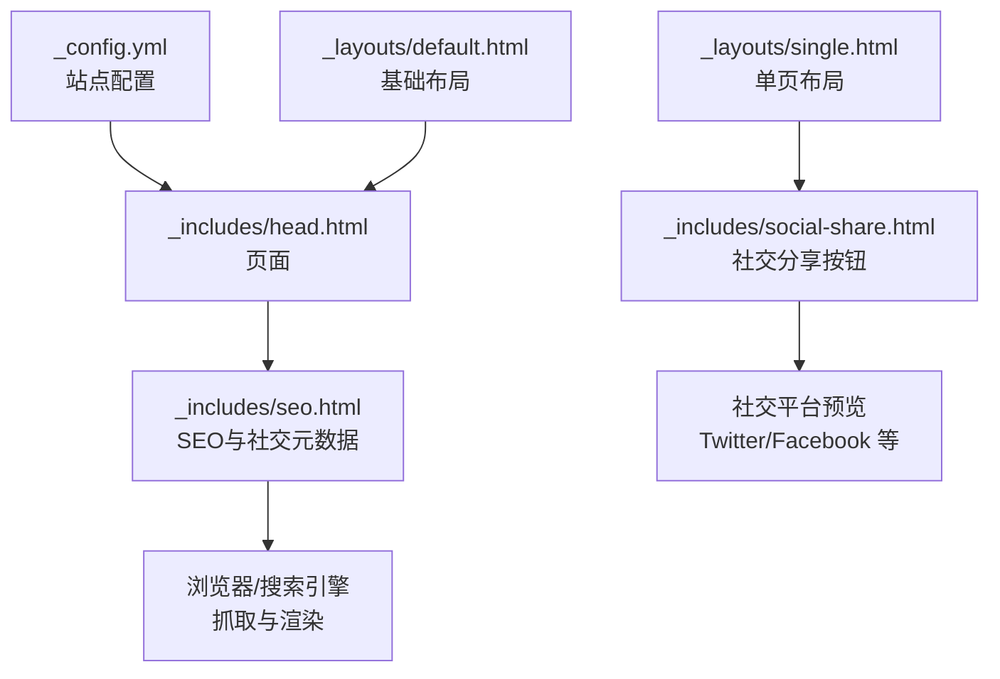
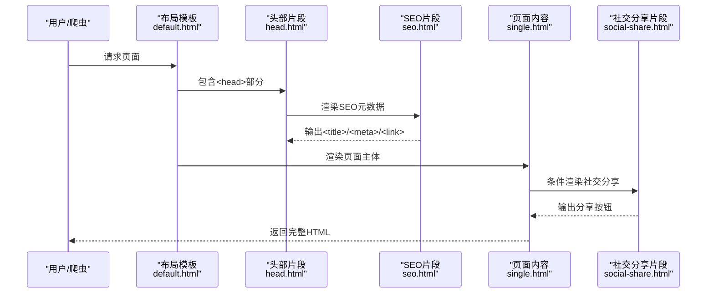
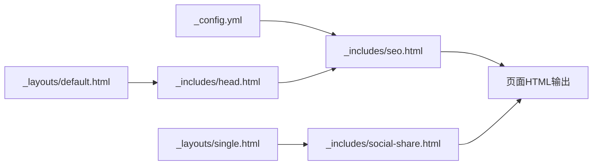

# SEO和社交分享配置

<cite>
**本文引用的文件**
- [_config.yml](file://_config.yml)
- [seo.html](file://_includes/seo.html)
- [social-share.html](file://_includes/social-share.html)
- [head.html](file://_includes/head.html)
- [default.html](file://_layouts/default.html)
- [single.html](file://_layouts/single.html)
- [about.md](file://_pages/about.md)
- [2025-03-11-my-first-blog.md](file://_posts/2025-03-11-my-first-blog.md)
- [ui-text.yml](file://_data/ui-text.yml)
- [README.md](file://README.md)
</cite>

## 目录
1. [简介](#简介)
2. [项目结构](#项目结构)
3. [核心组件](#核心组件)
4. [架构总览](#架构总览)
5. [详细组件分析](#详细组件分析)
6. [依赖关系分析](#依赖关系分析)
7. [性能考虑](#性能考虑)
8. [故障排查指南](#故障排查指南)
9. [结论](#结论)
10. [附录](#附录)

## 简介
本文件面向使用 Academic Pages 主题的 Jekyll 网站，系统化梳理 SEO 与社交分享配置。内容覆盖搜索引擎验证（Google、Bing、Alexa、Yandex）、社交元数据（Twitter Card、Open Graph）、社交分享按钮与预览图配置、最佳实践、验证方法与常见问题排查。目标是帮助读者快速完成站点 SEO 与社交分享的正确配置，并能有效测试与维护。

## 项目结构
本项目采用 Jekyll 的标准目录组织，SEO 与社交分享相关的关键文件分布如下：
- 站点全局配置：_config.yml
- 页面头部 SEO 片段：_includes/seo.html
- 页面头部通用片段：_includes/head.html
- 布局模板：_layouts/default.html、_layouts/single.html
- 社交分享按钮：_includes/social-share.html
- 多语言文案：_data/ui-text.yml
- 示例页面与文章：_pages/about.md、_posts/2025-03-11-my-first-blog.md
- 本地运行说明：README.md

**图表来源**
- [_config.yml](file://_config.yml)
- [head.html](file://_includes/head.html)
- [seo.html](file://_includes/seo.html)
- [default.html](file://_layouts/default.html)
- [single.html](file://_layouts/single.html)
- [social-share.html](file://_includes/social-share.html)

**章节来源**
- [_config.yml](file://_config.yml)
- [head.html](file://_includes/head.html)
- [seo.html](file://_includes/seo.html)
- [default.html](file://_layouts/default.html)
- [single.html](file://_layouts/single.html)
- [social-share.html](file://_includes/social-share.html)

## 核心组件
- SEO 元数据生成器：负责注入 title、description、canonical、Open Graph、Twitter Card、结构化数据、各引擎验证 meta 等。
- 社交分享按钮：提供一键分享到 Bluesky、Facebook、LinkedIn、Mastodon、X（原 Twitter）等平台的链接。
- 页面布局与头部：default.html 引入 head.html，single.html 控制是否渲染社交分享区域。

关键要点：
- SEO 片段在 head.html 中被引入，确保每个页面头部都包含统一的 SEO 元数据。
- 社交分享按钮在 single.html 中按页面开关控制显示。
- 全局配置在 _config.yml 中集中管理，包括搜索引擎验证码、社交账号、默认 OG 图片与描述等。

**章节来源**
- [seo.html](file://_includes/seo.html)
- [social-share.html](file://_includes/social-share.html)
- [head.html](file://_includes/head.html)
- [single.html](file://_layouts/single.html)
- [_config.yml](file://_config.yml)

## 架构总览
下图展示了从配置到页面输出再到搜索引擎/社交平台解析的整体流程：

**图表来源**
- [default.html](file://_layouts/default.html)
- [head.html](file://_includes/head.html)
- [seo.html](file://_includes/seo.html)
- [single.html](file://_layouts/single.html)
- [social-share.html](file://_includes/social-share.html)

## 详细组件分析

### SEO 元数据与搜索引擎验证
- 验证码字段与输出位置
  - Google Site Verification：在 SEO 片段中输出 name="google-site-verification" 的 meta。
  - Bing Site Verification：输出 name="msvalidate.01" 的 meta。
  - Alexa Site Verification：输出 name="alexaVerifyID" 的 meta。
  - Yandex Site Verification：输出 name="yandex-verification" 的 meta。
- 配置位置
  - 在站点配置文件中添加对应键值即可生效，无需手动写 HTML。
- 适用范围
  - 所有页面都会注入这些 meta，因为 SEO 片段在 head.html 中被包含，而 head.html 在 default.html 中被包含。

最佳实践：
- 仅填写有效的验证码字符串，避免空值导致验证失败。
- 验证前先确认站点可正常构建与访问，再进行搜索引擎后台操作。

**章节来源**
- [_config.yml](file://_config.yml)
- [seo.html](file://_includes/seo.html)

### Open Graph 与 Twitter 卡片
- Open Graph
  - 输出 og:locale、og:site_name、og:title、og:type（文章时）、og:description（优先使用页面 excerpt 或站点默认描述）、og:url、og:image（优先使用页面 header.image 或 overlay_image）。
  - 若配置了站点级 og_image，还会输出 Organization 的 logo 结构化数据。
- Twitter Card
  - 当配置了站点 twitter.username 时，输出 twitter:site、twitter:title、twitter:description、twitter:url。
  - 若页面设置了 header.image，则使用 summary_large_image 卡片并输出对应的 twitter:image；否则回退到站点级 og_image。
  - 若作者信息存在 twitter 用户名，输出 twitter:creator。

配置建议：
- 为站点设置一张清晰、尺寸合理的 og_image（建议 1200x630），作为默认社交预览图。
- 文章页尽量为每篇文章设置 header.image，以获得更丰富的预览卡片。
- 作者资料中的 twitter 字段可用于自动填充 twitter:creator。

**章节来源**
- [seo.html](file://_includes/seo.html)
- [_config.yml](file://_config.yml)

### 社交分享按钮
- 分享平台
  - Bluesky、Facebook、LinkedIn、Mastodon、X（原 Twitter）。
- 动态链接
  - 使用当前页面的 base_path + page.url 作为分享链接，确保分享到各平台时指向准确页面。
- 文案与多语言
  - 标题文案来自 ui-text.yml 的 share_on_label，支持多语言切换。

使用建议：
- 在需要展示社交分享的页面，确保页面 front matter 中 share: true。
- 如需自定义分享文案，可在页面中通过参数拼接或在 social-share.html 中扩展。

**章节来源**
- [social-share.html](file://_includes/social-share.html)
- [single.html](file://_layouts/single.html)
- [ui-text.yml](file://_data/ui-text.yml)

### 页面与布局集成
- default.html 引入 head.html，确保每个页面都包含 SEO 片段。
- single.html 控制是否渲染社交分享区域，并输出页面的 schema.org 元数据（如 headline、description、datePublished 等）。

**章节来源**
- [default.html](file://_layouts/default.html)
- [head.html](file://_includes/head.html)
- [single.html](file://_layouts/single.html)

## 依赖关系分析
- 配置依赖
  - SEO 片段依赖 _config.yml 中的 google_site_verification、bing_site_verification、alexa_site_verification、yandex_site_verification、twitter、facebook、social、og_image、og_description 等键。
- 模板依赖
  - head.html 依赖 seo.html；default.html 依赖 head.html；single.html 依赖 social-share.html。
- 页面依赖
  - 页面 front matter 中的 share、header.image 等会影响最终输出的社交元数据与分享按钮。

**图表来源**
- [_config.yml](file://_config.yml)
- [seo.html](file://_includes/seo.html)
- [head.html](file://_includes/head.html)
- [default.html](file://_layouts/default.html)
- [single.html](file://_layouts/single.html)
- [social-share.html](file://_includes/social-share.html)

**章节来源**
- [_config.yml](file://_config.yml)
- [seo.html](file://_includes/seo.html)
- [head.html](file://_includes/head.html)
- [default.html](file://_layouts/default.html)
- [single.html](file://_layouts/single.html)
- [social-share.html](file://_includes/social-share.html)

## 性能考虑
- SEO 片段与社交分享均为静态模板渲染，不引入额外运行时脚本，对性能影响极小。
- 合理设置 og_image 尺寸与格式，有助于提升社交平台预览加载速度。
- 使用压缩布局与静态资源策略，配合 Jekyll 插件（如 sitemap、feed）可进一步优化 SEO。

## 故障排查指南
- 验证码无效或未生效
  - 检查 _config.yml 中验证码字段是否正确填写且无多余空格。
  - 确认站点已成功构建并部署，本地预览与线上访问一致。
  - 使用搜索引擎自带的验证工具（如 Google Search Console、Bing Webmaster Tools）进行二次确认。
- 社交预览图不显示
  - 确认页面 header.image 或站点 og_image 路径正确，且图片可被公开访问。
  - 若使用相对路径，请确保 base_path 正确拼接。
- Twitter 卡片未出现大图
  - 确保页面设置了 header.image；若未设置，需提供站点级 og_image。
  - 检查是否使用了 summary_large_image 卡片类型。
- 分享按钮无法打开
  - 检查页面 front matter 是否开启 share: true。
  - 确认 social-share.html 中的链接参数拼接正确（base_path + page.url）。

**章节来源**
- [_config.yml](file://_config.yml)
- [seo.html](file://_includes/seo.html)
- [social-share.html](file://_includes/social-share.html)
- [single.html](file://_layouts/single.html)

## 结论
本主题通过统一的 SEO 片段与社交分享片段，实现了对搜索引擎验证、Open Graph、Twitter Card 以及社交分享按钮的标准化配置。遵循本文的最佳实践与排障建议，可显著提升站点在搜索引擎与社交平台上的可见性与传播效果。

## 附录

### 配置清单与示例路径
- 搜索引擎验证
  - Google Site Verification：[_config.yml](file://_config.yml)
  - Bing Site Verification：[_config.yml](file://_config.yml)
  - Alexa Site Verification：[_config.yml](file://_config.yml)
  - Yandex Site Verification：[_config.yml](file://_config.yml)
- 社交媒体与结构化数据
  - Twitter 用户名与 Facebook 配置：[_config.yml](file://_config.yml)
  - 站点社交资料与链接：[_config.yml](file://_config.yml)
  - 默认社交预览图与描述：[_config.yml](file://_config.yml)
- 页面级社交预览图
  - 文章头图设置：[_posts/2025-03-11-my-first-blog.md](file://_posts/2025-03-11-my-first-blog.md)
  - 首页示例：[_pages/about.md](file://_pages/about.md)

### 测试与验证步骤
- 本地预览
  - 使用 Jekyll 本地服务预览页面，检查 HTML 源码中是否包含预期的 meta 与链接。
  - 参考本地运行说明：[README.md](file://README.md)
- 社交平台预览
  - 使用各平台的预览工具（如 Twitter Card Validator、Facebook Sharing Debugger）输入页面 URL 进行检测。
- 搜索引擎验证
  - 在 Google Search Console、Bing Webmaster Tools、Alexa、Yandex 等平台提交并验证站点所有权。

**章节来源**
- [README.md](file://README.md)
- [seo.html](file://_includes/seo.html)
- [social-share.html](file://_includes/social-share.html)