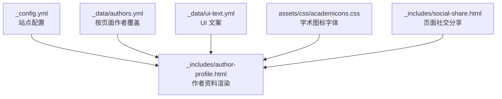
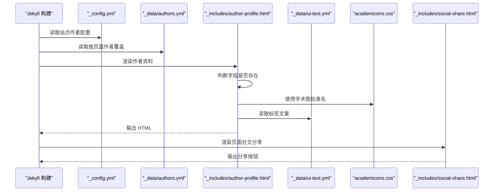
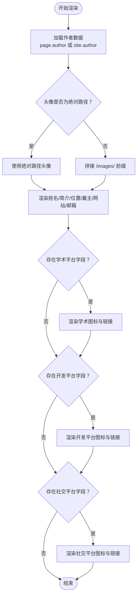
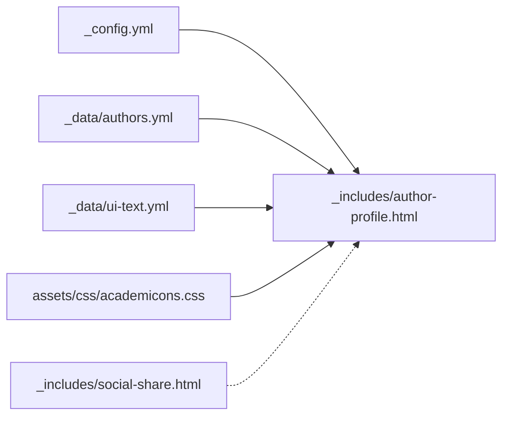

# 作者和社交配置

<cite>
**本文引用的文件**
- [_config.yml](file://_config.yml)
- [author-profile.html](file://_includes/author-profile.html)
- [social-share.html](file://_includes/social-share.html)
- [authors.yml](file://_data/authors.yml)
- [ui-text.yml](file://_data/ui-text.yml)
- [academicons.css](file://assets/css/academicons.css)
- [README.md](file://README.md)
</cite>

## 目录
1. [简介](#简介)
2. [项目结构](#项目结构)
3. [核心组件](#核心组件)
4. [架构总览](#架构总览)
5. [详细组件分析](#详细组件分析)
6. [依赖关系分析](#依赖关系分析)
7. [性能考虑](#性能考虑)
8. [故障排除指南](#故障排除指南)
9. [结论](#结论)

## 简介
本文件面向需要配置“作者信息与社交网络”的用户，系统性说明 Jekyll 主题中的作者配置与社交链接集成机制。重点覆盖：
- _config.yml 中 author 部分的字段含义与配置方式（头像、姓名、简介、位置、雇主、邮箱、网站等）
- 各类社交平台的集成配置（学术平台如 Google Scholar、ORCID；软件开发平台如 GitHub、Stack Overflow；社交平台如 LinkedIn、Twitter/X、Mastodon 等）
- 每个社交平台的参数名、值类型与链接格式要求
- 完整配置示例与链接格式说明
- 如何添加自定义社交平台与隐藏不需要的社交图标
- 配置验证方法与常见问题解决方案

## 项目结构
本主题采用 Jekyll 模板，作者信息主要由站点配置与数据文件共同驱动：
- 站点级配置：_config.yml 提供全局作者信息与社交链接
- 数据文件：_data/authors.yml 支持按页面作者覆盖
- 视图模板：_includes/author-profile.html 渲染作者资料与社交图标
- UI 文案：_data/ui-text.yml 提供多语言文案（如“网站”、“邮箱”等标签）
- 学术图标：assets/css/academicons.css 提供学术平台专用图标字体
- 社交分享：_includes/social-share.html 提供页面级社交分享按钮

图表来源
- [_config.yml:21-84](file://_config.yml#L21-L84)
- [author-profile.html:1-177](file://_includes/author-profile.html#L1-L177)
- [authors.yml:1-19](file://_data/authors.yml#L1-L19)
- [ui-text.yml:1-355](file://_data/ui-text.yml#L1-L355)
- [academicons.css:1-200](file://assets/css/academicons.css#L1-L200)
- [social-share.html:1-18](file://_includes/social-share.html#L1-L18)

章节来源
- [_config.yml:21-84](file://_config.yml#L21-L84)
- [author-profile.html:1-177](file://_includes/author-profile.html#L1-L177)
- [authors.yml:1-19](file://_data/authors.yml#L1-L19)
- [ui-text.yml:1-355](file://_data/ui-text.yml#L1-L355)
- [academicons.css:1-200](file://assets/css/academicons.css#L1-L200)
- [social-share.html:1-18](file://_includes/social-share.html#L1-L18)

## 核心组件
- 站点作者配置（_config.yml）
  - 作用域：site.author，影响全站侧边栏作者资料
  - 关键字段：avatar、name、bio、location、employer、uri、email 及各类社交平台链接
  - 隐藏规则：字段为空则不渲染对应图标与链接
- 按页面作者覆盖（_data/authors.yml）
  - 作用域：page.author 对应的数据条目，优先级高于 site.author
  - 适用场景：多作者页面或需要差异化展示
- 作者资料渲染（_includes/author-profile.html）
  - 负责根据作者数据生成头像、姓名、简介、位置、雇主、邮箱、网站以及各类社交链接
  - 自动识别绝对路径与相对路径头像
  - 条件渲染：仅当作者数据存在对应字段时才输出相应列表项
- UI 文案（_data/ui-text.yml）
  - 提供“网站”、“邮箱”等标签文本，支持多语言
- 学术图标（assets/css/academicons.css）
  - 提供学术平台专用图标类名（如 ai-google-scholar、ai-orcid 等）
- 页面社交分享（_includes/social-share.html）
  - 提供 Bluesky、Facebook、LinkedIn、Mastodon、X/Twitter 等分享入口

章节来源
- [_config.yml:21-84](file://_config.yml#L21-L84)
- [author-profile.html:1-177](file://_includes/author-profile.html#L1-L177)
- [authors.yml:1-19](file://_data/authors.yml#L1-L19)
- [ui-text.yml:1-355](file://_data/ui-text.yml#L1-L355)
- [academicons.css:1-200](file://assets/css/academicons.css#L1-L200)
- [social-share.html:1-18](file://_includes/social-share.html#L1-L18)

## 架构总览
作者与社交配置的运行流程如下：
- Jekyll 构建时读取 _config.yml 与 _data/authors.yml
- 页面渲染时，author-profile.html 从 page.author 或 site.author 获取作者数据
- 若作者数据中存在某社交字段，则渲染对应的链接与图标
- UI 文案来自 ui-text.yml，用于显示“网站”、“邮箱”等标签
- 学术图标通过 academicons.css 提供的类名渲染

图表来源
- [_config.yml:21-84](file://_config.yml#L21-L84)
- [authors.yml:1-19](file://_data/authors.yml#L1-L19)
- [author-profile.html:1-177](file://_includes/author-profile.html#L1-L177)
- [ui-text.yml:1-355](file://_data/ui-text.yml#L1-L355)
- [academicons.css:1-200](file://assets/css/academicons.css#L1-L200)
- [social-share.html:1-18](file://_includes/social-share.html#L1-L18)

## 详细组件分析

### 站点作者配置（_config.yml）
- 位置：_config.yml 的 author 段落
- 字段说明（节选）
  - avatar：头像路径（相对路径自动拼接 /images/ 前缀）
  - name：显示姓名
  - bio：个人简介
  - location：所在城市/地区
  - employer：所属机构
  - uri：个人网站链接
  - email：电子邮箱（将生成 mailto 链接）
  - 学术平台：googlescholar、orcid、pubmed、researchgate、scopus、semantic、ssrn、zotero、arxiv、academia、inspire-hep、impactstory
  - 开发平台：github、bitbucket、codepen、dribbble、kaggle、stackoverflow
  - 社交平台：facebook、twitter/x、linkedin、instagram、youtube、weibo、zhihu、mastodon、medium、telegram、bluesky、wikipedia、xing、tumblr、soundcloud、pinterest、flickr、goodreads、lastfm、vine、steam、keybase、foursquare、artstation
- 隐藏规则：字段留空即不渲染对应图标与链接
- 示例参考：站点配置中已给出部分平台的注释示例（如 github、twitter、linkedin、mastodon、telegram、bluesky 等）

章节来源
- [_config.yml:21-84](file://_config.yml#L21-L84)

### 按页面作者覆盖（_data/authors.yml）
- 作用：当页面设置了 author 字段时，优先使用该数据条目覆盖站点作者配置
- 结构：以作者名为键，包含 name、uri、email、bio、avatar、各社交平台用户名等
- 适用场景：多作者文章、不同页面展示不同作者信息

章节来源
- [authors.yml:1-19](file://_data/authors.yml#L1-L19)

### 作者资料渲染（_includes/author-profile.html）
- 头像处理：若 avatar 包含绝对路径则直接使用；否则拼接 /images/ 前缀
- 条件渲染：仅当作者数据存在对应字段时才输出相应列表项
- 学术图标：使用 academicons.css 的类名（如 ai-google-scholar、ai-orcid 等）
- 社交平台链接：根据平台规范拼接标准 URL（如 https://github.com/username）
- UI 文案：通过 ui-text.yml 的 website_label、email_label 等键读取标签文本

图表来源
- [author-profile.html:1-177](file://_includes/author-profile.html#L1-L177)
- [academicons.css:1-200](file://assets/css/academicons.css#L1-L200)
- [ui-text.yml:1-355](file://_data/ui-text.yml#L1-L355)

章节来源
- [author-profile.html:1-177](file://_includes/author-profile.html#L1-L177)

### 页面社交分享（_includes/social-share.html）
- 提供 Bluesky、Facebook、LinkedIn、Mastodon、X/Twitter 等分享入口
- 分享链接通过页面 URL 动态拼接，便于一键分享当前页面

章节来源
- [social-share.html:1-18](file://_includes/social-share.html#L1-L18)

### UI 文案（_data/ui-text.yml）
- 提供“网站”、“邮箱”等标签文本，支持多语言
- 作者资料中“网站”、“邮箱”等标签文本来源于此

章节来源
- [ui-text.yml:1-355](file://_data/ui-text.yml#L1-L355)

### 学术图标（assets/css/academicons.css）
- 提供学术平台专用图标类名（如 ai-google-scholar、ai-orcid 等）
- 作者资料中学术平台图标通过这些类名渲染

章节来源
- [academicons.css:1-200](file://assets/css/academicons.css#L1-L200)

## 依赖关系分析
- 作者资料渲染依赖：
  - 站点配置（_config.yml）提供默认作者信息
  - 按页面作者数据（_data/authors.yml）提供覆盖
  - UI 文案（_data/ui-text.yml）提供标签文本
  - 学术图标（assets/css/academicons.css）提供图标字体
- 页面社交分享独立于作者配置，但共享站点基础路径与页面 URL

图表来源
- [_config.yml:21-84](file://_config.yml#L21-L84)
- [authors.yml:1-19](file://_data/authors.yml#L1-L19)
- [ui-text.yml:1-355](file://_data/ui-text.yml#L1-L355)
- [academicons.css:1-200](file://assets/css/academicons.css#L1-L200)
- [author-profile.html:1-177](file://_includes/author-profile.html#L1-L177)
- [social-share.html:1-18](file://_includes/social-share.html#L1-L18)

章节来源
- [_config.yml:21-84](file://_config.yml#L21-L84)
- [authors.yml:1-19](file://_data/authors.yml#L1-L19)
- [ui-text.yml:1-355](file://_data/ui-text.yml#L1-L355)
- [academicons.css:1-200](file://assets/css/academicons.css#L1-L200)
- [author-profile.html:1-177](file://_includes/author-profile.html#L1-L177)
- [social-share.html:1-18](file://_includes/social-share.html#L1-L18)

## 性能考虑
- 头像加载优化：相对路径头像会自动拼接前缀，建议将头像放置在 /images/ 目录，避免重复拼接逻辑
- 图标字体：academicons.css 为字体图标，体积小、加载快，适合大量学术图标场景
- 条件渲染：仅在字段存在时渲染对应链接，减少 DOM 元素数量，提升渲染效率
- 本地预览：使用 jekyll serve 进行本地预览，修改配置需重启服务以确保变更生效

## 故障排除指南
- 修改 _config.yml 后页面未更新
  - 现象：更改作者配置后本地预览无变化
  - 原因：Jekyll 不会自动重载 _config.yml
  - 解决：停止服务并重新启动 jekyll serve
  - 参考：本地运行说明
- 头像不显示或路径错误
  - 现象：头像缺失或显示异常
  - 排查：确认 avatar 是否为绝对路径；若为相对路径，请放置于 /images/ 目录
  - 参考：作者资料渲染逻辑
- 学术图标不显示
  - 现象：学术平台图标缺失
  - 排查：确认 academicons.css 已正确引入；检查字段名是否匹配（如 googlescholar、orcid 等）
  - 参考：学术图标类名与作者资料渲染
- 社交平台链接格式错误
  - 现象：点击链接跳转到错误页面
  - 排查：对照作者资料模板中的链接拼接规则，确保字段值为完整 URL 或正确的用户名
  - 参考：作者资料渲染模板
- 多语言标签不显示
  - 现象：网站/邮箱等标签显示为占位文本
  - 排查：确认 ui-text.yml 中对应语言键存在且值非空
  - 参考：UI 文案文件

章节来源
- [README.md:52-53](file://README.md#L52-L53)
- [author-profile.html:1-177](file://_includes/author-profile.html#L1-L177)
- [academicons.css:1-200](file://assets/css/academicons.css#L1-L200)
- [ui-text.yml:1-355](file://_data/ui-text.yml#L1-L355)

## 结论
通过 _config.yml 的 author 段落与 _includes/author-profile.html 的条件渲染机制，本主题提供了灵活而强大的作者信息与社交网络配置能力。结合 _data/authors.yml 的按页面覆盖、ui-text.yml 的多语言支持以及 academicons.css 的学术图标，用户可以快速完成个性化配置。遵循本文档的字段说明、链接格式与验证方法，即可高效完成作者信息与社交网络的部署与维护。