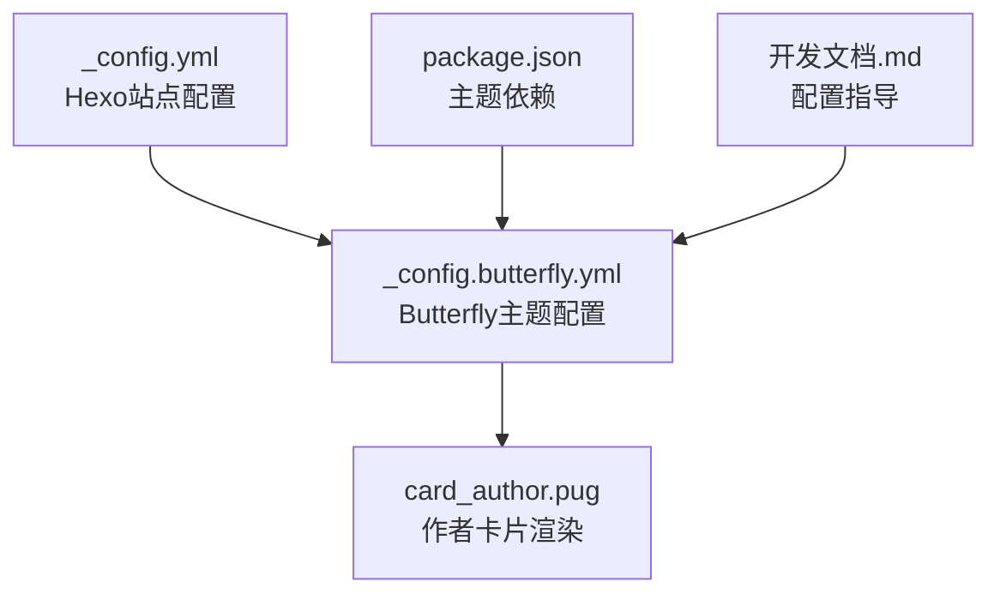
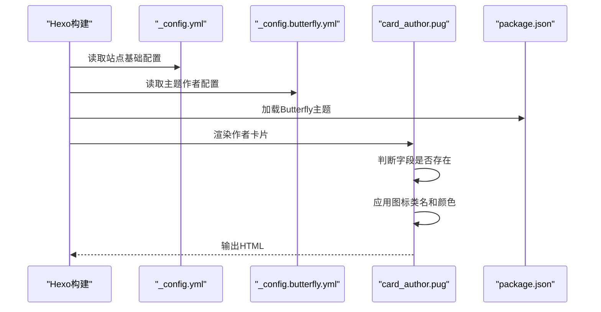
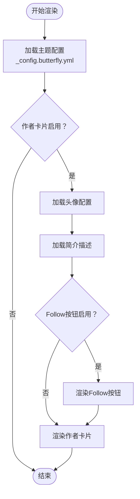
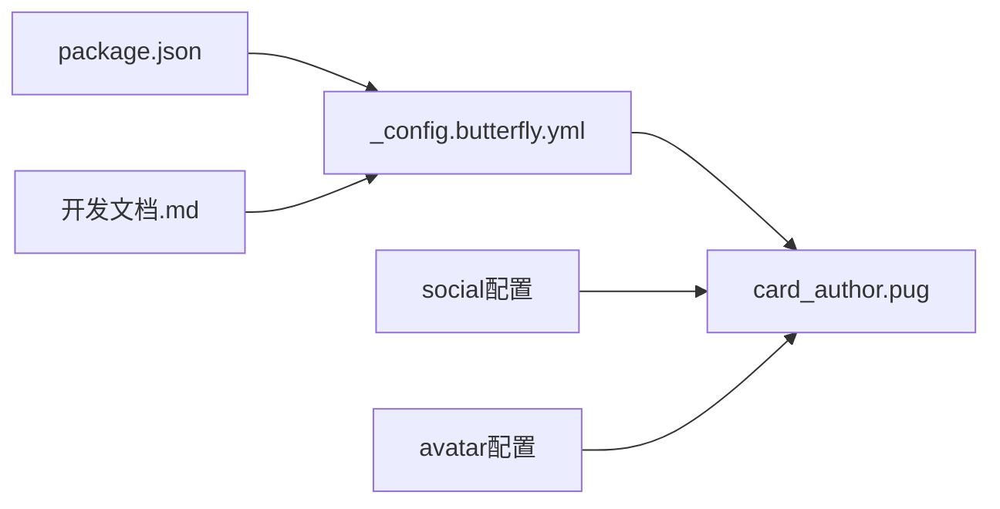

# 作者和社交配置

<cite>
**本文引用的文件**
- [_config.yml](file://hexo-site/_config.yml)
- [_config.butterfly.yml](file://hexo-site/_config.butterfly.yml)
- [package.json](file://hexo-site/package.json)
- [card_author.pug](file://hexo-site/node_modules/hexo-theme-butterfly/layout/includes/widget/card_author.pug)
- [开发文档.md](file://开发文档.md)
</cite>

## 更新摘要
**所做更改**
- 更新了从Jekyll到Hexo+Butterfly主题的迁移说明
- 新增了Butterfly主题配置系统的详细说明
- 更新了作者信息和社交网络配置的实现方式
- 添加了新的配置文件结构和参数说明
- 更新了配置示例和验证方法

## 目录
1. [简介](#简介)
2. [项目结构](#项目结构)
3. [核心组件](#核心组件)
4. [架构总览](#架构总览)
5. [详细组件分析](#详细组件分析)
6. [依赖关系分析](#依赖关系分析)
7. [性能考虑](#性能考虑)
8. [故障排除指南](#故障排除指南)
9. [结论](#结论)

## 简介
本文件面向需要配置"作者信息与社交网络"的用户，系统性说明Hexo + Butterfly主题中的作者配置与社交链接集成机制。重点覆盖：
- _config.butterfly.yml 中作者信息配置的字段含义与配置方式（头像、姓名、简介、位置、雇主、邮箱、网站等）
- 各类社交平台的集成配置（学术平台如 Google Scholar、ORCID；软件开发平台如 GitHub、Stack Overflow；社交平台如 LinkedIn、Twitter、Mastodon 等）
- 每个社交平台的参数名、值类型与链接格式要求
- 完整配置示例与链接格式说明
- 如何添加自定义社交平台与隐藏不需要的社交图标
- 配置验证方法与常见问题解决方案

**重要说明**：本项目已从Jekyll迁移到Hexo + Butterfly主题，作者配置系统已完全重构。

## 项目结构
本主题采用Hexo + Butterfly主题架构，作者信息主要由主题配置文件驱动：
- 站点配置：_config.yml 提供基础站点信息
- 主题配置：_config.butterfly.yml 提供作者信息与社交链接
- 主题依赖：package.json 指定Butterfly主题版本
- 作者卡片：node_modules/hexo-theme-butterfly/layout/includes/widget/card_author.pug 渲染作者资料
- 开发文档：开发文档.md 提供配置指导



**图表来源**
- [_config.yml:1-142](file://hexo-site/_config.yml#L1-L142)
- [_config.butterfly.yml:1-459](file://hexo-site/_config.butterfly.yml#L1-L459)
- [package.json:1-35](file://hexo-site/package.json#L1-L35)
- [card_author.pug](file://hexo-site/node_modules/hexo-theme-butterfly/layout/includes/widget/card_author.pug)
- [开发文档.md:380-386](file://开发文档.md#L380-L386)

**章节来源**
- [_config.yml:1-142](file://hexo-site/_config.yml#L1-L142)
- [_config.butterfly.yml:1-459](file://hexo-site/_config.butterfly.yml#L1-L459)
- [package.json:1-35](file://hexo-site/package.json#L1-L35)
- [card_author.pug](file://hexo-site/node_modules/hexo-theme-butterfly/layout/includes/widget/card_author.pug)
- [开发文档.md:380-386](file://开发文档.md#L380-L386)

## 核心组件
- **主题作者配置（_config.butterfly.yml）**
  - 作用域：theme.author，影响全站侧边栏作者资料
  - 关键字段：avatar、description、button 等作者信息配置
  - 隐藏规则：字段为空或禁用则不渲染对应图标与链接
- **作者卡片渲染（card_author.pug）**
  - 负责根据作者数据生成头像、姓名、简介、位置、雇主、邮箱、网站以及各类社交链接
  - 自动识别绝对路径与相对路径头像
  - 条件渲染：仅当作者数据存在对应字段时才输出相应列表项
- **社交链接配置（_config.butterfly.yml）**
  - 作用域：social，支持多种社交平台链接配置
  - 格式：图标类名: 链接 || 显示名称 || 颜色
  - 支持平台：GitHub、Email、LinkedIn、Twitter等
- **主题依赖管理（package.json）**
  - 指定Butterfly主题版本：^5.5.4
  - 确保主题功能正常运行

**章节来源**
- [_config.butterfly.yml:104-112](file://hexo-site/_config.butterfly.yml#L104-L112)
- [card_author.pug](file://hexo-site/node_modules/hexo-theme-butterfly/layout/includes/widget/card_author.pug)
- [_config.butterfly.yml:36-41](file://hexo-site/_config.butterfly.yml#L36-L41)
- [package.json:30](file://hexo-site/package.json#L30)

## 架构总览
作者与社交配置的运行流程如下：
- Hexo构建时读取 _config.yml 与 _config.butterfly.yml
- Butterfly主题渲染时，card_author.pug 从配置文件获取作者数据
- 若配置中存在某社交字段，则渲染对应的链接与图标
- 社交链接通过指定的图标类名和颜色进行样式化
- 开发文档提供配置指导和最佳实践



**图表来源**
- [_config.yml:1-142](file://hexo-site/_config.yml#L1-L142)
- [_config.butterfly.yml:1-459](file://hexo-site/_config.butterfly.yml#L1-L459)
- [package.json:1-35](file://hexo-site/package.json#L1-L35)
- [card_author.pug](file://hexo-site/node_modules/hexo-theme-butterfly/layout/includes/widget/card_author.pug)

## 详细组件分析

### 主题作者配置（_config.butterfly.yml）
- **位置**：_config.butterfly.yml 的 author 段落
- **字段说明**
  - avatar：头像配置，包含 img 和 effect 两个子字段
  - description：个人简介文字
  - button：Follow Me 按钮配置（已禁用）
- **配置格式**
  ```yaml
  aside:
    card_author:
      enable: true
      description: "个人简介文字"
      button:
        enable: false
  ```
- **头像配置**
  - img：头像图片路径（建议放在 source/images/ 目录下）
  - effect：是否启用转动效果（true/false）
- **隐藏规则**：字段留空或禁用则不渲染对应图标与链接

**章节来源**
- [_config.butterfly.yml:104-112](file://hexo-site/_config.butterfly.yml#L104-L112)
- [_config.butterfly.yml:49-54](file://hexo-site/_config.butterfly.yml#L49-L54)

### 社交媒体链接配置（_config.butterfly.yml）
- **位置**：_config.butterfly.yml 的 social 段落
- **配置格式**：图标类名: 链接 || 显示名称 || 颜色
- **支持的社交平台**
  - GitHub：fab fa-github
  - Email：fas fa-envelope
  - 其他平台：LinkedIn、Twitter、Mastodon等
- **示例配置**
  ```yaml
  social:
    fab fa-github: Github || '#24292e'
    fas fa-envelope: mailto:coolpig0720@gmail.com || Email || '#4a7dbe'
  ```
- **图标类名**：使用Font Awesome图标库
- **颜色配置**：可自定义图标颜色

**章节来源**
- [_config.butterfly.yml:36-41](file://hexo-site/_config.butterfly.yml#L36-L41)

### 作者卡片渲染（card_author.pug）
- **渲染逻辑**：从 _config.butterfly.yml 读取作者配置
- **头像处理**：使用配置中的头像路径，支持绝对路径和相对路径
- **简介渲染**：显示 description 字段的内容
- **按钮控制**：button.enable 控制Follow Me按钮的显示
- **条件渲染**：仅当配置存在对应字段时才输出相应内容



**图表来源**
- [card_author.pug](file://hexo-site/node_modules/hexo-theme-butterfly/layout/includes/widget/card_author.pug)
- [_config.butterfly.yml:104-112](file://hexo-site/_config.butterfly.yml#L104-L112)

**章节来源**
- [card_author.pug](file://hexo-site/node_modules/hexo-theme-butterfly/layout/includes/widget/card_author.pug)

### 主题依赖管理（package.json）
- **Butterfly主题版本**：^5.5.4
- **依赖安装**：确保主题功能正常运行
- **版本兼容性**：与Hexo版本7.3.0兼容

**章节来源**
- [package.json:30](file://hexo-site/package.json#L30)

### 开发文档指导（开发文档.md）
- **头像配置**：提供详细的头像和图标配置说明
- **路径规范**：建议使用绝对路径 `/images/` 格式
- **配置示例**：包含完整的配置示例和最佳实践
- **部署指导**：提供GitHub Pages部署的完整流程

**章节来源**
- [开发文档.md:380-386](file://开发文档.md#L380-L386)

## 依赖关系分析
- **作者卡片渲染依赖**：
  - 主题配置（_config.butterfly.yml）提供作者信息
  - 主题依赖（package.json）确保Butterfly主题正常加载
  - 开发文档（开发文档.md）提供配置指导
- **社交链接独立于作者配置**，但共享主题基础路径
- **主题版本管理**：package.json确保主题版本兼容性



**图表来源**
- [_config.butterfly.yml:1-459](file://hexo-site/_config.butterfly.yml#L1-L459)
- [package.json:1-35](file://hexo-site/package.json#L1-L35)
- [card_author.pug](file://hexo-site/node_modules/hexo-theme-butterfly/layout/includes/widget/card_author.pug)
- [开发文档.md:380-386](file://开发文档.md#L380-L386)

**章节来源**
- [_config.butterfly.yml:1-459](file://hexo-site/_config.butterfly.yml#L1-L459)
- [package.json:1-35](file://hexo-site/package.json#L1-L35)
- [card_author.pug](file://hexo-site/node_modules/hexo-theme-butterfly/layout/includes/widget/card_author.pug)
- [开发文档.md:380-386](file://开发文档.md#L380-L386)

## 性能考虑
- **头像加载优化**：建议将头像放置在 source/images/ 目录，使用绝对路径
- **主题加载**：Butterfly主题版本 ^5.5.4，确保性能和兼容性
- **条件渲染**：仅在配置存在时渲染对应内容，减少DOM元素数量
- **本地预览**：使用 hexo server 进行本地预览，修改配置需重新构建
- **静态资源**：头像和图标作为静态资源，加载速度快

## 故障排除指南
- **修改配置后页面未更新**
  - 现象：更改作者配置后本地预览无变化
  - 原因：Hexo不会自动重载配置文件
  - 解决：执行 `hexo clean && hexo server` 重新构建
  - 参考：开发文档.md 中的清理和预览命令
- **头像不显示或路径错误**
  - 现象：头像缺失或显示异常
  - 排查：确认 avatar.img 路径是否正确，建议使用绝对路径
  - 参考：开发文档.md 中的头像配置说明
- **社交链接不显示**
  - 现象：社交图标或链接缺失
  - 排查：确认 social 配置格式是否正确，图标类名是否有效
  - 参考：_config.butterfly.yml 中的社交配置示例
- **主题版本冲突**
  - 现象：主题功能异常或样式错误
  - 排查：确认 package.json 中的Butterfly版本兼容性
  - 解决：执行 `npm install hexo-theme-butterfly@^5.5.4` 更新主题
- **配置格式错误**
  - 现象：YAML解析错误或配置不生效
  - 排查：检查缩进、冒号后的空格、中文冒号替换为英文冒号
  - 参考：开发文档.md 中的YAML配置规范

**章节来源**
- [开发文档.md:514-536](file://开发文档.md#L514-L536)
- [_config.butterfly.yml:36-41](file://hexo-site/_config.butterfly.yml#L36-L41)
- [package.json:30](file://hexo-site/package.json#L30)

## 结论
通过Hexo + Butterfly主题的配置系统，本项目提供了灵活而强大的作者信息与社交网络配置能力。相比之前的Jekyll实现，新的配置系统更加简洁明了：

- **统一配置**：所有作者和社交配置集中在 _config.butterfly.yml 中
- **主题集成**：与Butterfly主题深度集成，提供更好的用户体验
- **简化维护**：减少了多个配置文件的维护复杂度
- **扩展性强**：支持自定义社交平台和图标样式

遵循本文档的配置说明、格式要求与验证方法，即可高效完成作者信息与社交网络的部署与维护。建议按照开发文档.md中的指导进行配置，并定期检查主题版本兼容性以确保最佳效果。