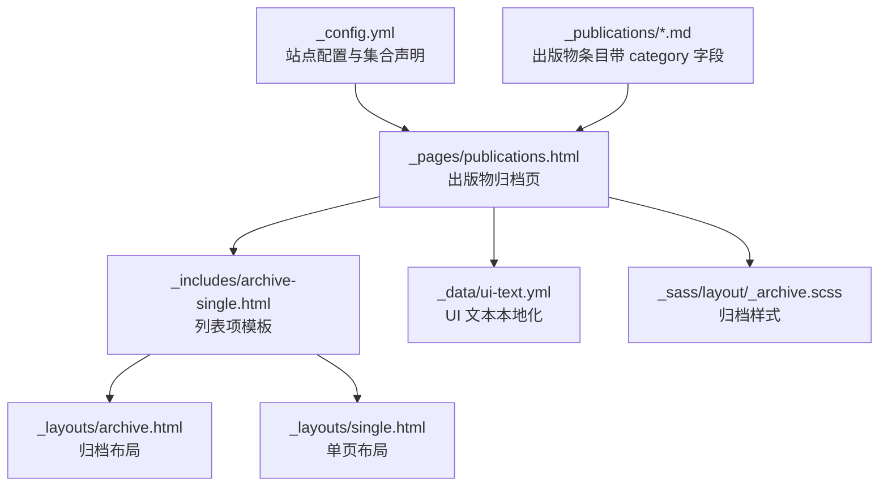
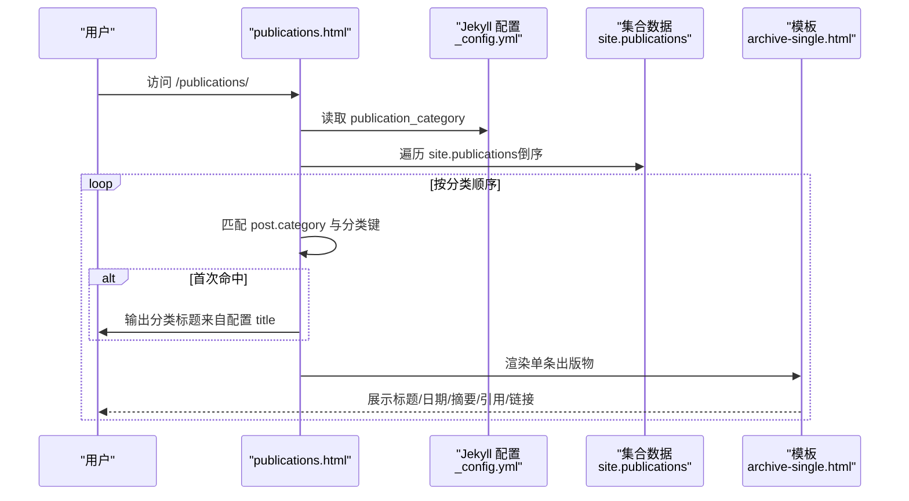
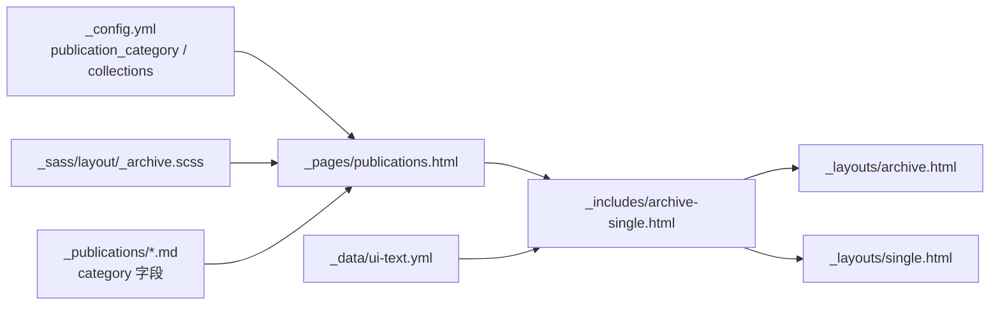

# 内容和出版物配置

<cite>
**本文引用的文件**
- [_config.yml](file://_config.yml)
- [publications.html](file://_pages/publications.html)
- [archive-single.html](file://_includes/archive-single.html)
- [single.html](file://_layouts/single.html)
- [ui-text.yml](file://_data/ui-text.yml)
- [2009-10-01-paper-title-number-1.md](file://_publications/2009-10-01-paper-title-number-1.md)
- [2010-10-01-paper-title-number-2.md](file://_publications/2010-10-01-paper-title-number-2.md)
- [2015-10-01-paper-title-number-3.md](file://_publications/2015-10-01-paper-title-number-3.md)
- [2024-02-17-paper-title-number-4.md](file://_publications/2024-02-17-paper-title-number-4.md)
- [2025-06-08-paper-title-number-5.md](file://_publications/2025-06-08-paper-title-number-5.md)
- [archive.html](file://_layouts/archive.html)
- [_archive.scss](file://_sass/layout/_archive.scss)
</cite>

## 目录
1. [简介](#简介)
2. [项目结构](#项目结构)
3. [核心组件](#核心组件)
4. [架构总览](#架构总览)
5. [详细组件分析](#详细组件分析)
6. [依赖关系分析](#依赖关系分析)
7. [性能考量](#性能考量)
8. [故障排查指南](#故障排查指南)
9. [结论](#结论)
10. [附录](#附录)

## 简介
本文件聚焦于内容管理与出版物分类配置，系统性阐述 Jekyll 主题中的 publication_category 分类体系。内容涵盖：
- 出版物类型（书籍、期刊文章、会议论文等）的分类设置与展示逻辑
- 标题显示与排序规则（按分类分组、倒序排列）
- 自定义分类与新增分类类型的步骤与注意事项
- 配置示例路径与最佳实践
- 配置变更对网站显示效果的影响
- 常见场景与解决方案

## 项目结构
围绕出版物分类的关键文件与目录如下：
- 配置层：站点配置文件用于声明分类与集合
- 页面层：出版物归档页面负责渲染
- 包含模板：列表项模板负责单条出版物的展示
- 布局层：归档与单页布局控制页面结构
- 数据层：UI 文本配置用于本地化标签
- 内容层：各出版物条目使用分类字段进行分组

图表来源
- [_config.yml:223-236](file://_config.yml#L223-L236)
- [publications.html:1-37](file://_pages/publications.html#L1-L37)
- [archive-single.html:1-85](file://_includes/archive-single.html#L1-L85)
- [archive.html:1-25](file://_layouts/archive.html#L1-L25)
- [single.html:1-110](file://_layouts/single.html#L1-L110)
- [ui-text.yml:1-355](file://_data/ui-text.yml#L1-L355)
- [_archive.scss:1-246](file://_sass/layout/_archive.scss#L1-L246)
- [2009-10-01-paper-title-number-1.md:1-15](file://_publications/2009-10-01-paper-title-number-1.md#L1-L15)

章节来源
- [_config.yml:85-93](file://_config.yml#L85-L93)
- [_config.yml:223-236](file://_config.yml#L223-L236)
- [_pages/publications.html:1-37](file://_pages/publications.html#L1-L37)

## 核心组件
- 站点配置（publication_category 与集合声明）
  - 在站点配置中定义 publication_category，键名为分类标识（如 books、manuscripts、conferences），值包含标题字段 title，用于页面分组标题显示。
  - 同时在 collections 中声明 publications 集合，使 Markdown 条目可被 Jekyll 聚合处理。

- 出版物归档页面（publications.html）
  - 当存在 publication_category 时，页面按分类顺序遍历站点出版物，仅显示与当前分类标识匹配的条目；首次出现某分类时输出分类标题（来自配置的 title）。
  - 未定义分类时，回退为全量倒序展示。

- 列表项模板（archive-single.html）
  - 渲染单条出版物的标题、日期、摘要、引用与下载链接等信息。
  - 对不同集合（如 publications）采用统一的“发表于”展示格式。

- 布局层
  - 归档布局（archive.html）承载页面标题与内容区域。
  - 单页布局（single.html）用于条目详情页，包含元信息与推荐引用等。

- UI 文本（ui-text.yml）
  - 提供日期标签等本地化文本，影响页面显示文案。

章节来源
- [_config.yml:85-93](file://_config.yml#L85-L93)
- [_config.yml:223-236](file://_config.yml#L223-L236)
- [_pages/publications.html:14-33](file://_pages/publications.html#L14-L33)
- [_includes/archive-single.html:43-47](file://_includes/archive-single.html#L43-L47)
- [_layouts/archive.html:1-25](file://_layouts/archive.html#L1-L25)
- [_layouts/single.html:37-43](file://_layouts/single.html#L37-L43)
- [_data/ui-text.yml:18-19](file://_data/ui-text.yml#L18-L19)

## 架构总览
出版物分类渲染的整体流程如下：

图表来源
- [_pages/publications.html:15-28](file://_pages/publications.html#L15-L28)
- [_config.yml:85-93](file://_config.yml#L85-L93)
- [_includes/archive-single.html:43-47](file://_includes/archive-single.html#L43-L47)

## 详细组件分析

### 组件A：出版物分类配置与展示
- 分类声明与标题
  - 在站点配置中以键值形式声明分类，每个分类包含 title 字段，作为页面分组标题。
  - 示例路径：[_config.yml:85-93](file://_config.yml#L85-L93)

- 排序规则
  - 页面遍历 site.publications 时采用倒序（reversed）策略，确保较新的条目优先显示。
  - 示例路径：[_pages/publications.html](file://_pages/publications.html#L18)

- 分组与标题输出
  - 首次匹配到某分类的条目时才输出该分类的标题（来自配置），避免重复标题。
  - 示例路径：[_pages/publications.html:17-25](file://_pages/publications.html#L17-L25)

- 回退机制
  - 若未定义 publication_category，则回退为全量倒序展示所有出版物。
  - 示例路径：[_pages/publications.html:29-33](file://_pages/publications.html#L29-L33)

- 标题显示与本地化
  - 页面标题由页面 YAML 头部指定，而分类标题来自配置的 title 字段。
  - 示例路径：[_pages/publications.html:2-6](file://_pages/publications.html#L2-L6)

章节来源
- [_config.yml:85-93](file://_config.yml#L85-L93)
- [_pages/publications.html:14-33](file://_pages/publications.html#L14-L33)

### 组件B：列表项模板与字段映射
- 字段映射与展示
  - 模板根据集合类型选择不同的展示文案（例如 publications 使用“发表于”格式）。
  - 示例路径：[_includes/archive-single.html:43-47](file://_includes/archive-single.html#L43-L47)

- 引用与下载链接
  - 模板根据可用字段动态组合推荐引用与下载链接（论文、幻灯片、BibTeX）。
  - 示例路径：[_includes/archive-single.html:55-81](file://_includes/archive-single.html#L55-L81)

- 日期与摘要
  - 日期采用本地化标签（来自 ui-text.yml），摘要在特定条件下启用“阅读更多”链接。
  - 示例路径：[_includes/archive-single.html:46-53](file://_includes/archive-single.html#L46-L53)
  - 示例路径：[_data/ui-text.yml:18-19](file://_data/ui-text.yml#L18-L19)

章节来源
- [_includes/archive-single.html:43-47](file://_includes/archive-single.html#L43-L47)
- [_includes/archive-single.html:55-81](file://_includes/archive-single.html#L55-L81)
- [_includes/archive-single.html:46-53](file://_includes/archive-single.html#L46-L53)
- [_data/ui-text.yml:18-19](file://_data/ui-text.yml#L18-L19)

### 组件C：布局与样式
- 归档布局
  - 承载页面标题与内容区域，配合归档样式实现列表/网格视图的排版。
  - 示例路径：[_layouts/archive.html:1-25](file://_layouts/archive.html#L1-L25)

- 归档样式
  - 提供列表与网格视图的响应式样式，控制标题、摘要、悬停效果等。
  - 示例路径：[_sass/layout/_archive.scss:42-85](file://_sass/layout/_archive.scss#L42-L85)

章节来源
- [_layouts/archive.html:1-25](file://_layouts/archive.html#L1-L25)
- [_sass/layout/_archive.scss:42-85](file://_sass/layout/_archive.scss#L42-L85)

### 组件D：内容条目与分类关联
- 条目字段
  - 每个出版物条目需声明 collection 为 publications，并设置 category 为对应分类键（如 manuscripts、conferences）。
  - 示例路径：[2009-10-01-paper-title-number-1.md:3-4](file://_publications/2009-10-01-paper-title-number-1.md#L3-L4)
  - 示例路径：[2010-10-01-paper-title-number-2.md:3-4](file://_publications/2010-10-01-paper-title-number-2.md#L3-L4)
  - 示例路径：[2015-10-01-paper-title-number-3.md:3-4](file://_publications/2015-10-01-paper-title-number-3.md#L3-L4)
  - 示例路径：[2024-02-17-paper-title-number-4.md:3-4](file://_publications/2024-02-17-paper-title-number-4.md#L3-L4)

- 日期与摘要
  - 条目包含 date、excerpt 等字段，用于模板渲染与 SEO 元信息。
  - 示例路径：[2009-10-01-paper-title-number-1.md:6-7](file://_publications/2009-10-01-paper-title-number-1.md#L6-L7)
  - 示例路径：[2015-10-01-paper-title-number-3.md:6-7](file://_publications/2015-10-01-paper-title-number-3.md#L6-L7)

- 数学公式支持
  - 支持在描述中使用 MathJax 表达式，注意默认定界符与其他平台差异。
  - 示例路径：[2025-06-08-paper-title-number-5.md:11-13](file://_publications/2025-06-08-paper-title-number-5.md#L11-L13)

章节来源
- [2009-10-01-paper-title-number-1.md:3-4](file://_publications/2009-10-01-paper-title-number-1.md#L3-L4)
- [2010-10-01-paper-title-number-2.md:3-4](file://_publications/2010-10-01-paper-title-number-2.md#L3-L4)
- [2015-10-01-paper-title-number-3.md:3-4](file://_publications/2015-10-01-paper-title-number-3.md#L3-L4)
- [2024-02-17-paper-title-number-4.md:3-4](file://_publications/2024-02-17-paper-title-number-4.md#L3-L4)
- [2025-06-08-paper-title-number-5.md:11-13](file://_publications/2025-06-08-paper-title-number-5.md#L11-L13)

### 组件E：单页布局与详情展示
- 详情页元信息
  - 单页布局对不同集合采用差异化展示（如 publications 的“发表于”格式）。
  - 示例路径：[_layouts/single.html:37-43](file://_layouts/single.html#L37-L43)

- 下载与引用
  - 详情页同样根据可用字段组合推荐引用与下载链接。
  - 示例路径：[_layouts/single.html:50-74](file://_layouts/single.html#L50-L74)

章节来源
- [_layouts/single.html:37-43](file://_layouts/single.html#L37-L43)
- [_layouts/single.html:50-74](file://_layouts/single.html#L50-L74)

## 依赖关系分析
- 配置依赖
  - publication_category 的键名必须与条目 category 字段一致，否则无法正确分组。
  - 集合声明（collections.publications）必须存在，以便 Jekyll 聚合出版物条目。

- 模板依赖
  - publications.html 依赖配置中的分类顺序与标题；依赖 archive-single.html 渲染单条出版物。
  - archive-single.html 依赖条目字段（如 venue、date、citation、paperurl 等）。

- 样式依赖
  - 归档样式影响列表/网格视图的排版与交互效果。

图表来源
- [_config.yml:85-93](file://_config.yml#L85-L93)
- [_config.yml:223-236](file://_config.yml#L223-L236)
- [publications.html:1-37](file://_pages/publications.html#L1-L37)
- [archive-single.html:1-85](file://_includes/archive-single.html#L1-L85)
- [archive.html:1-25](file://_layouts/archive.html#L1-L25)
- [single.html:1-110](file://_layouts/single.html#L1-L110)
- [ui-text.yml:1-355](file://_data/ui-text.yml#L1-L355)
- [_archive.scss:1-246](file://_sass/layout/_archive.scss#L1-L246)
- [2009-10-01-paper-title-number-1.md:3-4](file://_publications/2009-10-01-paper-title-number-1.md#L3-L4)

章节来源
- [_config.yml:85-93](file://_config.yml#L85-L93)
- [_config.yml:223-236](file://_config.yml#L223-L236)
- [_pages/publications.html:1-37](file://_pages/publications.html#L1-L37)
- [_includes/archive-single.html:1-85](file://_includes/archive-single.html#L1-L85)
- [_layouts/archive.html:1-25](file://_layouts/archive.html#L1-L25)
- [_layouts/single.html:1-110](file://_layouts/single.html#L1-L110)
- [_data/ui-text.yml:1-355](file://_data/ui-text.yml#L1-L355)
- [_sass/layout/_archive.scss:1-246](file://_sass/layout/_archive.scss#L1-L246)
- [2009-10-01-paper-title-number-1.md:3-4](file://_publications/2009-10-01-paper-title-number-1.md#L3-L4)

## 性能考量
- 遍历与渲染
  - 页面对 site.publications 进行倒序遍历并按分类筛选，条目数量较多时建议保持合理数量或考虑分页策略。
- 模板复杂度
  - archive-single.html 中的条件分支较多，字段齐全时渲染开销略增；可通过精简字段减少不必要的 DOM 结构。
- 样式与资源
  - 归档样式包含响应式网格与悬停效果，建议在移动端关注图片与链接的加载性能。

## 故障排查指南
- 分类标题不显示
  - 检查 publication_category 是否正确定义，且分类键与条目 category 一致。
  - 参考路径：[_config.yml:85-93](file://_config.yml#L85-L93)，[publications.html:15-28](file://_pages/publications.html#L15-L28)

- 条目未按分类分组
  - 确认条目 category 字段与配置键名完全一致（大小写与拼写）。
  - 参考路径：[2009-10-01-paper-title-number-1.md](file://_publications/2009-10-01-paper-title-number-1.md#L4)

- 日期标签显示异常
  - 检查 ui-text.yml 中 date_label 的本地化配置是否正确。
  - 参考路径：[_data/ui-text.yml:18-19](file://_data/ui-text.yml#L18-L19)

- 数学公式未渲染
  - 确认条目中使用了正确的 MathJax 定界符，并已在主题中启用 MathJax 支持。
  - 参考路径：[2025-06-08-paper-title-number-5.md:11-13](file://_publications/2025-06-08-paper-title-number-5.md#L11-L13)

- 下载链接缺失
  - 检查条目中 paperurl、slidesurl、bibtexurl 等字段是否完整提供。
  - 参考路径：[_includes/archive-single.html:55-81](file://_includes/archive-single.html#L55-L81)

章节来源
- [_config.yml:85-93](file://_config.yml#L85-L93)
- [_pages/publications.html:15-28](file://_pages/publications.html#L15-L28)
- [2009-10-01-paper-title-number-1.md](file://_publications/2009-10-01-paper-title-number-1.md#L4)
- [_data/ui-text.yml:18-19](file://_data/ui-text.yml#L18-L19)
- [2025-06-08-paper-title-number-5.md:11-13](file://_publications/2025-06-08-paper-title-number-5.md#L11-L13)
- [_includes/archive-single.html:55-81](file://_includes/archive-single.html#L55-L81)

## 结论
publication_category 提供了灵活的出版物分类与展示能力。通过在站点配置中声明分类、在条目中设置分类键，即可实现按分类分组、倒序展示与本地化标题显示。遵循字段规范与最佳实践，可获得清晰、一致且易于维护的出版物页面。

## 附录

### 配置示例与最佳实践
- 基本分类配置
  - 在站点配置中添加分类键与标题，确保键名与条目 category 一致。
  - 参考路径：[_config.yml:85-93](file://_config.yml#L85-L93)

- 新增分类类型
  - 在 publication_category 中新增键值对（如 newtype: { title: "新类型" }），并在相应条目的 category 字段设置为 newtype。
  - 参考路径：[_pages/publications.html:15-28](file://_pages/publications.html#L15-L28)，[2009-10-01-paper-title-number-1.md](file://_publications/2009-10-01-paper-title-number-1.md#L4)

- 标题与排序
  - 分类标题来自配置 title；条目按时间倒序展示，确保最新成果优先呈现。
  - 参考路径：[_pages/publications.html:17-25](file://_pages/publications.html#L17-L25)

- 字段与展示
  - 建议为每篇出版物提供 venue、date、citation 等字段，以提升展示质量与可读性。
  - 参考路径：[_includes/archive-single.html:43-47](file://_includes/archive-single.html#L43-L47)

- 数学公式
  - 在描述中使用 MathJax 表达式时，注意默认定界符与其他平台差异。
  - 参考路径：[2025-06-08-paper-title-number-5.md:11-13](file://_publications/2025-06-08-paper-title-number-5.md#L11-L13)

- 样式与响应式
  - 归档样式支持列表与网格视图，建议在移动端关注加载性能与可读性。
  - 参考路径：[_sass/layout/_archive.scss:115-152](file://_sass/layout/_archive.scss#L115-L152)