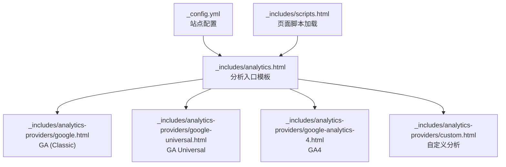
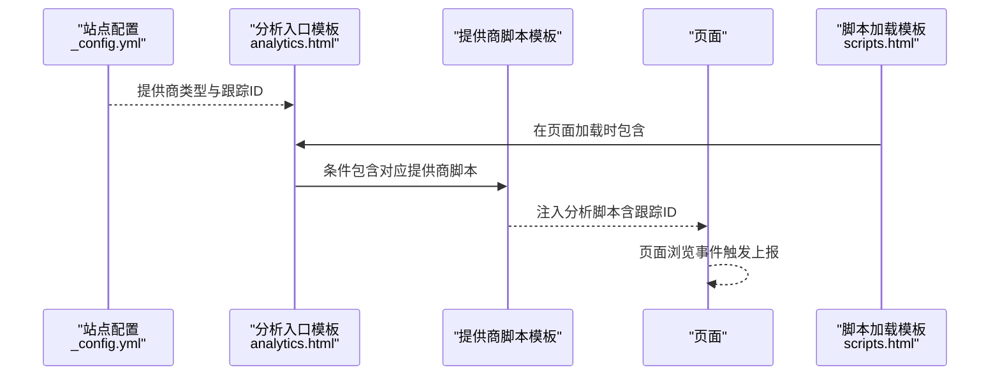
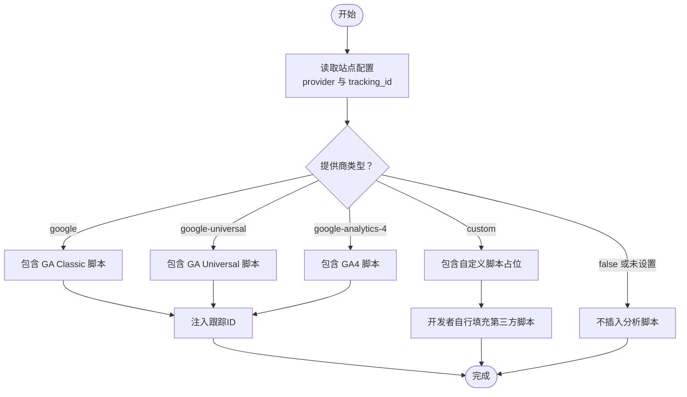
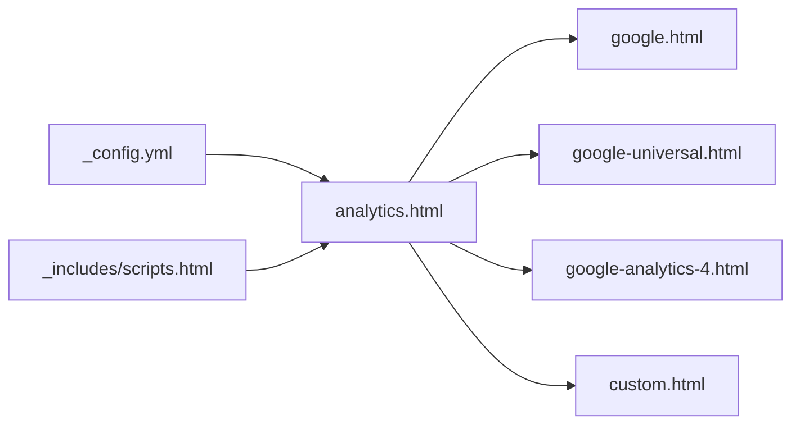

# 分析和跟踪配置

<cite>
**本文引用的文件**
- [_config.yml](file://_config.yml)
- [analytics.html](file://_includes/analytics.html)
- [google.html](file://_includes/analytics-providers/google.html)
- [google-universal.html](file://_includes/analytics-providers/google-universal.html)
- [google-analytics-4.html](file://_includes/analytics-providers/google-analytics-4.html)
- [custom.html](file://_includes/analytics-providers/custom.html)
- [scripts.html](file://_includes/scripts.html)
- [terms.md](file://_pages/terms.md)
</cite>

## 目录
1. [简介](#简介)
2. [项目结构](#项目结构)
3. [核心组件](#核心组件)
4. [架构总览](#架构总览)
5. [详细组件分析](#详细组件分析)
6. [依赖关系分析](#依赖关系分析)
7. [性能考量](#性能考量)
8. [故障排除指南](#故障排除指南)
9. [结论](#结论)
10. [附录](#附录)

## 简介
本文件面向网站分析与跟踪系统的配置与使用，聚焦于 Jekyll 主题中的分析模块集成，涵盖以下能力：
- 基于配置选择分析提供商（Google Analytics、Google Universal Analytics、Google Analytics 4、自定义）
- 各分析系统的配置参数与跟踪 ID 设置
- 分析提供商的选择指南与配置步骤
- 如何启用自定义分析脚本与第三方分析工具
- 完整配置示例与集成验证方法
- 数据隐私保护与合规要求说明
- 故障排除与性能优化建议

## 项目结构
分析与跟踪功能由站点配置与模板片段共同实现：
- 站点配置文件中定义分析提供商与跟踪 ID
- 模板片段根据提供商动态插入对应的分析脚本
- 页面加载时通过脚本模板引入分析模块

**图表来源**
- [_config.yml](file://_config.yml)
- [analytics.html](file://_includes/analytics.html)
- [google.html](file://_includes/analytics-providers/google.html)
- [google-universal.html](file://_includes/analytics-providers/google-universal.html)
- [google-analytics-4.html](file://_includes/analytics-providers/google-analytics-4.html)
- [custom.html](file://_includes/analytics-providers/custom.html)
- [scripts.html](file://_includes/scripts.html)

**章节来源**
- [_config.yml](file://_config.yml)
- [analytics.html](file://_includes/analytics.html)
- [scripts.html](file://_includes/scripts.html)

## 核心组件
- 站点配置（analytics）：定义分析提供商类型与跟踪 ID
- 分析入口模板：根据提供商条件包含对应脚本片段
- 分析提供商模板：内置 GA Classic、GA Universal、GA4 的脚本；自定义模板留空位供扩展
- 脚本加载模板：在页面底部引入分析模块

关键要点：
- 分析开关受站点配置控制，且可按页面覆盖
- 跟踪 ID 通过配置项注入到脚本模板中
- 自定义模板用于接入第三方分析工具或企业内部分析平台

**章节来源**
- [_config.yml](file://_config.yml)
- [analytics.html](file://_includes/analytics.html)
- [custom.html](file://_includes/analytics-providers/custom.html)
- [scripts.html](file://_includes/scripts.html)

## 架构总览
下图展示从配置到页面渲染的分析模块调用链：

**图表来源**
- [_config.yml](file://_config.yml)
- [analytics.html](file://_includes/analytics.html)
- [google.html](file://_includes/analytics-providers/google.html)
- [google-universal.html](file://_includes/analytics-providers/google-universal.html)
- [google-analytics-4.html](file://_includes/analytics-providers/google-analytics-4.html)
- [custom.html](file://_includes/analytics-providers/custom.html)
- [scripts.html](file://_includes/scripts.html)

## 详细组件分析

### 分析配置与提供商选择
- 可选提供商
  - false：禁用分析
  - google：Google Analytics 经典版（Universal Analytics）
  - google-universal：Google Universal Analytics
  - google-analytics-4：Google Analytics 4
  - custom：自定义分析脚本
- 跟踪 ID
  - 通过配置项注入到对应提供商脚本中
  - 不同提供商模板对跟踪 ID 的注入方式不同，但均来自同一配置源

**图表来源**
- [_config.yml](file://_config.yml)
- [analytics.html](file://_includes/analytics.html)
- [google.html](file://_includes/analytics-providers/google.html)
- [google-universal.html](file://_includes/analytics-providers/google-universal.html)
- [google-analytics-4.html](file://_includes/analytics-providers/google-analytics-4.html)
- [custom.html](file://_includes/analytics-providers/custom.html)

**章节来源**
- [_config.yml](file://_config.yml)
- [analytics.html](file://_includes/analytics.html)

### Google Analytics（经典版）
- 模板位置：_includes/analytics-providers/google.html
- 特点：使用旧版 GA 脚本与全局对象，通过跟踪 ID 初始化并上报页面浏览事件
- 使用场景：兼容旧站点或需要保留历史数据的迁移阶段

**章节来源**
- [google.html](file://_includes/analytics-providers/google.html)

### Google Universal Analytics
- 模板位置：_includes/analytics-providers/google-universal.html
- 特点：使用 analytics.js，通过跟踪 ID 创建并发送页面浏览事件
- 使用场景：通用分析需求，支持更丰富的事件追踪

**章节来源**
- [google-universal.html](file://_includes/analytics-providers/google-universal.html)

### Google Analytics 4
- 模板位置：_includes/analytics-providers/google-analytics-4.html
- 特点：使用 gtag.js 与 dataLayer，通过跟踪 ID 进行初始化与配置
- 使用场景：新站点或需要 GA4 新特性（如增强的数据模型与隐私合规）的场景

**章节来源**
- [google-analytics-4.html](file://_includes/analytics-providers/google-analytics-4.html)

### 自定义分析与第三方工具
- 模板位置：_includes/analytics-providers/custom.html
- 特点：预留占位，便于接入任意第三方分析 SDK 或企业内部分析平台
- 使用建议：在占位区域内粘贴所需的脚本代码，并确保与页面加载时机一致

**章节来源**
- [custom.html](file://_includes/analytics-providers/custom.html)

### 页面加载与脚本注入
- 模板位置：_includes/scripts.html
- 特点：在页面底部引入分析模块，保证页面内容先渲染，再执行分析脚本
- 影响：有助于减少对首屏渲染的影响，提升页面加载体验

**章节来源**
- [scripts.html](file://_includes/scripts.html)

## 依赖关系分析
- 配置依赖：站点配置决定是否启用分析及使用哪个提供商
- 模板依赖：入口模板依赖各提供商脚本模板
- 页面依赖：页面通过脚本模板加载分析模块

**图表来源**
- [_config.yml](file://_config.yml)
- [analytics.html](file://_includes/analytics.html)
- [google.html](file://_includes/analytics-providers/google.html)
- [google-universal.html](file://_includes/analytics-providers/google-universal.html)
- [google-analytics-4.html](file://_includes/analytics-providers/google-analytics-4.html)
- [custom.html](file://_includes/analytics-providers/custom.html)
- [scripts.html](file://_includes/scripts.html)

**章节来源**
- [_config.yml](file://_config.yml)
- [analytics.html](file://_includes/analytics.html)
- [scripts.html](file://_includes/scripts.html)

## 性能考量
- 异步加载：GA4 模板采用异步脚本加载，降低阻塞风险
- 渲染后注入：分析脚本在页面底部加载，避免阻塞首屏渲染
- 脚本体积：尽量使用官方最小化脚本，减少网络传输开销
- 上报频率：合理设置事件上报策略，避免高频事件导致性能抖动
- 缓存策略：利用浏览器缓存与 CDN 加速分析脚本资源

[本节为通用指导，无需特定文件引用]

## 故障排除指南
- 问题：页面无分析数据
  - 排查：确认站点配置中 provider 已正确设置且 tracking_id 已填写
  - 验证：查看页面源码中是否包含对应提供商脚本
- 问题：跟踪 ID 未生效
  - 排查：确认 tracking_id 是否与提供商版本匹配（GA4 需要 GA4 格式 ID）
  - 验证：在浏览器开发者工具 Network 面板观察分析请求是否携带正确 ID
- 问题：隐私合规相关提示
  - 排查：确认隐私政策页面已更新并明确说明分析用途
  - 验证：在隐私政策页面核对相关条款链接与描述
- 问题：第三方分析工具无法加载
  - 排查：检查自定义模板占位区域脚本是否正确粘贴
  - 验证：在 Console 中查看是否存在脚本错误或跨域限制

**章节来源**
- [terms.md](file://_pages/terms.md)

## 结论
本分析与跟踪配置以“配置驱动 + 模板化注入”为核心，既支持主流分析平台（GA Classic、Universal、GA4），也提供自定义扩展能力。通过合理的配置与脚本注入策略，可在保障性能与隐私合规的前提下，实现稳定可靠的分析数据采集。

[本节为总结性内容，无需特定文件引用]

## 附录

### 配置步骤与示例路径
- 启用分析并设置提供商与跟踪 ID
  - 示例路径：[_config.yml](file://_config.yml)
- 选择提供商并填写 tracking_id
  - 示例路径：[_config.yml](file://_config.yml)
- 在页面中启用分析（默认启用，可按需关闭）
  - 示例路径：[analytics.html](file://_includes/analytics.html)
- 插入自定义分析脚本
  - 示例路径：[custom.html](file://_includes/analytics-providers/custom.html)
- 页面加载时自动引入分析模块
  - 示例路径：[scripts.html](file://_includes/scripts.html)

### 集成验证清单
- 确认 provider 与 tracking_id 正确
- 查看页面源码中是否包含对应提供商脚本
- 在浏览器 Network 面板观察分析请求
- 核对隐私政策页面相关内容

**章节来源**
- [_config.yml](file://_config.yml)
- [analytics.html](file://_includes/analytics.html)
- [custom.html](file://_includes/analytics-providers/custom.html)
- [scripts.html](file://_includes/scripts.html)
- [terms.md](file://_pages/terms.md)