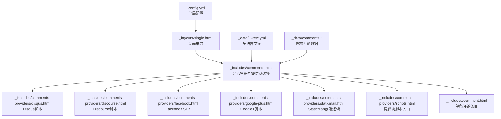
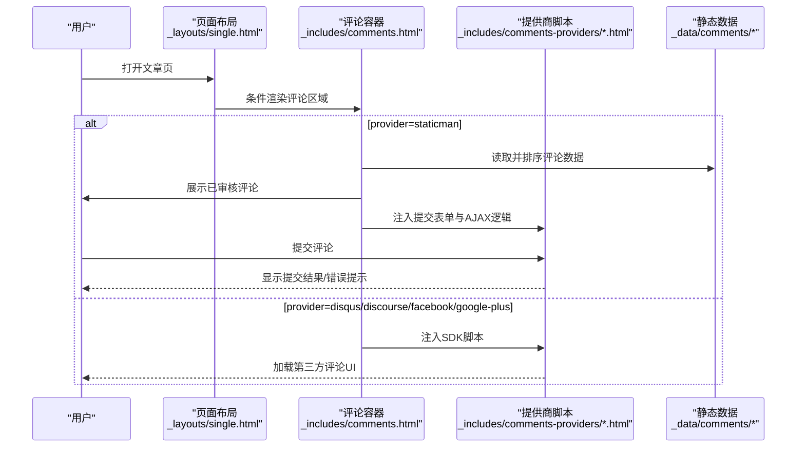
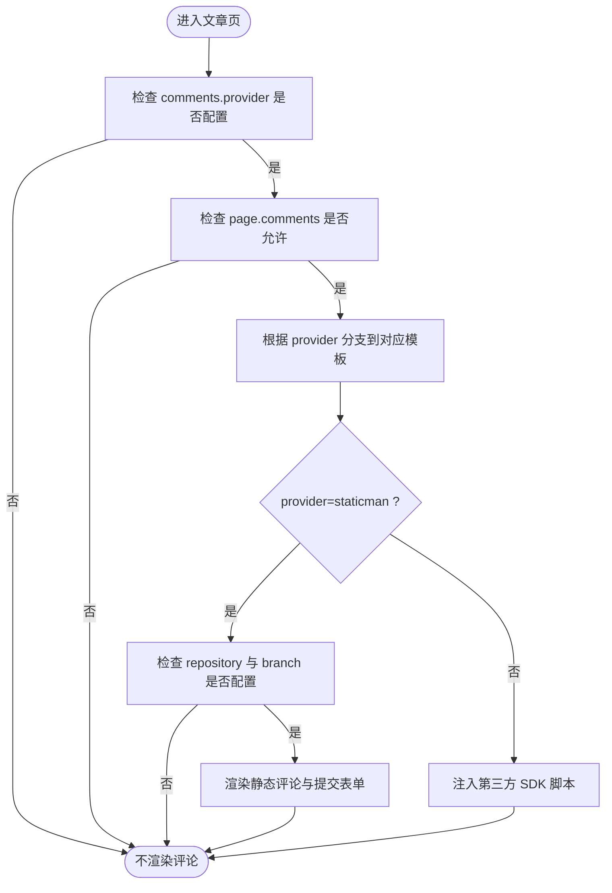
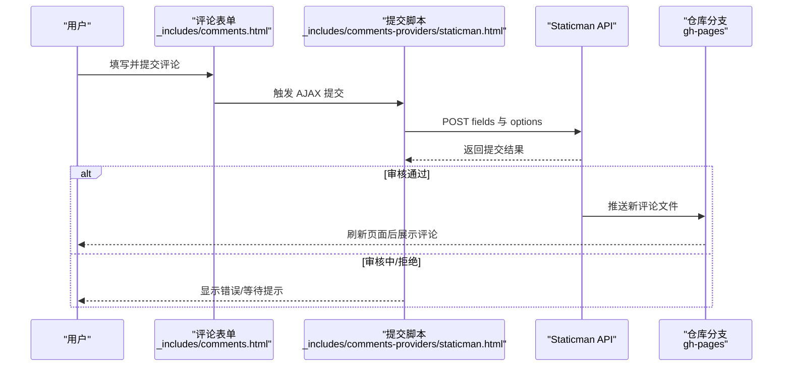
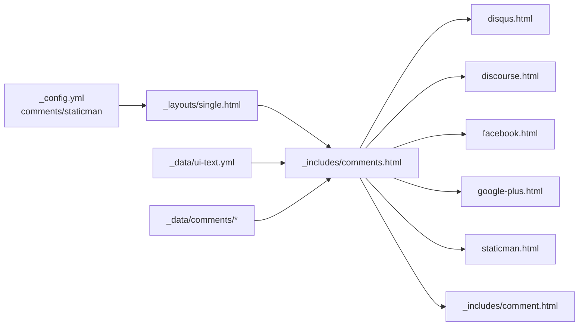

# 功能和评论配置

<cite>
**本文引用的文件**
- [_config.yml](file://_config.yml)
- [comments.html](file://_includes/comments.html)
- [comment.html](file://_includes/comment.html)
- [disqus.html](file://_includes/comments-providers/disqus.html)
- [discourse.html](file://_includes/comments-providers/discourse.html)
- [facebook.html](file://_includes/comments-providers/facebook.html)
- [google-plus.html](file://_includes/comments-providers/google-plus.html)
- [staticman.html](file://_includes/comments-providers/staticman.html)
- [scripts.html](file://_includes/comments-providers/scripts.html)
- [ui-text.yml](file://_data/ui-text.yml)
- [single.html](file://_layouts/single.html)
- [comment-1470942205700.yml](file://_data/comments/welcome-to-jekyll/comment-1470942205700.yml)
- [comment-1470944006665.yml](file://_data/comments/layout-comments/comment-1470944006665.yml)
</cite>

## 目录
1. [简介](#简介)
2. [项目结构](#项目结构)
3. [核心组件](#核心组件)
4. [架构总览](#架构总览)
5. [详细组件分析](#详细组件分析)
6. [依赖关系分析](#依赖关系分析)
7. [性能考量](#性能考量)
8. [故障排除指南](#故障排除指南)
9. [结论](#结论)
10. [附录](#附录)

## 简介
本文件面向网站功能与评论系统的配置与使用，重点覆盖评论模块的启用条件、各评论提供商的配置参数与集成方式，以及静态评论系统 Staticman 的完整配置与部署要点。读者将获得：
- 各评论提供商（Disqus、Discourse、Facebook、Google Plus、Staticman、Custom）的参数说明与启用流程
- Staticman 的分支策略、字段映射、审核机制、路径与文件命名规则
- 评论系统的启用条件与安全注意事项
- 完整的配置示例与集成步骤
- 常见问题排查与性能优化建议
- 如何根据自身需求选择与配置最适合的评论系统

## 项目结构
评论系统相关的核心文件分布如下：
- 全局配置：_config.yml 中的 comments 与 staticman 段落
- 页面集成：_layouts/single.html 在满足条件时渲染评论区域
- 评论模板与提供商：_includes/comments.html 与 _includes/comments-providers/*
- 评论条目渲染：_includes/comment.html
- 多语言文案：_data/ui-text.yml
- 示例评论数据：_data/comments/*/comment-*.yml

图表来源
- [_config.yml](file://_config.yml)
- [single.html](file://_layouts/single.html)
- [comments.html](file://_includes/comments.html)
- [disqus.html](file://_includes/comments-providers/disqus.html)
- [discourse.html](file://_includes/comments-providers/discourse.html)
- [facebook.html](file://_includes/comments-providers/facebook.html)
- [google-plus.html](file://_includes/comments-providers/google-plus.html)
- [staticman.html](file://_includes/comments-providers/staticman.html)
- [scripts.html](file://_includes/comments-providers/scripts.html)
- [comment.html](file://_includes/comment.html)
- [ui-text.yml](file://_data/ui-text.yml)
- [comment-1470942205700.yml](file://_data/comments/welcome-to-jekyll/comment-1470942205700.yml)

章节来源
- [_config.yml](file://_config.yml)
- [single.html](file://_layouts/single.html)
- [comments.html](file://_includes/comments.html)

## 核心组件
- 全局评论配置段落：comments.provider 与各提供商子段；staticman 段落定义字段、分支、路径、格式、审核等
- 页面布局集成点：当站点启用评论且页面允许评论时，渲染评论区域
- 评论容器与提供商选择：根据 provider 分支到具体提供商模板
- 单条评论条目：统一渲染头像、作者、时间与内容
- 多语言文案：评论标题、表单提示、按钮文本、成功/错误消息等
- 静态评论数据：按页面 slug 组织的 YAML 文件，用于展示已审核评论

章节来源
- [_config.yml](file://_config.yml)
- [single.html](file://_layouts/single.html)
- [comments.html](file://_includes/comments.html)
- [comment.html](file://_includes/comment.html)
- [ui-text.yml](file://_data/ui-text.yml)
- [comment-1470942205700.yml](file://_data/comments/welcome-to-jekyll/comment-1470942205700.yml)

## 架构总览
评论系统采用“配置驱动 + 模板分支”的架构：
- 配置层：_config.yml 决定启用哪个提供商与提供商参数
- 布局层：_layouts/single.html 在满足条件时包含评论容器
- 容器层：_includes/comments.html 根据 provider 渲染对应提供商的 UI 与脚本
- 数据层：静态评论存储于 _data/comments 下，按页面 slug 组织；或由第三方提供商托管
- 脚本层：_includes/comments-providers/*.html 注入相应 SDK 或 AJAX 提交逻辑

图表来源
- [single.html](file://_layouts/single.html)
- [comments.html](file://_includes/comments.html)
- [disqus.html](file://_includes/comments-providers/disqus.html)
- [discourse.html](file://_includes/comments-providers/discourse.html)
- [facebook.html](file://_includes/comments-providers/facebook.html)
- [google-plus.html](file://_includes/comments-providers/google-plus.html)
- [staticman.html](file://_includes/comments-providers/staticman.html)
- [comment-1470942205700.yml](file://_data/comments/welcome-to-jekyll/comment-1470942205700.yml)

## 详细组件分析

### 启用条件与控制流
- 布局条件：仅当站点配置了 comments.provider 且页面允许评论（page.comments）时，才渲染评论区域
- 容器分支：根据 comments.provider 的值，渲染对应提供商的 UI 与脚本
- Staticman 特例：除 provider 条件外，还需满足仓库与分支配置，否则不渲染

图表来源
- [single.html](file://_layouts/single.html)
- [comments.html](file://_includes/comments.html)
- [_config.yml](file://_config.yml)

章节来源
- [single.html](file://_layouts/single.html)
- [comments.html](file://_includes/comments.html)
- [_config.yml](file://_config.yml)

### Disqus 集成
- 关键参数
  - comments.provider: 设置为 "disqus"
  - comments.disqus.shortname: 必填，Disqus 论坛短名称
- 行为说明
  - 渲染评论线程容器与计数脚本
  - 通过异步加载 Disqus 嵌入与计数脚本
- 安全与隐私
  - 使用 HTTPS 资源加载
  - 评论托管于第三方平台，遵循其隐私政策

章节来源
- [_config.yml](file://_config.yml)
- [disqus.html](file://_includes/comments-providers/disqus.html)
- [comments.html](file://_includes/comments.html)

### Discourse 集成
- 关键参数
  - comments.provider: 设置为 "discourse"
  - comments.discourse.server: 必填，Discourse 论坛域名（不含协议）
- 行为说明
  - 生成 canonical URL 并注入嵌入脚本
  - 通过 embed.js 将论坛讨论嵌入页面
- 安全与隐私
  - 使用 HTTPS 资源加载
  - 评论托管于第三方平台

章节来源
- [_config.yml](file://_config.yml)
- [discourse.html](file://_includes/comments-providers/discourse.html)
- [comments.html](file://_includes/comments.html)

### Facebook 集成
- 关键参数
  - comments.provider: 设置为 "facebook"
  - comments.facebook.appid: 可选，应用 ID（用于增强功能）
  - comments.facebook.num_posts: 可选，显示评论数量，默认 5
  - comments.facebook.colorscheme: 可选，"light"/"dark"，默认 "light"
- 行为说明
  - 渲染 fb-comments 容器，通过 SDK 加载评论插件
- 安全与隐私
  - 使用官方 SDK，遵循 Facebook 平台政策

章节来源
- [_config.yml](file://_config.yml)
- [facebook.html](file://_includes/comments-providers/facebook.html)
- [comments.html](file://_includes/comments.html)

### Google Plus 集成
- 关键参数
  - comments.provider: 设置为 "google-plus"
- 行为说明
  - 注入 Google+ 评论小部件脚本
- 注意事项
  - Google+ 已停止对公众开放，此提供商可能无法使用

章节来源
- [_config.yml](file://_config.yml)
- [google-plus.html](file://_includes/comments-providers/google-plus.html)
- [comments.html](file://_includes/comments.html)

### Staticman 静态评论系统
- 总体目标
  - 将评论作为静态文件提交至仓库，经审核后发布，避免第三方依赖
- 关键参数（来自 staticman 段落）
  - allowedFields: ['name', 'email', 'url', 'message']（允许提交的字段）
  - branch: "gh-pages"（提交目标分支）
  - commitMessage: "New comment."（提交信息）
  - filename: "comment-{@timestamp}"（文件名模板）
  - format: "yml"（输出格式）
  - moderation: true（是否开启审核）
  - path: "_data/comments/{options.slug}"（评论数据存放路径模板）
  - requiredFields: ['name', 'email', 'message']（必填字段）
  - transforms: email -> md5（邮箱转换为头像哈希）
  - generatedFields: date（自动生成 ISO8601 时间戳）
- 提交流程
  - 表单 action 指向 Staticman API：https://api.staticman.net/v1/entry/{repository}/{branch}
  - 提交字段：fields[name]/fields[email]/fields[url]/fields[message]，以及 options[slug] 与 fields[hidden]
  - 成功/失败反馈：通过前端脚本更新按钮状态与提示框
- 数据组织
  - 评论数据按页面 slug 存放于 _data/comments/{slug}/ 下，文件名由 filename 模板生成
  - 渲染时按文件名排序展示，使用 Gravatar 头像（基于 md5）
- 安全与合规
  - 通过 requiredFields 与 transforms 控制输入质量与隐私
  - moderation=true 时，评论需人工审核后才会出现在页面
- 多语言支持
  - 表单标题、提示、按钮文本与成功/错误消息均来自 ui-text.yml 的本地化键

图表来源
- [comments.html](file://_includes/comments.html)
- [staticman.html](file://_includes/comments-providers/staticman.html)
- [_config.yml](file://_config.yml)
- [ui-text.yml](file://_data/ui-text.yml)

章节来源
- [_config.yml](file://_config.yml)
- [comments.html](file://_includes/comments.html)
- [staticman.html](file://_includes/comments-providers/staticman.html)
- [comment.html](file://_includes/comment.html)
- [ui-text.yml](file://_data/ui-text.yml)
- [comment-1470942205700.yml](file://_data/comments/welcome-to-jekyll/comment-1470942205700.yml)

### Custom 自定义评论
- 关键参数
  - comments.provider: 设置为 "custom"
- 行为说明
  - 渲染空评论区，由自定义脚本负责加载与交互
- 使用场景
  - 需要完全自定义 UI/UX 或集成自有服务时

章节来源
- [_config.yml](file://_config.yml)
- [scripts.html](file://_includes/comments-providers/scripts.html)
- [comments.html](file://_includes/comments.html)

## 依赖关系分析
- 配置依赖
  - comments.provider 决定渲染与脚本注入
  - staticman.* 参数影响提交行为与数据存储位置
- 运行时依赖
  - Staticman：需要有效的 repository 与 branch
  - 第三方提供商：需要正确的域名/短名称/应用 ID
- 数据依赖
  - 静态评论：依赖 _data/comments/{slug}/ 下的 YAML 文件
  - 头像：依赖 Gravatar（基于 email 的 md5）

图表来源
- [_config.yml](file://_config.yml)
- [single.html](file://_layouts/single.html)
- [comments.html](file://_includes/comments.html)
- [disqus.html](file://_includes/comments-providers/disqus.html)
- [discourse.html](file://_includes/comments-providers/discourse.html)
- [facebook.html](file://_includes/comments-providers/facebook.html)
- [google-plus.html](file://_includes/comments-providers/google-plus.html)
- [staticman.html](file://_includes/comments-providers/staticman.html)
- [comment.html](file://_includes/comment.html)
- [ui-text.yml](file://_data/ui-text.yml)
- [comment-1470942205700.yml](file://_data/comments/welcome-to-jekyll/comment-1470942205700.yml)

章节来源
- [_config.yml](file://_config.yml)
- [single.html](file://_layouts/single.html)
- [comments.html](file://_includes/comments.html)

## 性能考量
- 减少第三方脚本阻塞
  - 将评论脚本置于页面底部或使用异步加载
  - 对于 Disqus/Discourse/Facebook，确保仅在需要时加载
- 静态评论优势
  - 无需额外请求第三方资源，减少首屏阻塞
  - 评论数据随站点构建，访问更快
- 缓存与压缩
  - 合理利用浏览器缓存与静态资源压缩
- 本地化与文案
  - 使用 ui-text.yml 的本地化键，避免重复加载外部资源

## 故障排除指南
- 评论未显示
  - 检查 comments.provider 是否正确设置
  - 检查页面是否允许评论（page.comments）
  - 对于 Staticman，确认 repository 与 branch 是否配置
- Staticman 提交失败
  - 确认 requiredFields 填写完整
  - 检查 branch 与 path 是否匹配仓库实际分支与目录
  - 若 moderation=true，需等待审核通过
- 头像不显示
  - 确保 email 字段存在且已做 md5 转换
  - 检查 Gravatar 可达性
- 第三方提供商异常
  - 检查域名/短名称/应用 ID 是否正确
  - 确认网络可访问对应 CDN

章节来源
- [_config.yml](file://_config.yml)
- [comments.html](file://_includes/comments.html)
- [staticman.html](file://_includes/comments-providers/staticman.html)
- [comment.html](file://_includes/comment.html)
- [ui-text.yml](file://_data/ui-text.yml)

## 结论
本项目提供了灵活的评论系统配置能力：既可快速接入成熟的第三方平台（Disqus、Discourse、Facebook），也可通过 Staticman 实现完全可控的静态评论方案。选择建议：
- 追求即插即用与成熟生态：Disqus 或 Discourse
- 强调隐私与可控性：Staticman（需配合审核与分支策略）
- 社交登录与社交化强：Facebook
- 仅作展示或已停止服务：Google Plus 不推荐

## 附录

### 配置示例与集成步骤
- 启用评论
  - 在页面 Front Matter 中设置 comments: true
  - 在站点配置中设置 comments.provider 为所需提供商
- Disqus
  - 设置 comments.disqus.shortname
- Discourse
  - 设置 comments.discourse.server
- Facebook
  - 可选设置 appid、num_posts、colorscheme
- Staticman
  - 设置 repository 与 branch
  - 配置 allowedFields、requiredFields、format、moderation、path、filename、transforms、generatedFields
  - 确保 _data/comments/{slug}/ 目录存在或允许自动创建
- Custom
  - 设置 comments.provider: custom，并在自定义脚本中实现评论加载与提交

章节来源
- [_config.yml](file://_config.yml)
- [single.html](file://_layouts/single.html)
- [comments.html](file://_includes/comments.html)
- [disqus.html](file://_includes/comments-providers/disqus.html)
- [discourse.html](file://_includes/comments-providers/discourse.html)
- [facebook.html](file://_includes/comments-providers/facebook.html)
- [staticman.html](file://_includes/comments-providers/staticman.html)
- [scripts.html](file://_includes/comments-providers/scripts.html)