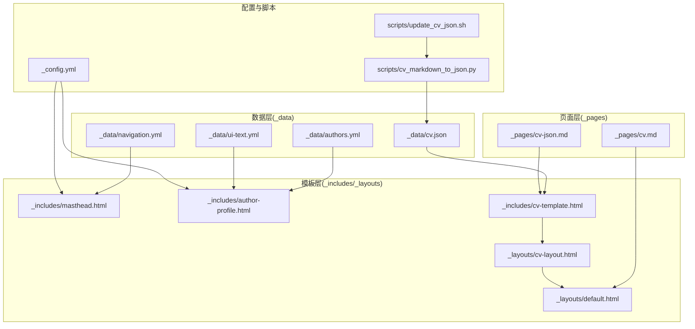
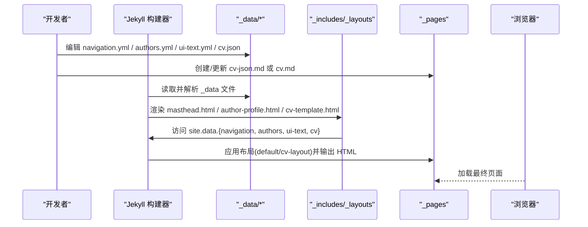
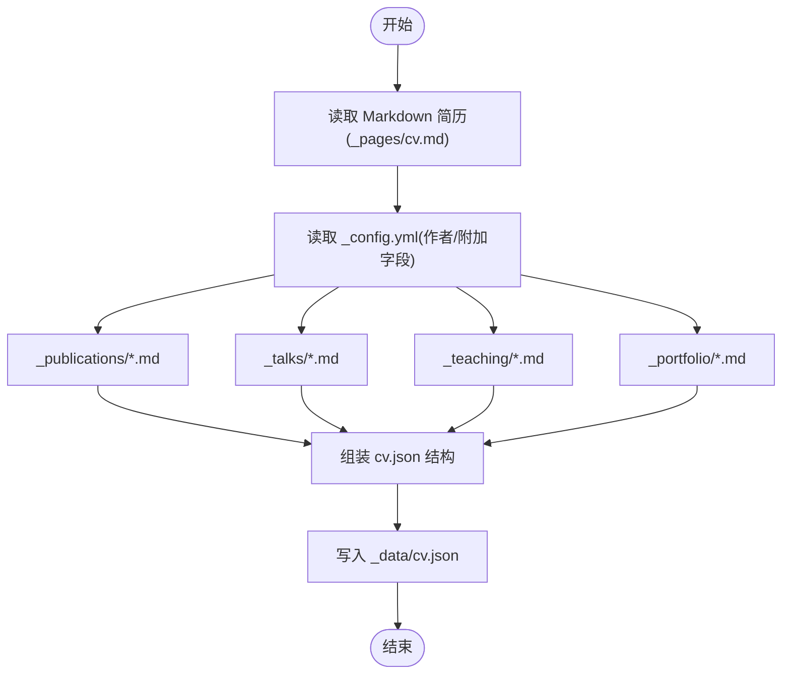
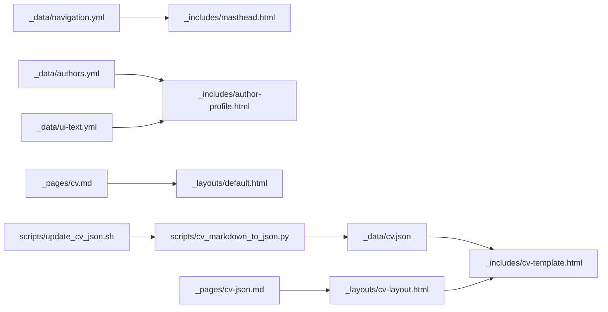

# 数据配置文件

<cite>
**本文引用的文件**
- [_data/navigation.yml](file://_data/navigation.yml)
- [_data/authors.yml](file://_data/authors.yml)
- [_data/ui-text.yml](file://_data/ui-text.yml)
- [_data/cv.json](file://_data/cv.json)
- [_config.yml](file://_config.yml)
- [_includes/masthead.html](file://_includes/masthead.html)
- [_includes/author-profile.html](file://_includes/author-profile.html)
- [_layouts/default.html](file://_layouts/default.html)
- [_layouts/cv-layout.html](file://_layouts/cv-layout.html)
- [_includes/cv-template.html](file://_includes/cv-template.html)
- [_pages/cv.md](file://_pages/cv.md)
- [_pages/cv-json.md](file://_pages/cv-json.md)
- [scripts/cv_markdown_to_json.py](file://scripts/cv_markdown_to_json.py)
- [scripts/update_cv_json.sh](file://scripts/update_cv_json.sh)
</cite>

## 目录
1. [简介](#简介)
2. [项目结构](#项目结构)
3. [核心组件](#核心组件)
4. [架构总览](#架构总览)
5. [详细组件分析](#详细组件分析)
6. [依赖关系分析](#依赖关系分析)
7. [性能考量](#性能考量)
8. [故障排查指南](#故障排查指南)
9. [结论](#结论)
10. [附录](#附录)

## 简介
本文件系统围绕 Jekyll 主题中的数据配置文件展开，重点覆盖以下方面：
- _data 目录下的导航、作者、界面文本与简历 JSON 的作用与用法
- navigation.yml 导航菜单的添加、排序与链接设置
- authors.yml 多作者支持与字段说明
- ui-text.yml 界面文本本地化配置
- cv.json 简历数据结构与生成流程
- 配置文件之间的依赖关系与数据传递机制
- 验证方法、常见错误排查与版本管理与备份建议

## 项目结构
本主题的数据配置主要位于 _data 目录，配合 _includes、_layouts、_pages 与 scripts 脚本共同完成渲染与展示。

图表来源
- [_data/navigation.yml:1-40](file://_data/navigation.yml#L1-L40)
- [_data/authors.yml:1-19](file://_data/authors.yml#L1-L19)
- [_data/ui-text.yml:1-355](file://_data/ui-text.yml#L1-L355)
- [_data/cv.json:1-153](file://_data/cv.json#L1-L153)
- [_includes/masthead.html:1-48](file://_includes/masthead.html#L1-L48)
- [_includes/author-profile.html:1-177](file://_includes/author-profile.html#L1-L177)
- [_layouts/default.html:1-32](file://_layouts/default.html#L1-L32)
- [_layouts/cv-layout.html:1-40](file://_layouts/cv-layout.html#L1-L40)
- [_includes/cv-template.html:1-311](file://_includes/cv-template.html#L1-L311)
- [_pages/cv.md:1-65](file://_pages/cv.md#L1-L65)
- [_pages/cv-json.md:1-18](file://_pages/cv-json.md#L1-L18)
- [scripts/cv_markdown_to_json.py:1-430](file://scripts/cv_markdown_to_json.py#L1-L430)
- [scripts/update_cv_json.sh:1-48](file://scripts/update_cv_json.sh#L1-L48)

章节来源
- [_data/navigation.yml:1-40](file://_data/navigation.yml#L1-L40)
- [_data/authors.yml:1-19](file://_data/authors.yml#L1-L19)
- [_data/ui-text.yml:1-355](file://_data/ui-text.yml#L1-L355)
- [_data/cv.json:1-153](file://_data/cv.json#L1-L153)
- [_includes/masthead.html:1-48](file://_includes/masthead.html#L1-L48)
- [_includes/author-profile.html:1-177](file://_includes/author-profile.html#L1-L177)
- [_layouts/default.html:1-32](file://_layouts/default.html#L1-L32)
- [_layouts/cv-layout.html:1-40](file://_layouts/cv-layout.html#L1-L40)
- [_includes/cv-template.html:1-311](file://_includes/cv-template.html#L1-L311)
- [_pages/cv.md:1-65](file://_pages/cv.md#L1-L65)
- [_pages/cv-json.md:1-18](file://_pages/cv-json.md#L1-L18)
- [scripts/cv_markdown_to_json.py:1-430](file://scripts/cv_markdown_to_json.py#L1-L430)
- [scripts/update_cv_json.sh:1-48](file://scripts/update_cv_json.sh#L1-L48)

## 核心组件
- 导航配置 navigation.yml：定义顶部导航栏的菜单项、子菜单与顺序；支持绝对/相对链接与外链识别。
- 作者配置 authors.yml：定义作者信息与社交/学术链接；支持多作者键空间。
- 界面文本 ui-text.yml：提供多语言界面文案与评论表单提示；按 locale 选择对应语言条目。
- 简历数据 cv.json：以 JSON 结构承载简历基本信息、教育、工作、技能、出版物、演讲、教学、作品集等；由 Markdown CV 与仓库内容自动生成。
- 模板与页面：masthead.html 渲染导航；author-profile.html 使用 authors.yml 与 ui-text.yml；cv-template.html 使用 cv.json 展示简历；cv-json.md 与 cv.md 分别指向 JSON 或 Markdown 简历页面。

章节来源
- [_data/navigation.yml:1-40](file://_data/navigation.yml#L1-L40)
- [_data/authors.yml:1-19](file://_data/authors.yml#L1-L19)
- [_data/ui-text.yml:1-355](file://_data/ui-text.yml#L1-L355)
- [_data/cv.json:1-153](file://_data/cv.json#L1-L153)
- [_includes/masthead.html:1-48](file://_includes/masthead.html#L1-L48)
- [_includes/author-profile.html:1-177](file://_includes/author-profile.html#L1-L177)
- [_includes/cv-template.html:1-311](file://_includes/cv-template.html#L1-L311)
- [_pages/cv-json.md:1-18](file://_pages/cv-json.md#L1-L18)
- [_pages/cv.md:1-65](file://_pages/cv.md#L1-L65)

## 架构总览
Jekyll 在构建阶段读取 _data 下的 YAML/JSON 文件，将其注入到 site.data 命名空间；模板通过 Liquid 语法访问这些数据，实现导航、作者信息与简历的动态渲染。

图表来源
- [_data/navigation.yml:1-40](file://_data/navigation.yml#L1-L40)
- [_data/authors.yml:1-19](file://_data/authors.yml#L1-L19)
- [_data/ui-text.yml:1-355](file://_data/ui-text.yml#L1-L355)
- [_data/cv.json:1-153](file://_data/cv.json#L1-L153)
- [_includes/masthead.html:1-48](file://_includes/masthead.html#L1-L48)
- [_includes/author-profile.html:1-177](file://_includes/author-profile.html#L1-L177)
- [_includes/cv-template.html:1-311](file://_includes/cv-template.html#L1-L311)
- [_layouts/default.html:1-32](file://_layouts/default.html#L1-L32)
- [_layouts/cv-layout.html:1-40](file://_layouts/cv-layout.html#L1-L40)
- [_pages/cv-json.md:1-18](file://_pages/cv-json.md#L1-L18)
- [_pages/cv.md:1-65](file://_pages/cv.md#L1-L65)

## 详细组件分析

### 导航配置 navigation.yml
- 作用：控制顶部导航栏的菜单项顺序、标题与链接；支持子菜单（children）。
- 关键点：
  - 菜单项顺序即显示顺序；删除项不会影响站点其他页面，仅不显示在头部导航。
  - 支持绝对链接（以 http 开头）与相对链接；模板会自动区分并拼接 base_path。
  - 仅保留一种简历入口（Markdown 或 JSON），避免重复或冲突。
- 字段说明（示例路径）：
  - [main 列表项:10-39](file://_data/navigation.yml#L10-L39)
  - [子菜单 children:25-33](file://_data/navigation.yml#L25-L33)
- 使用位置：
  - [masthead.html 中遍历 site.data.navigation.main:11-38](file://_includes/masthead.html#L11-L38)

章节来源
- [_data/navigation.yml:1-40](file://_data/navigation.yml#L1-L40)
- [_includes/masthead.html:1-48](file://_includes/masthead.html#L1-L48)

### 作者配置 authors.yml 与多作者支持
- 作用：为页面作者提供资料与社交/学术链接；若页面未指定作者，则回退到全局 _config.yml 的 author。
- 关键点：
  - 支持多作者键空间（如 Name Name: 与 Name2 Name2:）。
  - 模板会优先使用 page.author 对应的作者条目，否则使用 site.author。
  - 社交/学术字段按需显示，不存在则不渲染相应链接。
- 字段说明（示例路径）：
  - [作者条目结构:3-18](file://_data/authors.yml#L3-L18)
  - [全局 author 配置:24-84](file://_config.yml#L24-L84)
- 使用位置：
  - [author-profile.html 读取 authors 并渲染社交链接:3-174](file://_includes/author-profile.html#L3-L174)
  - [ui-text 用于界面标签（如“网站”“邮箱”）:34-37](file://_includes/author-profile.html#L34-L37)

章节来源
- [_data/authors.yml:1-19](file://_data/authors.yml#L1-L19)
- [_config.yml:24-84](file://_config.yml#L24-L84)
- [_includes/author-profile.html:1-177](file://_includes/author-profile.html#L1-L177)

### 界面文本本地化 ui-text.yml
- 作用：提供多语言界面文案与评论相关提示；按 site.locale 选择对应语言块。
- 关键点：
  - 默认语言块（如 en:）可被区域变体（如 en-US:）继承合并。
  - 包含分页、面包屑、目录、评论表单、标签/分类、日期、分享、加载等标签。
  - 可通过 site.data.ui-text[site.locale] 获取当前语言条目。
- 字段说明（示例路径）：
  - [默认英文块:5-42](file://_data/ui-text.yml#L5-L42)
  - [西班牙语块:53-89](file://_data/ui-text.yml#L53-L89)
  - [法语块:97-139](file://_data/ui-text.yml#L97-L139)
  - [土耳其语块:143-181](file://_data/ui-text.yml#L143-L181)
  - [巴西葡萄牙语块:185-225](file://_data/ui-text.yml#L185-L225)
  - [意大利语块:229-267](file://_data/ui-text.yml#L229-L267)
  - [简体中文块:271-307](file://_data/ui-text.yml#L271-L307)
  - [繁体中文块:313-351](file://_data/ui-text.yml#L313-L351)
- 使用位置：
  - [author-profile.html 中使用 ui-text 获取“网站/邮箱”标签:34-37](file://_includes/author-profile.html#L34-L37)

章节来源
- [_data/ui-text.yml:1-355](file://_data/ui-text.yml#L1-L355)
- [_includes/author-profile.html:1-177](file://_includes/author-profile.html#L1-L177)

### 简历数据 cv.json 与生成流程
- 作用：以 JSON 结构承载简历的完整信息，供 cv-template.html 动态渲染。
- 结构概览（示例路径）：
  - [basics 基本信息与联系方式:2-31](file://_data/cv.json#L2-L31)
  - [education 教育背景:34-61](file://_data/cv.json#L34-L61)
  - [publications 出版物:67-95](file://_data/cv.json#L67-L95)
  - [presentations 演讲/会议:97-125](file://_data/cv.json#L97-L125)
  - [teaching 教学经历:127-141](file://_data/cv.json#L127-L141)
  - [portfolio 作品集:143-151](file://_data/cv.json#L143-L151)
- 生成流程：
  - 从 Markdown 简历（_pages/cv.md）提取各节内容
  - 从 _config.yml 提取作者信息与附加字段
  - 从 _publications、_talks、_teaching、_portfolio 收集条目
  - 输出到 _data/cv.json
- 使用位置：
  - [cv-template.html 读取 site.data.cv 并渲染:1-311](file://_includes/cv-template.html#L1-L311)
  - [cv-json.md 引入 cv-template.html:1-18](file://_pages/cv-json.md#L1-L18)
  - [cv-layout.html 作为 JSON 版简历布局:1-40](file://_layouts/cv-layout.html#L1-L40)

图表来源
- [_pages/cv.md:1-65](file://_pages/cv.md#L1-L65)
- [_config.yml:24-84](file://_config.yml#L24-L84)
- [_data/cv.json:1-153](file://_data/cv.json#L1-L153)
- [scripts/cv_markdown_to_json.py:23-430](file://scripts/cv_markdown_to_json.py#L23-L430)
- [scripts/update_cv_json.sh:1-48](file://scripts/update_cv_json.sh#L1-L48)

章节来源
- [_data/cv.json:1-153](file://_data/cv.json#L1-L153)
- [_includes/cv-template.html:1-311](file://_includes/cv-template.html#L1-L311)
- [_pages/cv-json.md:1-18](file://_pages/cv-json.md#L1-L18)
- [_layouts/cv-layout.html:1-40](file://_layouts/cv-layout.html#L1-L40)
- [scripts/cv_markdown_to_json.py:1-430](file://scripts/cv_markdown_to_json.py#L1-L430)
- [scripts/update_cv_json.sh:1-48](file://scripts/update_cv_json.sh#L1-L48)

## 依赖关系分析
- navigation.yml → masthead.html：导航项来源于 site.data.navigation.main，模板遍历渲染。
- authors.yml → author-profile.html：作者信息来源于 site.data.authors[page.author] 或回退 site.author。
- ui-text.yml → author-profile.html：界面标签来源于 site.data.ui-text[site.locale]。
- cv.json → cv-template.html：简历内容来源于 site.data.cv。
- cv.md → cv-layout.html：Markdown 版简历页面采用 archive 布局。
- cv-json.md → cv-template.html：JSON 版简历页面采用 cv-layout.html 并引入 cv-template.html。
- scripts/cv_markdown_to_json.py → _data/cv.json：脚本生成 cv.json。
- scripts/update_cv_json.sh → scripts/cv_markdown_to_json.py：一键触发转换。

图表来源
- [_data/navigation.yml:1-40](file://_data/navigation.yml#L1-L40)
- [_includes/masthead.html:1-48](file://_includes/masthead.html#L1-L48)
- [_data/authors.yml:1-19](file://_data/authors.yml#L1-L19)
- [_includes/author-profile.html:1-177](file://_includes/author-profile.html#L1-L177)
- [_data/ui-text.yml:1-355](file://_data/ui-text.yml#L1-L355)
- [_data/cv.json:1-153](file://_data/cv.json#L1-L153)
- [_includes/cv-template.html:1-311](file://_includes/cv-template.html#L1-L311)
- [_pages/cv.md:1-65](file://_pages/cv.md#L1-L65)
- [_pages/cv-json.md:1-18](file://_pages/cv-json.md#L1-L18)
- [_layouts/default.html:1-32](file://_layouts/default.html#L1-L32)
- [_layouts/cv-layout.html:1-40](file://_layouts/cv-layout.html#L1-L40)
- [scripts/cv_markdown_to_json.py:1-430](file://scripts/cv_markdown_to_json.py#L1-L430)
- [scripts/update_cv_json.sh:1-48](file://scripts/update_cv_json.sh#L1-L48)

章节来源
- [_includes/masthead.html:1-48](file://_includes/masthead.html#L1-L48)
- [_includes/author-profile.html:1-177](file://_includes/author-profile.html#L1-L177)
- [_includes/cv-template.html:1-311](file://_includes/cv-template.html#L1-L311)
- [_layouts/default.html:1-32](file://_layouts/default.html#L1-L32)
- [_layouts/cv-layout.html:1-40](file://_layouts/cv-layout.html#L1-L40)
- [scripts/cv_markdown_to_json.py:1-430](file://scripts/cv_markdown_to_json.py#L1-L430)
- [scripts/update_cv_json.sh:1-48](file://scripts/update_cv_json.sh#L1-L48)

## 性能考量
- 导航与作者信息均为静态数据，渲染开销极低。
- cv.json 数据量较大时，建议：
  - 控制数组长度（教育/出版物/演讲等），避免一次性渲染过多节点。
  - 合理拆分页面或使用分页策略（若适用）。
  - 使用压缩与缓存策略减少传输体积（Jekyll 已启用压缩）。
- 本地化文本按 locale 选择，建议仅启用所需语言，减少文件体积。

## 故障排查指南
- 导航不显示或链接异常
  - 检查 navigation.yml 的 main 列表项是否正确缩进与命名。
  - 检查 masthead.html 中对 site.data.navigation.main 的遍历逻辑。
  - 参考：[_data/navigation.yml:10-39](file://_data/navigation.yml#L10-L39)、[_includes/masthead.html:11-38](file://_includes/masthead.html#L11-L38)
- 作者信息未显示或链接缺失
  - 确认 authors.yml 中存在 page.author 对应条目，或检查 _config.yml 的 author 是否设置。
  - 检查 author-profile.html 中的字段是否存在。
  - 参考：[_data/authors.yml:3-18](file://_data/authors.yml#L3-L18)、[_config.yml:24-84](file://_config.yml#L24-L84)、[_includes/author-profile.html:3-174](file://_includes/author-profile.html#L3-L174)
- 界面文本未按预期显示
  - 检查 _config.yml 的 locale 设置是否与 ui-text.yml 中的语言键一致。
  - 确认 ui-text.yml 中对应语言块存在且键名正确。
  - 参考：[_config.yml](file://_config.yml#L10)、[_data/ui-text.yml:5-42](file://_data/ui-text.yml#L5-L42)
- 简历 JSON 未更新或渲染为空
  - 执行 update_cv_json.sh 触发转换脚本，确认 cv_markdown_to_json.py 正常运行。
  - 检查 cv.json 结构是否完整，必要字段是否存在。
  - 参考：[scripts/update_cv_json.sh:27-45](file://scripts/update_cv_json.sh#L27-L45)、[scripts/cv_markdown_to_json.py:367-412](file://scripts/cv_markdown_to_json.py#L367-L412)、[_data/cv.json:1-153](file://_data/cv.json#L1-L153)
- 页面布局与样式异常
  - 确认 cv-json.md 使用 cv-layout.html，cv.md 使用 archive 布局。
  - 参考：[_pages/cv-json.md:1-18](file://_pages/cv-json.md#L1-L18)、[_pages/cv.md:1-65](file://_pages/cv.md#L1-L65)、[_layouts/cv-layout.html:1-40](file://_layouts/cv-layout.html#L1-L40)、[_layouts/default.html:1-32](file://_layouts/default.html#L1-L32)

章节来源
- [_data/navigation.yml:1-40](file://_data/navigation.yml#L1-L40)
- [_includes/masthead.html:1-48](file://_includes/masthead.html#L1-L48)
- [_data/authors.yml:1-19](file://_data/authors.yml#L1-L19)
- [_config.yml](file://_config.yml#L10)
- [_data/ui-text.yml:1-355](file://_data/ui-text.yml#L1-L355)
- [_data/cv.json:1-153](file://_data/cv.json#L1-L153)
- [_pages/cv-json.md:1-18](file://_pages/cv-json.md#L1-L18)
- [_pages/cv.md:1-65](file://_pages/cv.md#L1-L65)
- [_layouts/cv-layout.html:1-40](file://_layouts/cv-layout.html#L1-L40)
- [_layouts/default.html:1-32](file://_layouts/default.html#L1-L32)
- [scripts/update_cv_json.sh:1-48](file://scripts/update_cv_json.sh#L1-L48)
- [scripts/cv_markdown_to_json.py:1-430](file://scripts/cv_markdown_to_json.py#L1-L430)

## 结论
本主题通过 _data 下的导航、作者、界面文本与简历 JSON 实现高度模块化的数据驱动渲染。navigation.yml 控制导航，authors.yml 与 ui-text.yml 协同提供作者信息与本地化文案，cv.json 由 Markdown 与仓库内容自动生成并由 cv-template.html 动态展示。合理的配置与脚本流程保证了内容的一致性与可维护性。

## 附录

### 配置文件字段速查与示例路径
- 导航 navigation.yml
  - [main 列表项:10-39](file://_data/navigation.yml#L10-L39)
  - [子菜单 children:25-33](file://_data/navigation.yml#L25-L33)
- 作者 authors.yml
  - [作者条目结构:3-18](file://_data/authors.yml#L3-L18)
- 界面文本 ui-text.yml
  - [默认英文块:5-42](file://_data/ui-text.yml#L5-L42)
  - [简体中文块:271-307](file://_data/ui-text.yml#L271-L307)
- 简历 cv.json
  - [basics 基本信息:2-31](file://_data/cv.json#L2-L31)
  - [education 教育:34-61](file://_data/cv.json#L34-L61)
  - [publications 出版物:67-95](file://_data/cv.json#L67-L95)
  - [presentations 演讲:97-125](file://_data/cv.json#L97-L125)
  - [teaching 教学:127-141](file://_data/cv.json#L127-L141)
  - [portfolio 作品集:143-151](file://_data/cv.json#L143-L151)

### 验证清单
- 导航：确认 navigation.yml 缩进与键名正确，masthead.html 能遍历 main。
- 作者：确认 authors.yml 存在 page.author 条目或 _config.yml 的 author 设置。
- 本地化：确认 _config.yml 的 locale 与 ui-text.yml 语言键一致。
- 简历：执行 update_cv_json.sh，确认 cv.json 更新成功，cv-template.html 能渲染。

### 版本管理与备份建议
- 将 _data 下的 navigation.yml、authors.yml、ui-text.yml、cv.json 纳入版本控制。
- 对重要变更（如新增语言、作者字段、简历结构）进行注释记录。
- 建议在修改前备份当前版本，修改后对比差异并提交。
- 对 cv.json 的生成脚本与脚本执行日志进行归档，便于回溯。