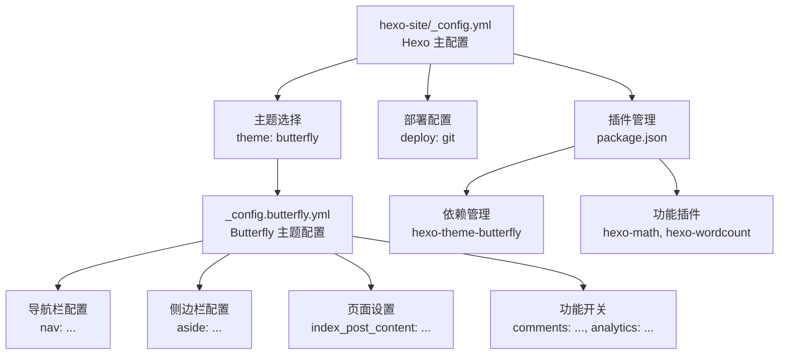

# 核心站点配置

<cite>
**本文引用的文件**
- [hexo-site/_config.yml](file://hexo-site/_config.yml)
- [hexo-site/_config.butterfly.yml](file://hexo-site/_config.butterfly.yml)
- [hexo-site/package.json](file://hexo-site/package.json)
- [hexo-site/.github/dependabot.yml](file://hexo-site/.github/dependabot.yml)
- [hexo-site/source/_posts/2025-03-11-useful-website.md](file://hexo-site/source/_posts/2025-03-11-useful-website.md)
- [hexo-site/source/cv/index.md](file://hexo-site/source/cv/index.md)
- [hexo-site/source/portfolio/index.md](file://hexo-site/source/portfolio/index.md)
- [hexo-site/source/publications/index.md](file://hexo-site/source/publications/index.md)
- [hexo-site/source/talks/index.md](file://hexo-site/source/talks/index.md)
- [README.md](file://README.md)
</cite>

## 更新摘要
**所做更改**
- 新增 Hexo 配置系统的完整说明，包括 _config.yml 和主题配置分离管理
- 添加 Butterfly 主题的详细配置选项和最佳实践
- 更新依赖管理和自动化配置
- 新增 Hexo 内容管理和页面类型配置
- 提供 Hexo 与传统 Jekyll 配置的对比分析

## 目录
1. [简介](#简介)
2. [Hexo 配置系统概览](#hexo-配置系统概览)
3. [站点基本信息配置](#站点基本信息配置)
4. [主题与外观配置](#主题与外观配置)
5. [内容管理配置](#内容管理配置)
6. [部署与自动化](#部署与自动化)
7. [Hexo 配置详解](#hexo-配置详解)
8. [配置验证与故障排查](#配置验证与故障排查)
9. [最佳实践建议](#最佳实践建议)
10. [总结](#总结)

## 简介
本文档针对使用 Hexo + Butterfly 主题的个人学术主页，系统性地解释核心站点配置文件的各个组成部分。Hexo 作为新一代静态网站生成器，提供了比传统 Jekyll 更加灵活和强大的配置体系。本文档将详细说明站点基本信息、主题配置、内容管理、部署自动化等关键配置项，为初学者提供清晰的入门指导，同时为高级用户提供深度定制选项。

## Hexo 配置系统概览
Hexo 配置系统采用 YAML 格式，主要包含两个核心配置文件：主配置文件和主题配置文件。这种分离的设计使得站点配置更加模块化和易于维护。



**图表来源**
- [hexo-site/_config.yml:119](file://hexo-site/_config.yml#L119)
- [hexo-site/_config.butterfly.yml:1-459](file://hexo-site/_config.butterfly.yml#L1-L459)
- [hexo-site/package.json:14-33](file://hexo-site/package.json#L14-L33)

## 站点基本信息配置
Hexo 的站点基本信息配置位于主配置文件中，涵盖了网站的核心元数据和基础设置。

### 基础信息设置
- **title**: 网站标题，用于页面标题和 SEO 元信息
- **subtitle**: 网站副标题，通常用于国际化场景
- **description**: 网站描述，用于 SEO 优化
- **keywords**: 关键词列表，多个关键词用逗号分隔
- **author**: 作者名称，显示在页面元信息中

### 语言与时区配置
- **language**: 网站语言设置，默认为 zh-CN
- **timezone**: 时区设置，影响日期显示和生成

### URL 与链接配置
- **url**: 网站根 URL，部署时必须正确配置
- **permalink**: 文章链接格式，支持多种变量
- **permalink_defaults**: 链接格式默认值

**章节来源**
- [hexo-site/_config.yml:9-28](file://hexo-site/_config.yml#L9-L28)
- [hexo-site/_config.yml:33-41](file://hexo-site/_config.yml#L33-L41)

## 主题与外观配置
Butterfly 主题提供了丰富的外观定制选项，通过专门的主题配置文件进行管理。

### 主题选择与基础设置
- **theme**: 指定使用的主题为 butterfly
- **live2d**: Live2D 动态效果开关，当前禁用

### 导航栏配置
导航栏是用户访问网站的主要入口，Butterfly 提供了灵活的配置选项：

- **logo**: 网站 Logo 图片路径
- **display_title**: 是否显示网站标题
- **display_post_title**: 是否显示文章标题
- **fixed**: 导航栏是否固定在顶部

### 导航菜单配置
菜单项采用 YAML 数组格式，支持图标和自定义链接：

```yaml
menu:
  首页: / || fas fa-home
  博客: /archives/ || fas fa-archive
  简历: /cv/ || fas fa-file-alt
```

### 社交媒体链接
支持多种社交平台的链接配置，包括 GitHub、邮箱等常用平台。

**章节来源**
- [hexo-site/_config.yml:119](file://hexo-site/_config.yml#L119)
- [hexo-site/_config.butterfly.yml:10-41](file://hexo-site/_config.butterfly.yml#L10-L41)

## 内容管理配置
Hexo 的内容管理基于文件系统，通过 Front Matter 和目录结构来组织内容。

### 目录结构配置
- **source_dir**: 源文件目录，默认为 source
- **public_dir**: 生成文件目录，默认为 public
- **tag_dir/category_dir**: 标签和分类目录
- **archive_dir**: 归档目录
- **code_dir**: 代码下载目录
- **i18n_dir**: 国际化目录

### 写作设置
- **new_post_name**: 新文章文件名格式
- **default_layout**: 默认布局类型
- **titlecase**: 标题大小写转换
- **external_link**: 外部链接处理设置

### 分页与排序
- **per_page**: 每页文章数量
- **order_by**: 文章排序方式
- **pagination_dir**: 分页目录名

**章节来源**
- [hexo-site/_config.yml:43-66](file://hexo-site/_config.yml#L43-L66)
- [hexo-site/_config.yml:82-85](file://hexo-site/_config.yml#L82-L85)
- [hexo-site/_config.yml:105-108](file://hexo-site/_config.yml#L105-L108)

## 部署与自动化
Hexo 支持一键部署到 GitHub Pages，配合 GitHub Actions 实现自动化部署。

### 部署配置
- **type**: 部署类型，使用 git 方式
- **repo**: GitHub 仓库地址
- **branch**: 部署分支，通常为 main
- **message**: 提交信息模板

### GitHub Actions 工作流
工作流包含完整的部署流程：
1. 检出代码
2. 安装 Node.js 环境
3. 安装 npm 依赖
4. 生成静态文件
5. 部署到 GitHub Pages

**章节来源**
- [hexo-site/_config.yml:137-141](file://hexo-site/_config.yml#L137-L141)
- [.github/workflows/deploy.yml:18-45](file://.github/workflows/deploy.yml#L18-L45)

## Hexo 配置详解

### 导航栏详细配置
Butterfly 主题的导航栏配置非常灵活，支持多种定制选项：

#### Logo 设置
- **logo**: Logo 图片路径，支持相对路径
- **display_title**: 控制是否显示网站标题

#### 导航行为
- **fixed**: 固定导航栏，滚动时保持可见
- **display_post_title**: 控制是否显示文章标题

#### 菜单项格式
每个菜单项包含三个部分：
```yaml
菜单名: /路径/ || 图标类名
```

**章节来源**
- [hexo-site/_config.butterfly.yml:10-35](file://hexo-site/_config.butterfly.yml#L10-L35)

### 侧边栏配置详解
侧边栏是 Butterfly 主题的重要特色，提供丰富的信息展示功能。

#### 侧边栏基础设置
- **enable**: 是否启用侧边栏
- **hide**: 是否默认隐藏侧边栏
- **button**: 是否显示侧边栏切换按钮
- **mobile**: 移动端是否显示侧边栏
- **position**: 侧边栏位置（left/right）

#### 作者信息卡片
- **description**: 个人简介文字
- **button**: Follow Me 按钮设置

#### 功能卡片配置
Butterfly 提供多种侧边栏卡片：
- **card_recent_post**: 最新文章卡片
- **card_categories**: 分类卡片
- **card_tags**: 标签卡片
- **card_archives**: 归档卡片
- **card_webinfo**: 网站信息卡片

**章节来源**
- [hexo-site/_config.butterfly.yml:88-144](file://hexo-site/_config.butterfly.yml#L88-L144)

### 页面功能配置
Butterfly 主题提供了丰富的页面功能配置选项。

#### 代码块设置
- **theme**: 代码块主题（light/dark）
- **copy**: 是否显示复制按钮
- **language**: 是否显示语言标识
- **shrink**: 是否启用折叠功能

#### 分页设置
- **enable**: 是否启用分页
- **total**: 每页显示数量
- **type**: 分页类型
- **prev_text/next_text**: 上一页下一页文本

#### 搜索功能
支持两种搜索方式：
- **algolia_search**: Algolia 搜索服务
- **local_search**: 本地搜索功能

**章节来源**
- [hexo-site/_config.butterfly.yml:155-250](file://hexo-site/_config.butterfly.yml#L155-L250)

### 主题功能配置
Butterfly 主题还提供了许多高级功能配置。

#### 深色模式
- **enable**: 是否启用深色模式
- **button**: 是否显示深色模式切换按钮

#### 简繁转换
- **enable**: 是否启用简繁转换
- **default**: 默认语言版本
- **defaultEncoding**: 编码设置

#### 右侧按钮
- **hide**: 隐藏的按钮列表
- **show**: 显示的按钮列表

#### 阅读模式
- **readmode**: 是否启用阅读模式

#### 目录功能
- **enable**: 是否启用目录
- **depth**: 目录层级深度
- **list_number**: 是否显示编号

**章节来源**
- [hexo-site/_config.butterfly.yml:265-323](file://hexo-site/_config.butterfly.yml#L265-L323)

## 配置验证与故障排查

### 常见配置问题
1. **部署链接错误**
   - 检查 url 配置是否正确
   - 确认 GitHub Pages 设置中的源分支

2. **主题样式异常**
   - 确认主题版本兼容性
   - 检查 CSS 文件是否正确加载

3. **导航菜单不显示**
   - 验证菜单项格式是否正确
   - 检查图标类名是否有效

### 配置验证步骤
1. 运行 `npm run build` 验证配置语法
2. 使用 `npm run server` 在本地预览
3. 检查浏览器控制台是否有错误信息
4. 验证关键页面的渲染效果

### 调试技巧
- 使用 `--debug` 参数获取详细日志
- 逐步注释配置项定位问题
- 检查网络面板确认资源加载
- 验证移动端适配效果

## 最佳实践建议

### 配置组织建议
1. **模块化配置**：将相关配置分组管理
2. **版本控制**：定期备份重要配置文件
3. **文档记录**：为重要配置添加注释说明
4. **测试验证**：每次修改后进行本地测试

### 性能优化建议
1. **资源优化**：压缩图片和静态资源
2. **CDN 使用**：为外部资源使用 CDN
3. **缓存策略**：合理设置浏览器缓存
4. **懒加载**：对图片和重资源启用懒加载

### 安全考虑
1. **依赖更新**：定期更新主题和插件版本
2. **敏感信息**：避免在配置中硬编码敏感信息
3. **权限控制**：合理设置 GitHub 仓库权限
4. **备份策略**：建立完整的数据备份机制

## 总结
Hexo + Butterfly 主题的配置体系相比传统 Jekyll 提供了更加强大和灵活的功能。通过合理的配置管理、模块化的主题设置和自动化的部署流程，可以构建出功能完善、性能优秀的个人学术主页。建议用户根据自身需求选择合适的配置选项，同时保持配置文件的良好组织和文档化，以便于后续的维护和升级。

在实际使用中，建议优先掌握基础配置，然后逐步探索高级功能。遇到问题时，可以参考官方文档和社区资源，同时利用本地开发环境进行充分测试，确保配置变更的稳定性和可靠性。