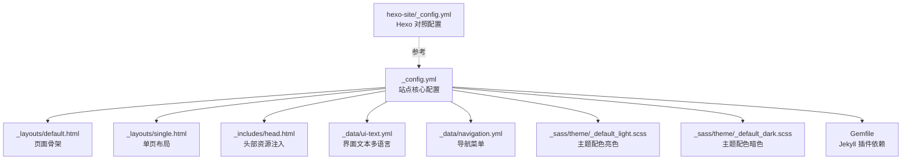
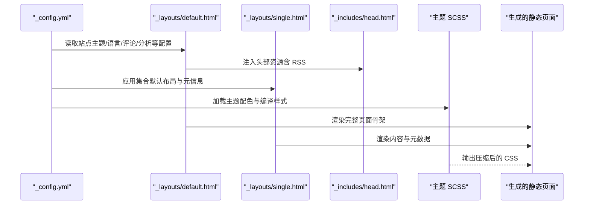
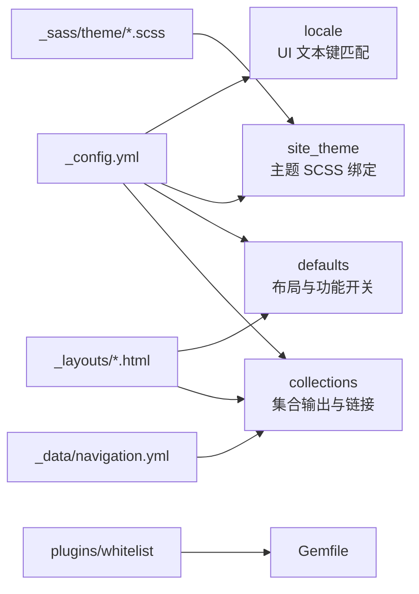

# 核心站点配置

<cite>
**本文引用的文件**
- [_config.yml](file://_config.yml)
- [Gemfile](file://Gemfile)
- [_layouts/default.html](file://_layouts/default.html)
- [_layouts/single.html](file://_layouts/single.html)
- [_includes/head.html](file://_includes/head.html)
- [_data/ui-text.yml](file://_data/ui-text.yml)
- [_data/navigation.yml](file://_data/navigation.yml)
- [_sass/theme/_default_light.scss](file://_sass/theme/_default_light.scss)
- [_sass/theme/_default_dark.scss](file://_sass/theme/_default_dark.scss)
- [hexo-site/_config.yml](file://hexo-site/_config.yml)
</cite>

## 目录
1. [简介](#简介)
2. [项目结构](#项目结构)
3. [核心组件](#核心组件)
4. [架构总览](#架构总览)
5. [详细组件分析](#详细组件分析)
6. [依赖关系分析](#依赖关系分析)
7. [性能考量](#性能考量)
8. [故障排查指南](#故障排查指南)
9. [结论](#结论)
10. [附录](#附录)

## 简介
本文件面向使用 Jekyll 主题的个人学术主页，系统性梳理与解释核心站点配置文件中的关键参数，涵盖站点基本信息、主题与外观、语言与本地化、评论与统计、集合与默认布局、Sass 编译、插件与部署等。文档以“初学者友好、高级用户深入”为目标，提供配置项说明、可选值范围、默认值、相互依赖关系、验证方法与常见问题排查建议，并辅以可视化图示帮助理解。

## 项目结构
该站点采用 Jekyll 模板，核心配置集中在根目录的配置文件中；同时存在一个 Hexo 子站点配置用于对比参考。主题样式通过 SCSS 主题文件控制，界面文本通过多语言数据文件管理，导航菜单由独立数据文件定义。

图表来源
- [_config.yml:1-362](file://_config.yml#L1-L362)
- [_layouts/default.html:1-32](file://_layouts/default.html#L1-L32)
- [_layouts/single.html:1-110](file://_layouts/single.html#L1-L110)
- [_includes/head.html:1-17](file://_includes/head.html#L1-L17)
- [_data/ui-text.yml:1-355](file://_data/ui-text.yml#L1-L355)
- [_data/navigation.yml:1-40](file://_data/navigation.yml#L1-L40)
- [_sass/theme/_default_light.scss:1-49](file://_sass/theme/_default_light.scss#L1-L49)
- [_sass/theme/_default_dark.scss:1-57](file://_sass/theme/_default_dark.scss#L1-L57)
- [Gemfile:1-14](file://Gemfile#L1-L14)
- [hexo-site/_config.yml:1-110](file://hexo-site/_config.yml#L1-L110)

章节来源
- [_config.yml:1-362](file://_config.yml#L1-L362)
- [Gemfile:1-14](file://Gemfile#L1-L14)

## 核心组件
本节聚焦于 _config.yml 中与“站点基础设置”直接相关的关键参数，逐项说明其含义、取值范围、默认值、影响范围与最佳实践。

- 基础信息
  - locale：语言区域标识，决定界面文本与日期格式等本地化行为。示例值为 zh-CN。
  - title：站点标题，通常用于页面标题与 SEO 元信息。
  - title_separator：页面标题与站点标题之间的分隔符。
  - name/description：站点作者或组织名称及通用描述，常用于 SEO 与社交分享。
  - url/baseurl/repository：站点根 URL、子路径与仓库信息，用于生成绝对链接与归档链接。
- 主题与外观
  - site_theme：主题选择，支持 default、air、sunrise、mint、dirt、contrast 等。
- 作者信息
  - author：侧边栏作者资料，包含头像、姓名、简介、位置、雇主、URI、邮箱以及各类社交/学术链接占位。
- 站点功能
  - teaser：社交预览图回退图片名。
  - breadcrumbs：是否显示面包屑导航。
  - words_per_minute：阅读时长估算参数。
  - future：是否渲染未来日期的条目。
  - read_more：摘要后“继续阅读”链接开关。
  - talkmap_link：是否在 Talks 页面显示 talkmap 链接。
  - comments/analytics：评论提供商与分析提供商选择及对应配置。
  - atom_feed：RSS 订阅入口路径与隐藏控制。
- SEO 与社交
  - google_site_verification/bing_site_verification/alexa_site_verification/yandex_site_verification：搜索引擎验证。
  - twitter/facebook/og_image/og_description/social：社交媒体用户名与默认社交图像/描述，以及结构化社交资料。
- 文件读取与编码
  - include/exclude/keep_files：构建时包含/排除/保留的文件与目录。
  - encoding/markdown_ext：编码与 Markdown 扩展名。
- Markdown 处理
  - markdown/highlighter：解析器与代码高亮器。
  - lsi/excerpt_separator：潜在语义索引与摘要分隔符。
  - incremental：增量构建开关。
  - kramdown：GFM 输入、自动 ID、TOC 层级、智能引号等。
- 集合与默认布局
  - collections：定义 teaching/publications/portfolio/talks 等集合及其输出与永久链接规则。
  - defaults：为不同集合类型设置默认布局、作者资料、评论、分享、相关文章等。
- Sass/SCSS
  - sass：源目录与输出风格。
- 输出与时间
  - permalink/timezone：永久链接模板与时区。
- 插件与白名单
  - plugins/whitelist：Jekyll 插件列表与 GitHub Pages 安全白名单。
- 归档
  - category_archive/tag_archive：分类/标签归档类型与路径。
- HTML 压缩
  - compress_html：生产环境压缩策略与忽略环境。

章节来源
- [_config.yml:10-19](file://_config.yml#L10-L19)
- [_config.yml:24-84](file://_config.yml#L24-L84)
- [_config.yml:95-129](file://_config.yml#L95-L129)
- [_config.yml:132-154](file://_config.yml#L132-L154)
- [_config.yml:157-161](file://_config.yml#L157-L161)
- [_config.yml:164-200](file://_config.yml#L164-L200)
- [_config.yml:211-220](file://_config.yml#L211-L220)
- [_config.yml:223-293](file://_config.yml#L223-L293)
- [_config.yml:295-299](file://_config.yml#L295-L299)
- [_config.yml:302-305](file://_config.yml#L302-L305)
- [_config.yml:309-325](file://_config.yml#L309-L325)
- [_config.yml:337-343](file://_config.yml#L337-L343)
- [_config.yml:358-362](file://_config.yml#L358-L362)

## 架构总览
下图展示从配置到页面渲染的关键流程：Jekyll 读取 _config.yml，结合布局与包含文件，按集合与默认规则生成页面，并通过 Sass 编译主题样式。

图表来源
- [_config.yml:10-19](file://_config.yml#L10-L19)
- [_layouts/default.html:1-32](file://_layouts/default.html#L1-L32)
- [_layouts/single.html:1-110](file://_layouts/single.html#L1-L110)
- [_includes/head.html:1-17](file://_includes/head.html#L1-L17)
- [_sass/theme/_default_light.scss:1-49](file://_sass/theme/_default_light.scss#L1-L49)
- [_sass/theme/_default_dark.scss:1-57](file://_sass/theme/_default_dark.scss#L1-L57)

## 详细组件分析

### 基础站点设置
- locale
  - 含义：语言区域标识，决定界面文本、日期格式、TOC 层级等本地化行为。
  - 取值：如 zh-CN、en-US 等。
  - 默认值：未显式设置时遵循主题默认或 Jekyll 默认。
  - 影响：与 _data/ui-text.yml 的键匹配，决定页面标签与提示文案。
  - 最佳实践：与主题提供的语言包一致，避免缺失键导致回退。
- title/title_separator/name/description
  - 含义：站点标题、分隔符、作者/组织名与通用描述。
  - 影响：用于页面标题、SEO 元信息、社交分享摘要。
  - 最佳实践：描述简洁明确，避免过长；分隔符保持统一风格。
- url/baseurl/repository
  - 含义：站点根 URL、子路径与仓库信息。
  - 影响：生成绝对链接、归档路径、RSS 路径等。
  - 最佳实践：GitHub Pages 使用官方域名或自定义域名时，确保 baseurl 为空；子域或子仓库需正确设置 baseurl。

章节来源
- [_config.yml:10-19](file://_config.yml#L10-L19)
- [_data/ui-text.yml:271-308](file://_data/ui-text.yml#L271-L308)

### 主题与外观
- site_theme
  - 含义：主题选择，控制整体视觉风格。
  - 取值：default、air、sunrise、mint、dirt、contrast。
  - 影响：与 _sass/theme 下的主题 SCSS 文件关联，决定颜色变量与 CSS 变量。
  - 最佳实践：与布局中 data-theme 切换配合，实现明暗主题切换。

章节来源
- [_config.yml:11-11](file://_config.yml#L11-L11)
- [_layouts/default.html:8-8](file://_layouts/default.html#L8-L8)
- [_sass/theme/_default_light.scss:30-47](file://_sass/theme/_default_light.scss#L30-L47)
- [_sass/theme/_default_dark.scss:38-55](file://_sass/theme/_default_dark.scss#L38-L55)

### 作者信息与社交
- author
  - 含义：侧边栏作者资料与社交/学术链接占位。
  - 影响：与 _includes/author-profile.html 结合渲染作者模块。
  - 最佳实践：仅启用已配置的社交链接；学术平台链接指向真实档案。

章节来源
- [_config.yml:24-84](file://_config.yml#L24-L84)

### 站点功能与 SEO
- teaser/breadcrumbs/words_per_minute/future/read_more/talkmap_link
  - 含义：社交预览图、面包屑、阅读时长估算、未来条目渲染、摘要“继续阅读”、Talks 页面链接。
  - 影响：影响页面元信息、导航体验与内容呈现。
  - 最佳实践：根据内容类型调整 read_more 与 future；合理使用 teaser 提升分享效果。

章节来源
- [_config.yml:95-100](file://_config.yml#L95-L100)

- comments/analytics/atom_feed
  - 含义：评论提供商与分析提供商选择及配置；RSS 订阅入口路径与隐藏控制。
  - 影响：集成第三方服务，影响页面脚本与订阅入口。
  - 最佳实践：provider 设为 false 或具体服务名；确保 tracking_id/shortname 等密钥正确配置。

章节来源
- [_config.yml:101-129](file://_config.yml#L101-L129)
- [_config.yml:157-161](file://_config.yml#L157-L161)

- SEO 与社交元信息
  - 含义：搜索引擎验证、社交媒体用户名、默认社交图像与描述、结构化社交资料。
  - 影响：提升 SEO 与社交分享质量。
  - 最佳实践：填写 verified 与 og_* 字段；social.links 数组维护真实链接。

章节来源
- [_config.yml:132-154](file://_config.yml#L132-L154)

### 文件读取、编码与 Markdown 处理
- include/exclude/keep_files
  - 含义：构建时包含/排除/保留的文件与目录。
  - 影响：控制构建产物大小与安全性。
  - 最佳实践：排除开发工具与临时文件；保留必要的版本控制目录。

章节来源
- [_config.yml:164-197](file://_config.yml#L164-L197)

- encoding/markdown_ext
  - 含义：文件编码与 Markdown 扩展名。
  - 影响：确保中文内容与扩展名识别正确。
  - 最佳实践：统一编码为 utf-8；扩展名与实际文件一致。

章节来源
- [_config.yml:198-199](file://_config.yml#L198-L199)

- markdown/highlighter/lsi/excerpt_separator/incremental
  - 含义：Markdown 解析器、代码高亮器、潜在语义索引、摘要分隔符、增量构建。
  - 影响：影响渲染性能与内容结构。
  - 最佳实践：生产环境关闭增量构建；根据需要开启 lsi。

章节来源
- [_config.yml:203-208](file://_config.yml#L203-L208)

- kramdown
  - 含义：GFM 输入、自动 ID、TOC 层级、智能引号、禁用 CodeRay。
  - 影响：影响标题层级与排版细节。
  - 最佳实践：保持 TOC 层级合理；智能引号符合中文排版习惯。

章节来源
- [_config.yml:211-219](file://_config.yml#L211-L219)

### 集合与默认布局
- collections
  - 含义：定义 teaching/publications/portfolio/talks 等集合及其输出与永久链接规则。
  - 影响：决定各集合页面的生成方式与访问路径。
  - 最佳实践：与 _layouts/single.html 的条件渲染相匹配。

章节来源
- [_config.yml:223-235](file://_config.yml#L223-L235)
- [_layouts/single.html:37-43](file://_layouts/single.html#L37-L43)

- defaults
  - 含义：为 posts/pages/teaching/publications/portfolio/talks 设置默认布局与功能开关。
  - 影响：统一页面行为，减少重复配置。
  - 最佳实践：按集合类型分别设置，避免全局覆盖导致的意外行为。

章节来源
- [_config.yml:239-293](file://_config.yml#L239-L293)

### Sass/SCSS 与输出
- sass
  - 含义：源目录与输出风格（如 compressed）。
  - 影响：控制样式体积与加载性能。
  - 最佳实践：生产环境使用压缩输出；开发环境可使用 expanded 便于调试。

章节来源
- [_config.yml:295-299](file://_config.yml#L295-L299)

- permalink/timezone
  - 含义：永久链接模板与时区。
  - 影响：决定页面 URL 与日期显示。
  - 最佳实践：与实际部署路径一致；时区与目标受众一致。

章节来源
- [_config.yml:302-305](file://_config.yml#L302-L305)

### 插件与白名单
- plugins/whitelist
  - 含义：Jekyll 插件列表与 GitHub Pages 白名单。
  - 影响：决定可用功能与安全限制。
  - 最佳实践：与 Gemfile 中的插件版本保持一致；仅启用必要插件。

章节来源
- [_config.yml:309-325](file://_config.yml#L309-L325)
- [Gemfile:3-10](file://Gemfile#L3-L10)

### 归档与 HTML 压缩
- category_archive/tag_archive
  - 含义：分类/标签归档类型与路径。
  - 影响：决定归档页面的存在与链接有效性。
  - 最佳实践：确保归档路径与导航一致；Liquid 方法需配合面包屑等特性。

章节来源
- [_config.yml:337-343](file://_config.yml#L337-L343)

- compress_html
  - 含义：HTML 压缩策略与忽略环境。
  - 影响：控制生产环境体积与加载速度。
  - 最佳实践：开发环境忽略压缩以便调试；生产环境启用压缩。

章节来源
- [_config.yml:358-362](file://_config.yml#L358-L362)

## 依赖关系分析
- 配置与布局的耦合
  - _config.yml 的 locale 与 ui-text 键匹配，决定页面标签与提示文案。
  - site_theme 与 _sass/theme 下的 SCSS 文件绑定，影响 CSS 变量与主题切换。
  - defaults 与 _layouts/single.html 的条件渲染共同决定页面元信息与功能开关。
- 插件与构建安全
  - plugins 与 whitelist 必须与 Gemfile 中声明的插件版本一致，否则构建失败或功能受限。
- 导航与集合
  - _data/navigation.yml 的链接与 collections 的输出路径需一致，避免 404。

图表来源
- [_config.yml:10-19](file://_config.yml#L10-L19)
- [_config.yml:239-293](file://_config.yml#L239-L293)
- [_data/navigation.yml:10-40](file://_data/navigation.yml#L10-L40)
- [_sass/theme/_default_light.scss:30-47](file://_sass/theme/_default_light.scss#L30-L47)
- [_sass/theme/_default_dark.scss:38-55](file://_sass/theme/_default_dark.scss#L38-L55)
- [_layouts/single.html:37-43](file://_layouts/single.html#L37-L43)
- [Gemfile:3-10](file://Gemfile#L3-L10)

## 性能考量
- 增量构建：在本地开发时可开启增量构建以提升速度，但生产构建应关闭以保证一致性。
- 压缩输出：生产环境启用 Sass 压缩与 HTML 压缩，显著降低体积。
- 插件数量：仅启用必要插件，避免不必要的渲染开销。
- 图片与资源：合理使用 teaser 与静态资源，避免过大媒体文件影响加载。

## 故障排查指南
- 本地化标签缺失
  - 现象：页面出现“未定义 words_per_minute”等提示。
  - 排查：检查 locale 是否与 _data/ui-text.yml 的键一致；确认 words_per_minute 已设置。
  - 参考
    - [_config.yml:97-97](file://_config.yml#L97-L97)
    - [_data/ui-text.yml:30-30](file://_data/ui-text.yml#L30-L30)
- 主题样式异常
  - 现象：明暗主题切换无效或颜色不一致。
  - 排查：确认 site_theme 与布局中的 data-theme 属性一致；检查主题 SCSS 是否正确编译。
  - 参考
    - [_config.yml:11-11](file://_config.yml#L11-L11)
    - [_layouts/default.html:8-8](file://_layouts/default.html#L8-L8)
    - [_sass/theme/_default_light.scss:30-47](file://_sass/theme/_default_light.scss#L30-L47)
    - [_sass/theme/_default_dark.scss:38-55](file://_sass/theme/_default_dark.scss#L38-L55)
- 归档链接 404
  - 现象：分类/标签归档页面无法访问。
  - 排查：确认 category_archive/tag_archive 的路径与导航一致；确保 Liquid 归档页面存在。
  - 参考
    - [_config.yml:337-343](file://_config.yml#L337-L343)
    - [_data/navigation.yml:10-40](file://_data/navigation.yml#L10-L40)
- 插件构建失败
  - 现象：构建报错或功能不可用。
  - 排查：核对 plugins 与 whitelist 与 Gemfile 声明一致；检查插件版本兼容性。
  - 参考
    - [_config.yml:309-325](file://_config.yml#L309-L325)
    - [Gemfile:3-10](file://Gemfile#L3-L10)
- RSS 订阅不可见
  - 现象：RSS 订阅入口缺失或路径错误。
  - 排查：检查 atom_feed.hide 与 atom_feed.path；确认 _includes/head.html 中的 RSS 链接。
  - 参考
    - [_config.yml:127-129](file://_config.yml#L127-L129)
    - [_includes/head.html:7-7](file://_includes/head.html#L7-L7)

## 结论
核心站点配置围绕“基础信息、主题外观、本地化、功能开关、集合与默认布局、Sass 编译、插件与安全、归档与压缩”展开。正确理解各配置项的含义与相互依赖，有助于快速搭建稳定、可维护且具备良好用户体验的个人学术主页。建议在本地充分测试后再上线，并持续关注主题与插件的更新动态。

## 附录
- 配置验证清单
  - locale 与 ui-text 键匹配
  - site_theme 与 SCSS 主题文件一致
  - url/baseurl/repository 与部署路径一致
  - collections 与导航路径一致
  - plugins/whitelist 与 Gemfile 一致
  - atom_feed 路径与 RSS 可用性
- 配置示例与最佳实践
  - 示例路径
    - [基础站点设置示例:10-19](file://_config.yml#L10-L19)
    - [主题与外观示例:11-11](file://_config.yml#L11-L11)
    - [本地化与 UI 文本示例:271-308](file://_data/ui-text.yml#L271-L308)
    - [导航菜单示例:10-40](file://_data/navigation.yml#L10-L40)
    - [集合与默认布局示例:223-293](file://_config.yml#L223-L293)
    - [Sass 编译与压缩示例:295-299](file://_config.yml#L295-L299)
    - [插件与白名单示例:309-325](file://_config.yml#L309-L325)
    - [归档与 HTML 压缩示例:337-343](file://_config.yml#L337-L343)
    - [RSS 订阅示例:7-7](file://_includes/head.html#L7-L7)