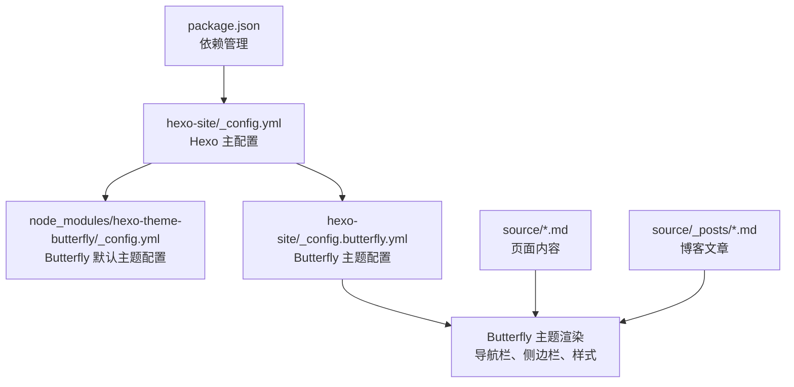
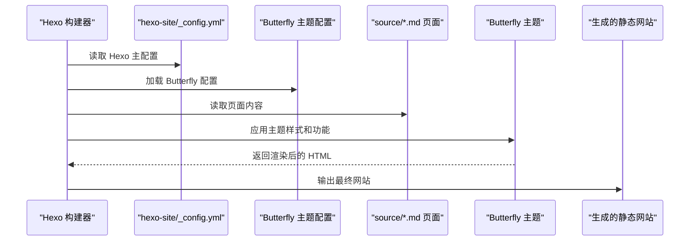
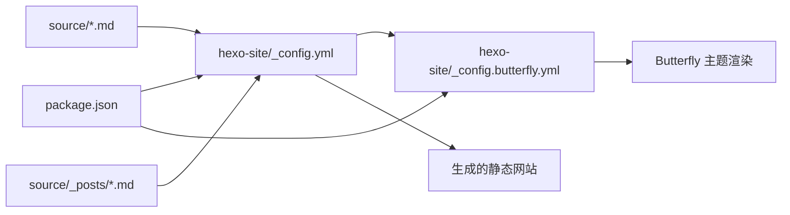

# 配置管理

<cite>
**本文引用的文件**
- [hexo-site/_config.yml](file://hexo-site/_config.yml)
- [hexo-site/_config.butterfly.yml](file://hexo-site/_config.butterfly.yml)
- [hexo-site/package.json](file://hexo-site/package.json)
- [hexo-site/node_modules/hexo-theme-butterfly/_config.yml](file://hexo-site/node_modules/hexo-theme-butterfly/_config.yml)
- [hexo-site/source/index.md](file://hexo-site/source/index.md)
- [hexo-site/source/about/index.md](file://hexo-site/source/about/index.md)
- [hexo-site/source/cv/index.md](file://hexo-site/source/cv/index.md)
- [hexo-site/source/publications/index.md](file://hexo-site/source/publications/index.md)
- [hexo-site/source/portfolio/index.md](file://hexo-site/source/portfolio/index.md)
- [hexo-site/source/_posts/2025-03-11-useful-website.md](file://hexo-site/source/_posts/2025-03-11-useful-website.md)
</cite>

## 更新摘要
**变更内容**
- 从 Jekyll 单一配置架构迁移到 Hexo + Butterfly 双配置架构
- 新增 Hexo 主配置文件 `_config.yml` 和 Butterfly 主题配置文件 `_config.butterfly.yml`
- 移除原有的 Jekyll 配置文件和相关组件
- 更新项目结构说明和配置文件依赖关系
- 重新组织配置参数说明和最佳实践建议

## 目录
1. [简介](#简介)
2. [项目结构](#项目结构)
3. [核心组件](#核心组件)
4. [架构总览](#架构总览)
5. [详细组件分析](#详细组件分析)
6. [依赖关系分析](#依赖关系分析)
7. [性能考量](#性能考量)
8. [故障排查指南](#故障排查指南)
9. [结论](#结论)
10. [附录](#附录)

## 简介
本文件面向 Hexo + Butterfly 静态站点生成器的配置管理系统，系统性说明双配置架构下的各项设置：
- Hexo 主配置文件（_config.yml）：站点基础配置、主题与外观、SEO、部署等
- Butterfly 主题配置文件（_config.butterfly.yml）：导航栏、侧边栏、主题样式、功能开关等
- 页面内容配置：首页、关于页、简历、论文、作品集等页面的配置方法
- 配置参数的含义、可选值范围与最佳实践
- 配置文件之间的依赖关系与优先级规则
- 配置验证方法与常见错误排查

## 项目结构
本项目采用 Hexo 静态站点生成器配合 Butterfly 主题，核心配置分为两个层次：
- Hexo 主配置：hexo-site/_config.yml（站点基础配置）
- Butterfly 主题配置：hexo-site/_config.butterfly.yml（主题样式与功能）

**图表来源**
- [hexo-site/_config.yml](file://hexo-site/_config.yml)
- [hexo-site/_config.butterfly.yml](file://hexo-site/_config.butterfly.yml)
- [hexo-site/node_modules/hexo-theme-butterfly/_config.yml](file://hexo-site/node_modules/hexo-theme-butterfly/_config.yml)
- [hexo-site/package.json](file://hexo-site/package.json)

**章节来源**
- [hexo-site/_config.yml](file://hexo-site/_config.yml)
- [hexo-site/_config.butterfly.yml](file://hexo-site/_config.butterfly.yml)
- [hexo-site/node_modules/hexo-theme-butterfly/_config.yml](file://hexo-site/node_modules/hexo-theme-butterfly/_config.yml)
- [hexo-site/package.json](file://hexo-site/package.json)

## 核心组件
- Hexo 主配置（hexo-site/_config.yml）
  - 站点基本信息：title、subtitle、description、keywords、author、language、timezone
  - URL 配置：url、permalink、pretty_urls
  - 目录结构：source_dir、public_dir、tag_dir、archive_dir、category_dir
  - 写作设置：new_post_name、default_layout、titlecase、external_link
  - 代码高亮：syntax_highlighter、highlight、prismjs
  - 分页设置：index_generator、per_page、pagination_dir
  - 主题配置：theme: butterfly、butterfly 配置
  - 部署配置：deploy（git、repo、branch、message）
- Butterfly 主题配置（hexo-site/_config.butterfly.yml）
  - 导航栏配置：nav（logo、display_title、display_post_title、fixed）
  - 导航菜单：menu（首页、博客、简历等）
  - 社交媒体：social（GitHub、邮箱等链接）
  - 图像设置：favicon、avatar、background、cover
  - 侧边栏配置：aside（enable、hide、button、position）
  - 功能开关：math、mermaid、comments、darkmode、translate
  - 统计分析：analytics（baidu、google、cnzz、tencent）
  - 自定义代码：inject（head、bottom）
- 页面内容配置
  - 首页：source/index.md（欢迎区域、功能介绍、联系方式）
  - 关于页：source/about/index.md（网站介绍、功能说明、快速导航）
  - 简历页：source/cv/index.md（教育背景、工作经历、技能列表）
  - 论文页：source/publications/index.md（期刊文章、会议论文）
  - 作品集：source/portfolio/index.md（作品展示网格布局）
  - 博客文章：source/_posts/（Markdown 格式文章）

**章节来源**
- [hexo-site/_config.yml](file://hexo-site/_config.yml)
- [hexo-site/_config.butterfly.yml](file://hexo-site/_config.butterfly.yml)
- [hexo-site/source/index.md](file://hexo-site/source/index.md)
- [hexo-site/source/about/index.md](file://hexo-site/source/about/index.md)
- [hexo-site/source/cv/index.md](file://hexo-site/source/cv/index.md)
- [hexo-site/source/publications/index.md](file://hexo-site/source/publications/index.md)
- [hexo-site/source/portfolio/index.md](file://hexo-site/source/portfolio/index.md)
- [hexo-site/source/_posts/2025-03-11-useful-website.md](file://hexo-site/source/_posts/2025-03-11-useful-website.md)

## 架构总览
Hexo 在构建阶段首先读取主配置文件，然后加载 Butterfly 主题配置，结合页面内容文件生成最终的静态网站。Butterfly 主题提供了丰富的 UI 组件和功能模块。

**图表来源**
- [hexo-site/_config.yml](file://hexo-site/_config.yml)
- [hexo-site/_config.butterfly.yml](file://hexo-site/_config.butterfly.yml)
- [hexo-site/node_modules/hexo-theme-butterfly/_config.yml](file://hexo-site/node_modules/hexo-theme-butterfly/_config.yml)

## 详细组件分析

### Hexo 主配置（hexo-site/_config.yml）
- 站点基本信息
  - title/subtitle：网站标题和副标题
  - description/keywords：SEO 描述和关键词
  - author/language/timezone：作者信息、语言设置、时区
  - url：网站地址（部署时需要修改）
- URL 和目录配置
  - permalink：文章链接格式（:year/:month/:day/:title/）
  - pretty_urls：美化 URL（trailing_index、trailing_html）
  - source_dir/public_dir：源文件和输出目录
- 写作和渲染设置
  - new_post_name：新文章命名规则
  - default_layout：默认布局
  - external_link：外链处理
  - syntax_highlighter/highlight/prismjs：代码高亮配置
- 分页和索引
  - index_generator：首页生成配置（path、per_page、order_by）
  - per_page：分页每页文章数
  - pagination_dir：分页目录
- 主题和部署
  - theme: butterfly：指定使用 Butterfly 主题
  - deploy：Git 部署配置（repo、branch、message）

**章节来源**
- [hexo-site/_config.yml](file://hexo-site/_config.yml)

### Butterfly 主题配置（hexo-site/_config.butterfly.yml）
- 导航栏配置
  - nav：logo 图片路径、标题显示、文章标题显示、固定导航
  - menu：导航菜单项（首页、博客、简历等）
  - social：社交媒体链接（GitHub、邮箱等）
- 图像和背景
  - favicon：网站图标
  - avatar：头像配置（img、effect）
  - background：网站背景色
  - cover：封面图配置（index_enable、archive_enable 等）
- 侧边栏配置
  - aside：侧边栏开关、隐藏、按钮、位置
  - card_author：作者信息卡片（description、button）
  - card_announcement：公告卡片（content）
  - card_recent_post：最新文章卡片（limit、sort）
  - 其他卡片：card_categories、card_tags、card_archives、card_webinfo
- 功能模块
  - math：MathJax 支持（use: mathjax、per_page: true）
  - mermaid：Mermaid 图表支持（enable: true、version: "10"）
  - comments：评论系统配置
  - darkmode：暗色模式（enable: true、button: true）
  - translate：简繁中文转换（enable: true、default: 繁）
- 统计分析
  - analytics：百度统计、Google Analytics、CNZZ、腾讯分析
- 自定义功能
  - inject：自定义代码注入（head、bottom）
  - wordcount：字数统计（enable: true、post_wordcount: true）
  - lazyload：图片懒加载配置

**章节来源**
- [hexo-site/_config.butterfly.yml](file://hexo-site/_config.butterfly.yml)
- [hexo-site/node_modules/hexo-theme-butterfly/_config.yml](file://hexo-site/node_modules/hexo-theme-butterfly/_config.yml)

### 页面内容配置
- 首页（source/index.md）
  - 欢迎区域：gradient 背景、标题和副标题
  - 个人简介：关于网站的介绍
  - 联系方式：邮箱、GitHub 链接
  - 底部引言：激励语句
  - 自定义样式：CSS 样式表（welcome-section、intro-card、feature-grid 等）
- 关于页（source/about/index.md）
  - 网站介绍：Hexo + Butterfly 主题说明
  - 功能支持：MathJax、Mermaid、代码高亮、字数统计
  - 快速导航：博客、论文、报告、教学、作品集、简历链接
  - 联系方式：邮箱、网站、GitHub
- 简历页（source/cv/index.md）
  - 教育背景：学位、学校、时间
  - 工作经历：职位、公司、职责、导师
  - 技能列表：主技能和子技能
  - 论文和报告：学术成果展示
- 论文页（source/publications/index.md）
  - 期刊文章：2024 年文章列表
  - 会议论文：2025 年文章列表
  - 数学公式：使用 $$...$$ 展示公式
- 作品集（source/portfolio/index.md）
  - 作品网格：auto-fit 布局
  - 悬停效果：transform 和 box-shadow 动画
  - 响应式设计：适配不同屏幕尺寸

**章节来源**
- [hexo-site/source/index.md](file://hexo-site/source/index.md)
- [hexo-site/source/about/index.md](file://hexo-site/source/about/index.md)
- [hexo-site/source/cv/index.md](file://hexo-site/source/cv/index.md)
- [hexo-site/source/publications/index.md](file://hexo-site/source/publications/index.md)
- [hexo-site/source/portfolio/index.md](file://hexo-site/source/portfolio/index.md)

## 依赖关系分析
- 配置文件依赖关系
  - hexo-site/_config.yml 依赖 node_modules/hexo-theme-butterfly/_config.yml 的默认配置
  - hexo-site/_config.butterfly.yml 覆盖 Butterfly 默认配置
  - package.json 管理 Hexo 和主题依赖
- 页面内容依赖关系
  - 所有页面内容文件（source/*.md）由 Hexo 构建器处理
  - 博客文章（source/_posts/*.md）参与首页和归档页面生成
  - 页面布局由 Butterfly 主题提供
- 外部依赖
  - hexo-theme-butterfly：Butterfly 主题核心
  - hexo-deployer-git：Git 部署插件
  - hexo-math：数学公式支持
  - hexo-wordcount：字数统计插件

**图表来源**
- [hexo-site/_config.yml](file://hexo-site/_config.yml)
- [hexo-site/_config.butterfly.yml](file://hexo-site/_config.butterfly.yml)
- [hexo-site/package.json](file://hexo-site/package.json)

## 性能考量
- 代码高亮优化：prismjs 预处理、行号显示、自动检测关闭
- 图片懒加载：lazyload 配置（field: post、placeholder）
- 字数统计：wordcount 插件启用（post_wordcount: true、min2read: true）
- 分页设置：合理配置 per_page（10）和 pagination_dir（page）
- 主题优化：Butterfly 主题内置的性能优化选项
- 依赖管理：package.json 中精确版本控制，避免兼容性问题

**章节来源**
- [hexo-site/_config.yml](file://hexo-site/_config.yml)
- [hexo-site/_config.butterfly.yml](file://hexo-site/_config.butterfly.yml)
- [hexo-site/package.json](file://hexo-site/package.json)

## 故障排查指南
- 部署问题
  - Git 部署失败：检查 hexo-site/_config.yml 中的 deploy 配置（repo、branch、message）
  - GitHub Pages 未更新：确认 GitHub Actions 已正确配置
- 主题显示问题
  - 图片路径错误：检查 _config.butterfly.yml 中的 favicon、avatar、logo 路径
  - 样式不生效：确认 Butterfly 主题已正确安装（package.json 中 hexo-theme-butterfly）
  - 导航栏异常：检查 _config.butterfly.yml 中 nav 和 menu 配置
- 功能异常
  - 数学公式不显示：确认 hexo-math 插件已安装，_config.butterfly.yml 中 math 配置正确
  - Mermaid 图表不显示：检查 _config.butterfly.yml 中 mermaid.enable: true
  - 字数统计不显示：确认 hexo-wordcount 插件已安装，wordcount 配置正确
- 页面内容问题
  - 首页样式异常：检查 source/index.md 中的 CSS 样式
  - 博客文章链接 404：确认 hexo-site/_config.yml 中 permalink 格式正确
  - 分页失效：检查 per_page 和 pagination_dir 配置一致性

**章节来源**
- [hexo-site/_config.yml](file://hexo-site/_config.yml)
- [hexo-site/_config.butterfly.yml](file://hexo-site/_config.butterfly.yml)
- [hexo-site/package.json](file://hexo-site/package.json)

## 结论
本配置系统通过 Hexo + Butterfly 的双配置架构实现了高度模块化的网站管理。Hexo 主配置负责站点基础设置，Butterfly 配置负责主题样式和功能，配合页面内容文件实现完整的静态网站生成。遵循本文的参数说明、最佳实践与排障指南，可在保证易用性的同时实现深度定制。

## 附录

### 参数速查与最佳实践
- Hexo 主配置
  - url：部署到 GitHub Pages 时必须设置为正确的项目地址
  - permalink：建议使用 :year/:month/:day/:title/ 格式
  - theme：必须设置为 butterfly
  - deploy：配置正确的仓库地址和分支
- Butterfly 主题配置
  - nav：logo 图片路径必须存在
  - menu：导航项格式为 "名称: /路径/ || 图标类名"
  - social：图标类名参考 Font Awesome
  - avatar：头像图片路径必须存在
  - math：使用 MathJax 时设置 per_page: true
  - mermaid：版本建议使用较新的 10.x
- 页面内容配置
  - 首页：欢迎区域使用 gradient 背景，确保颜色搭配协调
  - 关于页：功能列表清晰明了，链接指向正确页面
  - 简历页：使用语义化标记，列表项层级清晰
  - 论文页：数学公式使用 $$...$$ 包裹
  - 作品集：网格布局使用 CSS Grid，确保响应式设计

### 常见配置场景
- 更换网站图标
  - 修改 hexo-site/_config.butterfly.yml 中 favicon 路径
  - 将新图标文件放入 source/images/ 目录
- 添加新导航菜单
  - 在 hexo-site/_config.butterfly.yml 的 menu 中添加新项
  - 创建对应的页面文件（如 source/new-page/index.md）
- 配置数学公式支持
  - 确保 hexo-math 插件已安装
  - 在 hexo-site/_config.butterfly.yml 中设置 math.use: mathjax
  - 在文章中使用 $$...$$ 包裹数学公式
- 启用暗色模式
  - 在 hexo-site/_config.butterfly.yml 中设置 darkmode.enable: true
  - 可配置按钮显示和自动切换模式
- 配置代码高亮
  - 在 hexo-site/_config.yml 中配置 prismjs
  - 设置 line_number: true 启用行号显示
  - 配置 tab_replace 和 wrap 选项

**章节来源**
- [hexo-site/_config.yml](file://hexo-site/_config.yml)
- [hexo-site/_config.butterfly.yml](file://hexo-site/_config.butterfly.yml)
- [hexo-site/package.json](file://hexo-site/package.json)