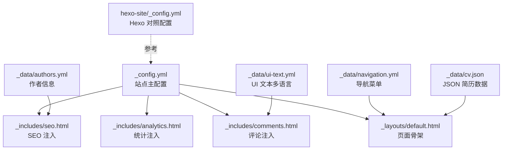
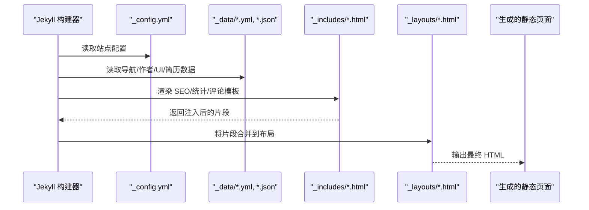
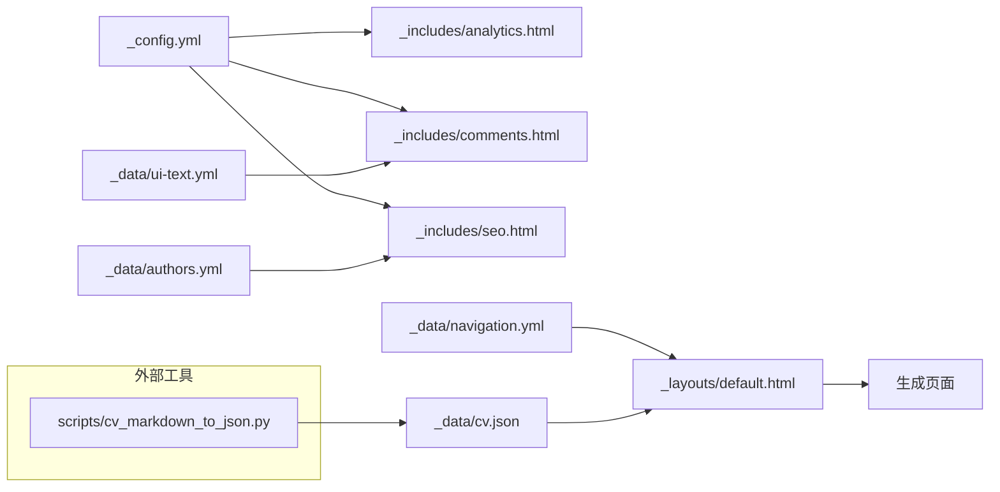

# 配置管理

<cite>
**本文引用的文件**
- [_config.yml](file://_config.yml)
- [_data/authors.yml](file://_data/authors.yml)
- [_data/navigation.yml](file://_data/navigation.yml)
- [_data/ui-text.yml](file://_data/ui-text.yml)
- [_data/cv.json](file://_data/cv.json)
- [_includes/seo.html](file://_includes/seo.html)
- [_includes/analytics.html](file://_includes/analytics.html)
- [_includes/analytics-providers/google-analytics-4.html](file://_includes/analytics-providers/google-analytics-4.html)
- [_includes/comments.html](file://_includes/comments.html)
- [_includes/comments-providers/staticman.html](file://_includes/comments-providers/staticman.html)
- [_includes/head.html](file://_includes/head.html)
- [_layouts/default.html](file://_layouts/default.html)
- [hexo-site/_config.yml](file://hexo-site/_config.yml)
- [scripts/cv_markdown_to_json.py](file://scripts/cv_markdown_to_json.py)
- [BUGFIX_NAVIGATION.md](file://BUGFIX_NAVIGATION.md)
</cite>

## 目录
1. [简介](#简介)
2. [项目结构](#项目结构)
3. [核心组件](#核心组件)
4. [架构总览](#架构总览)
5. [详细组件分析](#详细组件分析)
6. [依赖关系分析](#依赖关系分析)
7. [性能考量](#性能考量)
8. [故障排查指南](#故障排查指南)
9. [结论](#结论)
10. [附录](#附录)

## 简介
本文件面向配置管理系统，围绕 Jekyll 主题站点的核心配置与数据文件展开，系统性说明：
- _config.yml 站点基础配置、主题与外观、SEO、社交分享、统计分析、评论系统、集合与默认值、Sass/SCSS、输出与插件等
- _data 目录下的导航、作者、UI 文本、CV 数据等配置文件的作用与配置方法
- 配置参数的含义、可选值范围与最佳实践
- 配置文件之间的依赖关系与优先级规则
- 配置验证方法与常见错误排查

## 项目结构
本项目采用 Jekyll 静态站点生成器，核心配置集中在根目录的 _config.yml；界面文本与导航、作者、CV 等数据分别位于 _data 目录；SEO、统计、评论等功能通过 _includes 模板注入到布局中；另有独立的 Hexo 配置用于对比或迁移场景。

图表来源
- [_config.yml](file://_config.yml)
- [_includes/seo.html](file://_includes/seo.html)
- [_includes/analytics.html](file://_includes/analytics.html)
- [_includes/comments.html](file://_includes/comments.html)
- [_layouts/default.html](file://_layouts/default.html)
- [_data/navigation.yml](file://_data/navigation.yml)
- [_data/authors.yml](file://_data/authors.yml)
- [_data/ui-text.yml](file://_data/ui-text.yml)
- [_data/cv.json](file://_data/cv.json)
- [hexo-site/_config.yml](file://hexo-site/_config.yml)

章节来源
- [_config.yml](file://_config.yml)
- [_data/navigation.yml](file://_data/navigation.yml)
- [_data/authors.yml](file://_data/authors.yml)
- [_data/ui-text.yml](file://_data/ui-text.yml)
- [_data/cv.json](file://_data/cv.json)
- [_includes/seo.html](file://_includes/seo.html)
- [_includes/analytics.html](file://_includes/analytics.html)
- [_includes/comments.html](file://_includes/comments.html)
- [_layouts/default.html](file://_layouts/default.html)
- [hexo-site/_config.yml](file://hexo-site/_config.yml)

## 核心组件
- 站点基础配置（_config.yml）
  - 站点元信息：locale、title、title_separator、description、url/baseurl/repository
  - 主题与外观：site_theme、sass.style
  - 作者信息：author（头像、姓名、简介、位置、雇主、URI、邮箱、各类学术/社交链接）
  - 发布分类：publication_category（书籍、文稿、会议论文等标题映射）
  - 功能开关：teaser、breadcrumbs、words_per_minute、future、read_more、talkmap_link、atom_feed.hide/path
  - 评论系统：comments.provider 及 disqus、discourse、facebook、staticman 等子配置
  - SEO：google_site_verification、bing_site_verification、alexa_site_verification、yandex_site_verification、twitter/facebook/og 社交账号与图片描述
  - 统计分析：analytics.provider 及 google/tracking_id
  - 内容与集合：include/exclude/keep_files、markdown/kramdown、collections、defaults
  - 输出与压缩：permalink、paginate/paginate_path、compress_html
  - 插件与白名单：plugins、whitelist
  - 归档：category_archive/tag_archive 类型与路径
- 数据文件（_data/*.yml, *.json）
  - authors.yml：作者条目与社交信息
  - navigation.yml：主导航与子菜单结构
  - ui-text.yml：多语言 UI 文本键值
  - cv.json：JSON 格式简历数据（含 basics、work、education、publications、presentations、teaching、portfolio 等）
- 模板注入（_includes/*.html）
  - seo.html：基于 _config.yml 与页面上下文生成 SEO 元标签、Open Graph、结构化数据、站点验证
  - analytics.html：按 provider 条件包含对应统计脚本
  - comments.html：按 provider 条件渲染评论区与表单
  - head.html：引入 SEO、RSS 订阅与样式
  - analytics-providers/google-analytics-4.html：GA4 脚本注入
  - comments-providers/staticman.html：静态评论提交脚本
- 布局（_layouts/default.html）
  - 页面骨架，包含 head.html、masthead、content、footer、scripts.html
- Hexo 配置（hexo-site/_config.yml）
  - 对比参考：站点标题、URL、语言、分页、高亮、主题等

章节来源
- [_config.yml](file://_config.yml)
- [_data/authors.yml](file://_data/authors.yml)
- [_data/navigation.yml](file://_data/navigation.yml)
- [_data/ui-text.yml](file://_data/ui-text.yml)
- [_data/cv.json](file://_data/cv.json)
- [_includes/seo.html](file://_includes/seo.html)
- [_includes/analytics.html](file://_includes/analytics.html)
- [_includes/comments.html](file://_includes/comments.html)
- [_includes/analytics-providers/google-analytics-4.html](file://_includes/analytics-providers/google-analytics-4.html)
- [_includes/comments-providers/staticman.html](file://_includes/comments-providers/staticman.html)
- [_includes/head.html](file://_includes/head.html)
- [_layouts/default.html](file://_layouts/default.html)
- [hexo-site/_config.yml](file://hexo-site/_config.yml)

## 架构总览
Jekyll 在构建阶段读取 _config.yml，结合 _data 下的数据文件与 _includes 模板，将变量注入到各布局与页面中，最终生成静态 HTML。SEO、统计、评论等功能通过模板条件分支按配置启用。

图表来源
- [_config.yml](file://_config.yml)
- [_data/navigation.yml](file://_data/navigation.yml)
- [_data/authors.yml](file://_data/authors.yml)
- [_data/ui-text.yml](file://_data/ui-text.yml)
- [_data/cv.json](file://_data/cv.json)
- [_includes/seo.html](file://_includes/seo.html)
- [_includes/analytics.html](file://_includes/analytics.html)
- [_includes/comments.html](file://_includes/comments.html)
- [_layouts/default.html](file://_layouts/default.html)

## 详细组件分析

### 站点基础配置（_config.yml）
- 站点元信息
  - locale：国际化区域，如 zh-CN
  - title/title_separator：站点标题与分隔符
  - description：站点描述，可用作 SEO 描述
  - url/baseurl/repository：站点基址、子路径与仓库信息
- 主题与外观
  - site_theme：主题风格（default/air/sunrise/mint/dirt/contrast）
  - sass.style：CSS 输出风格（如 compressed）
- 作者信息 author
  - 包含头像、姓名、简介、位置、雇主、URI、邮箱
  - 支持学术平台（googlescholar、orcid、pubmed 等）与社交平台（twitter、github、zhihu 等）链接
- 发布分类 publication_category
  - 定义书籍、文稿、会议论文等分类标题
- 功能与展示
  - teaser：社交预览图
  - breadcrumbs：面包屑开关
  - words_per_minute：阅读时长估算
  - future：是否显示未来日期内容
  - read_more：摘要“继续阅读”开关
  - talkmap_link：是否在 Talks 页面显示地图链接
  - atom_feed：RSS 订阅隐藏与路径
- 评论系统 comments
  - provider：支持 false、disqus、discourse、facebook、google-plus、staticman、custom
  - disqus：shortname
  - discourse：server
  - facebook：appid、num_posts、colorscheme
  - staticman：allowedFields、branch、commitMessage、filename、format、moderation、path、requiredFields、transforms、generatedFields.date.options.format
- SEO 与社交
  - google_site_verification/bing_site_verification/alexa_site_verification/yandex_site_verification：站点验证
  - twitter/facebook/og_image/og_description：社交账号与默认封面
  - social：类型（Person/Organization）、名称、链接数组
- 统计分析 analytics
  - provider：false、google、google-universal、google-analytics-4、custom
  - google.tracking_id：GA4 ID
- 内容与集合
  - include/exclude/keep_files：文件包含/排除/保留
  - markdown/kramdown：Markdown 处理器与选项
  - collections：teaching/publications/portfolio/talks 的输出与永久链接
  - defaults：针对 posts/pages/teaching/publications/portfolio/talks 的默认布局与功能开关
- 输出与压缩
  - permalink：文章永久链接格式
  - paginate/paginate_path：分页参数
  - compress_html：HTML 压缩配置
- 插件与白名单
  - plugins：启用 jekyll-feed、jekyll-gist、jekyll-paginate、jekyll-sitemap、jekyll-redirect-from、jemoji
  - whitelist：安全模式下允许的插件
- 归档与压缩
  - category_archive/tag_archive：归档类型与路径
  - compress_html：生产环境忽略开发环境

章节来源
- [_config.yml](file://_config.yml)

### 数据文件（_data）
- authors.yml
  - 定义作者条目，包含 name、uri、email、bio、avatar、twitter、google_plus 等字段
- navigation.yml
  - 定义主导航项与子菜单（children），支持多级嵌套
- ui-text.yml
  - 提供多语言 UI 文本键值（en、es、fr、tr、pt、it、zh、zh-HK 等）
  - 包含分页、面包屑、目录、标签、分类、元信息、评论相关文案与提示
- cv.json
  - JSON 格式的简历数据，包含 basics（姓名、邮箱、电话、网站、摘要、位置、社交资料）、work、education、skills、languages、interests、references、publications、presentations、teaching、portfolio 等

章节来源
- [_data/authors.yml](file://_data/authors.yml)
- [_data/navigation.yml](file://_data/navigation.yml)
- [_data/ui-text.yml](file://_data/ui-text.yml)
- [_data/cv.json](file://_data/cv.json)

### 模板注入（_includes）
- seo.html
  - 基于 site.url/site.baseurl、page.title/page.description/page.excerpt、site.author、site.twitter/site.facebook、site.social、site.google_site_verification 等生成 SEO 元标签、Open Graph、结构化数据与站点验证
- analytics.html
  - 根据 site.analytics.provider 条件包含对应统计脚本（google、google-universal、google-analytics-4、custom）
- comments.html
  - 根据 site.comments.provider 渲染评论区（disqus、facebook、google-plus、staticman、custom）
  - 使用 site.data.ui-text[site.locale] 获取本地化文案
- analytics-providers/google-analytics-4.html
  - 注入 GA4 脚本，使用 site.analytics.google.tracking_id
- comments-providers/staticman.html
  - 提供静态评论提交的前端脚本与消息提示
- head.html
  - 引入 SEO 片段、RSS 订阅与主样式

章节来源
- [_includes/seo.html](file://_includes/seo.html)
- [_includes/analytics.html](file://_includes/analytics.html)
- [_includes/comments.html](file://_includes/comments.html)
- [_includes/analytics-providers/google-analytics-4.html](file://_includes/analytics-providers/google-analytics-4.html)
- [_includes/comments-providers/staticman.html](file://_includes/comments-providers/staticman.html)
- [_includes/head.html](file://_includes/head.html)

### 布局（_layouts/default.html）
- 页面骨架，包含 head.html、masthead、content、footer、scripts.html
- 通过 include 注入头部与脚部片段，实现统一风格与功能

章节来源
- [_layouts/default.html](file://_layouts/default.html)

### Hexo 配置（hexo-site/_config.yml）
- 用于对比与参考，包含站点标题、URL、语言、分页、高亮、主题等
- 与 Jekyll 的 _config.yml 在功能层面可相互印证

章节来源
- [hexo-site/_config.yml](file://hexo-site/_config.yml)

## 依赖关系分析
- 配置到模板的依赖
  - _config.yml 的 analytics.provider 决定 analytics.html 的包含分支
  - _config.yml 的 comments.provider 决定 comments.html 的包含分支
  - _config.yml 的 twitter、facebook、social、og_image 等影响 seo.html 的输出
  - _config.yml 的 defaults 为各集合与页面提供默认布局与功能开关
- 数据到模板的依赖
  - navigation.yml 用于生成主导航
  - authors.yml 与 ui-text.yml 用于作者信息与评论表单文案
  - cv.json 用于简历页面的数据渲染
- 模板到布局的依赖
  - head.html 被 default.html 引入，进而被所有页面复用
- 外部工具链
  - scripts/cv_markdown_to_json.py 可将 Markdown CV 转换为 JSON，供 cv.json 使用

图表来源
- [_config.yml](file://_config.yml)
- [_includes/analytics.html](file://_includes/analytics.html)
- [_includes/comments.html](file://_includes/comments.html)
- [_includes/seo.html](file://_includes/seo.html)
- [_data/navigation.yml](file://_data/navigation.yml)
- [_data/authors.yml](file://_data/authors.yml)
- [_data/ui-text.yml](file://_data/ui-text.yml)
- [_data/cv.json](file://_data/cv.json)
- [_layouts/default.html](file://_layouts/default.html)
- [scripts/cv_markdown_to_json.py](file://scripts/cv_markdown_to_json.py)

## 性能考量
- CSS 压缩：sass.style: compressed
- HTML 压缩：compress_html 在生产环境忽略 development 环境
- 插件白名单：whitelist 仅启用必要插件，减少构建开销
- Markdown 处理：kramdown 输入为 GFM，启用自动 ID 与智能引号，平衡可读性与性能
- 分页：合理设置 per_page 与 paginate_path，避免过深分页导致资源消耗

章节来源
- [_config.yml](file://_config.yml)

## 故障排查指南
- 评论系统
  - 若使用 staticman，需确保 site.repository 与 site.staticman.branch 配置正确，且 _data/comments 下存在对应 slug 的评论数据
  - 提交失败时检查网络请求返回与控制台错误，确认 requiredFields 与 allowedFields 配置一致
- 统计分析
  - GA4 需要有效的 tracking_id；若未配置则 analytics.html 不会注入脚本
- 导航点击失效（下拉菜单）
  - 在特定页面（如 /year-archive/）出现下拉菜单子项不可点击时，检查 CSS 选择器是否误将子链接禁用点击
  - 参考修复建议：缩小选择器至直接子元素并显式启用下拉菜单中的子链接
- SEO 与社交
  - 若 Open Graph 图片不显示，检查 page.header.image 或 site.og_image 是否正确配置
  - 站点验证未生效时，确认 google_site_verification/bing_site_verification 等字段已填写
- 配置验证方法
  - 使用 jekyll serve 启动本地服务，观察构建日志中的警告与错误
  - 对关键配置（如 analytics、comments、SEO）进行最小化验证，逐步启用
  - 对比 hexo-site/_config.yml 以确认字段差异与迁移需求

章节来源
- [_includes/comments.html](file://_includes/comments.html)
- [_includes/comments-providers/staticman.html](file://_includes/comments-providers/staticman.html)
- [_includes/analytics.html](file://_includes/analytics.html)
- [_includes/analytics-providers/google-analytics-4.html](file://_includes/analytics-providers/google-analytics-4.html)
- [_includes/seo.html](file://_includes/seo.html)
- [BUGFIX_NAVIGATION.md](file://BUGFIX_NAVIGATION.md)
- [hexo-site/_config.yml](file://hexo-site/_config.yml)

## 结论
本配置系统通过 _config.yml 统一管理站点行为，配合 _data 数据文件与 _includes 模板实现高度模块化的功能注入。遵循本文的参数说明、最佳实践与排障指南，可在保证易用性的同时实现深度定制。

## 附录

### 参数速查与最佳实践
- 站点元信息
  - locale：建议使用 zh-CN
  - url/baseurl：若部署在 GitHub Pages 子路径，需同步配置 baseurl
  - repository：用于评论系统（如 Staticman）与 sitemap
- 主题与外观
  - site_theme：根据品牌色系选择 default/air/sunrise/mint/dirt/contrast
  - sass.style：生产环境建议 compressed
- 作者信息
  - author 字段建议完整填写，便于 SEO 与社交分享
- 评论系统
  - disqus：填写 shortname
  - staticman：配置 requiredFields/allowedFields、path、branch、moderation
- SEO
  - 填写 google_site_verification 等验证字段
  - 提供 og_image 与描述，提升社交分享质量
- 统计分析
  - GA4：填写 tracking_id
- 集合与默认值
  - defaults 中为各集合设置合理的布局与功能开关
- 输出与分页
  - permalink 与 paginate/paginate_path 需保持一致，避免 404
- 插件与白名单
  - whitelist 仅保留必要插件，降低构建风险

### 常见配置场景
- 多语言 UI 文本
  - 在 ui-text.yml 中新增或修改目标语言键值，确保 site.locale 与之匹配
- 导航菜单扩展
  - 在 navigation.yml 的 main 数组中添加新项，支持 children 实现下拉菜单
- 简历数据更新
  - 使用 scripts/cv_markdown_to_json.py 将 Markdown CV 转换为 JSON 并替换 _data/cv.json
- 静态评论集成
  - 配置 staticman 的 branch、path、moderation 等，确保 _data/comments 目录结构与配置一致

章节来源
- [_config.yml](file://_config.yml)
- [_data/ui-text.yml](file://_data/ui-text.yml)
- [_data/navigation.yml](file://_data/navigation.yml)
- [_data/cv.json](file://_data/cv.json)
- [scripts/cv_markdown_to_json.py](file://scripts/cv_markdown_to_json.py)