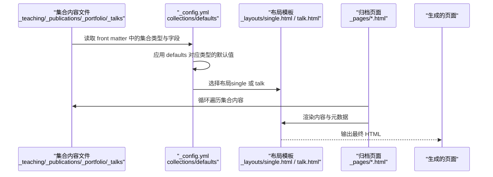
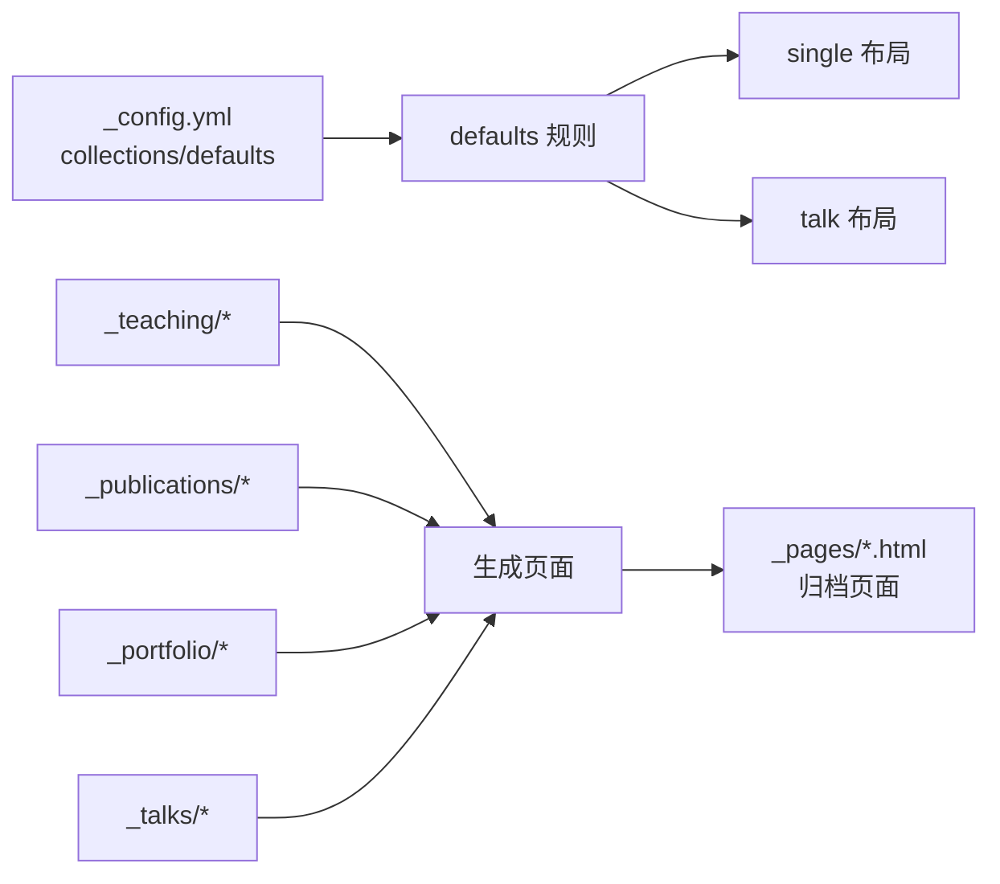

# 集合和默认配置

<cite>
**本文引用的文件**
- [_config.yml](file://_config.yml)
- [_layouts/single.html](file://_layouts/single.html)
- [_layouts/talk.html](file://_layouts/talk.html)
- [_pages/publications.html](file://_pages/publications.html)
- [_pages/teaching.html](file://_pages/teaching.html)
- [_pages/portfolio.html](file://_pages/portfolio.html)
- [_pages/talks.html](file://_pages/talks.html)
- [_teaching/2014-spring-teaching-1.md](file://_teaching/2014-spring-teaching-1.md)
- [_publications/2009-10-01-paper-title-number-1.md](file://_publications/2009-10-01-paper-title-number-1.md)
- [_portfolio/portfolio-1.md](file://_portfolio/portfolio-1.md)
- [_talks/2012-03-01-talk-1.md](file://_talks/2012-03-01-talk-1.md)
</cite>

## 目录
1. [简介](#简介)
2. [项目结构](#项目结构)
3. [核心组件](#核心组件)
4. [架构总览](#架构总览)
5. [详细组件分析](#详细组件分析)
6. [依赖关系分析](#依赖关系分析)
7. [性能考量](#性能考量)
8. [故障排查指南](#故障排查指南)
9. [结论](#结论)
10. [附录](#附录)

## 简介
本文件围绕 Jekyll 网站中的“集合（Collections）”与“页面默认配置（defaults）”展开，系统性说明以下内容：
- collections 部分：teaching、publications、portfolio、talks 等集合的输出开关与永久链接规则
- defaults 部分：不同内容类型的默认布局、作者资料、评论、分享、相关文章等行为
- 集合配置对内容管理与页面生成的影响
- 每个集合的配置示例与使用场景
- 默认配置的优先级与覆盖规则
- 自定义集合与新增内容类型的实践建议
- 性能优化与最佳实践

## 项目结构
本项目的集合与默认配置主要集中在根配置文件中，并通过各集合目录下的内容文件与归档页面共同完成页面生成与展示。

```mermaid
graph TB
A["_config.yml<br/>collections 与 defaults 定义"] --> B["_teaching/<br/>教学集合内容"]
A --> C["_publications/<br/>出版物集合内容"]
A --> D["_portfolio/<br/>作品集集合内容"]
A --> E["_talks/<br/>演讲集合内容"]
F["_layouts/single.html<br/>通用单页布局"] <-- A
G["_layouts/talk.html<br/>演讲专用布局"] <-- A
H["_pages/*.html<br/>归档页面"] --> B
H --> C
H --> D
H --> E
```

图表来源
- [_config.yml](file://_config.yml)
- [_layouts/single.html](file://_layouts/single.html)
- [_layouts/talk.html](file://_layouts/talk.html)
- [_pages/publications.html](file://_pages/publications.html)
- [_pages/teaching.html](file://_pages/teaching.html)
- [_pages/portfolio.html](file://_pages/portfolio.html)
- [_pages/talks.html](file://_pages/talks.html)

章节来源
- [_config.yml](file://_config.yml)
- [_pages/publications.html](file://_pages/publications.html)
- [_pages/teaching.html](file://_pages/teaching.html)
- [_pages/portfolio.html](file://_pages/portfolio.html)
- [_pages/talks.html](file://_pages/talks.html)

## 核心组件
- 集合定义与输出规则
  - teaching、publications、portfolio、talks 四个集合均开启输出，并采用统一的永久链接模板，便于在站点内形成一致的路径风格。
- 默认配置（defaults）
  - 针对 posts、pages、teaching、publications、portfolio、talks 分别设定默认布局、作者资料、阅读时长、评论、分享、相关文章等行为。
  - talks 使用专用 talk 布局，其余集合多使用 single 布局。
- 页面归档
  - 各集合对应的归档页面通过循环渲染集合内容，实现列表页与详情页的联动。

章节来源
- [_config.yml](file://_config.yml)
- [_layouts/single.html](file://_layouts/single.html)
- [_layouts/talk.html](file://_layouts/talk.html)
- [_pages/publications.html](file://_pages/publications.html)
- [_pages/teaching.html](file://_pages/teaching.html)
- [_pages/portfolio.html](file://_pages/portfolio.html)
- [_pages/talks.html](file://_pages/talks.html)

## 架构总览
下图展示了从集合内容到页面生成的关键流程：集合内容文件经由 Jekyll 的集合机制读取，结合默认配置与布局模板，最终生成静态页面。



图表来源
- [_config.yml](file://_config.yml)
- [_layouts/single.html](file://_layouts/single.html)
- [_layouts/talk.html](file://_layouts/talk.html)
- [_pages/publications.html](file://_pages/publications.html)
- [_pages/teaching.html](file://_pages/teaching.html)
- [_pages/portfolio.html](file://_pages/portfolio.html)
- [_pages/talks.html](file://_pages/talks.html)

## 详细组件分析

### 集合配置与输出规则
- teaching
  - 输出开启，永久链接模板为 “/:collection/:path/”
  - 示例内容文件展示了如何通过 front matter 指定集合类型与自定义永久链接
- publications
  - 输出开启，永久链接模板为 “/:collection/:path/”
  - 示例内容文件包含分类、摘要、发表信息、链接等字段
- portfolio
  - 输出开启，永久链接模板为 “/:collection/:path/”
  - 示例内容文件包含简短描述与图片占位
- talks
  - 输出开启，永久链接模板为 “/:collection/:path/”
  - 示例内容文件包含演讲类型、地点、时间等字段

章节来源
- [_config.yml](file://_config.yml)
- [_teaching/2014-spring-teaching-1.md](file://_teaching/2014-spring-teaching-1.md)
- [_publications/2009-10-01-paper-title-number-1.md](file://_publications/2009-10-01-paper-title-number-1.md)
- [_portfolio/portfolio-1.md](file://_portfolio/portfolio-1.md)
- [_talks/2012-03-01-talk-1.md](file://_talks/2012-03-01-talk-1.md)

### 默认配置与优先级
- defaults 的作用域
  - posts：默认 single 布局，启用作者资料、阅读时长、评论、分享、相关文章
  - pages：默认 single 布局，启用作者资料
  - teaching/publications/portfolio：默认 single 布局，启用作者资料、分享、评论（portfolio 还启用了 comment 字段）
  - talks：默认 talk 布局，启用作者资料、分享
- 优先级与覆盖规则
  - 内容文件（如集合项）的 front matter 字段会覆盖 defaults 中的对应值
  - 归档页面（如 _pages/*.html）的 front matter 会覆盖 defaults 中针对 pages 类型的值
  - 若集合项未显式声明布局，则按 defaults 中 type 对应的布局生效

章节来源
- [_config.yml](file://_config.yml)
- [_layouts/single.html](file://_layouts/single.html)
- [_layouts/talk.html](file://_layouts/talk.html)

### 页面归档与集合渲染
- 教学归档页面
  - 通过遍历 site.teaching 渲染教学条目，使用 archive-single.html 组件
- 出版物归档页面
  - 支持按分类（publication_category）分组显示；若未定义分类则直接按时间倒序渲染
- 作品集归档页面
  - 遍历 site.portfolio 渲染作品条目
- 演讲归档页面
  - 可选地提供地图链接；遍历 site.talks 渲染演讲条目，使用 archive-single-talk.html 组件

章节来源
- [_pages/teaching.html](file://_pages/teaching.html)
- [_pages/publications.html](file://_pages/publications.html)
- [_pages/portfolio.html](file://_pages/portfolio.html)
- [_pages/talks.html](file://_pages/talks.html)

### 布局模板与功能集成
- single 布局
  - 通用单页布局，支持作者资料、阅读时长、分享、评论、相关文章、面包屑导航等
  - 针对不同集合类型（如 teaching、publications）在标题下方展示不同的元信息
- talk 布局
  - 专用于演讲类内容，包含演讲类型、地点、时间等元信息展示，以及分享与评论区域

章节来源
- [_layouts/single.html](file://_layouts/single.html)
- [_layouts/talk.html](file://_layouts/talk.html)

### 典型集合使用场景与示例
- teaching
  - 场景：展示教学经历、课程信息
  - 示例：集合项 front matter 包含类型、地点、时间等字段，页面通过 single 布局渲染
- publications
  - 场景：展示论文、报告、著作等学术成果
  - 示例：集合项 front matter 包含分类、摘要、发表信息、下载链接等字段
- portfolio
  - 场景：展示作品、项目、设计等
  - 示例：集合项 front matter 包含简短描述与图片占位
- talks
  - 场景：展示演讲、报告、讲座等
  - 示例：集合项 front matter 包含类型、地点、时间等字段，页面使用 talk 布局

章节来源
- [_teaching/2014-spring-teaching-1.md](file://_teaching/2014-spring-teaching-1.md)
- [_publications/2009-10-01-paper-title-number-1.md](file://_publications/2009-10-01-paper-title-number-1.md)
- [_portfolio/portfolio-1.md](file://_portfolio/portfolio-1.md)
- [_talks/2012-03-01-talk-1.md](file://_talks/2012-03-01-talk-1.md)

### 自定义集合与新增内容类型
- 新增集合步骤
  - 在 _config.yml 的 collections 中添加新集合名称与输出开关、永久链接模板
  - 在根目录创建以 “_” 开头的新目录作为集合内容源
  - 在 defaults 中为新集合类型添加 scope 与 values，设置默认布局、作者资料、评论、分享等
  - 创建归档页面（如 _pages/new-collection.html），使用 for 循环遍历 site.new_collection 渲染
- 最佳实践
  - 保持集合命名与永久链接模板的一致性，便于维护与 SEO
  - 在 defaults 中集中管理通用行为，减少内容文件中的重复配置
  - 为集合项提供清晰的 front matter 字段规范，确保布局模板可稳定渲染

章节来源
- [_config.yml](file://_config.yml)
- [_pages/publications.html](file://_pages/publications.html)
- [_pages/teaching.html](file://_pages/teaching.html)
- [_pages/portfolio.html](file://_pages/portfolio.html)
- [_pages/talks.html](file://_pages/talks.html)

## 依赖关系分析
- 配置与内容的耦合
  - collections 与 defaults 的组合决定了集合项的输出与渲染行为
  - 归档页面依赖于集合数据（site.teaching/site.publications/site.portfolio/site.talks）
- 布局与功能的耦合
  - single 与 talk 布局分别承载通用与专用的内容展示逻辑
  - 评论、分享、相关文章等功能通过布局模板与 defaults 的布尔字段控制



图表来源
- [_config.yml](file://_config.yml)
- [_layouts/single.html](file://_layouts/single.html)
- [_layouts/talk.html](file://_layouts/talk.html)
- [_pages/publications.html](file://_pages/publications.html)
- [_pages/teaching.html](file://_pages/teaching.html)
- [_pages/portfolio.html](file://_pages/portfolio.html)
- [_pages/talks.html](file://_pages/talks.html)

章节来源
- [_config.yml](file://_config.yml)
- [_layouts/single.html](file://_layouts/single.html)
- [_layouts/talk.html](file://_layouts/talk.html)
- [_pages/publications.html](file://_pages/publications.html)
- [_pages/teaching.html](file://_pages/teaching.html)
- [_pages/portfolio.html](file://_pages/portfolio.html)
- [_pages/talks.html](file://_pages/talks.html)

## 性能考量
- 输出与构建时间
  - 集合开启输出会增加构建工作量，建议仅对必要集合启用输出
  - 使用压缩样式与 HTML 压缩插件可降低生成体积与加载时间
- 数据渲染复杂度
  - 归档页面中对集合进行排序与分组（如按分类）可能影响构建时间，建议合理组织数据与模板逻辑
- 资源加载
  - 评论、分享等外部资源需谨慎启用，避免阻塞主内容渲染
- 缓存与增量构建
  - 在开发阶段可考虑禁用增量构建以保证一致性，生产环境建议关闭不必要的功能以提升稳定性

## 故障排查指南
- 永久链接冲突或 404
  - 检查集合的 permalink 模板是否与内容文件中的自定义 permalink 冲突
  - 确认归档页面的 permalink 与集合项的 permalink 不互相覆盖
- 默认配置未生效
  - 确认内容文件的 front matter 未覆盖 defaults 中的字段
  - 检查归档页面的 front matter 是否覆盖了 pages 类型的默认值
- 布局不匹配
  - talks 集合应使用 talk 布局；其他集合使用 single 布局
  - 若自定义集合，请在 defaults 中为该类型指定正确的布局
- 评论与分享功能异常
  - 确认 comments.provider 与分享提供商配置正确
  - 检查内容文件中 comments/share 字段是否被显式关闭

章节来源
- [_config.yml](file://_config.yml)
- [_layouts/single.html](file://_layouts/single.html)
- [_layouts/talk.html](file://_layouts/talk.html)

## 结论
通过对 collections 与 defaults 的系统化配置，本项目实现了教学、出版物、作品集、演讲等多类型内容的统一管理与高效渲染。合理的默认配置与布局选择提升了开发效率，而清晰的归档页面与永久链接规则则增强了用户体验与 SEO 表现。建议在扩展新集合时遵循本文提供的最佳实践，确保配置一致性与性能可控。

## 附录
- 集合与归档页面的对应关系
  - teaching → _pages/teaching.html
  - publications → _pages/publications.html
  - portfolio → _pages/portfolio.html
  - talks → _pages/talks.html
- 关键字段参考
  - 集合项 front matter 常用字段：title、collection、type、venue、date、location、excerpt、paperurl、slidesurl、bibtexurl、citation、permalink 等
  - 归档页面 front matter 常用字段：layout、title、permalink、author_profile 等