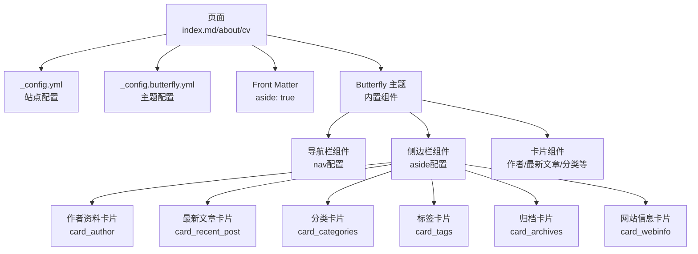
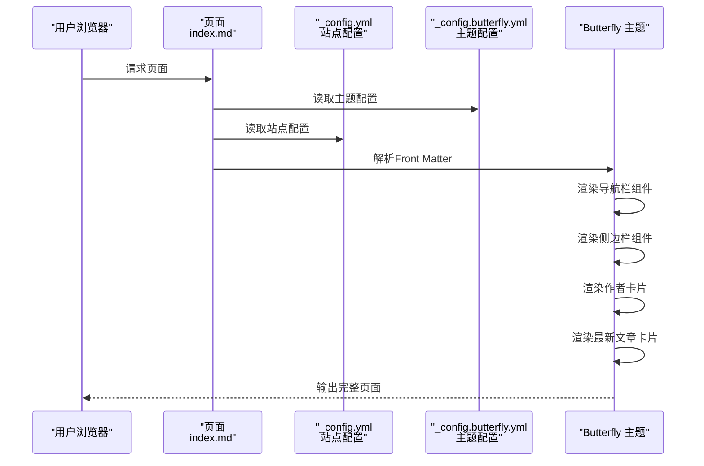
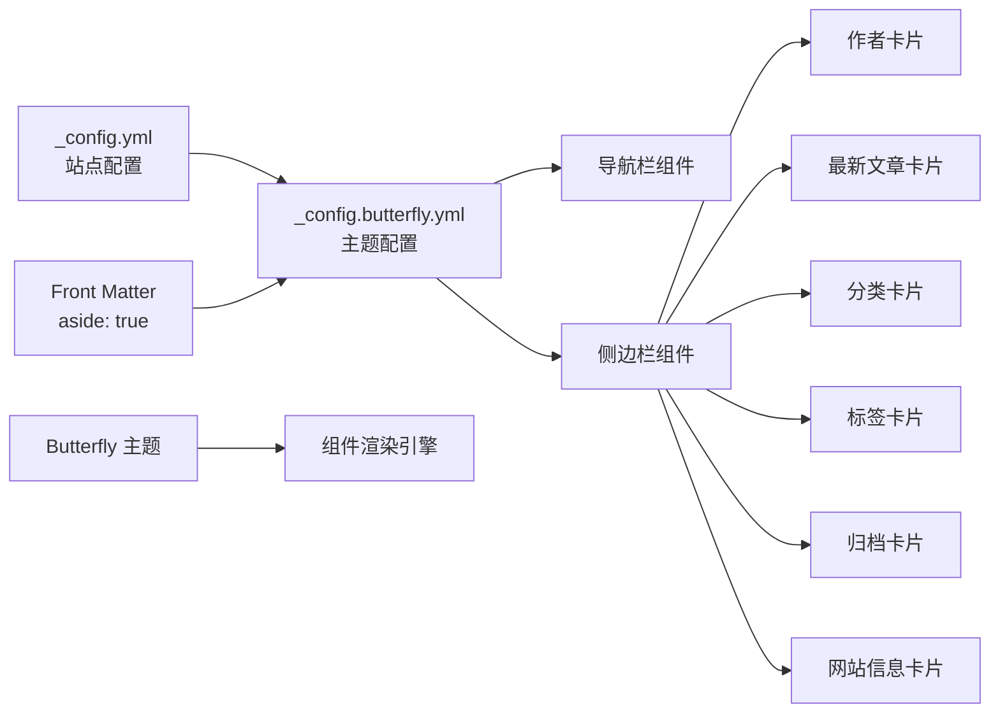

# 包含组件系统

<cite>
**本文引用的文件**
- [hexo-site/_config.yml](file://hexo-site/_config.yml)
- [hexo-site/_config.butterfly.yml](file://hexo-site/_config.butterfly.yml)
- [hexo-site/source/index.md](file://hexo-site/source/index.md)
- [hexo-site/source/about/index.md](file://hexo-site/source/about/index.md)
- [hexo-site/source/cv/index.md](file://hexo-site/source/cv/index.md)
- [hexo-site/source/publications/index.md](file://hexo-site/source/publications/index.md)
- [hexo-site/source/portfolio/index.md](file://hexo-site/source/portfolio/index.md)
</cite>

## 更新摘要
**所做更改**
- 更新了组件系统架构，从Jekyll的_include目录迁移到Butterfly主题内置组件
- 重新组织了核心组件分析，基于Butterfly主题的配置驱动架构
- 更新了配置文件引用，从_data目录迁移到_butterfly.yml配置文件
- 调整了组件依赖关系图，反映新的主题化组件系统

## 目录
1. [简介](#简介)
2. [项目结构](#项目结构)
3. [核心组件](#核心组件)
4. [架构总览](#架构总览)
5. [详细组件分析](#详细组件分析)
6. [依赖关系分析](#依赖关系分析)
7. [性能考量](#性能考量)
8. [故障排查指南](#故障排查指南)
9. [结论](#结论)
10. [附录](#附录)

## 简介
本文件系统性梳理基于Butterfly主题的"包含组件"体系，聚焦Hexo站点的可复用组件，解释其功能、实现原理与在主题中的装配方式，并给出定制、扩展与性能优化建议。重点覆盖以下组件：导航栏（nav）、侧边栏（aside）、作者资料卡片、最新文章卡片、分类卡片、标签卡片、归档卡片、网站信息卡片、页脚组件等。同时结合配置文件与数据文件，说明参数传递、条件渲染与样式覆盖方法。

**更新** 本版本反映了从Jekyll的_include目录到Butterfly主题内置组件的重大架构变更，采用Hexo主题化的组件系统。

## 项目结构
- 组件集中于Butterfly主题配置文件中，通过_config.butterfly.yml进行统一管理
- 页面通过front matter声明组件使用，如aside: true启用侧边栏
- 配置文件（_config.yml、_config.butterfly.yml）为组件提供运行期参数与功能开关
- 主题通过Liquid模板引擎渲染组件，实现高度可配置的页面结构

**图表来源**
- [hexo-site/_config.yml:119](file://hexo-site/_config.yml#L119)
- [hexo-site/_config.butterfly.yml:11](file://hexo-site/_config.butterfly.yml#L11)
- [hexo-site/_config.butterfly.yml:88](file://hexo-site/_config.butterfly.yml#L88)
- [hexo-site/source/index.md:4](file://hexo-site/source/index.md#L4)

## 核心组件
- 导航栏 nav：基于配置文件生成主导航菜单，支持Logo、固定定位、图标显示等功能
- 侧边栏 aside：统一管理各种信息卡片，支持启用/禁用、位置控制、移动端显示
- 作者资料卡片 card_author：显示个人简介、头像、社交链接等信息
- 最新文章卡片 card_recent_post：展示最近的文章列表，支持数量限制和排序方式
- 分类卡片 card_categories：显示文章分类列表，支持展开/折叠控制
- 标签卡片 card_tags：显示文章标签云，支持禁用功能
- 归档卡片 card_archives：显示文章归档列表，支持禁用功能
- 网站信息卡片 card_webinfo：显示网站统计信息，支持禁用功能
- 页脚组件：基于Butterfly主题的统一设计，支持社交媒体链接

**更新** 组件现在通过主题配置文件统一管理，而非独立的_include文件夹，实现了更好的主题化和可维护性。

**章节来源**
- [hexo-site/_config.butterfly.yml:11](file://hexo-site/_config.butterfly.yml#L11)
- [hexo-site/_config.butterfly.yml:88](file://hexo-site/_config.butterfly.yml#L88)
- [hexo-site/_config.butterfly.yml:104](file://hexo-site/_config.butterfly.yml#L104)
- [hexo-site/_config.butterfly.yml:119](file://hexo-site/_config.butterfly.yml#L119)
- [hexo-site/_config.butterfly.yml:133](file://hexo-site/_config.butterfly.yml#L133)
- [hexo-site/_config.butterfly.yml:137](file://hexo-site/_config.butterfly.yml#L137)
- [hexo-site/_config.butterfly.yml:141](file://hexo-site/_config.butterfly.yml#L141)

## 架构总览
组件装配遵循"主题配置 + Front Matter声明 + 组件渲染"的模式：主题配置文件统一定义组件功能；页面通过Front Matter声明启用特定组件；主题根据配置渲染相应的组件模块。

**图表来源**
- [hexo-site/_config.yml:119](file://hexo-site/_config.yml#L119)
- [hexo-site/_config.butterfly.yml:11](file://hexo-site/_config.butterfly.yml#L11)
- [hexo-site/source/index.md:4](file://hexo-site/source/index.md#L4)

## 详细组件分析

### 导航栏组件 nav
- 功能要点
  - 基于配置文件生成主导航菜单，支持Logo显示、标题显示、固定定位
  - 支持图标类名配置，如fas fa-home等Font Awesome图标
  - 动态生成菜单项，支持隐藏不需要的菜单项
- 关键实现
  - 通过_config.butterfly.yml的nav配置控制Logo路径、显示选项
  - menu配置定义菜单项格式：菜单名: /路径/ || 图标类名
  - 固定定位通过fixed配置控制导航栏是否固定在顶部
- 定制建议
  - 在_config.butterfly.yml中修改nav配置调整Logo和显示选项
  - 在menu配置中增删改菜单项，注释或删除即可隐藏

**章节来源**
- [hexo-site/_config.butterfly.yml:11](file://hexo-site/_config.butterfly.yml#L11)
- [hexo-site/_config.butterfly.yml:26](file://hexo-site/_config.butterfly.yml#L26)

### 侧边栏组件 aside
- 功能要点
  - 统一管理各种信息卡片，支持启用/禁用、位置控制、移动端显示
  - 支持左侧或右侧位置配置，移动端显示控制
  - 提供侧边栏切换按钮，支持隐藏侧边栏
- 关键实现
  - 通过aside配置控制整体开关、位置、移动端显示
  - 通过enable、hide、button等配置精确控制显示行为
  - 与页面Front Matter结合，如aside: true启用侧边栏
- 定制建议
  - 在aside配置中调整整体显示行为
  - 通过各个卡片配置启用或禁用特定功能

**章节来源**
- [hexo-site/_config.butterfly.yml:88](file://hexo-site/_config.butterfly.yml#L88)
- [hexo-site/source/index.md:5](file://hexo-site/source/index.md#L5)

### 作者资料卡片 card_author
- 功能要点
  - 显示个人简介、头像、社交链接等信息
  - 支持禁用Follow Me按钮，避免与社交图标重复
  - 通过description配置个人简介文字
- 关键实现
  - 通过card_author配置启用卡片功能
  - description字段直接配置个人简介文字
  - avatar配置控制头像显示和转动效果
- 定制建议
  - 在card_author配置中修改description内容
  - 调整avatar配置设置头像和效果

**章节来源**
- [hexo-site/_config.butterfly.yml:104](file://hexo-site/_config.butterfly.yml#L104)
- [hexo-site/_config.butterfly.yml:52](file://hexo-site/_config.butterfly.yml#L52)

### 最新文章卡片 card_recent_post
- 功能要点
  - 展示最近的文章列表，支持数量限制和排序方式
  - 支持按日期或更新时间排序
  - 可配置显示文章数量，影响页面性能
- 关键实现
  - 通过card_recent_post配置启用卡片功能
  - limit配置控制显示文章数量
  - sort配置控制排序方式（date或updated）
- 定制建议
  - 调整limit配置控制显示数量
  - 修改sort配置改变排序逻辑

**章节来源**
- [hexo-site/_config.butterfly.yml:119](file://hexo-site/_config.butterfly.yml#L119)
- [hexo-site/_config.butterfly.yml:120](file://hexo-site/_config.butterfly.yml#L120)
- [hexo-site/_config.butterfly.yml:124](file://hexo-site/_config.butterfly.yml#L124)

### 分类卡片 card_categories
- 功能要点
  - 显示文章分类列表，支持展开/折叠控制
  - 可配置显示数量限制
  - 支持expand配置控制展开行为
- 关键实现
  - 通过card_categories配置启用卡片功能
  - limit配置控制显示分类数量
  - expand配置控制展开策略（none、all等）
- 定制建议
  - 调整limit配置控制显示范围
  - 修改expand配置改变展开行为

**章节来源**
- [hexo-site/_config.butterfly.yml:127](file://hexo-site/_config.butterfly.yml#L127)
- [hexo-site/_config.butterfly.yml:128](file://hexo-site/_config.butterfly.yml#L128)
- [hexo-site/_config.butterfly.yml:131](file://hexo-site/_config.butterfly.yml#L131)

### 标签卡片 card_tags
- 功能要点
  - 显示文章标签云，支持禁用功能
  - 通过enable配置控制卡片启用状态
- 关键实现
  - 通过card_tags配置启用或禁用标签卡片
  - 标签云功能依赖Butterfly主题的标签云渲染
- 定制建议
  - 在需要时启用标签卡片功能
  - 根据页面布局调整标签云显示

**章节来源**
- [hexo-site/_config.butterfly.yml:133](file://hexo-site/_config.butterfly.yml#L133)
- [hexo-site/_config.butterfly.yml:134](file://hexo-site/_config.butterfly.yml#L134)

### 归档卡片 card_archives
- 功能要点
  - 显示文章归档列表，支持禁用功能
  - 通过enable配置控制卡片启用状态
- 关键实现
  - 通过card_archives配置启用或禁用归档卡片
  - 归档功能依赖Butterfly主题的归档渲染
- 定制建议
  - 根据内容规模启用或禁用归档卡片
  - 考虑页面加载性能影响

**章节来源**
- [hexo-site/_config.butterfly.yml:137](file://hexo-site/_config.butterfly.yml#L137)
- [hexo-site/_config.butterfly.yml:138](file://hexo-site/_config.butterfly.yml#L138)

### 网站信息卡片 card_webinfo
- 功能要点
  - 显示网站统计信息，支持禁用功能
  - 通过enable配置控制卡片启用状态
- 关键实现
  - 通过card_webinfo配置启用或禁用网站信息卡片
  - 统计信息包括文章数量、分类数量、标签数量等
- 定制建议
  - 根据需求启用网站信息展示
  - 考虑对性能的影响

**章节来源**
- [hexo-site/_config.butterfly.yml:141](file://hexo-site/_config.butterfly.yml#L141)
- [hexo-site/_config.butterfly.yml:142](file://hexo-site/_config.butterfly.yml#L142)

### 页脚组件
- 功能要点
  - 基于Butterfly主题的统一设计
  - 支持社交媒体链接配置
  - 与主题的整体设计风格保持一致
- 关键实现
  - 社交媒体链接通过social配置定义
  - 图标类名使用Font Awesome图标库
  - 颜色配置支持自定义主题色彩
- 定制建议
  - 在social配置中添加或修改社交媒体链接
  - 调整颜色配置匹配网站主题

**章节来源**
- [hexo-site/_config.butterfly.yml:36](file://hexo-site/_config.butterfly.yml#L36)
- [hexo-site/_config.butterfly.yml:38](file://hexo-site/_config.butterfly.yml#L38)

## 依赖关系分析
- 组件耦合
  - 页面通过Front Matter声明组件使用（如aside: true）
  - 主题配置文件统一管理组件功能和显示选项
  - 各卡片组件相互独立，通过aside配置统一启用
- 外部依赖
  - 依赖Butterfly主题提供的组件渲染引擎
  - 依赖Font Awesome图标库支持图标显示
  - 依赖Hexo的Liquid模板引擎进行页面渲染
- 循环依赖
  - 未发现循环依赖，组件间为单向配置依赖

**图表来源**
- [hexo-site/_config.yml:119](file://hexo-site/_config.yml#L119)
- [hexo-site/_config.butterfly.yml:88](file://hexo-site/_config.butterfly.yml#L88)
- [hexo-site/source/index.md:5](file://hexo-site/source/index.md#L5)

## 性能考量
- 资源加载
  - 通过配置控制卡片数量，避免过多组件影响页面加载
  - 侧边栏组件按需启用，减少不必要的DOM节点
  - 图标使用Font Awesome CDN，提高加载效率
- 条件渲染
  - 通过enable配置精确控制组件显示
  - Front Matter声明只在需要的页面启用组件
  - 移动端显示控制减少移动端性能负担
- 缓存与优化
  - 主题组件经过优化，减少JavaScript执行开销
  - CSS样式通过主题统一管理，避免重复加载

## 故障排查指南
- 导航栏不显示或显示异常
  - 检查_config.butterfly.yml中nav配置是否正确
  - 确认menu配置格式：菜单名: /路径/ || 图标类名
  - 参考路径：[hexo-site/_config.butterfly.yml:11](file://hexo-site/_config.butterfly.yml#L11)
- 侧边栏不显示
  - 检查页面Front Matter中aside: true是否正确设置
  - 确认_aside配置中enable: true是否启用
  - 参考路径：[hexo-site/source/index.md:5](file://hexo-site/source/index.md#L5)
- 卡片组件不显示
  - 检查对应卡片的enable配置是否为true
  - 确认limit配置不会导致内容过少
  - 参考路径：[hexo-site/_config.butterfly.yml:104](file://hexo-site/_config.butterfly.yml#L104)
- 图标显示异常
  - 检查Font Awesome图标类名是否正确
  - 确认图标库CDN是否正常加载
- 页面布局错乱
  - 检查移动端显示配置
  - 确认侧边栏位置配置（left/right）

**章节来源**
- [hexo-site/_config.butterfly.yml:11](file://hexo-site/_config.butterfly.yml#L11)
- [hexo-site/source/index.md:5](file://hexo-site/source/index.md#L5)
- [hexo-site/_config.butterfly.yml:104](file://hexo-site/_config.butterfly.yml#L104)

## 结论
该Butterfly主题组件系统通过"主题配置 + Front Matter声明 + 组件渲染"的方式，实现了高度可配置与可扩展的页面结构。各组件通过统一的配置文件管理，实现了更好的主题化和可维护性。相比之前的Jekyll_include目录，新的架构提供了更简洁的配置方式和更强的主题一致性。建议在保持配置简洁的前提下，合理使用组件功能，平衡页面性能与用户体验。

## 附录
- 参数传递与条件渲染
  - 通过_config.butterfly.yml配置控制组件功能
  - 通过页面Front Matter声明启用特定组件
  - 通过enable配置精确控制组件显示
- 样式覆盖
  - 在主题配置中使用inject.bottom添加自定义CSS
  - 注意移动端与不同设备的兼容性测试
  - 遵循Butterfly主题的样式规范
- 组件组合最佳实践
  - 在需要的页面通过Front Matter启用侧边栏
  - 合理配置卡片数量，避免页面过长
  - 使用主题提供的统一设计风格
  - 定期清理不需要的卡片配置，保持配置简洁