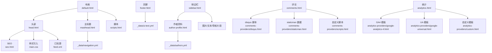
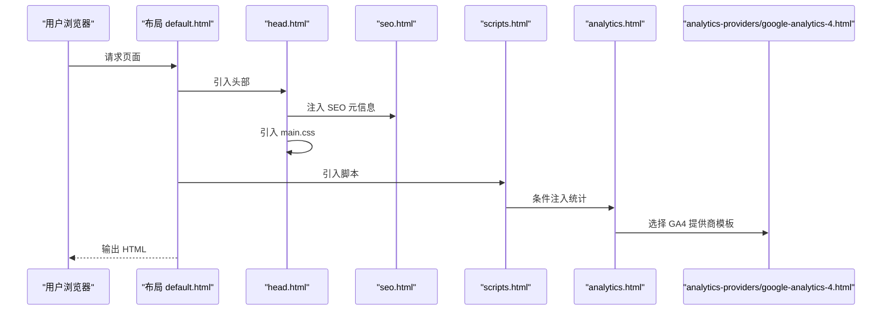
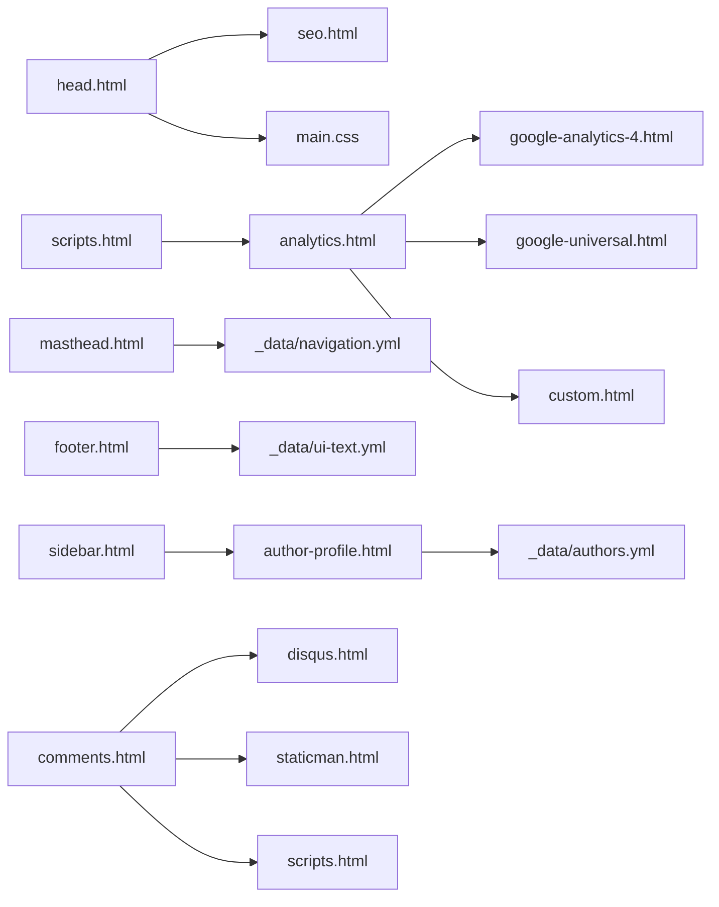

# 包含组件系统

<cite>
**本文引用的文件**
- [_includes/head.html](file://_includes/head.html)
- [_includes/masthead.html](file://_includes/masthead.html)
- [_includes/footer.html](file://_includes/footer.html)
- [_includes/breadcrumbs.html](file://_includes/breadcrumbs.html)
- [_includes/author-profile.html](file://_includes/author-profile.html)
- [_includes/analytics.html](file://_includes/analytics.html)
- [_includes/comments.html](file://_includes/comments.html)
- [_includes/scripts.html](file://_includes/scripts.html)
- [_includes/seo.html](file://_includes/seo.html)
- [_includes/sidebar.html](file://_includes/sidebar.html)
- [_includes/analytics-providers/google-analytics-4.html](file://_includes/analytics-providers/google-analytics-4.html)
- [_includes/analytics-providers/google-universal.html](file://_includes/analytics-providers/google-universal.html)
- [_includes/analytics-providers/custom.html](file://_includes/analytics-providers/custom.html)
- [_includes/comments-providers/disqus.html](file://_includes/comments-providers/disqus.html)
- [_includes/comments-providers/staticman.html](file://_includes/comments-providers/staticman.html)
- [_includes/comments-providers/scripts.html](file://_includes/comments-providers/scripts.html)
- [_layouts/default.html](file://_layouts/default.html)
- [_config.yml](file://_config.yml)
- [_data/navigation.yml](file://_data/navigation.yml)
- [_data/authors.yml](file://_data/authors.yml)
- [_data/ui-text.yml](file://_data/ui-text.yml)
</cite>

## 目录
1. [简介](#简介)
2. [项目结构](#项目结构)
3. [核心组件](#核心组件)
4. [架构总览](#架构总览)
5. [详细组件分析](#详细组件分析)
6. [依赖关系分析](#依赖关系分析)
7. [性能考量](#性能考量)
8. [故障排查指南](#故障排查指南)
9. [结论](#结论)
10. [附录](#附录)

## 简介
本文件系统性梳理站点的“包含组件”体系，聚焦 _includes 目录下的可复用组件，解释其功能、实现原理与在布局中的装配方式，并给出定制、扩展与性能优化建议。重点覆盖以下组件：头部（head.html）、主标题（masthead.html）、页脚（footer.html）、面包屑（breadcrumbs.html）、作者资料（author-profile.html）、统计（analytics.html）、评论（comments.html）、脚本（scripts.html）、SEO（seo.html）、侧边栏（sidebar.html）。同时结合配置文件与数据文件，说明参数传递、条件渲染与样式覆盖方法。

## 项目结构
- 组件集中于 _includes 目录，按职责拆分为通用头尾、导航、SEO、统计、评论、侧边栏等子模块。
- 布局文件 _layouts/default.html 将各组件拼装到最终页面骨架中。
- 配置与数据文件（_config.yml、_data/*.yml）为组件提供运行期参数与本地化文案。

图表来源
- [_layouts/default.html:1-32](file://_layouts/default.html#L1-L32)
- [_includes/head.html:1-17](file://_includes/head.html#L1-L17)
- [_includes/masthead.html:1-48](file://_includes/masthead.html#L1-L48)
- [_includes/footer.html:1-26](file://_includes/footer.html#L1-L26)
- [_includes/author-profile.html:1-177](file://_includes/author-profile.html#L1-L177)
- [_includes/sidebar.html:1-25](file://_includes/sidebar.html#L1-L25)
- [_includes/comments.html:1-84](file://_includes/comments.html#L1-L84)
- [_includes/analytics.html:1-14](file://_includes/analytics.html#L1-L14)
- [_includes/seo.html:1-147](file://_includes/seo.html#L1-L147)

章节来源
- [_layouts/default.html:1-32](file://_layouts/default.html#L1-L32)
- [_includes/head.html:1-17](file://_includes/head.html#L1-L17)
- [_includes/masthead.html:1-48](file://_includes/masthead.html#L1-L48)
- [_includes/footer.html:1-26](file://_includes/footer.html#L1-L26)
- [_includes/author-profile.html:1-177](file://_includes/author-profile.html#L1-L177)
- [_includes/sidebar.html:1-25](file://_includes/sidebar.html#L1-L25)
- [_includes/comments.html:1-84](file://_includes/comments.html#L1-L84)
- [_includes/analytics.html:1-14](file://_includes/analytics.html#L1-L14)
- [_includes/seo.html:1-147](file://_includes/seo.html#L1-L147)

## 核心组件
- 头部 head.html：负责基础路径、SEO 元信息、订阅源、viewport、基础 CSS 引入与 JS 初始化标记。
- 主标题 masthead.html：基于导航数据生成主导航菜单，支持多级下拉与主题切换入口。
- 页脚 footer.html：根据作者与站点配置输出社交链接与版权信息。
- 面包屑 breadcrumbs.html：依据页面路径与分类配置生成结构化导航。
- 作者资料 author-profile.html：按作者数据渲染头像、简介与多平台链接。
- 统计 analytics.html：根据配置选择统计提供商并注入相应脚本。
- 评论 comments.html：根据配置选择评论系统，支持 Disqus、Facebook、Google+、Staticman、自定义。
- 脚本 scripts.html：加载压缩后的主 JS 并内嵌统计注入。
- SEO seo.html：生成标题、描述、canonical、Open Graph、Twitter Card、结构化数据与站点验证元信息。
- 侧边栏 sidebar.html：按需渲染作者资料、图片/文本块与导航列表片段。

章节来源
- [_includes/head.html:1-17](file://_includes/head.html#L1-L17)
- [_includes/masthead.html:1-48](file://_includes/masthead.html#L1-L48)
- [_includes/footer.html:1-26](file://_includes/footer.html#L1-L26)
- [_includes/breadcrumbs.html:1-41](file://_includes/breadcrumbs.html#L1-L41)
- [_includes/author-profile.html:1-177](file://_includes/author-profile.html#L1-L177)
- [_includes/analytics.html:1-14](file://_includes/analytics.html#L1-L14)
- [_includes/comments.html:1-84](file://_includes/comments.html#L1-L84)
- [_includes/scripts.html:1-4](file://_includes/scripts.html#L1-L4)
- [_includes/seo.html:1-147](file://_includes/seo.html#L1-L147)
- [_includes/sidebar.html:1-25](file://_includes/sidebar.html#L1-L25)

## 架构总览
组件装配遵循“布局拼装 + 数据驱动”的模式：布局文件统一引入 head/masthead/scripts 等组件；组件内部通过 Liquid 模板读取 _config.yml 与 _data/*.yml 的配置，实现参数化渲染与条件逻辑。

图表来源
- [_layouts/default.html:1-32](file://_layouts/default.html#L1-L32)
- [_includes/head.html:1-17](file://_includes/head.html#L1-L17)
- [_includes/seo.html:1-147](file://_includes/seo.html#L1-L147)
- [_includes/scripts.html:1-4](file://_includes/scripts.html#L1-L4)
- [_includes/analytics.html:1-14](file://_includes/analytics.html#L1-L14)
- [_includes/analytics-providers/google-analytics-4.html](file://_includes/analytics-providers/google-analytics-4.html)

## 详细组件分析

### 头部组件 head.html
- 功能要点
  - 设置基础路径与字符集。
  - 内嵌 SEO 组件，生成标题、描述、canonical、Open Graph/Twitter 卡片等。
  - 引入 Atom/RSS 订阅源链接。
  - 设置 viewport 与基础 CSS。
  - 通过脚本标记启用 JS 能力。
- 关键实现
  - 使用站点配置与页面上下文动态生成标题与描述。
  - 通过条件判断决定订阅源路径。
  - 采用模块化脚本加载策略，便于后续扩展统计与第三方脚本。
- 定制建议
  - 在 head/custom.html 中追加自定义 meta 或预连接资源。
  - 如需延迟加载第三方脚本，可在 scripts.html 中调整加载时机。

章节来源
- [_includes/head.html:1-17](file://_includes/head.html#L1-L17)
- [_includes/seo.html:1-147](file://_includes/seo.html#L1-L147)
- [_layouts/default.html:1-32](file://_layouts/default.html#L1-L32)

### 主标题组件 masthead.html
- 功能要点
  - 从 _data/navigation.yml 读取主导航条目，支持二级下拉菜单。
  - 判断当前页面高亮对应菜单项。
  - 提供主题切换入口（图标按钮）。
- 关键实现
  - 对外链与站内链接分别处理域名前缀。
  - 递归渲染带 children 的菜单项。
  - 使用类名控制选中态与布局。
- 定制建议
  - 在 navigation.yml 中增删改导航项即可调整菜单结构。
  - 可通过样式覆盖选中态与下拉菜单外观。

章节来源
- [_includes/masthead.html:1-48](file://_includes/masthead.html#L1-L48)
- [_data/navigation.yml:1-40](file://_data/navigation.yml#L1-L40)

### 页脚组件 footer.html
- 功能要点
  - 条件渲染社交图标（GitHub、Bitbucket、RSS）。
  - 输出版权信息与站点更新时间。
  - 文案来自 _data/ui-text.yml 的本地化字典。
- 关键实现
  - 通过站点作者配置与开关控制社交链接显示。
  - 订阅源路径同样由站点配置或默认值决定。
- 定制建议
  - 在 _config.yml 中配置作者社交账号或隐藏 RSS。
  - 在 footer/custom.html 中追加自定义内容。

章节来源
- [_includes/footer.html:1-26](file://_includes/footer.html#L1-L26)
- [_data/ui-text.yml:1-355](file://_data/ui-text.yml#L1-L355)

### 面包屑组件 breadcrumbs.html
- 功能要点
  - 基于页面 URL 逐段生成面包屑路径。
  - 支持不同归档类型（Liquid/Jekyll Archives）的路径前缀差异。
  - 结构化输出 Schema.org 的 BreadcrumbList。
- 关键实现
  - 通过本地化字典控制“首页”标签与分隔符。
  - 对分类路径进行适配，非文章集合时回退到根路径。
- 定制建议
  - 在 _config.yml 中开启/关闭面包屑。
  - 通过 ui-text.yml 自定义标签与分隔符。

章节来源
- [_includes/breadcrumbs.html:1-41](file://_includes/breadcrumbs.html#L1-L41)
- [_data/ui-text.yml:1-355](file://_data/ui-text.yml#L1-L355)

### 作者资料组件 author-profile.html
- 功能要点
  - 优先使用页面指定作者，否则回退到站点作者。
  - 渲染头像、姓名、代词、简介等基础信息。
  - 按作者数据渲染各类学术、开发、社交链接。
- 关键实现
  - 图片路径支持绝对/相对，自动补全 base_path。
  - 使用结构化标记（Schema.org Person）增强语义。
- 定制建议
  - 在 _data/authors.yml 中维护作者档案。
  - 通过样式覆盖列表项与图标间距。

章节来源
- [_includes/author-profile.html:1-177](file://_includes/author-profile.html#L1-L177)
- [_data/authors.yml:1-19](file://_data/authors.yml#L1-L19)

### 统计组件 analytics.html
- 功能要点
  - 根据站点配置选择统计提供商（Google Analytics 4、Universal、Custom）。
  - 条件渲染，避免对不启用统计的页面注入脚本。
- 关键实现
  - 通过 case when 分发至具体提供商模板。
  - 提供自定义模板以便接入其他统计服务。
- 定制建议
  - 在 _config.yml 中设置 analytics.provider 与 tracking_id。
  - 在 analytics-providers/custom.html 中添加自定义统计代码。

章节来源
- [_includes/analytics.html:1-14](file://_includes/analytics.html#L1-L14)
- [_includes/analytics-providers/google-analytics-4.html](file://_includes/analytics-providers/google-analytics-4.html)
- [_includes/analytics-providers/google-universal.html](file://_includes/analytics-providers/google-universal.html)
- [_includes/analytics-providers/custom.html](file://_includes/analytics-providers/custom.html)
- [_config.yml:156-161](file://_config.yml#L156-L161)

### 评论组件 comments.html
- 功能要点
  - 根据配置选择评论系统：Disqus、Facebook、Google+、Staticman、Custom。
  - Disqus/Facebook/Google+：注入所需容器与属性。
  - Staticman：读取 _data/comments 下的 YAML 数据，渲染历史评论并提供表单。
  - Custom：预留容器并引入自定义脚本。
- 关键实现
  - 使用本地化文案控制标题、提示与按钮文本。
  - 表单字段与选项来自站点配置与页面 slug。
- 定制建议
  - 在 _config.yml 中配置 comments.provider 与各提供商参数。
  - 在 comments-providers/scripts.html 中追加自定义脚本。

章节来源
- [_includes/comments.html:1-84](file://_includes/comments.html#L1-L84)
- [_includes/comments-providers/disqus.html](file://_includes/comments-providers/disqus.html)
- [_includes/comments-providers/staticman.html](file://_includes/comments-providers/staticman.html)
- [_includes/comments-providers/scripts.html](file://_includes/comments-providers/scripts.html)
- [_config.yml:101-127](file://_config.yml#L101-L127)

### 脚本组件 scripts.html
- 功能要点
  - 加载压缩后的主 JS 文件。
  - 条件内嵌统计组件，确保统计脚本在页面底部注入。
- 关键实现
  - 使用模块化脚本加载，利于缓存与并发。
  - 与 analytics.html 形成“先加载主脚本，再按需注入统计”的顺序。
- 定制建议
  - 在 scripts.html 中追加第三方脚本或延迟加载策略。

章节来源
- [_includes/scripts.html:1-4](file://_includes/scripts.html#L1-L4)
- [_includes/analytics.html:1-14](file://_includes/analytics.html#L1-L14)

### SEO 组件 seo.html
- 功能要点
  - 生成标题、描述、canonical、分页 prev/next。
  - 生成 Twitter Card（summary/summary_large_image）与 Open Graph 元信息。
  - 输出结构化数据（JSON-LD），支持 Publisher 与 Organization。
  - 站点验证 meta（Google、Bing、Alexa、Yandex）。
- 关键实现
  - 严格处理页面 excerpt/description/fallback，避免空内容污染 SEO。
  - 作者 Twitter ID 解析与去前缀，提升卡片作者识别率。
  - 图片路径支持绝对/相对，自动补全 base_path。
- 定制建议
  - 在 _config.yml 中配置 og_image、social.links、验证 token。
  - 在 seo.html 中按需扩展更多社交协议字段。

章节来源
- [_includes/seo.html:1-147](file://_includes/seo.html#L1-L147)
- [_config.yml:132-154](file://_config.yml#L132-L154)

### 侧边栏组件 sidebar.html
- 功能要点
  - 条件渲染：页面或布局声明 author_profile 或 sidebar。
  - 支持插入图片（含 alt）、标题、富文本（markdownify）与导航列表片段。
- 关键实现
  - 通过 page.sidebar 遍历配置块，按需渲染。
  - 图片路径同样支持绝对/相对。
- 定制建议
  - 在页面 front matter 中设置 sidebar 字段，或在布局中统一声明。
  - 使用 nav_list 片段（需同目录存在）组织导航。

章节来源
- [_includes/sidebar.html:1-25](file://_includes/sidebar.html#L1-L25)

## 依赖关系分析
- 组件耦合
  - head.html 依赖 seo.html 与站点配置；scripts.html 依赖 analytics.html。
  - masthead.html 依赖 _data/navigation.yml；footer.html 依赖 _data/ui-text.yml。
  - author-profile.html 依赖 _data/authors.yml；sidebar.html 依赖 author-profile.html 与页面/布局声明。
  - comments.html 依赖 comments-providers 下的多个模板。
- 外部依赖
  - 统计与评论系统由提供商模板决定，可通过自定义模板扩展。
- 循环依赖
  - 未发现循环 include，组件间为单向依赖。

图表来源
- [_includes/head.html:1-17](file://_includes/head.html#L1-L17)
- [_includes/seo.html:1-147](file://_includes/seo.html#L1-L147)
- [_includes/scripts.html:1-4](file://_includes/scripts.html#L1-L4)
- [_includes/analytics.html:1-14](file://_includes/analytics.html#L1-L14)
- [_includes/analytics-providers/google-analytics-4.html](file://_includes/analytics-providers/google-analytics-4.html)
- [_includes/analytics-providers/google-universal.html](file://_includes/analytics-providers/google-universal.html)
- [_includes/analytics-providers/custom.html](file://_includes/analytics-providers/custom.html)
- [_includes/masthead.html:1-48](file://_includes/masthead.html#L1-L48)
- [_data/navigation.yml:1-40](file://_data/navigation.yml#L1-L40)
- [_includes/footer.html:1-26](file://_includes/footer.html#L1-L26)
- [_data/ui-text.yml:1-355](file://_data/ui-text.yml#L1-L355)
- [_includes/author-profile.html:1-177](file://_includes/author-profile.html#L1-L177)
- [_data/authors.yml:1-19](file://_data/authors.yml#L1-L19)
- [_includes/sidebar.html:1-25](file://_includes/sidebar.html#L1-L25)
- [_includes/comments.html:1-84](file://_includes/comments.html#L1-L84)
- [_includes/comments-providers/disqus.html](file://_includes/comments-providers/disqus.html)
- [_includes/comments-providers/staticman.html](file://_includes/comments-providers/staticman.html)
- [_includes/comments-providers/scripts.html](file://_includes/comments-providers/scripts.html)

## 性能考量
- 资源加载
  - 使用模块化脚本与压缩样式，减少阻塞。
  - 将统计脚本延迟到 DOMContentLoaded 后注入，避免阻塞首屏。
- 条件渲染
  - 仅在需要时渲染评论与统计，降低不必要的网络请求。
  - 通过开关控制面包屑与作者资料，减少 DOM 节点数量。
- 缓存与预连接
  - 在 head/custom.html 中添加 DNS 预连接与资源预加载，提升第三方统计/评论服务的首屏表现。
- 图片与媒体
  - 为头像与侧边栏图片设置合适的尺寸与 lazy 加载策略（如适用）。

## 故障排查指南
- SEO 标题/描述为空
  - 检查页面 excerpt/description 是否缺失，确认 _config.yml 中 site.description 是否配置。
  - 参考路径：[_includes/seo.html:23-27](file://_includes/seo.html#L23-L27)
- canonical 链接错误
  - 确认 _config.yml 中 site.url/baseurl 配置正确。
  - 参考路径：[_includes/seo.html:17-49](file://_includes/seo.html#L17-L49)
- 面包屑不显示或路径异常
  - 检查 _config.yml 中 category_archive.type/path 与 breadcrumbs 开关。
  - 参考路径：[_includes/breadcrumbs.html:3-15](file://_includes/breadcrumbs.html#L3-L15)
- 评论区空白
  - 确认 comments.provider 与相关配置（如 disqus.shortname、staticman.*）是否正确。
  - 参考路径：[_config.yml:101-127](file://_config.yml#L101-L127)
- 统计无数据
  - 检查 analytics.provider 与 tracking_id，确认 analytics-providers 模板已正确配置。
  - 参考路径：[_config.yml:156-161](file://_config.yml#L156-L161)
- 导航下拉不生效
  - 检查 _data/navigation.yml 的 children 结构与链接路径。
  - 参考路径：[_includes/masthead.html:17-38](file://_includes/masthead.html#L17-L38)

章节来源
- [_includes/seo.html:17-49](file://_includes/seo.html#L17-L49)
- [_includes/breadcrumbs.html:3-15](file://_includes/breadcrumbs.html#L3-L15)
- [_config.yml:101-161](file://_config.yml#L101-L161)
- [_includes/masthead.html:17-38](file://_includes/masthead.html#L17-L38)

## 结论
该包含组件系统通过“布局装配 + 数据驱动”的方式，实现了高度可配置与可扩展的页面结构。各组件职责清晰、边界明确，配合配置与数据文件即可完成主题、导航、SEO、统计、评论与侧边栏的定制。建议在保持组件独立性的前提下，利用自定义模板与本地化文案，进一步提升站点的个性化与国际化能力。

## 附录
- 参数传递与条件渲染
  - 通过 _config.yml 与页面 front matter 控制组件行为。
  - 通过 _data/*.yml 提供本地化文案与导航数据。
- 样式覆盖
  - 在主题 SCSS 或自定义 CSS 中覆盖组件默认样式。
  - 注意移动端与暗色主题的兼容性测试。
- 组件组合最佳实践
  - 在 default.html 中按需引入组件，避免对静态资源型页面注入评论与统计。
  - 使用 sidebar 统一管理作者资料与辅助导航，减少重复代码。
  - 将第三方脚本集中在 scripts.html 中统一管理，便于版本与性能控制。