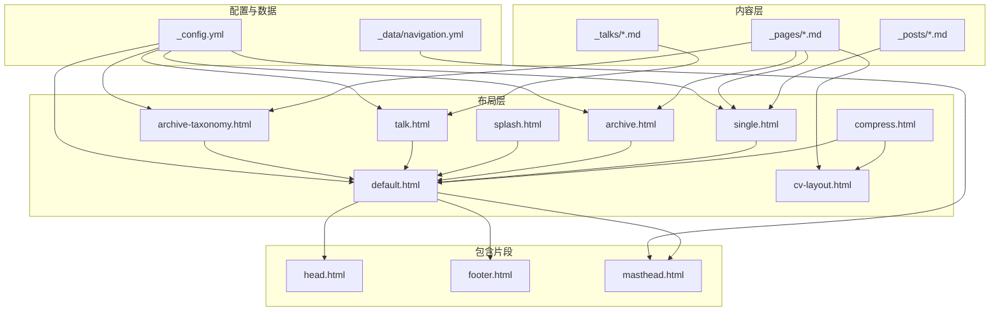
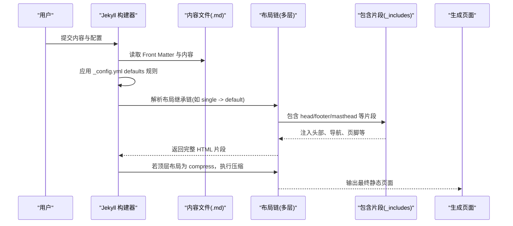
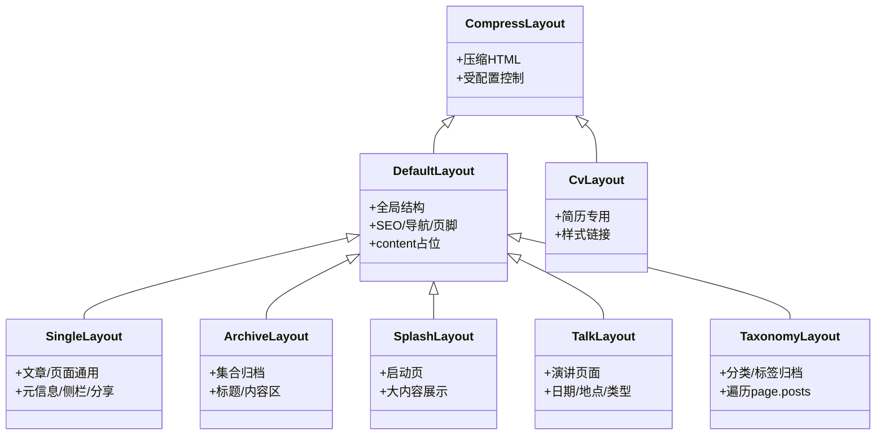
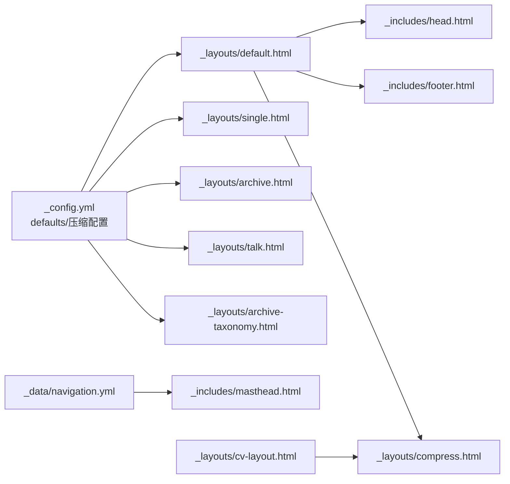

# 布局系统详解

<cite>
**本文引用的文件**
- [_layouts/default.html](file://_layouts/default.html)
- [_layouts/single.html](file://_layouts/single.html)
- [_layouts/archive.html](file://_layouts/archive.html)
- [_layouts/cv-layout.html](file://_layouts/cv-layout.html)
- [_layouts/splash.html](file://_layouts/splash.html)
- [_layouts/talk.html](file://_layouts/talk.html)
- [_layouts/archive-taxonomy.html](file://_layouts/archive-taxonomy.html)
- [_layouts/compress.html](file://_layouts/compress.html)
- [_config.yml](file://_config.yml)
- [_includes/head.html](file://_includes/head.html)
- [_includes/footer.html](file://_includes/footer.html)
- [_includes/masthead.html](file://_includes/masthead.html)
- [_pages/about.md](file://_pages/about.md)
- [_posts/2025-03-11-my-first-blog.md](file://_posts/2025-03-11-my-first-blog.md)
- [_pages/cv.md](file://_pages/cv.md)
- [_talks/2012-03-01-talk-1.md](file://_talks/2012-03-01-talk-1.md)
- [_data/navigation.yml](file://_data/navigation.yml)
</cite>

## 目录
1. [引言](#引言)
2. [项目结构](#项目结构)
3. [核心组件](#核心组件)
4. [架构总览](#架构总览)
5. [详细组件分析](#详细组件分析)
6. [依赖分析](#依赖分析)
7. [性能考虑](#性能考虑)
8. [故障排查指南](#故障排查指南)
9. [结论](#结论)
10. [附录](#附录)

## 引言
本文件面向 Jekyll 布局系统的使用者与维护者，系统性阐述布局继承原理、Front Matter 配置与页面渲染流程；逐项解析 default.html、single.html、archive.html、cv-layout.html、splash.html、talk.html、archive-taxonomy.html 与 compress.html 的职责、适用场景与协作关系；并给出最佳实践与性能优化建议。读者无需深入代码即可理解如何选择与扩展布局。

## 项目结构
本项目的布局系统位于 _layouts 目录，配合 _includes 提供可复用的头部、页脚、导航等片段；站点配置与默认布局策略集中在 _config.yml；页面与集合通过 Front Matter 指定布局与元数据。

图示来源
- [_layouts/default.html:1-32](file://_layouts/default.html#L1-L32)
- [_layouts/single.html:1-110](file://_layouts/single.html#L1-L110)
- [_layouts/archive.html:1-25](file://_layouts/archive.html#L1-L25)
- [_layouts/cv-layout.html:1-40](file://_layouts/cv-layout.html#L1-L40)
- [_layouts/splash.html:1-23](file://_layouts/splash.html#L1-L23)
- [_layouts/talk.html:1-79](file://_layouts/talk.html#L1-L79)
- [_layouts/archive-taxonomy.html:1-16](file://_layouts/archive-taxonomy.html#L1-L16)
- [_layouts/compress.html:1-11](file://_layouts/compress.html#L1-L11)
- [_includes/head.html:1-17](file://_includes/head.html#L1-L17)
- [_includes/footer.html:1-26](file://_includes/footer.html#L1-L26)
- [_includes/masthead.html:1-48](file://_includes/masthead.html#L1-L48)
- [_config.yml:239-293](file://_config.yml#L239-L293)
- [_data/navigation.yml:10-40](file://_data/navigation.yml#L10-L40)

章节来源
- [_config.yml:239-293](file://_config.yml#L239-L293)
- [_layouts/default.html:1-32](file://_layouts/default.html#L1-L32)
- [_layouts/compress.html:1-11](file://_layouts/compress.html#L1-L11)

## 核心组件
- default.html：基础布局，负责全局结构、SEO、导航、脚本与页脚；其他布局通常继承自它。
- single.html：通用文章/页面布局，适配博客文章、页面、教学、出版物、作品集等集合项。
- archive.html：归档页面布局，用于集合归档页（如年份归档）。
- cv-layout.html：简历专用布局，独立于 default.html，内置简历样式链接。
- splash.html：启动页/简介页布局，适合首页或介绍性页面。
- talk.html：演讲页面布局，增强日期、地点、类型等元信息展示。
- archive-taxonomy.html：分类/标签归档布局，按分类或标签列出条目。
- compress.html：HTML 压缩布局，通过 Liquid 过滤器减少空白与注释，降低体积。

章节来源
- [_layouts/default.html:1-32](file://_layouts/default.html#L1-L32)
- [_layouts/single.html:1-110](file://_layouts/single.html#L1-L110)
- [_layouts/archive.html:1-25](file://_layouts/archive.html#L1-L25)
- [_layouts/cv-layout.html:1-40](file://_layouts/cv-layout.html#L1-L40)
- [_layouts/splash.html:1-23](file://_layouts/splash.html#L1-L23)
- [_layouts/talk.html:1-79](file://_layouts/talk.html#L1-L79)
- [_layouts/archive-taxonomy.html:1-16](file://_layouts/archive-taxonomy.html#L1-L16)
- [_layouts/compress.html:1-11](file://_layouts/compress.html#L1-L11)

## 架构总览
Jekyll 渲染流程遵循“Front Matter 决策 + 默认规则 + 布局继承”的模式。内容文件通过 Front Matter 指定 layout，未指定时依据 _config.yml 中 defaults 的规则自动应用；布局之间通过 Front Matter 的 layout 字段实现继承，最终由 compress.html 对输出进行压缩。

图示来源
- [_config.yml:239-293](file://_config.yml#L239-L293)
- [_layouts/compress.html:1-11](file://_layouts/compress.html#L1-L11)
- [_layouts/default.html:1-32](file://_layouts/default.html#L1-L32)
- [_layouts/single.html:1-110](file://_layouts/single.html#L1-L110)

## 详细组件分析

### 基础布局：default.html
- 作用：提供全局 HTML 结构、语言属性、主题开关、SEO 片段、导航栏、页脚与脚本。
- 继承：被 single、archive、splash、talk、archive-taxonomy 等布局继承。
- 变量传递：通过 include 片段注入 head、footer、masthead 等，content 占位符承载子布局内容。
- 主题与语言：根据站点配置设置语言前缀与主题属性。

章节来源
- [_layouts/default.html:1-32](file://_layouts/default.html#L1-L32)
- [_includes/head.html:1-17](file://_includes/head.html#L1-L17)
- [_includes/footer.html:1-26](file://_includes/footer.html#L1-L26)
- [_includes/masthead.html:1-48](file://_includes/masthead.html#L1-L48)

### 文章/页面通用布局：single.html
- 作用：适用于博客文章、页面、教学、出版物、作品集等集合项。
- 特性：条件加载 hero 图像、面包屑导航、侧边栏、阅读时间、元信息、社交分享、分页与相关文章。
- 元信息：根据集合类型动态展示日期、期刊、会议等字段。
- 使用场景：绝大多数内容页的首选布局。

章节来源
- [_layouts/single.html:1-110](file://_layouts/single.html#L1-L110)

### 归档页面布局：archive.html
- 作用：用于集合归档页（如年份归档），展示标题与内容区。
- 特性：条件加载 hero 与面包屑；左侧侧边栏；主体 archive 容器承载条目列表。

章节来源
- [_layouts/archive.html:1-25](file://_layouts/archive.html#L1-L25)

### 简历专用布局：cv-layout.html
- 作用：简历专用页面布局，独立于 default.html。
- 特性：内置简历样式表链接，提供简洁的容器化内容区域与页脚。
- 使用场景：简历页面（如 /cv/）。

章节来源
- [_layouts/cv-layout.html:1-40](file://_layouts/cv-layout.html#L1-L40)

### 启动页布局：splash.html
- 作用：适合首页或介绍性页面，强调大块内容展示。
- 特性：无侧边栏，采用 splash 容器承载内容。

章节来源
- [_layouts/splash.html:1-23](file://_layouts/splash.html#L1-L23)

### 演讲页面布局：talk.html
- 作用：专门用于演讲类内容，增强日期、地点、类型等元信息展示。
- 特性：与 single.html 类似，但针对演讲场景定制元信息与展示逻辑。

章节来源
- [_layouts/talk.html:1-79](file://_layouts/talk.html#L1-L79)

### 分类/标签归档布局：archive-taxonomy.html
- 作用：按分类或标签列出条目，适合标签页与分类页。
- 特性：从 page.posts 遍历条目，逐个包含 archive-single 片段。

章节来源
- [_layouts/archive-taxonomy.html:1-16](file://_layouts/archive-taxonomy.html#L1-L16)

### 页面压缩布局：compress.html
- 作用：对最终 HTML 输出进行压缩，移除多余空白、注释与特定标签边界换行。
- 配置：受 _config.yml 中 compress_html 选项控制，支持忽略环境（如 development）。
- 行为：通过一系列字符串替换与过滤实现压缩，可选输出压缩统计表格。

章节来源
- [_layouts/compress.html:1-11](file://_layouts/compress.html#L1-L11)
- [_config.yml:356-362](file://_config.yml#L356-L362)

### 布局继承关系与变量传递
- 继承链：single → default；archive → default；splash → default；talk → default；archive-taxonomy → default；compress 可作为 default 与 cv-layout 的顶层包裹。
- 变量传递：content 占位符承载子布局内容；include 片段注入 head、footer、masthead 等；导航数据来自 _data/navigation.yml。
- 默认布局：_config.yml defaults 为不同集合类型指定默认布局（如 posts/pages/teaching/publications/portfolio/talks）。

图示来源
- [_layouts/compress.html:1-11](file://_layouts/compress.html#L1-L11)
- [_layouts/default.html:1-32](file://_layouts/default.html#L1-L32)
- [_layouts/single.html:1-110](file://_layouts/single.html#L1-L110)
- [_layouts/archive.html:1-25](file://_layouts/archive.html#L1-L25)
- [_layouts/cv-layout.html:1-40](file://_layouts/cv-layout.html#L1-L40)
- [_layouts/splash.html:1-23](file://_layouts/splash.html#L1-L23)
- [_layouts/talk.html:1-79](file://_layouts/talk.html#L1-L79)
- [_layouts/archive-taxonomy.html:1-16](file://_layouts/archive-taxonomy.html#L1-L16)

## 依赖分析
- 配置驱动：_config.yml 的 defaults 为集合类型提供默认布局，确保一致性。
- 数据驱动：_data/navigation.yml 提供导航菜单数据，masthead 读取并渲染。
- 片段依赖：default.html 依赖 head.html、footer.html、masthead.html 等片段。
- 压缩依赖：compress.html 依赖 _config.yml 中 compress_html 配置项。

图示来源
- [_config.yml:239-293](file://_config.yml#L239-L293)
- [_config.yml:356-362](file://_config.yml#L356-L362)
- [_data/navigation.yml:10-40](file://_data/navigation.yml#L10-L40)
- [_layouts/default.html:1-32](file://_layouts/default.html#L1-L32)
- [_layouts/compress.html:1-11](file://_layouts/compress.html#L1-L11)
- [_includes/masthead.html:1-48](file://_includes/masthead.html#L1-L48)
- [_includes/head.html:1-17](file://_includes/head.html#L1-L17)
- [_includes/footer.html:1-26](file://_includes/footer.html#L1-L26)

章节来源
- [_config.yml:239-293](file://_config.yml#L239-L293)
- [_config.yml:356-362](file://_config.yml#L356-L362)
- [_data/navigation.yml:10-40](file://_data/navigation.yml#L10-L40)
- [_layouts/default.html:1-32](file://_layouts/default.html#L1-L32)

## 性能考虑
- 启用压缩：在生产环境启用 compress_html，避免在开发环境产生不必要的压缩开销。
- 减少冗余：优先使用 default.html 作为父布局，避免重复引入相同片段。
- 条件加载：仅在需要时加载面包屑、侧边栏与社交分享，降低 DOM 复杂度。
- 资源优化：将简历样式等仅在 cv-layout.html 中引入，避免对普通页面造成额外负担。
- 预渲染：合理使用 include 片段，避免在循环中重复计算复杂逻辑。

## 故障排查指南
- 布局未生效
  - 检查 Front Matter 是否正确声明 layout。
  - 确认 _config.yml defaults 是否覆盖了预期集合类型的默认布局。
- 导航不显示
  - 检查 _data/navigation.yml 的结构与键名是否正确。
  - 确认 masthead.html 中的 include 与数据访问路径。
- 压缩异常
  - 在开发环境设置忽略压缩，避免影响调试。
  - 检查 compress_html 配置项是否与当前环境匹配。
- 页面缺少 SEO 或样式
  - 确认 default.html 已包含 head.html 与必要的 CSS 链接。
  - 检查 head.html 中的 SEO 片段是否正常工作。

章节来源
- [_config.yml:356-362](file://_config.yml#L356-L362)
- [_layouts/default.html:1-32](file://_layouts/default.html#L1-L32)
- [_includes/head.html:1-17](file://_includes/head.html#L1-L17)
- [_includes/masthead.html:1-48](file://_includes/masthead.html#L1-L48)
- [_data/navigation.yml:10-40](file://_data/navigation.yml#L10-L40)

## 结论
本布局系统以 default.html 为核心，通过 compress.html 实现输出优化，single/archive/talk/splash/archive-taxonomy/cv-layout 等布局分别覆盖常见页面类型。借助 _config.yml defaults 与 Front Matter，系统实现了高内聚、低耦合的布局继承与变量传递机制。遵循本文最佳实践与性能建议，可显著提升开发效率与站点性能。

## 附录

### 布局选择最佳实践
- 博客文章与页面：优先使用 single.html，便于统一元信息与社交分享。
- 归档页：使用 archive.html 或 archive-taxonomy.html，结合面包屑与侧边栏提升可发现性。
- 演讲/报告：使用 talk.html，突出日期、地点与类型信息。
- 简历：使用 cv-layout.html，避免通用布局的冗余元素。
- 首页/介绍页：使用 splash.html，强调大内容展示。
- 压缩：将 compress.html 设为顶层布局，确保生产环境输出最小化。

### 自定义布局开发指南
- 新增布局：在 _layouts 下创建新文件，必要时在 Front Matter 指定 layout 继承。
- 复用片段：通过 include 引入 head、footer、masthead 等，保持一致性。
- 配置覆盖：在 _config.yml defaults 中为新集合类型设置默认布局。
- 调试与测试：在开发环境关闭压缩，验证布局与数据渲染；生产环境开启压缩并检查输出体积。

### 示例参考
- 首页（Front Matter 指定首页标题与重定向）
  - [_pages/about.md:1-8](file://_pages/about.md#L1-L8)
- 博客文章（Front Matter 指定 single 布局与分类/标签）
  - [_posts/2025-03-11-my-first-blog.md:1-16](file://_posts/2025-03-11-my-first-blog.md#L1-L16)
- 简历页面（Front Matter 指定 archive 布局与永久链接）
  - [_pages/cv.md:1-8](file://_pages/cv.md#L1-L8)
- 演讲条目（Front Matter 指定 talks 集合与元信息）
  - [_talks/2012-03-01-talk-1.md:1-9](file://_talks/2012-03-01-talk-1.md#L1-L9)