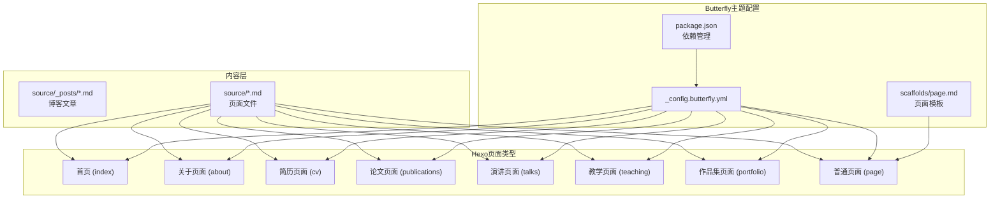
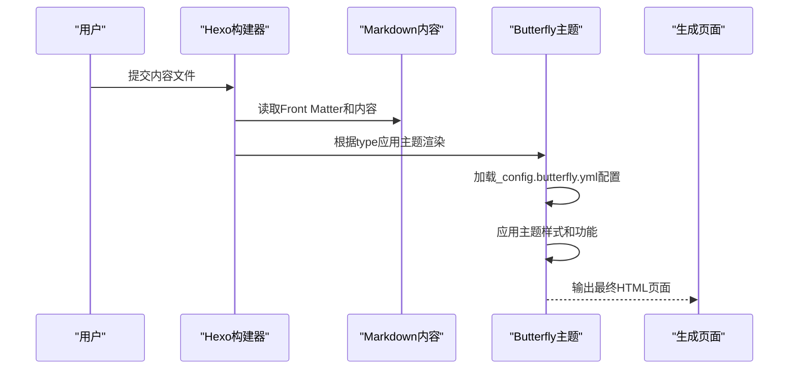
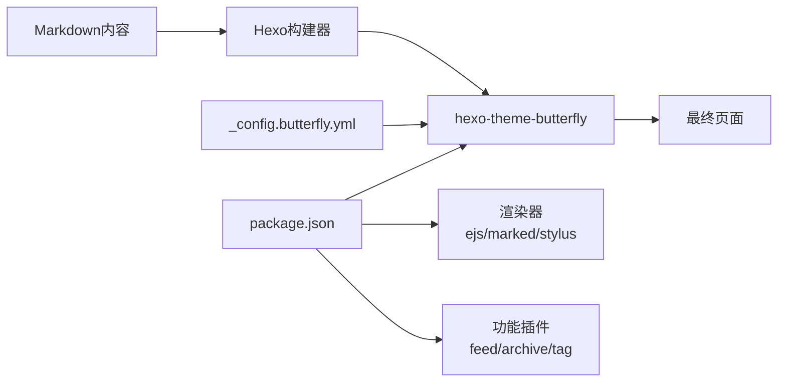

# 布局系统详解

<cite>
**本文引用的文件**
- [_config.yml](file://hexo-site/_config.yml)
- [_config.butterfly.yml](file://hexo-site/_config.butterfly.yml)
- [package.json](file://hexo-site/package.json)
- [开发文档.md](file://开发文档.md)
- [README.md](file://README.md)
- [source/index.md](file://hexo-site/source/index.md)
- [source/about/index.md](file://hexo-site/source/about/index.md)
- [source/cv/index.md](file://hexo-site/source/cv/index.md)
- [source/publications/index.md](file://hexo-site/source/publications/index.md)
- [source/talks/index.md](file://hexo-site/source/talks/index.md)
- [source/teaching/index.md](file://hexo-site/source/teaching/index.md)
- [source/portfolio/index.md](file://hexo-site/source/portfolio/index.md)
- [scaffolds/page.md](file://hexo-site/scaffolds/page.md)
</cite>

## 更新摘要
**所做更改**
- 移除了Jekyll布局系统的详细说明，因为项目已迁移到Hexo + Butterfly主题
- 更新了整体架构说明，反映Hexo的简化布局系统
- 重新组织了布局组件分析，基于Butterfly主题的实际实现
- 更新了配置文件和依赖关系说明
- 修改了示例和最佳实践指南以适应新的技术栈

## 目录
1. [引言](#引言)
2. [项目结构](#项目结构)
3. [核心组件](#核心组件)
4. [架构总览](#架构总览)
5. [详细组件分析](#详细组件分析)
6. [依赖分析](#依赖分析)
7. [性能考虑](#性能考虑)
8. [故障排查指南](#故障排查指南)
9. [结论](#结论)
10. [附录](#附录)

## 引言
本文件面向Hexo布局系统的使用者与维护者，系统性阐述Butterfly主题的简化布局架构、页面渲染流程与主题配置；详细解析Hexo的页面类型系统、Front Matter配置与主题渲染机制；并给出最佳实践与性能优化建议。读者无需深入代码即可理解如何选择与扩展Butterfly主题页面。

## 项目结构
本项目的布局系统基于Hexo + Butterfly主题，采用简化的页面类型系统，通过Front Matter指定页面类型和布局；主题配置集中在_config.butterfly.yml；页面通过type字段区分不同类型。

**图表来源**
- [_config.yml:119](file://hexo-site/_config.yml#L119)
- [_config.butterfly.yml:26-34](file://hexo-site/_config.butterfly.yml#L26-L34)
- [开发文档.md:194-244](file://开发文档.md#L194-L244)

**章节来源**
- [_config.yml:119](file://hexo-site/_config.yml#L119)
- [_config.butterfly.yml:26-34](file://hexo-site/_config.butterfly.yml#L26-L34)
- [开发文档.md:194-244](file://开发文档.md#L194-L244)

## 核心组件
- **Hexo页面类型系统**：通过type字段区分不同页面类型，包括首页(index)、关于页面(about)、简历(cv)、论文(publications)、演讲(talks)、教学(teaching)、作品集(portfolio)和普通页面(page)。
- **Butterfly主题配置**：集中管理导航菜单、侧边栏、样式设置、功能开关等主题参数。
- **Front Matter配置**：在Markdown文件头部指定页面类型、标题、布局等元数据。
- **页面模板**：通过scaffolds/page.md提供统一的页面创建模板。

**章节来源**
- [_config.yml:119](file://hexo-site/_config.yml#L119)
- [_config.butterfly.yml:26-34](file://hexo-site/_config.butterfly.yml#L26-L34)
- [开发文档.md:194-244](file://开发文档.md#L194-L244)

## 架构总览
Hexo + Butterfly主题采用简化的布局架构：内容文件通过Front Matter的type字段指定页面类型，Butterfly主题根据类型自动应用相应的渲染逻辑；主题配置文件集中管理所有外观和功能设置；构建过程通过Hexo CLI完成。

**图表来源**
- [_config.yml:119](file://hexo-site/_config.yml#L119)
- [_config.butterfly.yml:26-34](file://hexo-site/_config.butterfly.yml#L26-L34)
- [开发文档.md:194-244](file://开发文档.md#L194-L244)

## 详细组件分析

### 页面类型系统
- **首页 (index)**：网站主页面，使用自定义HTML + CSS样式
- **关于页面 (about)**：个人简介页面，包含教育背景、研究方向、联系方式
- **简历页面 (cv)**：学术简历页面，包含教育背景、工作经历、技能等
- **论文页面 (publications)**：学术论文列表页面，按年份分类
- **演讲页面 (talks)**：学术报告列表页面，包含报告标题、会议信息、日期
- **教学页面 (teaching)**：教学经历页面，包含课程名称、学期信息
- **作品集页面 (portfolio)**：项目作品展示页面，支持网格布局
- **普通页面 (page)**：通用页面类型，使用统一的页面模板

**章节来源**
- [开发文档.md:194-244](file://开发文档.md#L194-L244)
- [开发文档.md:246-335](file://开发文档.md#L246-L335)

### Butterfly主题配置
- **导航菜单配置**：通过_config.butterfly.yml的menu字段配置导航链接和图标
- **侧边栏设置**：控制作者信息卡片、最新文章、分类等侧边栏组件的显示
- **样式定制**：通过CSS注入和主题参数定制网站外观
- **功能开关**：控制暗色模式、TOC、数学公式、Mermaid等高级功能

**章节来源**
- [_config.butterfly.yml:26-34](file://hexo-site/_config.butterfly.yml#L26-L34)
- [_config.butterfly.yml:88-144](file://hexo-site/_config.butterfly.yml#L88-L144)
- [_config.butterfly.yml:372-447](file://hexo-site/_config.butterfly.yml#L372-L447)

### Front Matter配置规范
- **必需字段**：title(页面标题)、type(页面类型)、date(创建日期)
- **可选字段**：layout(布局类型，默认page)、updated(更新日期)、comments(评论开关)
- **页面类型映射**：type字段决定Butterfly主题的渲染逻辑和样式应用

**章节来源**
- [开发文档.md:194-244](file://开发文档.md#L194-L244)
- [开发文档.md:246-335](file://开发文档.md#L246-L335)

### 页面模板系统
- **统一模板**：scaffolds/page.md提供标准的页面Front Matter模板
- **自动填充**：创建新页面时自动填充标题、日期等基础信息
- **类型特定**：不同类型页面有不同的内容结构和样式要求

**章节来源**
- [scaffolds/page.md:1-5](file://hexo-site/scaffolds/page.md#L1-L5)

## 依赖分析
- **主题依赖**：package.json明确声明hexo-theme-butterfly作为主题依赖
- **渲染引擎**：Hexo使用ejs、marked、stylus等渲染器处理内容
- **功能插件**：集成多种Hexo插件支持RSS、Sitemap、数学公式等功能
- **配置驱动**：Butterfly主题配置集中管理所有外观和功能设置

**图表来源**
- [package.json:14-33](file://hexo-site/package.json#L14-L33)
- [_config.yml:119](file://hexo-site/_config.yml#L119)

**章节来源**
- [package.json:14-33](file://hexo-site/package.json#L14-L33)
- [_config.yml:119](file://hexo-site/_config.yml#L119)

## 性能考虑
- **主题优化**：Butterfly主题内置多种性能优化选项，如懒加载、暗色模式等
- **资源管理**：通过主题配置控制图片、代码块等资源的加载策略
- **功能选择**：根据需要启用或禁用高级功能，避免不必要的性能开销
- **CDN支持**：可配置CDN加速静态资源加载

## 故障排查指南
- **页面类型不生效**
  - 检查Front Matter中的type字段是否正确
  - 确认对应页面文件路径和命名符合要求
- **主题样式异常**
  - 检查_config.butterfly.yml配置语法和值
  - 确认主题版本兼容性和依赖安装
- **构建失败**
  - 运行hexo clean清理缓存后重新构建
  - 检查Node.js版本和依赖包完整性
- **导航菜单问题**
  - 验证_config.butterfly.yml中menu配置的格式
  - 检查链接路径和图标类名的正确性

**章节来源**
- [开发文档.md:194-244](file://开发文档.md#L194-L244)
- [_config.butterfly.yml:26-34](file://hexo-site/_config.butterfly.yml#L26-L34)

## 结论
本布局系统采用Hexo + Butterfly主题的简化架构，通过页面类型系统和主题配置实现了高度一致的页面渲染体验。相比复杂的Jekyll布局系统，这种设计更加直观易用，同时保持了足够的灵活性来满足学术和个人网站的需求。遵循本文的最佳实践，可有效提升开发效率和网站性能。

## 附录

### 页面类型选择最佳实践
- **首页**：使用自定义HTML + CSS，重点突出个人品牌和核心信息
- **关于页面**：提供完整的个人信息，便于访客了解个人背景
- **简历页面**：结构化展示学术和职业经历，便于招聘和合作
- **论文页面**：按年份组织学术成果，支持PDF链接和引用格式
- **演讲页面**：详细记录学术报告信息，包含幻灯片链接
- **教学页面**：展示教学经历和课程信息
- **作品集页面**：使用网格布局展示项目作品
- **普通页面**：使用统一模板创建其他类型的页面

### 自定义页面开发指南
- **创建新页面**：使用scaffolds/page.md模板，设置合适的type字段
- **主题定制**：通过_config.butterfly.yml调整导航、侧边栏、样式等
- **内容组织**：按照页面类型的要求组织内容结构和格式
- **样式扩展**：在主题配置中添加自定义CSS样式

### 示例参考
- **首页示例**：source/index.md使用HTML + CSS自定义样式
- **关于页面示例**：source/about/index.md展示个人信息结构
- **简历页面示例**：source/cv/index.md包含教育背景和工作经历
- **论文页面示例**：source/publications/index.md按年份组织论文
- **演讲页面示例**：source/talks/index.md展示报告信息
- **教学页面示例**：source/teaching/index.md记录教学经历
- **作品集页面示例**：source/portfolio/index.md使用网格布局

**章节来源**
- [开发文档.md:194-244](file://开发文档.md#L194-L244)
- [开发文档.md:246-335](file://开发文档.md#L246-L335)
- [开发文档.md:337-387](file://开发文档.md#L337-L387)