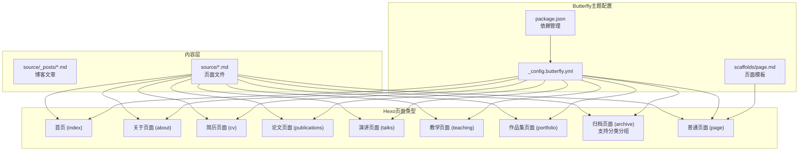
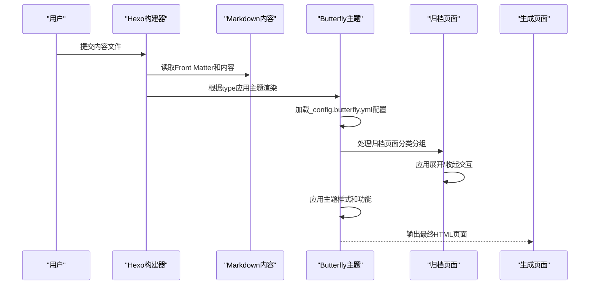
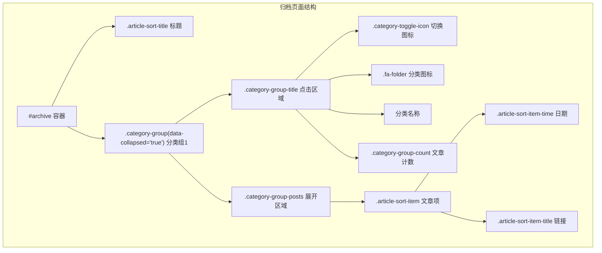
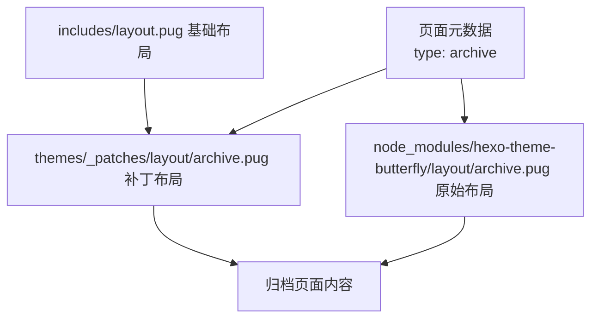
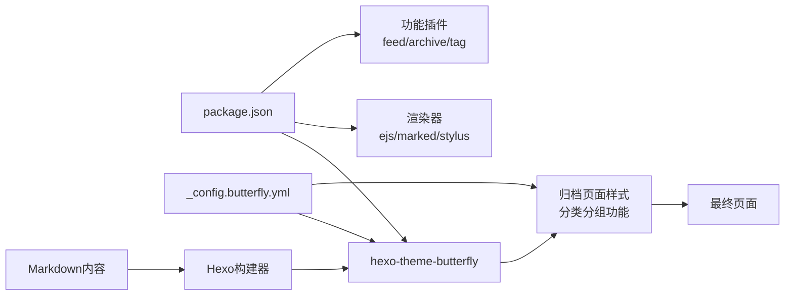

# 布局系统详解

<cite>
**本文引用的文件**
- [_config.yml](file://hexo-site/_config.yml)
- [_config.butterfly.yml](file://hexo-site/_config.butterfly.yml)
- [package.json](file://hexo-site/package.json)
- [开发文档.md](file://开发文档.md)
- [README.md](file://README.md)
- [source/index.md](file://hexo-site/source/index.md)
- [source/about/index.md](file://hexo-site/source/about/index.md)
- [source/cv/index.md](file://hexo-site/source/cv/index.md)
- [source/publications/index.md](file://hexo-site/source/publications/index.md)
- [source/talks/index.md](file://hexo-site/source/talks/index.md)
- [source/teaching/index.md](file://hexo-site/source/teaching/index.md)
- [source/portfolio/index.md](file://hexo-site/source/portfolio/index.md)
- [scaffolds/page.md](file://hexo-site/scaffolds/page.md)
- [themes/_patches/layout/archive.pug](file://hexo-site/themes/_patches/layout/archive.pug)
- [node_modules/hexo-theme-butterfly/layout/archive.pug](file://hexo-site/node_modules/hexo-theme-butterfly/layout/archive.pug)
- [themes/_patches/source/js/main.js](file://hexo-site/themes/_patches/source/js/main.js)
- [node_modules/hexo-theme-butterfly/layout/includes/layout.pug](file://hexo-site/node_modules/hexo-theme-butterfly/layout/includes/layout.pug)
</cite>

## 更新摘要
**所做更改**
- 新增归档页面功能增强章节，详细介绍按分类分组的交互式归档页面
- 更新归档页面布局分析，包含新增的分类展开/收起功能
- 添加JavaScript交互实现细节和CSS样式配置
- 更新布局继承关系图，反映归档页面的特殊处理
- 新增归档页面最佳实践和性能优化建议

## 目录
1. [引言](#引言)
2. [项目结构](#项目结构)
3. [核心组件](#核心组件)
4. [架构总览](#架构总览)
5. [详细组件分析](#详细组件分析)
6. [归档页面功能增强](#归档页面功能增强)
7. [依赖分析](#依赖分析)
8. [性能考虑](#性能考虑)
9. [故障排查指南](#故障排查指南)
10. [结论](#结论)
11. [附录](#附录)

## 引言
本文件面向Hexo布局系统的使用者与维护者，系统性阐述Butterfly主题的简化布局架构、页面渲染流程与主题配置；详细解析Hexo的页面类型系统、Front Matter配置与主题渲染机制；并给出最佳实践与性能优化建议。特别关注最新的归档页面功能增强，包括按分类分组的交互式归档页面，支持展开/收起功能和JavaScript交互。

## 项目结构
本项目的布局系统基于Hexo + Butterfly主题，采用简化的页面类型系统，通过Front Matter指定页面类型和布局；主题配置集中在_config.butterfly.yml；页面通过type字段区分不同类型。归档页面现支持按分类分组的交互式展示。



**图表来源**
- [_config.yml:119](file://hexo-site/_config.yml#L119)
- [_config.butterfly.yml:26-34](file://hexo-site/_config.butterfly.yml#L26-L34)
- [开发文档.md:194-244](file://开发文档.md#L194-L244)

**章节来源**
- [_config.yml:119](file://hexo-site/_config.yml#L119)
- [_config.butterfly.yml:26-34](file://hexo-site/_config.butterfly.yml#L26-L34)
- [开发文档.md:194-244](file://开发文档.md#L194-L244)

## 核心组件
- **Hexo页面类型系统**：通过type字段区分不同页面类型，包括首页(index)、关于页面(about)、简历(cv)、论文(publications)、演讲(talks)、教学(teaching)、作品集(portfolio)、归档页面(archive)和普通页面(page)。
- **Butterfly主题配置**：集中管理导航菜单、侧边栏、样式设置、功能开关等主题参数，包括新增的归档页面分类分组样式。
- **Front Matter配置**：在Markdown文件头部指定页面类型、标题、布局等元数据。
- **页面模板**：通过scaffolds/page.md提供统一的页面创建模板。
- **归档页面增强**：支持按分类分组的交互式展示，包含展开/收起功能。

**章节来源**
- [_config.yml:119](file://hexo-site/_config.yml#L119)
- [_config.butterfly.yml:26-34](file://hexo-site/_config.butterfly.yml#L26-L34)
- [开发文档.md:194-244](file://开发文档.md#L194-L244)

## 架构总览
Hexo + Butterfly主题采用简化的布局架构：内容文件通过Front Matter的type字段指定页面类型，Butterfly主题根据类型自动应用相应的渲染逻辑；主题配置文件集中管理所有外观和功能设置；构建过程通过Hexo CLI完成。归档页面现支持特殊的分类分组处理。



**图表来源**
- [_config.yml:119](file://hexo-site/_config.yml#L119)
- [_config.butterfly.yml:26-34](file://hexo-site/_config.butterfly.yml#L26-L34)
- [开发文档.md:194-244](file://开发文档.md#L194-L244)

## 详细组件分析

### 页面类型系统
- **首页 (index)**：网站主页面，使用自定义HTML + CSS样式
- **关于页面 (about)**：个人简介页面，包含教育背景、研究方向、联系方式
- **简历页面 (cv)**：学术简历页面，包含教育背景、工作经历、技能等
- **论文页面 (publications)**：学术论文列表页面，按年份分类
- **演讲页面 (talks)**：学术报告列表页面，包含报告标题、会议信息、日期
- **教学页面 (teaching)**：教学经历页面，包含课程名称、学期信息
- **作品集页面 (portfolio)**：项目作品展示页面，支持网格布局
- **归档页面 (archive)**：**新增** 支持按分类分组的交互式归档页面，包含展开/收起功能
- **普通页面 (page)**：通用页面类型，使用统一的页面模板

**章节来源**
- [开发文档.md:194-244](file://开发文档.md#L194-L244)
- [开发文档.md:246-335](file://开发文档.md#L246-L335)

### Butterfly主题配置
- **导航菜单配置**：通过_config.butterfly.yml的menu字段配置导航链接和图标
- **侧边栏设置**：控制作者信息卡片、最新文章、分类等侧边栏组件的显示
- **样式定制**：通过CSS注入和主题参数定制网站外观，包括新增的归档页面分类分组样式
- **功能开关**：控制暗色模式、TOC、数学公式、Mermaid等高级功能

**章节来源**
- [_config.butterfly.yml:26-34](file://hexo-site/_config.butterfly.yml#L26-L34)
- [_config.butterfly.yml:88-144](file://hexo-site/_config.butterfly.yml#L88-L144)
- [_config.butterfly.yml:372-447](file://hexo-site/_config.butterfly.yml#L372-L447)

### Front Matter配置规范
- **必需字段**：title(页面标题)、type(页面类型)、date(创建日期)
- **可选字段**：layout(布局类型，默认page)、updated(更新日期)、comments(评论开关)
- **页面类型映射**：type字段决定Butterfly主题的渲染逻辑和样式应用，归档页面(type: archive)获得特殊处理

**章节来源**
- [开发文档.md:194-244](file://开发文档.md#L194-L244)
- [开发文档.md:246-335](file://开发文档.md#L246-L335)

### 页面模板系统
- **统一模板**：scaffolds/page.md提供标准的页面Front Matter模板
- **自动填充**：创建新页面时自动填充标题、日期等基础信息
- **类型特定**：不同类型页面有不同的内容结构和样式要求，归档页面获得专门的分类分组处理

**章节来源**
- [scaffolds/page.md:1-5](file://hexo-site/scaffolds/page.md#L1-L5)

## 归档页面功能增强

### 分类分组布局结构
归档页面现支持按分类分组的交互式展示，每个分类组包含标题、文章计数和可展开的文章列表。



**图表来源**
- [themes/_patches/layout/archive.pug:4-20](file://hexo-site/themes/_patches/layout/archive.pug#L4-L20)
- [node_modules/hexo-theme-butterfly/layout/archive.pug:4-20](file://hexo-site/node_modules/hexo-theme-butterfly/layout/archive.pug#L4-L20)

### JavaScript交互实现
归档页面的展开/收起功能通过JavaScript实现，支持鼠标点击和键盘操作。

**更新** 新增归档页面交互式功能

```javascript
// 归档页分类展开/收起
document.querySelectorAll('.category-group-title').forEach(function(title) {
  title.addEventListener('click', function() {
    var group = this.parentElement;
    var isCollapsed = group.getAttribute('data-collapsed') === 'true';
    group.setAttribute('data-collapsed', isCollapsed ? 'false' : 'true');
    this.setAttribute('aria-expanded', isCollapsed ? 'true' : 'false');
  });
  // 支持键盘 Enter/Space 操作
  title.addEventListener('keydown', function(e) {
    if (e.key === 'Enter' || e.key === ' ') {
      e.preventDefault();
      this.click();
    }
  });
});
```

**章节来源**
- [_config.butterfly.yml:751-766](file://hexo-site/_config.butterfly.yml#L751-L766)

### CSS样式配置
归档页面的分类分组样式通过_config.butterfly.yml中的CSS注入实现，包含动画效果和响应式设计。

**更新** 新增归档页面分类分组样式

```css
/* 归档页分类分组样式 */
.category-group {
  margin-bottom: 16px !important;
  background: var(--card-bg) !important;
  border-radius: 12px !important;
  box-shadow: 0 2px 8px rgba(0,0,0,0.06) !important;
  overflow: hidden !important;
  transition: box-shadow 0.3s ease !important;
}
.category-group:hover {
  box-shadow: 0 4px 16px rgba(102,126,234,0.12) !important;
}
.category-group-title {
  font-size: 1.1em !important;
  font-weight: 600 !important;
  padding: 14px 20px !important;
  margin-bottom: 0 !important;
  border-left: none !important;
  background: transparent !important;
  border-radius: 12px !important;
  color: var(--font-color) !important;
  cursor: pointer !important;
  user-select: none !important;
  transition: all 0.25s ease !important;
  display: flex !important;
  align-items: center !important;
  gap: 4px !important;
}
.category-toggle-icon {
  font-size: 0.8em !important;
  margin-right: 6px !important;
  color: var(--text-highlight-color, #667eea) !important;
  transition: transform 0.3s ease !important;
}
.category-group[data-collapsed='false'] .category-toggle-icon {
  transform: rotate(90deg) !important;
}
```

**章节来源**
- [_config.butterfly.yml:506-589](file://hexo-site/_config.butterfly.yml#L506-L589)

### 布局继承关系
归档页面通过主题补丁实现，继承基础布局并添加特殊处理逻辑。

**更新** 新增归档页面布局继承关系



**图表来源**
- [node_modules/hexo-theme-butterfly/layout/includes/layout.pug:1-59](file://hexo-site/node_modules/hexo-theme-butterfly/layout/includes/layout.pug#L1-L59)
- [themes/_patches/layout/archive.pug:1-21](file://hexo-site/themes/_patches/layout/archive.pug#L1-L21)

**章节来源**
- [themes/_patches/layout/archive.pug:1-21](file://hexo-site/themes/_patches/layout/archive.pug#L1-L21)
- [node_modules/hexo-theme-butterfly/layout/archive.pug:1-21](file://hexo-site/node_modules/hexo-theme-butterfly/layout/archive.pug#L1-L21)

## 依赖分析
- **主题依赖**：package.json明确声明hexo-theme-butterfly作为主题依赖
- **渲染引擎**：Hexo使用ejs、marked、stylus等渲染器处理内容
- **功能插件**：集成多种Hexo插件支持RSS、Sitemap、数学公式等功能
- **配置驱动**：Butterfly主题配置集中管理所有外观和功能设置，包括新增的归档页面样式
- **归档页面依赖**：归档页面功能依赖于分类数据结构和JavaScript交互脚本



**图表来源**
- [package.json:14-33](file://hexo-site/package.json#L14-L33)
- [_config.yml:119](file://hexo-site/_config.yml#L119)

**章节来源**
- [package.json:14-33](file://hexo-site/package.json#L14-L33)
- [_config.yml:119](file://hexo-site/_config.yml#L119)

## 性能考虑
- **主题优化**：Butterfly主题内置多种性能优化选项，如懒加载、暗色模式等
- **归档页面优化**：分类分组功能使用CSS过渡动画而非复杂JavaScript计算，减少重绘开销
- **资源管理**：通过主题配置控制图片、代码块等资源的加载策略
- **功能选择**：根据需要启用或禁用高级功能，避免不必要的性能开销
- **CDN支持**：可配置CDN加速静态资源加载

**更新** 新增归档页面性能优化建议

## 故障排查指南
- **页面类型不生效**
  - 检查Front Matter中的type字段是否正确
  - 确认对应页面文件路径和命名符合要求
- **主题样式异常**
  - 检查_config.butterfly.yml配置语法和值
  - 确认主题版本兼容性和依赖安装
- **归档页面交互失效**
  - 检查JavaScript代码是否正确加载
  - 验证CSS样式是否正确应用
  - 确认分类数据结构是否正常
- **构建失败**
  - 运行hexo clean清理缓存后重新构建
  - 检查Node.js版本和依赖包完整性
- **导航菜单问题**
  - 验证_config.butterfly.yml中menu配置的格式
  - 检查链接路径和图标类名的正确性

**章节来源**
- [开发文档.md:194-244](file://开发文档.md#L194-L244)
- [_config.butterfly.yml:26-34](file://hexo-site/_config.butterfly.yml#L26-L34)

## 结论
本布局系统采用Hexo + Butterfly主题的简化架构，通过页面类型系统和主题配置实现了高度一致的页面渲染体验。最新的归档页面功能增强进一步提升了用户体验，支持按分类分组的交互式展示。相比复杂的Jekyll布局系统，这种设计更加直观易用，同时保持了足够的灵活性来满足学术和个人网站的需求。遵循本文的最佳实践，可有效提升开发效率和网站性能。

## 附录

### 页面类型选择最佳实践
- **首页**：使用自定义HTML + CSS，重点突出个人品牌和核心信息
- **关于页面**：提供完整的个人信息，便于访客了解个人背景
- **简历页面**：结构化展示学术和职业经历，便于招聘和合作
- **论文页面**：按年份组织学术成果，支持PDF链接和引用格式
- **演讲页面**：详细记录学术报告信息，包含幻灯片链接
- **教学页面**：展示教学经历和课程信息
- **作品集页面**：使用网格布局展示项目作品
- **归档页面**：**新增** 使用分类分组展示文章，支持展开/收起交互
- **普通页面**：使用统一模板创建其他类型的页面

### 自定义页面开发指南
- **创建新页面**：使用scaffolds/page.md模板，设置合适的type字段
- **主题定制**：通过_config.butterfly.yml调整导航、侧边栏、样式等
- **内容组织**：按照页面类型的要求组织内容结构和格式
- **样式扩展**：在主题配置中添加自定义CSS样式
- **归档页面定制**：通过修改归档页面布局和样式实现个性化展示

### 归档页面最佳实践
- **分类组织**：合理设置文章分类，确保归档页面的逻辑清晰
- **交互设计**：利用展开/收起功能改善大量文章的浏览体验
- **性能优化**：避免过多的分类层级，保持页面加载速度
- **移动端适配**：确保归档页面在移动设备上的良好显示效果

### 示例参考
- **首页示例**：source/index.md使用HTML + CSS自定义样式
- **关于页面示例**：source/about/index.md展示个人信息结构
- **简历页面示例**：source/cv/index.md包含教育背景和工作经历
- **论文页面示例**：source/publications/index.md按年份组织论文
- **演讲页面示例**：source/talks/index.md展示报告信息
- **教学页面示例**：source/teaching/index.md记录教学经历
- **作品集页面示例**：source/portfolio/index.md使用网格布局
- **归档页面示例**：**新增** themes/_patches/layout/archive.pug展示分类分组功能

**章节来源**
- [开发文档.md:194-244](file://开发文档.md#L194-L244)
- [development.md:246-335](file://development.md#L246-L335)
- [development.md:337-387](file://development.md#L337-L387)
- [themes/_patches/layout/archive.pug:1-21](file://hexo-site/themes/_patches/layout/archive.pug#L1-L21)