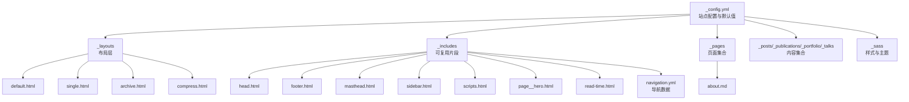
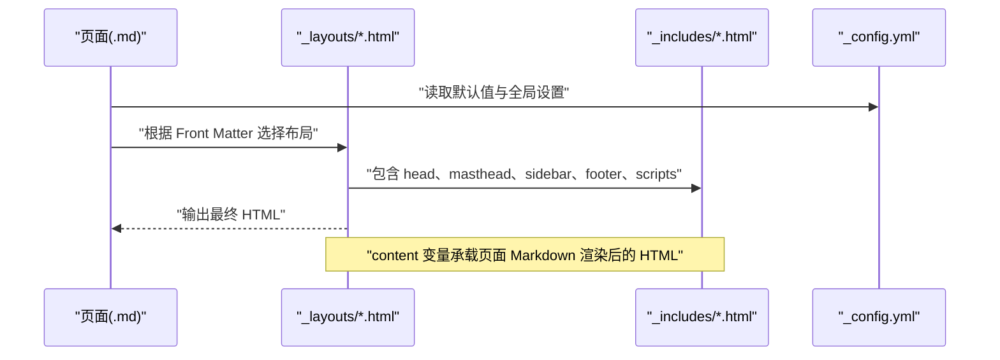
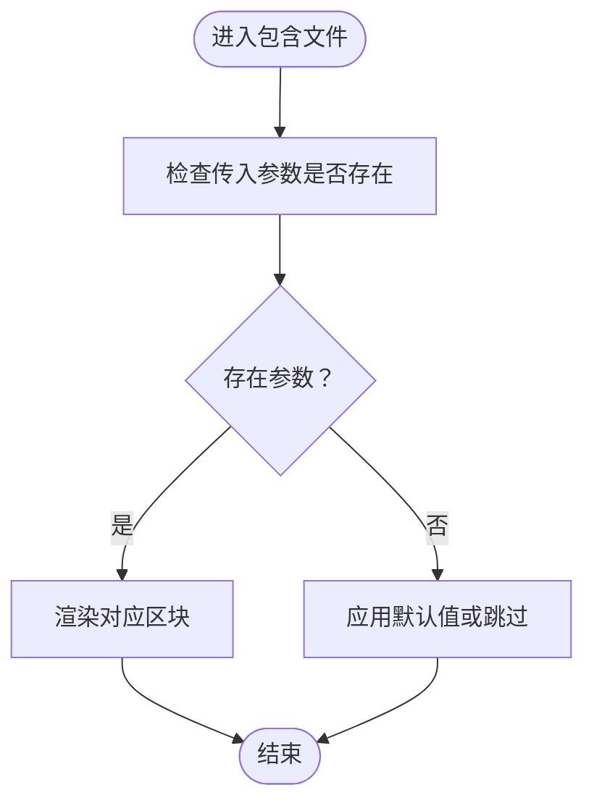
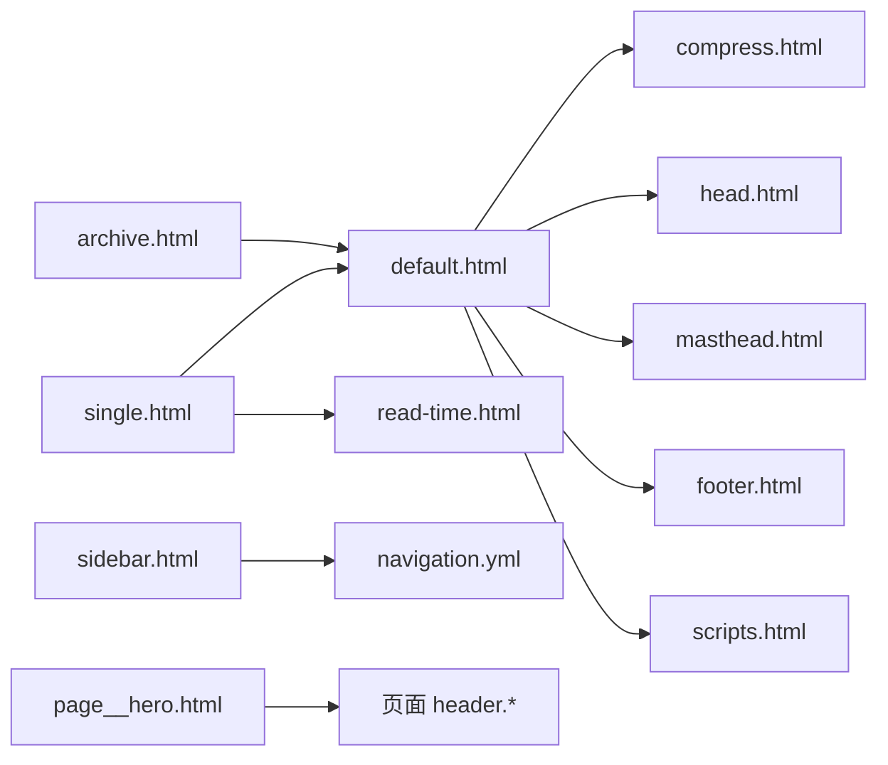

# 自定义开发指南

<cite>
**本文引用的文件**
- [_config.yml](file://_config.yml)
- [default.html](file://_layouts/default.html)
- [single.html](file://_layouts/single.html)
- [archive.html](file://_layouts/archive.html)
- [compress.html](file://_layouts/compress.html)
- [head.html](file://_includes/head.html)
- [footer.html](file://_includes/footer.html)
- [masthead.html](file://_includes/masthead.html)
- [sidebar.html](file://_includes/sidebar.html)
- [scripts.html](file://_includes/scripts.html)
- [page__hero.html](file://_includes/page__hero.html)
- [read-time.html](file://_includes/read-time.html)
- [navigation.yml](file://_data/navigation.yml)
- [about.md](file://_pages/about.md)
- [_base.scss](file://_sass/layout/_base.scss)
</cite>

## 目录
1. [简介](#简介)
2. [项目结构](#项目结构)
3. [核心组件](#核心组件)
4. [架构总览](#架构总览)
5. [详细组件分析](#详细组件分析)
6. [依赖关系分析](#依赖关系分析)
7. [性能考量](#性能考量)
8. [故障排查指南](#故障排查指南)
9. [结论](#结论)
10. [附录](#附录)

## 简介
本指南面向需要对 Jekyll 页面布局与模板系统进行自定义开发的工程师与内容作者。文档围绕以下目标展开：
- 如何创建自定义布局文件，理解布局继承语法与 Liquid 模板语法的使用
- 如何开发自定义包含组件（Includes），包括参数传递、条件逻辑与样式集成
- 页面元数据（Front Matter）的定制方法，包括布局选择、变量定义与页面特定配置
- 模板变量的可用性与作用域规则，重点覆盖 site、page、layout、content 等内置变量
- 调试布局问题的方法与工具，包括 Jekyll 开发模式、错误信息解读与性能分析
- 实际开发示例与常见问题的解决方案
- 响应式设计在布局中的应用与移动端适配策略

## 项目结构
该项目采用典型的 Jekyll 结构，布局位于 _layouts，可复用片段位于 _includes，页面与集合位于 _pages、_posts、_publications、_portfolio、_talks 等目录，站点配置位于根目录的 _config.yml，主题与样式位于 _sass。

图示来源
- [_config.yml](file://_config.yml)
- [default.html](file://_layouts/default.html)
- [single.html](file://_layouts/single.html)
- [archive.html](file://_layouts/archive.html)
- [compress.html](file://_layouts/compress.html)
- [head.html](file://_includes/head.html)
- [footer.html](file://_includes/footer.html)
- [masthead.html](file://_includes/masthead.html)
- [sidebar.html](file://_includes/sidebar.html)
- [scripts.html](file://_includes/scripts.html)
- [page__hero.html](file://_includes/page__hero.html)
- [read-time.html](file://_includes/read-time.html)
- [navigation.yml](file://_data/navigation.yml)
- [about.md](file://_pages/about.md)

章节来源
- [_config.yml](file://_config.yml)
- [default.html](file://_layouts/default.html)
- [single.html](file://_layouts/single.html)
- [archive.html](file://_layouts/archive.html)
- [compress.html](file://_layouts/compress.html)
- [head.html](file://_includes/head.html)
- [footer.html](file://_includes/footer.html)
- [masthead.html](file://_includes/masthead.html)
- [sidebar.html](file://_includes/sidebar.html)
- [scripts.html](file://_includes/scripts.html)
- [page__hero.html](file://_includes/page__hero.html)
- [read-time.html](file://_includes/read-time.html)
- [navigation.yml](file://_data/navigation.yml)
- [about.md](file://_pages/about.md)

## 核心组件
- 布局层（_layouts）
  - default.html：基础 HTML 结构与全局包含，作为大多数布局的父级
  - single.html：单页内容布局，负责标题、摘要、正文、元信息、社交分享、评论与相关文章
  - archive.html：归档页布局，适用于分类、标签、年份等列表页
  - compress.html：HTML 压缩布局，通过插件配置减少空白字符与注释
- 包含层（_includes）
  - head.html：头部资源与 SEO 片段
  - footer.html：页脚社交与版权信息
  - masthead.html：主导航栏与主题切换
  - sidebar.html：侧边栏作者资料与自定义区块
  - scripts.html：脚本加载与统计
  - page__hero.html：页面英雄区（封面图、叠加层、CTA）
  - read-time.html：阅读时长计算
- 数据层（_data）
  - navigation.yml：主导航菜单结构
- 页面与集合（_pages、_posts、_publications、_portfolio、_talks）
  - 使用 Front Matter 定义页面布局与元数据
- 样式层（_sass）
  - 基础样式与响应式断点，支撑移动端适配

章节来源
- [default.html](file://_layouts/default.html)
- [single.html](file://_layouts/single.html)
- [archive.html](file://_layouts/archive.html)
- [compress.html](file://_layouts/compress.html)
- [head.html](file://_includes/head.html)
- [footer.html](file://_includes/footer.html)
- [masthead.html](file://_includes/masthead.html)
- [sidebar.html](file://_includes/sidebar.html)
- [scripts.html](file://_includes/scripts.html)
- [page__hero.html](file://_includes/page__hero.html)
- [read-time.html](file://_includes/read-time.html)
- [navigation.yml](file://_data/navigation.yml)
- [_base.scss](file://_sass/layout/_base.scss)

## 架构总览
下图展示了从页面到布局再到包含片段的整体渲染流程，以及关键变量的作用域与传递路径。

图示来源
- [_config.yml](file://_config.yml)
- [default.html](file://_layouts/default.html)
- [single.html](file://_layouts/single.html)
- [head.html](file://_includes/head.html)
- [footer.html](file://_includes/footer.html)
- [masthead.html](file://_includes/masthead.html)
- [sidebar.html](file://_includes/sidebar.html)
- [scripts.html](file://_includes/scripts.html)

## 详细组件分析

### 布局继承与模板语法
- 布局继承
  - default.html 通过 Front Matter 声明使用 compress 布局，形成压缩层；single.html 与 archive.html 继承 default.html，统一头部、导航、页脚与脚本加载
  - 推荐做法：将通用结构放入 default.html，页面特有结构放入子布局
- Liquid 语法要点
  - 变量访问：使用双花括号访问 site、page、layout、content 等变量
  - 控制结构：使用条件判断与循环控制页面渲染分支
  - 过滤器：对字符串、日期、数字进行格式化与计算
- 示例参考
  - 布局声明与继承：[default.html](file://_layouts/default.html)，[single.html](file://_layouts/single.html)，[archive.html](file://_layouts/archive.html)，[compress.html](file://_layouts/compress.html)
  - 变量与过滤器使用：[single.html](file://_layouts/single.html)，[page__hero.html](file://_includes/page__hero.html)，[read-time.html](file://_includes/read-time.html)

章节来源
- [default.html](file://_layouts/default.html)
- [single.html](file://_layouts/single.html)
- [archive.html](file://_layouts/archive.html)
- [compress.html](file://_layouts/compress.html)
- [page__hero.html](file://_includes/page__hero.html)
- [read-time.html](file://_includes/read-time.html)

### 自定义包含组件开发
- 组件结构设计
  - 将可复用 UI 片段拆分为独立文件，例如导航、页脚、侧边栏、阅读时长等
  - 在包含文件中集中处理参数校验与默认值
- 参数传递机制
  - 通过 page 或 layout 的字段向包含文件传参，如 sidebar 的数组项、导航链接的 children
- 条件逻辑处理
  - 使用 Liquid 条件判断决定是否渲染某部分内容，如面包屑、作者资料、社交分享
- 样式集成
  - 通过 SCSS 主题变量与断点实现响应式与主题切换
- 示例参考
  - 导航与主题切换：[masthead.html](file://_includes/masthead.html)，[navigation.yml](file://_data/navigation.yml)
  - 侧边栏与作者资料：[sidebar.html](file://_includes/sidebar.html)
  - 英雄区与 CTA：[page__hero.html](file://_includes/page__hero.html)
  - 阅读时长：[read-time.html](file://_includes/read-time.html)
  - 头部与脚本：[head.html](file://_includes/head.html)，[footer.html](file://_includes/footer.html)，[scripts.html](file://_includes/scripts.html)

图示来源
- [masthead.html](file://_includes/masthead.html)
- [sidebar.html](file://_includes/sidebar.html)
- [page__hero.html](file://_includes/page__hero.html)
- [read-time.html](file://_includes/read-time.html)

章节来源
- [masthead.html](file://_includes/masthead.html)
- [sidebar.html](file://_includes/sidebar.html)
- [page__hero.html](file://_includes/page__hero.html)
- [read-time.html](file://_includes/read-time.html)
- [head.html](file://_includes/head.html)
- [footer.html](file://_includes/footer.html)
- [scripts.html](file://_includes/scripts.html)
- [navigation.yml](file://_data/navigation.yml)

### 页面元数据（Front Matter）定制
- 常用字段
  - permalink：自定义页面 URL
  - title：页面标题
  - author_profile：是否显示作者资料
  - redirect_from：重定向地址
  - layout：选择布局（如 single、archive）
  - header.*：页面英雄区配置（overlay_color、overlay_image、image、cta_url、caption 等）
  - read_time、share、comments、related：功能开关
- 默认值与范围
  - 全局默认值由 _config.yml 的 defaults 字段定义，按集合类型批量生效
- 示例参考
  - 页面示例：[about.md](file://_pages/about.md)
  - 默认值与集合配置：[_config.yml](file://_config.yml)

章节来源
- [about.md](file://_pages/about.md)
- [_config.yml](file://_config.yml)

### 模板变量可用性与作用域规则
- site：站点级变量，来自 _config.yml 与插件
- page：当前页面级变量，来自 Front Matter 与内容解析
- layout：当前布局级变量，来自所选布局的 Front Matter
- content：当前页面 Markdown 渲染后的 HTML 内容
- 作用域链路
  - 页面 Front Matter → 布局 Front Matter → _config.yml defaults → 插件注入
- 示例参考
  - 变量使用位置：[default.html](file://_layouts/default.html)，[single.html](file://_layouts/single.html)，[head.html](file://_includes/head.html)，[footer.html](file://_includes/footer.html)，[masthead.html](file://_includes/masthead.html)，[sidebar.html](file://_includes/sidebar.html)，[page__hero.html](file://_includes/page__hero.html)，[read-time.html](file://_includes/read-time.html)

章节来源
- [default.html](file://_layouts/default.html)
- [single.html](file://_layouts/single.html)
- [head.html](file://_includes/head.html)
- [footer.html](file://_includes/footer.html)
- [masthead.html](file://_includes/masthead.html)
- [sidebar.html](file://_includes/sidebar.html)
- [page__hero.html](file://_includes/page__hero.html)
- [read-time.html](file://_includes/read-time.html)

### 响应式设计与移动端适配
- 视口与基础样式
  - 头部包含 viewport 设置，确保移动端正确缩放
  - 基础样式与动画过渡统一管理，避免滚动与交互异常
- 断点与网格
  - 图片与媒体在小屏设备上自适应宽度，多列布局在小屏折叠
- 主题切换
  - 通过类名与数据属性切换主题，配合 CSS 变量实现颜色体系切换
- 示例参考
  - 视口与样式引入：[head.html](file://_includes/head.html)
  - 基础样式与断点：[_base.scss](file://_sass/layout/_base.scss)
  - 主题切换入口：[masthead.html](file://_includes/masthead.html)

章节来源
- [head.html](file://_includes/head.html)
- [_base.scss](file://_sass/layout/_base.scss)
- [masthead.html](file://_includes/masthead.html)

## 依赖关系分析
- 布局依赖
  - single.html 与 archive.html 依赖 default.html 提供的基础结构
  - default.html 依赖 compress.html 进行 HTML 压缩
- 包含依赖
  - 各布局通过 include 指令引入 head、masthead、sidebar、footer、scripts 等
  - 侧边栏可按需包含作者资料与导航列表
  - 英雄区根据页面 header 配置动态渲染
- 数据依赖
  - 导航菜单来源于 _data/navigation.yml
- 配置依赖
  - defaults 字段为集合类型提供默认布局与功能开关
  - compress_html 插件配置影响 HTML 压缩行为

图示来源
- [single.html](file://_layouts/single.html)
- [archive.html](file://_layouts/archive.html)
- [default.html](file://_layouts/default.html)
- [compress.html](file://_layouts/compress.html)
- [head.html](file://_includes/head.html)
- [masthead.html](file://_includes/masthead.html)
- [footer.html](file://_includes/footer.html)
- [scripts.html](file://_includes/scripts.html)
- [sidebar.html](file://_includes/sidebar.html)
- [page__hero.html](file://_includes/page__hero.html)
- [read-time.html](file://_includes/read-time.html)
- [navigation.yml](file://_data/navigation.yml)

章节来源
- [single.html](file://_layouts/single.html)
- [archive.html](file://_layouts/archive.html)
- [default.html](file://_layouts/default.html)
- [compress.html](file://_layouts/compress.html)
- [head.html](file://_includes/head.html)
- [masthead.html](file://_includes/masthead.html)
- [footer.html](file://_includes/footer.html)
- [scripts.html](file://_includes/scripts.html)
- [sidebar.html](file://_includes/sidebar.html)
- [page__hero.html](file://_includes/page__hero.html)
- [read-time.html](file://_includes/read-time.html)
- [navigation.yml](file://_data/navigation.yml)

## 性能考量
- HTML 压缩
  - 通过 compress.html 与 compress_html 插件配置减少空白与注释，降低传输体积
- 资源加载
  - 头部引入 CSS，脚部引入 JS，避免阻塞渲染
  - 使用模块化脚本与延迟加载策略
- 渲染优化
  - 合理使用条件判断，避免不必要的包含与循环
  - 对复杂过滤器（如字数统计）仅在必要时执行

章节来源
- [compress.html](file://_layouts/compress.html)
- [_config.yml](file://_config.yml)
- [head.html](file://_includes/head.html)
- [scripts.html](file://_includes/scripts.html)
- [read-time.html](file://_includes/read-time.html)

## 故障排查指南
- 开发模式与增量构建
  - 使用本地开发服务器进行实时预览，修改配置后需重启以重新加载
- 错误定位
  - 检查 Front Matter 语法与字段拼写
  - 确认布局文件路径与命名一致
  - 核对包含文件的相对路径与 base_path 变量
- 常见问题
  - 导航不显示：检查 _data/navigation.yml 的结构与权限
  - 英雄图不显示：确认 page.header.image 或 overlay_* 字段路径与 base_path 拼接
  - 阅读时长未显示：确认 page.read_time 与 site.words_per_minute 配置
- 调试建议
  - 分步注释包含文件，缩小问题范围
  - 使用浏览器开发者工具查看网络与渲染性能
  - 关注压缩后 HTML 的可读性与结构

章节来源
- [_config.yml](file://_config.yml)
- [masthead.html](file://_includes/masthead.html)
- [page__hero.html](file://_includes/page__hero.html)
- [read-time.html](file://_includes/read-time.html)

## 结论
通过合理组织布局与包含文件、规范使用 Front Matter 与 Liquid 语法、结合 _config.yml 的默认值与插件配置，可以高效地构建可维护、可扩展且具备良好移动端体验的 Jekyll 站点。建议在新增功能时遵循“布局继承 + 包含复用”的原则，并持续关注性能与可访问性。

## 附录
- 实战清单
  - 新建布局：在 _layouts 下创建新文件，使用 Front Matter 声明继承关系
  - 新建包含：在 _includes 下创建片段，集中处理参数与条件逻辑
  - 页面定制：在页面 Front Matter 中指定 layout 与 header.* 等字段
  - 数据驱动：通过 _data/*.yml 提供导航与文案等静态数据
  - 样式适配：利用 SCSS 断点与主题变量实现响应式与主题切换