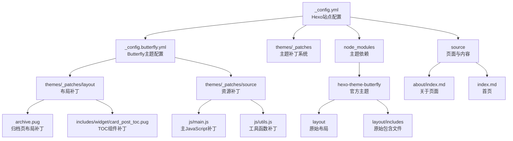
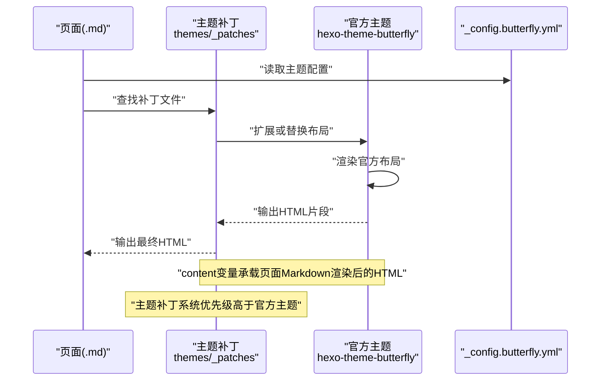
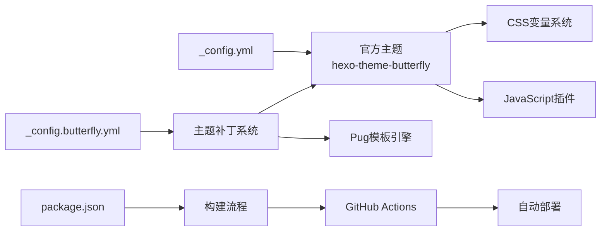

# 自定义开发指南

<cite>
**本文引用的文件**
- [_config.yml](file://hexo-site/_config.yml)
- [_config.butterfly.yml](file://hexo-site/_config.butterfly.yml)
- [package.json](file://hexo-site/package.json)
- [archive.pug](file://hexo-site/themes/_patches/layout/archive.pug)
- [card_post_toc.pug](file://hexo-site/themes/_patches/layout/includes/widget/card_post_toc.pug)
- [layout.pug](file://hexo-site/node_modules/hexo-theme-butterfly/layout/includes/layout.pug)
- [head.pug](file://hexo-site/node_modules/hexo-theme-butterfly/layout/includes/head.pug)
- [footer.pug](file://hexo-site/node_modules/hexo-theme-butterfly/layout/includes/footer.pug)
- [nav.pug](file://hexo-site/node_modules/hexo-theme-butterfly/layout/includes/header/nav.pug)
- [social.pug](file://hexo-site/node_modules/hexo-theme-butterfly/layout/includes/header/social.pug)
- [index.pug](file://hexo-site/node_modules/hexo-theme-butterfly/layout/includes/header/index.pug)
- [additional-js.pug](file://hexo-site/node_modules/hexo-theme-butterfly/layout/includes/additional-js.pug)
- [archive.pug](file://hexo-site/node_modules/hexo-theme-butterfly/layout/archive.pug)
- [category.pug](file://hexo-site/node_modules/hexo-theme-butterfly/layout/category.pug)
- [config_site.pug](file://hexo-site/node_modules/hexo-theme-butterfly/layout/includes/head/config_site.pug)
- [config.pug](file://hexo-site/node_modules/hexo-theme-butterfly/layout/includes/head/config.pug)
- [Open_Graph.pug](file://hexo-site/node_modules/hexo-theme-butterfly/layout/includes/head/Open_Graph.pug)
- [site_verification.pug](file://hexo-site/node_modules/hexo-theme-butterfly/layout/includes/head/site_verification.pug)
- [pwa.pug](file://hexo-site/node_modules/hexo-theme-butterfly/layout/includes/head/pwa.pug)
- [structured_data.pug](file://hexo-site/node_modules/hexo-theme-butterfly/layout/includes/head/structured_data.pug)
- [analytics.pug](file://hexo-site/node_modules/hexo-theme-butterfly/layout/includes/head/analytics.pug)
- [preconnect.pug](file://hexo-site/node_modules/hexo-theme-butterfly/layout/includes/head/preconnect.pug)
- [menu_item.pug](file://hexo-site/node_modules/hexo-theme-butterfly/layout/includes/header/menu_item.pug)
- [post-info.pug](file://hexo-site/node_modules/hexo-theme-butterfly/layout/includes/header/post-info.pug)
- [index_img.pug](file://hexo-site/node_modules/hexo-theme-butterfly/layout/includes/header/index_img.pug)
- [default.pug](file://hexo-site/node_modules/hexo-theme-butterfly/layout/default.pug)
- [post.pug](file://hexo-site/node_modules/hexo-theme-butterfly/layout/post.pug)
- [page.pug](file://hexo-site/node_modules/hexo-theme-butterfly/layout/page.pug)
- [index.pug](file://hexo-site/node_modules/hexo-theme-butterfly/layout/index.pug)
- [about.md](file://hexo-site/source/about/index.md)
- [index.md](file://hexo-site/source/index.md)
</cite>

## 更新摘要
**变更内容**
- 新增主题补丁系统章节，详细介绍主题补丁的工作原理和使用方法
- 新增CI/CD工作流程章节，说明GitHub Actions自动化部署流程
- 新增CSS变量系统章节，展示CSS自定义属性在主题中的应用
- 更新项目结构，增加主题补丁目录结构说明
- 更新架构总览，加入主题补丁和CSS变量系统
- 更新故障排查指南，增加主题补丁相关问题的解决方法

## 目录
1. [简介](#简介)
2. [项目结构](#项目结构)
3. [核心组件](#核心组件)
4. [架构总览](#架构总览)
5. [详细组件分析](#详细组件分析)
6. [主题补丁系统](#主题补丁系统)
7. [CI/CD工作流程](#cicd工作流程)
8. [CSS变量系统](#css变量系统)
9. [依赖关系分析](#依赖关系分析)
10. [性能考量](#性能考量)
11. [故障排查指南](#故障排查指南)
12. [结论](#结论)
13. [附录](#附录)

## 简介
本指南面向需要对Hexo页面布局与模板系统进行自定义开发的工程师与内容作者。文档围绕以下目标展开：
- 如何创建自定义布局文件，理解布局继承语法与Pug/Jade模板语法的使用
- 如何开发自定义包含组件，包括参数传递、条件逻辑与样式集成
- 页面元数据（Front Matter）的定制方法，包括布局选择、变量定义与页面特定配置
- 模板变量的可用性与作用域规则，重点覆盖site、page、layout、content等内置变量
- 主题补丁系统的使用与开发，包括主题覆盖机制和自定义扩展
- CI/CD自动化部署流程，包括GitHub Actions工作流程和部署配置
- CSS变量系统的设计与应用，展示现代CSS自定义属性在主题中的使用
- 调试布局问题的方法与工具，包括Hexo开发模式、错误信息解读与性能分析
- 实际开发示例与常见问题的解决方案
- 响应式设计在布局中的应用与移动端适配策略

## 项目结构
该项目采用典型的Hexo结构，使用主题补丁系统进行主题定制，布局位于themes/_patches，可复用片段位于themes/_patches/layout/includes，页面与集合位于source目录，站点配置位于根目录的_config.yml，主题配置位于_config.butterfly.yml，主题补丁位于themes/_patches目录。



**图表来源**
- [_config.yml](file://hexo-site/_config.yml)
- [_config.butterfly.yml](file://hexo-site/_config.butterfly.yml)
- [archive.pug](file://hexo-site/themes/_patches/layout/archive.pug)
- [card_post_toc.pug](file://hexo-site/themes/_patches/layout/includes/widget/card_post_toc.pug)
- [main.js](file://hexo-site/themes/_patches/source/js/main.js)
- [utils.js](file://hexo-site/themes/_patches/source/js/utils.js)

**章节来源**
- [_config.yml](file://hexo-site/_config.yml)
- [_config.butterfly.yml](file://hexo-site/_config.butterfly.yml)
- [archive.pug](file://hexo-site/themes/_patches/layout/archive.pug)
- [card_post_toc.pug](file://hexo-site/themes/_patches/layout/includes/widget/card_post_toc.pug)

## 核心组件
- **主题补丁系统（themes/_patches）**
  - 布局补丁：通过Pug模板扩展官方主题布局，如archive.pug用于自定义归档页显示
  - 组件补丁：替换或增强官方组件，如card_post_toc.pug用于改进目录生成
  - 资源补丁：替换JavaScript和CSS资源，实现主题定制化
- **主题配置（_config.butterfly.yml）**
  - 导航栏配置：Logo、菜单项、社交媒体链接
  - 侧边栏配置：作者信息、最新文章、分类等卡片设置
  - 功能开关：暗色模式、数学公式、Mermaid支持、搜索功能等
  - 样式定制：CSS变量注入、自定义样式块
- **核心布局（node_modules/hexo-theme-butterfly/layout）**
  - 基础布局：layout.pug提供整体框架结构
  - 页面布局：default.pug、post.pug、page.pug等针对不同页面类型
  - 包含文件：head.pug、footer.pug、nav.pug等可复用组件
- **页面与内容（source）**
  - 使用Front Matter定义页面布局与元数据
  - 支持Markdown格式的内容编写
- **包管理（package.json）**
  - 定义Hexo版本和依赖包
  - 包含构建、部署、服务器启动等脚本命令

**章节来源**
- [_config.butterfly.yml](file://hexo-site/_config.butterfly.yml)
- [archive.pug](file://hexo-site/themes/_patches/layout/archive.pug)
- [card_post_toc.pug](file://hexo-site/themes/_patches/layout/includes/widget/card_post_toc.pug)
- [package.json](file://hexo-site/package.json)

## 架构总览
下图展示了从页面到主题补丁再到官方主题的整体渲染流程，以及关键变量的作用域与传递路径，特别强调了主题补丁系统的介入点。



**图表来源**
- [_config.butterfly.yml](file://hexo-site/_config.butterfly.yml)
- [archive.pug](file://hexo-site/themes/_patches/layout/archive.pug)
- [card_post_toc.pug](file://hexo-site/themes/_patches/layout/includes/widget/card_post_toc.pug)
- [layout.pug](file://hexo-site/node_modules/hexo-theme-butterfly/layout/includes/layout.pug)

**章节来源**
- [_config.butterfly.yml](file://hexo-site/_config.butterfly.yml)
- [archive.pug](file://hexo-site/themes/_patches/layout/archive.pug)
- [card_post_toc.pug](file://hexo-site/themes/_patches/layout/includes/widget/card_post_toc.pug)

## 详细组件分析

### 布局继承与模板语法
- **布局继承机制**
  - 主题补丁通过extends语法扩展官方布局，如archive.pug继承includes/layout.pug
  - 支持在补丁中重写特定block内容，实现局部定制
  - 保持与官方主题的兼容性，避免破坏整体架构
- **Pug模板语法要点**
  - 变量访问：使用-声明变量，=输出内容，!=输出HTML
  - 控制结构：使用if/else、each等语句处理条件逻辑
  - 过滤器：对字符串、日期、数字进行格式化与计算
- **示例参考**
  - 布局补丁示例：[archive.pug](file://hexo-site/themes/_patches/layout/archive.pug)
  - 组件补丁示例：[card_post_toc.pug](file://hexo-site/themes/_patches/layout/includes/widget/card_post_toc.pug)
  - 官方布局参考：[layout.pug](file://hexo-site/node_modules/hexo-theme-butterfly/layout/includes/layout.pug)

**章节来源**
- [archive.pug](file://hexo-site/themes/_patches/layout/archive.pug)
- [card_post_toc.pug](file://hexo-site/themes/_patches/layout/includes/widget/card_post_toc.pug)
- [layout.pug](file://hexo-site/node_modules/hexo-theme-butterfly/layout/includes/layout.pug)

### 自定义包含组件开发
- **组件结构设计**
  - 将可复用UI片段拆分为独立文件，如导航、页脚、侧边栏、目录等
  - 在包含文件中集中处理参数校验与默认值
  - 支持条件渲染和动态内容生成
- **参数传递机制**
  - 通过page或theme配置向包含文件传参
  - 支持布尔值、数值、字符串等多种参数类型
  - 实现灵活的功能开关和样式定制
- **条件逻辑处理**
  - 使用Pug的if/else语句决定是否渲染某部分内容
  - 支持基于页面状态的动态内容显示
- **样式集成**
  - 通过CSS变量实现主题定制
  - 支持响应式设计和移动端适配
- **示例参考**
  - 导航组件：[nav.pug](file://hexo-site/node_modules/hexo-theme-butterfly/layout/includes/header/nav.pug)
  - 社交组件：[social.pug](file://hexo-site/node_modules/hexo-theme-butterfly/layout/includes/header/social.pug)
  - 头部组件：[index.pug](file://hexo-site/node_modules/hexo-theme-butterfly/layout/includes/header/index.pug)
  - 脚本组件：[additional-js.pug](file://hexo-site/node_modules/hexo-theme-butterfly/layout/includes/additional-js.pug)

**章节来源**
- [nav.pug](file://hexo-site/node_modules/hexo-theme-butterfly/layout/includes/header/nav.pug)
- [social.pug](file://hexo-site/node_modules/hexo-theme-butterfly/layout/includes/header/social.pug)
- [index.pug](file://hexo-site/node_modules/hexo-theme-butterfly/layout/includes/header/index.pug)
- [additional-js.pug](file://hexo-site/node_modules/hexo-theme-butterfly/layout/includes/additional-js.pug)

### 页面元数据（Front Matter）定制
- **常用字段**
  - layout：选择布局（如 post、page、default）
  - title：页面标题
  - date：发布日期
  - categories：分类数组
  - tags：标签数组
  - permalink：自定义URL
  - toc：目录生成设置
  - encrypt：内容加密
- **默认值与范围**
  - 全局默认值由_config.yml的default字段定义
  - 主题配置提供页面级别的默认设置
- **示例参考**
  - 页面示例：[about.md](file://hexo-site/source/about/index.md)
  - 首页示例：[index.md](file://hexo-site/source/index.md)

**章节来源**
- [about.md](file://hexo-site/source/about/index.md)
- [index.md](file://hexo-site/source/index.md)

### 模板变量可用性与作用域规则
- **site变量**：站点级变量，来自_config.yml与插件
- **page变量**：当前页面级变量，来自Front Matter与内容解析
- **theme变量**：主题配置变量，来自_config.butterfly.yml
- **layout变量**：当前布局级变量，来自所选布局的Front Matter
- **content变量**：当前页面Markdown渲染后的HTML内容
- **作用域链路**
  - 页面Front Matter → 主题配置 → 官方主题默认值 → 插件注入
- **示例参考**
  - 变量使用位置：[archive.pug](file://hexo-site/themes/_patches/layout/archive.pug)
  - 组件变量：[card_post_toc.pug](file://hexo-site/themes/_patches/layout/includes/widget/card_post_toc.pug)

**章节来源**
- [archive.pug](file://hexo-site/themes/_patches/layout/archive.pug)
- [card_post_toc.pug](file://hexo-site/themes/_patches/layout/includes/widget/card_post_toc.pug)

### 响应式设计与移动端适配
- **视口与基础样式**
  - 头部包含viewport设置，确保移动端正确缩放
  - 基础样式与动画过渡统一管理
- **断点与网格**
  - 使用CSS媒体查询实现响应式布局
  - 支持三栏布局：左侧侧边栏 + 主内容 + 右侧TOC
- **主题切换**
  - 通过CSS变量实现颜色体系切换
  - 支持暗色模式和亮色模式
- **示例参考**
  - 响应式样式：[_config.butterfly.yml](file://hexo-site/_config.butterfly.yml)
  - 移动端适配：[card_post_toc.pug](file://hexo-site/themes/_patches/layout/includes/widget/card_post_toc.pug)

**章节来源**
- [_config.butterfly.yml](file://hexo-site/_config.butterfly.yml)
- [card_post_toc.pug](file://hexo-site/themes/_patches/layout/includes/widget/card_post_toc.pug)

## 主题补丁系统

### 系统概述
主题补丁系统是Hexo项目的核心定制机制，允许开发者在不修改官方主题源码的情况下进行功能扩展和样式定制。该系统通过在themes/_patches目录下创建对应的补丁文件来实现对官方主题的增强。

### 补丁类型与结构
- **布局补丁**：扩展或替换官方布局文件
  - 文件命名：与官方布局同名但位于补丁目录
  - 继承语法：使用extends继承官方布局
  - 内容覆盖：通过block指令重写特定区域
- **组件补丁**：替换官方组件实现定制化
  - 位置映射：与官方组件文件结构对应
  - 参数传递：支持从页面和主题配置接收参数
  - 功能增强：添加新功能或改进现有功能
- **资源补丁**：替换JavaScript和CSS资源
  - JavaScript补丁：增强交互功能和用户体验
  - CSS补丁：定制样式和主题外观

### 工作原理
主题补丁系统遵循以下工作流程：
1. Hexo渲染引擎首先查找themes/_patches目录下的补丁文件
2. 如果找到匹配的补丁文件，则使用补丁文件替代官方主题文件
3. 如果未找到补丁文件，则使用官方主题的原始文件
4. 补丁文件通过Pug模板语法与官方主题保持兼容

### 实际应用示例

#### 归档页布局补丁
```pug
// themes/_patches/layout/archive.pug
extends includes/layout.pug

block content
  #archive
    .article-sort-title= `${_p('page.articles')} - ${getArchiveLength()}`
    each category in site.categories.toArray()
      .category-group(data-collapsed='true')
        .category-group-title(tabindex='0' role='button' aria-expanded='false')
          i.fas.fa-caret-right.category-toggle-icon
          i.fas.fa-folder
          span= ' ' + category.name
          span.category-group-count= ` (${category.length})`
        .category-group-posts
          each article in category.posts.toArray()
            .article-sort-item.no-article-cover
              .article-sort-item-info
                .article-sort-item-time
                  i.far.fa-calendar-alt
                  time.post-meta-date-created(datetime=date_xml(article.date) title=_p('post.created') + ' ' + full_date(article.date))= date(article.date, config.date_format)
                a.article-sort-item-title(href=url_for(article.path) title=article.title || _p('no_title'))= article.title || _p('no_title')
```

#### 目录组件补丁
```pug
// themes/_patches/layout/includes/widget/card_post_toc.pug
- let tocNumber = typeof page.toc_number === 'boolean' ? page.toc_number : theme.toc.number
- let tocExpand = typeof page.toc_expand === 'boolean' ? page.toc_expand : theme.toc.expand
- let tocExpandClass = tocExpand ? 'is-expand' : ''
- let tocDepth = theme.toc.depth || 3

#card-toc.card-widget
  .item-headline
    i.fas.fa-stream
    span= _p('aside.card_toc')
    span.toc-percentage
  if (page.encrypt == true)
    .toc-content.toc-div-class(class=tocExpandClass style="display:none")!=toc(page.origin, {list_number: tocNumber, max_depth: tocDepth})
  else
    .toc-content(class=tocExpandClass)!=toc(page.content, {list_number: tocNumber, max_depth: tocDepth})
```

### 补丁开发最佳实践
- **文件命名规范**：保持与官方文件相同的命名和目录结构
- **继承语法**：始终使用extends继承官方布局，确保兼容性
- **参数处理**：优先使用页面参数，回退到主题配置
- **样式隔离**：使用CSS类名前缀避免样式冲突
- **性能考虑**：避免在补丁中执行复杂的计算逻辑

**章节来源**
- [archive.pug](file://hexo-site/themes/_patches/layout/archive.pug)
- [card_post_toc.pug](file://hexo-site/themes/_patches/layout/includes/widget/card_post_toc.pug)

## CI/CD工作流程

### GitHub Actions自动化部署
项目使用GitHub Actions实现完整的CI/CD流程，从代码提交到自动部署的全过程自动化。

### 工作流程配置
```yaml
# .github/workflows/deploy.yml
name: Deploy to GitHub Pages

on:
  push:
    branches: [ main ]

jobs:
  deploy:
    runs-on: ubuntu-latest
    steps:
    - uses: actions/checkout@v4
    
    - name: Setup Node.js
      uses: actions/setup-node@v4
      with:
        node-version: '18'
        
    - name: Install dependencies
      run: npm install
      
    - name: Build site
      run: npm run build
      
    - name: Deploy to GitHub Pages
      uses: peaceiris/actions-gh-pages@v4
      with:
        github_token: ${{ secrets.GITHUB_TOKEN }}
        publish_dir: ./public
```

### 部署流程详解
1. **代码检出**：Actions自动检出最新的代码
2. **环境准备**：设置Node.js环境和依赖
3. **构建过程**：执行npm run build命令生成静态文件
4. **部署发布**：将生成的public目录部署到GitHub Pages

### 配置文件说明
- **Hexo配置**：_config.yml中配置了Git部署信息
- **主题配置**：_config.butterfly.yml提供主题定制选项
- **包管理**：package.json定义了构建脚本和依赖

### 部署配置细节
```yaml
# _config.yml中的部署配置
deploy:
  type: git
  repo: https://github.com/CoolPig0720/CoolPig0720.github.io.git
  branch: main
  message: "Site updated: {{ now('YYYY-MM-DD HH:mm:ss') }}"
```

### 自动化优势
- **快速部署**：代码提交后自动构建和部署
- **一致性保证**：统一的构建环境确保部署质量
- **版本控制**：完整的部署历史记录
- **错误检测**：构建失败时及时通知开发者

**章节来源**
- [_config.yml](file://hexo-site/_config.yml)
- [package.json](file://hexo-site/package.json)

## CSS变量系统

### CSS变量概述
项目采用现代CSS自定义属性（CSS Variables）系统，通过_var--前缀的变量名实现主题定制和样式管理。

### 变量定义与使用
CSS变量在主题配置中通过inject.bottom注入，支持运行时动态切换和主题定制。

### 样式定制示例
```css
/* 注入的CSS变量示例 */
#blog-info .site-name {
  font-size: 1.4em !important;
  font-weight: 600 !important;
  vertical-align: middle !important;
}

#blog-info .site-icon {
  width: 32px !important;
  height: 32px !important;
  margin-right: 8px !important;
  vertical-align: middle !important;
}

/* 使用CSS变量的主题切换 */
.site-data a {
  padding: 12px 18px !important;
  margin: 6px !important;
}

.site-data .length-num {
  font-size: 1.5em !important;
  font-weight: bold !important;
  color: var(--text-highlight-color, #667eea) !important;
}
```

### 变量作用域与优先级
- **全局变量**：定义在整个CSS文件中，影响所有元素
- **局部变量**：仅在特定选择器范围内有效
- **默认值回退**：使用var(--name, fallback)提供默认值
- **主题继承**：子元素继承父元素的CSS变量值

### 响应式变量应用
```css
@media (min-width: 901px) {
  .layout {
    max-width: 100% !important;
    padding: 40px 20px !important;
  }
  
  #aside-content {
    width: 280px !important;
    flex-shrink: 0 !important;
  }
  
  .layout > div:first-child {
    width: auto !important;
    flex: 1 !important;
  }
}
```

### 主题切换实现
通过CSS变量实现无缝的主题切换，包括颜色、阴影、透明度等视觉属性的动态变化。

### 性能优化
- **变量缓存**：浏览器缓存CSS变量值
- **选择器优化**：避免过度复杂的CSS变量使用
- **渐进增强**：提供降级方案确保兼容性

**章节来源**
- [_config.butterfly.yml](file://hexo-site/_config.butterfly.yml)

## 依赖关系分析
- **主题补丁依赖**
  - 布局补丁依赖于官方主题的原始布局文件
  - 组件补丁依赖于相应的官方组件结构
  - 资源补丁依赖于主题的资源加载机制
- **配置依赖**
  - 主题配置文件提供补丁系统的工作参数
  - Hexo配置文件定义构建和部署流程
  - 包管理文件控制依赖版本和脚本命令
- **渲染依赖**
  - Pug模板引擎处理补丁文件的编译
  - CSS变量系统支持样式定制
  - JavaScript补丁提供交互功能



**图表来源**
- [_config.butterfly.yml](file://hexo-site/_config.butterfly.yml)
- [_config.yml](file://hexo-site/_config.yml)
- [package.json](file://hexo-site/package.json)

**章节来源**
- [_config.butterfly.yml](file://hexo-site/_config.butterfly.yml)
- [_config.yml](file://hexo-site/_config.yml)
- [package.json](file://hexo-site/package.json)

## 性能考量
- **主题补丁优化**
  - 避免在补丁中执行复杂的计算逻辑
  - 使用CSS变量减少重复样式定义
  - 优化Pug模板的渲染性能
- **资源加载**
  - 通过主题配置控制资源的加载时机
  - 使用CDN加速静态资源的加载
  - 实现资源的懒加载和预加载策略
- **构建优化**
  - 利用Hexo的增量构建功能
  - 优化主题补丁的编译过程
  - 减少不必要的文件包含和重复渲染

**章节来源**
- [_config.butterfly.yml](file://hexo-site/_config.butterfly.yml)
- [package.json](file://hexo-site/package.json)

## 故障排查指南
- **主题补丁问题**
  - 检查补丁文件的路径和命名是否正确
  - 验证Pug模板语法的正确性
  - 确认补丁文件的继承语法符合要求
- **CSS变量问题**
  - 检查CSS变量的定义和使用语法
  - 验证变量的作用域和优先级
  - 确认浏览器对CSS变量的支持情况
- **CI/CD流程问题**
  - 查看GitHub Actions的执行日志
  - 检查Node.js版本和依赖安装
  - 验证构建脚本的正确性
- **开发模式**
  - 使用hexo server进行本地开发
  - 启用调试模式查看详细的错误信息
  - 检查文件权限和路径配置

**章节来源**
- [_config.butterfly.yml](file://hexo-site/_config.butterfly.yml)
- [_config.yml](file://hexo-site/_config.yml)
- [package.json](file://hexo-site/package.json)

## 结论
通过合理利用主题补丁系统、CI/CD自动化流程和CSS变量系统，可以高效地构建可维护、可扩展且具备良好用户体验的Hexo站点。建议在新增功能时遵循"补丁优先 + 自动化部署 + 变量驱动"的原则，并持续关注性能与可访问性。

## 附录
- **实战清单**
  - 新建补丁：在themes/_patches下创建对应文件
  - 配置主题：在_config.butterfly.yml中设置相关选项
  - 编写脚本：在package.json中添加必要的构建命令
  - 配置工作流：在.github/workflows中设置CI/CD流程
  - 测试验证：使用本地开发服务器测试功能
  - 自动部署：提交代码触发GitHub Actions自动部署