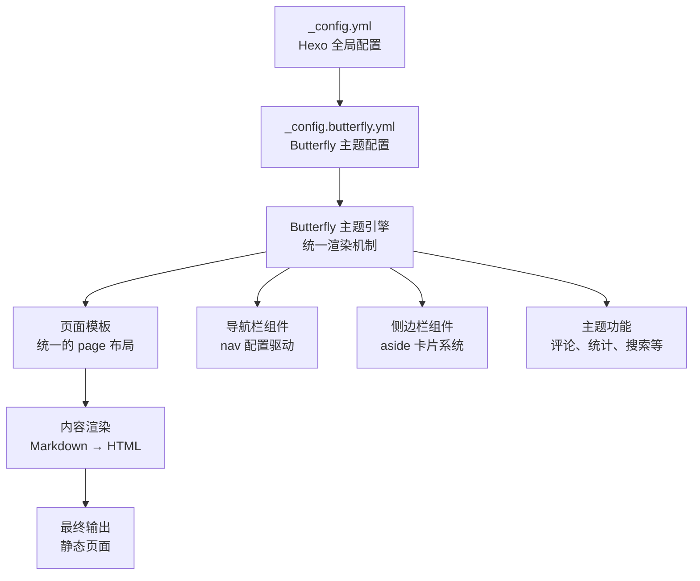
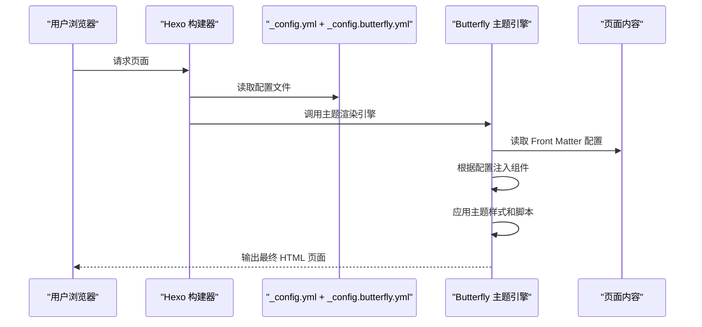
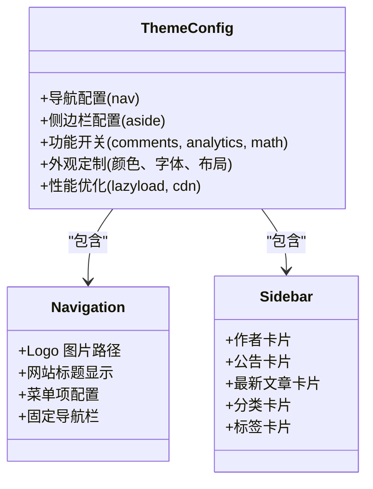
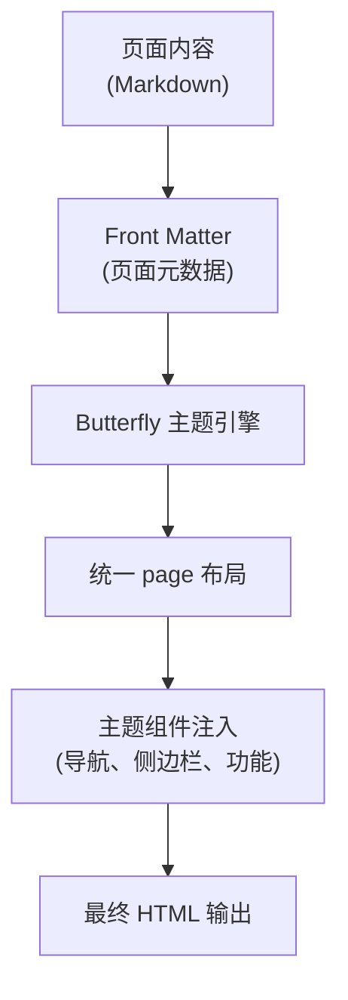
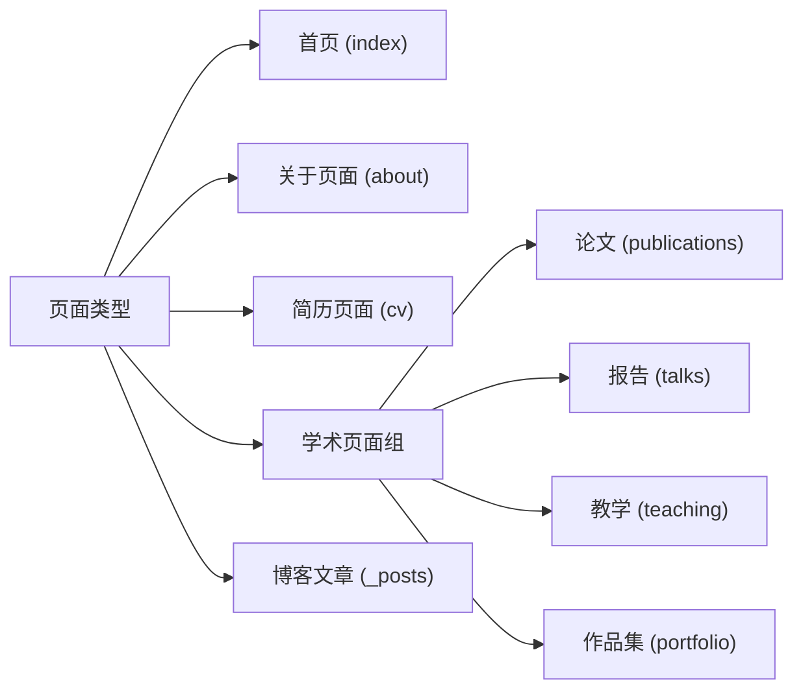
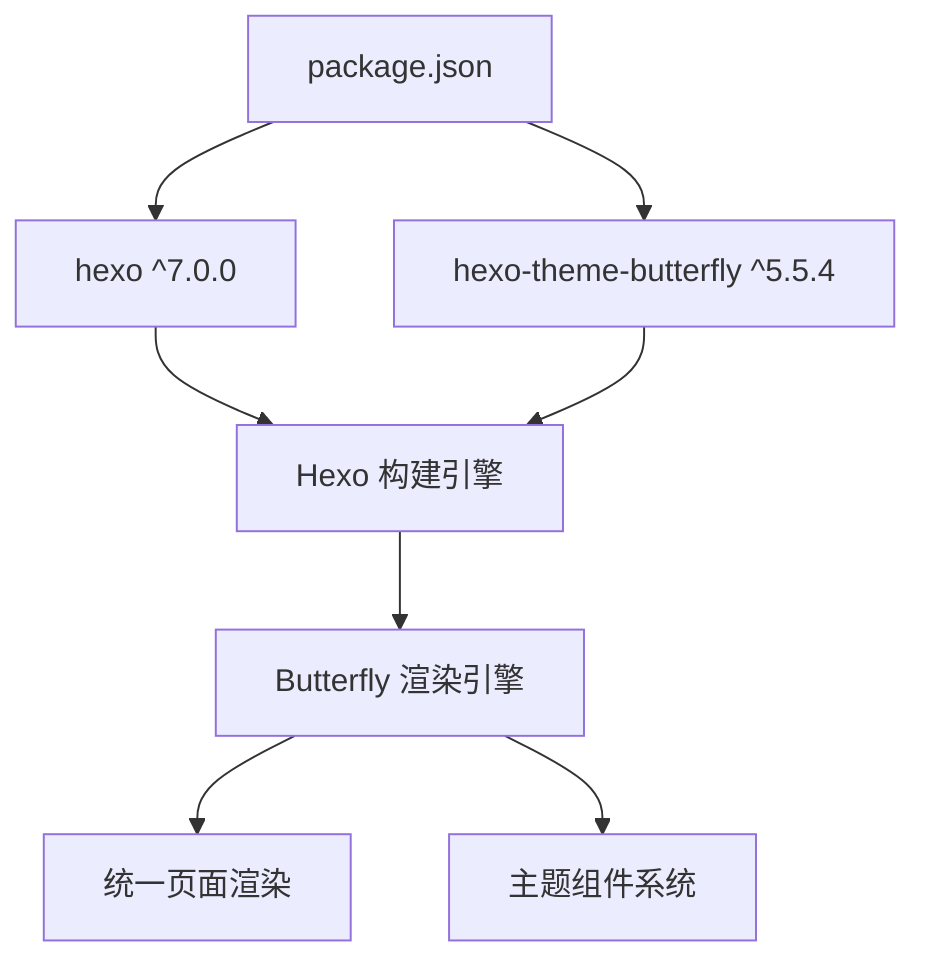

# 页面布局和模板系统

<cite>
**本文引用的文件**
- [_config.yml](file://hexo-site/_config.yml)
- [_config.butterfly.yml](file://hexo-site/_config.butterfly.yml)
- [package.json](file://hexo-site/package.json)
- [index.md](file://hexo-site/source/index.md)
- [about/index.md](file://hexo-site/source/about/index.md)
- [cv/index.md](file://hexo-site/source/cv/index.md)
- [publications/index.md](file://hexo-site/source/publications/index.md)
- [talks/index.md](file://hexo-site/source/talks/index.md)
- [teaching/index.md](file://hexo-site/source/teaching/index.md)
- [portfolio/index.md](file://hexo-site/source/portfolio/index.md)
- [_posts/2025-03-11-useful-website.md](file://hexo-site/source/_posts/2025-03-11-useful-website.md)
</cite>

## 更新摘要
**变更内容**
- 从 Jekyll 模板系统完全迁移到 Hexo + Butterfly 主题系统
- 移除了复杂的布局继承体系（_layouts 目录），采用 Butterfly 主题的统一渲染机制
- 简化了页面结构，统一使用 page 布局和主题配置驱动的外观控制
- 更新了导航系统、侧边栏组件和主题定制方式
- 移除了 Jekyll 特有的包含文件复用机制，采用主题内置组件

## 目录
1. [简介](#简介)
2. [项目结构](#项目结构)
3. [核心组件](#核心组件)
4. [架构总览](#架构总览)
5. [详细组件分析](#详细组件分析)
6. [依赖关系分析](#依赖关系分析)
7. [性能考量](#性能考量)
8. [故障排查指南](#故障排查指南)
9. [结论](#结论)
10. [附录](#附录)

## 简介
本文档面向 Hexo + Butterfly 主题系统的使用者与维护者，系统性阐述基于 Butterfly 主题的页面渲染架构。重点覆盖主题配置驱动的布局系统、统一的页面模板机制、主题内置组件的使用与定制，以及与传统 Jekyll 模板系统的差异对比。通过 _config.butterfly.yml 中的主题配置，实现导航栏、侧边栏、评论系统、统计分析等功能的统一管理。

## 项目结构
该站点采用 Hexo + Butterfly 主题的标准结构，围绕主题配置与内容文件组织页面渲染：
- 主题层：themes 下的 butterfly 主题提供统一的渲染引擎和组件
- 配置层：_config.butterfly.yml 控制主题外观、功能开关与组件配置
- 内容层：source 目录下的各类页面通过 Front Matter 指定布局和元数据
- 依赖层：package.json 管理 Hexo 核心和主题依赖

**图表来源**
- [_config.yml](file://hexo-site/_config.yml)
- [_config.butterfly.yml](file://hexo-site/_config.butterfly.yml)
- [package.json](file://hexo-site/package.json)

**章节来源**
- [_config.yml](file://hexo-site/_config.yml)
- [_config.butterfly.yml](file://hexo-site/_config.butterfly.yml)
- [package.json](file://hexo-site/package.json)

## 核心组件
- **主题引擎**：Butterfly v5.5.4 提供统一的渲染能力，替代了 Jekyll 的复杂布局继承系统
- **导航系统**：通过 nav 配置控制网站标题、Logo、菜单项和固定行为
- **侧边栏系统**：aside 卡片系统提供作者信息、公告、最新文章、分类等模块化组件
- **主题功能**：内置评论系统、统计分析、数学公式、Mermaid 图表、字数统计等
- **页面模板**：统一使用 page 布局，通过 Front Matter 控制页面行为
- **主题定制**：通过 _config.butterfly.yml 的丰富配置项实现外观和功能定制

**章节来源**
- [_config.butterfly.yml](file://hexo-site/_config.butterfly.yml)
- [index.md](file://hexo-site/source/index.md)
- [about/index.md](file://hexo-site/source/about/index.md)

## 架构总览
Butterfly 主题采用"配置驱动 + 统一模板"的架构模式。Hexo 构建器读取 _config.yml 和 _config.butterfly.yml，通过 Butterfly 主题引擎统一渲染所有页面。页面内容通过 Front Matter 指定布局和元数据，主题根据配置自动注入相应的组件和样式。

**图表来源**
- [_config.yml](file://hexo-site/_config.yml)
- [_config.butterfly.yml](file://hexo-site/_config.butterfly.yml)
- [index.md](file://hexo-site/source/index.md)

## 详细组件分析

### 主题配置系统
Butterfly 主题通过 _config.butterfly.yml 提供全面的配置选项：

- **导航配置**：控制 Logo、网站标题显示、菜单项和固定行为
- **侧边栏配置**：管理作者卡片、公告、最新文章、分类等模块
- **功能开关**：评论、统计、搜索、数学公式、Mermaid 等功能的启用/禁用
- **外观定制**：背景、颜色、暗色模式、TOC 等视觉效果
- **性能优化**：懒加载、CDN、PJAX 等性能相关设置

**图表来源**
- [_config.butterfly.yml](file://hexo-site/_config.butterfly.yml)

**章节来源**
- [_config.butterfly.yml](file://hexo-site/_config.butterfly.yml)

### 页面模板系统
Butterfly 主题采用统一的 page 布局，替代了 Jekyll 的多层布局继承：

- **统一布局**：所有页面使用相同的 page 布局，减少模板复杂度
- **Front Matter 控制**：通过页面元数据控制页面行为（如 aside、comments、toc）
- **主题渲染**：Butterfly 主题引擎根据配置自动渲染页面组件
- **内容优先**：开发者专注于 Markdown 内容编写，主题负责外观呈现

**图表来源**
- [index.md](file://hexo-site/source/index.md)
- [about/index.md](file://hexo-site/source/about/index.md)
- [cv/index.md](file://hexo-site/source/cv/index.md)

**章节来源**
- [index.md](file://hexo-site/source/index.md)
- [about/index.md](file://hexo-site/source/about/index.md)
- [cv/index.md](file://hexo-site/source/cv/index.md)

### 页面类型与内容结构
Butterfly 主题支持多种页面类型，每种类型都有特定的用途和内容结构：

- **首页 (index)**：使用自定义 HTML + CSS 实现个性化展示
- **关于页面 (about)**：介绍网站和作者信息
- **简历页面 (cv)**：展示学术背景、工作经历、技能等
- **学术页面**：论文、报告、教学、作品集等专业内容页面
- **博客文章**：使用标准的 post 布局，支持分类、标签、目录等

**图表来源**
- [index.md](file://hexo-site/source/index.md)
- [about/index.md](file://hexo-site/source/about/index.md)
- [cv/index.md](file://hexo-site/source/cv/index.md)
- [publications/index.md](file://hexo-site/source/publications/index.md)
- [talks/index.md](file://hexo-site/source/talks/index.md)
- [teaching/index.md](file://hexo-site/source/teaching/index.md)
- [portfolio/index.md](file://hexo-site/source/portfolio/index.md)
- [_posts/2025-03-11-useful-website.md](file://hexo-site/source/_posts/2025-03-11-useful-website.md)

**章节来源**
- [index.md](file://hexo-site/source/index.md)
- [about/index.md](file://hexo-site/source/about/index.md)
- [cv/index.md](file://hexo-site/source/cv/index.md)
- [publications/index.md](file://hexo-site/source/publications/index.md)
- [talks/index.md](file://hexo-site/source/talks/index.md)
- [teaching/index.md](file://hexo-site/source/teaching/index.md)
- [portfolio/index.md](file://hexo-site/source/portfolio/index.md)
- [_posts/2025-03-11-useful-website.md](file://hexo-site/source/_posts/2025-03-11-useful-website.md)

### 主题功能集成
Butterfly 主题集成了丰富的功能模块，通过配置文件统一管理：

- **评论系统**：支持多种评论提供商，通过 comments.use 配置
- **统计分析**：集成百度统计、Google Analytics 等分析工具
- **数学公式**：内置 MathJax 支持 LaTeX 数学公式渲染
- **图表绘制**：集成 Mermaid 支持流程图、时序图等图表
- **代码高亮**：支持多种编程语言的语法高亮
- **字数统计**：显示文章字数和预计阅读时间
- **搜索功能**：支持本地搜索和 Algolia 搜索

**章节来源**
- [_config.butterfly.yml](file://hexo-site/_config.butterfly.yml)

## 依赖关系分析
Butterfly 主题系统简化了依赖关系，采用主题引擎统一管理：

- **核心依赖**：Hexo 7.0 + Butterfly 5.5.4 主题
- **渲染依赖**：Butterfly 主题引擎负责所有页面的统一渲染
- **功能依赖**：各功能模块通过配置文件启用/禁用
- **内容依赖**：页面内容通过 Front Matter 指定布局和行为

**图表来源**
- [package.json](file://hexo-site/package.json)
- [_config.yml](file://hexo-site/_config.yml)

**章节来源**
- [package.json](file://hexo-site/package.json)
- [_config.yml](file://hexo-site/_config.yml)

## 性能考量
Butterfly 主题提供了多项性能优化特性：

- **主题优化**：内置懒加载、CDN 支持、PJAX 等性能优化
- **资源管理**：统一的 CSS/JS 管理，减少重复加载
- **功能按需**：通过配置禁用不需要的功能，减少资源消耗
- **缓存策略**：支持浏览器缓存和 CDN 缓存
- **代码分割**：按需加载功能模块，提高首屏加载速度

**章节来源**
- [_config.butterfly.yml](file://hexo-site/_config.butterfly.yml)

## 故障排查指南
Butterfly 主题系统的故障排查要点：

- **主题未生效**：检查 package.json 中的 hexo-theme-butterfly 版本和 _config.yml 中的 theme: butterfly 配置
- **页面布局异常**：确认页面 Front Matter 中的 layout: page 设置
- **导航显示问题**：检查 _config.butterfly.yml 中 nav 配置的路径和图标
- **侧边栏组件缺失**：验证 aside 卡片的 enable 设置和内容配置
- **功能模块失效**：检查对应功能的 enable 设置和配置项
- **样式显示异常**：确认主题版本兼容性和自定义样式的正确性

**章节来源**
- [_config.butterfly.yml](file://hexo-site/_config.butterfly.yml)
- [_config.yml](file://hexo-site/_config.yml)

## 结论
Butterfly 主题系统通过"配置驱动 + 统一模板"的架构，显著简化了页面布局和模板系统的复杂度。相比 Jekyll 的多层布局继承，Butterfly 采用更直观的主题配置方式，开发者可以专注于内容创作，而主题负责统一的外观和功能呈现。这种架构既保持了高度的可定制性，又大大降低了维护成本。

## 附录

### 从 Jekyll 迁移到 Butterfly 的关键差异
- **布局系统**：从复杂的 _layouts 目录迁移到统一的 page 布局
- **配置方式**：从多个配置文件整合到 _config.butterfly.yml
- **组件管理**：从手动 include 迁移到主题内置组件系统
- **功能集成**：从插件系统迁移到主题内建功能模块
- **渲染机制**：从 Liquid 模板迁移到主题引擎统一渲染

### Butterfly 主题定制最佳实践
- **配置优先**：优先通过 _config.butterfly.yml 进行外观定制
- **内容分离**：保持 Markdown 内容与主题配置的清晰分离
- **渐进增强**：按需启用功能模块，避免过度配置
- **版本管理**：定期更新主题版本，保持功能和安全性的最新状态
- **性能监控**：利用内置性能优化功能，持续改进页面加载速度

### 页面开发指南
- **页面创建**：在 source 目录下创建新的页面文件
- **Front Matter**：使用统一的 page 布局和必要的元数据
- **主题配置**：通过 _config.butterfly.yml 控制页面外观和功能
- **内容组织**：按照页面类型的最佳实践组织内容结构
- **样式定制**：在页面中添加必要的自定义样式，遵循主题规范

**章节来源**
- [_config.butterfly.yml](file://hexo-site/_config.butterfly.yml)
- [index.md](file://hexo-site/source/index.md)
- [about/index.md](file://hexo-site/source/about/index.md)
- [cv/index.md](file://hexo-site/source/cv/index.md)