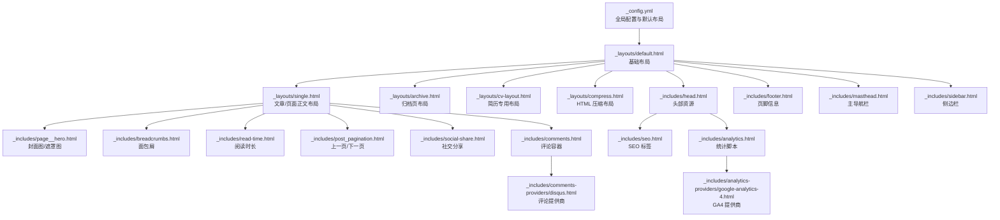
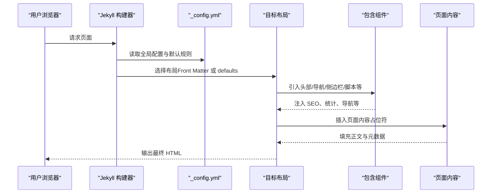
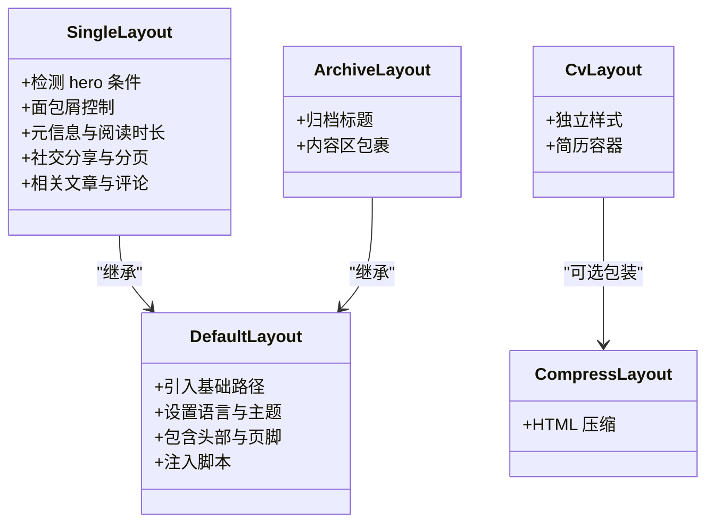
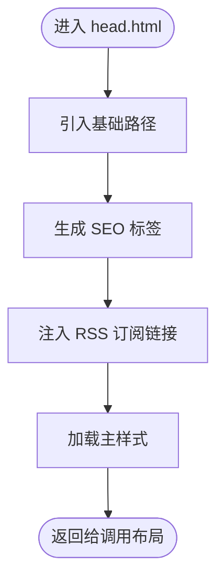
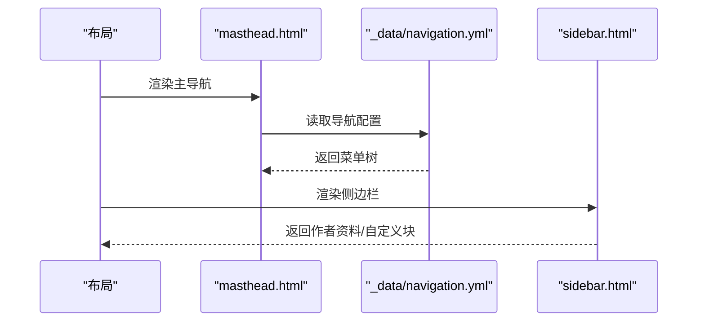
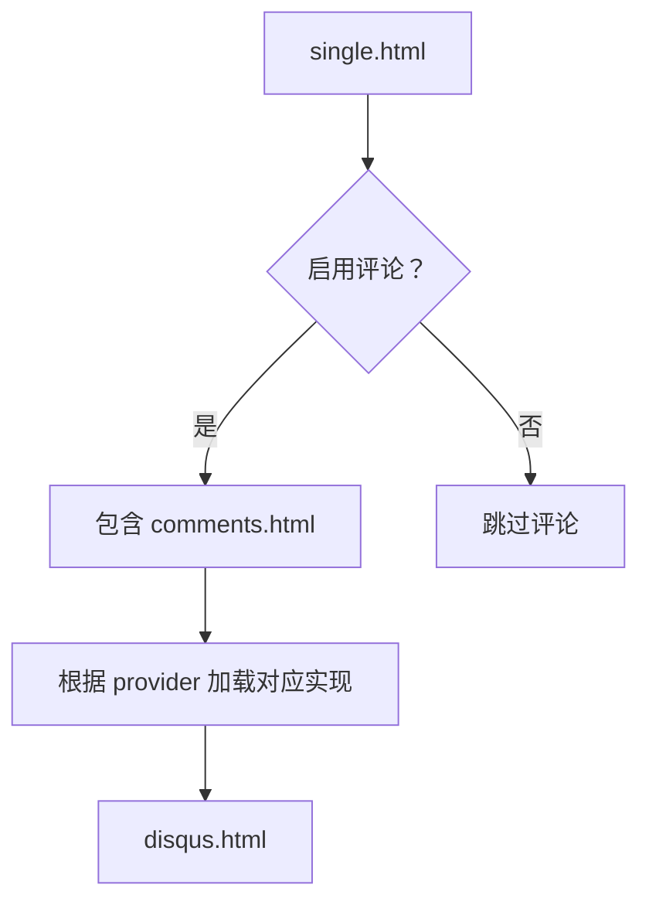
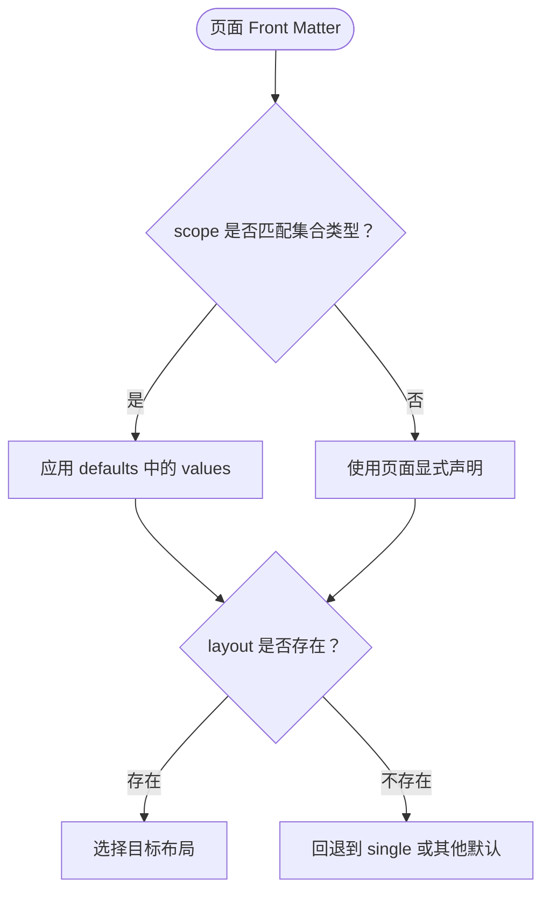
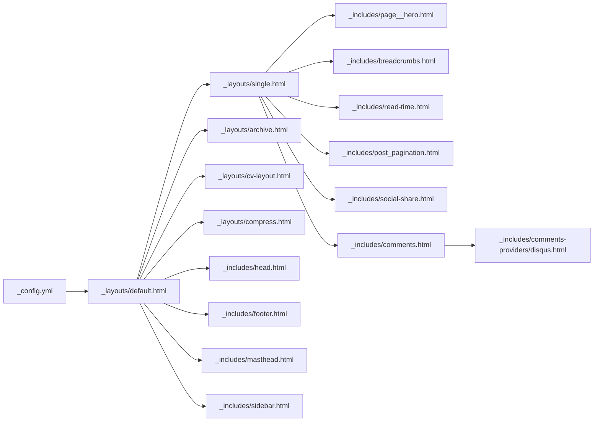

# 页面布局和模板系统

<cite>
**本文引用的文件**
- [_config.yml](file://_config.yml)
- [_layouts/default.html](file://_layouts/default.html)
- [_layouts/single.html](file://_layouts/single.html)
- [_layouts/archive.html](file://_layouts/archive.html)
- [_layouts/cv-layout.html](file://_layouts/cv-layout.html)
- [_layouts/compress.html](file://_layouts/compress.html)
- [_includes/head.html](file://_includes/head.html)
- [_includes/footer.html](file://_includes/footer.html)
- [_includes/masthead.html](file://_includes/masthead.html)
- [_includes/sidebar.html](file://_includes/sidebar.html)
- [_includes/analytics.html](file://_includes/analytics.html)
- [_includes/analytics-providers/google-analytics-4.html](file://_includes/analytics-providers/google-analytics-4.html)
- [_includes/comments.html](file://_includes/comments.html)
- [_includes/comments-providers/disqus.html](file://_includes/comments-providers/disqus.html)
- [_includes/page__hero.html](file://_includes/page__hero.html)
- [_includes/breadcrumbs.html](file://_includes/breadcrumbs.html)
- [_includes/read-time.html](file://_includes/read-time.html)
- [_includes/post_pagination.html](file://_includes/post_pagination.html)
- [_includes/social-share.html](file://_includes/social-share.html)
- [_includes/scripts.html](file://_includes/scripts.html)
- [_includes/seo.html](file://_includes/seo.html)
- [_pages/about.md](file://_pages/about.md)
- [_posts/2025-03-11-my-first-blog.md](file://_posts/2025-03-11-my-first-blog.md)
- [_pages/cv.md](file://_pages/cv.md)
- [_data/navigation.yml](file://_data/navigation.yml)
- [_sass/theme/_default_light.scss](file://_sass/theme/_default_light.scss)
</cite>

## 目录
1. [简介](#简介)
2. [项目结构](#项目结构)
3. [核心组件](#核心组件)
4. [架构总览](#架构总览)
5. [详细组件分析](#详细组件分析)
6. [依赖关系分析](#依赖关系分析)
7. [性能考量](#性能考量)
8. [故障排查指南](#故障排查指南)
9. [结论](#结论)
10. [附录](#附录)

## 简介
本文件面向 Jekyll 模板系统的使用者与维护者，系统性阐述布局继承、包含文件复用与页面渲染流程。重点覆盖 _layouts 与 _includes 目录中的关键布局与组件，解释其职责、组合方式与适用场景；结合 _config.yml 中的 defaults 配置，说明 Front Matter 如何影响布局选择；并提供自定义开发指南、调试与性能优化建议。

## 项目结构
该站点采用标准 Jekyll 结构，围绕布局与包含文件组织页面渲染：
- 布局层：_layouts 下定义页面骨架与通用结构
- 包含层：_includes 下提供可复用的头部、脚部、导航、SEO、评论、统计等组件
- 内容层：_posts、_pages、_publications 等集合通过 Front Matter 指定布局
- 全局配置：_config.yml 控制主题、评论、统计、集合与默认布局策略

**图表来源**
- [_config.yml](file://_config.yml)
- [_layouts/default.html](file://_layouts/default.html)
- [_layouts/single.html](file://_layouts/single.html)
- [_layouts/archive.html](file://_layouts/archive.html)
- [_layouts/cv-layout.html](file://_layouts/cv-layout.html)
- [_layouts/compress.html](file://_layouts/compress.html)
- [_includes/head.html](file://_includes/head.html)
- [_includes/footer.html](file://_includes/footer.html)
- [_includes/masthead.html](file://_includes/masthead.html)
- [_includes/sidebar.html](file://_includes/sidebar.html)
- [_includes/page__hero.html](file://_includes/page__hero.html)
- [_includes/breadcrumbs.html](file://_includes/breadcrumbs.html)
- [_includes/read-time.html](file://_includes/read-time.html)
- [_includes/post_pagination.html](file://_includes/post_pagination.html)
- [_includes/social-share.html](file://_includes/social-share.html)
- [_includes/comments.html](file://_includes/comments.html)
- [_includes/comments-providers/disqus.html](file://_includes/comments-providers/disqus.html)
- [_includes/seo.html](file://_includes/seo.html)
- [_includes/analytics.html](file://_includes/analytics.html)
- [_includes/analytics-providers/google-analytics-4.html](file://_includes/analytics-providers/google-analytics-4.html)

**章节来源**
- [_config.yml](file://_config.yml)
- [_layouts/default.html](file://_layouts/default.html)
- [_layouts/single.html](file://_layouts/single.html)
- [_layouts/archive.html](file://_layouts/archive.html)
- [_layouts/cv-layout.html](file://_layouts/cv-layout.html)
- [_layouts/compress.html](file://_layouts/compress.html)
- [_includes/head.html](file://_includes/head.html)
- [_includes/footer.html](file://_includes/footer.html)
- [_includes/masthead.html](file://_includes/masthead.html)
- [_includes/sidebar.html](file://_includes/sidebar.html)

## 核心组件
- 默认布局 default：作为大多数页面的基础骨架，负责注入基础路径、头部、主体内容占位符、页脚与脚本。
- 文章/页面布局 single：在 default 基础上增加标题、元信息、阅读时长、面包屑、社交分享、分页、相关文章、评论等。
- 归档布局 archive：适用于按分类/标签/年份归档的列表页，提供统一的标题与内容区域。
- 简历布局 cv-layout：独立的简历专用布局，引入独立样式与容器，适配密集信息展示。
- 压缩布局 compress：通过 HTML 压缩插件减少体积，提升加载性能。
- 头部组件 head：注入 SEO、Feed、CSS 主样式与基础路径。
- 页脚组件 footer：社交图标、订阅链接与版权信息。
- 导航组件 masthead：响应式主导航，支持多级菜单与主题切换。
- 侧边栏组件 sidebar：作者资料、自定义块与导航列表。
- 统计与评论：analytics 与 comments 容器，配合 providers 实现扩展。

**章节来源**
- [_layouts/default.html](file://_layouts/default.html)
- [_layouts/single.html](file://_layouts/single.html)
- [_layouts/archive.html](file://_layouts/archive.html)
- [_layouts/cv-layout.html](file://_layouts/cv-layout.html)
- [_layouts/compress.html](file://_layouts/compress.html)
- [_includes/head.html](file://_includes/head.html)
- [_includes/footer.html](file://_includes/footer.html)
- [_includes/masthead.html](file://_includes/masthead.html)
- [_includes/sidebar.html](file://_includes/sidebar.html)
- [_includes/analytics.html](file://_includes/analytics.html)
- [_includes/comments.html](file://_includes/comments.html)

## 架构总览
Jekyll 渲染流程遵循“配置 → 布局 → 包含 → 内容”的顺序。默认布局负责通用结构，具体页面通过 Front Matter 指定布局，再由布局调用相应包含文件完成头部、导航、主体与脚部的拼装。

**图表来源**
- [_config.yml](file://_config.yml)
- [_layouts/default.html](file://_layouts/default.html)
- [_layouts/single.html](file://_layouts/single.html)
- [_includes/head.html](file://_includes/head.html)
- [_includes/masthead.html](file://_includes/masthead.html)
- [_includes/sidebar.html](file://_includes/sidebar.html)
- [_includes/footer.html](file://_includes/footer.html)

## 详细组件分析

### 布局系统与继承关系
- default：提供基础 HTML 结构、语言属性、主题开关、头部与页脚占位、脚本注入。
- single：在 default 上叠加文章/页面特有元素，如 hero 图、面包屑、元信息、社交分享、分页、相关文章与评论。
- archive：在 default 上叠加归档标题与内容区，适合列表型页面。
- cv-layout：独立布局，引入简历专用样式，适合密集信息展示。
- compress：作为顶层布局，对输出进行 HTML 压缩处理。

**图表来源**
- [_layouts/default.html](file://_layouts/default.html)
- [_layouts/single.html](file://_layouts/single.html)
- [_layouts/archive.html](file://_layouts/archive.html)
- [_layouts/cv-layout.html](file://_layouts/cv-layout.html)
- [_layouts/compress.html](file://_layouts/compress.html)

**章节来源**
- [_layouts/default.html](file://_layouts/default.html)
- [_layouts/single.html](file://_layouts/single.html)
- [_layouts/archive.html](file://_layouts/archive.html)
- [_layouts/cv-layout.html](file://_layouts/cv-layout.html)
- [_layouts/compress.html](file://_layouts/compress.html)

### 头部与 SEO 组件
- head：注入基础路径、SEO、RSS 订阅、主样式与基础脚本。
- seo：生成结构化数据与 Open Graph/Twitter Card 标签。
- analytics：根据配置注入统计脚本，支持多种提供商。
- analytics-providers/google-analytics-4：GA4 提供商实现。

**图表来源**
- [_includes/head.html](file://_includes/head.html)
- [_includes/seo.html](file://_includes/seo.html)
- [_includes/analytics.html](file://_includes/analytics.html)
- [_includes/analytics-providers/google-analytics-4.html](file://_includes/analytics-providers/google-analytics-4.html)

**章节来源**
- [_includes/head.html](file://_includes/head.html)
- [_includes/seo.html](file://_includes/seo.html)
- [_includes/analytics.html](file://_includes/analytics.html)
- [_includes/analytics-providers/google-analytics-4.html](file://_includes/analytics-providers/google-analytics-4.html)

### 导航与侧边栏
- masthead：构建主导航栏，支持多级菜单与主题切换按钮，从 _data/navigation.yml 读取菜单项。
- sidebar：根据页面参数决定是否显示作者资料与自定义块，支持嵌入导航列表。

**图表来源**
- [_includes/masthead.html](file://_includes/masthead.html)
- [_data/navigation.yml](file://_data/navigation.yml)
- [_includes/sidebar.html](file://_includes/sidebar.html)

**章节来源**
- [_includes/masthead.html](file://_includes/masthead.html)
- [_data/navigation.yml](file://_data/navigation.yml)
- [_includes/sidebar.html](file://_includes/sidebar.html)

### 评论与社交分享
- comments：评论容器，按配置启用不同提供商。
- comments-providers/disqus：Disqus 评论实现。
- social-share：社交分享组件。

**图表来源**
- [_layouts/single.html](file://_layouts/single.html)
- [_includes/comments.html](file://_includes/comments.html)
- [_includes/comments-providers/disqus.html](file://_includes/comments-providers/disqus.html)

**章节来源**
- [_layouts/single.html](file://_layouts/single.html)
- [_includes/comments.html](file://_includes/comments.html)
- [_includes/comments-providers/disqus.html](file://_includes/comments-providers/disqus.html)

### 页面元数据与布局选择
- _config.yml 中的 defaults 为不同集合类型指定默认布局与行为（如 posts/pages/teaching/publications/portfolio/talks）。
- 页面 Front Matter 可覆盖默认布局与局部行为（如 layout、author_profile、comments、share、related 等）。
- 示例：about.md 使用单页布局并开启作者资料；cv.md 使用归档布局并设置永久链接；博客文章 Front Matter 指定 single 布局并开启评论、分享与相关推荐。

**图表来源**
- [_config.yml](file://_config.yml)
- [_pages/about.md](file://_pages/about.md)
- [_posts/2025-03-11-my-first-blog.md](file://_posts/2025-03-11-my-first-blog.md)
- [_pages/cv.md](file://_pages/cv.md)

**章节来源**
- [_config.yml](file://_config.yml)
- [_pages/about.md](file://_pages/about.md)
- [_posts/2025-03-11-my-first-blog.md](file://_posts/2025-03-11-my-first-blog.md)
- [_pages/cv.md](file://_pages/cv.md)

## 依赖关系分析
- 布局依赖：single/archive 继承 default；cv-layout 可与 compress 同时使用以压缩输出。
- 包含依赖：default 引入 head/footer/masthead/sidebar；single 进一步引入 hero、面包屑、社交分享、分页、评论等。
- 配置依赖：_config.yml 的 defaults 决定页面默认布局与行为；navigation.yml 决定导航菜单结构。

**图表来源**
- [_config.yml](file://_config.yml)
- [_layouts/default.html](file://_layouts/default.html)
- [_layouts/single.html](file://_layouts/single.html)
- [_layouts/archive.html](file://_layouts/archive.html)
- [_layouts/cv-layout.html](file://_layouts/cv-layout.html)
- [_layouts/compress.html](file://_layouts/compress.html)
- [_includes/head.html](file://_includes/head.html)
- [_includes/footer.html](file://_includes/footer.html)
- [_includes/masthead.html](file://_includes/masthead.html)
- [_includes/sidebar.html](file://_includes/sidebar.html)
- [_includes/page__hero.html](file://_includes/page__hero.html)
- [_includes/breadcrumbs.html](file://_includes/breadcrumbs.html)
- [_includes/read-time.html](file://_includes/read-time.html)
- [_includes/post_pagination.html](file://_includes/post_pagination.html)
- [_includes/social-share.html](file://_includes/social-share.html)
- [_includes/comments.html](file://_includes/comments.html)
- [_includes/comments-providers/disqus.html](file://_includes/comments-providers/disqus.html)

**章节来源**
- [_config.yml](file://_config.yml)
- [_layouts/default.html](file://_layouts/default.html)
- [_layouts/single.html](file://_layouts/single.html)
- [_layouts/archive.html](file://_layouts/archive.html)
- [_layouts/cv-layout.html](file://_layouts/cv-layout.html)
- [_layouts/compress.html](file://_layouts/compress.html)
- [_includes/head.html](file://_includes/head.html)
- [_includes/footer.html](file://_includes/footer.html)
- [_includes/masthead.html](file://_includes/masthead.html)
- [_includes/sidebar.html](file://_includes/sidebar.html)
- [_includes/comments.html](file://_includes/comments.html)
- [_includes/comments-providers/disqus.html](file://_includes/comments-providers/disqus.html)

## 性能考量
- HTML 压缩：通过 compress 布局与 compress_html 插件移除多余空白、注释与换行，降低传输体积。
- 资源合并与延迟加载：主样式集中引入，避免重复请求；脚本按需加载。
- 主题与样式：主题变量集中于 SCSS 文件，便于统一管理与打包。
- 缓存策略：静态资源建议配合 CDN 与浏览器缓存策略。

[本节为通用性能建议，不直接分析具体文件]

## 故障排查指南
- 布局未生效：检查页面 Front Matter 中的 layout 是否正确；确认 _config.yml defaults 是否覆盖了集合类型默认值。
- 导航异常：核对 _data/navigation.yml 的结构与链接路径；确认 masthead 读取逻辑与 base_path。
- 评论/统计未显示：检查 _config.yml 中 comments/analytics provider 设置；确认对应包含文件已启用。
- SEO 标签缺失：确认 head.html 已引入 seo.html；检查页面是否缺少必要的元数据字段。
- 主题切换无效：确认 default 布局中主题开关逻辑与脚本注入是否正常。

**章节来源**
- [_config.yml](file://_config.yml)
- [_layouts/default.html](file://_layouts/default.html)
- [_includes/masthead.html](file://_includes/masthead.html)
- [_includes/comments.html](file://_includes/comments.html)
- [_includes/analytics.html](file://_includes/analytics.html)
- [_includes/head.html](file://_includes/head.html)

## 结论
本模板系统通过清晰的布局继承与包含复用机制，实现了高度模块化的页面渲染。借助 _config.yml 的 defaults 与页面 Front Matter 的灵活覆盖，可以快速适配不同类型的内容页面。建议在新增布局或组件时遵循现有命名与调用约定，确保可维护性与一致性。

[本节为总结性内容，不直接分析具体文件]

## 附录

### 自定义布局与包含文件开发指南
- 新增布局：在 _layouts 下创建新布局，必要时以 compress 包裹以启用压缩；在 default 基础上扩展所需组件。
- 新增包含：在 _includes 下创建组件文件，注意引入 base_path 与必要的数据源；在布局中按需 include。
- Liquid 语法要点：使用条件判断（if/else）、循环（for）、过滤器（如 markdownify、strip_html、escape_once）与变量传递。
- 最佳实践：保持组件单一职责；统一命名与目录结构；在 _config.yml 中集中管理默认行为；为复杂组件提供可配置参数。

[本节为通用开发指导，不直接分析具体文件]

### 页面元数据对布局选择的影响
- defaults：为 posts/pages/teaching/publications/portfolio/talks 等集合设置默认布局与行为。
- Front Matter：在页面顶部声明覆盖项，如 layout、author_profile、comments、share、related 等。
- 示例参考：about.md、2025-03-11-my-first-blog.md、cv.md 展示了不同集合与页面的布局选择与参数配置。

**章节来源**
- [_config.yml](file://_config.yml)
- [_pages/about.md](file://_pages/about.md)
- [_posts/2025-03-11-my-first-blog.md](file://_posts/2025-03-11-my-first-blog.md)
- [_pages/cv.md](file://_pages/cv.md)

### 主题与样式定制
- 主题变量：集中于 _sass/theme/_default_light.scss 等文件，便于切换与统一风格。
- 动态主题：default 布局中通过条件注入 data-theme，结合脚本实现主题切换。
- 自定义样式：在 cv-layout 中引入独立样式文件，满足简历类页面的特殊需求。

**章节来源**
- [_sass/theme/_default_light.scss](file://_sass/theme/_default_light.scss)
- [_layouts/default.html](file://_layouts/default.html)
- [_layouts/cv-layout.html](file://_layouts/cv-layout.html)