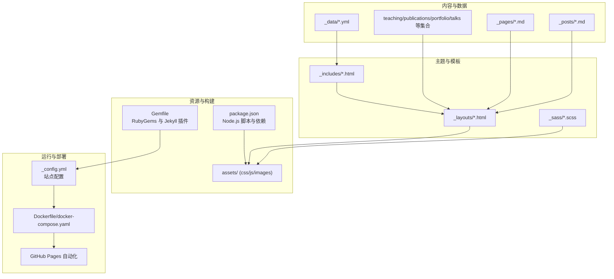
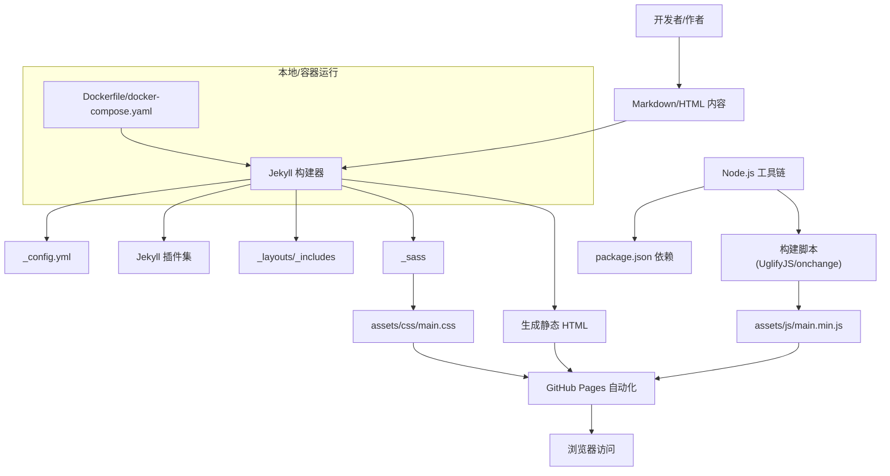
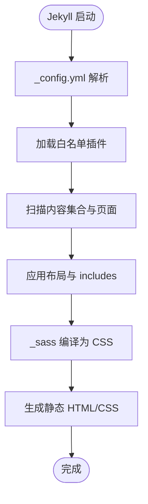
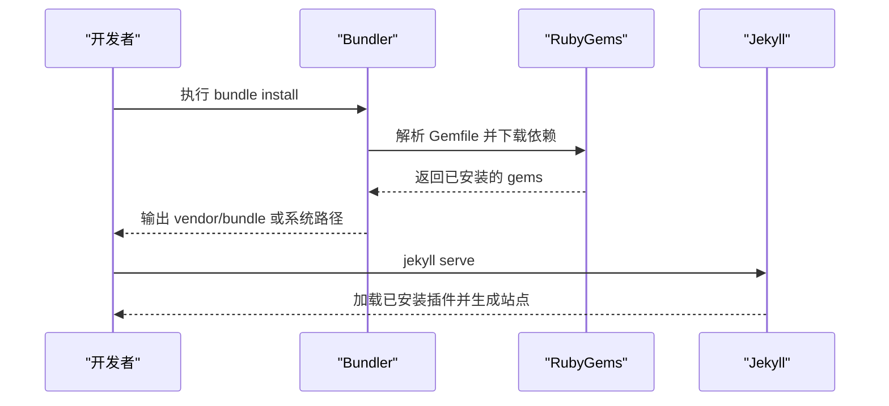
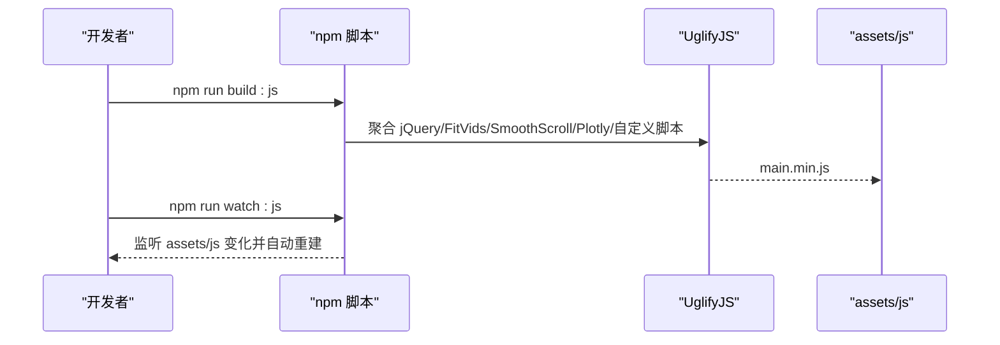
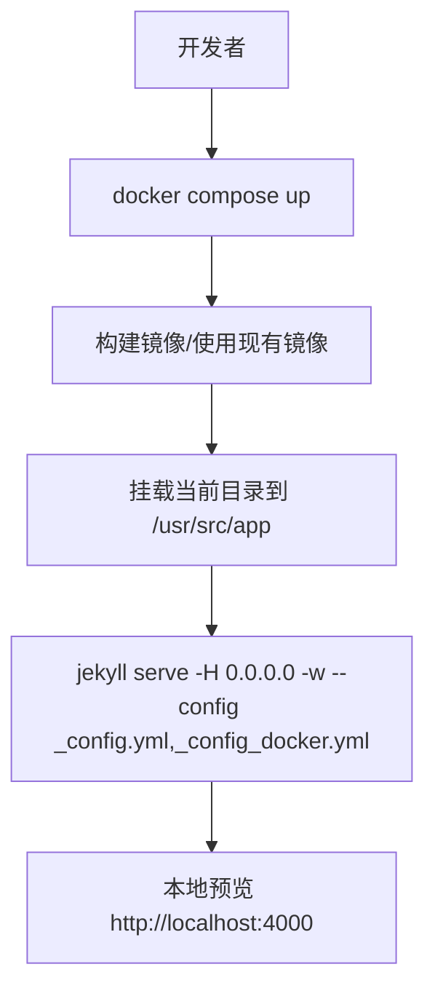
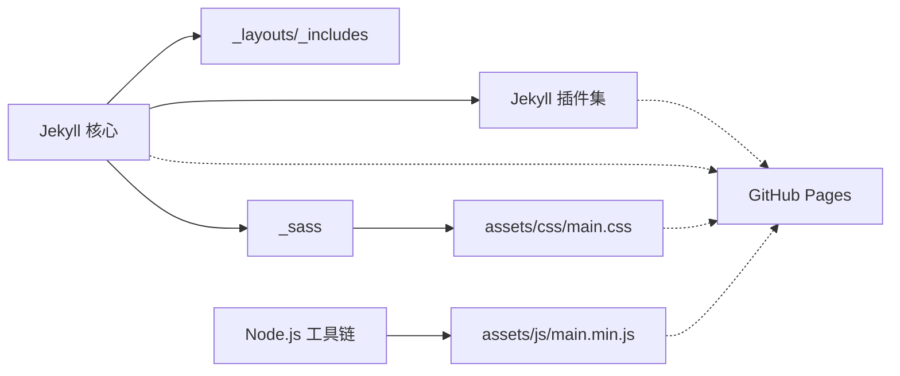

# 技术栈概览

<cite>
**本文引用的文件**
- [_config.yml](file://_config.yml)
- [Gemfile](file://Gemfile)
- [package.json](file://package.json)
- [Dockerfile](file://Dockerfile)
- [docker-compose.yaml](file://docker-compose.yaml)
- [_config_docker.yml](file://_config_docker.yml)
- [README.md](file://README.md)
- [BUGFIX_NAVIGATION.md](file://BUGFIX_NAVIGATION.md)
- [_layouts/default.html](file://_layouts/default.html)
- [_includes/head.html](file://_includes/head.html)
- [_includes/scripts.html](file://_includes/scripts.html)
</cite>

## 目录
1. [简介](#简介)
2. [项目结构](#项目结构)
3. [核心组件](#核心组件)
4. [架构总览](#架构总览)
5. [详细组件分析](#详细组件分析)
6. [依赖分析](#依赖分析)
7. [性能考虑](#性能考虑)
8. [故障排除指南](#故障排除指南)
9. [结论](#结论)
10. [附录](#附录)

## 简介
本文件面向 Academic Pages 项目的使用者与维护者，提供技术栈的综合概览。重点覆盖以下方面：
- Jekyll 静态网站生成器及其核心配置与插件生态
- Ruby 生态（Bundler、RubyGems）在本地与容器环境中的使用
- Node.js 前端工具链（包管理、脚本、打包压缩）
- GitHub Pages 自动化构建与部署流程
- 技术选型优势：性能优异、安全可靠、易于维护、成本低廉
- 兼容性与运行环境要求
- 初学者背景知识与进阶技术深度

## 项目结构
该项目采用 Jekyll 主题与静态站点生成的典型组织方式，包含内容区（_posts、_pages、_publications 等）、主题模板（_layouts、_includes、_sass）、资源与构建脚本（assets、package.json、Gemfile）以及容器化支持（Dockerfile、docker-compose.yaml）。整体结构清晰，便于内容作者专注于写作与配置，而将构建与部署交给自动化流水线。

图表来源
- [_config.yml:1-362](file://_config.yml#L1-L362)
- [Gemfile:1-14](file://Gemfile#L1-L14)
- [package.json:1-42](file://package.json#L1-L42)
- [Dockerfile:1-36](file://Dockerfile#L1-L36)
- [docker-compose.yaml:1-10](file://docker-compose.yaml#L1-L10)

章节来源
- [_config.yml:1-362](file://_config.yml#L1-L362)
- [Gemfile:1-14](file://Gemfile#L1-L14)
- [package.json:1-42](file://package.json#L1-L42)
- [Dockerfile:1-36](file://Dockerfile#L1-L36)
- [docker-compose.yaml:1-10](file://docker-compose.yaml#L1-L10)

## 核心组件
- Jekyll 静态生成器与配置
  - 站点基础信息、国际化、主题、作者信息、社交链接、评论与分析提供商、RSS/Atom、Sass 编译、分页与归档策略、插件白名单等均在站点配置中集中定义。
  - 关键路径参考：[_config.yml:1-362](file://_config.yml#L1-L362)
- Ruby 生态与 Bundler
  - Gemfile 明确声明 Jekyll 核心与一组插件（Feed、Sitemap、Redirect From、Emoji 等），并包含 github-pages 兼容层与连接池依赖；同时安装 WEBrick 以满足本地开发服务器需求。
  - 关键路径参考：[Gemfile:1-14](file://Gemfile#L1-L14)
- Node.js 前端工具链
  - package.json 定义了前端依赖（jQuery、FitVids、Smooth Scroll、Plotly）、开发依赖（onchange、uglify-js）与构建脚本（UglifyJS 压缩、监听变更）。
  - 关键路径参考：[package.json:1-42](file://package.json#L1-L42)
- 容器化与本地运行
  - Dockerfile 基于 Ruby 镜像，安装 Node.js 与构建工具，设置非 root 用户，预装 Bundler 并执行 bundle install，最终以 jekyll serve 提供本地服务。
  - docker-compose.yaml 将宿主机目录挂载至容器，暴露 4000 端口，支持热重载与多配置文件加载。
  - 关键路径参考：[Dockerfile:1-36](file://Dockerfile#L1-L36)、[docker-compose.yaml:1-10](file://docker-compose.yaml#L1-L10)
- 模板与资源集成
  - 默认布局引入 head 与脚本片段，head 片段负责 SEO、样式表与 Atom/RSS 链接；脚本片段加载压缩后的 main.min.js 与统计脚本。
  - 关键路径参考：[_layouts/default.html:1-32](file://_layouts/default.html#L1-L32)、[_includes/head.html:1-17](file://_includes/head.html#L1-L17)、[_includes/scripts.html:1-4](file://_includes/scripts.html#L1-L4)

章节来源
- [_config.yml:1-362](file://_config.yml#L1-L362)
- [Gemfile:1-14](file://Gemfile#L1-L14)
- [package.json:1-42](file://package.json#L1-L42)
- [Dockerfile:1-36](file://Dockerfile#L1-L36)
- [docker-compose.yaml:1-10](file://docker-compose.yaml#L1-L10)
- [_layouts/default.html:1-32](file://_layouts/default.html#L1-L32)
- [_includes/head.html:1-17](file://_includes/head.html#L1-L17)
- [_includes/scripts.html:1-4](file://_includes/scripts.html#L1-L4)

## 架构总览
下图展示了从内容创作到静态发布的关键流程：作者在本地或容器中编辑内容，Jekyll 读取配置与插件，结合模板与 Sass 编译生成静态资源；Node.js 负责前端资源的打包与压缩；最终由 GitHub Pages 自动触发构建与部署。

图表来源
- [_config.yml:1-362](file://_config.yml#L1-L362)
- [Gemfile:1-14](file://Gemfile#L1-L14)
- [package.json:1-42](file://package.json#L1-L42)
- [Dockerfile:1-36](file://Dockerfile#L1-L36)
- [docker-compose.yaml:1-10](file://docker-compose.yaml#L1-L10)

## 详细组件分析

### Jekyll 配置与插件体系
- 站点配置
  - 基础信息：站点标题、语言、URL、仓库名、作者信息、社交链接等。
  - 功能开关：面包屑、阅读时间、RSS/Atom、SEO、社交分享、分析提供商、评论提供商等。
  - 内容与集合：启用教学、论文、作品、演讲等集合，并设置统一的永久链接与输出策略。
  - Markdown 处理：Kramdown 输入、高亮引擎、TOC 层级、智能引号等。
  - Sass 编译：源目录、输出风格（压缩）、HTML 压缩插件。
  - 归档与分页：类别/标签归档类型与路径。
- 插件生态
  - 白名单插件：Feed、Gist、Paginate、Sitemap、Redirect From、Emoji。
  - 插件安装：通过 Gemfile 声明，Bundler 统一安装。
- 关键路径参考
  - [_config.yml:1-362](file://_config.yml#L1-L362)
  - [Gemfile:1-14](file://Gemfile#L1-L14)

图表来源
- [_config.yml:1-362](file://_config.yml#L1-L362)
- [Gemfile:1-14](file://Gemfile#L1-L14)

章节来源
- [_config.yml:1-362](file://_config.yml#L1-L362)
- [Gemfile:1-14](file://Gemfile#L1-L14)

### Ruby 生态与 Bundler
- 依赖管理
  - Gemfile 指定 RubyGems 源，声明 Jekyll 核心与一组插件，同时包含 github-pages 兼容层与连接池版本锁定。
  - 本地安装建议：Linux/MacOS 下分别提供安装命令与权限问题的解决方案（使用 vendor/bundle 本地安装）。
- 容器内安装
  - Dockerfile 中先安装 connection_pool 与 bundler，再执行 bundle install，确保镜像内依赖完整。
- 关键路径参考
  - [Gemfile:1-14](file://Gemfile#L1-L14)
  - [README.md:18-56](file://README.md#L18-L56)
  - [Dockerfile:29-32](file://Dockerfile#L29-L32)

图表来源
- [Gemfile:1-14](file://Gemfile#L1-L14)
- [README.md:44-52](file://README.md#L44-L52)
- [Dockerfile:29-32](file://Dockerfile#L29-L32)

章节来源
- [Gemfile:1-14](file://Gemfile#L1-L14)
- [README.md:18-56](file://README.md#L18-L56)
- [Dockerfile:29-32](file://Dockerfile#L29-L32)

### Node.js 前端工具链
- 依赖与脚本
  - 前端依赖：jQuery、FitVids、Smooth Scroll、Plotly。
  - 开发依赖：onchange（监听文件变化）、uglify-js（压缩）。
  - 构建脚本：uglify 聚合多个模块压缩为 main.min.js；watch:js 监听 assets/js 变更并触发 build:js。
- 资源集成
  - 模板通过 scripts.html 引入压缩后的 main.min.js，并加载统计脚本。
- 关键路径参考
  - [package.json:1-42](file://package.json#L1-L42)
  - [_includes/scripts.html:1-4](file://_includes/scripts.html#L1-L4)

图表来源
- [package.json:36-40](file://package.json#L36-L40)
- [_includes/scripts.html:1-4](file://_includes/scripts.html#L1-L4)

章节来源
- [package.json:1-42](file://package.json#L1-L42)
- [_includes/scripts.html:1-4](file://_includes/scripts.html#L1-L4)

### 容器化与本地运行
- Dockerfile
  - 基于 Ruby 3.2，安装 build-essential 与 Node.js。
  - 创建非 root 用户 vscode，设置工作目录与权限。
  - 安装 connection_pool 与 bundler，执行 bundle install。
  - CMD 使用 jekyll serve 并加载主配置与 Docker 专用配置。
- docker-compose.yaml
  - 将当前目录挂载到容器，映射 4000 端口，设置用户 ID 与环境变量，传递多配置文件参数。
- 关键路径参考
  - [Dockerfile:1-36](file://Dockerfile#L1-L36)
  - [docker-compose.yaml:1-10](file://docker-compose.yaml#L1-L10)
  - [_config_docker.yml:1-1](file://_config_docker.yml#L1-L1)

图表来源
- [docker-compose.yaml:1-10](file://docker-compose.yaml#L1-L10)
- [Dockerfile:35-36](file://Dockerfile#L35-L36)
- [_config_docker.yml:1-1](file://_config_docker.yml#L1-L1)

章节来源
- [Dockerfile:1-36](file://Dockerfile#L1-L36)
- [docker-compose.yaml:1-10](file://docker-compose.yaml#L1-L10)
- [_config_docker.yml:1-1](file://_config_docker.yml#L1-L1)

### GitHub Pages 自动部署
- 自动化流程
  - 推送代码后，GitHub Pages 触发 Jekyll 构建，自动编译 SCSS 为 CSS、压缩 JS 为 main.min.js，并部署更新。
- 关键路径参考
  - [BUGFIX_NAVIGATION.md:102-118](file://BUGFIX_NAVIGATION.md#L102-L118)

章节来源
- [BUGFIX_NAVIGATION.md:102-118](file://BUGFIX_NAVIGATION.md#L102-L118)

## 依赖分析
- 组件耦合与职责
  - Jekyll 依赖 RubyGems 与插件生态，负责内容渲染与静态输出。
  - Node.js 仅用于前端资源的打包与压缩，不参与 Jekyll 渲染。
  - Dockerfile 与 docker-compose.yaml 将 Ruby 与 Node.js 环境整合，提供一致的本地运行体验。
- 外部依赖与集成点
  - GitHub Pages 作为托管平台，自动执行 Jekyll 构建与部署。
  - Gemfile 与 package.json 分别约束 Ruby 与 Node.js 生态的版本与行为。
- 潜在循环依赖
  - 无直接循环依赖；Jekyll 与 Node.js 工具链通过独立的构建阶段协作。

图表来源
- [_config.yml:308-325](file://_config.yml#L308-L325)
- [Gemfile:1-14](file://Gemfile#L1-L14)
- [package.json:1-42](file://package.json#L1-L42)

章节来源
- [_config.yml:308-325](file://_config.yml#L308-L325)
- [Gemfile:1-14](file://Gemfile#L1-L14)
- [package.json:1-42](file://package.json#L1-L42)

## 性能考虑
- 静态输出与缓存
  - Jekyll 生成纯静态 HTML/CSS/JS，减少运行时计算开销，适合 CDN 与边缘加速。
- 资源优化
  - Sass 输出压缩模式，HTML 压缩插件进一步减小体积。
  - JS 通过 UglifyJS 压缩，降低带宽与加载时间。
- 构建效率
  - 本地使用 Bundler 管理 Ruby 依赖，容器化避免环境差异带来的重复安装。
- 运行时稳定性
  - Docker 非 root 用户与固定权限，提升安全性与可移植性。

## 故障排除指南
- 本地启动失败（权限问题）
  - 使用 vendor/bundle 本地安装，避免系统级权限错误。
  - 参考路径：[README.md:45-51](file://README.md#L45-L51)
- 容器启动后无法访问
  - 确认端口映射与网络绑定地址，使用 docker-compose 暴露 4000 端口。
  - 参考路径：[docker-compose.yaml:5-9](file://docker-compose.yaml#L5-L9)
- 下拉菜单点击失效（导航 Bug）
  - 问题根因：CSS 选择器作用域过宽导致子链接被禁用点击。
  - 修复方案：缩小选择器范围并显式启用下拉菜单子链接；可选 JavaScript 动态修复。
  - 参考路径：[BUGFIX_NAVIGATION.md:10-94](file://BUGFIX_NAVIGATION.md#L10-L94)

章节来源
- [README.md:45-51](file://README.md#L45-L51)
- [docker-compose.yaml:5-9](file://docker-compose.yaml#L5-L9)
- [BUGFIX_NAVIGATION.md:10-94](file://BUGFIX_NAVIGATION.md#L10-L94)

## 结论
Academic Pages 采用“Jekyll + RubyGems + Node.js”的成熟技术栈，结合 GitHub Pages 的自动化部署，实现了高性能、安全、易维护与低成本的学术型个人/专业主页解决方案。通过容器化与标准化配置，团队协作与跨平台一致性得到显著提升。对于初学者，建议从本地环境准备与容器化运行入手；对于有经验的开发者，可深入定制插件与前端构建脚本，以满足更高性能与扩展性需求。

## 附录
- 兼容性与运行环境
  - Ruby：3.2（容器镜像内置）
  - Node.js：>= 0.10.0（package.json engines 字段）
  - 操作系统：Linux/macOS/WSL（README 提供安装命令）
  - 容器：Docker 与 docker-compose
- 技术选型优势总结
  - 性能：静态输出 + 压缩资源，加载速度快
  - 安全：非 root 容器运行，最小权限原则
  - 易于维护：集中配置、插件化扩展、自动化部署
  - 成本低廉：零运维、零服务器成本、完全托管于 GitHub Pages