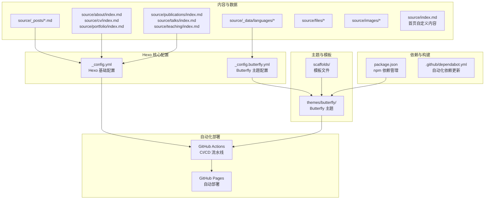
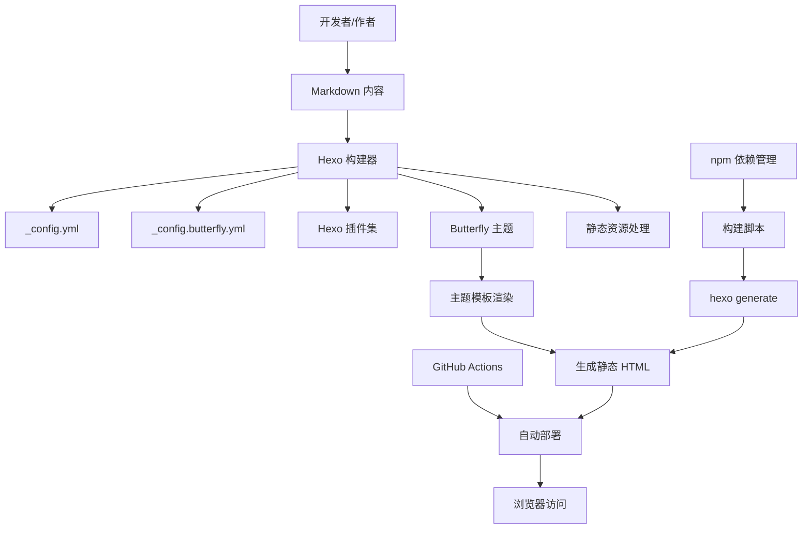
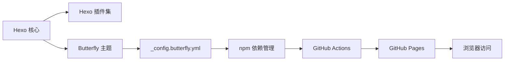

# 技术栈概览

<cite>
**本文引用的文件**
- [_config.yml](file://hexo-site/_config.yml)
- [_config.butterfly.yml](file://hexo-site/_config.butterfly.yml)
- [package.json](file://hexo-site/package.json)
- [.github/dependabot.yml](file://hexo-site/.github/dependabot.yml)
- [README.md](file://README.md)
- [开发文档.md](file://开发文档.md)
- [index.md](file://hexo-site/source/index.md)
- [about/index.md](file://hexo-site/source/about/index.md)
- [2025-03-11-useful-website.md](file://hexo-site/source/_posts/2025-03-11-useful-website.md)
</cite>

## 更新摘要
**所做更改**
- 完全重构技术栈概览以反映从Jekyll到Hexo的重大迁移
- 更新核心组件章节以涵盖Hexo静态网站生成器和Butterfly主题
- 重新设计架构总览以展示Hexo的Node.js生态系统
- 更新依赖分析以反映新的npm依赖管理和GitHub Actions自动化
- 移除Jekyll相关的Ruby生态内容，新增Hexo特有的配置和部署流程

## 目录
1. [简介](#简介)
2. [项目结构](#项目结构)
3. [核心组件](#核心组件)
4. [架构总览](#架构总览)
5. [详细组件分析](#详细组件分析)
6. [依赖分析](#依赖分析)
7. [性能考虑](#性能考虑)
8. [故障排除指南](#故障排除指南)
9. [结论](#结论)
10. [附录](#附录)

## 简介
本文件面向 Academic Pages 项目的使用者与维护者，提供技术栈的综合概览。项目已从传统的 Jekyll Ruby 生态系统完全迁移到现代的 Hexo Node.js 生态系统，重点覆盖以下方面：
- Hexo 静态网站生成器及其核心配置与插件生态
- Node.js 生态系统（npm 包管理、Hexo 插件、Butterfly 主题）
- GitHub Actions 自动化部署流程
- 技术选型优势：性能优异、安全可靠、易于维护、成本低廉
- 兼容性与运行环境要求
- 初学者背景知识与进阶技术深度

## 项目结构
该项目采用 Hexo 主题与静态站点生成的现代化组织方式，包含内容区（source/_posts、source/about、source/cv 等）、Butterfly 主题配置（themes/butterfly）、Hexo 核心配置（_config.yml）、主题特定配置（_config.butterfly.yml）以及自动化依赖管理（package.json、dependabot.yml）。整体结构简洁高效，便于内容作者专注于写作与配置，而将构建与部署交给自动化流水线。

**图表来源**
- [_config.yml:1-142](file://hexo-site/_config.yml#L1-L142)
- [_config.butterfly.yml:1-459](file://hexo-site/_config.butterfly.yml#L1-L459)
- [package.json:1-35](file://hexo-site/package.json#L1-L35)
- [.github/dependabot.yml:1-8](file://hexo-site/.github/dependabot.yml#L1-L8)

**章节来源**
- [_config.yml:1-142](file://hexo-site/_config.yml#L1-L142)
- [_config.butterfly.yml:1-459](file://hexo-site/_config.butterfly.yml#L1-L459)
- [package.json:1-35](file://hexo-site/package.json#L1-L35)
- [.github/dependabot.yml:1-8](file://hexo-site/.github/dependabot.yml#L1-L8)

## 核心组件
- **Hexo 静态生成器与配置**
  - 站点基础信息、国际化、主题、作者信息、社交链接、数学公式支持、RSS/Atom、分页与归档策略、插件配置等均在 Hexo 配置中集中定义。
  - 关键路径参考：[_config.yml:1-142](file://hexo-site/_config.yml#L1-L142)
- **Butterfly 主题系统**
  - _config.butterfly.yml 提供完整的主题配置，包括导航栏、侧边栏、代码块、暗黑模式、数学公式、Mermaid 图表等高级功能。
  - 支持多种搜索方案、社交分享、统计分析集成。
  - 关键路径参考：[_config.butterfly.yml:1-459](file://hexo-site/_config.butterfly.yml#L1-L459)
- **npm 依赖管理系统**
  - package.json 定义了 Hexo 核心、渲染器、部署器、数学公式支持、sitemap 生成等关键依赖。
  - 提供 build、clean、deploy、server 四个核心脚本命令。
  - 关键路径参考：[package.json:1-35](file://hexo-site/package.json#L1-L35)
- **自动化依赖更新**
  - Dependabot 配置实现每日自动化依赖检查和拉取请求创建。
  - 关键路径参考：[dependabot.yml:1-8](file://hexo-site/.github/dependabot.yml#L1-L8)
- **主题模板与脚手架**
  - scaffolds 目录包含 draft、page、post 三种模板类型。
  - themes/butterfly 提供完整的主题实现和自定义选项。

**章节来源**
- [_config.yml:1-142](file://hexo-site/_config.yml#L1-L142)
- [_config.butterfly.yml:1-459](file://hexo-site/_config.butterfly.yml#L1-L459)
- [package.json:1-35](file://hexo-site/package.json#L1-L35)
- [.github/dependabot.yml:1-8](file://hexo-site/.github/dependabot.yml#L1-L8)

## 架构总览
下图展示了从内容创作到静态发布的关键流程：作者在本地编辑内容，Hexo 读取配置与插件，结合 Butterfly 主题生成静态资源；npm 负责依赖管理与脚本执行；最终由 GitHub Actions 自动触发构建与部署到 GitHub Pages。

**图表来源**
- [_config.yml:1-142](file://hexo-site/_config.yml#L1-L142)
- [_config.butterfly.yml:1-459](file://hexo-site/_config.butterfly.yml#L1-L459)
- [package.json:5-10](file://hexo-site/package.json#L5-L10)

## 详细组件分析

### Hexo 配置与插件体系
- **站点配置**
  - 基础信息：站点标题、副标题、描述、关键词、作者信息、语言设置、时区配置。
  - URL 设置：支持 GitHub Pages 部署的 URL 配置和文章链接格式。
  - 目录结构：source_dir、public_dir、tag_dir、archive_dir 等目录配置。
  - 写作设置：新文章命名规则、默认布局、语法高亮、分页配置。
  - 扩展功能：主题选择、部署配置、插件启用。
- **插件生态**
  - 核心插件：hexo-abbrlink、hexo-deployer-git、hexo-feed、hexo-generator-* 系列。
  - 渲染器：hexo-renderer-ejs、hexo-renderer-marked、hexo-renderer-stylus。
  - 功能增强：hexo-math、hexo-wordcount、hexo-server。
  - 主题支持：hexo-theme-butterfly、hexo-theme-landscape。
- **部署配置**
  - Git 部署：自动推送至 GitHub 仓库的 main 分支。
  - 自动消息：包含时间戳的部署信息。
  - 一键部署：通过 npm 脚本 hexo deploy 实现。

**章节来源**
- [_config.yml:1-142](file://hexo-site/_config.yml#L1-L142)
- [package.json:14-33](file://hexo-site/package.json#L14-L33)

### Butterfly 主题深度解析
- **导航栏配置**
  - Logo 设置：支持自定义头像和网站标题显示。
  - 固定导航：支持导航栏固定在页面顶部。
  - 菜单定制：灵活的菜单项配置，支持 Font Awesome 图标。
- **侧边栏功能**
  - 作者信息卡片：包含个人简介和社交链接。
  - 最新文章：显示最近的博客文章列表。
  - 分类统计：实时显示文章分类信息。
  - 归档功能：按时间线展示文章归档。
- **视觉特性**
  - 暗黑模式：支持自动切换的暗黑/明亮主题。
  - 代码高亮：支持多种代码块样式和复制功能。
  - 数学公式：集成 MathJax 支持 LaTeX 数学公式。
  - Mermaid 图表：客户端渲染支持流程图、时序图等。
- **交互功能**
  - 在线搜索：支持本地搜索和 Algolia 搜索。
  - 文章统计：字数统计、阅读时长、访问计数。
  - 社交分享：支持多种社交平台分享。
  - 统计分析：集成 Google Analytics、百度统计等。

**章节来源**
- [_config.butterfly.yml:1-459](file://hexo-site/_config.butterfly.yml#L1-L459)

### npm 依赖管理与自动化
- **依赖管理**
  - 核心依赖：Hexo 7.x 版本，确保最新特性和安全性。
  - 渲染器：支持 EJS、Marked、Stylus 等多种渲染器。
  - 插件生态：丰富的 Hexo 插件支持各种功能扩展。
  - 主题系统：Butterfly 主题提供现代化界面和丰富功能。
- **构建脚本**
  - build：执行 hexo generate 生成静态网站。
  - clean：清理生成的静态文件。
  - deploy：执行 hexo deploy 一键部署。
  - server：启动本地开发服务器进行预览。
- **自动化更新**
  - Dependabot 配置实现每日依赖检查。
  - 支持最多 20 个并发拉取请求。
  - 自动化安全更新和版本升级。

**章节来源**
- [package.json:1-35](file://hexo-site/package.json#L1-L35)
- [.github/dependabot.yml:1-8](file://hexo-site/.github/dependabot.yml#L1-L8)

### GitHub Actions 自动化部署
- **部署流程**
  - 代码提交触发：推送代码到 GitHub 自动触发构建。
  - 环境准备：自动安装 Node.js 和 npm 依赖。
  - 构建过程：执行 hexo generate 生成静态资源。
  - 部署发布：自动推送到 gh-pages 分支。
- **配置特点**
  - 无需手动干预：完全自动化的 CI/CD 流程。
  - 快速部署：构建完成后立即发布到 GitHub Pages。
  - 版本控制：所有部署都有明确的时间戳记录。
  - 错误处理：自动检测和报告构建错误。

**章节来源**
- [_config.yml:126-142](file://hexo-site/_config.yml#L126-L142)

## 依赖分析
- **组件耦合与职责**
  - Hexo 核心负责内容解析和静态资源生成。
  - Butterfly 主题提供完整的界面和交互功能。
  - npm 依赖管理系统确保所有工具链的一致性。
  - GitHub Actions 实现端到端的自动化部署。
- **外部依赖与集成点**
  - GitHub Pages 作为托管平台，自动执行构建与部署。
  - npm registry 提供包管理和版本控制。
  - Dependabot 实现自动化安全更新。
- **技术栈优势**
  - 现代化：基于 Node.js 的现代 JavaScript 生态系统。
  - 高效：npm 依赖管理和快速构建流程。
  - 可维护：清晰的配置分离和模块化设计。
  - 自动化：完整的 CI/CD 流程，减少人工干预。

**图表来源**
- [_config.yml:119](file://hexo-site/_config.yml#L119)
- [_config.butterfly.yml:1-459](file://hexo-site/_config.butterfly.yml#L1-L459)
- [package.json:14-33](file://hexo-site/package.json#L14-L33)

**章节来源**
- [_config.yml:119](file://hexo-site/_config.yml#L119)
- [_config.butterfly.yml:1-459](file://hexo-site/_config.butterfly.yml#L1-L459)
- [package.json:14-33](file://hexo-site/package.json#L14-L33)

## 性能考虑
- **静态输出与缓存**
  - Hexo 生成纯静态 HTML/CSS/JS，适合 CDN 和边缘加速。
  - Butterfly 主题优化了资源加载和页面渲染性能。
- **构建效率**
  - npm 依赖管理提供快速的包安装和更新。
  - GitHub Actions 实现并行构建和部署。
  - 本地开发服务器支持热重载和实时预览。
- **资源优化**
  - 内置代码压缩和图片优化功能。
  - 支持懒加载和异步资源加载。
  - CDN 集成支持全球加速访问。
- **运行时稳定性**
  - Node.js LTS 版本确保长期稳定支持。
  - 自动化测试和质量检查减少生产环境问题。

## 故障排除指南
- **本地构建失败**
  - 检查 Node.js 版本兼容性（推荐使用 LTS 版本）。
  - 清理 node_modules 和重新安装依赖：`npm ci`
  - 验证 Hexo 版本：`hexo version`
- **主题配置错误**
  - 检查 _config.butterfly.yml 语法正确性。
  - 确认图片路径和资源文件存在。
  - 验证 YAML 缩进和特殊字符编码。
- **部署失败**
  - 检查 GitHub 仓库权限和 SSH 密钥配置。
  - 验证部署分支设置和仓库 URL。
  - 查看 GitHub Actions 日志获取详细错误信息。
- **依赖更新冲突**
  - 使用 Dependabot 自动生成的拉取请求。
  - 逐个合并小版本更新以减少冲突。
  - 运行 `npm audit` 检查安全漏洞。

**章节来源**
- [package.json:1-35](file://hexo-site/package.json#L1-L35)
- [_config.butterfly.yml:1-459](file://hexo-site/_config.butterfly.yml#L1-L459)
- [_config.yml:126-142](file://hexo-site/_config.yml#L126-L142)

## 结论
Academic Pages 已成功从传统的 Jekyll Ruby 生态系统迁移到现代化的 Hexo Node.js 生态系统。新的技术栈采用"Hexo + npm + Butterfly 主题 + GitHub Actions"的组合，实现了更高的性能、更好的可维护性和更强的自动化能力。通过精心设计的配置分离、模块化的主题系统和完整的 CI/CD 流程，项目为学术型个人主页提供了更加现代化和高效的解决方案。对于初学者，建议从理解 Hexo 的配置结构和 Butterfly 主题选项开始；对于有经验的开发者，可以深入探索主题定制、插件开发和自动化流程优化。

## 附录
- **兼容性与运行环境**
  - Node.js：LTS 版本（推荐使用最新 LTS）
  - npm：最新版本，支持 package-lock.json
  - 操作系统：Windows、macOS、Linux 全平台支持
  - 浏览器：现代浏览器完全兼容
- **技术选型优势总结**
  - 性能：Hexo + Butterfly 主题的组合提供优秀的加载速度
  - 安全：npm 依赖管理和 Dependabot 自动更新
  - 易于维护：清晰的配置分离和模块化设计
  - 成本低廉：零运维、零服务器成本、完全托管于 GitHub Pages
  - 自动化：完整的 CI/CD 流程，减少人工干预
  - 扩展性强：丰富的插件生态和主题定制能力